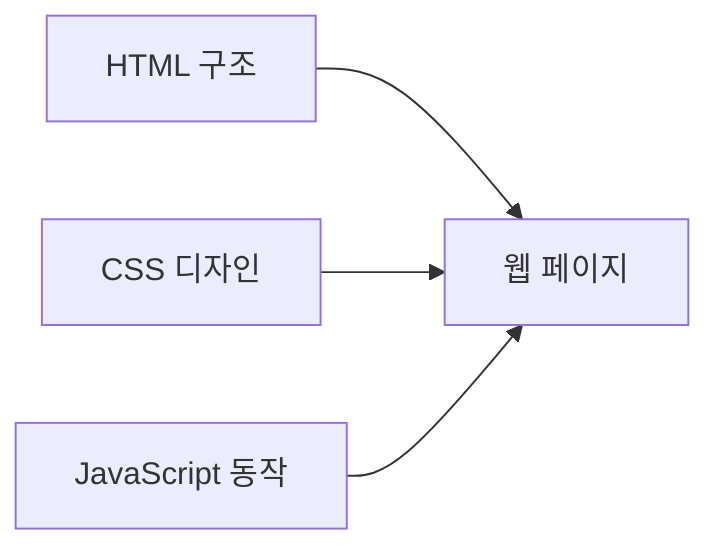

# Web 기초 요약
- HTML
- CSS
- JS

> 웹개발의 세 핵심 기술을 단계적으로 학습할 수 있도록 예제 프로그램 3개를 작성했습니다.
> 모든 예제는 별도 설치 없이 HTML 파일을 더블클릭하면 실행됩니다.

## 1. HTML·CSS·JavaScript의 역할

| 기술         | 핵심 역할        | 주요 학습 내용                  |
| ---------- | ------------ | ------------------------- |
| HTML       | 웹페이지의 구조와 의미 | 시맨틱 태그, 폼, 표, 링크, 이미지     |
| CSS        | 디자인과 화면 배치   | 박스 모델, Flexbox, Grid, 반응형 |
| JavaScript | 동작과 데이터 처리   | 변수, 함수, DOM, 이벤트, 배열, 저장소 |



## 2. 예제 프로그램

### 예제 1: 회원가입 폼

주요 학습 내용:

* `header`, `main`, `section`, `footer` 시맨틱 태그
* `form`, `fieldset`, `label`
* `input`, `select`, `textarea`, `radio`, `checkbox`
* `required`, `minlength`, `type="email"` 기본 검증
* `submit` 이벤트 처리

### 예제 2: 반응형 상품 카드

주요 학습 내용:

* CSS 선택자와 클래스
* 박스 모델과 그림자
* CSS Grid 배치
* `:hover`, `:focus` 상태 효과
* 미디어 쿼리를 이용한 반응형 웹
* `data-*` 속성과 클릭 이벤트

화면 크기에 따라 카드가 자동으로 변경됩니다.

* PC: 3열
* 태블릿: 2열
* 모바일: 1열

### 예제 3: 할 일 관리 앱

주요 학습 내용:

* `const`, `let`, 배열과 객체
* 함수와 화살표 함수
* DOM 요소 생성과 수정
* 이벤트 처리
* `filter()`, `forEach()`
* `localStorage` 데이터 저장
* 전체·진행 중·완료 필터링

브라우저를 닫았다가 다시 열어도 입력한 할 일이 유지됩니다.

## 3. 파일 다운로드

[](sandbox:/workspace/scratch/c6ed5f2ef2f4/web-core-examples.zip)

압축 파일 구성:

```text
web-core-examples
├── README.md
├── 01-semantic-form.html
├── 02-responsive-cards.html
└── 03-todo-app.html
```

추천 학습 순서는 `회원가입 폼 → 반응형 상품 카드 → 할 일 관리 앱`입니다. 각 파일을 VS Code에서 수정한 후 브라우저를 새로고침하면서 결과를 비교하면 효과적으로 학습할 수 있습니다.
