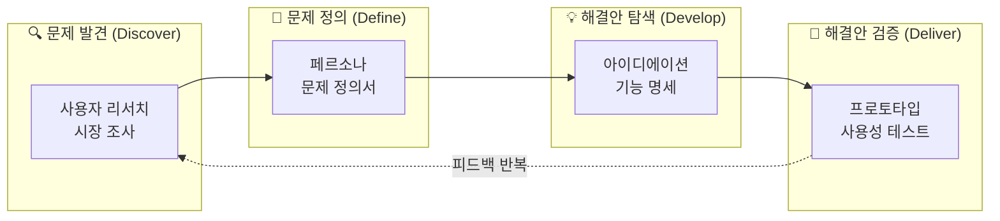
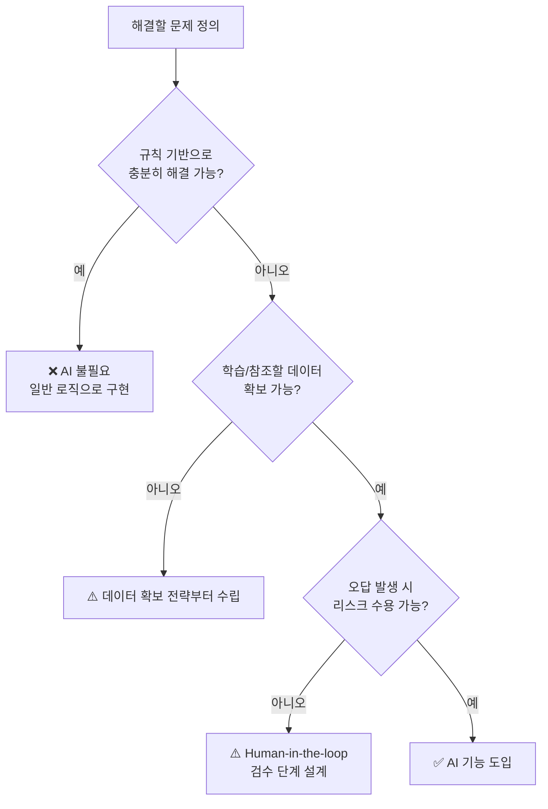
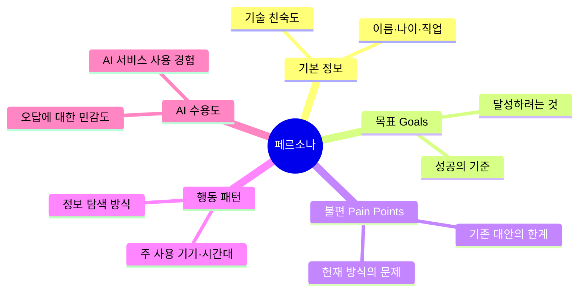
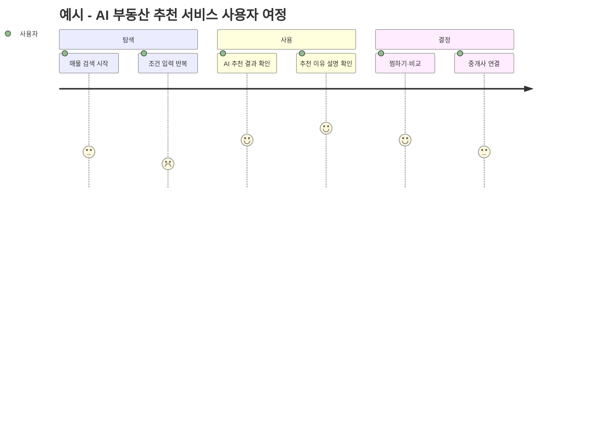
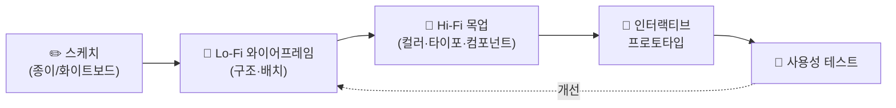
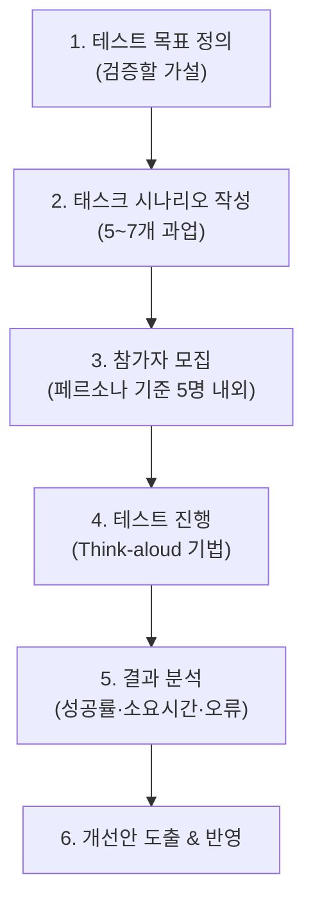

# 1. AX 프로덕트 기획 & 서비스 설계 (72h · 9일)

> **교과목 목표**: AI 기반 서비스의 방향을 스스로 정의하고, Figma로 와이어프레임을 완성하는 방법을 습득한다.

**핵심 개념**: AI 서비스 기획 프로세스 / 사용자 리서치·페르소나 / 사용자 여정 맵 / 기능 명세(MoSCoW) / Figma UI 컴포넌트 / 프로토타이핑 / 사용성 테스트(UT)

---

## 1. AI 서비스 기획 프로세스

### 1.1 전체 기획 프로세스 (더블 다이아몬드 모델)

### 1.2 AI 서비스 기획이 일반 서비스 기획과 다른 점

| 구분 | 일반 서비스 기획 | AI 서비스 기획 |
|---|---|---|
| 핵심 질문 | "어떤 기능이 필요한가?" | "AI가 이 문제를 **더 잘** 풀 수 있는가?" |
| 결과 예측 | 결정적(항상 같은 결과) | 확률적(오답·환각 가능성 고려) |
| 요구 데이터 | 기능 정의로 충분 | **데이터 확보 가능성**이 기획 단계에서 결정적 |
| 실패 설계 | 예외 처리 중심 | **AI 실패 시 폴백(fallback) UX** 필수 |
| 비용 구조 | 개발비 중심 | 개발비 + **추론(토큰) 비용** 지속 발생 |

### 1.3 AI 도입 판단 프로세스

---

## 2. 사용자 리서치 & 페르소나

### 2.1 리서치 방법 비교

| 방법 | 장점 | 단점 | 적합 시점 |
|---|---|---|---|
| **설문조사** | 대량 수집, 정량화 용이, 저비용 | 깊이 부족, 문항 편향 위험 | 가설 검증, 우선순위 파악 |
| **심층 인터뷰** | 맥락·동기 파악, 예상 밖 인사이트 | 시간·비용 큼, 소수 표본 | 문제 발견 초기 |
| **관찰 조사** | 실제 행동 데이터(말과 행동의 차이 포착) | 해석 주관성, 접근 제약 | 사용 맥락 이해 |
| **데스크 리서치** | 빠르고 저렴, 시장 전체 조망 | 2차 자료의 신뢰성 이슈 | 착수 직후 |

### 2.2 페르소나 작성 프레임

### 2.3 사용자 여정 맵 (User Journey Map)

> 실습에서는 각자 선정한 도메인으로 여정 맵을 작성하고, **감정 곡선이 낮은 구간 = AI로 개선할 기회 지점**으로 도출합니다.

---

## 3. 기능 명세 — MoSCoW 우선순위

| 등급 | 의미 | 판단 기준 | 예시 (AI 챗봇 서비스) |
|---|---|---|---|
| **M**ust | 없으면 출시 불가 | 핵심 가치 직결 | 질의응답, 대화 이력 |
| **S**hould | 중요하지만 대안 존재 | 출시 후 빠른 추가 | 답변 출처 표시 |
| **C**ould | 있으면 좋음 | 리소스 여유 시 | 음성 입력 |
| **W**on't | 이번 범위 제외 | 명시적 배제 | 다국어 지원 |

**MoSCoW의 장단점**

| 장점 | 단점 |
|---|---|
| 이해관계자 간 합의가 쉬운 직관적 언어 | Must에 과도하게 몰리는 경향 |
| 범위 협상(scope negotiation)에 유리 | 등급 내 세부 순서는 정하지 못함 |
| MVP 정의에 바로 활용 가능 | 정량적 근거 없이 정성 판단에 의존 가능 |

---

## 4. Figma UI 설계 & 프로토타이핑

### 4.1 와이어파이델리티 단계

### 4.2 프로토타이핑 도구 비교

| 도구 | 장점 | 단점 |
|---|---|---|
| **Figma** | 실시간 협업, 무료 시작, 컴포넌트/변수 시스템, 방대한 커뮤니티 리소스 | 오프라인 제약, 복잡한 로직 표현 한계 |
| **Sketch** | 가볍고 빠름, 플러그인 생태계 | macOS 전용, 협업은 별도 도구 필요 |
| **Adobe XD** | Adobe 생태계 연동 | 신규 기능 개발 중단 추세 |
| **코드 프로토타입 (v0 등 AI 도구)** | 실제 동작 검증, 개발 전환 빠름 | 디자인 시스템 통제 어려움 |

### 4.3 Figma 컴포넌트 설계 원칙

- **Atomic Design**: Atoms(버튼) → Molecules(검색바) → Organisms(헤더) → Templates → Pages
- **Auto Layout**으로 반응형 대응, **Variants**로 상태(hover/disabled) 관리
- 디자인 토큰(색상·간격·타이포)을 **Variables**로 중앙화

---

## 5. 사용성 테스트 (UT)

| UT 방식 | 장점 | 단점 |
|---|---|---|
| 대면 진행형 | 표정·행동 관찰, 즉시 추가 질문 | 비용·일정 조율 부담 |
| 원격 진행형 | 지역 제약 없음, 녹화 용이 | 환경 통제 어려움 |
| 비진행(무인)형 | 대량·저비용 | 이유(Why) 파악 어려움 |

---

## 📅 일차별 강의 계획 (9일 × 8h)

| 일차 | 이론 (4h) | 실습 (3.5h) | 회고 (0.5h) |
|:---:|---|---|---|
| 1 | AI 서비스 트렌드, 기획 프로세스 개요 | 관심 도메인 선정 & 데스크 리서치 | 도메인 공유 |
| 2 | AI 도입 판단 기준, 문제 정의 | 문제 정의서 작성, AI 적합성 평가 | 피드백 |
| 3 | 사용자 리서치 방법론 | 설문 설계 & 인터뷰 가이드 작성 | 리뷰 |
| 4 | 페르소나 & 여정 맵 이론 | 페르소나 2종 + 여정 맵 작성 | 갤러리 워크 |
| 5 | 기능 명세, MoSCoW, MVP 정의 | 기능 목록 작성 & 우선순위 워크숍 | 합의 회고 |
| 6 | Figma 기초, 컴포넌트 시스템 | Lo-Fi 와이어프레임 제작 | 크리틱 |
| 7 | 디자인 토큰, Auto Layout, Variants | Hi-Fi 목업 제작 | 크리틱 |
| 8 | 프로토타이핑, UT 설계 | 인터랙티브 프로토타입 + UT 시나리오 | 리허설 |
| 9 | UT 진행 방법, 결과 분석 | **상호 UT 진행 & 개선안 반영** | 과제 발표 준비 |

---

## 📝 과목 과제 & 미니 프로젝트

### 과제 (개인)
1. 선정 도메인의 **문제 정의서 + AI 적합성 평가서** (2p)
2. **페르소나 2종 + 사용자 여정 맵** 1식
3. **MoSCoW 기능 명세서** (Must 5개 이상 상세 기술)

### 미니 프로젝트 (팀) — "AI 서비스 기획서 & 클릭 가능한 프로토타입"
- **산출물**: 서비스 기획서(문제→리서치→기능명세), Figma 인터랙티브 프로토타입(핵심 플로우 3개 이상), UT 결과 보고서(참가자 3명 이상)
- **발표**: 5분 데모 + 3분 Q&A
- **평가 기준**: 문제-해결 정합성(30) / AI 활용 타당성(25) / 프로토타입 완성도(25) / UT 기반 개선(20)

> 💡 이 프로젝트 산출물은 이후 과목(백엔드~LLM)에서 **동일 서비스를 실제로 구현하는 기반 문서**로 사용됩니다.
