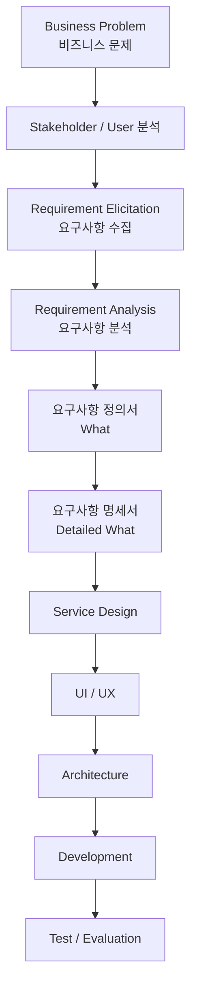
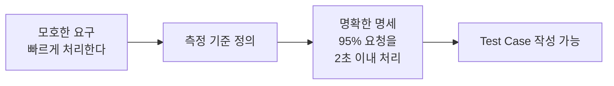
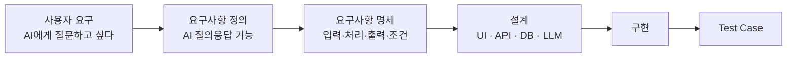

요구사항 정의서와 요구사항 명세서는 비슷해 보이지만 **작성 목적과 상세 수준이 다릅니다.**

핵심만 먼저 정리하면 다음과 같습니다.

> **요구사항 정의서 = “무엇이 필요한가?”를 정리한 문서**
> **요구사항 명세서 = “그 요구사항을 시스템이 어떻게 충족해야 하는가?”를 개발·테스트 가능한 수준으로 구체화한 문서**

### 1. 차이점 비교

| 구분      | 요구사항 정의서                | 요구사항 명세서                        |
| ------- | ----------------------- | ------------------------------- |
| 영어 표현   | Requirements Definition | Requirements Specification, SRS |
| 목적      | 필요한 요구사항을 발견하고 정의       | 요구사항을 개발 가능한 수준으로 상세화           |
| 주요 관점   | 사용자·업무·비즈니스             | 시스템·개발·테스트                      |
| 핵심 질문   | 무엇이 필요한가? 왜 필요한가?       | 시스템이 무엇을 어떻게 제공해야 하는가?          |
| 작성 시점   | 요구사항 분석 초기              | 요구사항 분석 후반                      |
| 상세 수준   | 상대적으로 개괄적               | 구체적이고 상세함                       |
| 주요 독자   | 고객, 사용자, 기획자, PM        | 개발자, 설계자, QA, 테스트 담당자           |
| 표현      | 자연어 중심                  | 자연어 + 조건 + 데이터 + 제약사항           |
| 테스트 가능성 | 반드시 필요하지 않음             | 검증·테스트 가능해야 함                   |
| 대표 내용   | 요구사항명, 목적, 사용자 요구, 우선순위 | 입력, 처리, 출력, 예외, 제약조건, 인수조건      |

---

## 2. 같은 요구사항을 두 문서에 작성하면 어떻게 다른가?

예를 들어 **쇼핑몰 로그인 기능**이 필요하다고 가정해 보겠습니다.

### 요구사항 정의서

| 항목      | 내용                                 |
| ------- | ---------------------------------- |
| 요구사항 ID | REQ-001                            |
| 요구사항명   | 회원 로그인                             |
| 요구사항 설명 | 회원은 이메일과 비밀번호를 이용하여 로그인할 수 있어야 한다. |
| 사용자     | 회원                                 |
| 목적      | 회원 전용 서비스를 이용하기 위해 사용자 인증이 필요하다.   |
| 우선순위    | Must Have                          |

이 정도에서는 **“로그인 기능이 필요하다”**는 사실을 명확히 정의하는 것이 중요합니다.

---

### 요구사항 명세서

동일한 로그인 요구사항이 다음과 같이 상세해집니다.

| 항목      | 내용                                       |
| ------- | ---------------------------------------- |
| 요구사항 ID | FR-LOGIN-001                             |
| 기능명     | 회원 로그인                                   |
| 입력      | 이메일, 비밀번호                                |
| 이메일 조건  | RFC 형식의 유효한 이메일 주소                       |
| 비밀번호 조건 | 8자 이상                                    |
| 처리      | 입력된 이메일과 비밀번호를 회원 DB와 비교하여 인증            |
| 성공 조건   | 이메일과 비밀번호가 일치                            |
| 성공 결과   | 사용자 인증 후 메인 페이지 이동                       |
| 실패 조건   | 아이디가 존재하지 않거나 비밀번호 불일치                   |
| 실패 결과   | 로그인 실패 메시지 표시                            |
| 보안 요구   | 비밀번호는 평문으로 저장하지 않음                       |
| 예외 처리   | 5회 연속 실패 시 일정 시간 로그인 제한                  |
| 성능      | 로그인 요청은 정상 환경에서 2초 이내 처리                 |
| 인수 조건   | 정상 계정으로 로그인 시 인증 토큰이 발급되고 메인 화면으로 이동해야 함 |

이 정도가 되어야 개발자가 실제 구현을 시작하고 QA 담당자가 테스트 케이스를 만들 수 있습니다.

---

## 3. 문서가 만들어지는 순서

전체 흐름에서는 다음과 같이 이해하면 좋습니다.



즉,

**요구사항 수집 → 분석 → 정의 → 명세 → 설계 → 개발 → 테스트**

방향으로 구체화됩니다.

---

## 4. 가장 중요한 차이는 '검증 가능성'

두 문서를 구분할 때 가장 유용한 기준 중 하나가 **“테스트 케이스를 만들 수 있는가?”**입니다.

예를 들어,

> 시스템은 사용하기 편리해야 한다.

이 문장은 요구는 알 수 있지만 명세로는 부적합합니다.
"편리하다"의 기준이 없기 때문입니다.

이를 다음처럼 바꾸면 명세에 가까워집니다.

> 사용자는 로그인 화면에서 이메일과 비밀번호를 입력하고 로그인 버튼을 선택하여 인증할 수 있어야 한다. 정상적인 요청의 95% 이상은 2초 이내 처리되어야 한다.

이제 테스트할 수 있습니다.



---

## 5. 요구사항 정의서에서 명세서로 발전하는 과정

예를 들어 AI 상담 서비스를 만든다면 다음처럼 세분화할 수 있습니다.

### ① 사용자 요구

> 사용자는 AI에게 질문하고 답변을 받을 수 있어야 한다.

↓

### ② 요구사항 정의

> 사용자가 채팅 화면에 자연어 질문을 입력하면 AI 상담 서비스가 답변을 제공한다.

↓

### ③ 요구사항 명세

> 사용자가 UTF-8 기준 1~2,000자의 텍스트 질문을 입력하고 전송 버튼을 누르면 시스템은 질문을 LLM에 전달한다. 정상적인 요청의 응답은 5초 이내 시작되어야 하며, 오류 발생 시 사용자에게 오류 메시지와 재시도 기능을 제공한다.

↓

### ④ 테스트 케이스

```text
Given : 사용자가 로그인되어 있고
When  : "환불 방법을 알려주세요"라고 입력하면
Then  : AI 답변이 5초 이내 시작되어야 한다.
```

이 관계는 다음과 같습니다.



---

## 6. 실무에서는 용어가 혼용되기도 한다

주의할 부분도 있습니다.

**요구사항 정의서와 요구사항 명세서의 명칭은 회사·프로젝트·방법론마다 정확히 동일하게 사용되지는 않습니다.**

어떤 회사에서는 하나의 **요구사항 정의서** 안에 상세 명세까지 작성하기도 하고, 다른 곳에서는 다음처럼 별도로 분리합니다.

```text
요구사항 정의서
        ↓
기능 요구사항 명세서
        ↓
비기능 요구사항 명세서
        ↓
화면 설계서 / API 명세서 / 데이터 명세서
```

따라서 문서의 **이름 자체보다 어떤 수준의 정보를 담느냐**가 더 중요합니다.

---

## 7. 학생 입장에서는 이렇게 구분하면 가장 쉽습니다

**요구사항 정의서**

> 고객과 사용자가 원하는 것을 정리하는 문서

**요구사항 명세서**

> 개발자와 QA가 그대로 구현하고 검증할 수 있도록 요구사항을 상세하게 만드는 문서

한 문장으로 압축하면:

> **정의서는 요구사항의 존재와 목적을 명확하게 만들고, 명세서는 그 요구사항의 조건과 기준을 명확하게 만든다.**

특히 취업 프로젝트에서는 **`사용자 요구 → 요구사항 정의서 → 기능/비기능 요구사항 명세서 → 화면·API·DB 설계 → 테스트 케이스`**까지 하나의 요구사항이 추적되도록 작성하는 방식이 가장 실무적입니다.
