# AI와 함께하는 개발 방법론

> 이 장의 핵심 메시지: **AI는 코드를 "타이핑"하는 속도를 바꿨을 뿐, "좋은 코드가 무엇인가"라는 기준을 바꾸지 않았다.**
> 설계 → 작게 쪼개기 → 명확한 지시 → 매 단계 리뷰 → 테스트로 검증 → 도구(MCP·Skill·Hook)로 자동화하는 흐름을 몸에 익히는 것이 목표다.

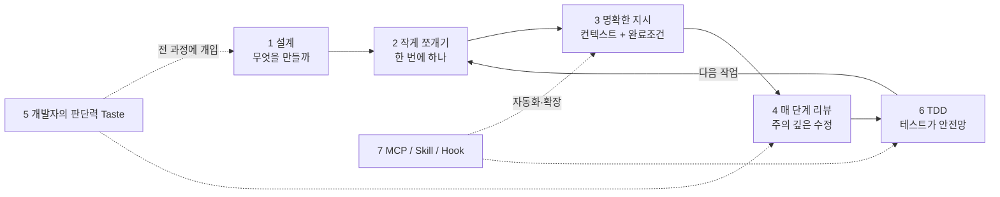

---

## 1 왜 설계가 중요한가

### 1) AI는 "바로 코딩"하려는 경향이 있다
AI 코딩 에이전트는 요청을 받으면 곧장 구현에 뛰어드는 경향이 있다. Anthropic의 Claude Code 공식 가이드는 이렇게 하면 **엉뚱한 문제를 푸는 코드**가 나올 수 있다고 경고하며, 탐색·계획을 구현과 분리하라고 권장한다.

### 2) 설계 없이 쌓인 복잡도는 AI도 감당하지 못한다
TDD의 창시자 켄트 벡(Kent Beck)은 AI와 함께 B+ 트리 라이브러리를 만들면서 **처음 두 번의 시도(BPlusTree1, 2)가 복잡도에 짓눌려 AI가 완전히 멈춰버렸다**고 회고했다. 세 번째 시도(BPlusTree3)에서는 그가 **설계에 더 적극적으로 개입**하고, AI가 앞서 나가 코딩하지 못하도록 통제하면서 비로소 성공했다.

> 교훈: AI는 "작성 속도"는 빠르지만, **복잡도를 관리하는 책임**은 여전히 개발자에게 있다. 설계는 AI가 길을 잃지 않게 해주는 지도다.

### 3) 공식 권장 워크플로: 탐색 → 계획 → 구현 → 커밋

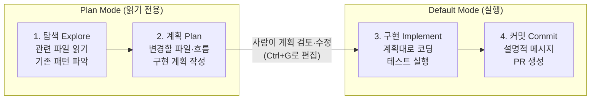

| 단계 | 모드 | 프롬프트 예시 |
|---|---|---|
| 탐색 | Plan mode (`Shift+Tab`) | "src/auth를 읽고 세션·로그인 처리 방식을 파악해줘" |
| 계획 | Plan mode | "Google OAuth를 추가하려면 어떤 파일이 바뀌어야 해? 계획을 세워줘" |
| 구현 | 기본 모드 | "계획대로 OAuth 흐름을 구현하고, 콜백 핸들러 테스트를 작성해 실행해줘" |
| 커밋 | 기본 모드 | "설명적인 메시지로 커밋하고 PR을 열어줘" |

### 4) 언제 설계를 생략해도 되나?
- **diff를 한 문장으로 설명할 수 있으면** 계획을 생략한다 (오타 수정, 로그 한 줄 추가, 변수 이름 변경 등).
- 접근법이 불확실하거나, **여러 파일을 수정**하거나, **낯선 코드**를 건드릴 때는 반드시 계획부터.

### 5) 큰 기능은 "AI에게 인터뷰 당하기"로 스펙부터
큰 기능은 AI에게 먼저 **나를 인터뷰하게** 해서 스펙 문서(SPEC.md)를 만든 뒤, **새 세션**에서 그 스펙으로 구현하는 방식이 효과적이다. 좋은 스펙은 관련 파일·인터페이스, **범위 밖(out of scope)** 항목, 그리고 **끝단 검증 방법**을 포함한다.

```text
[간단한 기능 설명]을 만들고 싶어. AskUserQuestion 도구로 나를 자세히 인터뷰해줘.
기술 구현, UI/UX, 엣지 케이스, 트레이드오프를 물어보고, 뻔한 질문 말고 내가 놓쳤을 어려운 부분을 파고들어줘.
다 끝나면 완성된 스펙을 SPEC.md로 작성해줘.
```

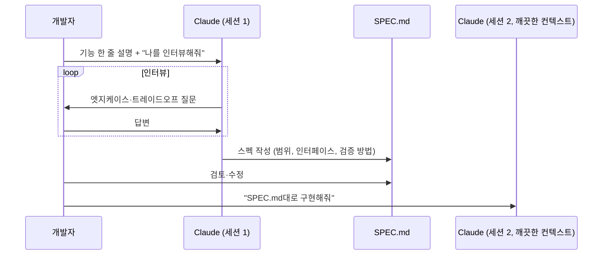

---

## 2 작은 단위로 쪼개기의 힘

### 한 번에 하나의 작업만 요청하기

**왜 하나씩인가?**
1. **컨텍스트 오염 방지** – 관련 없는 작업을 섞으면 대화 창이 무관한 정보로 가득 차 성능이 떨어진다. 공식 가이드는 이를 **"잡동사니 세션(kitchen sink session)"** 실패 패턴으로 명명했다.
2. **리뷰 가능성** – 작은 diff는 사람이 실제로 읽고 판단할 수 있다.
3. **되돌리기 용이** – 작은 단위는 문제가 생겨도 해당 단계만 롤백하면 된다.
4. **"앞서 나가기" 차단** – 켄트 벡은 AI가 요청하지 않은 기능까지 구현하는 것을 경고 신호로 봤다.

**켄트 벡의 `plan.md` + "go" 패턴**
벡은 시스템 프롬프트에서 AI에게 이렇게 지시했다 (요지):
> plan.md의 지시를 따른다. 내가 "go"라고 하면, plan.md에서 **아직 체크되지 않은 다음 테스트 하나**를 찾아 구현하고, 그 테스트를 통과시킬 **최소한의 코드만** 작성한다.

```markdown
<!-- plan.md 예시 -->
# 장바구니 모듈 테스트 계획
- [x] 빈 장바구니의 총액은 0이다
- [x] 상품 1개를 담으면 총액은 상품 가격이다
- [ ] 같은 상품을 2번 담으면 수량이 2가 된다      ← "go" 하면 이것 하나만
- [ ] 수량을 0으로 바꾸면 상품이 제거된다
- [ ] 10만원 이상이면 배송비가 0원이다
```

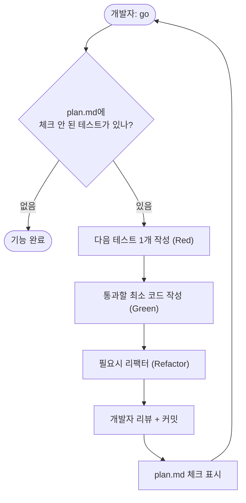

### 작업 분해의 기준과 단위

| 기준 | 설명 | 판단 질문 |
|---|---|---|
| **한 문장 diff** | 변경을 한 문장으로 설명 가능한가 | "이 작업이 끝나면 무엇이 달라지나?" 를 한 문장으로 말할 수 있는가 |
| **하나의 테스트** | 하나의 행위(behavior)를 하나의 테스트로 검증 | 실패하는 테스트 1개로 표현되는가 |
| **하나의 논리적 커밋** | 커밋 하나 = 하나의 의미 단위 | 커밋 메시지에 "그리고(and)"가 들어가지 않는가 |
| **구조 vs 행위 분리** | Tidy First: 리팩터링(구조)과 기능 변경(행위)을 섞지 않음 | 이 변경은 동작을 바꾸는가, 모양만 바꾸는가 |
| **리뷰 가능한 크기** | 사람이 15~20분 안에 읽을 수 있는 diff | 내가 이 diff를 전부 읽을 수 있는가 |
| **독립적 검증** | 단독으로 빌드·테스트가 통과 | 이 단계만으로 테스트가 초록색인가 |

**분해 예시: "회원가입 기능"**

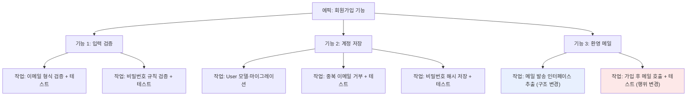

> 계층: **에픽 → 기능 → 작업(= AI 요청 1회 = 커밋 1개)**. AI에게는 항상 가장 아래 "작업" 단위로 요청한다.

---

## 3 명확한 지시의 기술

### 컨텍스트 제한의 원칙

**가장 중요한 제약: 컨텍스트 창은 빨리 차고, 찰수록 성능이 떨어진다.**
Claude Code 공식 가이드는 대부분의 모범 사례가 이 한 가지 제약에서 출발한다고 설명한다. 컨텍스트 창에는 대화 전체, AI가 읽은 모든 파일, 명령 출력이 쌓이며, 한 번의 디버깅 세션만으로 수만 토큰이 소모될 수 있다. 창이 가득 차면 AI는 앞선 지시를 "잊거나" 실수가 늘어난다.

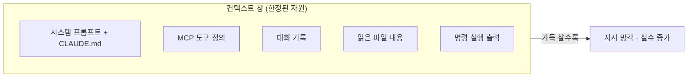

**컨텍스트를 아끼는 7가지 원칙**

| 원칙 | 방법 |
|---|---|
| 1. 작업 사이 초기화 | 무관한 작업으로 넘어갈 때 `/clear` |
| 2. 필요한 것만 지정 | 설명 대신 `@파일경로`로 정확히 참조 |
| 3. 조사는 서브에이전트로 | "서브에이전트로 X를 조사해줘" → 별도 컨텍스트에서 읽고 요약만 반환 |
| 4. 압축 제어 | `/compact API 변경 사항에 집중` 처럼 지시와 함께 압축 |
| 5. 곁가지 질문 분리 | `/btw`로 묻고 답은 대화 기록에 남기지 않기 |
| 6. CLAUDE.md는 짧게 | "이 줄을 지우면 AI가 실수할까?"에 아니오면 삭제 |
| 7. 두 번 틀리면 새로 | 같은 문제로 두 번 넘게 교정했다면 `/clear` 후 더 나은 프롬프트로 재시작 |

**CLAUDE.md에 넣을 것 / 뺄 것**

| ✅ 넣기 | ❌ 빼기 |
|---|---|
| AI가 추측할 수 없는 빌드·실행 명령 | 코드를 읽으면 알 수 있는 내용 |
| 기본값과 다른 코드 스타일 규칙 | 언어의 표준 관례 |
| 테스트 실행 방법, 선호 테스트 러너 | 상세 API 문서 (링크로 대체) |
| 브랜치·PR 규칙 | 자주 바뀌는 정보 |
| 프로젝트 고유의 아키텍처 결정 | 파일별 설명 |
| 필요한 환경 변수 등 환경 특이사항 | "깨끗한 코드를 작성하라" 같은 자명한 말 |

### 완료 조건을 명시하는 방법

AI는 **"다 된 것처럼 보이면"** 멈춘다. 실행 가능한 검증 수단이 없으면 개발자가 직접 검증 루프가 되어야 한다. 반대로 **통과/실패를 내는 검사**를 주면 AI가 스스로 "작업 → 검사 → 수정"을 반복한다.

**명확한 지시의 5요소 템플릿**

```text
[목표]     무엇을 달성하는가 (한 문장)
[범위]     어떤 파일/모듈만 건드리는가, 건드리지 말아야 할 것은?
[참고]     따라야 할 기존 패턴·예시 파일 (@경로)
[제약]     사용 금지 라이브러리, 목(mock) 사용 여부, 스타일
[완료조건] 어떤 검사가 통과하면 끝인가 + 증거(테스트 출력)를 보여줄 것
```

**Before / After 비교** (Anthropic 가이드의 예시를 우리말로 재구성)

| 전략 | ❌ 모호한 지시 | ✅ 명확한 지시 |
|---|---|---|
| 검증 기준 제공 | "이메일 검증 함수 만들어줘" | "validateEmail 함수를 작성해. `user@example.com`은 true, `invalid`와 `user@.com`은 false. 구현 후 테스트를 실행해" |
| 범위 한정 | "foo.py 테스트 추가해줘" | "foo.py에 로그아웃 상태 사용자 엣지 케이스 테스트를 작성해. 목은 쓰지 마" |
| 기존 패턴 참조 | "캘린더 위젯 추가해줘" | "홈 화면의 기존 위젯 구현(HotDogWidget.php)을 참고해 같은 패턴으로 캘린더 위젯을 만들어. 기존 라이브러리만 사용" |
| 증상 + 완료 모습 | "로그인 버그 고쳐줘" | "세션 만료 후 로그인이 실패해. src/auth/의 토큰 갱신을 확인하고, 문제를 재현하는 실패 테스트를 먼저 작성한 뒤 고쳐" |
| 근본 원인 | "빌드가 깨져" | "빌드가 [에러]로 실패해. 에러를 억누르지 말고 근본 원인을 고친 뒤 빌드 성공을 확인해" |

**완료 조건을 강제하는 강도별 방법**

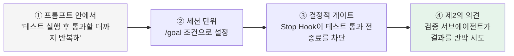

> 핵심: **"성공했다"는 말 대신 증거를 요구하라** – 테스트 출력, 실행한 명령과 결과, 스크린샷.

---

## 4 매 단계 리뷰하기: 주의 깊은 수정의 원칙

### 리뷰해야 할 것들

**① 켄트 벡이 꼽은 "AI가 궤도를 벗어나는 3대 경고 신호"**

| 경고 신호 | 예시 | 대응 |
|---|---|---|
| **루프(Loops)** | 같은 에러를 고쳤다 되돌렸다 반복 | 즉시 `Esc`로 중단, 접근 방식 재설계 |
| **요청하지 않은 기능** | 합리적인 다음 단계라도 시키지 않은 구현 | 되돌리고 범위를 다시 명시 |
| **속임수(Cheating)** | 테스트를 비활성화·삭제하거나 기대값을 바꿔 통과시킴 | 즉시 거부, 테스트 보호 Hook 설정 (6 참조) |

**② AI 생성 코드의 흔한 "티(tell)"** (Jon Atkinson의 분석 요약)
- 일어날 수 없는 상황까지 방어하는 **과잉 방어 코드** (타입이 막아주는데 null 체크 등)
- 행복 경로(happy path)만 동작하고 **도메인 지식이 필요한 엣지 케이스 누락**
- 학습 데이터 기반의 **낡은 패턴·라이브러리** 사용
- DB 호출·비즈니스 로직·표현 계층이 뒤섞인 **관심사 혼합**

**③ 리뷰 체크리스트**

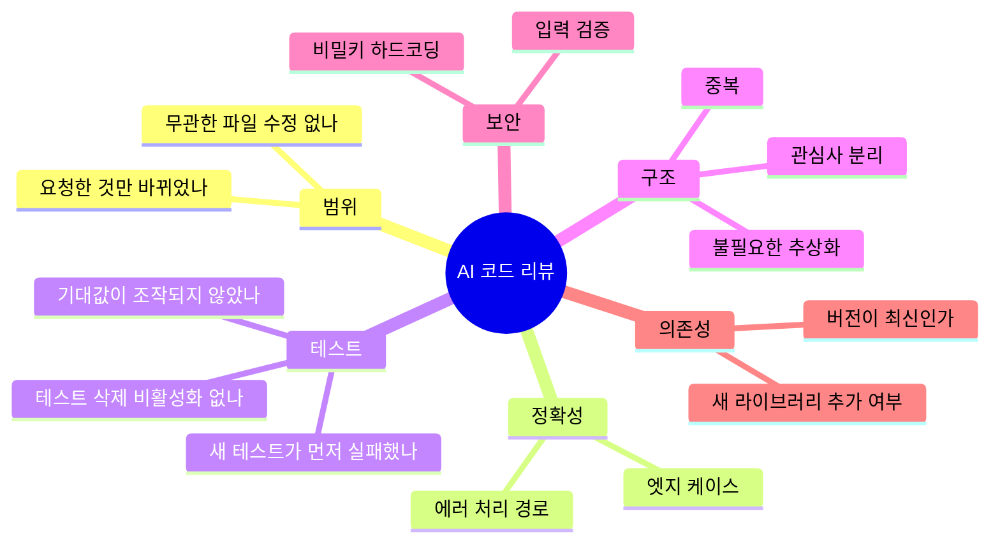

### 단계별 리뷰 습관 만들기

1. **diff를 보고 커밋한다** – AI가 "완료"라고 해도 `git diff`를 직접 읽기 전까지 커밋하지 않는다.
2. **증거로 리뷰한다** – 테스트 출력·실행 명령·스크린샷을 요구하면 재실행보다 빠르게 확인할 수 있다.
3. **작성자와 검토자를 분리한다 (Writer/Reviewer 패턴)** – 새 컨텍스트의 AI는 자기가 방금 쓴 코드에 대한 편향이 없다.
4. **적대적 리뷰는 기준을 준다** – 서브에이전트에게 "PLAN.md 대비 누락된 요구사항, 테스트 없는 엣지 케이스, 범위 밖 변경만 보고해. 스타일 취향은 제외" 처럼 지시한다. 결함을 찾으라고 하면 멀쩡한 코드에서도 무언가를 찾아내므로, 모든 지적을 반영하면 **과잉 설계**로 이어진다.
5. **커밋 메시지로 구조/행위를 표시한다** – `refactor:`(구조) / `feat:`·`fix:`(행위).

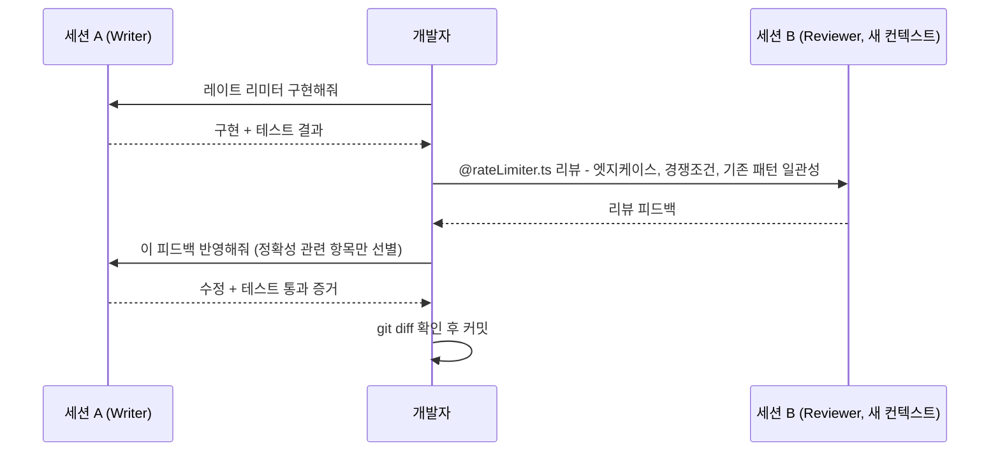

### 리뷰 워크플로와 되돌리기

**Claude Code의 되돌리기 도구**

| 도구 | 동작 | 언제 |
|---|---|---|
| `Esc` | 작업 중 즉시 중단 (컨텍스트 유지) | 잘못된 방향이 보이는 순간 |
| `Esc` `Esc` 또는 `/rewind` | 체크포인트 메뉴: 대화만 / 코드만 / 둘 다 복원, 또는 특정 지점부터 요약 | 몇 단계 전으로 돌아가고 싶을 때 |
| "방금 거 되돌려줘" | AI에게 변경 취소 요청 | 간단한 취소 |
| `/clear` | 컨텍스트 완전 초기화 | 교정을 두 번 넘게 했을 때, 작업 전환 시 |
| `git` | 커밋 단위 복원 (`git restore`, `git revert`) | 최종 안전망 |

> ⚠️ 체크포인트는 **Claude의 파일 편집 도구로 바뀐 내용만** 추적한다. Bash 명령이나 외부 프로세스가 바꾼 것은 잡지 못하므로 **git을 대체하지 않는다**. 작은 단위로 자주 커밋하자.

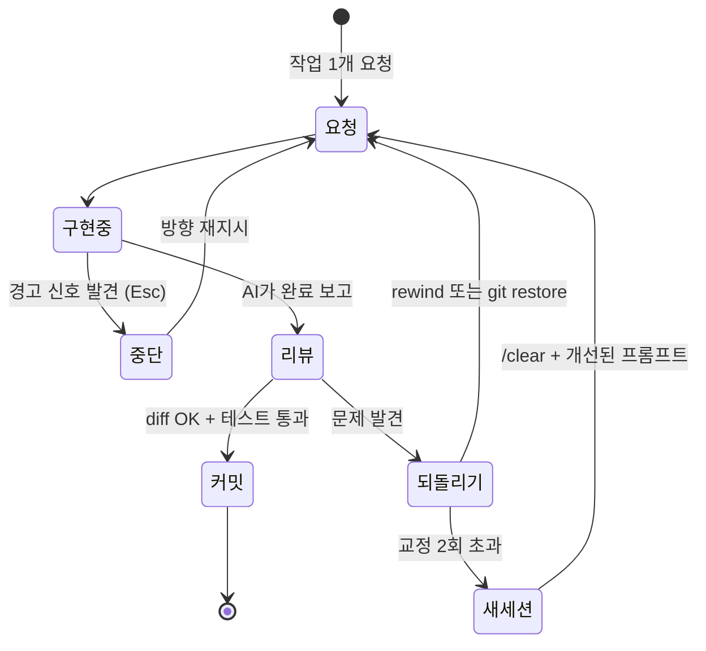

---

## 5 AI에게 없는 것 – 개발자의 판단력(Taste)

### Taste란 무엇인가
- AI는 "그럴듯하게 동작하는" 코드를 싸게 만들어낸다. 그래서 **"이 정도면 됐다"** 가 가장 위험한 말이 되었다는 지적이 나온다.
- Taste는 **이유를 다 설명하기 전에 "이건 아니다"를 알아채는 판단력**이다. 숙련된 정비사가 원인을 찾기 전에 엔진 소리가 이상하다는 것을 먼저 아는 것과 같다.
- LLM은 인터넷 전체에서 배운 "평균적 스타일"을 가지고 있다. 우리 팀·우리 코드베이스에 맞는 선택은 **개발자가 공급해야 할 정보**다.

### 켄트 벡의 관찰
- AI와 일하면 **시간당 내리는 "중요한 결정"은 늘고, 지루한 결정은 줄어든다.** 라이브러리 버전 맞추기 같은 잡무(yak shaving)는 대부분 사라진다.
- 그러나 그는 결과물의 정확성과 성능에는 만족했지만 **코드 품질에는 만족하지 못했다** – 우발적 복잡도가 너무 많았고, AI가 단순함을 자신만큼 신경 쓰게 만드는 것은 여전히 과제라고 했다.

### AI vs 개발자의 역할 분담

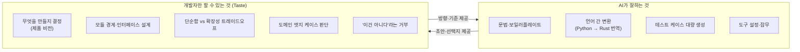

### Taste를 코드화하기
The New Stack의 분석에 따르면, 팀의 과거 PR 리뷰 코멘트를 분류하면 대략 **결정적 규칙 : 실행으로 검증 가능 : 순수 판단 ≈ 45 : 30 : 25** 정도로 나뉠 수 있다. 즉 리뷰의 상당 부분은 규칙·테스트로 옮길 수 있고, 사람은 나머지 판단에 집중하면 된다.

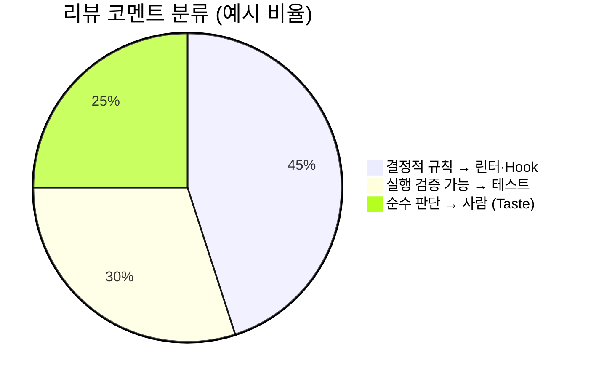

**Taste를 키우는 실천법**
1. AI 출력에 대한 **비판을 구체적인 언어로** 표현해본다 – 막연하면 아직 판단력이 덜 여문 것이다.
2. 반복되는 지적은 **CLAUDE.md 규칙 → 린터/Hook → 테스트**로 승격시킨다.
3. "지금 코드를 설명하는 문서"가 아니라 **"완벽한 코드는 어떤 모습인가"** 를 먼저 정의해 AI에게 준다.
4. 수락·거절·수정한 이유를 기록해 팀의 공통 기준으로 만든다.

---

## 6 증강코딩과 TDD – AI 시대의 개발 방식

### 증강코딩: AI 시대의 새로운 개발 방식

켄트 벡은 **바이브 코딩(Vibe Coding)** 과 **증강 코딩(Augmented Coding)** 을 구분한다.

| 구분 | 바이브 코딩 | 증강 코딩 |
|---|---|---|
| 관심사 | 시스템의 **동작**만 | 코드, 복잡도, 테스트, 커버리지 |
| 에러 대응 | 에러를 AI에 다시 넣고 "충분히 괜찮은" 수정을 기대 | 테스트·설계로 원인을 통제 |
| 가치 체계 | 일단 돌아가면 OK | 손코딩과 동일: **"작동하는 깔끔한 코드"** |
| 개발자 역할 | 프롬프트 입력자 | 설계자·감독자 (AI = 지휘할 주니어 엔지니어) |
| 적합한 곳 | 프로토타입, 일회성 스크립트 | 프로덕션 코드, 장기 유지보수 |

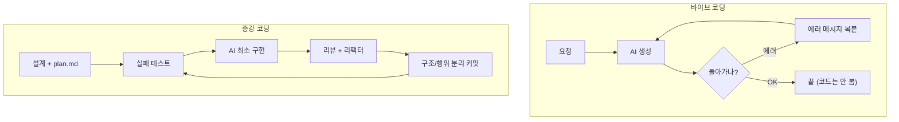

### AI 출력의 비결정적 특성과 TDD

- LLM은 **같은 프롬프트에도 매번 다른 코드**를 낼 수 있다. 오늘 통과한 방식이 내일 재생성하면 달라질 수 있다.
- 따라서 "무엇이 맞는가"는 **프롬프트가 아니라 테스트에 고정**해야 한다. 테스트는 비결정적인 생성기 위에 얹는 **결정적인 명세**다.
- 벡의 B+ 트리 사례: Rust에서 복잡도에 막히자 **같은 테스트**로 Python 버전을 먼저 완성하고, 그 Python 코드를 Rust로 옮기게 해 돌파했다. 구현 언어가 바뀌어도 **테스트가 기준점** 역할을 했다.

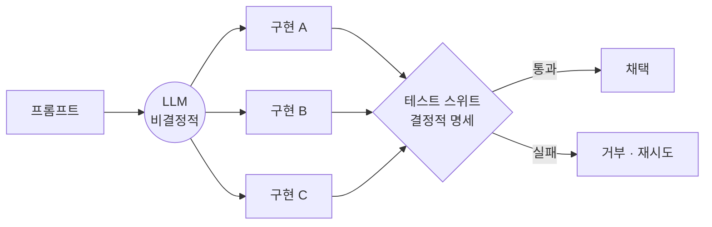

**켄트 벡 TDD 시스템 프롬프트의 핵심 규칙 (요약·번역)**

| 영역 | 규칙 |
|---|---|
| TDD 사이클 | 항상 Red → Green → Refactor. 가장 단순한 실패 테스트부터. 통과할 최소 코드만. |
| 테스트 이름 | 행위를 설명하는 이름 (예: `shouldSumTwoPositiveNumbers`) |
| Tidy First | 구조 변경(이름 변경, 메서드 추출, 이동)과 행위 변경을 **같은 커밋에 섞지 않음**. 둘 다 필요하면 구조 변경 먼저. 구조 변경 전후로 테스트 실행. |
| 커밋 규율 | 모든 테스트 통과 + 모든 경고 해결 + 하나의 논리 단위일 때만 커밋. 작고 잦은 커밋. |
| 코드 품질 | 중복 제거, 의도가 드러나는 이름, 의존성 명시, 작은 메서드, 상태·부작용 최소화 |
| 실행 | 한 번에 테스트 하나. 매번 (오래 걸리는 것 제외) **전체 테스트** 실행. |

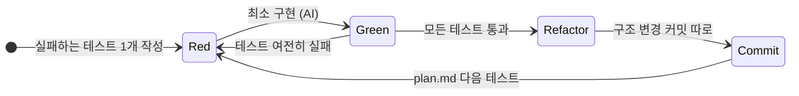

### AI가 TDD 사이클을 무시할 때 대응법

AI는 종종 TDD 지시를 무시하고 테스트와 구현을 한꺼번에 "우다다" 작성한다. 대응 전략을 강도 순으로 정리하면:

| 단계 | 방법 | 설명 |
|---|---|---|
| 1 | **시스템 프롬프트/CLAUDE.md에 규칙 명시** | 벡의 프롬프트처럼 사이클과 "테스트 하나씩"을 명문화 |
| 2 | **plan.md + "go" 한 걸음씩** | AI가 다음 테스트 하나만 보게 해서 앞서 나가기를 원천 차단 |
| 3 | **단계별로 따로 요청** | "실패하는 테스트만 작성하고 실행해서 실패를 보여줘. 구현은 하지 마" → 확인 후 "이제 통과시켜" |
| 4 | **현재 TDD 단계를 파일로 알리기** | 벡의 글 댓글에 소개된 아이디어: 사람이 단계를 전환하면 확장 프로그램이 단계를 JSON 파일에 기록하고, AI는 작업 전 그 파일을 읽어 해당 단계 규칙만 따른다 |
| 5 | **테스트 작성자와 구현자 분리** | 한 세션은 테스트만, 다른 세션은 그 테스트를 통과하는 코드만 작성 |
| 6 | **Hook으로 강제** | 규칙이 아니라 시스템으로 막는다 (아래 예시) |
| 7 | **이탈 즉시 중단** | 요청하지 않은 구현이 보이면 `Esc` → `/rewind` |

```text
# 3단계 예시 프롬프트
[Red]  "plan.md의 다음 테스트 하나만 작성하고 실행해서 실패 출력을 보여줘. 프로덕션 코드는 건드리지 마."
[Green] "이 테스트만 통과시키는 최소한의 코드를 작성하고 전체 테스트를 실행해."
[Refactor] "동작 변경 없이 중복만 제거해. 전후로 전체 테스트를 실행하고 결과를 보여줘."
```

### AI가 만드는 회귀 방지하기

AI가 기능 하나를 고치면서 **다른 곳을 조용히 망가뜨리는 것(회귀, regression)** 은 흔한 문제다.

**회귀 방지 전략**
1. **매 단계 전체 테스트 실행** – 수정한 부분의 테스트만 돌리면 회귀를 놓친다.
2. **Tidy First** – 구조 변경과 행위 변경을 분리하면, 구조 변경 커밋에서 테스트가 깨질 경우 "리팩터링이 동작을 바꿨다"는 것이 명확하다.
3. **버그는 재현 테스트부터** – 버그 수정 요청 시 "먼저 재현하는 실패 테스트를 작성하라"고 지시해, 같은 버그의 재발을 막는다.
4. **테스트 파일 보호** – AI가 테스트를 수정·삭제해 통과시키는 "속임수"를 Hook으로 차단.
5. **Stop Hook으로 완료 게이트** – 테스트가 통과하지 않으면 AI가 턴을 끝내지 못하게 한다.
6. **커버리지 확인** – 벡은 AI에게 커버리지 도구를 돌려 신뢰도를 높일 테스트를 제안하게 했다.

**예시: 테스트 파일 보호 Hook** (`.claude/settings.json`)

```json
{
  "hooks": {
    "PreToolUse": [
      {
        "matcher": "Edit|Write",
        "hooks": [
          { "type": "command", "command": ".claude/hooks/protect-tests.sh" }
        ]
      }
    ]
  }
}
```

```bash
#!/usr/bin/env bash
# .claude/hooks/protect-tests.sh
# Hook은 stdin으로 JSON을 받는다. 수정 대상 경로를 꺼내서 검사.
FILE=$(jq -r '.tool_input.file_path // empty')
if [[ "$FILE" == *"/tests/"* || "$FILE" == *".test."* || "$FILE" == *"_test."* ]]; then
  echo "기존 테스트 파일 수정은 차단됨: $FILE. 테스트가 아니라 구현을 고쳐라. 테스트 변경이 필요하면 사람에게 요청하라." >&2
  exit 2   # exit 2 = 차단 + stderr 메시지를 AI에게 전달 (exit 1은 차단하지 않음에 주의)
fi
exit 0
```

> 💡 Red 단계에서 **새 테스트 작성**이 필요하므로, 실제 수업에서는 "새 테스트 파일 생성(Write)은 허용, 기존 테스트 수정(Edit)은 차단" 처럼 규칙을 세분화하거나, Red 단계에서만 Hook을 끄는 식으로 운영한다.

**예시: 테스트 통과 전 종료 금지 Stop Hook**

```json
{
  "hooks": {
    "Stop": [
      {
        "hooks": [
          { "type": "command", "command": "npm test --silent || (echo '테스트 실패: 통과할 때까지 계속 수정하라' >&2; exit 2)" }
        ]
      }
    ]
  }
}
```

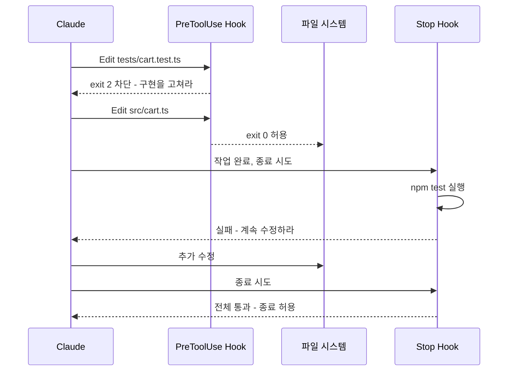

### 테스트가 진짜 안전망이 되려면

테스트가 있다고 안전한 것이 아니다. **AI가 쓴 테스트는 AI가 쓴 코드와 같은 착각을 공유**할 수 있다.

| 조건 | 체크 포인트 |
|---|---|
| **먼저 실패하는 것을 확인** | Red를 눈으로 본 적 없는 테스트는 아무것도 검증하지 않을 수 있다 |
| **행위를 검증** | 내부 구현(private 메서드 호출 횟수 등)이 아니라 입력→출력·관찰 가능한 결과를 검증 |
| **과도한 목(mock) 경계** | 목으로 도배하면 "목과 목이 대화하는" 테스트가 됨. 공식 가이드 예시처럼 "목 쓰지 마"를 명시 |
| **사람이 테스트를 리뷰** | 구현보다 **테스트 리뷰에 더 시간을** 쓴다. 테스트가 곧 명세 |
| **엣지 케이스는 사람이 지정** | 도메인 지식이 필요한 경계값은 개발자가 plan.md에 직접 적는다 |
| **기대값 조작 감시** | diff에서 `expect(...)` 값이 바뀌었다면 반드시 이유를 확인 |
| **빠르게, 매번** | 느린 테스트는 안 돌리게 된다. 빠른 단위 테스트는 매 단계, 느린 테스트는 커밋 전 |
| **독립된 검증** | 테스트 작성 세션과 구현 세션을 분리하거나, 검증 서브에이전트가 반박 시도 |
| **(심화) 뮤테이션 테스트** | 코드를 일부러 바꿨을 때 테스트가 실패하는지로 테스트의 힘을 측정 |

---

## 7 클로드 코드에서 MCP 설정하기

### MCP란?
**MCP(Model Context Protocol)** 는 AI가 외부 도구·데이터 소스에 연결되는 **개방형 표준 인터페이스**다. 서비스마다 통합 코드를 따로 짤 필요 없이, MCP 서버 하나를 붙이면 AI가 그 도구를 사용할 수 있다. MCP 서버는 세 가지를 노출한다:
- **Tools** – 행동 (예: GitHub PR 생성)
- **Resources** – 데이터 (예: DB 레코드)
- **Prompts** – 재사용 가능한 템플릿

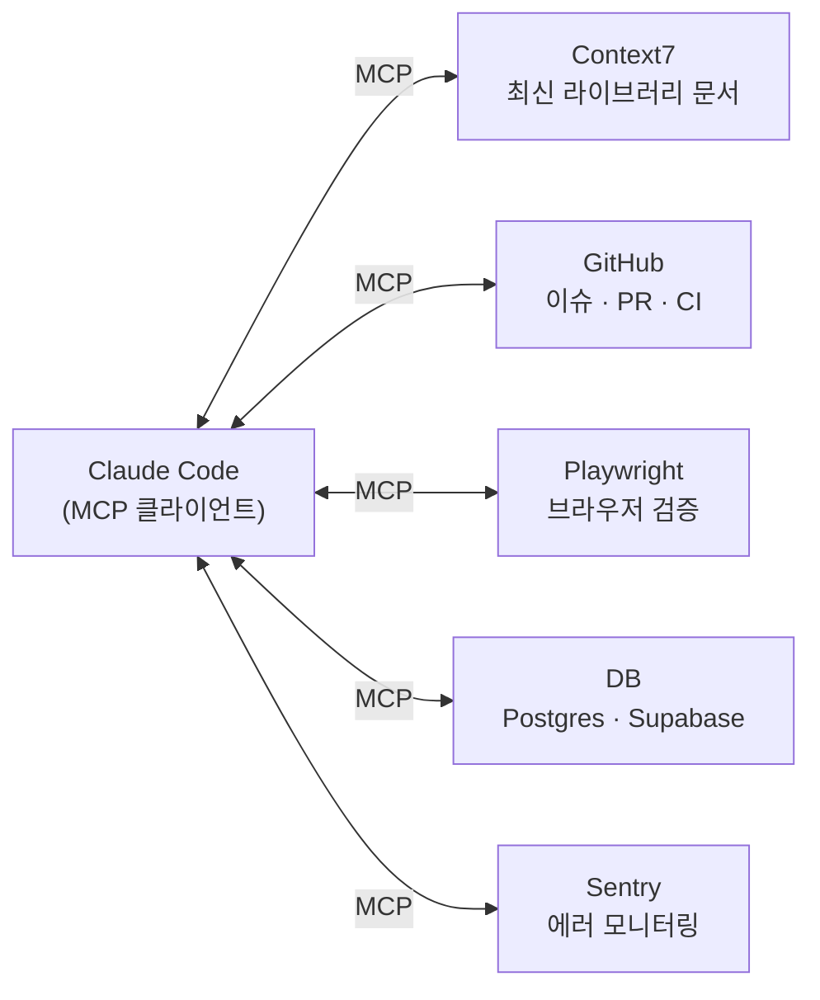

### MCP 서버 연결과 설정

**기본 명령어**

```bash
# 원격(HTTP) 서버 추가
claude mcp add --transport http <이름> <URL>
claude mcp add --transport http notion https://mcp.notion.com/mcp

# 인증 헤더가 필요한 원격 서버
claude mcp add --transport http secure-api https://api.example.com/mcp \
  --header "Authorization: Bearer $TOKEN"

# 로컬(stdio) 서버 추가: -- 뒤가 실행 명령
claude mcp add <이름> -- npx -y <패키지>

# 환경 변수 전달
claude mcp add <이름> -e API_KEY=xxx -- npx -y <패키지>

# JSON 블록으로 추가 (다른 클라이언트용 설정을 옮길 때)
claude mcp add-json <이름> '{"command":"npx","args":["-y","<패키지>"]}'

# 관리
claude mcp list          # 목록
claude mcp get <이름>    # 상세
claude mcp remove <이름> # 삭제
/mcp                     # Claude Code 안에서 상태 확인·OAuth 인증
```

**설치 범위(Scope) – 가장 중요한 개념**

| Scope | 적용 범위 | 팀 공유 | 저장 위치 | 용도 |
|---|---|---|---|---|
| `local` (기본값) | 현재 프로젝트, 나만 | ✗ | `~/.claude.json` (프로젝트 항목 아래) | 실험, 개인 토큰이 필요한 서버 |
| `project` | 현재 프로젝트, 팀 전체 | ✓ (git 커밋) | 프로젝트 루트 `.mcp.json` | 팀 공통 도구 |
| `user` | 내 모든 프로젝트 | ✗ | `~/.claude.json` (최상위 `mcpServers`) | 어디서나 쓰는 개인 도구 (예: Context7) |

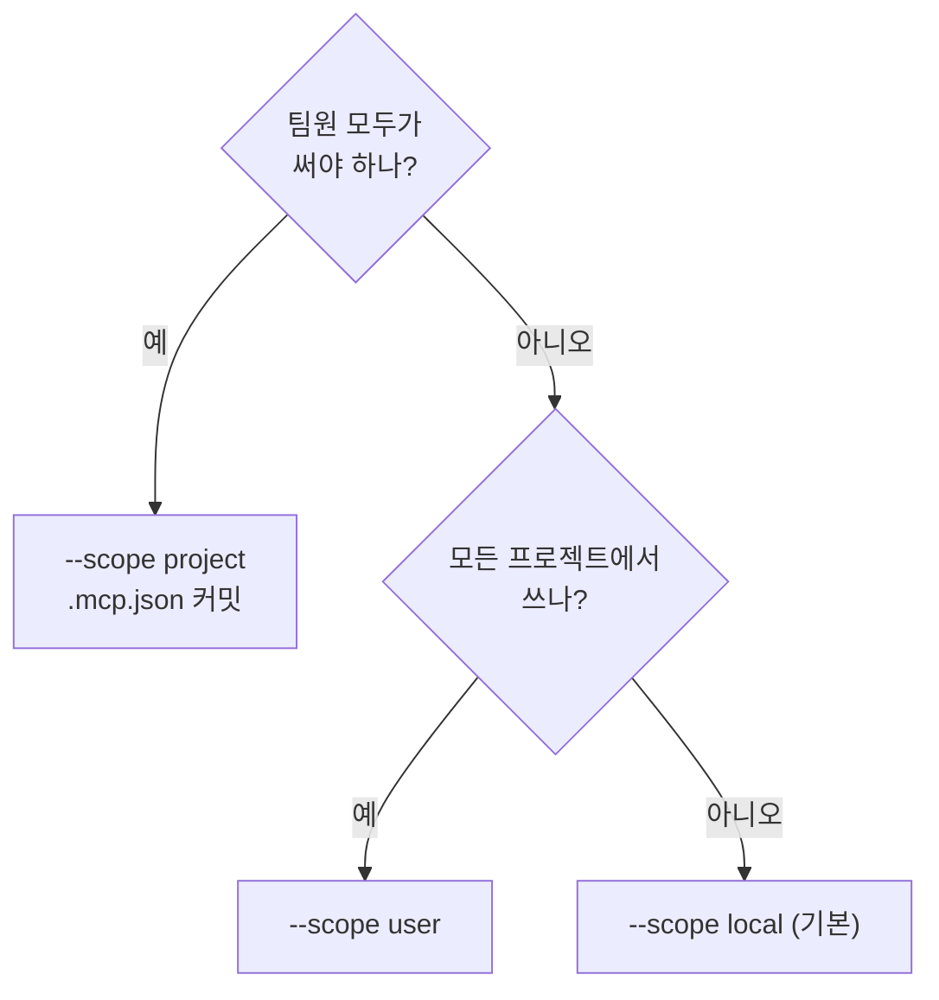

**팀 공유용 `.mcp.json` 예시** – 비밀값은 환경 변수로 분리

```json
{
  "mcpServers": {
    "github": {
      "type": "http",
      "url": "https://api.githubcopilot.com/mcp/",
      "headers": { "Authorization": "Bearer ${GITHUB_PAT}" }
    },
    "playwright": {
      "command": "npx",
      "args": ["@playwright/mcp@latest"]
    },
    "db": {
      "command": "npx",
      "args": ["-y", "@modelcontextprotocol/server-postgres", "${DATABASE_URL:-postgresql://localhost/devdb}"]
    }
  }
}
```

- `${VAR}` : 환경 변수 값으로 치환 / `${VAR:-기본값}` : 없으면 기본값
- 보안상 `.mcp.json`의 프로젝트 서버는 **처음 사용할 때 승인 프롬프트**가 뜬다. 승인 선택을 초기화하려면 `claude mcp reset-project-choices`.

### 개발에 필수적인 MCP 서버

| 서버 | 역할 | 권장 Scope | 왜 필요한가 |
|---|---|---|---|
| **Context7** | 버전별 최신 라이브러리 문서 조회 | user | 학습 시점 이후 바뀐 API를 AI가 **지어내는(환각) 문제**를 줄임 |
| **GitHub** | 저장소·이슈·PR·CI 작업 | project/user | 이슈 읽고 → 구현 → PR까지 한 흐름. 단, 도구 정의가 커서 컨텍스트를 많이 씀 |
| **Playwright** | 실제 브라우저 자동화 | project | 프론트엔드 변경을 **추측이 아닌 실제 화면으로 검증** |
| **Sequential Thinking** | 구조화된 단계별 사고 | user | 복잡한 설계·디버깅 사고 보조 |
| **Serena** | LSP 기반 시맨틱 코드 탐색·편집 | project | 큰 코드베이스에서 심볼 단위 탐색으로 파일 통째 읽기를 줄임 |
| **Postgres/Supabase** | DB 스키마 조회·쿼리 | project | 마이그레이션·쿼리 작성 보조 (읽기 전용 권한 권장) |
| **Sentry** | 에러 추적 | project | 운영 에러를 에디터에서 바로 분석 |

**설치 예시** (명령은 각 프로젝트 README에서 최신 여부를 확인할 것)

```bash
# Context7 – 모든 프로젝트에서
claude mcp add --scope user --transport http context7 https://mcp.context7.com/mcp

# Playwright – 이 프로젝트 팀 공유
claude mcp add --scope project playwright -- npx @playwright/mcp@latest

# Sequential Thinking
claude mcp add --scope user sequential-thinking -- npx -y @modelcontextprotocol/server-sequential-thinking

# Serena – 프로젝트 루트에서
claude mcp add serena -- uvx --from git+https://github.com/oraios/serena \
  serena start-mcp-server --context ide-assistant --project $(pwd)
```

> 💡 **CLI가 있으면 CLI가 먼저**: Anthropic 가이드는 `gh`, `aws`, `gcloud` 같은 CLI 도구가 외부 서비스와 상호작용하는 **가장 컨텍스트 효율적인 방법**이라고 설명한다. GitHub는 `gh` CLI만으로 충분한 경우가 많다.
> 추천 입문 세트: **Context7 + GitHub(또는 gh CLI) + Playwright** 세 개로 시작해 필요에 따라 추가.

### Skill, Hook, MCP 확장 기능 사용의 원칙

**5가지 확장 수단의 역할 구분**

| 수단 | 성격 | 누가 실행을 결정? | 결정적? | 적합한 예 |
|---|---|---|---|---|
| **CLAUDE.md** | 안내 (Guidance) | 매 세션 항상 로드 | ✗ (권고) | "npm 대신 pnpm", 테스트 명령 |
| **Skill** (`.claude/skills/*/SKILL.md`) | 능력 (Capability) | AI가 관련 있다고 판단할 때 / `/skill-name` | ✗ | API 규약, "이슈 고치기" 절차 |
| **Hook** (`settings.json`) | 강제 (Enforcement) | 이벤트 발생 시 **항상** | ✓ | 편집 후 포맷터, `rm -rf` 차단, 테스트 게이트 |
| **MCP** | 연결 (Connection) | AI가 도구 호출 | ✗ | GitHub, DB, 브라우저 |
| **Subagent** (`.claude/agents/`) | 격리 (Isolation) | 위임 시 | ✗ | 보안 리뷰어, 대규모 조사 |

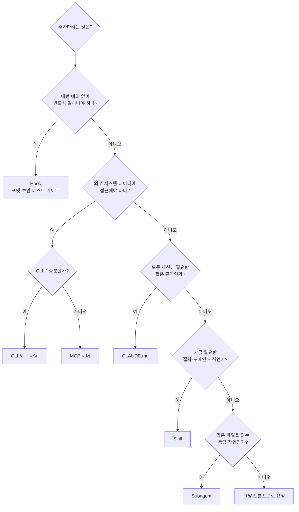

**사용 원칙 7가지**

1. **최소한으로 시작하라** – 불편함이 생길 때마다 Hook·Skill을 추가하고 싶어지지만, 대부분은 더 나은 프롬프트나 CLAUDE.md 한 줄로 해결된다.
2. **"반드시"는 Hook, "되도록"은 CLAUDE.md** – CLAUDE.md에서 *왜*를 설명하고, Hook으로 *무엇*을 강제한다. 모델이 지시를 무시할 수 있는 이상, 보장이 필요한 것은 시스템이 실행해야 한다.
3. **CLAUDE.md는 가볍게, 가끔 쓰는 지식은 Skill로** – Skill은 필요할 때만 로드되어 매 대화를 부풀리지 않는다.
4. **MCP는 컨텍스트 비용이다** – 도구 정의 자체가 컨텍스트를 차지한다. 안 쓰는 서버는 끄고, 필요한 프로젝트에만 project scope로.
5. **부작용 있는 Skill은 수동 호출로** – 배포·PR 생성 같은 절차는 `disable-model-invocation: true`로 AI가 임의로 실행하지 않게 한다.
6. **Hook의 exit code를 정확히** – `exit 0` 허용, `exit 2` 차단(메시지가 AI에게 전달), `exit 1`은 **차단하지 않는다**는 점이 흔한 실수다.
7. **보안: 신뢰할 수 있는 서버만, 최소 권한으로** – 출처가 불분명한 MCP 서버는 설치하지 않고, 토큰은 필요한 범위로 제한하며, 비밀값은 `${VAR}`로 분리해 git에 올리지 않는다.

**Skill 예시** (`.claude/skills/fix-issue/SKILL.md`)

```markdown
---
name: fix-issue
description: GitHub 이슈를 TDD 방식으로 수정한다
disable-model-invocation: true
---
GitHub 이슈 $ARGUMENTS 를 분석하고 수정하라.
1. `gh issue view`로 이슈 내용을 확인한다
2. 문제를 재현하는 실패 테스트를 먼저 작성하고 실패를 확인한다
3. 테스트를 통과시키는 최소한의 수정을 한다
4. 전체 테스트, 린트, 타입 체크를 실행한다
5. 설명적인 커밋 메시지로 커밋하고 PR을 생성한다
```
→ `/fix-issue 1234` 로 호출

---

## 장 정리

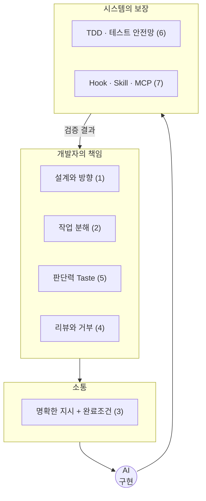

| 절 | 한 줄 요약 |
|---|---|
| 1 | 바로 코딩하지 말고 탐색 → 계획 → 구현 → 커밋 |
| 2 | 한 번에 하나, 한 작업 = 한 테스트 = 한 커밋 |
| 3 | 컨텍스트는 가장 귀한 자원, 완료 조건은 실행 가능한 검사로 |
| 4 | 루프·범위 초과·테스트 조작을 감시하고, 증거로 리뷰하고, 과감히 되돌려라 |
| 5 | 코드는 싸졌고 판단력은 비싸졌다 |
| 6 | 비결정적 AI 위에 결정적 테스트를 세우고, 규칙은 Hook으로 강제 |
| 7 | MCP는 연결, Skill은 능력, Hook은 강제 – 최소한으로, 목적에 맞게 |

## 실습 과제 (수업용)

1. **설계 실습**: Plan mode로 기존 프로젝트를 탐색하고, "비밀번호 재설정 기능" 구현 계획을 받아 사람이 수정한 뒤 구현까지 진행한다.
2. **분해 실습**: "게시판 CRUD"를 에픽 → 기능 → 작업으로 분해해 `plan.md`를 작성한다 (작업 10개 이상).
3. **지시 실습**: 모호한 프롬프트 3개를 5요소 템플릿으로 재작성하고, 결과물의 수정 횟수를 비교한다.
4. **TDD 실습**: 켄트 벡 시스템 프롬프트를 CLAUDE.md에 넣고 "go" 방식으로 장바구니 모듈을 구현한다. 구조/행위 커밋을 분리한다.
5. **Hook 실습**: 테스트 파일 보호 Hook과 Stop Hook을 설정하고, AI에게 "테스트를 고쳐서라도 통과시켜"라고 요청해 차단되는지 확인한다.
6. **MCP 실습**: Context7(user), Playwright(project)를 설치하고 `.mcp.json`을 팀 저장소에 커밋한 뒤 `/mcp`로 상태를 확인한다.

---

## 참고 자료

- Kent Beck, *Augmented Coding: Beyond the Vibes* – https://newsletter.kentbeck.com/p/augmented-coding-beyond-the-vibes
- Kent Beck, BPlusTree3 저장소 – https://github.com/KentBeck/BPlusTree3
- 켄트 벡 증강 코딩 한국어 해설 (velog) – https://velog.io/@qlgks1/Kent-Beck-Augmented-Coding
- Claude Code 공식 Best Practices – https://code.claude.com/docs/en/best-practices
- Claude Code 공식 MCP 문서 – https://code.claude.com/docs/en/mcp
- Claude Code MCP Quickstart (Scope 설명) – https://code.claude.com/docs/en/mcp-quickstart
- Claude Code Hooks 가이드 – https://code.claude.com/docs/en/hooks-guide
- Claude Code Skills – https://code.claude.com/docs/en/skills
- Claude Code Hooks vs Skills (DEV) – https://dev.to/rikuq/claude-code-hooks-vs-skills-when-to-use-which-ple
- Claude Code Hooks Explained – https://blakecrosley.com/blog/claude-code-hooks-explained
- 11 Best MCP Servers for Claude Code (2026) – https://techsy.io/en/blog/best-mcp-servers-claude-code
- Jon Atkinson, *Developing Good Engineering Taste* – https://www.jonatkinson.co.uk/blog/good-taste/
- The New Stack, *Code review is a taste problem* – https://thenewstack.io/code-review-taste-problem/
- *When AI Writes All the Code… The Case for Taste* (DEV) – https://dev.to/trismegistus/when-ai-writes-all-the-code-whats-left-for-developers-the-case-for-taste-980
