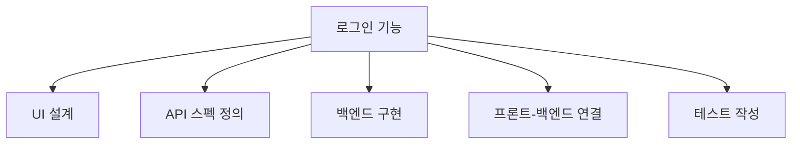
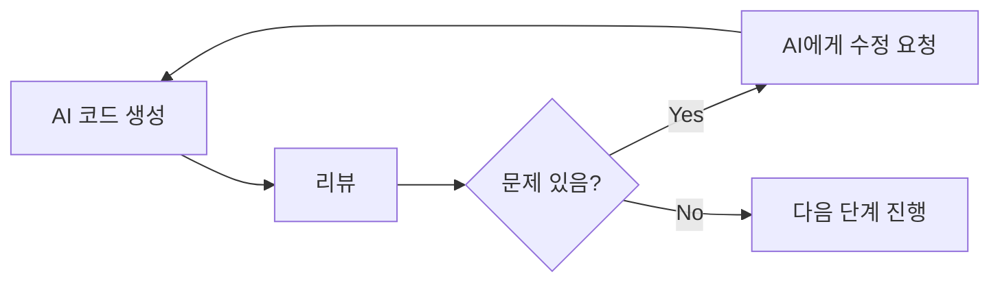
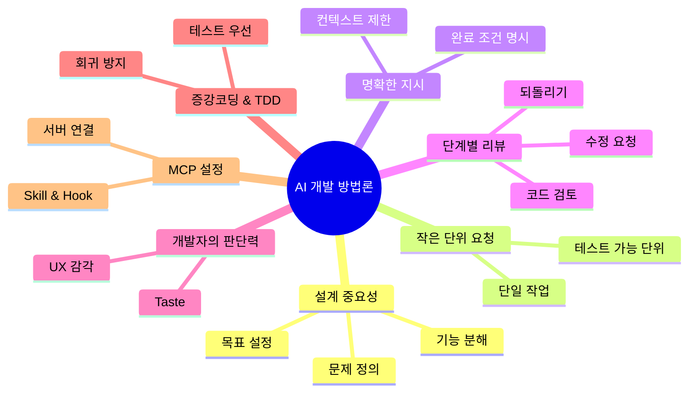

# AI와 함께하는 개발 방법론

# 🟦 **1. 왜 설계가 중요한가**

AI 시대에도 설계는 여전히 핵심이다.  
AI가 코드를 대신 작성해줄 수는 있지만, **무엇을 만들지 결정하는 것은 인간의 역할**이기 때문이다.

### ✔ 설계가 중요한 이유
- AI는 “요청한 것”만 만든다 → **요청이 잘못되면 결과도 잘못됨**
- 설계가 없으면 AI가 만든 코드는 **일관성이 없고 유지보수가 어려움**
- 설계는 **문제 정의 → 목표 설정 → 기능 분해 → 흐름 설계**의 과정

### ✔ AI 시대 설계의 핵심
- AI에게 **명확한 목표**를 전달해야 한다  
- AI가 잘못된 방향으로 가지 않도록 **가드레일(제약)**을 설정해야 한다  
- 설계가 잘 되어야 AI가 **정확하고 재사용 가능한 코드**를 생성한다

---

# 🟩 **2. 작은 단위로 쪼개기의 힘**

AI에게 큰 작업을 한 번에 요청하면  
- 오해가 생기고  
- 품질이 떨어지고  
- 수정이 어려워진다.

그래서 **작은 단위로 쪼개기**가 필수다.

---

## 🔹 **한 번에 하나의 작업만 요청하기**

AI에게 다음과 같이 요청하면 안 된다:

❌ “로그인 기능 전체 만들어줘. UI도 만들고 백엔드도 만들고 DB도 연결해줘.
 
이렇게 요청하면 AI는  
- 구조가 뒤죽박죽  
- 중간에 빠진 기능 발생  
- 테스트 불가능  
- 수정 난이도 증가

👉 올바른 방식:

✔ “로그인 화면 UI만 만들어줘.”  
✔ “이제 로그인 API 스펙을 정의해줘.”  
✔ “이제 로그인 API 코드를 작성해줘.”  
✔ “이제 UI와 API를 연결하는 코드를 작성해줘.”

---

## 🔹 **작업 분해의 기준과 단위**

작업을 쪼갤 때 기준은 다음과 같다:

### ✔ 기준 1: 독립적으로 테스트 가능한가?
### ✔ 기준 2: 하나의 목적만 수행하는가?
### ✔ 기준 3: 다른 작업과 섞이지 않는가?

---

### 📊 **작업 분해 시각화 (Mermaid)**

---

# 🟧 **3. 명확한 지시의 기술**

AI에게 요청할 때 **명확한 지시**는 필수다.  
AI는 사람처럼 “추측”하지 않는다.  
지시가 모호하면 결과도 모호해진다.

---

## 🔹 **컨텍스트 제한의 원칙**

AI에게 너무 많은 정보를 한 번에 주면  
- 혼란  
- 불필요한 기능 추가  
- 잘못된 방향으로 진행

👉 해결법: **필요한 정보만 제공하기**

예:
✔ “React로 로그인 UI만 만들어줘. 백엔드 코드는 만들지 마.”  
✔ “함수 이름은 loginUser로 고정해줘.”  
✔ “오직 이메일과 비밀번호만 입력받아.”

---

## 🔹 **완료 조건을 명시하는 방법**

AI에게 “완료 조건”을 알려주면  
정확한 결과물을 얻을 수 있다.

예:
✔ “로그인 UI를 만들되, 다음 조건을 만족해야 한다:  
1) 이메일 입력창  
2) 비밀번호 입력창  
3) 로그인 버튼  
4) TailwindCSS 사용  
5) 모바일 반응형 적용”

---

# 🟪 **4. 매 단계 리뷰하기: 주의 깊은 수정의 원칙**

AI가 코드를 잘 만들어도 **리뷰는 반드시 필요**하다.  
AI는 실수를 한다.  
그리고 그 실수는 누적되면 큰 문제를 만든다.

---

## 🔹 **리뷰해야 할 것들**

- 코드 구조가 일관적인가  
- 변수명·함수명이 의미 있는가  
- 중복 코드가 있는가  
- 보안 문제는 없는가  
- 테스트가 통과하는가  

---

## 🔹 **단계별 리뷰 습관 만들기**

AI가 코드를 만들면 바로 다음 단계로 넘어가지 말고:

1) 코드 읽기  
2) 문제점 찾기  
3) 수정 요청하기  
4) 다시 리뷰하기  

---

## 🔹 **리뷰 워크플로와 되돌리기**

---

# 🟥 **5. AI에게 없는 것 — 개발자의 판단력(Taste)**

AI는 다음을 할 수 없다:

- “이 코드가 더 아름답다”  
- “이 구조가 더 유지보수에 좋다”  
- “이 기능은 사용자 경험이 나쁘다”  

이런 **판단력(Taste)**은 인간 개발자의 영역이다.

AI는 **도구**이고,  
개발자는 **감독자**다.

---

# 🟦 **6. 증강코딩과 TDD — AI 시대의 개발 방식**

---

## 🔹 **증강코딩: AI 시대의 새로운 개발 방식**

증강코딩(Augmented Coding)은  
“AI를 활용해 개발 속도와 품질을 높이는 방식”이다.

### ✔ 핵심 원칙
- AI에게 작은 단위로 요청  
- AI가 만든 코드를 리뷰  
- AI에게 테스트 코드도 함께 요청  
- AI를 개발 파트너로 활용

---

## 🔹 **AI 출력의 비결정적 특성과 TDD**

AI는 같은 요청을 해도 **매번 다른 코드**를 만들 수 있다.  
그래서 TDD(Test Driven Development)가 중요하다.

### ✔ TDD가 AI 시대에 중요한 이유
- 테스트가 있으면 AI가 만든 코드가 달라도 기능은 동일  
- 테스트가 안전망 역할  
- 회귀(regression)를 방지

---

## 🔹 **AI가 TDD 사이클을 무시할 때 대응법**

AI가 테스트 없이 코드를 만들면:

✔ “테스트 먼저 만들어줘.”  
✔ “이 테스트를 통과하는 코드를 만들어줘.”  
✔ “테스트를 다시 실행해줘.”

---

## 🔹 **AI가 만드는 회귀 방지하기**

AI가 코드를 수정하면서 기존 기능을 깨뜨릴 수 있다.

👉 해결법: **테스트 자동화**

---

## 🔹 **테스트가 진짜 안전망이 되려면**

- 테스트는 기능을 정확히 표현해야 한다  
- 테스트는 실패할 때 원인을 명확히 알려야 한다  
- 테스트는 빠르게 실행되어야 한다  

---

# 🟩 **7. 클로드 코드에서 MCP 설정하기**

MCP(Model Context Protocol)는  
AI가 개발 환경과 직접 연결되어  
파일 읽기·쓰기·실행·테스트 등을 자동화할 수 있게 해주는 기술이다.

---

## 🔹 **MCP 서버 연결과 설정**

- MCP 서버는 AI와 개발 환경을 연결하는 다리  
- AI가 로컬 파일을 읽고 수정할 수 있게 해줌  
- 프로젝트 자동화 가능

---

## 🔹 **개발에 필수적인 MCP 서버**

MCP 서버는 다음을 가능하게 한다:

- 파일 생성  
- 코드 수정  
- 테스트 실행  
- 프로젝트 구조 분석  
- 빌드 자동화

---

## 🔹 **Skill, Hook, MCP 확장 기능 사용의 원칙**

- Skill: AI에게 특정 능력을 부여  
- Hook: 특정 이벤트 발생 시 자동 실행  
- MCP 확장: 개발 환경을 AI가 직접 제어

---

# 핵심 요약 시각화

