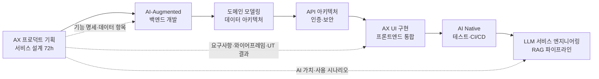
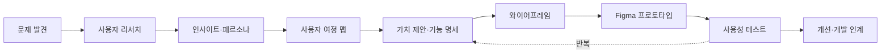
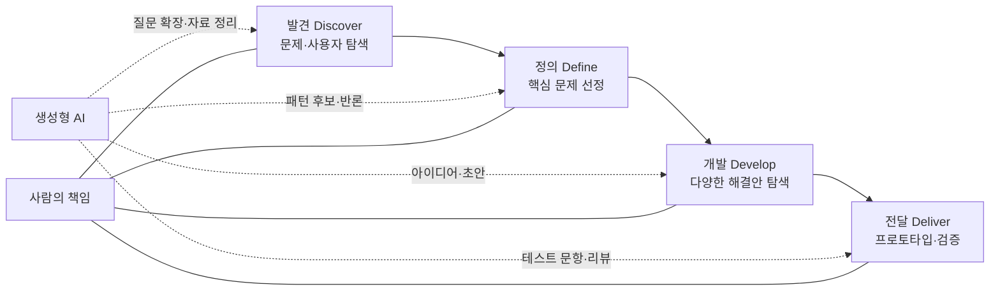
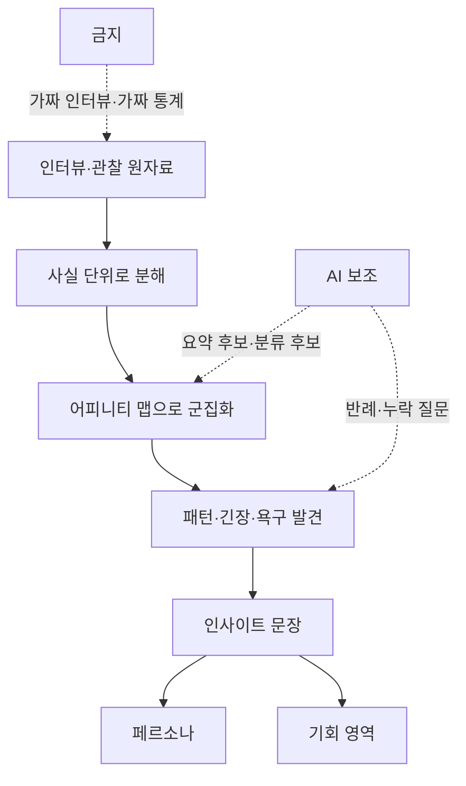
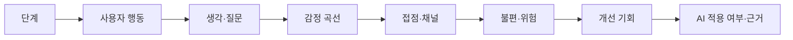
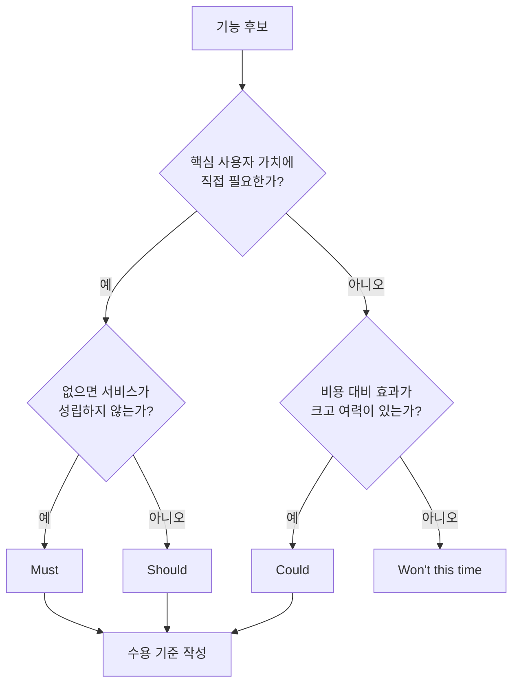
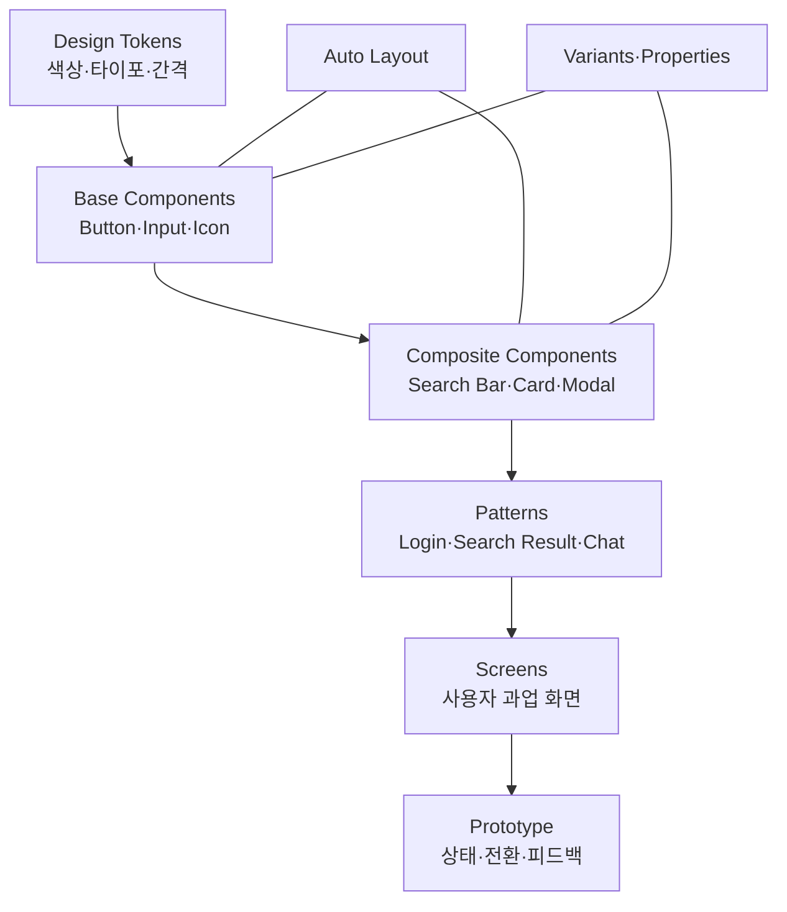
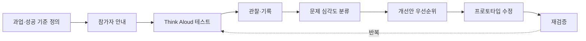
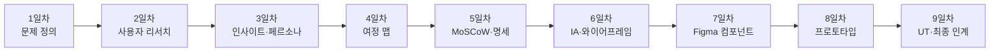
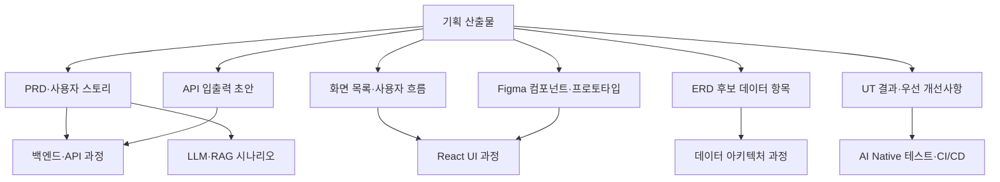

# AX 프로덕트 기획 & 서비스 설계 - Mermaid 구조도 모음

- 과정 시간: 72시간(9일 x 8시간)
- 용도: 강의 슬라이드, Markdown 문서, Mermaid Live Editor, GitHub README에 복사해 사용
- 주의: 렌더러에 따라 `<br/>` 줄바꿈 표현이 다를 수 있습니다.

## 1. 전체 AX 풀스택 과정과의 연결



## 2. AI 서비스 기획 전체 프로세스



## 3. Double Diamond와 생성형 AI의 역할



## 4. 사용자 리서치에서 페르소나까지



## 5. 사용자 여정 맵 구성 요소



## 6. MoSCoW 우선순위 결정 흐름



## 7. Figma 컴포넌트 계층



## 8. 사용성 테스트 반복 루프



## 9. 72시간 학습 흐름



## 10. 후속 개발 과목 인계 구조



## 11. 수업 운영용 핵심 프롬프트

### 리서치 질문 검토

```text
당신은 UX 리서치 코치입니다. 아래 인터뷰 질문을 검토하세요.
단, 사용자 답변이나 통계를 새로 만들지 마세요.
각 질문에 대해 다음을 표시하세요.
1. 유도 질문 여부
2. 한 질문에 두 가지를 묻는지 여부
3. 과거 행동을 묻는지 여부
4. 더 중립적인 대안 질문
5. 민감정보 최소화 여부

인터뷰 질문:
[붙여넣기]
```

### 기능 명세 리뷰

```text
아래 사용자 스토리와 수용 기준을 리뷰하세요.
코드를 생성하지 말고 명세의 누락과 모호성만 찾으세요.
정상 상태뿐 아니라 빈 상태, 오류, 권한, 로딩, AI 응답 실패를 확인하세요.
각 문제를 심각도와 수정 예시로 정리하세요.

[사용자 스토리 및 수용 기준 붙여넣기]
```

### UT 관찰 기록 합성

```text
아래 관찰 기록만을 근거로 사용성 문제 후보를 군집화하세요.
관찰되지 않은 행동이나 참가자 의도를 추측하지 마세요.
각 군집에 대해 근거 문장, 영향받은 과업, 빈도, 심각도 후보를 제시하세요.
최종 판단은 사람이 하도록 불확실성을 표시하세요.

[익명화된 관찰 기록 붙여넣기]
```
