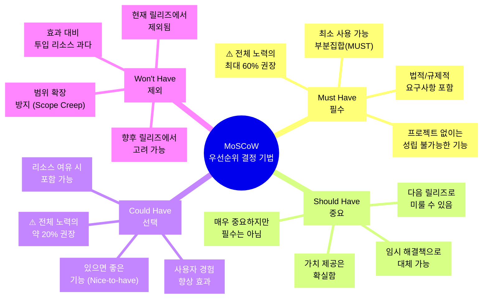
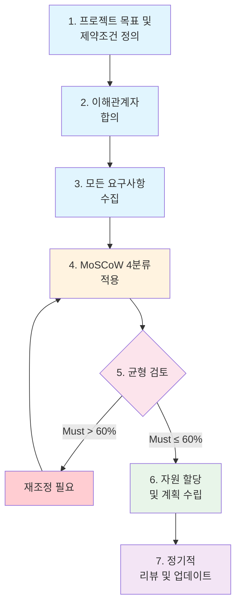
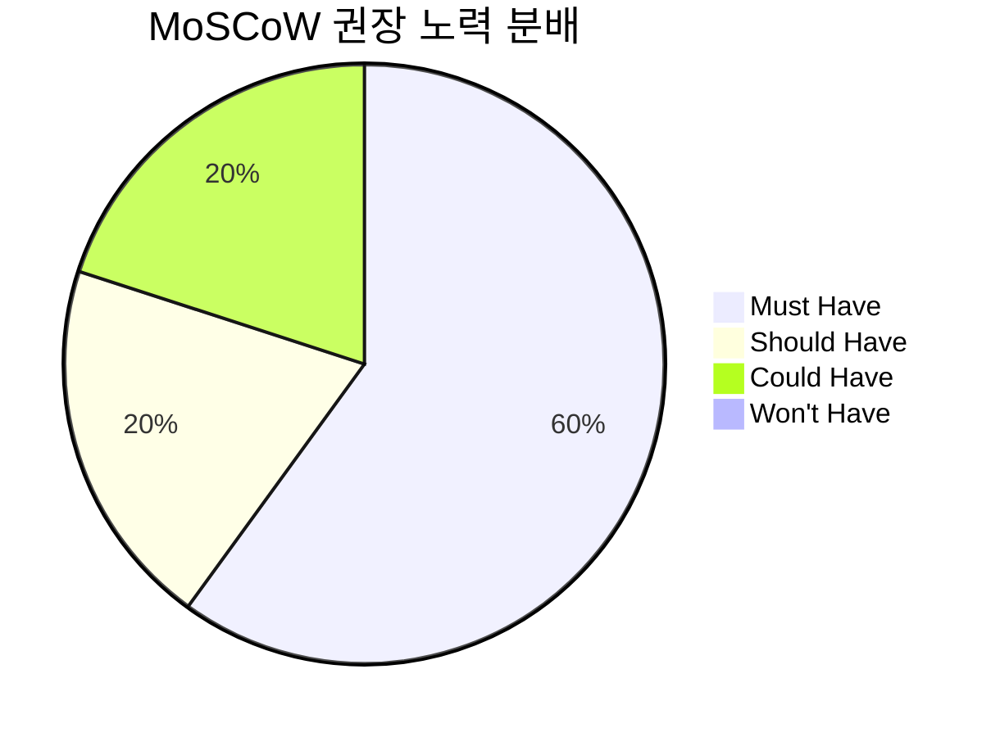
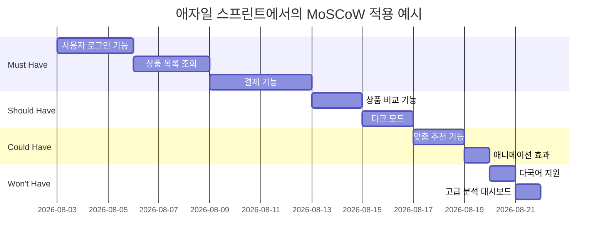
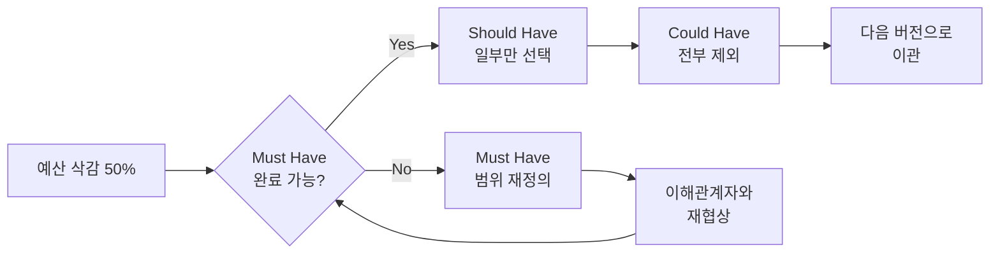
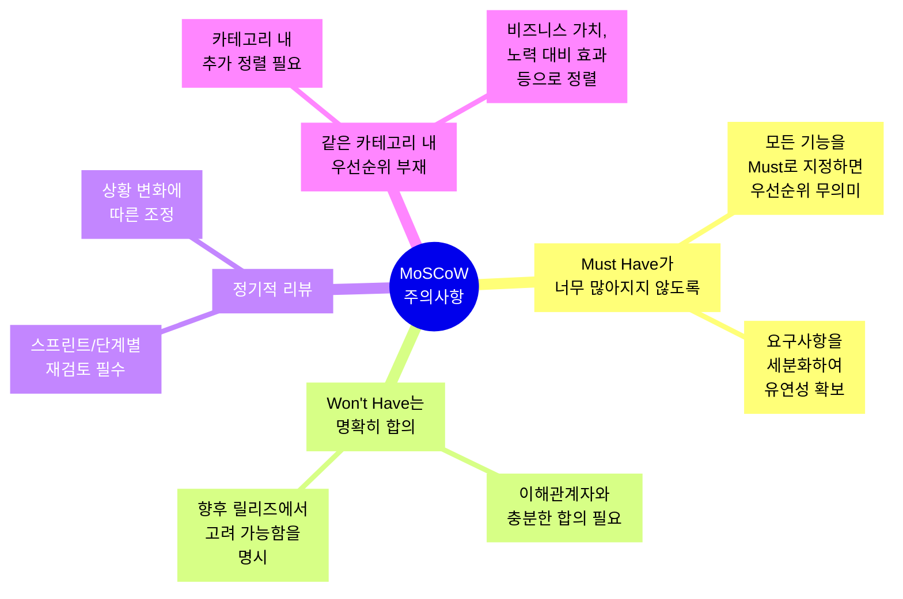
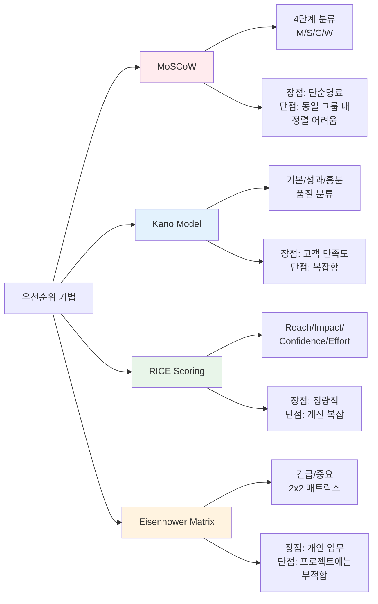
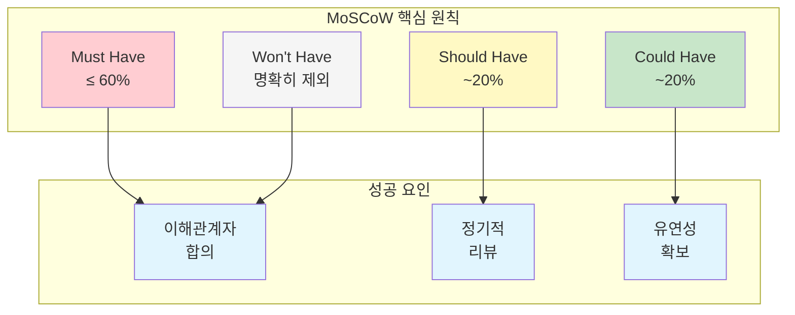

# 📚 MoSCoW 우선순위 결정 기법 by kimi3

---

## 1. MoSCoW 기법 소개

### 1.1 MoSCoW란?

**MoSCoW**는 요구사항이나 작업의 **우선순위를 결정하는 프레임워크**입니다. 1994년 Oracle의 소프트웨어 개발 전문가 **Dai Clegg**가 개발했으며, 애자일(Agile) 프로젝트 관리와 DSDM(Dynamic Systems Development Method)에서 널리 사용됩니다. 

네 가지 카테고리의 앞글자를 조합하여 **MoSCoW**라는 이름이 만들어졌습니다.

### 1.2 왜 MoSCoW를 사용하는가?

| 문제점 | MoSCoW 해결책 |
|--------|--------------|
| "상/중/하" 우선순위는 정의가 모호함 | 명확한 4단계 분류 제공 |
| 1,2,3,4 순위는 유사한 중요도 항목 간 논쟁 유발 | 비슷한 중요도는 같은 그룹으로 묶음 |
| 이해관계자 간 의견 충돌 | 명확한 기준으로 커뮤니케이션 원활 |
| 모든 것이 "필수"라고 주장하는 경향 |客관적 기준으로 구분 강제 |

---

## 2. MoSCoW 전체 구조 (Mermaid 시각화)

---

## 3. 4가지 우선순위 상세 설명

### 3.1 🔴 Must Have (필수)

**정의**: 프로젝트 성공을 위해 **반드시 구현해야 하는 기능**. 없으면 제품이 성립하지 않습니다.

**판단 기준**:
- 이 기능이 없으면 릴리즈를 할 필요가 없는가?
- 프로젝트/제품이 크게 훼손되는가?
- 대체할 쉬운 방법이 없는가?

**예시**:
- 온라인 쇼핑몰의 **결제 기능**
- 은행 시스템의 **보안 인증 기능**
- 헬스케어 앱의 **개인정보 보안 기능**

> ⚠️ **주의**: Must Have가 전체 노력의 60%를 초과하면 프로젝트 실패 위험이 커집니다!

---

### 3.2 🟡 Should Have (중요)

**정의**: Must Have만큼은 아니지만 **중요도가 높은 기능**. 현재 릴리즈에 포함되면 좋지만, 다음으로 미룰 수 있습니다.

**판단 기준**:
- 확실한 가치를 제공하는가?
- 없어도 제품이 동작하는가?
- 리소스 부족 시 다음으로 미룰 수 있는가?

**예시**:
- 쇼핑몰의 **상품 비교 기능**
- **다크 모드 지원**
- 성능 개선 (파일 전송 10초 → 3초)

---

### 3.3 🟢 Could Have (선택)

**정의**: **있으면 좋은 기능(Nice-to-have)**. 없어도 핵심 기능에는 영향을 미치지 않습니다.

**판단 기준**:
- 과감하게 제거해도 큰 영향이 없는가?
- 사용자 경험을 향상시키지만 필수는 아닌가?
- 비용/노력 대비 효과가 작은가?

**예시**:
- 사용자 **맞춤 추천 기능**
- **애니메이션 효과**
- 대용량 파일 전송 기능 (1GB)

---

### 3.4 ⚪ Won't Have (제외)

**정의**: 현재 프로젝트 범위에서는 **제외하기로 합의된 기능**. 향후 릴리즈에서 고려될 수 있습니다.

**판단 기준**:
- 현재 개발 목표와 무관한가?
- 투입 리소스 대비 효과가 미미한가?
- Scope Creep(범위 확장)을 방지해야 하는가?

**예시**:
- **다국어 지원** (현재는 한국어만)
- 고급 분석 기능
- 임원 1명만 사용하는 기능

---

## 4. MoSCoW 우선순위 결정 프로세스

### 4.1 각 단계 상세

| 단계 | 활동 | 산출물 |
|------|------|--------|
| **1. 목표 정의** | 프로젝트의 궁극적 목적, 수혜자, 제약조건(예산, 일정) 파악 | 프로젝트 목표서 |
| **2. 이해관계자 합의** | 우선순위 기준, 의견 충돌 해결 방식, 자원 할당 비율 합의 | 합의 문서 |
| **3. 요구사항 수집** | 모든 기능/요구사항 리스트업 | 요구사항 목록 |
| **4. 4분류 적용** | 각 요구사항을 M/S/C/W로 분류 | 분류 매트릭스 |
| **5. 균형 검토** | Must ≤ 60%, Could ≈ 20% 확인 | 균형 리포트 |
| **6. 계획 수립** | 우선순위 기반 개발 계획 수립 | 개발 로드맵 |
| **7. 정기 리뷰** | 스프린트/단계별 재검토 및 조정 | 업데이트된 분류 |

---

## 5. MoSCoW 자원 할당 가이드라인

### 5.1 DSDM 권장 비율

| 카테고리 | 권장 비율 | 설명 |
|----------|----------|------|
| **Must Have** | 최대 60% | 팀이 확실히 완료할 수 있는 수준 |
| **Should Have** | 20% | Must와 함께 60-70% |
| **Could Have** | 약 20% | 유연성과 혁신을 위한 여유 |
| **Won't Have** | 0% | 현재 기간 제외 |

> 💡 **핵심**: Must Have가 60%를 초과하면 프로젝트 실패 위험이 커집니다. 반드시 유연성을 확보하세요!

---

## 6. MoSCoW 적용 사례

### 6.1 애자일(Agile) 스프린트 계획

### 6.2 온라인 쇼핑몰 개발 사례

| 기능 | MoSCoW 분류 | 이유 |
|------|------------|------|
| 회원가입/로그인 | **Must Have** | 서비스 이용의 전제조건 |
| 상품 검색 | **Must Have** | 핵심 기능 |
| 장바구니 | **Must Have** | 구매 과정 필수 |
| 결제 연동 | **Must Have** | 수익 창출의 핵심 |
| 상품 비교 | **Should Have** | UX 향상, 없어도 구매 가능 |
| 리뷰 시스템 | **Should Have** | 신뢰도 향상, 다음 스프린트 가능 |
| 맞춤 추천 | **Could Have** | 있으면 좋음, 없어도 무방 |
| 실시간 채팅 상담 | **Could Have** | 고객 만족 향상 |
| VR 쇼핑 | **Won't Have** | 현재 범위 초과, 향후 고려 |

---

## 7. 실습: MoSCoW 워크숍

### 🎯 실습 1: 학교 스마트 캠퍼스 앱 개발

**시나리오**: 여러분의 학교에서 "스마트 캠퍼스" 모바일 앱을 개발하려고 합니다. 아래 요구사항들을 MoSCoW 4분류로 나누어 보세요.

**요구사항 목록**:
1. 학생증 디지털화 (모바일 학생증)
2. 수업 시간표 확인
3. 캠퍼스 내 길찾기 (실내 내비게이션)
4. 학식당 메뉴 확인
5. 교수님과의 실시간 채팅
6. 도서관 좌석 예약
7. AR로 캠퍼스 투어
8. 동아리 활동 게시판
9. 성적 조회
10. 캠퍼스 날씨 정보 위젯
11. AI 학습 도우미
12. 캠퍼스 내 자전거 대여

**실습지**:

| # | 요구사항 | MoSCoW 분류 | 근거 |
|---|---------|------------|------|
| 1 | 학생증 디지털화 | | |
| 2 | 수업 시간표 확인 | | |
| 3 | 캠퍼스 내 길찾기 | | |
| 4 | 학식당 메뉴 확인 | | |
| 5 | 교수님과의 실시간 채팅 | | |
| 6 | 도서관 좌석 예약 | | |
| 7 | AR로 캠퍼스 투어 | | |
| 8 | 동아리 활동 게시판 | | |
| 9 | 성적 조회 | | |
| 10 | 캠퍼스 날씨 정보 위젯 | | |
| 11 | AI 학습 도우미 | | |
| 12 | 캠퍼스 내 자전거 대여 | | |

---

### 🎯 실습 2: 팀별 MoSCoW 토론

**단계**:
1. 4-5명씩 팀을 구성합니다.
2. 각 팀은 "우리 학교를 위한 새로운 서비스"를 하나 정합니다.
3. 10개 이상의 기능/요구사항을 brainstorming합니다.
4. MoSCoW 4분류로 분류합니다.
5. 다른 팀과 공유하고 피드백을 받습니다.

**토론 포인트**:
- 왜 이 기능이 Must Have인가?
- Must Have가 60%를 초과하지 않는가?
- Won't Have를 정하는 것이 왜 중요한가?

---

### 🎯 실습 3: MoSCoW 의사결정 시뮬레이션

**상황**: 예산이 50% 삭감되었습니다. 아래 상황에서 어떤 결정을 내리겠습니까?

**토론 질문**:
1. Must Have를 줄이는 것 vs. Should/Could를 모두 제외하는 것, 어떤 선택이 나은가?
2. 이해관계자(학교 측)를 어떻게 설득할 것인가?
3. "모든 것이 Must Have라고 주장할 때" 어떻게 대응할 것인가?

---

## 8. MoSCoW 적용 시 주의사항

### 8.1 흔한 실수

| 실수 | 결과 | 해결책 |
|------|------|--------|
| 모든 기능을 Must로 분류 | 우선순위 설정 무의미, 프로젝트 실패 | 세분화하여 진짜 Must만 선별 |
| Won't Have를 명확히 하지 않음 | Scope Creep 발생 | 이해관계자와 명확히 합의 |
| 한 번 정하고 끝냄 | 변화하는 요구 반영 불가 | 정기적 리뷰 (스프린트별) |
| 같은 카테고리 내 우선순위 무시 | 개발 순서 혼란 | 내부적으로 추가 정렬 기준 적용 |

---

## 9. MoSCoW vs 다른 우선순위 기법

| 기법 | 특징 | 적합한 상황 |
|------|------|------------|
| **MoSCoW** | 4단계 분류, 단순명료 | 애자일 스프린트, 릴리즈 계획 |
| **Kano Model** | 고객 만족도 기반 분류 | 제품 기능 우선순위 |
| **RICE Scoring** | 정량적 점수화 | 데이터 기반 의사결정 |
| **Eisenhower Matrix** | 긴급/중요 2x2 | 개인 업무 관리 |

---

## 10. 핵심 정리

### 📌 핵심 키워드

| 키워드 | 설명 |
|--------|------|
| **Minimum Usable Subset** | Must Have만으로도 동작하는 최소 기능 집합 |
| **Timeboxing** | 고정된 시간 내에 우선순위 기반 개발 |
| **Scope Creep 방지** | Won't Have를 명확히 하여 범위 확장 방지 |
| **이해관계자 관리** | 명확한 기준으로 기대치 조정 |

---

## 11. 참고 자료

- DSDM (Dynamic Systems Development Method) 공식 문서
- Agile Business Consortium: MoSCoW Prioritization
- Dai Clegg, "Mastering DSDM"

---

> **"모든 것이 중요하면 아무것도 중요하지 않다."**  
> — MoSCoW의 핵심 철학

---

이 강의자료를 바탕으로 학생들이 MoSCoW의 이론적 기초를 이해하고, 실제 프로젝트 상황에서 직접 적용해보는 실습을 통해 실무 감각을 기를 수 있을 것입니다. 특히 Mermaid 다이어그램을 활용하여 전체 구조를 시각적으로 파악할 수 있도록 구성했습니다.
