# MoSCoW 우선순위 분석법 by 딥시크

## 📚 강의 개요

| 항목 | 내용 |
|------|------|
| **강의 주제** | MoSCoW 우선순위 분석법 (MoSCoW Prioritization) |
| **강의 시간** | 90분 (이론 30분 + 실습 60분) |
| **대상** | 프로젝트 관리, 요구사항 분석, 애자일 개발 학습자 |
| **학습 목표** | MoSCoW 기법 이해, 실제 프로젝트에 적용할 수 있는 능력 배양 |

---

## 1️⃣ MoSCoW 이론 개요

### 전체 구조도

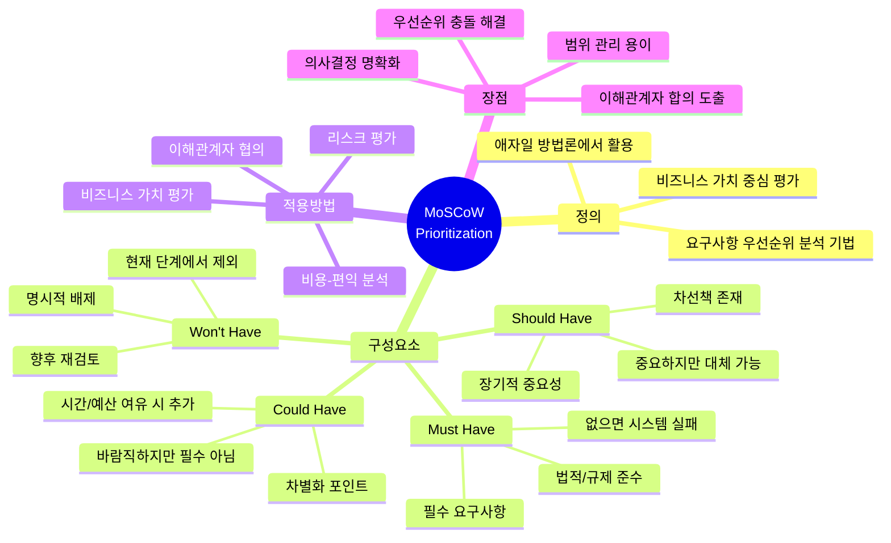

### MoSCoW 정의

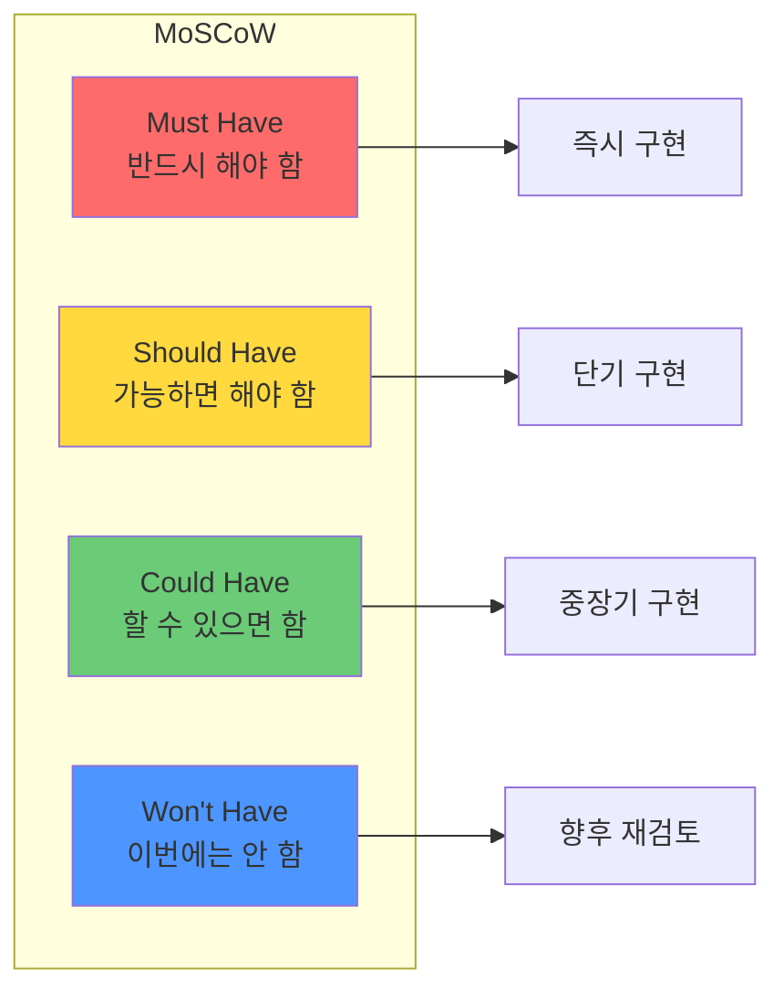

---

## 2️⃣ 각 카테고리 상세 설명

### Must Have (필수 요구사항)

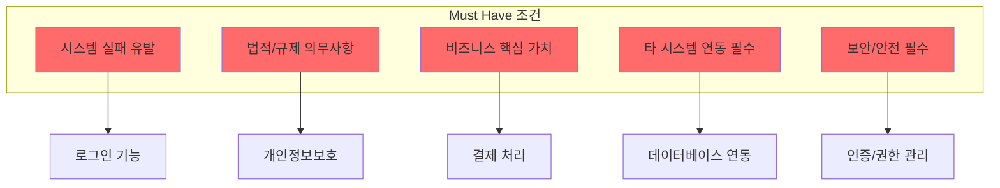

### Should Have (중요 요구사항)

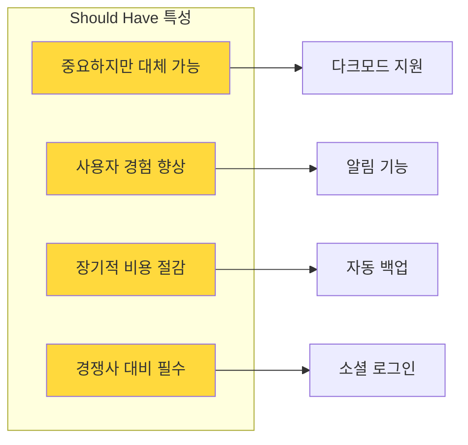

### Could Have (선택 요구사항)

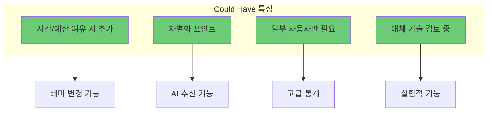

### Won't Have (제외 요구사항)

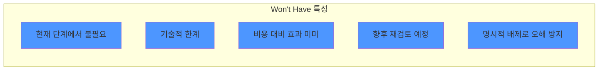

---

## 3️⃣ MoSCoW 적용 프로세스

### 의사결정 프로세스

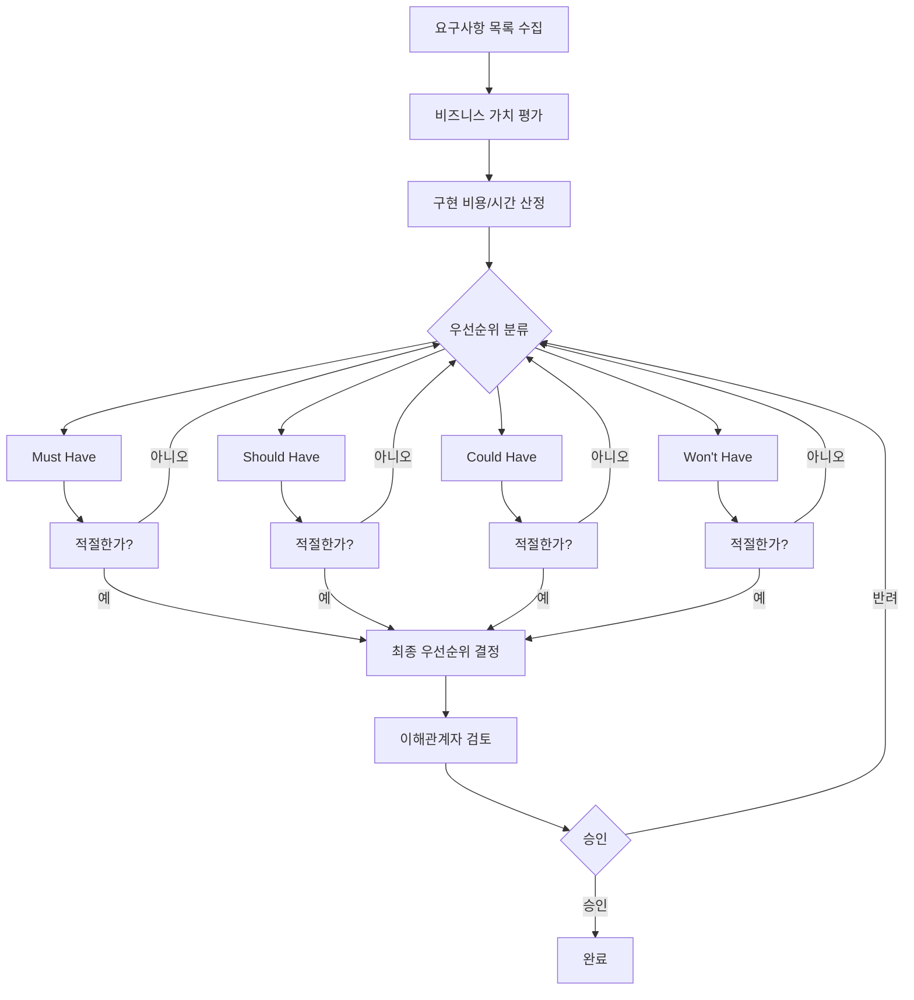

### 의사결정 매트릭스

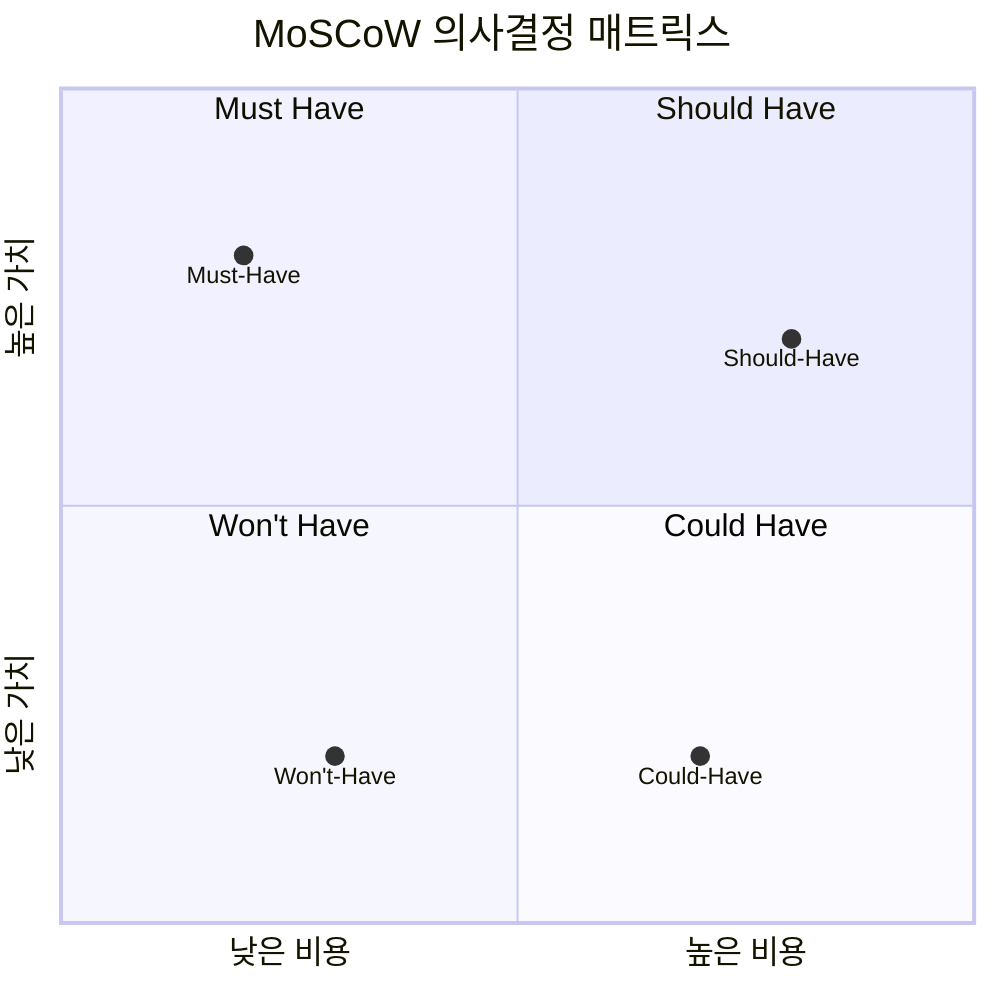

---

## 4️⃣ 실습 활동

### 실습 1: 요구사항 우선순위 분류 (개인 활동)

**목표:** 주어진 20개 요구사항을 MoSCoW로 분류하기

```mermaid
flowchart LR
    subgraph "실습 데이터: 모바일 뱅킹 앱"
        R1[계좌조회]
        R2[송금/이체]
        R3[QR 결제]
        R4[생체인증]
        R5[알림센터]
        R6[다크모드]
        R7[음성인식]
        R8[해외송금]
        R9[거래내역 검색]
        R10[고객센터 채팅]
        R11[맞춤형 상품 추천]
        R12[지출 분석]
        R13[목표저축 설정]
        R14[카드 관리]
        R15[모바일 현금]
        R16[가상계좌 발급]
        R17[SNS 공유]
        R18[예금금리 조회]
        R19[보안키패드]
        R20[오프라인 결제]
    end
```

### 분류 정답 예시

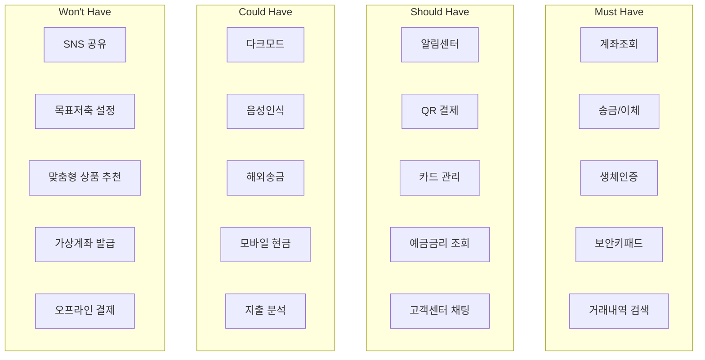

### 실습 2: 팀 기반 MoSCoW 워크숍 (그룹 활동)

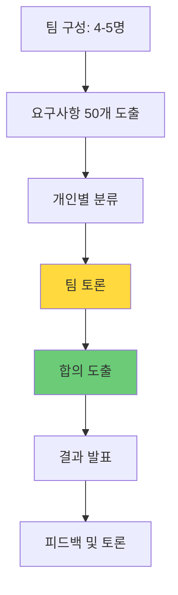

#### 워크숍 진행 가이드

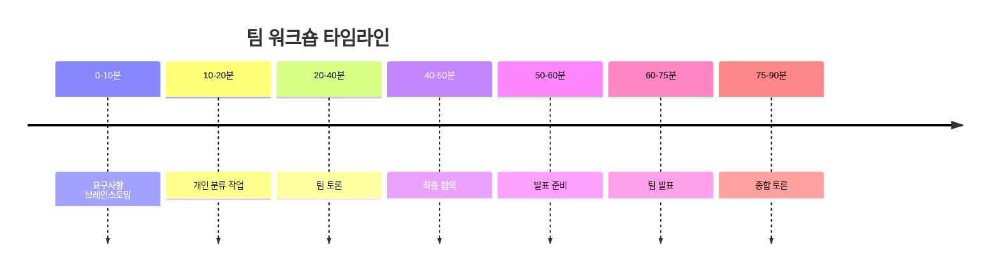

### 실습 3: 실제 시나리오 분석

**시나리오:** 스타트업의 배달 앱 개발 (예산 1억원, 3개월)

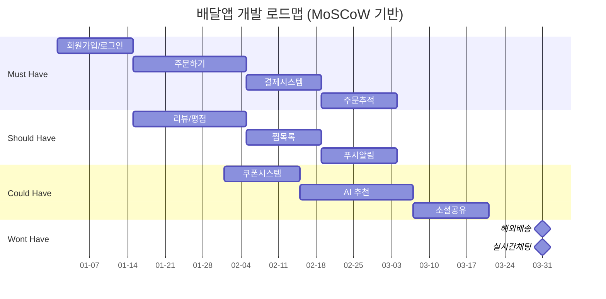

---

## 5️⃣ 실습 템플릿

### MoSCoW 분류 워크시트

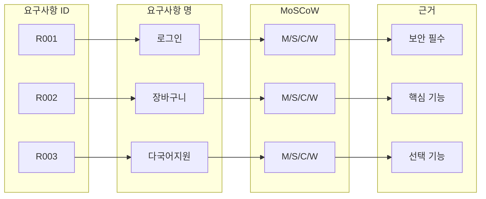

### 분류 결과 템플릿

| 요구사항 ID | 요구사항명 | 우선순위 | 근거 | 담당자 |
|------------|-----------|---------|------|--------|
| R-001 | 사용자 인증 | Must | 보안 필수 | 김개발 |
| R-002 | 데이터 암호화 | Must | 법적 규제 | 이보안 |
| R-003 | 대시보드 | Should | UX 핵심 | 박디자 |
| R-004 | 다크모드 | Could | 선택 기능 | 최프론 |
| R-005 | AR 필터 | Won't | 과도한 리소스 | 정기획 |

---

## 6️⃣ 평가 및 확인

### 이해도 확인 퀴즈

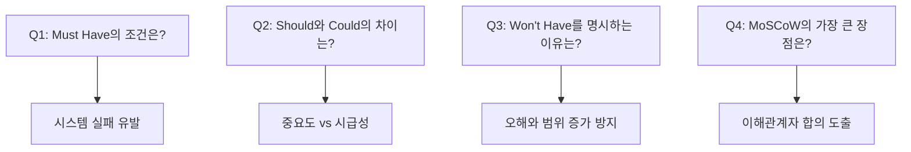

### 실습 평가 기준

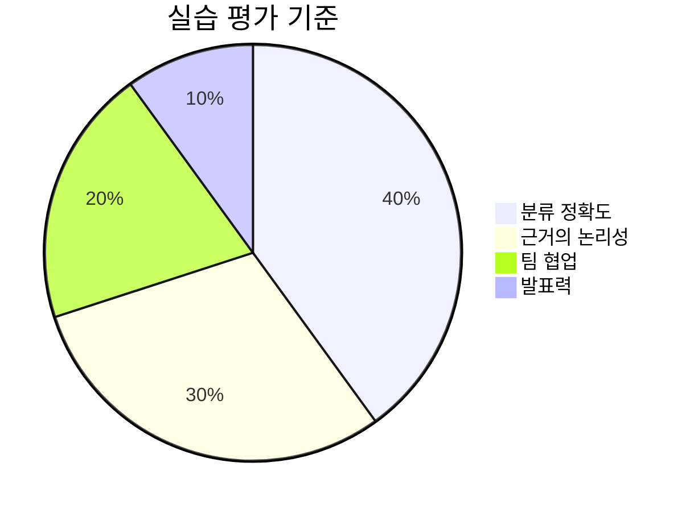

---

## 7️⃣ 추가 참고 자료

### MoSCoW와 다른 기법 비교

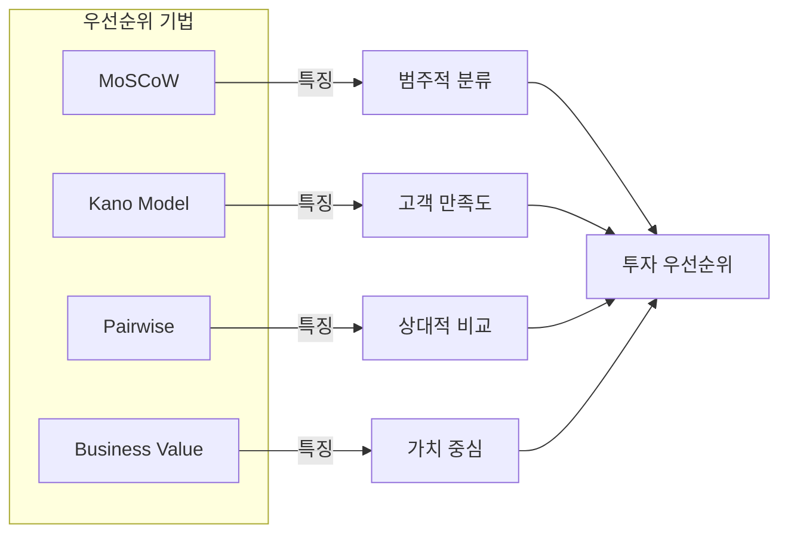

### 실전 팁

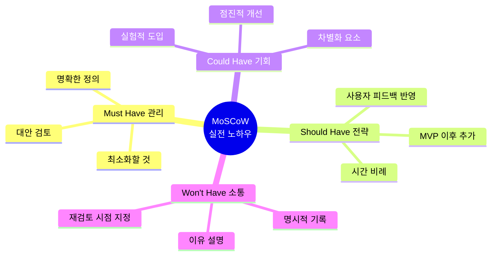

---

## 📝 강의 노트

### 강의자 팁

1. **도입부 (5분)**
   - 실생활 예시로 시작 (예: 장보기 목록 우선순위)
   - MoSCoW의 유래와 필요성 설명

2. **이론 설명 (25분)**
   - 각 카테고리별 실제 사례 제시
   - 학생들의 질문 유도

3. **실습 진행 (60분)**
   - 개인 → 팀 → 전체 순으로 점진적 난이도
   - 실제 프로젝트 상황 가정

4. **마무리 (10분)**
   - 핵심 포인트 요약
   - Q&A 세션
   - 과제 부여

### 학생들이 자주 하는 질문

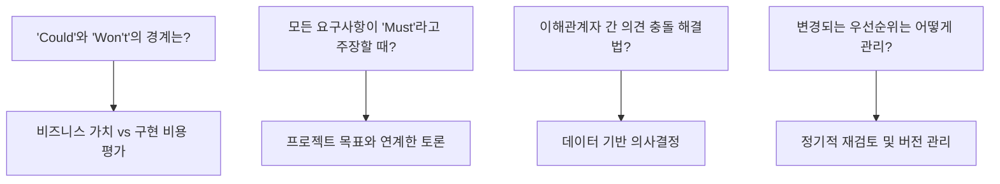

---

이 강의자료를 활용하여 학생들이 MoSCoW 기법을 이해하고 실제 프로젝트에 적용할 수 있는 능력을 키울 수 있습니다. 실습을 통해 이론을 체험하고, 팀 활동을 통해 협업 능력도 함께 향상시킬 수 있습니다.
