아래 자료는 **비전공자·초보자 대상 4시간 수업**을 기준으로 설계했습니다. 이론 설명뿐 아니라 개인 실습, 팀 실습, 발표, 평가까지 바로 운영할 수 있도록 구성했습니다.

# MoSCoW 우선순위 기법 강의자료

## 1. 강의 개요

### 1.1 강의 주제

**MoSCoW 기법을 활용한 서비스 기능 우선순위 결정**

MoSCoW는 제한된 시간과 인력 안에서 어떤 기능을 먼저 개발할지 결정하는 요구사항 우선순위 기법이다.

### 1.2 권장 학습 시간

| 구분     |   시간 | 주요 내용             |
| ------ | ---: | ----------------- |
| 이론 이해  |  50분 | MoSCoW 개념과 분류 기준  |
| 사례 분석  |  40분 | 실제 서비스 기능 분류      |
| 개인 실습  |  30분 | 간단한 서비스 요구사항 분류   |
| 팀 실습   |  70분 | AI 서비스 기능 우선순위 결정 |
| 발표·피드백 |  30분 | 팀별 결과 발표와 상호 검토   |
| 퀴즈·정리  |  20분 | 핵심 개념 확인          |
| 합계     | 240분 | 총 4시간             |

### 1.3 학습 목표

수업을 마친 학생은 다음을 수행할 수 있다.

1. MoSCoW의 네 가지 우선순위 등급을 설명할 수 있다.
2. 사용자 요구사항과 서비스 기능을 구분할 수 있다.
3. 기능이 반드시 필요한 이유를 근거로 설명할 수 있다.
4. 제한된 개발 기간에 맞추어 기능을 분류할 수 있다.
5. 팀원과 협의하여 MVP 기능 범위를 결정할 수 있다.
6. MoSCoW 결과를 기능 명세서와 프로토타입에 반영할 수 있다.

---

# 2. MoSCoW 전체 구조

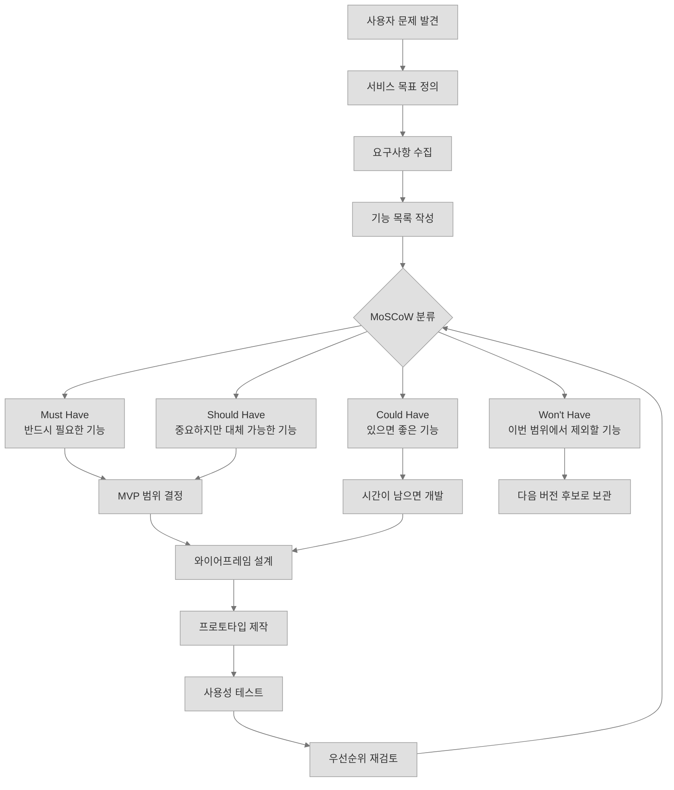

MoSCoW는 기능을 단순히 네 개의 상자에 넣는 작업이 아니다.

핵심은 다음 질문에 답하는 과정이다.

> “제한된 시간 안에 사용자의 핵심 문제를 해결하려면 무엇부터 만들어야 하는가?”

---

# 3. MoSCoW란 무엇인가

MoSCoW는 요구사항이나 기능을 다음 네 가지 등급으로 분류하는 방법이다.

* **M: Must Have**
* **S: Should Have**
* **C: Could Have**
* **W: Won't Have this time**

MoSCoW라는 이름은 네 분류의 첫 글자를 조합한 것이다. 가운데의 `o`는 읽기 쉽게 하기 위해 추가된 글자이다.

## 3.1 MoSCoW가 필요한 이유

서비스를 기획할 때는 보통 개발할 기능이 많지만, 사용할 수 있는 시간과 인력은 제한적이다.

예를 들어 학생들이 2주 동안 AI 일정관리 서비스를 개발한다고 가정해 보자.

학생들이 제안한 기능은 다음과 같을 수 있다.

* 회원가입
* 로그인
* 일정 등록
* 일정 조회
* 일정 삭제
* 음성으로 일정 입력
* AI 일정 추천
* 날씨 기반 준비물 추천
* 카카오톡 알림
* 테마 색상 변경
* 캐릭터 선택
* 다국어 지원

2주 안에 이 기능을 모두 개발하기는 어렵다.

이때 MoSCoW를 사용하면 다음을 결정할 수 있다.

* 반드시 완성해야 하는 기능
* 가능하면 포함해야 하는 기능
* 시간이 남으면 추가할 기능
* 이번 프로젝트에서는 제외할 기능

---

# 4. 네 가지 우선순위

## 4.1 Must Have

### 정의

서비스가 작동하기 위해 **반드시 필요한 기능**이다.

이 기능이 없으면 서비스의 핵심 목적을 달성할 수 없거나 결과물을 출시할 수 없다.

### 판단 질문

* 이 기능이 없으면 서비스의 핵심 목적을 달성할 수 없는가?
* 이 기능이 없으면 사용자가 기본 작업을 완료할 수 없는가?
* 이 기능이 없으면 서비스가 정상적으로 작동하지 않는가?
* 법률, 보안 또는 필수 정책 때문에 반드시 필요한가?
* 대체할 수 있는 다른 방법이 전혀 없는가?

### 예시

AI 일정관리 서비스의 경우:

* 일정 등록
* 일정 조회
* 일정 수정
* 일정 삭제
* 사용자 입력 내용 저장
* 필수 오류 처리

### 핵심 문장

> Must는 “중요한 기능”이 아니라 “없으면 서비스가 성립하지 않는 기능”이다.

---

## 4.2 Should Have

### 정의

매우 중요하지만, 당장 없어도 서비스의 핵심 기능은 작동하는 요구사항이다.

Must와 달리 임시 대체 방법이 있거나 다음 개발 단계로 미룰 수 있다.

### 판단 질문

* 사용자 만족도에 큰 영향을 주는가?
* 기능이 없더라도 다른 방법으로 작업할 수 있는가?
* 이번 버전에 없으면 불편하지만 서비스 이용은 가능한가?
* Must 기능이 완성된 후 우선적으로 개발해야 하는가?

### 예시

AI 일정관리 서비스의 경우:

* 일정 검색
* 일정 중요도 설정
* 마감 일정 알림
* 음성으로 일정 입력
* 일정 충돌 경고
* 주간 일정 요약

### 핵심 문장

> Should는 중요하지만, 잠시 없어도 서비스의 기본 흐름은 유지되는 기능이다.

---

## 4.3 Could Have

### 정의

있으면 사용자 경험이 좋아지지만, 없어도 서비스 이용에 큰 문제가 없는 기능이다.

주로 편의 기능, 디자인 개선 기능, 부가 기능이 여기에 포함된다.

### 판단 질문

* 없어도 사용자가 핵심 작업을 완료할 수 있는가?
* 사용자 경험을 조금 더 좋게 만드는 기능인가?
* 구현 시간이 남을 때 추가할 수 있는가?
* 프로젝트 성공 여부에 직접적인 영향을 주지 않는가?

### 예시

AI 일정관리 서비스의 경우:

* 다크 모드
* 캐릭터 선택
* 배경 색상 변경
* 일정 완료 효과음
* 사용자 프로필 이미지
* 테마 꾸미기
* 일별 명언 표시

### 핵심 문장

> Could는 사용자가 좋아할 수 있지만, 핵심 문제 해결에는 직접적으로 필요하지 않은 기능이다.

---

## 4.4 Won't Have This Time

### 정의

중요하지 않다는 의미가 아니라, **이번 개발 범위에서는 구현하지 않기로 합의한 기능**이다.

다음 버전이나 장기 계획에 포함할 수 있다.

### 판단 질문

* 현재 개발 기간 안에 구현하기 어려운가?
* 기술적 위험이 큰가?
* 현재 목표와 직접적인 관련이 없는가?
* 다른 핵심 기능보다 우선순위가 낮은가?
* 다음 버전으로 미루어도 문제가 없는가?

### 예시

AI 일정관리 서비스의 경우:

* 스마트워치 연동
* 카카오톡 자동 메시지 발송
* 회사 전체 그룹웨어 연동
* 얼굴 인식 로그인
* 모든 국가의 언어 지원
* 사용자 감정 분석
* 개인 일정 패턴 장기 예측

### 핵심 문장

> Won't는 “절대 개발하지 않는다”가 아니라 “이번에는 개발하지 않는다”라는 의미이다.

---

# 5. 네 가지 등급 비교

| 구분     | 의미       | 제외 시 영향       | 대체 가능성     | 개발 시점      |
| ------ | -------- | ------------- | ---------- | ---------- |
| Must   | 반드시 필요   | 서비스가 성립하지 않음  | 거의 없음      | 가장 먼저      |
| Should | 매우 중요    | 불편하지만 사용 가능   | 대체 방법 존재   | Must 다음    |
| Could  | 있으면 좋음   | 큰 문제 없음       | 충분히 가능     | 시간이 남을 때   |
| Won't  | 이번 범위 제외 | 현재 버전에는 영향 없음 | 다음 버전에서 검토 | 현재는 개발 안 함 |

---

# 6. MoSCoW 분류 의사결정 구조

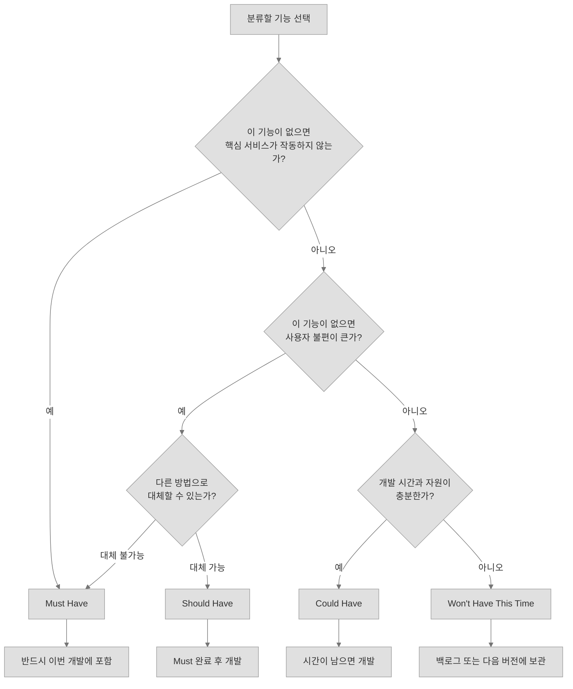

---

# 7. Must와 Should를 구별하는 방법

학생들이 가장 많이 어려워하는 부분은 Must와 Should를 구분하는 것이다.

## 7.1 핵심 차이

다음 문장을 사용하여 확인한다.

### Must 확인 문장

> “이 기능이 없으면 사용자가 서비스의 핵심 작업을 완료할 수 없다.”

### Should 확인 문장

> “이 기능이 없으면 불편하지만, 다른 방법으로 핵심 작업을 완료할 수 있다.”

## 7.2 예시

### 기능: 비밀번호 찾기

일반적인 서비스에서는 비밀번호 찾기가 매우 중요하다.

하지만 짧은 교육용 프로토타입에서는 다음과 같이 판단할 수 있다.

* 로그인 기능이 없는 프로토타입: Won't
* 실제 회원가입 서비스: Should 또는 Must
* 금융·행정 서비스: Must 가능성이 높음

따라서 MoSCoW 등급은 기능 이름만 보고 정하는 것이 아니다.

다음 조건에 따라 달라진다.

* 서비스 목적
* 사용 대상
* 개발 기간
* 기술 수준
* 보안 요구사항
* 출시 범위

---

# 8. MoSCoW 분류 전에 반드시 정의할 내용

기능을 바로 분류하면 모든 기능이 Must가 되는 문제가 발생한다.

먼저 다음 세 가지를 정의해야 한다.

## 8.1 목표 사용자

예:

* 취업을 준비하는 학생
* 매일 일정이 많은 직장인
* 스마트폰 사용이 익숙하지 않은 고령자
* 팀 프로젝트를 수행하는 교육생

## 8.2 해결할 핵심 문제

예:

> “학생들이 수업, 과제, 팀 프로젝트 일정을 한눈에 확인하기 어렵다.”

## 8.3 개발 범위와 기간

예:

* 개발 기간: 2주
* 팀원: 4명
* 사용 기술: Python, FastAPI, Gradio, SQLite
* 결과물: 웹 기반 MVP
* 제외 범위: 모바일 앱 배포, 결제 기능, 외부 기업 시스템 연동

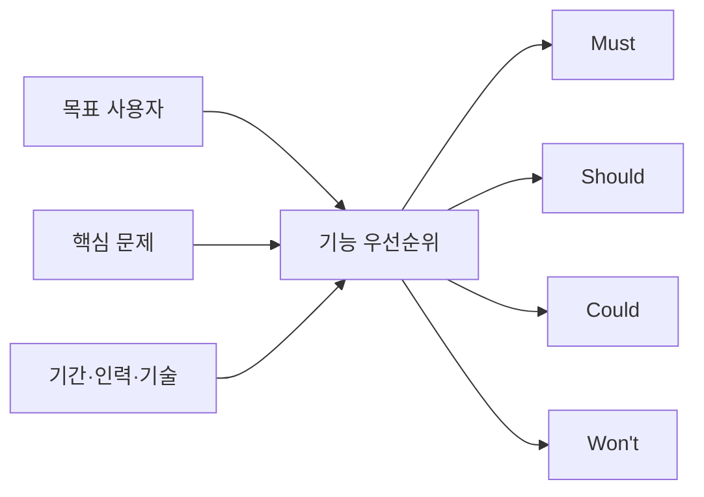

---

# 9. MoSCoW 적용 절차

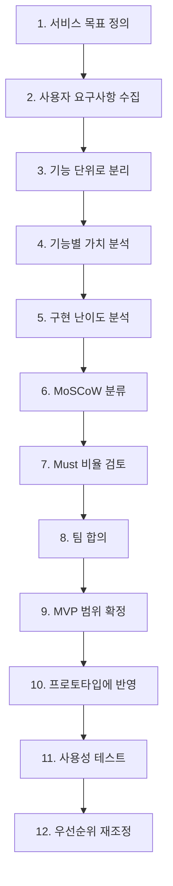

## 9.1 1단계: 서비스 목표 정의

좋지 않은 목표:

> “기능이 많은 일정관리 서비스를 만든다.”

좋은 목표:

> “학생이 오늘 해야 할 수업과 과제를 10초 안에 확인할 수 있는 일정관리 서비스를 만든다.”

## 9.2 2단계: 요구사항 수집

다음 방법을 활용할 수 있다.

* 사용자 인터뷰
* 설문조사
* 관찰
* 경쟁 서비스 분석
* 사용자 여정 맵
* 페르소나 분석
* 팀 아이디어 회의

## 9.3 3단계: 기능 단위로 분리

기능은 가능한 한 구체적으로 작성한다.

좋지 않은 예:

* 일정관리 기능
* AI 기능
* 사용자 기능

좋은 예:

* 사용자가 일정을 등록한다.
* 사용자가 등록된 일정을 날짜별로 조회한다.
* 사용자가 기존 일정을 수정한다.
* AI가 오늘의 중요 일정을 요약한다.
* 일정 시간이 겹치면 경고 메시지를 표시한다.

## 9.4 4단계: 사용자 가치 분석

각 기능이 사용자에게 주는 가치를 평가한다.

* 핵심 문제를 해결하는가?
* 사용 빈도가 높은가?
* 사용자의 시간을 줄여주는가?
* 오류를 방지하는가?
* 사용자 만족도를 높이는가?

## 9.5 5단계: 구현 난이도 분석

* 개발 시간이 얼마나 필요한가?
* 외부 API가 필요한가?
* 새로운 기술을 학습해야 하는가?
* 오류 가능성이 높은가?
* 개인정보 또는 보안 문제가 있는가?

## 9.6 6단계: MoSCoW 분류

팀원 각자가 먼저 개별 분류한 뒤, 의견이 다른 기능을 중심으로 토론한다.

## 9.7 7단계: Must 비율 검토

모든 기능이 Must라면 우선순위를 정한 것이 아니다.

Must는 개발 기간 안에 반드시 완성 가능한 수준으로 제한해야 한다.

권장 검토 질문:

* Must 기능을 전부 개발할 수 있는가?
* Must 기능만으로 사용자 핵심 문제를 해결할 수 있는가?
* Must 중 Should로 낮출 수 있는 기능은 없는가?
* Must 기능마다 명확한 근거가 있는가?

---

# 10. 강의 사례: AI 학습 일정관리 서비스

## 10.1 서비스 상황

### 사용자

AI 교육과정에 참여한 학생

### 사용자 문제

* 수업, 과제, 팀 프로젝트 일정이 흩어져 있다.
* 오늘 무엇을 먼저 해야 하는지 판단하기 어렵다.
* 마감일을 놓치는 경우가 있다.

### 서비스 목표

> 사용자가 오늘 해야 할 학습 일정과 우선순위를 빠르게 확인할 수 있도록 지원한다.

### 개발 조건

* 개발 기간: 2주
* 팀원: 4명
* 웹 기반 MVP
* Python, FastAPI, Gradio, SQLite 사용
* 모바일 앱 배포는 제외

## 10.2 전체 기능 후보

1. 회원가입
2. 로그인
3. 일정 등록
4. 일정 조회
5. 일정 수정
6. 일정 삭제
7. 일정 완료 처리
8. 마감일 알림
9. 일정 중요도 설정
10. AI 오늘 일정 요약
11. AI 우선순위 추천
12. 음성 일정 등록
13. 일정 충돌 경고
14. 다크 모드
15. 캐릭터 선택
16. 카카오톡 알림
17. 스마트워치 연동
18. 다국어 지원

## 10.3 예시 분류 결과

| 기능          | 분류     | 분류 근거                      |
| ----------- | ------ | -------------------------- |
| 일정 등록       | Must   | 일정 데이터가 없으면 서비스가 성립하지 않음   |
| 일정 조회       | Must   | 사용자가 자신의 일정을 확인해야 함        |
| 일정 수정       | Must   | 잘못 등록한 일정을 변경해야 함          |
| 일정 삭제       | Must   | 불필요한 일정 관리에 필요             |
| 일정 완료 처리    | Must   | 완료 여부를 구분해야 함              |
| AI 오늘 일정 요약 | Must   | AI 일정관리 서비스의 핵심 차별 기능      |
| 일정 중요도 설정   | Should | 중요하지만 마감일 기준으로 대체 가능       |
| AI 우선순위 추천  | Should | 중요하지만 사용자가 직접 정렬할 수 있음     |
| 마감일 알림      | Should | 편리하지만 직접 일정을 조회할 수 있음      |
| 일정 충돌 경고    | Should | 오류를 줄이지만 핵심 기능은 아님         |
| 음성 일정 등록    | Could  | 입력 편의성을 높이지만 텍스트 입력 가능     |
| 다크 모드       | Could  | 사용성을 개선하지만 핵심 문제와 직접 관련 없음 |
| 캐릭터 선택      | Could  | 흥미를 높이지만 핵심 기능이 아님         |
| 카카오톡 알림     | Won't  | 외부 서비스 연동과 인증 과정이 필요함      |
| 스마트워치 연동    | Won't  | 개발 기간과 기술 범위를 초과함          |
| 다국어 지원      | Won't  | 초기 사용자는 한국어 사용자로 한정함       |

## 10.4 결과 구조

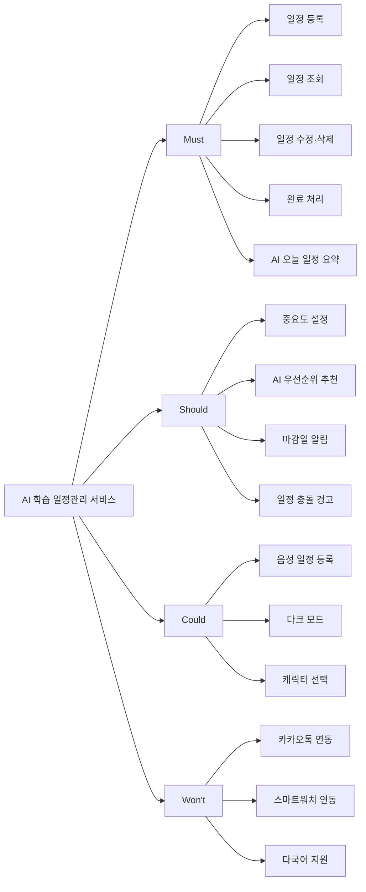

---

# 11. MoSCoW와 MVP의 관계

## 11.1 MVP란 무엇인가

MVP는 Minimum Viable Product의 약자로, 사용자의 핵심 문제를 해결할 수 있는 최소한의 제품을 의미한다.

MoSCoW에서 MVP의 중심은 Must 기능이다.

그러나 Must 기능을 무조건 적게 만드는 것이 목표는 아니다.

핵심은 다음과 같다.

> “가장 적은 기능으로 사용자의 핵심 문제를 실제로 해결할 수 있는가?”

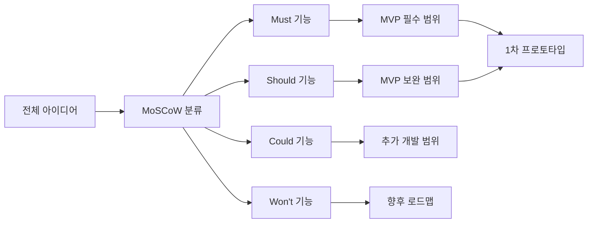

---

# 12. 실습 1: 개인 분류 실습

## 12.1 실습 목표

간단한 서비스의 기능을 개별적으로 분류하고 분류 근거를 작성한다.

## 12.2 실습 상황

### 서비스명

스마트 카페 주문 키오스크

### 사용자

카페에서 음료를 주문하는 일반 고객

### 핵심 목표

> 고객이 직원의 도움 없이 원하는 음료를 선택하고 주문할 수 있도록 한다.

### 개발 조건

* 개발 기간: 1주
* 결제는 실제 결제가 아닌 가상 결제로 구현
* 매장 내부 키오스크에서만 사용
* 한국어 사용자만 고려

## 12.3 기능 목록

1. 음료 목록 조회
2. 음료 상세 정보 조회
3. 음료 선택
4. 수량 선택
5. 장바구니 확인
6. 주문 확정
7. 가상 결제
8. 추천 음료 표시
9. 인기 메뉴 표시
10. 알레르기 정보 표시
11. 영어 지원
12. 사용자 얼굴 인식
13. 배경 색상 변경
14. 음성 주문
15. 포인트 적립

## 12.4 학생 활동

각 기능을 다음 표에 분류한다.

| 번호 | 기능          | M/S/C/W | 분류 근거 |
| -: | ----------- | ------- | ----- |
|  1 | 음료 목록 조회    |         |       |
|  2 | 음료 상세 정보 조회 |         |       |
|  3 | 음료 선택       |         |       |
|  4 | 수량 선택       |         |       |
|  5 | 장바구니 확인     |         |       |
|  6 | 주문 확정       |         |       |
|  7 | 가상 결제       |         |       |
|  8 | 추천 음료 표시    |         |       |
|  9 | 인기 메뉴 표시    |         |       |
| 10 | 알레르기 정보 표시  |         |       |
| 11 | 영어 지원       |         |       |
| 12 | 사용자 얼굴 인식   |         |       |
| 13 | 배경 색상 변경    |         |       |
| 14 | 음성 주문       |         |       |
| 15 | 포인트 적립      |         |       |

## 12.5 진행 방법

1. 개인별로 10분 동안 분류한다.
2. 두 명씩 결과를 비교한다.
3. 의견이 다른 기능을 찾아 토론한다.
4. Must로 분류한 기능의 근거를 발표한다.

## 12.6 예시 답안

| 기능       | 예시 분류  | 근거                            |
| -------- | ------ | ----------------------------- |
| 음료 목록 조회 | Must   | 주문할 상품을 확인해야 함                |
| 음료 상세 정보 | Should | 목록만으로도 선택 가능하지만 상세 정보가 있으면 좋음 |
| 음료 선택    | Must   | 주문 대상 선택에 필수                  |
| 수량 선택    | Must   | 주문 수량 결정에 필요                  |
| 장바구니 확인  | Must   | 주문 전 선택 내용을 확인해야 함            |
| 주문 확정    | Must   | 주문 완료에 필수                     |
| 가상 결제    | Must   | 실습 서비스의 주문 완료 과정에 포함          |
| 추천 음료    | Could  | 없어도 주문 가능                     |
| 인기 메뉴    | Could  | 선택을 돕지만 핵심 기능은 아님             |
| 알레르기 정보  | Should | 사용자 안전과 관련되어 중요함              |
| 영어 지원    | Won't  | 한국어 사용자만 고려함                  |
| 얼굴 인식    | Won't  | 개발 범위와 목표를 초과함                |
| 배경 색상 변경 | Could  | 개인화 기능이지만 핵심 기능이 아님           |
| 음성 주문    | Could  | 터치 방식으로 대체 가능                 |
| 포인트 적립   | Won't  | 회원 시스템과 추가 데이터가 필요함           |

알레르기 정보는 수업 토론에서 Must로 변경할 수도 있다. 중요한 것은 정답보다 서비스 조건과 사용자 안전을 근거로 설명하는 것이다.

---

# 13. 실습 2: 팀 프로젝트 실습

## 13.1 실습 주제

### AI 기반 취업 준비 도우미

사용자가 채용 공고를 관리하고 자기소개서 작성 계획을 세울 수 있도록 지원하는 서비스이다.

## 13.2 사용자 문제

* 여러 채용 공고의 마감일을 관리하기 어렵다.
* 어떤 기업의 자기소개서를 먼저 작성해야 할지 판단하기 어렵다.
* 자기소개서 작성 진행 상태를 확인하기 어렵다.

## 13.3 개발 조건

* 개발 기간: 2주
* 팀원: 4명
* 웹 기반 서비스
* 생성형 AI API 사용 가능
* 실제 채용 사이트 자동 수집은 제외
* 사용자가 채용 공고를 직접 입력한다고 가정

## 13.4 기능 후보

1. 채용 공고 등록
2. 회사명 입력
3. 직무명 입력
4. 지원 마감일 입력
5. 채용 공고 목록 조회
6. 채용 공고 수정
7. 채용 공고 삭제
8. 지원 상태 관리
9. 마감일 기준 정렬
10. AI 자기소개서 질문 분석
11. AI 자기소개서 초안 생성
12. AI 자기소개서 문장 수정
13. 자기소개서 작성 진행률 표시
14. 마감일 알림
15. 음성으로 채용 공고 등록
16. 채용 기업 뉴스 자동 수집
17. 채용 사이트 자동 로그인
18. 기업별 합격 가능성 예측
19. 다크 모드
20. 캐릭터 선택

## 13.5 팀 활동 구조

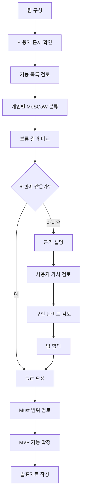

## 13.6 역할 분담

| 역할     | 주요 업무             |
| ------ | ----------------- |
| 진행자    | 회의 순서 관리          |
| 사용자 대표 | 사용자 관점에서 기능 가치 설명 |
| 개발 대표  | 구현 시간과 기술 난이도 검토  |
| 기록자    | 최종 분류와 근거 기록      |
| 발표자    | 팀 결과 발표           |

팀원이 4명인 경우 진행자와 발표자를 한 명이 함께 담당할 수 있다.

## 13.7 팀 결과물

팀은 다음 자료를 제출한다.

1. 서비스 목표 한 문장
2. 핵심 사용자 문제
3. 전체 기능 목록
4. MoSCoW 분류표
5. Must 기능 선정 근거
6. Won't 기능 제외 근거
7. MVP 화면 구성안
8. 팀 내 의견 충돌과 해결 과정

---

# 14. MoSCoW 워크시트

## 14.1 기본 정보

| 항목        | 작성 내용 |
| --------- | ----- |
| 서비스명      |       |
| 목표 사용자    |       |
| 핵심 사용자 문제 |       |
| 서비스 목표    |       |
| 개발 기간     |       |
| 팀원 수      |       |
| 사용 기술     |       |
| 제외 범위     |       |

## 14.2 기능 우선순위 표

| ID   | 기능명 | 사용자 가치 | 구현 난이도 | 의존 기능 | MoSCoW | 분류 근거 |
| ---- | --- | ------ | ------ | ----- | ------ | ----- |
| F-01 |     | 상·중·하  | 상·중·하  |       |        |       |
| F-02 |     | 상·중·하  | 상·중·하  |       |        |       |
| F-03 |     | 상·중·하  | 상·중·하  |       |        |       |
| F-04 |     | 상·중·하  | 상·중·하  |       |        |       |
| F-05 |     | 상·중·하  | 상·중·하  |       |        |       |

## 14.3 Must 검증표

Must로 분류한 기능마다 다음 질문에 답한다.

| 검증 질문                            | 예/아니오 |
| -------------------------------- | ----- |
| 이 기능이 없으면 핵심 사용자가 목표를 달성할 수 없는가? |       |
| 다른 기능이나 수작업으로 대체하기 어려운가?         |       |
| 서비스의 핵심 흐름에 직접 포함되는가?            |       |
| 개발 기간 안에 구현 가능한가?                |       |
| 테스트 가능한 완료 조건이 있는가?              |       |

대부분의 질문에 “아니오”가 나오면 Should로 낮추는 것을 검토한다.

---

# 15. 기능 명세서와 연결하기

MoSCoW 분류 결과는 기능 이름만 적는 것으로 끝나면 안 된다.

각 기능을 사용자가 수행하는 행동 형태로 작성해야 한다.

## 15.1 좋지 않은 기능 명세

* 로그인
* 일정관리
* AI 추천
* 알림

## 15.2 좋은 기능 명세

* 사용자는 이메일과 비밀번호를 입력하여 로그인할 수 있다.
* 사용자는 날짜, 시간, 제목을 입력하여 일정을 등록할 수 있다.
* 사용자는 등록된 일정을 날짜별로 조회할 수 있다.
* AI는 오늘 마감되는 일정을 우선적으로 요약할 수 있다.
* 시스템은 마감 하루 전에 알림 메시지를 표시할 수 있다.

## 15.3 사용자 스토리 연결

사용자 스토리는 다음 형식으로 작성할 수 있다.

> 나는 `[사용자]`로서, `[목적]`을 위해 `[기능]`을 원한다.

예:

> 나는 교육생으로서 오늘 해야 할 과제를 놓치지 않기 위해 마감 일정 목록을 확인하고 싶다.

| 사용자 스토리             | 기능       | 우선순위   |
| ------------------- | -------- | ------ |
| 오늘 해야 할 일정을 확인하고 싶다 | 오늘 일정 조회 | Must   |
| 중요한 일정을 먼저 확인하고 싶다  | 중요도 정렬   | Should |
| 말로 일정을 등록하고 싶다      | 음성 일정 등록 | Could  |
| 스마트워치에서 알림을 받고 싶다   | 스마트워치 연동 | Won't  |

---

# 16. Figma 프로토타입과 연결하기

MoSCoW 분류는 Figma 화면 설계의 순서를 결정하는 데 사용할 수 있다.

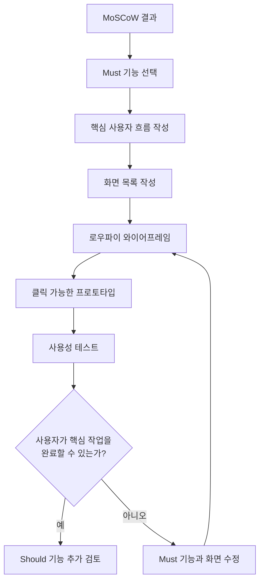

## 16.1 화면 설계 순서 예시

AI 일정관리 서비스의 경우:

1. 일정 목록 화면
2. 일정 등록 화면
3. 일정 수정 화면
4. 일정 상세 화면
5. AI 오늘 일정 요약 화면
6. 중요도 설정 화면
7. 알림 설정 화면
8. 테마 설정 화면

Must 기능과 관련된 화면을 먼저 제작하고, Should와 Could 화면을 이후에 추가한다.

---

# 17. 사용성 테스트와 우선순위 재검토

MoSCoW는 한 번 정하면 끝나는 것이 아니다.

사용성 테스트 결과에 따라 우선순위가 달라질 수 있다.

## 17.1 테스트 예시

### 과제

> “내일 오후 3시에 팀 프로젝트 회의를 등록한 뒤 오늘의 전체 일정을 확인하세요.”

### 관찰 결과

* 사용자가 일정 등록 버튼을 찾지 못했다.
* 날짜 입력 방식이 복잡했다.
* 일정 저장 성공 여부를 확인하지 못했다.
* AI 요약 결과가 너무 길었다.

## 17.2 우선순위 변경 예시

| 기능          | 기존 등급  | 변경 등급  | 변경 이유                |
| ----------- | ------ | ------ | -------------------- |
| 저장 완료 메시지   | Could  | Must   | 저장 여부를 사용자가 판단하지 못함  |
| 날짜 선택 개선    | Should | Must   | 일정 등록 과정을 완료하지 못함    |
| AI 요약 길이 조절 | Could  | Should | 핵심 정보 확인에 방해됨        |
| 캐릭터 선택      | Could  | Won't  | 핵심 사용성 개선을 먼저 수행해야 함 |

---

# 18. 자주 발생하는 오류

## 18.1 모든 기능을 Must로 분류한다

### 문제

팀원들이 자신이 제안한 기능을 중요하게 생각하여 모든 기능을 Must로 분류한다.

### 해결 방법

다음 질문을 한다.

> “이 기능이 없어도 사용자가 핵심 작업을 완료할 수 있는가?”

완료할 수 있다면 Should 또는 Could일 가능성이 높다.

---

## 18.2 구현하기 쉬운 기능을 Must로 정한다

### 문제

구현이 쉽다는 이유만으로 Must로 분류한다.

### 해결 방법

MoSCoW는 구현 난이도만으로 결정하지 않는다.

먼저 사용자 가치와 서비스 목적을 판단한다.

---

## 18.3 어려운 기능을 무조건 Won't로 정한다

### 문제

구현하기 어렵다는 이유만으로 중요한 기능을 제외한다.

### 해결 방법

사용자에게 반드시 필요한 기능이라면 범위를 줄여서 Must로 구현할 수 있다.

예:

* 완전한 AI 상담 기능 → 핵심 질문 3개만 처리
* 모든 파일 형식 지원 → PDF만 지원
* 다국어 지원 → 한국어만 지원
* 실시간 음성 인식 → 녹음 후 변환 방식으로 축소

---

## 18.4 Won't 기능을 삭제한다

### 문제

이번에 개발하지 않는 기능을 완전히 제거한다.

### 해결 방법

Won't 기능은 다음 버전을 위한 백로그에 보관한다.

---

## 18.5 기능의 기준이 너무 크다

### 문제

“회원 기능”, “AI 기능”, “관리 기능”처럼 기능 단위가 너무 크다.

### 해결 방법

사용자가 실제로 수행하는 행동 단위로 나눈다.

예:

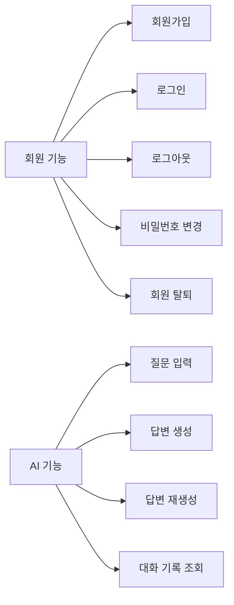

---

# 19. 강사용 토론 질문

다음 질문을 활용하여 학생 토론을 진행한다.

1. 회원가입은 모든 서비스에서 Must인가?
2. 로그인 없이 사용할 수 있는 서비스라면 회원가입은 어떤 등급인가?
3. AI 서비스에서 AI 기능은 항상 Must인가?
4. 사용자가 직접 수행할 수 있는 기능을 AI가 자동화하면 Must인가, Should인가?
5. 다크 모드는 Could인가, Should인가?
6. 장애인 사용자를 위한 접근성 기능은 어떤 등급이어야 하는가?
7. 보안 기능은 사용자가 직접 보지 못하더라도 Must인가?
8. Won't 기능을 다음 버전에서 다시 검토해야 하는 이유는 무엇인가?
9. Must 기능이 너무 많을 때 어떤 기준으로 줄여야 하는가?
10. 사용성 테스트 후 우선순위가 변경될 수 있는가?

---

# 20. 팀 발표 형식

팀별 발표 시간은 5분으로 제한한다.

## 발표 순서

1. 서비스명과 목표 사용자
2. 해결하려는 핵심 문제
3. Must 기능
4. 가장 논쟁이 많았던 기능
5. Won't로 제외한 기능
6. 최종 MVP 범위
7. 팀이 내린 가장 중요한 결정

## 발표용 구조

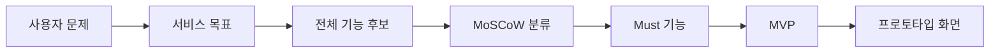

---

# 21. 평가 기준

총점 100점 기준으로 평가한다.

| 평가 항목       |   배점 | 평가 내용                  |
| ----------- | ---: | ---------------------- |
| 사용자 문제 이해   |  15점 | 핵심 사용자와 문제를 명확히 정의했는가  |
| 기능 구체성      |  15점 | 기능이 실제 행동 단위로 작성되었는가   |
| Must 선정 적절성 |  25점 | 핵심 문제 해결에 반드시 필요한 기능인가 |
| 분류 근거       |  20점 | 각 우선순위에 논리적인 근거가 있는가   |
| 개발 현실성      |  10점 | 기간과 기술 수준을 고려했는가       |
| 팀 합의 과정     |   5점 | 의견 차이를 근거를 통해 해결했는가    |
| 발표 명확성      |  10점 | 결과를 이해하기 쉽게 설명했는가      |
| 합계          | 100점 |                        |

## 평가 수준 예시

### 우수

* Must 기능이 핵심 문제와 직접 연결된다.
* 모든 기능에 구체적인 근거가 있다.
* 개발 기간과 기술 수준을 현실적으로 고려했다.
* Won't 기능도 향후 계획으로 관리한다.

### 보통

* 기능은 분류했지만 일부 근거가 부족하다.
* Must와 Should의 차이가 명확하지 않다.
* 개발 기간에 비해 Must 기능이 다소 많다.

### 개선 필요

* 대부분의 기능을 Must로 분류했다.
* 서비스 목표와 기능의 연결이 부족하다.
* 구현 난이도나 개인 선호만으로 우선순위를 정했다.

---

# 22. 형성평가 퀴즈

## 문제 1

다음 중 Must에 가장 가까운 설명은 무엇인가?

1. 있으면 화면이 더 예뻐지는 기능
2. 개발자가 구현하고 싶은 기능
3. 없으면 핵심 서비스가 작동하지 않는 기능
4. 다음 버전에서 개발할 기능

### 정답

3번

---

## 문제 2

Won't Have의 올바른 의미는 무엇인가?

1. 절대 개발하지 않는 기능
2. 중요하지 않은 기능
3. 사용자가 원하지 않는 기능
4. 이번 개발 범위에서는 구현하지 않는 기능

### 정답

4번

---

## 문제 3

음성 입력 기능이 없어도 키보드 입력으로 동일한 작업을 수행할 수 있다. 일반적으로 가장 적절한 분류는 무엇인가?

1. Must
2. Should 또는 Could
3. 항상 Won't
4. 분류할 수 없음

### 정답

2번

---

## 문제 4

다음 중 MoSCoW 분류 전에 가장 먼저 정의해야 할 것은 무엇인가?

1. 화면 색상
2. 개발자의 선호 기술
3. 목표 사용자와 핵심 문제
4. 발표 자료 디자인

### 정답

3번

---

## 문제 5

팀에서 모든 기능을 Must로 분류했다. 가장 적절한 조치는 무엇인가?

1. 기능을 더 추가한다.
2. 모든 기능을 그대로 개발한다.
3. 핵심 작업에 반드시 필요한 기능인지 다시 검토한다.
4. 모든 기능을 Could로 변경한다.

### 정답

3번

---

# 23. 수업 마무리 정리

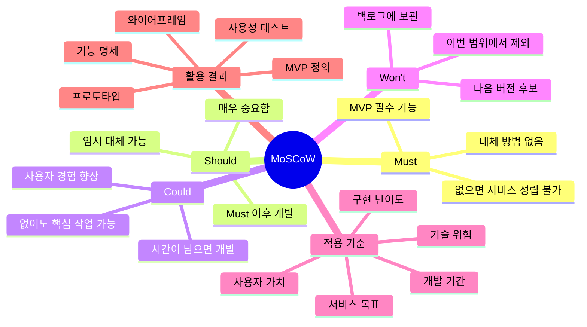

## 핵심 정리

1. MoSCoW는 기능의 중요도를 결정하는 것이 아니라 개발 순서를 합의하는 방법이다.
2. Must는 없으면 핵심 서비스가 성립하지 않는 기능이다.
3. Should는 중요하지만 다른 방법으로 대체할 수 있는 기능이다.
4. Could는 사용자 경험을 개선하지만 핵심 문제 해결에는 필수적이지 않은 기능이다.
5. Won't는 영구 제외가 아니라 이번 개발 범위에서 제외하는 기능이다.
6. 서비스 목표, 사용자 문제, 개발 기간을 먼저 정의해야 한다.
7. Must 기능만으로도 사용자의 핵심 문제를 해결할 수 있어야 한다.
8. 사용성 테스트 결과에 따라 우선순위를 다시 조정해야 한다.

---

# 24. 학생 과제

## 과제 주제

학생이 기획하고 있는 AI 서비스의 기능을 MoSCoW로 분류한다.

## 제출 내용

1. 서비스명
2. 목표 사용자
3. 핵심 사용자 문제
4. 서비스 목표
5. 기능 후보 15개 이상
6. MoSCoW 분류표
7. Must 기능 선정 근거
8. Won't 기능 제외 근거
9. Must 기능 중심의 핵심 사용자 흐름
10. Figma 와이어프레임 3개 이상

## 사용자 흐름 예시

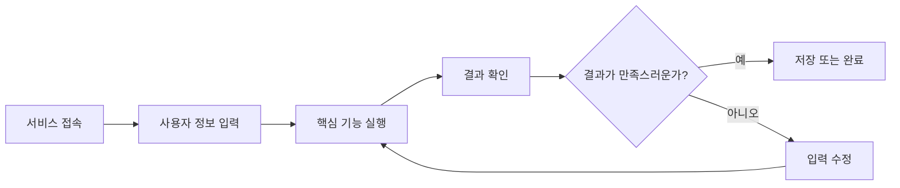

## 과제 평가 포인트

* 기능 수가 많은가보다 핵심 문제와 연결되는가가 중요하다.
* Must 기능마다 반드시 선정 근거가 있어야 한다.
* 개발 기간 안에 구현할 수 있는 범위여야 한다.
* Won't 기능도 삭제하지 말고 다음 버전 후보로 기록한다.
* 와이어프레임은 Must 기능의 사용자 흐름을 중심으로 작성한다.

이 자료는 그대로 강의안으로 사용할 수 있으며, 다음 단계에서는 **MoSCoW 실습용 학생 워크시트, 팀별 활동지, Figma 화면 설계 과제**로 분리해 구성할 수 있습니다.
