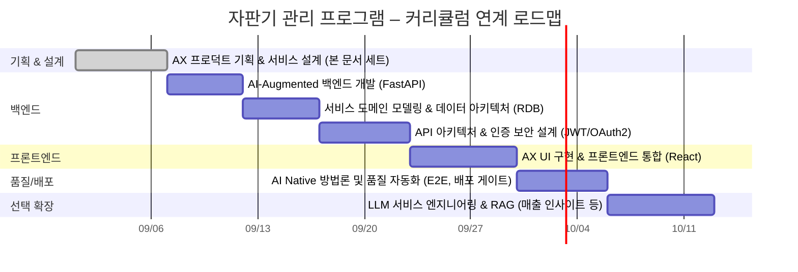

# 자판기 관리 프로그램 (웹 버전) 프로그램 기획서

| 항목 | 내용 |
|---|---|
| 문서명 | 프로그램 기획서 |
| 프로젝트명 | 자판기 관리 프로그램 – 웹 버전 (VM_Ver01) |
| 버전 | v1.0 |
| 작성일 | 2026-09-06 |
| 커리큘럼 단계 | AX 프로덕트 기획 & 서비스 설계 (72시간) |

> 본 문서는 **코딩 착수 이전 단계**의 산출물로서, 이미 구현된 1단계 프론트엔드 결과물을 근거로
> "기획이 먼저 있었다면 어떤 모습이었을까"를 역구성(逆構成)한 기획서다. 실제 개발 과정에서 얻은
> 요구사항과 설계 결정을 정리하여, 이후 백엔드/DB/인증/React 전환 단계에서 참조 가능한 기준
> 문서로 삼는다.

## 1. 프로젝트 개요

기존에는 Java(Swing/Socket) 기반으로 설계되었던 "네트워크 프로그래밍" 교과목의 자판기 관리
프로그램(별첨: `자판기관리프로그램_보고서(설계서 포함).pdf`)을, **웹 환경(HTML/CSS/JavaScript)**
으로 재구성하여 이후 React·FastAPI 기반 풀스택 서비스로 단계적으로 확장하는 것을 목표로 한다.

- 소비자는 브라우저에서 실제 자판기를 조작하듯 동전/지폐를 투입하고 음료를 구매한다.
- 관리자는 별도 인증을 거쳐 재고·잔돈·매출·테마를 관리한다.
- 1단계(현재)는 프론트엔드 단독 구현이며, 데이터는 브라우저 `localStorage`에 저장한다.

## 2. 추진 배경 및 목적

| 배경 | 목적 |
|---|---|
| 기존 자판기 프로그램은 데스크톱(Java Swing) 전용이라 접근성이 낮음 | 브라우저만 있으면 실행 가능한 서비스로 전환 |
| 원본 설계서의 핵심 도메인 로직(잔돈 계산, 수금, 매출 집계)은 플랫폼과 무관하게 유효함 | 도메인 로직을 프레임워크 독립적인 엔진 계층으로 분리·재사용 |
| 커리큘럼상 이후 단계(백엔드/DB/인증/React)에서 동일 프로젝트를 계속 확장해야 함 | 처음부터 백엔드 교체가 쉬운 아키텍처(Repository 패턴)로 설계 |

## 3. 대상 사용자 (이해관계자)

| 구분 | 설명 | 주요 니즈 |
|---|---|---|
| 고객(소비자) | 자판기에서 음료를 구매하는 일반 사용자 | 직관적인 투입/구매/반환 경험 |
| 관리자 | 자판기 운영자 | 재고·잔돈·매출 관리, 수금, 보안(비밀번호) |
| 교육생(개발자) | 본 커리큘럼 수강생 | 단계별로 백엔드·DB·인증·프론트엔드를 이어 붙일 수 있는 구조 |

## 4. 프로젝트 범위

### 4.1 1단계 범위 (완료 — 본 문서의 기준 시점)

- 소비자 화면: 음료 진열/구매, 동전·지폐 드래그앤드롭 투입, 잔돈 반환, 반환구 누적
- 관리자 화면: 로그인, 음료(재고/가격/이름) 관리, 신규 상품 추가·삭제, 잔돈 관리, 수금, 매출 조회,
  매출 차트(Google Charts), 비밀번호 변경, 화면 테마(4계절) 변경
- 데이터 저장: 브라우저 `localStorage` (Repository 패턴으로 캡슐화)

### 4.2 범위 제외 (2단계 이후로 이관)

- 실제 서버·데이터베이스 연동, 다중 자판기·서버 집계(원본 Java 설계서의 Socket 통신 요구사항)
- 회원/관리자 인증의 서버측 검증(JWT), 비밀번호 해시 저장
- React 기반 프론트엔드 재구현
- E2E 테스트 자동화 및 배포 파이프라인
- LLM 기반 부가 기능(예: 매출 인사이트 자동 요약) — 선택 확장 항목

## 5. 기대 효과

- 커리큘럼 각 단계(백엔드/DB/인증/프론트엔드/품질자동화)를 하나의 실제 프로젝트로 관통 학습
- 도메인 로직과 UI 로직을 분리한 설계 경험(엔진 계층 vs 화면 계층)
- 실물 자판기 UI 구조를 화면 설계에 반영하는 UX 설계 경험

## 6. 커리큘럼 연계 로드맵

## 7. 산출물 목록 (본 문서 세트)

| No. | 문서명 | 파일 |
|---|---|---|
| 1 | 프로그램 기획서 | `01_프로그램_기획서.md` (본 문서) |
| 2 | 요구사항 정의서 | `02_요구사항_정의서.md` |
| 3 | 요구사항 명세서 | `03_요구사항_명세서.md` |
| 4 | 기능/비기능 명세서 | `04_기능_비기능_명세서.md` |
| 5 | 와이어프레임 | `05_와이어프레임.md` |
| 6 | 스토리보드 | `06_스토리보드.md` |
| 7 | 완성 로드맵 (커리큘럼 매핑) | `07_완성_로드맵.md` |

## 8. 참고 자료

- `자판기관리프로그램_보고서(설계서 포함).pdf` (원본 Java/Swing/Socket 설계서)
- `AX 서비스 풀스택 빌더 과정 - 교과목 목록.pdf` (커리큘럼)
- 현재 구현 소스: `VM_Ver01/frontend/`
