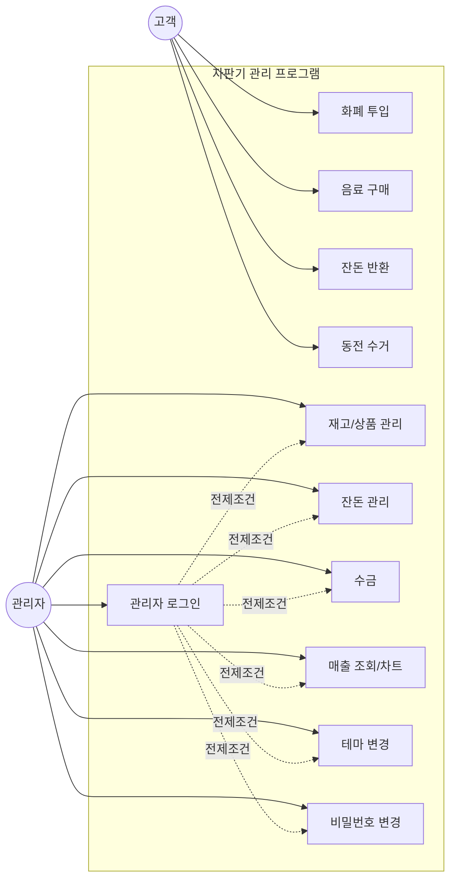

# 요구사항 정의서

| 항목 | 내용 |
|---|---|
| 문서명 | 요구사항 정의서 (Requirements Definition) |
| 관련 문서 | `01_프로그램_기획서.md` |
| 버전 | v1.0 |
| 작성일 | 2026-09-06 |

## 1. 목적

이해관계자의 요구를 식별·구조화하여 "무엇을 만들 것인가"를 확정한다. 본 문서는 원본 Java 설계서의
요구분석 내용과, 실제 개발 과정에서 사용자(발주자 역할)가 반복적으로 제시한 요구 — 예: "동전은
드래그앤드롭으로", "재고는 관리자만 볼 수 있게", "차트는 상품별/일자별로 구분" 등 — 을 통합하여
정의한다.

## 2. 이해관계자 (Stakeholders)

| 이해관계자 | 역할 | 관심사 |
|---|---|---|
| 고객(소비자) | 최종 사용자 | 빠르고 직관적인 구매 경험 |
| 관리자 | 운영자 | 재고/현금/매출 통제, 보안 |
| 개발팀(교육생) | 구현 주체 | 확장 가능한 아키텍처, 커리큘럼 단계별 이행 |

## 3. 요구사항 도출 방법

1. **원본 문서 분석**: 기존 Java 자판기 프로그램 설계서(요구분석/상위설계/상세설계)의 기능 목록을
   웹 환경 제약(브라우저 보안, 서버 부재)에 맞게 재해석
2. **반복적 사용자 피드백**: 실제 개발 세션에서 발주자가 화면을 보고 즉시 제시한 수정 요구를
   요구사항으로 역채택(예: 재고 텍스트 노출 제거, 배치 변경, 색상 지정 등)
3. **커리큘럼 제약 반영**: "AX 프로덕트 기획 & 서비스 설계" 단계 산출물 형식(기획서~스토리보드)에
   맞춰 정리

## 4. 사용자 요구사항 목록 (User Requirements)

> 원본 요구사항은 `UR-XX`로 식별하며, 이후 `03_요구사항_명세서.md`의 유스케이스(UC) 및
> `04_기능_비기능_명세서.md`의 기능요구사항(FR)으로 구체화된다.

### 4.1 소비자 관점

| ID | 요구사항 | 출처 |
|---|---|---|
| UR-01 | 화폐(동전 10/50/100/500원, 지폐 1,000/5,000원)를 투입할 수 있어야 한다 | 원본 설계서 |
| UR-02 | 동전/지폐는 실제 자판기처럼 투입구에 넣는 동작(드래그앤드롭)으로 표현되어야 한다 | 개발 중 추가 요구 |
| UR-03 | 총 투입 금액은 7,000원, 지폐는 5,000원을 초과할 수 없다 | 원본 설계서 |
| UR-04 | 투입 금액과 재고에 따라 구매 가능 여부가 시각적으로 구분되어야 한다 | 원본 설계서 + 개발 중 수정(배경색→테두리) |
| UR-05 | 재고가 없거나 금액이 부족한 상품은 클릭되지 않아야 한다 | 개발 중 추가 요구 |
| UR-06 | 재고 수량 자체는 소비자 화면에 노출하지 않는다 | 개발 중 추가 요구 |
| UR-07 | 잔돈은 보유 동전 중 큰 단위부터 반환하고, 부족하면 최대치만 반환한다 | 원본 설계서 |
| UR-08 | 반환된 동전은 즉시 사라지지 않고 반환구에 쌓여 있다가 사용자가 직접 수거해야 한다 | 개발 중 추가 요구 |
| UR-09 | 상품 배출구는 항상 화면에 보이는 고정 영역이어야 한다 | 개발 중 추가 요구(와이어프레임 반영) |
| UR-10 | 관리자 화면은 처음부터 보이지 않고, 별도 버튼/로그인 절차를 거쳐야 나타난다 | 개발 중 추가 요구 |

### 4.2 관리자 관점

| ID | 요구사항 | 출처 |
|---|---|---|
| UR-11 | 8자 이상, 숫자/특수문자 포함 비밀번호로 인증해야 한다 | 원본 설계서 |
| UR-12 | 비밀번호를 변경할 수 있어야 한다 | 원본 설계서 |
| UR-13 | 음료 재고를 조회·추가할 수 있어야 한다 | 원본 설계서 |
| UR-14 | 신규 음료 상품을 이미지와 함께 추가하거나 삭제할 수 있어야 한다 | 개발 중 추가 요구 |
| UR-15 | 잔돈 재고를 조회·추가할 수 있어야 한다 | 원본 설계서 |
| UR-16 | 총 매출액과 보유 현금을 조회할 수 있어야 한다 | 원본 설계서 |
| UR-17 | 수금 시 반환용 최소 잔돈은 남겨두어야 한다 | 원본 설계서 |
| UR-18 | 일별/월별 매출을 상품별로 조회할 수 있어야 한다 | 원본 설계서 + 개발 중 확장(상품명 컬럼) |
| UR-19 | 매출을 막대/선/파이 차트로, 일자별·상품별 기준으로 볼 수 있어야 한다 | 개발 중 추가 요구 |
| UR-20 | 자판기 화면의 테마(스킨)를 계절별로 바꿀 수 있어야 한다 | 개발 중 추가 요구 |
| UR-21 | 각 음료의 판매 가격과 이름을 변경할 수 있어야 한다 | 원본 설계서 |

### 4.3 시스템/아키텍처 관점

| ID | 요구사항 | 출처 |
|---|---|---|
| UR-22 | 재고/매출/현금/비밀번호/테마는 새로고침해도 유지되어야 한다 | 원본 설계서(파일 저장 요구를 localStorage로 대체) |
| UR-23 | 진행 중인 거래(투입 금액)는 세션이 끝나면 초기화되어야 한다 | 개발 중 발견된 결함 → 요구사항으로 승격 |
| UR-24 | 데이터 저장 방식은 이후 백엔드로 교체하기 쉬운 구조여야 한다 | 커리큘럼 로드맵 반영 |

## 5. Actor–Goal 요약표

| Actor | Goal |
|---|---|
| 고객 | 원하는 음료를 정확한 금액으로 구매하고, 남은 돈을 돌려받는다 |
| 관리자 | 자판기 운영 현황(재고/현금/매출)을 파악하고 통제한다 |

## 6. 상위 유스케이스 다이어그램

다음 문서(`03_요구사항_명세서.md`)에서 각 유스케이스를 정상/대안/예외 흐름으로 상세화한다.
