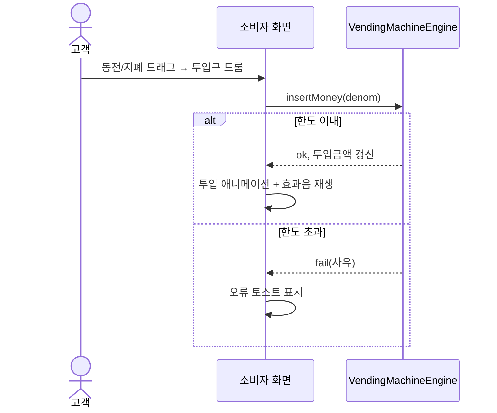
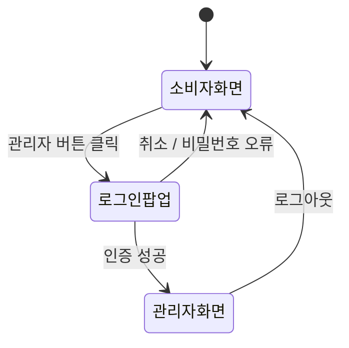
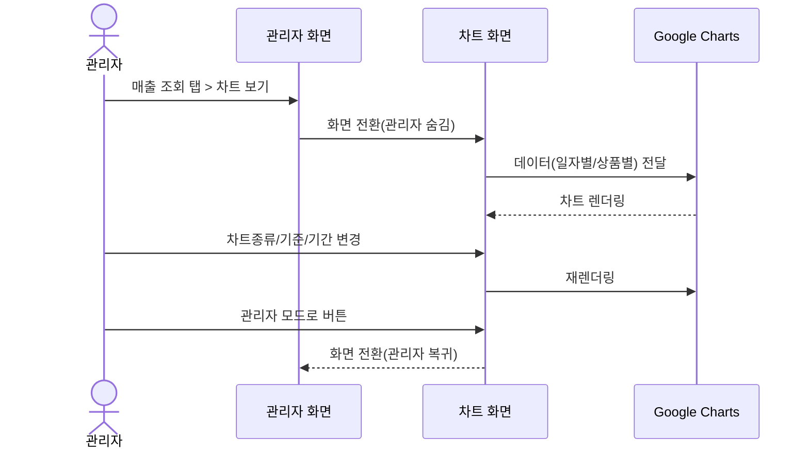

# 요구사항 명세서 (Requirements Specification)

| 항목 | 내용 |
|---|---|
| 관련 문서 | `02_요구사항_정의서.md` |
| 버전 | v1.0 |
| 작성일 | 2026-09-06 |

본 문서는 `02_요구사항_정의서.md`의 유스케이스를 **정상 흐름 / 대안 흐름 / 예외 흐름**으로
구체화한다. 각 유스케이스는 이후 `04_기능_비기능_명세서.md`의 기능요구사항(FR-xx)과
1:N으로 매핑된다.

---

## UC-01. 화폐 투입

- **액터**: 고객
- **목표**: 동전 또는 지폐를 자판기에 투입하여 구매 가능 잔액을 늘린다
- **사전조건**: 소비자 화면이 활성 상태
- **트리거**: 동전/지폐 칩을 투입구로 드래그하거나 클릭

| 구분 | 흐름 |
|---|---|
| 정상 흐름 | 1) 사용자가 동전/지폐 칩을 투입구로 드롭(또는 클릭) → 2) 시스템이 총 투입 한도(7,000원)·지폐 한도(5,000원)를 검사 → 3) 통과 시 투입 금액에 반영, 해당 화폐를 보유 현금에 가산 → 4) 칩이 투입구로 날아가 사라지는 애니메이션과 효과음 재생 |
| 대안 흐름 | 사용자가 클릭으로 투입한 경우도 동일 로직 수행(드래그와 클릭은 동일 처리 경로 공유) |
| 예외 흐름 | 총 투입 한도 초과 시 → 투입 거부, 오류 토스트 표시("총 투입 금액은 7,000원을 초과할 수 없습니다") / 지폐 한도 초과 시 → 동일하게 거부 |

---

## UC-02. 음료 구매

- **액터**: 고객
- **사전조건**: 투입 금액 ≥ 음료 가격, 해당 음료 재고 > 0
- **트리거**: 구매 가능(테두리 강조) 상태의 음료 버튼 클릭

| 구분 | 흐름 |
|---|---|
| 정상 흐름 | 1) 사용자가 구매가능 음료 클릭 → 2) 재고 1개 차감, 투입 금액에서 가격 차감, 총 매출액 가산, 판매기록 적재 → 3) 상품 배출구에 음료 표시 → 4) 사용자가 배출구 클릭 시 안내 문구로 복귀 |
| 대안 흐름 | 구매 후 잔액이 남아있으면 별도 반환 없이 추가 구매를 계속 진행할 수 있다 |
| 예외 흐름 | 품절/금액부족 상품은 애초에 클릭이 비활성화되어 있어 본 유스케이스가 트리거되지 않는다(사전 차단) |

---

## UC-03. 잔돈 반환

- **액터**: 고객
- **사전조건**: 투입 금액 > 0
- **트리거**: "잔돈 반환" 버튼 클릭

| 구분 | 흐름 |
|---|---|
| 정상 흐름 | 1) 반환 버튼 클릭 → 2) 보유 동전(500→100→50→10원 순)으로 투입 금액만큼 조합 → 3) 반환구에 동전 이미지+개수로 누적 표시, 투입 금액 0으로 초기화 |
| 대안 흐름 | 이미 반환구에 동전이 남아있는 상태에서 다시 반환하면 기존 수량에 누적(합산)된다 |
| 예외 흐름 | 보유 동전으로 정확한 금액을 만들 수 없으면 가능한 최대치만 반환하고 경고 표시 / 보유 동전이 전혀 없으면 에러 표시, 투입 금액은 변경되지 않음 |

---

## UC-04. 동전 수거 (반환구 비우기)

- **액터**: 고객
- **트리거**: "동전 비우기" 버튼 클릭
- **정상 흐름**: 반환구의 모든 동전 표시를 제거한다(실제 동전을 손으로 가져간 것으로 간주). 이
  상태는 화면 세션에만 존재하며 새로고침 시 자동 초기화된다.

---

## UC-05. 관리자 로그인

- **액터**: 관리자
- **트리거**: 소비자 화면의 "관리자" 버튼 클릭

| 구분 | 흐름 |
|---|---|
| 정상 흐름 | 1) 관리자 버튼 클릭 → 로그인 팝업 표시 → 2) 비밀번호 입력 후 확인 → 3) 일치 시 팝업 닫힘, 소비자 화면 페이드아웃, 관리자 화면 등장 |
| 예외 흐름 | 비밀번호 불일치 → 팝업 내 오류 메시지 표시, 화면 전환 없음 |
| 종료 | "로그아웃" 클릭 시 반대 순서로 관리자 화면이 사라지고 소비자 화면 복귀 |

---

## UC-06. 재고/상품 관리

- **액터**: 관리자 (로그인 필요)

| 구분 | 흐름 |
|---|---|
| 정상 흐름(재고 추가) | 음료 관리 탭 → "+ 재고 추가" → 대상 상품 선택(전체선택 가능) + 수량(10/15/20) 선택 → 추가 |
| 정상 흐름(상품 추가) | "+ 새 상품 추가" → 이름/가격/초기재고 입력 + 이미지 업로드 → 목록 맨 끝에 신규 상품 등록 |
| 정상 흐름(상품 삭제) | 목록의 "삭제" 클릭 → 확인 → 상품 및 연결된 업로드 이미지 제거 |
| 정상 흐름(정보 수정) | 이름/가격 입력칸 수정 → "저장" |
| 예외 흐름 | 가격이 0 이하이거나 이름이 비어있으면 저장 거부 |

---

## UC-07. 잔돈 관리

- **액터**: 관리자
- **정상 흐름**: 잔돈 관리 탭에서 동전 단위별 보유 수량 확인 → "+ 잔돈 추가"로 단위·수량 선택 후 추가

---

## UC-08. 수금

- **액터**: 관리자

| 구분 | 흐름 |
|---|---|
| 정상 흐름 | "수금하기" 클릭 → 1,000원 단위부터 차례로 차감하되, 반환용 최소 잔돈(500원 5개, 100원 4개, 50원 5개, 10원 5개)은 남김 → 수금액과 내역 표시 |
| 예외 흐름 | 최소 잔돈을 넘는 여유분이 없으면 "수금할 금액이 없습니다" 안내 |

---

## UC-09. 매출 조회 및 차트

- **액터**: 관리자

| 구분 | 흐름 |
|---|---|
| 정상 흐름(표) | 매출 조회 탭 → 기간(일별/월별) · 정렬(날짜/상품명/매출액/판매량) 선택 → 표 갱신 |
| 정상 흐름(차트) | "차트 보기" 클릭 → 관리자 화면 대신 차트 화면 표시 → 차트종류(막대/선/파이) × 기준(일자별/상품별) 조합 선택 → Google Charts로 렌더링 |
| 대안 흐름 | 일자별+막대 조합일 때는 상품별 판매량 누적 막대그래프를 추가로 표시 |
| 복귀 | "← 관리자 모드로" 클릭 시 매출 조회 탭으로 복귀 |

---

## UC-10. 테마 변경

- **액터**: 관리자
- **정상 흐름**: 테마 설정 탭 → 봄/여름/가을/겨울 카드 중 선택 → 즉시 전체 화면 색상 테마 반영,
  선택값은 저장되어 다음 접속 시에도 유지

---

## UC-11. 비밀번호 변경

- **액터**: 관리자
- **정상 흐름**: 현재 비밀번호 확인 → 신규 비밀번호(8자 이상, 숫자+특수문자 포함) 입력 → 확인란과
  일치 시 변경
- **예외 흐름**: 현재 비밀번호 불일치 / 신규 비밀번호 정책 미충족 / 확인란 불일치 시 변경 거부 및
  사유 표시
