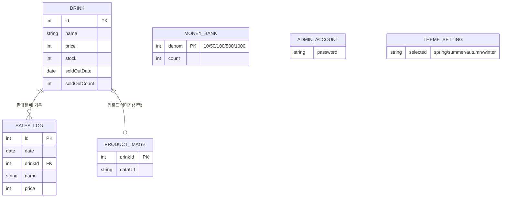
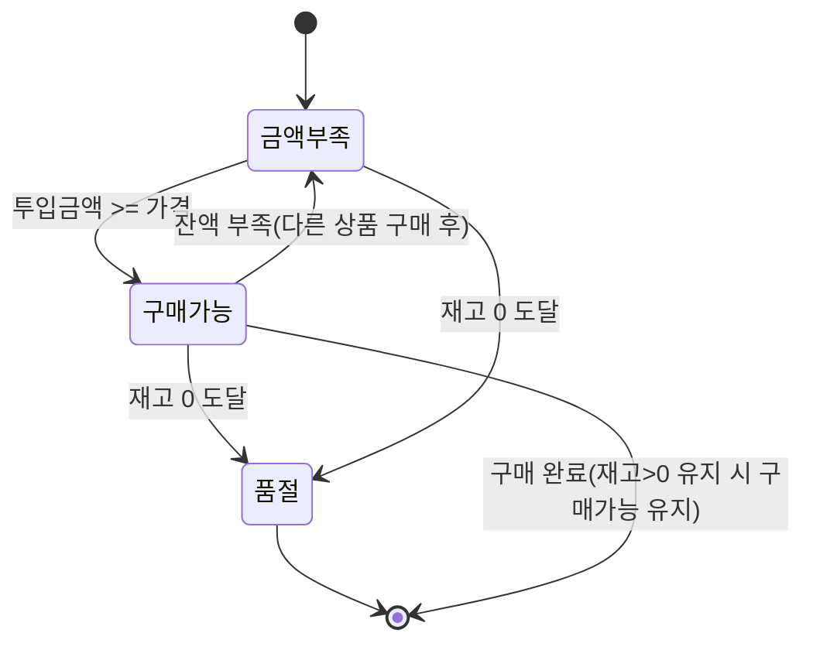
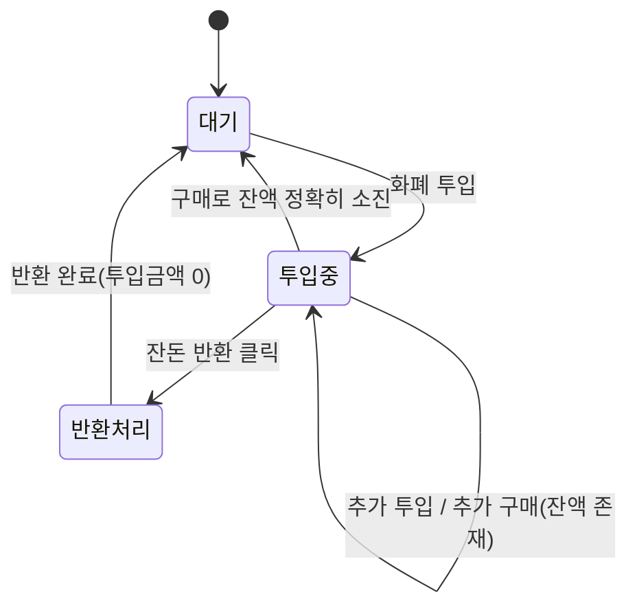

# 기능/비기능 명세서

| 항목 | 내용 |
|---|---|
| 관련 문서 | `03_요구사항_명세서.md` |
| 버전 | v1.0 |
| 작성일 | 2026-09-06 |

## 1. 기능 요구사항 (Functional Requirements)

우선순위: `필수` = 원본 설계서 명시 항목, `추가` = 개발 과정에서 발주자가 추가 요청한 항목

| ID | 기능 설명 | 관련 UC | 우선순위 |
|---|---|---|---|
| FR-01 | 동전(10/50/100/500원)을 드래그앤드롭 또는 클릭으로 투입한다 | UC-01 | 필수 |
| FR-02 | 지폐(1,000/5,000원)를 드래그앤드롭 또는 클릭으로 투입한다 | UC-01 | 필수 |
| FR-03 | 총 투입 금액 7,000원, 지폐 누적 5,000원 상한을 검증한다 | UC-01 | 필수 |
| FR-04 | 투입 시 화폐 이미지가 투입구로 이동하는 애니메이션과 효과음을 재생한다 | UC-01 | 추가 |
| FR-05 | 음료 목록을 이미지+이름+가격으로 표시하고, 가로 3열로 배치한다 | UC-02 | 추가 |
| FR-06 | 구매 가능(잔액충분·재고있음) 음료만 클릭 가능하도록 하고 굵은 오렌지 테두리로 표시한다 | UC-02 | 추가 |
| FR-07 | 재고 수량은 소비자 화면에 노출하지 않는다 | UC-02 | 추가 |
| FR-08 | 구매 시 재고 차감, 잔액 차감, 매출 누적, 판매기록 적재를 원자적으로 수행한다 | UC-02 | 필수 |
| FR-09 | 상품 배출구는 상시 노출되는 고정 영역이며, 구매 시 내용만 갱신된다 | UC-02 | 추가 |
| FR-10 | 잔돈 반환 시 보유 동전을 큰 단위부터 조합하여 반환한다 | UC-03 | 필수 |
| FR-11 | 반환 가능 동전이 부족하면 최대치만 반환하고 경고, 전무하면 에러를 표시한다 | UC-03 | 필수 |
| FR-12 | 반환된 동전은 반환구에 누적 표시되며, "동전 비우기"로만 사라진다 | UC-03, UC-04 | 추가 |
| FR-13 | 관리자 버튼 클릭 시 로그인 팝업을 띄우고, 인증 전에는 관리자 화면을 노출하지 않는다 | UC-05 | 추가 |
| FR-14 | 로그인 성공/로그아웃 시 소비자·관리자 화면이 교차 전환(페이드)된다 | UC-05 | 추가 |
| FR-15 | 관리자는 8자 이상, 숫자+특수문자 포함 비밀번호로 인증한다 | UC-05 | 필수 |
| FR-16 | 관리자는 음료 재고를 조회하고, 수량을 선택 추가할 수 있다 | UC-06 | 필수 |
| FR-17 | 관리자는 이미지 포함 신규 상품을 추가/삭제할 수 있다 | UC-06 | 추가 |
| FR-18 | 관리자는 음료의 이름과 가격을 수정할 수 있다 | UC-06 | 필수 |
| FR-19 | 관리자는 잔돈 재고를 조회·추가할 수 있다 | UC-07 | 필수 |
| FR-20 | 관리자는 총 매출액과 보유 현금을 조회할 수 있다 | UC-08 | 필수 |
| FR-21 | 수금 시 최소 잔돈(500×5, 100×4, 50×5, 10×5)을 유지한 채 차감한다 | UC-08 | 필수 |
| FR-22 | 매출을 일별/월별, 상품별로 조회하고 정렬(날짜/상품명/매출액/판매량)할 수 있다 | UC-09 | 필수 |
| FR-23 | 매출을 막대/선/파이 차트로, 일자별/상품별 기준으로 시각화한다 | UC-09 | 추가 |
| FR-24 | 일자별+막대 조합 시 상품별 판매량 누적 막대그래프를 함께 표시한다 | UC-09 | 추가 |
| FR-25 | 관리자는 화면 테마를 4계절 중 선택할 수 있다 | UC-10 | 추가 |
| FR-26 | 관리자는 비밀번호를 정책에 맞게 변경할 수 있다 | UC-11 | 필수 |

## 2. 비기능 요구사항 (Non-Functional Requirements)

| ID | 분류 | 내용 |
|---|---|---|
| NFR-01 | 성능 | 사용자 액션(투입/구매/반환) 후 200ms 이내에 화면이 갱신되어야 한다 |
| NFR-02 | 데이터 영속성 | 재고, 매출, 보유 현금, 관리자 비밀번호, 테마 설정은 새로고침·재시작 후에도 유지된다(`localStorage`) |
| NFR-03 | 데이터 휘발성 | 진행 중 투입 금액과 반환구 미수령 동전은 세션(새로고침) 종료 시 초기화되어야 한다 |
| NFR-04 | 확장성 | 데이터 저장소(`Repository`)와 이미지 저장소(`ImageStore`)는 인터페이스로 캡슐화하여, 추후 REST API 호출로 내부 구현만 교체 가능해야 한다 |
| NFR-05 | 보안(현 단계 한계) | 관리자 비밀번호는 정책(8자+숫자+특수문자)을 강제하나, 1단계는 브라우저 저장소에 평문으로 저장한다. **백엔드 전환 시 해시 저장 및 서버측 검증으로 대체 필수** |
| NFR-06 | 사용성 | 구매 불가 상품은 비활성화(disabled)와 시각적 구분을 함께 제공해 오조작을 방지한다 |
| NFR-07 | 호환성 | 최신 Chromium 계열 브라우저 기준으로 Drag & Drop API, Web Audio API를 지원해야 한다 |
| NFR-08 | 외部 의존성 | 매출 차트는 Google Charts(CDN)를 사용하며, 로드 실패/지연 시 "불러오는 중" 상태로 안전하게 대기해야 한다 |
| NFR-09 | 반응형 레이아웃 | 음료 목록·동전/지폐 트레이는 항목이 늘어나도 각 영역 내부 스크롤로 처리하고, 전체 레이아웃은 고정되어야 한다 |
| NFR-10 | 유지보수성 | 화면 로직(패널)과 도메인 로직(엔진)을 분리하여, UI를 교체(React 전환)해도 도메인 로직 재사용이 가능해야 한다 |

## 3. 데이터 명세 (1단계 기준)

> 1단계에서는 위 엔티티가 모두 `localStorage`의 JSON 구조(`vendingMachineState_v1`,
> `vendingMachineProductImages_v1`)로 저장된다. `07_완성_로드맵.md`에서 이를 RDB 스키마로
> 전환하는 계획을 다룬다.

## 4. 음료 상태 전이 (State Machine)

## 5. 자판기 화폐 상태 전이 (투입~반환)

