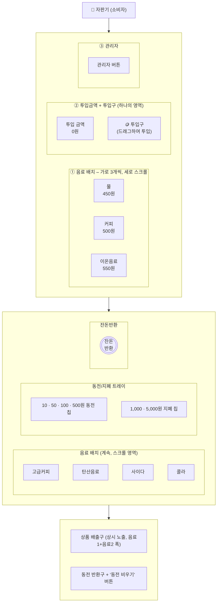
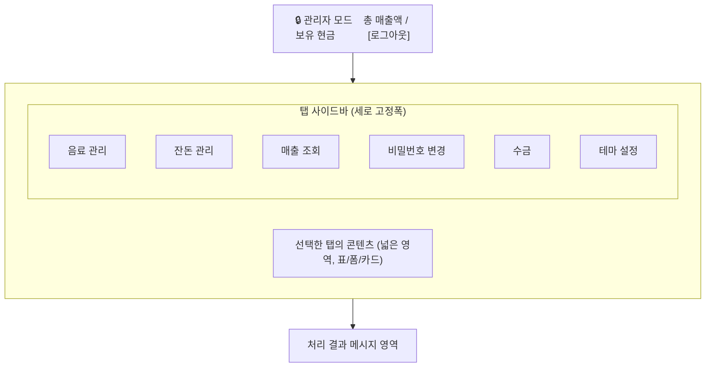
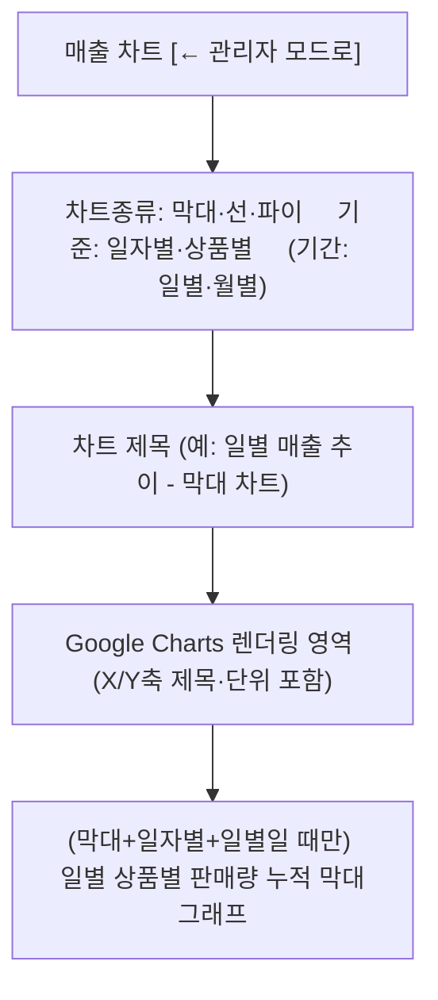
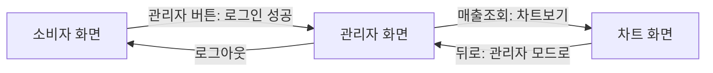

# 와이어프레임

| 항목 | 내용 |
|---|---|
| 관련 문서 | `04_기능_비기능_명세서.md` |
| 버전 | v1.0 (실제 구현 결과 기준 역작성) |
| 작성일 | 2026-09-06 |
| 도구 | Mermaid (커리큘럼 표준 도구는 Figma이나, 본 문서 세트는 마크다운/Mermaid로 통일) |

> 실제 UI 구현 과정에서 발주자가 손그림 형태로 배치도를 여러 차례 제시했고, 이를 근거로 화면을
> 반복 수정했다. 본 문서는 **최종 확정된 배치**를 와이어프레임 형태로 정리한 것이다.

## 1. 소비자 화면 (자판기 앞면) — 3열 가로 구조

실물 자판기 전면부를 모사한 3열 구조. 왼쪽은 음료 진열, 가운데는 투입 관련, 오른쪽은 관리/반환
버튼 계열이다.

### 배치 원칙

| 원칙 | 설명 |
|---|---|
| 3열 고정 | 좌(음료) / 중(투입) / 우(관리·반환)로 열을 고정하고, 행 높이만 콘텐츠에 맞춰 늘어난다 |
| 통합 영역 | "투입금액"과 "투입구"는 하나의 카드 안에 위·아래로 묶어 시각적으로 한 기능처럼 보이게 한다 |
| 분리 배치 | "동전/지폐 트레이"(입력)와 "잔돈반환 버튼"(출력)은 서로 다른 열에 두어 입력/출력 동작을 구분한다 |
| 상시 노출 | 상품 배출구는 구매 전에도 항상 보이는 자리이며, 내용만 갱신된다(숨김 처리 금지) |
| 내부 스크롤 | 음료 목록·동전 트레이는 각 영역 안에서만 스크롤되며, 전체 화면 골격은 흔들리지 않는다 |
| 색상 규칙 | 구매가능=굵은 오렌지 테두리(배경 채우지 않음) / 품절=배경 채움(빨강) / 투입금액·투입구=`#ddd` 배경 + 검정 글자 |

## 2. 관리자 화면 — 사이드바 + 콘텐츠 와이드 구조

- 로그인 전에는 관리자 화면 자체가 `hidden` 처리되어 렌더링되지 않는다(공간도 차지하지 않음).
- 로그인은 소비자 화면 위에 뜨는 **팝업**으로 처리하고, 성공 시에만 이 레이아웃이 나타난다.

## 3. 매출 차트 화면 — 별도 전체 화면

## 4. 화면 전환 관계

세 화면(소비자/관리자/차트)은 **동시에 하나만** 보인다. 전환은 `hidden` 속성 + opacity 트랜지션으로
처리한다.

