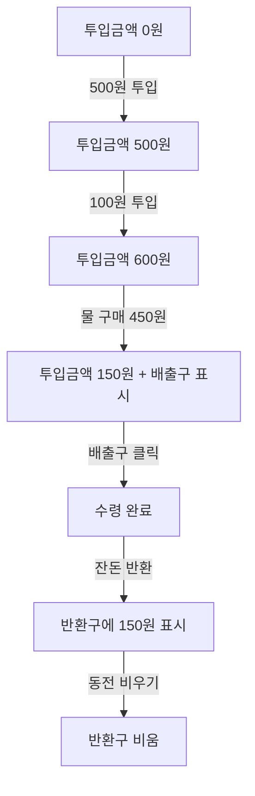
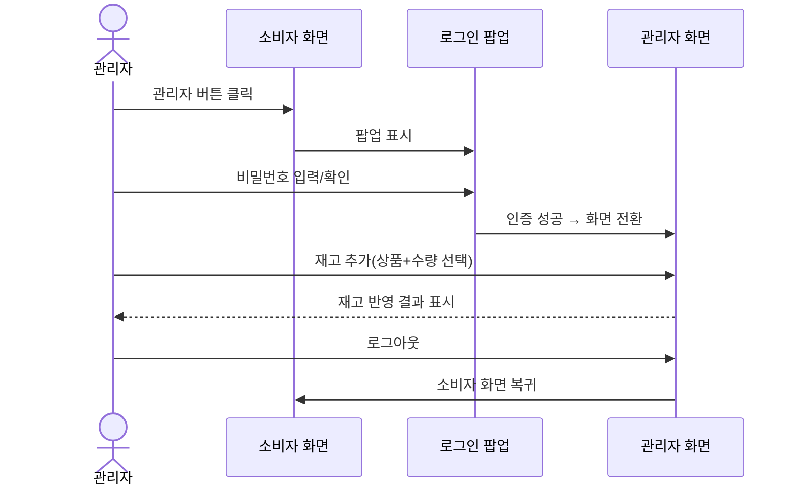
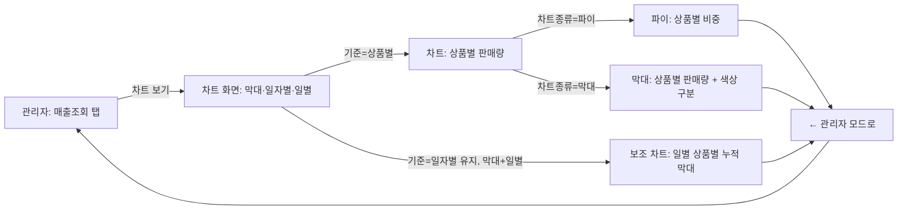

# 스토리보드

| 항목 | 내용 |
|---|---|
| 관련 문서 | `05_와이어프레임.md` |
| 버전 | v1.0 |
| 작성일 | 2026-09-06 |

각 시나리오는 프레임(장면) 단위로 "화면 상태 → 사용자 행동 → 시스템 반응"을 기술한다.

## 시나리오 1. 고객 – 음료 구매 (동전 투입 → 구매 → 수령)

| 프레임 | 화면 상태 | 사용자 행동 | 시스템 반응 |
|---|---|---|---|
| S1-1 | 소비자 화면, 투입금액 0원 | 500원 동전 칩을 투입구로 드래그 | 한도 검사 통과 → 동전이 투입구로 날아가며 효과음, 투입금액 500원으로 갱신 |
| S1-2 | 투입금액 500원 | 100원 동전 칩 클릭 | 동일 애니메이션, 투입금액 600원 |
| S1-3 | 투입금액 600원, 물(450원) 테두리 오렌지 강조 | "물" 버튼 클릭 | 재고 -1, 매출 +450, 투입금액 150원, 배출구에 "물 나왔습니다" 표시 |
| S1-4 | 배출구에 물 이미지 표시 중 | 배출구 클릭(수령) | 배출구가 원래 "상품 배출구" 안내 문구로 복귀 |
| S1-5 | 투입금액 150원 남음 | "잔돈 반환" 클릭 | 100원+50원 동전으로 분해되어 반환구에 표시, 투입금액 0원 |
| S1-6 | 반환구에 동전 표시 중 | "동전 비우기" 클릭 | 반환구 비워짐("반환된 동전이 없습니다") |

## 시나리오 2. 고객 – 잔돈 부족 상황

| 프레임 | 화면 상태 | 사용자 행동 | 시스템 반응 |
|---|---|---|---|
| S2-1 | 500원권 재고가 이미 0인 상태, 투입금액 600원 | "잔돈 반환" 클릭 | 500원 대신 100원 6개로 대체 조합하여 반환 |
| S2-2 | 보유 동전 전체가 0인 극단 상황 | "잔돈 반환" 클릭 | "반환 가능한 잔돈이 없습니다" 에러, 투입금액 유지 |

## 시나리오 3. 관리자 – 로그인 후 재고 추가

| 프레임 | 화면 상태 | 사용자 행동 | 시스템 반응 |
|---|---|---|---|
| S3-1 | 소비자 화면 | "관리자" 버튼 클릭 | 로그인 팝업 표시 |
| S3-2 | 로그인 팝업 | 올바른 비밀번호 입력 후 확인 | 팝업 닫힘, 소비자 화면 페이드아웃 → 관리자 화면(음료 관리 탭) 등장 |
| S3-3 | 음료 관리 탭 | "+ 재고 추가" 클릭 | 상품 선택(전체선택 가능) + 수량(10/15/20) 팝업 표시 |
| S3-4 | 팝업에서 "물" 선택, 10개 선택 | "추가" 클릭 | 물 재고 +10, 팝업 닫힘, 표 갱신 |
| S3-5 | 음료 관리 탭 | "로그아웃" 클릭 | 관리자 화면 사라짐, 소비자 화면 복귀 |

## 시나리오 4. 관리자 – 수금

| 프레임 | 화면 상태 | 사용자 행동 | 시스템 반응 |
|---|---|---|---|
| S4-1 | 수금 탭, 보유 현금 6,600원 | 화면 진입 | 최소 유지 잔돈 안내 문구 표시(500×5, 100×4, 50×5, 10×5) |
| S4-2 | 동일 화면 | "수금하기" 클릭 | 최소 잔돈을 제외한 금액을 1,000원 단위부터 차감, 수금액과 내역(단위×개수) 표시 |
| S4-3 | 최소 잔돈만 남은 상태 | "수금하기" 재클릭 | "수금할 금액이 없습니다" 안내 |

## 시나리오 5. 관리자 – 매출 차트 확인

| 프레임 | 화면 상태 | 사용자 행동 | 시스템 반응 |
|---|---|---|---|
| S5-1 | 매출 조회 탭 | "📊 차트 보기" 클릭 | 관리자 화면 숨김, 차트 화면 표시(기본값: 막대·일자별·일별) |
| S5-2 | 막대·일자별·일별 차트 | 차트종류 "선" 선택 | 동일 데이터로 선 그래프 재렌더링 |
| S5-3 | 선 차트 | 기준 "상품별" 선택 | x축이 날짜→상품명으로, y축이 매출액→판매량(건수)으로 전환. 기간 버튼 숨김 |
| S5-4 | 상품별 선 차트 | 차트종류 "파이" 선택 | 상품별 판매량 비중 파이 차트로 전환 |
| S5-5 | 임의 차트 화면 | "← 관리자 모드로" 클릭 | 매출 조회 탭으로 복귀 |

