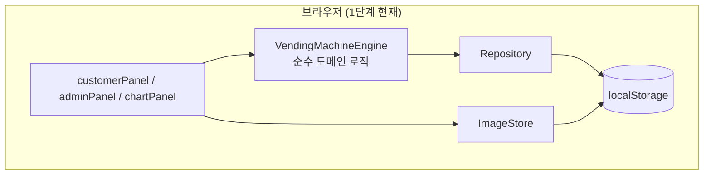
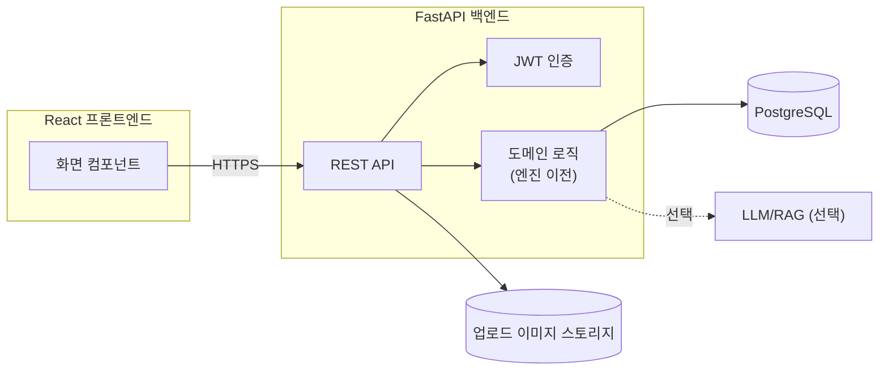
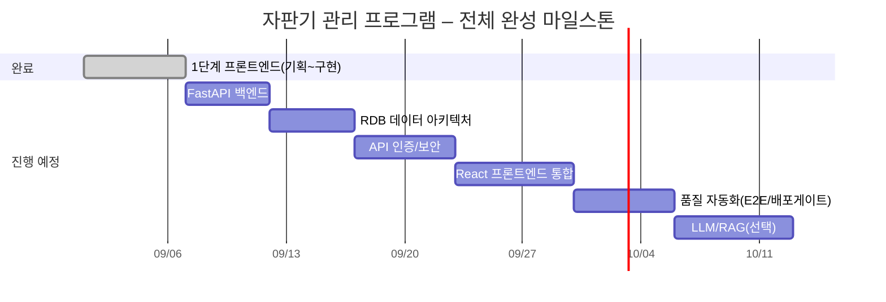

# 완성 로드맵 (커리큘럼 연계, 2단계 이후 To-Do)

| 항목 | 내용 |
|---|---|
| 관련 문서 | 본 문서 세트 전체(`01`~`06`) |
| 버전 | v1.0 |
| 작성일 | 2026-09-06 |
| 목적 | "AX 서비스 풀스택 빌더 과정" 나머지 교과목을 통해 자판기 관리 프로그램을 실제 배포 가능한
        풀스택 서비스로 완성하기 위해 필요한 작업을 정리한다. **본 문서는 계획 문서이며, 코드
        작성은 포함하지 않는다.** |

## 1. 현재 완료 범위 (1단계 – AX 프로덕트 기획 & 서비스 설계)

- 순수 HTML/CSS/JavaScript 프론트엔드, 정적 마크업 + 최소 JS(정적 골격은 HTML, 동적 값만 JS)
- 상태 저장: 브라우저 `localStorage` (`Repository`, `ImageStore` 계층으로 캡슐화되어 있어
  이후 API 호출로 손쉽게 교체 가능)
- 소비자/관리자/차트 3개 화면, 4계절 테마, Google Charts 연동까지 완료

이 시점의 아키텍처는 아래와 같다.

## 2. 커리큘럼 교과목 ↔ 필요 작업 매핑

| 교과목 | 훈련시간 | 자판기 프로젝트에서 해야 할 일 |
|---|---|---|
| AI-Augmented 백엔드 개발 | 40h | FastAPI로 `Repository`/`ImageStore`가 호출할 REST API 서버 구축 (재고·매출·현금·비밀번호·이미지 CRUD) |
| 서비스 도메인 모델링 & 데이터 아키텍처 | 40h | `04_기능_비기능_명세서.md`의 ERD를 실제 RDB(PostgreSQL 등) 스키마로 전환, ORM 매핑, 인덱스/쿼리 최적화 |
| API 아키텍처 & 인증 보안 설계 | 48h | 관리자 인증을 JWT 기반으로 전환(현재의 평문 비밀번호 비교 로직 대체), RESTful 엔드포인트 설계, Postman 컬렉션 작성 |
| AX UI 구현 & 프론트엔드 통합 | 56h | 현재의 바닐라 JS 화면을 React 컴포넌트로 재구현(도메인 로직인 엔진 계층은 최대한 재사용), API 연동 |
| AI Native 방법론 및 품질 자동화 | 48h | 유스케이스(UC-01~11) 기반 E2E 테스트 자동화, CI 배포 게이트 구성 |
| LLM 서비스 엔지니어링 & RAG 파이프라인 | 56h | (선택) 관리자용 "매출 인사이트 자동 요약" 챗봇 — 매출 데이터를 RAG로 조회해 자연어 요약 제공 |

## 3. 단계별 상세 To-Do

### 3.1 백엔드(FastAPI) 전환

- [ ] `Repository.load()/save()`를 `GET/PUT /api/state`로 교체
- [ ] `ImageStore.saveProductImage()`를 `POST /api/products/{id}/image`(multipart)로 교체, 실제
      업로드 폴더(`/uploads/products/`) 저장
- [ ] 판매(`buyDrink`), 반환(`returnMoney`), 수금(`collectMoney`) 등 **엔진의 핵심 계산 로직**은
      서버 측으로 이전하여 클라이언트 조작(치팅)을 방지

### 3.2 데이터 아키텍처(RDB)

- [ ] `04_기능_비기능_명세서.md`의 ERD를 기준으로 테이블 설계(`drinks`, `money_bank`,
      `sales_log`, `admin_account`, `theme_setting`, `product_images`)
- [ ] `sales_log`는 조회 빈도가 높으므로 `date`, `drink_id` 복합 인덱스 고려
- [ ] ORM(SQLAlchemy 등) 모델과 마이그레이션(Alembic) 구성

### 3.3 인증/보안

- [ ] 관리자 비밀번호 **해시 저장**(bcrypt) — 현재 평문 저장의 명확한 보안 부채 해소
- [ ] 로그인 성공 시 JWT 발급, 관리자 API는 JWT 검증 미들웨어로 보호
- [ ] 브루트포스 방지(로그인 시도 제한) 검토

### 3.4 프론트엔드(React) 통합

- [ ] `VendingMachineEngine`(순수 함수 계층)은 그대로 두고, 화면(`customerPanel`,
      `adminPanel`, `chartPanel`)만 React 컴포넌트로 재작성
- [ ] 전역 상태 관리 방식 결정(Context API 또는 별도 상태 라이브러리)
- [ ] 기존 CSS(Grid 기반 3열/사이드바 레이아웃)는 CSS 프레임워크(예: Tailwind)로 전환 검토

### 3.5 품질 자동화

- [ ] `03_요구사항_명세서.md`의 UC별 정상/예외 흐름을 E2E 테스트 케이스로 변환
- [ ] 주요 시나리오(구매, 반환, 수금, 로그인) 회귀 테스트를 배포 파이프라인의 게이트로 등록

### 3.6 (선택) LLM/RAG 확장

- [ ] 매출 로그(`sales_log`)를 RAG 소스로 색인
- [ ] 관리자 화면에 "이번 달 매출 요약해줘" 같은 자연어 질의 → LLM 응답 기능 추가

## 4. 목표 아키텍처 (2단계 이후)

## 5. 전체 마일스톤

## 6. 리스크 및 고려사항

| 리스크 | 영향 | 대응 방안 |
|---|---|---|
| 클라이언트 측 도메인 로직(엔진)을 그대로 신뢰 | 금액 조작 등 치팅 가능 | 백엔드 전환 시 검증 로직을 서버로 이전, 클라이언트는 표시 전용으로 축소 |
| 비밀번호 평문 저장 | 보안 취약 | 백엔드 전환과 동시에 해시 저장 의무화(NFR-05) |
| localStorage 데이터의 브라우저 종속성 | 기기 변경 시 데이터 유실 | RDB 전환으로 서버 중앙 저장 |
| Google Charts CDN 의존 | 오프라인/네트워크 장애 시 차트 미표시 | 로컬 차트 라이브러리 대체 검토(2단계 이후) |
| React 전환 시 UX 회귀 | 기존 애니메이션/드래그앤드롭 재현 난이도 | 도메인 로직은 재사용하고, UI만 단계적으로 교체 후 회귀 테스트 |

## 7. 완료 정의 (Definition of Done) 체크리스트

- [ ] 모든 FR(01~26)이 React+FastAPI 환경에서 동일하게 동작
- [ ] 관리자 비밀번호가 해시로 저장되고 JWT로 인증됨
- [ ] 매출/재고 데이터가 RDB에 저장되고 다중 기기에서 동일하게 조회됨
- [ ] 주요 시나리오(스토리보드 1~5) E2E 테스트가 CI에 등록되어 배포 게이트로 동작
- [ ] API 문서(Postman/OpenAPI), 사용자 매뉴얼 산출물 완비(커리큘럼 최종 프로젝트 요구사항과 동일)
