# 요구사항 분석 및 명세서 작성 방법

> 요구사항 분석을 전체 과정에서 어떻게 이해할 것인가 
> 요구사항 분석은 단순히 문서를 작성하는 작업이 아닙니다. 
> 가장 중요한 것은 다음 흐름을 이해하는 것입니다. 

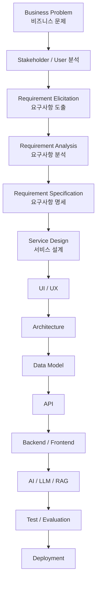

이 과정에서 요구사항은 이후 모든 개발 작업의 기준점이 됩니다.

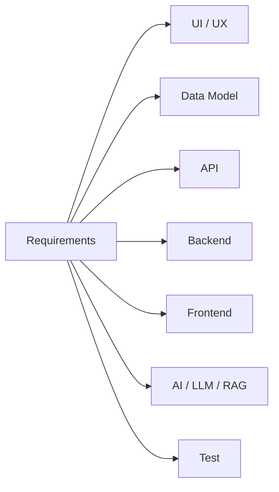

첨부 과정의 최종 기업 프로젝트에서도 기업이 제시한 비즈니스 문제를 해결하기 위해 기획부터 배포까지 수행하고, 서비스 기획 문서·소스코드·API 문서·사용자 매뉴얼을 산출하도록 되어 있습니다. 

따라서 요구사항 분석은 **앞 단계의 기획과 뒤 단계의 구현을 연결하는 핵심 작업**으로 학습하는 것이 좋습니다.

---

# 2. 요구사항 학습 권장 시간

72시간의 `AX 프로덕트 기획 & 서비스 설계` 가운데 약 **24시간 정도를 요구사항 관련 학습에 배정**하는 구성을 추천합니다.

이 시간 배분은 첨부 과정에 명시된 시간이 아니라, 전체 과정의 연계성을 고려한 교육 구성 제안입니다.

| 단계     | 학습내용              |     이론 |      실습 |      합계 |
| ------ | ----------------- | -----: | ------: | ------: |
| 1      | 비즈니스 문제와 요구사항 이해  |     2h |      2h |      4h |
| 2      | 요구사항 도출           |     2h |      2h |      4h |
| 3      | 요구사항 분석 및 분류      |     2h |      2h |      4h |
| 4      | 기능·비기능·AI 요구사항 작성 |     1h |      3h |      4h |
| 5      | 요구사항 명세서 작성       |     1h |      3h |      4h |
| 6      | 요구사항 검증·추적·변경관리   |     1h |      3h |      4h |
| **합계** |                   | **9h** | **15h** | **24h** |

비전공자 과정에서는 표준 문서 형식을 암기하는 것보다,

> **문제를 발견하고 → 요구사항으로 변환하고 → 개발 가능한 형태로 명세하는 과정**

을 반복적으로 경험하는 것이 중요합니다.

---

# 3. 1단계 — Business Problem 이해

가장 먼저 학습해야 할 것은 다음 항목의 차이입니다.

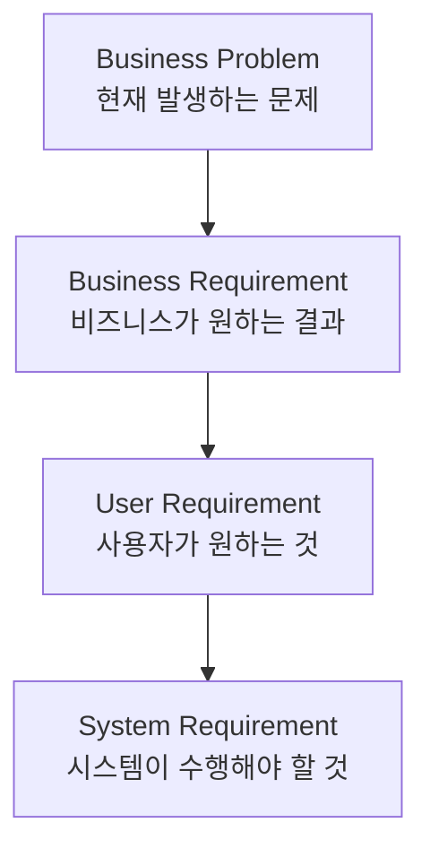

예를 들어 과정에서 제시된 **지능형 문서 요약 및 딜리버리 앱**을 사용하면 다음과 같이 설명할 수 있습니다. 

### Business Problem

```text
기업 내부에 문서가 많아서
직원이 모든 문서를 읽는 데 시간이 많이 걸린다.
```

### Business Requirement

```text
직원의 문서 검토 시간을 줄인다.
```

### User Requirement

```text
사용자는 긴 문서의 핵심 내용을
빠르게 확인하고 싶다.
```

### System Requirement

```text
시스템은 사용자가 업로드한 문서를 분석하여
핵심 내용을 자동으로 요약해야 한다.
```

이를 전체 관계로 표현하면 다음과 같습니다.

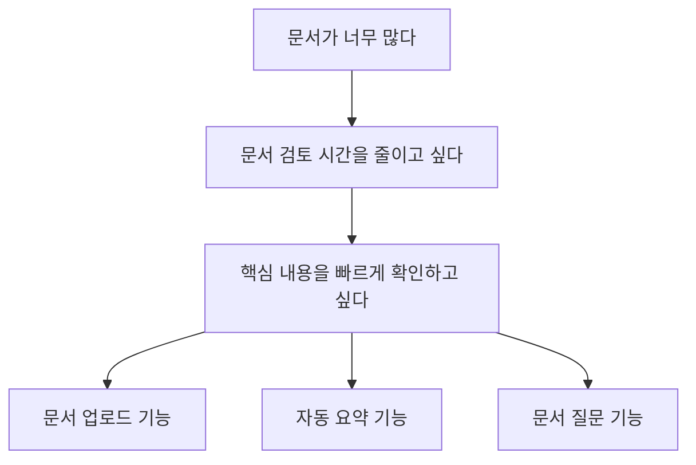

---

# 4. Problem에서 Feature로 바로 이동하지 않기

초보 개발 과정에서 자주 발생하는 문제가 있습니다.

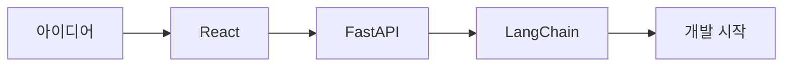

이것은 바람직하지 않습니다.

보다 적절한 흐름은 다음과 같습니다.

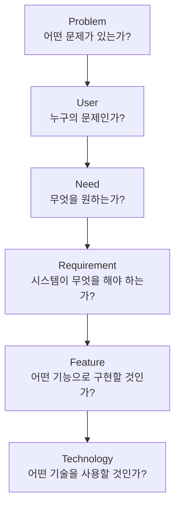

예:

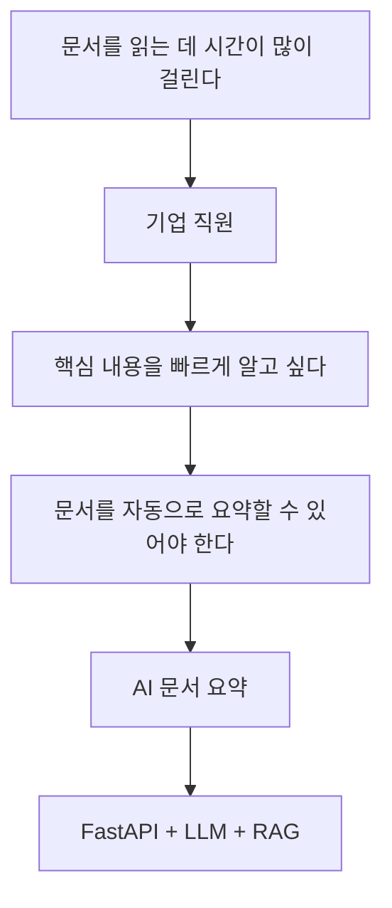

여기서 중요한 학습 포인트는

> **기술은 요구사항을 해결하기 위한 수단이다.**

라는 것입니다.

---

# 5. 2단계 — Requirement Elicitation

`Requirement Elicitation`은 아직 정리되지 않은 사용자와 기업의 요구를 발견하는 단계입니다.

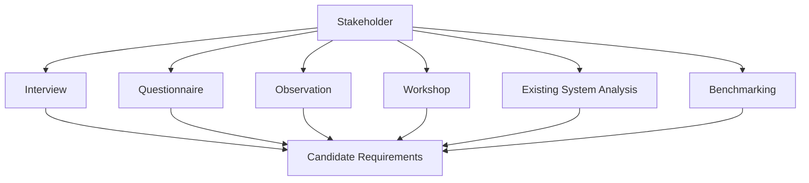

대표적인 방법은 다음과 같습니다.

| 방법                       | 의미           |
| ------------------------ | ------------ |
| Interview                | 사용자와 직접 대화   |
| Questionnaire            | 설문조사         |
| Observation              | 실제 업무 관찰     |
| Workshop                 | 관계자 공동 논의    |
| Existing System Analysis | 기존 시스템 분석    |
| Benchmarking             | 경쟁 서비스 분석    |
| Persona                  | 대표 사용자 정의    |
| User Journey Map         | 사용자 행동 흐름 분석 |

---

# 6. 요구사항 인터뷰 실습

학생이 직접 사용자를 인터뷰한다고 가정합니다.

### 질문

```text
현재 문서를 어떻게 처리합니까?

어떤 부분에서 시간이 가장 많이 걸립니까?

중요한 내용을 놓친 경험이 있습니까?

어떤 기능이 있으면 업무가 편해질 것 같습니까?
```

### 인터뷰 결과

```text
PDF를 직접 읽고 있다.

문서가 너무 길다.

중요한 내용을 놓치는 경우가 있다.

핵심 내용만 자동으로 보여주면 좋겠다.
```

이를 요구사항으로 변환합니다.

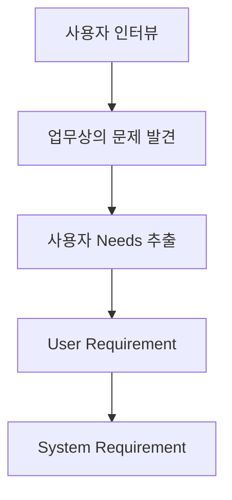

구체적으로는 다음과 같습니다.

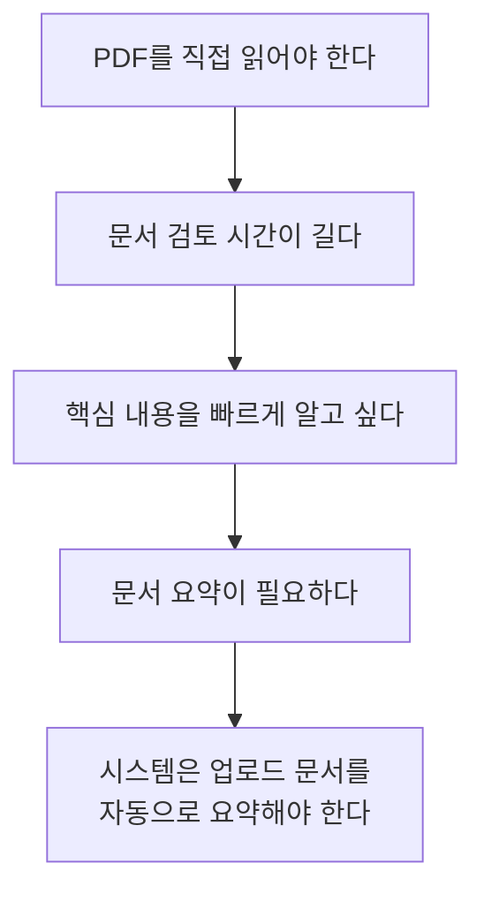

이 **자연어 → 요구사항 변환 과정**을 여러 번 반복하는 것이 중요합니다.

---

# 7. 3단계 — Requirement Analysis

도출된 요구사항을 그대로 개발하면 안 됩니다.

먼저 분석해야 합니다.

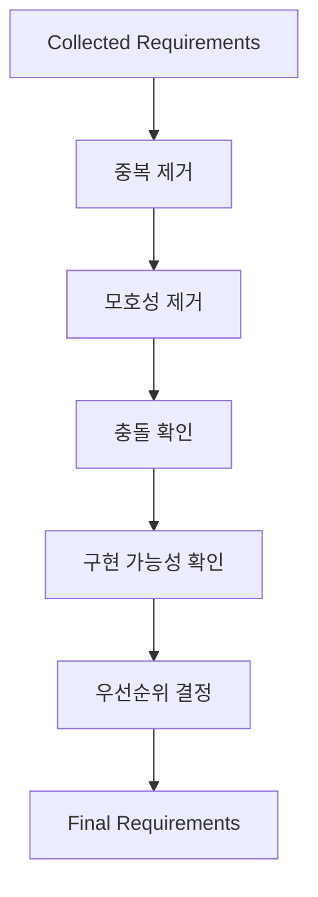

요구사항 분석에서 확인할 핵심 질문은 다음과 같습니다.

* 같은 요구사항이 중복되어 있지 않은가?
* 서로 충돌하는 요구사항이 없는가?
* 기술적으로 구현 가능한가?
* 비용과 일정 내에서 가능한가?
* 반드시 필요한 기능인가?
* 테스트 가능한가?

---

# 8. 요구사항의 기본 분류

가장 먼저 다음 두 종류를 구별합니다.

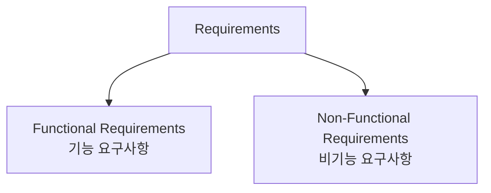

### 기능 요구사항

시스템이 **무엇을 해야 하는가**를 표현합니다.

예:

```text
사용자는 PDF 파일을 업로드할 수 있다.

시스템은 PDF의 내용을 요약할 수 있다.

사용자는 문서에 대해 질문할 수 있다.

시스템은 문서를 근거로 답변할 수 있다.
```

### 비기능 요구사항

시스템이 **어떤 품질로 동작해야 하는가**를 표현합니다.

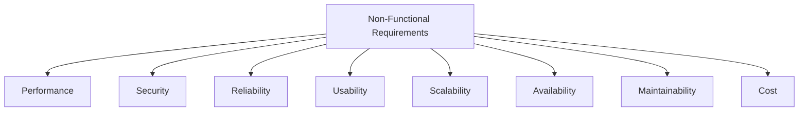

예:

| 유형              | 요구사항                   |
| --------------- | ---------------------- |
| Performance     | API 응답시간을 일정 수준 이하로 유지 |
| Security        | 사용자 문서 접근 통제           |
| Reliability     | 장애 발생 시 복구 가능          |
| Usability       | 초보자도 쉽게 사용             |
| Availability    | 서비스 지속 제공              |
| Maintainability | 기능 수정이 용이한 구조          |

---

# 9. AX 과정에서는 AI Requirement가 중요함

첨부 과정에는 LLM API 통합, RAG 구축, Function Calling이 명시되어 있습니다. 

따라서 전통적인 요구사항만으로는 부족합니다.

다음과 같이 확장하는 것이 좋습니다.

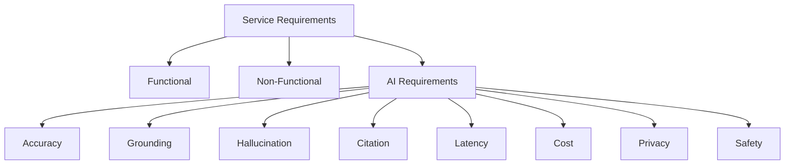

예를 들면 다음과 같습니다.

| AI 요구사항       | 의미                 |
| ------------- | ------------------ |
| Accuracy      | 답변 품질 기준           |
| Grounding     | 제공된 문서를 근거로 답변     |
| Citation      | 답변의 출처 표시          |
| Hallucination | 근거 없는 답변 억제        |
| Latency       | AI 응답시간            |
| Cost          | LLM API 비용         |
| Privacy       | 외부 모델로 전달되는 데이터 통제 |
| Safety        | 위험하거나 부적절한 응답 제어   |
| Fallback      | AI 실패 시 처리         |

---

# 10. 좋은 요구사항과 나쁜 요구사항

요구사항은 가능하면 다음 특성을 가져야 합니다.

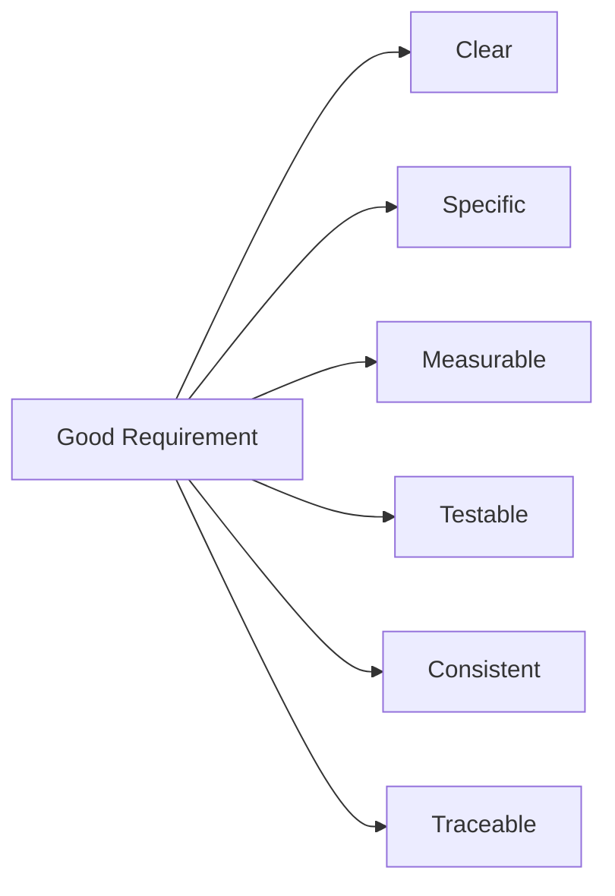

### 좋지 않은 예

```text
시스템은 빠르게 동작해야 한다.
```

문제는 **빠르다**의 기준을 알 수 없다는 것입니다.

### 개선

```text
REQ-NF-001

정상 운영 환경에서 일반 API 요청의
평균 응답시간은 2초 이내여야 한다.
```

또 다른 예입니다.

### 좋지 않은 요구사항

```text
사용하기 편해야 한다.
```

### 개선

```text
REQ-NF-002

신규 사용자는 별도의 교육 없이
5분 이내에 문서 업로드와 요약 기능을
수행할 수 있어야 한다.
```

---

# 11. 요구사항과 테스트의 관계

가장 중요한 기준 중 하나는

> **Testable한가?**

입니다.

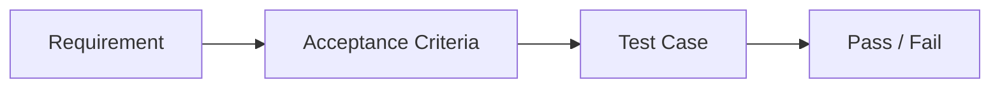

예:

```text
REQ-F-003
사용자는 PDF 파일을 업로드할 수 있어야 한다.
```

Acceptance Criteria:

```text
PDF 파일을 선택한다.

업로드 버튼을 누른다.

서버에 파일이 정상적으로 등록된다.

화면에 업로드 완료 메시지가 표시된다.
```

---

# 12. User Story 학습

요구사항 명세와 함께 Agile 방식의 User Story도 학습하면 좋습니다.

기본 구조:

```text
As a [사용자]
I want [원하는 기능]
So that [목적]
```

예:

```text
As a 기업 직원

I want PDF 문서를 업로드하고
자동으로 요약된 내용을 확인하고 싶다.

So that 긴 문서를 모두 읽지 않고도
핵심 내용을 파악할 수 있다.
```

관계를 시각화하면 다음과 같습니다.

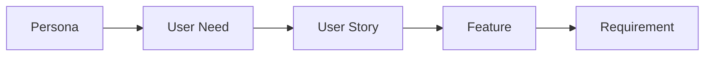

---

# 13. Acceptance Criteria

User Story는 Acceptance Criteria와 함께 작성하는 것이 좋습니다.

대표적으로 Given / When / Then 형식을 사용할 수 있습니다.

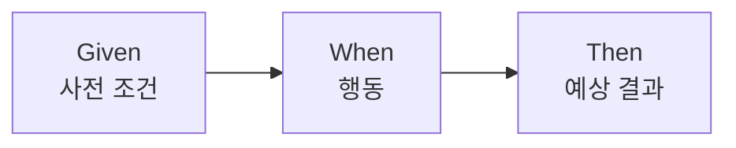

예:

```text
Given

사용자가 로그인되어 있고
PDF 파일을 선택한 상태에서

When

업로드 버튼을 누르면

Then

PDF가 서버에 등록되고
문서 분석이 시작되어야 한다.
```

---

# 14. 4단계 — Requirement Specification

분석된 요구사항을 최종적으로 문서화합니다.

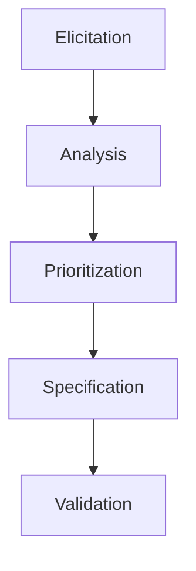

이 단계의 대표적인 산출물이 **SRS, Software Requirements Specification**입니다.

다만 비전공자 중심의 AX 과정이라면 매우 복잡한 국제표준 문서보다는 프로젝트에서 실제 사용할 수 있는 **Lightweight SRS**를 작성하도록 하는 것이 좋습니다.

---

# 15. Lightweight SRS 권장 구조

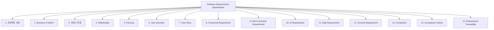

실습에서는 각 팀이 약 **10~15페이지 수준의 SRS**를 만드는 정도가 적절합니다.

---

# 16. Requirement ID 사용

요구사항이 많아지면 자연어 문장만으로 관리하기 어려워집니다.

따라서 ID를 부여합니다.

```text
REQ-F-001   회원가입
REQ-F-002   로그인
REQ-F-003   문서 업로드
REQ-F-004   문서 요약

REQ-AI-001  문서 검색
REQ-AI-002  LLM 답변

REQ-NF-001  응답시간
REQ-NF-002  가용성

REQ-SEC-001 사용자 인증
REQ-SEC-002 문서 접근 제어
```

구조적으로 보면 다음과 같습니다.

```mermaid
flowchart TD
    R["Requirements"]

    R --> F["REQ-F<br/>Functional"]
    R --> NF["REQ-NF<br/>Non-Functional"]
    R --> AI["REQ-AI<br/>AI"]
    R --> SEC["REQ-SEC<br/>Security"]
    R --> DATA["REQ-DATA<br/>Data"]
```

---

# 17. Requirement Traceability

요구사항을 작성하고 끝내는 것이 아니라 구현까지 연결해야 합니다.

예:

```mermaid
flowchart LR
    R["REQ-F-004<br/>문서 요약"]
    --> UI["UI-004<br/>요약 화면"]
    --> API["API-004<br/>Summary API"]
    --> BE["Summary Service"]
    --> AI["LLM / RAG"]
    --> TEST["TC-004<br/>Test Case"]
```

이것이 **Requirement Traceability**입니다.

---

# 18. Requirement Traceability Matrix

실습에서는 다음과 같은 표를 작성하면 좋습니다.

| 요구사항              | UI    | API    | DB        | AI  | Test  |
| ----------------- | ----- | ------ | --------- | --- | ----- |
| REQ-F-001 로그인     | UI-01 | API-01 | User      | -   | TC-01 |
| REQ-F-002 PDF 업로드 | UI-02 | API-02 | Document  | -   | TC-02 |
| REQ-F-003 문서 요약   | UI-03 | API-03 | Summary   | LLM | TC-03 |
| REQ-AI-001 문서 검색  | UI-04 | API-04 | Vector DB | RAG | TC-04 |

전체 관계는 다음과 같습니다.

```mermaid
flowchart LR
    R["Requirement"]
    --> UI["UI"]
    --> API["API"]
    --> DB["Data"]
    --> CODE["Backend / Frontend"]
    --> AI["AI"]
    --> TEST["Test"]
```

이를 통해 요구사항 명세서가 단순한 기획 문서가 아니라 **개발 전체를 추적하는 기준**이라는 것을 이해할 수 있습니다.

---

# 19. 5단계 — Requirement Validation

작성된 요구사항이 올바른지 검증합니다.

```mermaid
flowchart TD
    R["Requirement Review"]

    R --> A{"명확한가?"}
    R --> B{"필요한가?"}
    R --> C{"구현 가능한가?"}
    R --> D{"테스트 가능한가?"}
    R --> E{"충돌하지 않는가?"}
    R --> F{"추적 가능한가?"}
```

팀 간 Peer Review 방식으로 진행하기 좋습니다.

예를 들어 다른 팀의 요구사항 명세서를 보고 다음 항목을 점검합니다.

* 의미가 명확한가?
* 구현 가능한가?
* 테스트 가능한가?
* 요구사항이 중복되지 않는가?
* 요구사항끼리 충돌하지 않는가?
* 불필요한 기능이 포함되지 않았는가?
* 보안 요구사항이 빠지지 않았는가?
* 개인정보 문제가 없는가?

---

# 20. AX 서비스에서는 한 가지 질문을 추가

AI 프로젝트에서는 반드시 다음 질문을 추가하는 것이 좋습니다.

> **정말 AI가 필요한 기능인가?**

다음과 같이 판단할 수 있습니다.

```mermaid
flowchart TD
    A["새로운 기능 요구사항"]
    --> B{"규칙 기반으로<br/>해결 가능한가?"}

    B -->|Yes| C["일반 프로그램 구현"]
    B -->|No| D{"언어 이해·생성·추론이<br/>필요한가?"}

    D -->|No| E["기존 알고리즘 검토"]
    D -->|Yes| F["AI / LLM 적용 검토"]

    F --> G{"외부 지식이 필요한가?"}

    G -->|No| H["LLM"]
    G -->|Yes| I["RAG + LLM"]
```

예를 들어

```text
회원 로그인
```

은 LLM이 필요하지 않습니다.

반면

```text
긴 문서의 의미를 파악하여 요약
```

은 LLM 적용 가능성이 높습니다.

---

# 21. Requirement Prioritization

모든 요구사항을 동시에 구현할 수 없기 때문에 우선순위를 정합니다.

대표적인 방법이 MoSCoW입니다.

```mermaid
flowchart TD
    R["Requirements"]

    R --> M["Must Have<br/>반드시 필요"]
    R --> S["Should Have<br/>가능하면 필요"]
    R --> C["Could Have<br/>여유가 있으면 구현"]
    R --> W["Won't Have Now<br/>이번 범위에서는 제외"]
```

예:

| 요구사항    | 우선순위           |
| ------- | -------------- |
| PDF 업로드 | Must           |
| 문서 요약   | Must           |
| RAG 질문  | Must           |
| 이메일 전송  | Should         |
| 음성 질문   | Could          |
| 아바타     | Won't Have Now |

이 과정은 프로젝트의 **Scope 관리**와 직접 연결됩니다.

---

# 22. 실습 프로젝트는 하나를 끝까지 사용하는 것이 좋음

요구사항 단계마다 서로 다른 사례를 사용하는 것보다 하나의 프로젝트를 지속적으로 발전시키는 것이 더 효과적입니다.

첨부 과정의 기업 프로젝트 후보 중

**지능형 문서 요약 및 딜리버리 앱**

을 활용하기 좋습니다. 

처음에는 단순한 아이디어에서 출발합니다.

```text
회사 문서를 AI가 요약해주는 서비스
```

24시간의 학습을 거치면서 다음과 같이 발전시킵니다.

```mermaid
flowchart TD
    A["Business Problem"]
    --> B["Stakeholder"]
    --> C["Persona"]
    --> D["User Journey"]
    --> E["Requirement Elicitation"]
    --> F["User Story"]
    --> G["Functional Requirements"]
    --> H["Non-Functional Requirements"]
    --> I["AI Requirements"]
    --> J["Acceptance Criteria"]
    --> K["SRS"]
    --> L["Traceability Matrix"]
```

---

# 23. 요구사항 단계 최종 산출물

요구사항 교육이 끝났을 때 각 팀이 다음 결과물을 가지고 있도록 구성합니다.

```mermaid
flowchart TD
    P["Requirements Project"]

    P --> A["Problem Statement"]
    P --> B["Stakeholder Map"]
    P --> C["Persona"]
    P --> D["User Journey"]
    P --> E["User Story"]
    P --> F["Functional Requirements"]
    P --> G["Non-Functional Requirements"]
    P --> H["AI Requirements"]
    P --> I["Security Requirements"]
    P --> J["Acceptance Criteria"]
    P --> K["SRS"]
    P --> L["Traceability Matrix"]
```

각 산출물은 이후 과목과 직접 연결됩니다.

| 요구사항 산출물               | 이후 과정              |
| ---------------------- | ------------------ |
| Persona / User Journey | UI/UX              |
| Functional Requirement | Backend / Frontend |
| Data Requirement       | Data Architecture  |
| API Requirement        | API Architecture   |
| Security Requirement   | 인증·보안              |
| AI Requirement         | LLM / RAG          |
| Acceptance Criteria    | Test / Evaluation  |
| Traceability Matrix    | 프로젝트 관리            |

첨부 과정 역시 데이터 모델링 이후 API·보안, React UI, 품질 자동화, LLM·RAG로 이어지도록 구성되어 있습니다. 

---

# 24. 72시간 전체 과목 속에서 배치

`AX 프로덕트 기획 & 서비스 설계` 72시간 전체를 다음과 같이 구성할 수 있습니다.

| 영역                               |      시간 |
| -------------------------------- | ------: |
| AI 서비스와 Business Problem 정의      |      8h |
| 요구사항 도출·분석                       |      8h |
| 요구사항 명세                          |      8h |
| Persona / User Journey           |      8h |
| 기능 정의 / MoSCoW / 서비스 구조          |      8h |
| Information Architecture / 화면 구조 |      8h |
| Figma Wireframe                  |     16h |
| Prototype / 요구사항 검증              |      8h |
| **합계**                           | **72h** |

전체 흐름을 시각화하면 다음과 같습니다.

```mermaid
flowchart TD
    A["1. Business Problem<br/>8h"]
    --> B["2. Requirement Analysis<br/>8h"]
    --> C["3. Requirement Specification<br/>8h"]
    --> D["4. Persona / User Journey<br/>8h"]
    --> E["5. Feature / MoSCoW<br/>8h"]
    --> F["6. Information Architecture<br/>8h"]
    --> G["7. Figma Wireframe<br/>16h"]
    --> H["8. Prototype / Validation<br/>8h"]
```

---

# 25. 이 과정 전체와 연결하면

요구사항 교육을 앞부분에서 제대로 수행하면 이후 AX 풀스택 과정 전체가 하나의 흐름으로 연결됩니다.

```mermaid
flowchart TD
    A["Business Problem"]
    --> B["Requirements"]
    --> C["Service Design"]
    --> D["Figma / UI UX"]
    --> E["Domain Modeling"]
    --> F["Database"]
    --> G["API Architecture"]
    --> H["Backend"]
    --> I["Frontend"]
    --> J["AI / LLM / RAG"]
    --> K["Security"]
    --> L["Test / Evaluation"]
    --> M["CI / CD"]
    --> N["Deployment"]
    --> O["Operation"]
```

첨부 과정의 마지막에는 184시간의 기업 요구사항 기반 프로젝트가 배치되어 있고, 기업이 제시한 비즈니스 문제를 대상으로 풀스택 구조와 LLM·RAG, 보안 검증까지 통합하도록 설계되어 있습니다. 

따라서 이 과정에서 가장 중요한 학습 구조는 다음 한 문장으로 정리할 수 있습니다.

> **Business Problem을 Requirement로 변환하고, Requirement를 UI·Data·API·Code·AI·Test로 계속 추적하면서 실제 서비스로 완성하는 과정**

입니다.

```mermaid
flowchart LR
    P["Problem"]
    --> R["Requirement"]
    --> D["Design"]
    --> C["Code"]
    --> T["Test"]
    --> S["Service"]
```

특히 비전공자 학습에서는 **요구사항 명세서 작성법 자체보다 `왜 이 기능을 만드는가 → 무엇을 만들어야 하는가 → 어떻게 검증할 것인가`의 연결 관계를 이해하는 것**을 우선하는 구성이 좋습니다. 이후 요구사항, Figma, 데이터 모델링, API, 백엔드, AI/RAG 등 관련 강의자료를 작성할 때도 이러한 관계나 순서가 있으면 Mermaid 시각화를 함께 구성하겠습니다.
