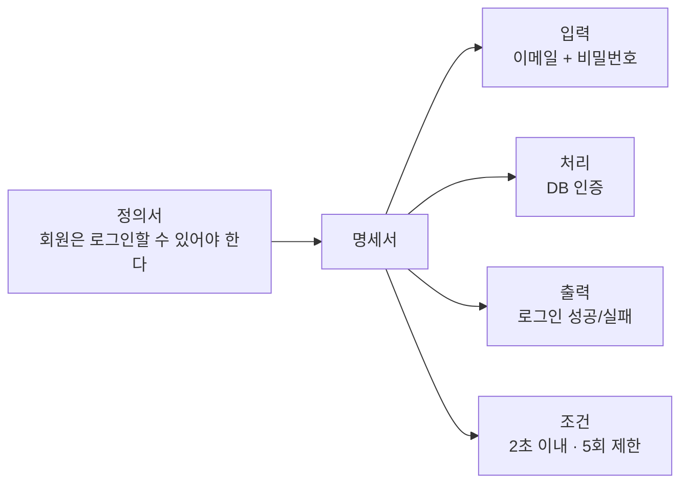
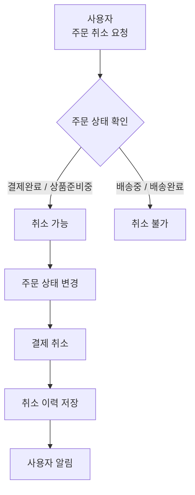
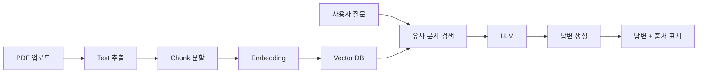
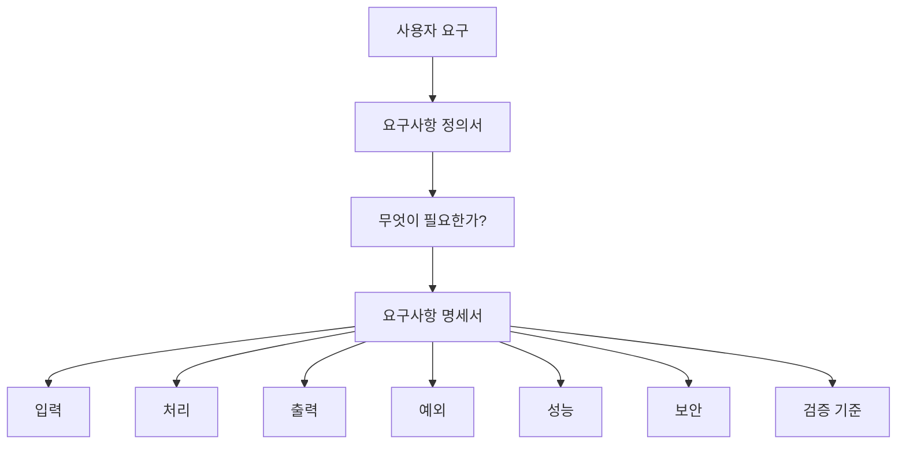
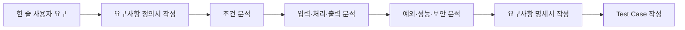

학습할 때는 **같은 기능을 요구사항 정의서와 요구사항 명세서에 각각 작성해 비교**하는 방식이 가장 이해하기 쉽습니다. 아래에서는 3개의 동일한 사례를 기준으로 두 문서의 차이를 비교합니다.

## 1. 예시 ① 회원 로그인 기능

### 요구사항 정의서 예시

| 항목      | 내용                                 |
| ------- | ---------------------------------- |
| 요구사항 ID | REQ-001                            |
| 요구사항명   | 회원 로그인                             |
| 요구사항 목적 | 회원을 식별하고 개인화된 서비스를 제공하기 위함         |
| 사용자     | 회원                                 |
| 요구사항 내용 | 회원은 이메일과 비밀번호를 사용하여 로그인할 수 있어야 한다. |
| 우선순위    | Must Have                          |

핵심은 **“로그인 기능이 필요하다”**를 정의하는 것입니다.

### 요구사항 명세서 예시

| 항목      | 내용                           |
| ------- | ---------------------------- |
| 요구사항 ID | FR-LOGIN-001                 |
| 기능명     | 회원 로그인                       |
| 입력      | 이메일, 비밀번호                    |
| 입력 조건   | 이메일 형식 검증, 비밀번호 8자 이상        |
| 처리      | 입력값을 회원 DB의 인증정보와 비교         |
| 성공 조건   | 이메일과 비밀번호가 모두 일치             |
| 성공 결과   | 인증 토큰 발급 후 메인 화면 이동          |
| 실패 조건   | 존재하지 않는 이메일 또는 비밀번호 불일치      |
| 실패 결과   | "이메일 또는 비밀번호를 확인하세요." 메시지 표시 |
| 예외 처리   | 로그인 5회 연속 실패 시 10분간 로그인 제한   |
| 성능 조건   | 정상 요청의 95% 이상을 2초 이내 처리      |
| 보안 조건   | 비밀번호는 해시 형태로 저장              |

여기서는 개발자가 **“어떻게 동작해야 하는지”**를 판단할 수 있을 정도까지 구체화합니다.

---

# 2. 예시 ② 쇼핑몰 주문 취소 기능

## 요구사항 정의서 예시

| 항목      | 내용                                |
| ------- | --------------------------------- |
| 요구사항 ID | REQ-002                           |
| 요구사항명   | 주문 취소                             |
| 요구사항 목적 | 고객이 배송 전 주문을 취소할 수 있도록 지원         |
| 사용자     | 구매 고객                             |
| 요구사항 내용 | 사용자는 아직 배송되지 않은 주문을 취소할 수 있어야 한다. |
| 우선순위    | Must Have                         |

이 문서에서는 주문 취소라는 **업무 요구사항 자체**를 확인합니다.

## 요구사항 명세서 예시

| 항목       | 내용                         |
| -------- | -------------------------- |
| 요구사항 ID  | FR-ORDER-002               |
| 기능명      | 주문 취소                      |
| 사전 조건    | 로그인 상태이며 본인의 주문이어야 함       |
| 취소 가능 상태 | 결제완료, 상품준비중                |
| 취소 불가 상태 | 배송중, 배송완료                  |
| 입력       | 주문번호, 취소 사유                |
| 처리       | 주문상태 확인 → 취소 처리 → 결제 취소 요청 |
| 성공 결과    | 주문상태를 `취소완료`로 변경           |
| 환불 처리    | 카드 결제 취소 API 호출            |
| 실패 결과    | 취소할 수 없는 주문 상태임을 안내        |
| 기록       | 취소 일시와 취소 사유 저장            |
| 알림       | 취소 완료 후 사용자에게 알림 발송        |

차이가 더욱 분명해집니다.

**정의서**

> 배송 전 주문을 취소할 수 있어야 한다.

**명세서**

> 어느 상태까지 취소할 수 있는가?
> 어떤 데이터를 입력하는가?
> 결제는 어떻게 취소하는가?
> 취소 후 무엇을 저장하는가?

를 구체적으로 설명합니다.

---

# 3. 예시 ③ AI 문서 질의응답 서비스

AI 서비스 프로젝트에서는 요구사항 정의와 명세의 차이가 더욱 중요합니다.

## 요구사항 정의서 예시

| 항목      | 내용                                                  |
| ------- | --------------------------------------------------- |
| 요구사항 ID | REQ-003                                             |
| 요구사항명   | 문서 기반 AI 질의응답                                       |
| 요구사항 목적 | 사용자가 업로드한 문서의 내용을 쉽게 검색하고 질문할 수 있도록 지원              |
| 사용자     | 일반 사용자                                              |
| 요구사항 내용 | 사용자는 PDF 문서를 업로드하고 해당 문서의 내용에 대해 AI에게 질문할 수 있어야 한다. |
| 우선순위    | Must Have                                           |

여기까지는 AI 서비스의 **사용자 요구사항**입니다.

## 요구사항 명세서 예시

| 항목       | 내용                                  |
| -------- | ----------------------------------- |
| 요구사항 ID  | FR-AI-003                           |
| 기능명      | PDF 기반 AI 질의응답                      |
| 지원 파일    | PDF                                 |
| 최대 파일 크기 | 20MB                                |
| 입력       | PDF 파일, 사용자 질문                      |
| 문서 처리    | PDF 텍스트 추출 후 Chunk 분할               |
| 임베딩      | 문서 Chunk를 임베딩하여 Vector DB 저장        |
| 검색       | 질문과 유사한 상위 5개 Chunk 검색              |
| 생성       | 검색된 문서를 Context로 LLM에 전달            |
| 출력       | AI 답변 및 참고 문서 정보                    |
| 예외 처리    | 텍스트 추출 불가 PDF의 경우 오류 메시지 제공         |
| 응답 조건    | 일반적인 질문은 10초 이내 응답 시작               |
| 품질 조건    | 문서에 없는 내용을 임의로 생성하지 않도록 시스템 프롬프트 적용 |
| 출처 표시    | 답변에 사용된 문서 페이지 또는 출처 표시             |

이 경우 요구사항 정의서에서는 단순히

> "PDF를 올리고 AI에게 질문할 수 있어야 한다."

라고 정의합니다.

하지만 명세서에서는 이것을 실제 시스템으로 구현하기 위해 다음과 같이 분해합니다.

---

# 4. 세 가지 사례를 한 번에 비교

| 사례       | 요구사항 정의서                 | 요구사항 명세서                                       |
| -------- | ------------------------ | ---------------------------------------------- |
| 로그인      | 회원은 로그인할 수 있어야 한다.       | 이메일·비밀번호 입력, 인증 방법, 실패 처리, 보안 조건 등을 정의         |
| 주문 취소    | 배송 전 주문을 취소할 수 있어야 한다.   | 취소 가능 상태, 환불 처리, 오류 처리, 기록 방법 등을 정의            |
| AI 문서 QA | PDF를 업로드하고 질문할 수 있어야 한다. | PDF 처리, Chunk, Embedding, 검색, LLM, 출처 표시 등을 정의 |

이를 구조적으로 보면 다음과 같습니다.

## 5. 학생이 구분하는 가장 쉬운 방법

두 문서를 볼 때 다음 질문을 해보면 쉽게 구분할 수 있습니다.

**요구사항 정의서**

> 이 시스템에는 **무슨 기능이 필요한가?**

**요구사항 명세서**

> 그 기능은 **어떤 입력을 받아서, 어떤 조건에서, 어떻게 처리하고, 어떤 결과를 제공해야 하는가?**

예를 들어 다음 문장은 정의서에 가깝습니다.

> 사용자는 비밀번호를 변경할 수 있어야 한다.

반면 다음 문장은 명세서에 가깝습니다.

> 사용자는 현재 비밀번호와 새로운 비밀번호를 입력하여 비밀번호를 변경할 수 있어야 하며, 새로운 비밀번호는 영문·숫자를 포함한 8자 이상이어야 한다.

따라서 학습 과정에서는 **`한 줄 요구사항 정의 → 상세 명세 작성`** 형태의 실습을 하는 것이 효과적입니다.

특히 프로젝트 교육에서는 이후 **요구사항 명세서 → 화면 설계서 → API 명세서 → DB 설계서 → 테스트 케이스**로 연결해서 학습하면 요구사항이 실제 개발로 어떻게 이어지는지 이해하기 좋습니다.
