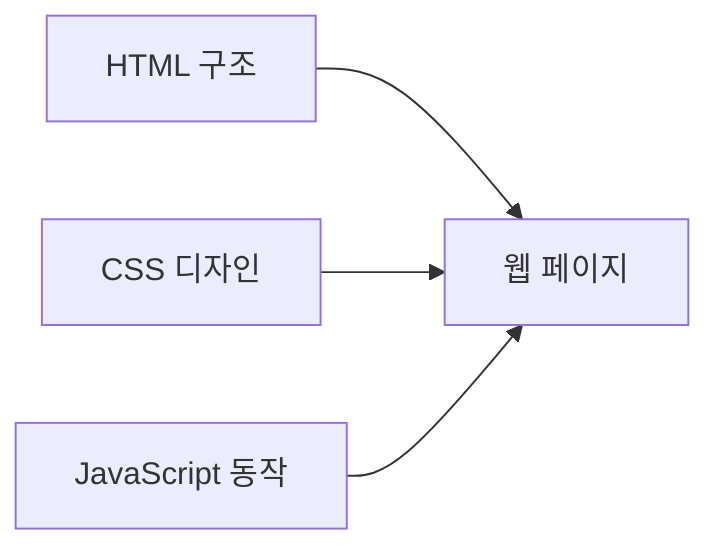
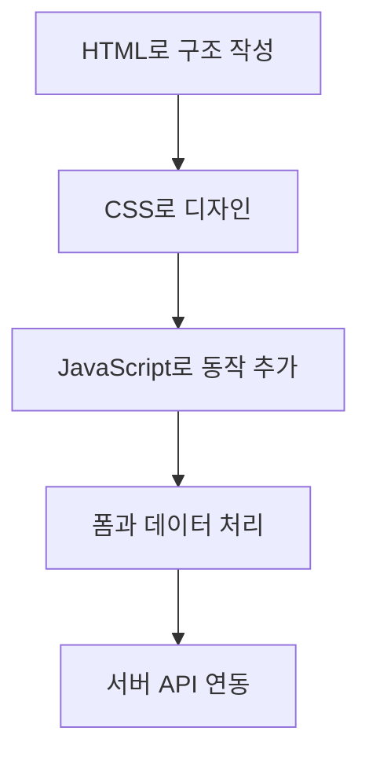

# 웹개발자에게 필요한 HTML·CSS·JavaScript 핵심

## 1. 세 기술의 역할

| 기술 | 역할 | 핵심 질문 |
|---|---|---|
| HTML | 문서의 구조와 의미 | 화면에 무엇을 배치할 것인가? |
| CSS | 모양, 배치, 반응형 디자인 | 어떻게 보이게 할 것인가? |
| JavaScript | 동작, 데이터 처리, 상호작용 | 사용자의 행동에 어떻게 반응할 것인가? |

## 2. HTML 핵심

- 기본 문서 구조: `doctype`, `html`, `head`, `body`
- 제목과 문단: `h1`~`h6`, `p`
- 링크와 이미지: `a`, `img`
- 목록과 표: `ul`, `ol`, `table`
- 시맨틱 태그: `header`, `nav`, `main`, `section`, `article`, `footer`
- 폼 요소: `form`, `label`, `input`, `select`, `textarea`, `button`
- 접근성: 적절한 제목 구조, `label`, `alt`, 의미 있는 태그

## 3. CSS 핵심

- 선택자: 태그, 클래스, 아이디, 자식·후손, 가상 클래스
- 박스 모델: `content`, `padding`, `border`, `margin`
- 크기와 단위: `px`, `%`, `rem`, `vw`, `vh`
- 색상과 글꼴: `color`, `background`, `font-*`
- 배치: `display`, Flexbox, Grid, `position`
- 반응형 웹: 미디어 쿼리와 유동적인 크기
- 상태 표현: `:hover`, `:focus`, `transition`

## 4. JavaScript 핵심

- 변수와 자료형: `const`, `let`, 문자열, 숫자, 불리언, 배열, 객체
- 연산자와 조건문: 비교, 논리 연산, `if`
- 반복과 배열 처리: `for`, `forEach`, `map`, `filter`
- 함수: 매개변수, 반환값, 화살표 함수
- DOM 조작: `querySelector`, `textContent`, `classList`, 요소 생성
- 이벤트: `click`, `submit`, `input`, `change`
- 폼 검증과 예외 처리
- JSON과 저장소: `JSON.stringify`, `JSON.parse`, `localStorage`
- 비동기 처리: `fetch`, `async`, `await` — 서버 API 연동 시 학습

## 5. 예제 실행 순서

1. 원하는 HTML 파일을 브라우저로 연다.
2. 화면을 조작하며 결과를 확인한다.
3. 메모장이나 VS Code에서 코드를 수정한다.
4. 저장 후 브라우저를 새로고침한다.

| 파일 | 중심 학습 내용 |
|---|---|
| `01-semantic-form.html` | 시맨틱 구조, 폼 요소, 기본 검증 |
| `02-responsive-cards.html` | 선택자, 박스 모델, Grid, 반응형, 상태 효과 |
| `03-todo-app.html` | DOM, 이벤트, 배열, 함수, localStorage |

## 6. 추천 학습 순서

