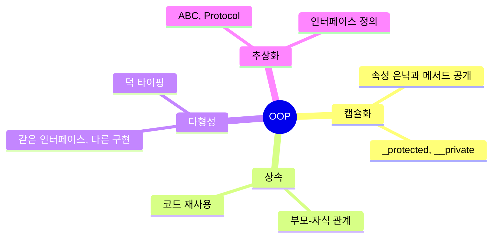
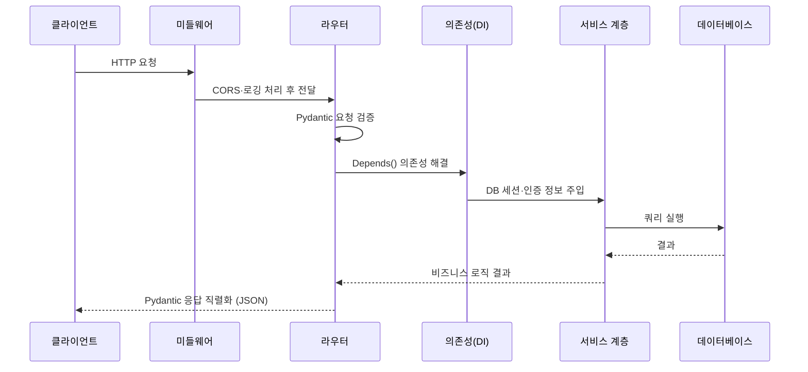
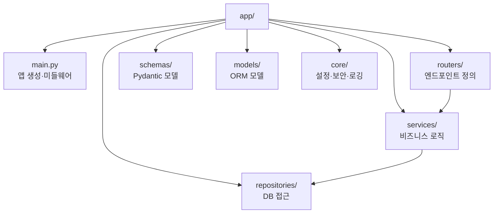
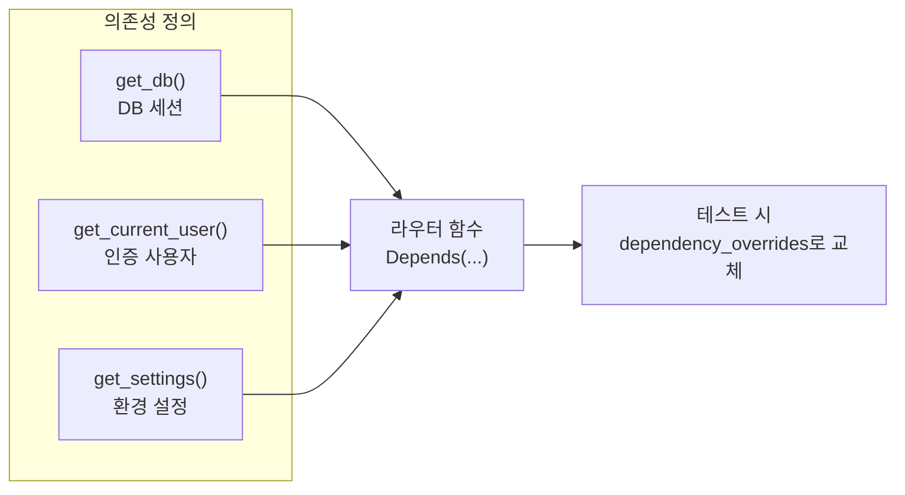
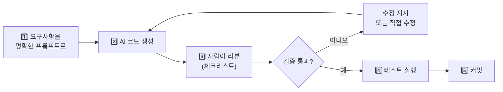
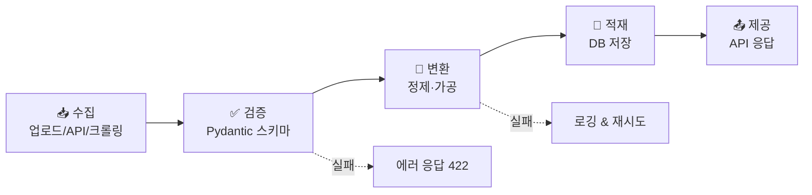
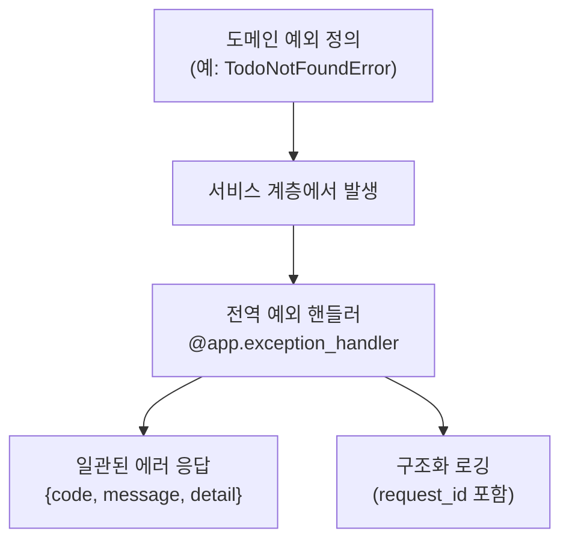

# 2. AI-Augmented 백엔드 개발 (40h · 5일)

> **교과목 목표**: FastAPI로 백엔드를 구성하고, AI가 생성한 코드를 읽고 검증하며 데이터 처리 흐름을 구현할 수 있다.

**핵심 개념**: OOP / 파이썬 / FastAPI 구조·Dependency Injection / AI 생성 코드 리뷰·수정 / 데이터 처리 파이프라인 / 에러 핸들링·로깅

---

## 1. 파이썬 OOP 핵심

### 1.1 클래스 설계 4대 원칙

### 1.2 절차형 vs 객체지향 비교

| 구분 | 절차형 | 객체지향 |
|---|---|---|
| 장점 | 단순 작업에 빠르고 직관적 | 재사용·확장·테스트 용이, 대규모에 적합 |
| 단점 | 규모 커지면 중복·의존성 폭발 | 초기 설계 비용, 과도한 추상화 위험 |
| 백엔드 적용 | 스크립트·유틸 함수 | 서비스·리포지토리 계층, Pydantic 모델 |

---

## 2. FastAPI 아키텍처

### 2.1 요청 처리 흐름 (Request Lifecycle)

### 2.2 권장 프로젝트 구조

**계층 분리의 이유**: 라우터는 "무엇을 받는가", 서비스는 "무엇을 하는가", 리포지토리는 "어떻게 저장하는가"만 담당 → 테스트와 교체가 쉬워짐.

### 2.3 웹 프레임워크 비교

| 프레임워크 | 장점 | 단점 | 적합한 경우 |
|---|---|---|---|
| **FastAPI** | 비동기 기본, 자동 문서(Swagger), Pydantic 타입 검증, 높은 성능 | 상대적으로 젊은 생태계 | AI API 서버, 신규 프로젝트 |
| **Flask** | 극도로 가볍고 자유로움, 학습 쉬움 | 검증·문서화 등 직접 구성 필요 | 소형 서비스, 프로토타입 |
| **Django** | 관리자·ORM·인증 등 풀스택 내장 | 무겁고 비동기 지원이 후발 | CMS·전통 웹 서비스 |

### 2.4 동기 vs 비동기

| 구분 | 동기 (def) | 비동기 (async def) |
|---|---|---|
| 장점 | 코드 단순, 디버깅 쉬움 | I/O 대기 중 다른 요청 처리 → 높은 동시성 |
| 단점 | I/O 병목 시 전체 대기 | 블로킹 코드 섞이면 성능 급락, 학습 곡선 |
| 사용처 | CPU 연산, 동기 라이브러리 | 외부 API 호출(LLM!), DB, 파일 I/O |

---

## 3. Dependency Injection (DI)

| DI 사용 | 직접 생성 대비 장점 | 주의점 |
|---|---|---|
| DB 세션 주입 | 요청 단위 생명주기 자동 관리 | yield로 정리(finally) 보장 |
| 인증 주입 | 라우터마다 인증 코드 중복 제거 | 의존성 체인 과도하게 깊어지지 않게 |
| 설정 주입 | 테스트에서 손쉽게 모킹 | lru_cache로 재생성 방지 |

---

## 4. AI 생성 코드 리뷰·수정

### 4.1 AI 협업 개발 워크플로우

### 4.2 AI 생성 코드 리뷰 체크리스트

| 점검 항목 | 흔한 AI 코드 문제 |
|---|---|
| **보안** | 하드코딩된 시크릿, SQL 인젝션 취약 문자열 조합 |
| **정확성** | 존재하지 않는 라이브러리 API 사용(환각), 엣지 케이스 누락 |
| **일관성** | 프로젝트 컨벤션(네이밍·구조)과 불일치 |
| **성능** | N+1 쿼리, 불필요한 동기 블로킹 |
| **의존성** | 검증 안 된 패키지, 버전 미지정 |

### 4.3 AI 활용 방식 비교

| 방식 | 장점 | 단점 |
|---|---|---|
| 자동완성형 (Copilot류) | 흐름 안 끊김, 반복 코드 제거 | 잘못된 제안 무비판 수용 위험 |
| 대화형 (Claude 등) | 설계 논의·리팩터링·설명 가능 | 컨텍스트 전달 비용 |
| 에이전트형 (Claude Code 등) | 멀티파일 작업 자동화 | 결과 검증 책임은 여전히 사람 |

---

## 5. 데이터 처리 파이프라인

- **Pydantic**으로 입력 경계에서 타입·형식을 강제 → "쓰레기가 들어오면 즉시 차단"
- 대용량 처리: 제너레이터/스트리밍으로 메모리 절약, BackgroundTasks로 비동기 후처리

---

## 6. 에러 핸들링 & 로깅

### 6.1 예외 처리 계층 전략

### 6.2 로깅 수준 가이드

| 레벨 | 용도 | 예시 |
|---|---|---|
| DEBUG | 개발 중 상세 추적 | 쿼리 파라미터 값 |
| INFO | 정상 동작 기록 | 요청 처리 완료, 소요 시간 |
| WARNING | 잠재 문제 | 재시도 발생, 응답 지연 |
| ERROR | 처리 실패 | 예외 스택 트레이스 |
| CRITICAL | 서비스 중단급 | DB 연결 불가 |

**print vs logging**

| 구분 | print | logging |
|---|---|---|
| 장점 | 즉시 사용 | 레벨·포맷·출력 대상 제어, 운영 환경 필수 |
| 단점 | 끄기·필터 불가, 운영 부적합 | 초기 설정 필요 |

---

## 📅 일차별 강의 계획 (5일 × 8h)

| 일차 | 이론 (4h) | 실습 (3.5h) | 회고 (0.5h) |
|:---:|---|---|---|
| 1 | 파이썬 OOP, 타입 힌트, Pydantic | 도메인 모델 클래스 설계 & Pydantic 스키마 작성 | 코드 리뷰 |
| 2 | FastAPI 구조, 라우팅, 요청 생명주기 | CRUD API 구현 (라우터·서비스 분리) | 리뷰 |
| 3 | DI, 동기/비동기, 미들웨어 | DB 세션 DI 적용, 비동기 외부 API 연동 | 리뷰 |
| 4 | AI 코드 생성·리뷰 방법론 | **AI로 기능 생성 → 체크리스트 리뷰 → 수정** 사이클 실습 | 리뷰 발표 |
| 5 | 데이터 파이프라인, 에러 핸들링·로깅 | 파일 업로드 파이프라인 + 전역 예외 처리 + 구조화 로깅 | 과제 안내 |

---

## 📝 과목 과제 & 미니 프로젝트

### 과제 (개인)
1. AI가 생성한 코드 1건에 대한 **리뷰 보고서** (발견한 문제 3개 이상 + 수정 diff)
2. 전역 예외 핸들러 + 로깅이 적용된 **CRUD API** GitHub 제출

### 미니 프로젝트 (개인) — "데이터 수집·가공 API 서버"
- **요구사항**: CSV/JSON 업로드 → Pydantic 검증 → 가공 → DB 저장 → 조회 API, 계층 구조(라우터/서비스/리포지토리) 준수, README에 아키텍처 다이어그램 포함
- **AI 활용 조건**: 커밋 메시지에 AI 생성/수정 여부 태깅 (`[ai-gen]`, `[human-fix]`)
- **평가 기준**: 계층 분리(25) / 검증·에러 처리(25) / AI 리뷰 품질(25) / 문서화(25)
