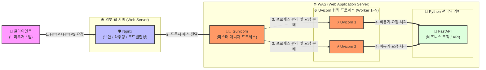

# 백엔드 서버들의 구조와 관계
> 하나의 웹 서비스를 제공하는 과정은 '식당 운영'과 매우 유사합니다. 요청한 기술들이 식당에서 각각 어떤 역할을 맡고 있고, 어떻게 연결되어 작동하는지 직관적으로 정리해 드립니다.
먼저 각 구성 요소의 핵심 정의를 식당에 빗대어 설명한 후, 전체적인 관계를 시각화 자료와 함께 설명하겠습니다.
------------------------------
## 1. 각 구성 요소의 개념 및 식당 비유

* Python (파이썬): 기본 재료 및 조리 도구
* 웹 애플리케이션을 만들기 위해 사용하는 프로그래밍 언어입니다. 모든 소스코드가 실행되는 기초 토대입니다.
* FastAPI (패스트API): 전문 요리사 (레시피 & 조리)
* 파이썬 기반의 웹 프레임워크입니다. 사용자(클라이언트)가 어떤 요청을 했을 때, 어떤 데이터를 검증하고 어떻게 비즈니스 로직을 처리하여 음식을 만들지 결정하는 역할을 합니다.
* Uvicorn (유비콘): 주방 보조 (초고속 비동기 서빙 구동)
* FastAPI를 실행시켜 주는 ASGI(비동기 서버 게이트웨이 인터페이스) 웹 서버입니다. FastAPI(요리사)가 만든 음식을 비동기 방식(async/await)으로 아주 빠르게 포장해서 밖으로 내보내는 역할을 합니다. 혼자서 일 처리가 매우 빠르지만, 주방장 한 명(단일 프로세스) 구조라 주방장 관리가 어렵습니다.
* Gunicorn (구니콘): 주방 총괄 매니저 (프로세스 관리자)
* 여러 명의 주방 보조(Uvicorn 인스턴스)를 고용하고 관리하는 WSGI/ASGI 마스터 프로세스 관리자입니다. 손님이 몰릴 때 주방 보조를 늘리거나, 한 명의 보조가 과로로 쓰러지면(서버 다운) 즉시 새로운 보조를 투입해 주방이 멈추지 않게 관리합니다.
* Nginx (엔진엑스): 식당 리셉션 / 카운터 직원 (리버스 프록시)
* 외부 손님(클라이언트)을 가장 먼저 맞이하는 웹 서버(Web Server)입니다. 손님의 요청을 받아 내부에 있는 Gunicorn/Uvicorn 주방으로 전달하고(Reverse Proxy), 보안(SSL) 적용, 정적 파일(이미지, HTML 등) 직접 서빙, 트래픽 분산(로드 밸런싱)을 담당합니다.

------------------------------
## 2. 기술 간의 상호 관계 시각화 (다이어그램)
사용자가 웹 브라우저에서 주소를 입력하고 엔터를 누른 순간부터, 데이터가 처리되어 돌아오기까지의 전체 흐름입니다.

------------------------------
## 3. 실제 작동하는 유기적 흐름 (Step-by-Step)

   1. 클라이언트의 요청: 사용자가 웹사이트를 호출하면, 요청은 가장 먼저 외부 최전선에 있는 Nginx에 도착합니다.
   2. Nginx의 필터링: Nginx는 정적 파일(이미지 등)은 자기가 바로 반환하고, 백엔드 데이터 처리가 필요한 요청은 내부 포트로 대기 중인 Gunicorn에게 넘겨줍니다. (이 과정을 리버스 프록시라고 합니다.)
   3. Gunicorn의 관리: Gunicorn은 대기하고 있다가 부하가 적은 Uvicorn(워커) 프로세스에게 일을 배정합니다.
   4. Uvicorn과 FastAPI의 협업: Uvicorn은 요청을 비동기로 받아서 Python 기반으로 작성된 FastAPI의 특정 함수를 실행합니다. FastAPI가 DB를 조회하거나 데이터를 가공해 결과(JSON)를 만들면, 이 역순으로 클라이언트에게 최종 전달됩니다.

------------------------------
## 4. 왜 한꺼번에 다 쓰나요? (핵심 조합의 이유)

* FastAPI + Python: 생산성이 높고 아주 빠른 API 개발을 위해 사용합니다.
* FastAPI + Uvicorn: FastAPI는 스스로 웹 서버 역할을 못 하므로, 비동기 처리가 가능한 Uvicorn이 반드시 파트너로 필요합니다.
* Uvicorn + Gunicorn (실운영 환경): Uvicorn은 강력하지만 멀티 프로세스 관리 능력이 부족합니다. 따라서 실서비스(Production) 환경에서는 Gunicorn을 대장(Master)으로 두고, Uvicorn을 행동대장(Worker)으로 설정하여 서버 안정성과 멀티코어 CPU 효율을 극대화합니다.
* Gunicorn + Nginx: 보안(HTTPS/SSL 인증서 적용)을 강화하고, 디도스(DDoS) 공격 방어 및 대규모 트래픽 분산을 위해 Nginx를 가장 앞에 세워둡니다.

정리된 구조를 바탕으로 다음 단계로 나아간다면 어떤 내용이 필요하신가요?

* 이 구조를 한 번에 실행하기 위한 Docker Compose 설정 파일(yaml) 작성법 알아보기
* 실제 리눅스 서버에 배포할 때 사용하는 Nginx 및 Gunicorn 설정 코드 예시 확인하기

