# 클라이언트_서버 통신방식
> FastAPI ↔ Vanilla JavaScript 데이터 통신 방식 정리

## 목차

1. [전체 기술의 흐름](#01)
2. [실습 환경 구성](#02)
3. [HTTP 통신의 기본 구조](#03)
4. [방법 1 - URL Path Parameter](#04)
5. [방법 2 - Query String](#05)
6. [방법 3 - 전통적인 HTML Form 전송](#06)
7. [방법 4 - XMLHttpRequest와 AJAX](#07)
8. [방법 5 - Fetch API GET](#08)
9. [방법 6 - Fetch API + JSON POST](#09)
10. [방법 7 - REST API CRUD](#10)
11. [방법 8 - URLSearchParams와 Form 데이터](#11)
12. [방법 9 - FormData](#12)
13. [방법 10 - 파일 업로드 multipart/form-data](#13)
14. [방법 11 - HTTP Header를 이용한 데이터 전달](#14)
15. [방법 12 - Cookie를 이용한 상태 전달](#15)
16. [방법 13 - Polling](#16)
17. [방법 14 - Long Polling](#17)
18. [방법 15 - Server-Sent Events(SSE)](#18)
19. [방법 16 - WebSocket](#19)
20. [방법 17 - Streaming Response](#20)
21. [과거 기술 JSONP와 iframe](#21)
22. [통신 방식 비교](#22)
23. [어떤 방식을 선택해야 하는가](#23)
24. [전체 기술 발전 과정](#24)
25. [학습 순서](#25)

---

<a id="01"></a>

# 1. 전체 기술의 흐름

웹 프로그램의 데이터 통신 기술은 다음과 같은 방향으로 발전해 왔다.

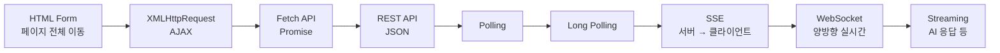

핵심적으로 보면 통신 방식은 크게 세 가지다.

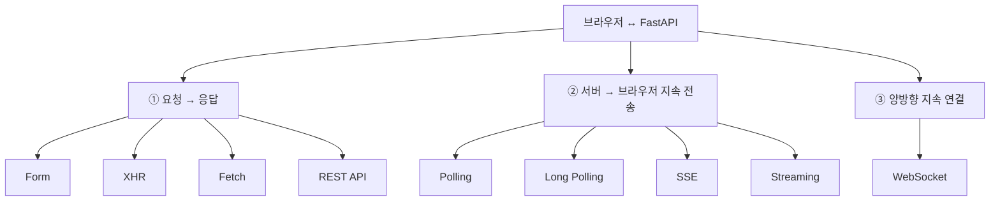

현재 웹 애플리케이션에서 가장 일반적인 구조는 다음과 같다.

```text
Vanilla JS
    ↓ fetch()
HTTP Request
    ↓
FastAPI
    ↓
Python 처리
    ↓
JSON Response
    ↓
Vanilla JS
    ↓
화면 변경
```

---

<a id="02"></a>

# 2. 실습 환경 구성

## 프로젝트 구조

```text
fastapi_js/
│
├─ backend/
│   └─ main.py
│
└─ frontend/
    └─ index.html
```

FastAPI 설치:

```bash
pip install fastapi uvicorn python-multipart
```

서버 실행:

```bash
uvicorn main:app --reload
```

백엔드 주소:

```text
http://127.0.0.1:8000
```

HTML을 VS Code Live Server로 실행한다고 가정한다.

```text
http://127.0.0.1:5500
```

포트가 다르므로 서로 다른 Origin이다.

따라서 FastAPI에 CORS 설정을 추가한다.

## 공통 FastAPI 코드

```python
from fastapi import FastAPI
from fastapi.middleware.cors import CORSMiddleware

app = FastAPI()

app.add_middleware(
    CORSMiddleware,
    allow_origins=[
        "http://127.0.0.1:5500",
        "http://localhost:5500"
    ],
    allow_credentials=True,
    allow_methods=["*"],
    allow_headers=["*"],
)
```

학습 중에는 다음처럼 사용할 수도 있다.

```python
allow_origins=["*"]
```

하지만 로그인 Cookie나 인증 정보를 사용하는 실제 서비스에서는 허용할 Origin을 명확하게 지정하는 것이 좋다.

---

<a id="03"></a>

# 3. HTTP 통신의 기본 구조

브라우저와 FastAPI의 대부분 통신은 다음 구조를 가진다.

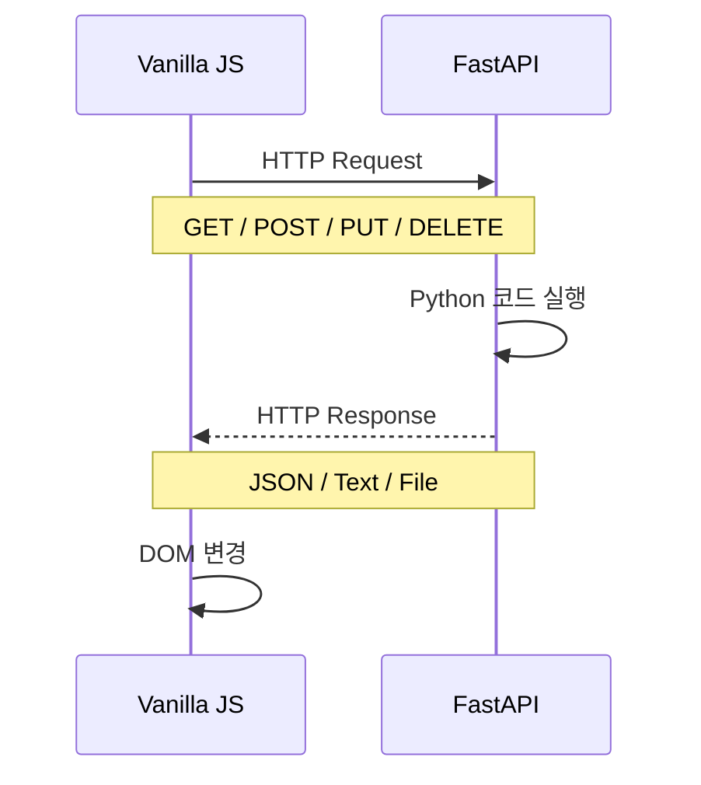

예를 들어 다음 코드가 있다.

### Frontend

```javascript
const response = await fetch("http://127.0.0.1:8000/hello");

const data = await response.json();

console.log(data);
```

### Backend

```python
@app.get("/hello")
def hello():
    return {
        "message": "안녕하세요"
    }
```

데이터 흐름:

```text
JavaScript
     │
     │ GET /hello
     ▼
FastAPI
     │
     │ {"message":"안녕하세요"}
     ▼
JavaScript
```

---

<a id="04"></a>

# 4. 방법 1 - URL Path Parameter

가장 간단한 데이터 전달 방법 중 하나다.

URL 자체에 데이터를 포함한다.

```text
/users/10
/products/100
/students/3
```

## Frontend

```html
<input id="studentId" placeholder="학생번호">

<button onclick="findStudent()">
    조회
</button>

<div id="result"></div>

<script>
async function findStudent() {

    const id = document.querySelector("#studentId").value;

    const response =
        await fetch(`http://127.0.0.1:8000/students/${id}`);

    const data = await response.json();

    document.querySelector("#result").textContent =
        data.message;
}
</script>
```

## Backend

```python
@app.get("/students/{student_id}")
def get_student(student_id: int):

    return {
        "message": f"{student_id}번 학생 조회"
    }
```

### 구조

```text
/students/10
          ↑
       학생번호
```

### 적합한 경우

```text
GET /students/10
GET /products/30
GET /orders/500
```

특정 리소스를 식별할 때 사용한다.

---

<a id="05"></a>

# 5. 방법 2 - Query String

URL 뒤에 데이터를 추가하는 방식이다.

```text
/search?keyword=python
```

여러 값도 전달할 수 있다.

```text
/search?keyword=python&page=2
```

## Frontend

```javascript
async function search() {

    const keyword = "FastAPI";

    const response = await fetch(
        `http://127.0.0.1:8000/search?keyword=${keyword}`
    );

    const data = await response.json();

    console.log(data);
}
```

## Backend

```python
@app.get("/search")
def search(keyword: str):

    return {
        "keyword": keyword
    }
```

### 구조

```text
/search?keyword=FastAPI&page=1
        └──────┬───────┘
          Query String
```

### 주로 사용하는 곳

검색:

```text
/products?keyword=monitor
```

필터:

```text
/products?category=computer
```

페이지:

```text
/products?page=3
```

정렬:

```text
/products?sort=price
```

---

<a id="06"></a>

# 6. 방법 3 - 전통적인 HTML Form 전송

JavaScript가 널리 사용되기 전부터 사용된 기본적인 웹 데이터 전송 방식이다.

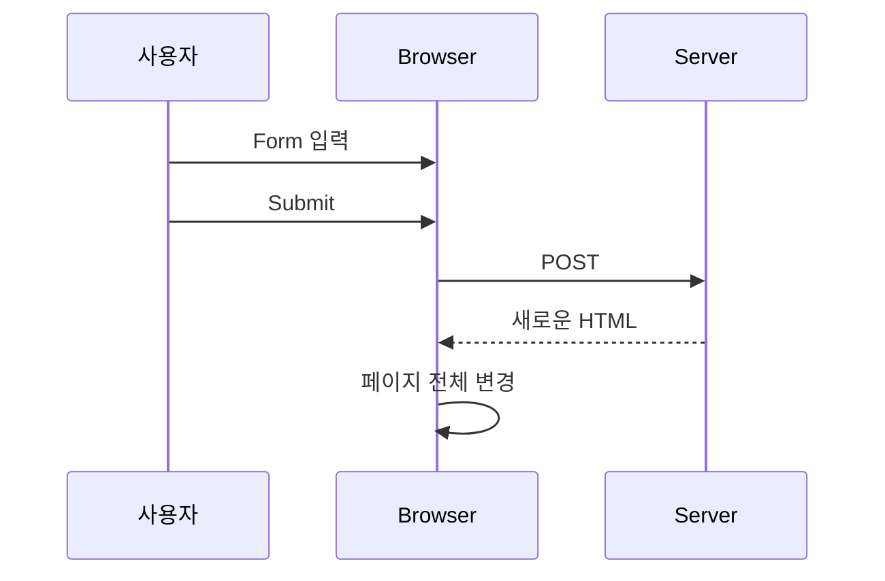

## Frontend

```html
<form
    action="http://127.0.0.1:8000/login"
    method="post">

    <input name="username">

    <input
        name="password"
        type="password">

    <button type="submit">
        로그인
    </button>

</form>
```

JavaScript가 전혀 필요 없다.

## Backend

```python
from fastapi import Form

@app.post("/login")
def login(
    username: str = Form(),
    password: str = Form()
):

    return {
        "username": username
    }
```

Form 데이터는 일반적으로 다음 형식으로 전달된다.

```text
Content-Type:
application/x-www-form-urlencoded
```

예:

```text
username=hong&password=1234
```

### 단점

Submit을 수행하면 기본적으로 페이지가 이동한다.

이 문제를 해결하기 위해 등장한 기술이 AJAX이다.

---

<a id="07"></a>

# 7. 방법 4 - XMLHttpRequest와 AJAX

2000년대 웹 개발에서 매우 중요한 기술이었다.

AJAX:

```text
Asynchronous JavaScript And XML
```

하지만 반드시 XML을 사용하는 것은 아니다.

JSON도 사용할 수 있다.

### 기존 Form

```text
요청
 ↓
페이지 전체 변경
```

### AJAX

```text
요청
 ↓
데이터만 수신
 ↓
필요한 화면만 변경
```

## Frontend

```html
<button onclick="loadData()">
    학생 조회
</button>

<div id="result"></div>

<script>

function loadData() {

    const xhr = new XMLHttpRequest();

    xhr.open(
        "GET",
        "http://127.0.0.1:8000/student"
    );

    xhr.onload = function() {

        const data =
            JSON.parse(xhr.responseText);

        document.querySelector("#result")
            .textContent = data.name;
    };

    xhr.send();
}

</script>
```

## Backend

```python
@app.get("/student")
def student():

    return {
        "name": "홍길동",
        "score": 90
    }
```

### 기술 흐름

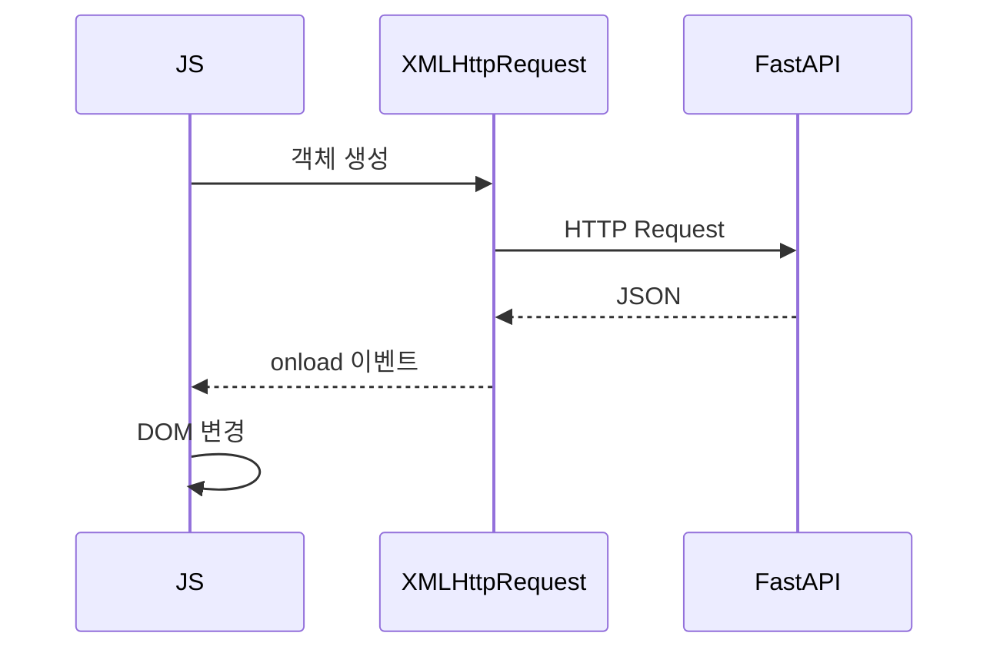

현재 새 프로젝트에서 단순 HTTP 요청을 작성할 때는 대부분 Fetch API를 사용한다.

하지만 XHR은 다음과 같은 기존 프로젝트에서 아직 볼 수 있다.

```text
레거시 웹 시스템
오래된 AJAX 코드
jQuery 기반 시스템
기존 기업 시스템
```

---

<a id="08"></a>

# 8. 방법 5 - Fetch API GET

현재 Vanilla JavaScript에서 가장 기본적으로 학습해야 하는 HTTP 통신 방법이다.

## Frontend

```html
<button onclick="getStudent()">
    조회
</button>

<div id="result"></div>

<script>

async function getStudent() {

    const response =
        await fetch(
            "http://127.0.0.1:8000/student"
        );

    const data =
        await response.json();

    document.querySelector("#result")
        .textContent =
        `${data.name} : ${data.score}`;
}

</script>
```

## Backend

```python
@app.get("/student")
def student():

    return {
        "name": "홍길동",
        "score": 95
    }
```

### 가장 중요한 구조

```javascript
const response = await fetch(URL);

const data = await response.json();
```

`fetch()`가 반환하는 것은 곧바로 JSON이 아니다.

```text
fetch()
   ↓
Response 객체
   ↓ response.json()
JavaScript 객체
```

즉 다음 두 단계를 구별해야 한다.

```javascript
const response = await fetch(url);

const data = await response.json();
```

---

<a id="09"></a>

# 9. 방법 6 - Fetch API + JSON POST

현재 프론트엔드 ↔ REST API 통신에서 가장 자주 사용하는 패턴 중 하나다.

## 예제: 성적 계산

### Frontend

```html
<input id="name" placeholder="이름">

<input id="kor" type="number" placeholder="국어">

<input id="eng" type="number" placeholder="영어">

<input id="math" type="number" placeholder="수학">

<button onclick="calculate()">
    계산
</button>

<div id="result"></div>

<script>

async function calculate() {

    const student = {

        name:
            document.querySelector("#name").value,

        kor:
            Number(document.querySelector("#kor").value),

        eng:
            Number(document.querySelector("#eng").value),

        math:
            Number(document.querySelector("#math").value)
    };


    const response =
        await fetch(
            "http://127.0.0.1:8000/scores",
            {
                method: "POST",

                headers: {
                    "Content-Type":
                        "application/json"
                },

                body:
                    JSON.stringify(student)
            }
        );


    const data =
        await response.json();


    document.querySelector("#result")
        .textContent =
        `총점: ${data.total},
         평균: ${data.average}`;
}

</script>
```

## Backend

```python
from pydantic import BaseModel


class Scores(BaseModel):
    name: str
    kor: int
    eng: int
    math: int


@app.post("/scores")
def calculate(data: Scores):

    total = (
        data.kor +
        data.eng +
        data.math
    )

    average = total / 3

    return {
        "name": data.name,
        "total": total,
        "average": average
    }
```

### 데이터 변환 과정

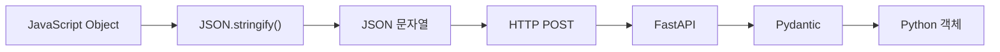

예를 들어 JavaScript 객체가

```javascript
{
    name: "홍길동",
    kor: 90
}
```

다음 문자열로 변환된다.

```json
{
    "name": "홍길동",
    "kor": 90
}
```

---

<a id="10"></a>

# 10. 방법 7 - REST API CRUD

현대 웹 서비스의 기본적인 데이터 처리 방식이다.

CRUD와 HTTP Method를 연결한다.

| CRUD | HTTP | 의미 |
|---|---|---|
| Create | POST | 등록 |
| Read | GET | 조회 |
| Update | PUT / PATCH | 수정 |
| Delete | DELETE | 삭제 |

예를 들어 학생 관리 시스템이라면:

```text
GET    /students
GET    /students/1
POST   /students
PUT    /students/1
DELETE /students/1
```

## Backend

```python
students = [
    {"id": 1, "name": "홍길동"},
    {"id": 2, "name": "김철수"}
]
```

### 전체 조회

```python
@app.get("/students")
def get_students():
    return students
```

### 등록

```python
class Student(BaseModel):
    name: str


@app.post("/students")
def add_student(student: Student):

    new_student = {
        "id": len(students) + 1,
        "name": student.name
    }

    students.append(new_student)

    return new_student
```

### 삭제

```python
@app.delete("/students/{student_id}")
def delete_student(student_id: int):

    global students

    students = [
        student
        for student in students
        if student["id"] != student_id
    ]

    return {
        "message": "삭제 완료"
    }
```

## Frontend

### 조회

```javascript
const response =
    await fetch(
        "http://127.0.0.1:8000/students"
    );

const students =
    await response.json();
```

### 등록

```javascript
await fetch(
    "http://127.0.0.1:8000/students",
    {
        method: "POST",

        headers: {
            "Content-Type":
                "application/json"
        },

        body: JSON.stringify({
            name: "이순신"
        })
    }
);
```

### 삭제

```javascript
await fetch(
    "http://127.0.0.1:8000/students/1",
    {
        method: "DELETE"
    }
);
```

---

<a id="11"></a>

# 11. 방법 8 - URLSearchParams

HTML Form 방식과 비슷하게 데이터를 전송할 수 있다.

## Frontend

```javascript
const params =
    new URLSearchParams();

params.append(
    "username",
    "hong"
);

params.append(
    "password",
    "1234"
);


const response =
    await fetch(
        "http://127.0.0.1:8000/login",
        {
            method: "POST",

            body: params
        }
    );
```

## Backend

```python
from fastapi import Form


@app.post("/login")
def login(
    username: str = Form(),
    password: str = Form()
):

    return {
        "username": username
    }
```

전송 형태:

```text
username=hong&password=1234
```

Content-Type:

```text
application/x-www-form-urlencoded
```

---

<a id="12"></a>

# 12. 방법 9 - FormData

JavaScript에서 HTML Form과 유사한 데이터를 쉽게 구성할 수 있다.

특히 **파일 업로드**에서 매우 중요하다.

## Frontend

```html
<input id="username">

<button onclick="send()">
    전송
</button>

<script>

async function send() {

    const formData =
        new FormData();

    formData.append(
        "username",
        document.querySelector("#username").value
    );


    const response =
        await fetch(
            "http://127.0.0.1:8000/form",
            {
                method: "POST",
                body: formData
            }
        );

    const data =
        await response.json();

    console.log(data);
}

</script>
```

## Backend

```python
from fastapi import Form


@app.post("/form")
def form(
    username: str = Form()
):

    return {
        "username": username
    }
```

### 중요한 점

FormData를 사용할 때 다음 코드를 직접 넣지 않는 것이 좋다.

```javascript
headers: {
    "Content-Type": "multipart/form-data"
}
```

브라우저가 multipart boundary를 포함하여 Content-Type을 자동 생성하게 해야 한다.

---

<a id="13"></a>

# 13. 방법 10 - 파일 업로드 multipart/form-data

파일과 문자열 데이터를 함께 서버에 보내려면 `FormData`가 매우 편리하다.

## Frontend

```html
<input id="name">

<input
    id="file"
    type="file">

<button onclick="upload()">
    업로드
</button>

<script>

async function upload() {

    const formData =
        new FormData();

    formData.append(
        "name",
        document.querySelector("#name").value
    );

    formData.append(
        "file",
        document.querySelector("#file").files[0]
    );


    const response =
        await fetch(
            "http://127.0.0.1:8000/upload",
            {
                method: "POST",
                body: formData
            }
        );


    const data =
        await response.json();

    console.log(data);
}

</script>
```

## Backend

```python
from fastapi import (
    File,
    Form,
    UploadFile
)


@app.post("/upload")
async def upload(
    name: str = Form(),
    file: UploadFile = File()
):

    return {
        "name": name,
        "filename": file.filename,
        "content_type":
            file.content_type
    }
```

데이터 구조는 다음과 같다.

```text
multipart/form-data
│
├── name
│     └── 홍길동
│
└── file
      └── photo.jpg
```

---

<a id="14"></a>

# 14. 방법 11 - HTTP Header를 이용한 데이터 전달

모든 데이터를 URL이나 Body에 넣는 것은 아니다.

인증 정보 등의 메타데이터는 HTTP Header를 사용한다.

예:

```text
Authorization
Content-Type
Accept
X-API-Key
```

## Frontend

```javascript
const response =
    await fetch(
        "http://127.0.0.1:8000/user",
        {
            headers: {
                "X-API-Key":
                    "abc123"
            }
        }
    );
```

## Backend

```python
from fastapi import Header


@app.get("/user")
def user(
    x_api_key: str = Header()
):

    return {
        "api_key": x_api_key
    }
```

실제 인증에서는 흔히 다음 구조를 사용한다.

```text
Authorization:
Bearer eyJhbGciOi...
```

### 데이터 위치 비교

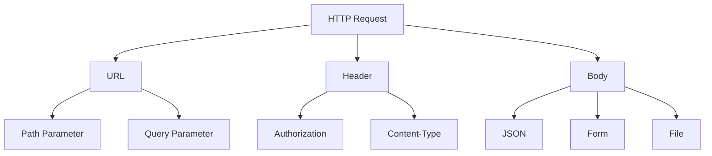

---

<a id="15"></a>

# 15. 방법 12 - Cookie를 이용한 상태 전달

HTTP는 원래 각각의 요청이 독립적이다.

```text
요청 1
요청 2
요청 3
```

서버 입장에서는 기본적으로 이전 요청을 기억하지 않는다.

이를 보완하는 방법 중 하나가 Cookie다.

## Backend

```python
from fastapi import Response, Cookie


@app.get("/login")
def login(response: Response):

    response.set_cookie(
        key="username",
        value="hong"
    )

    return {
        "message": "로그인 완료"
    }
```

Cookie 읽기:

```python
@app.get("/mypage")
def mypage(
    username: str | None =
        Cookie(default=None)
):

    return {
        "username": username
    }
```

## Frontend

```javascript
const response =
    await fetch(
        "http://127.0.0.1:8000/mypage",
        {
            credentials:
                "include"
        }
    );
```

CORS 환경에서 Cookie를 사용한다면 백엔드의 Origin 및 credentials 설정도 함께 고려해야 한다.

---

<a id="16"></a>

# 16. 방법 13 - Polling

이제 실시간 데이터 통신으로 넘어가 보자.

예:

```text
주식 가격
주문 상태
택배 상태
서버 작업 진행률
```

가장 간단한 방법은 브라우저가 일정 시간마다 서버에 질문하는 것이다.

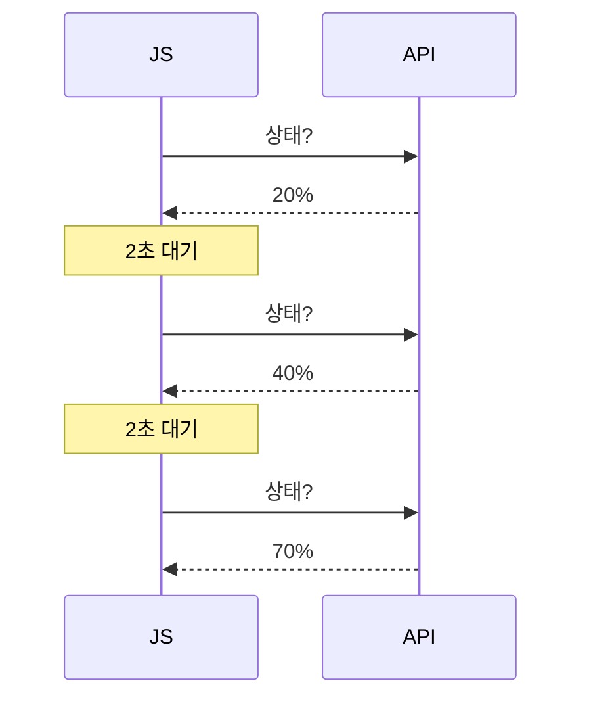

## Frontend

```javascript
setInterval(
    async () => {

        const response =
            await fetch(
                "http://127.0.0.1:8000/status"
            );

        const data =
            await response.json();

        console.log(
            data.progress
        );

    },
    2000
);
```

## Backend

```python
import random


@app.get("/status")
def status():

    return {
        "progress":
            random.randint(0, 100)
    }
```

### 장점

매우 간단하다.

### 단점

변화가 없어도 계속 요청한다.

```text
요청
요청
요청
요청
요청
```

따라서 서버에 불필요한 요청이 많이 발생할 수 있다.

---

<a id="17"></a>

# 17. 방법 14 - Long Polling

Polling을 개선한 방법이다.

일반 Polling:

```text
요청
→ 즉시 응답
→ 대기
→ 다시 요청
```

Long Polling:

```text
요청
      ↓

서버가 바로 응답하지 않음

      ↓

데이터 변화 발생

      ↓

응답
```

## Backend

```python
import asyncio


@app.get("/long-poll")
async def long_poll():

    await asyncio.sleep(5)

    return {
        "message":
            "새로운 데이터 발생"
    }
```

## Frontend

```javascript
async function listen() {

    while (true) {

        const response =
            await fetch(
                "http://127.0.0.1:8000/long-poll"
            );

        const data =
            await response.json();

        console.log(
            data.message
        );
    }
}

listen();
```

### Polling과 비교

```text
Polling

Client ──요청──> Server
Client <─응답──── Server

잠시 후 다시 요청
```

```text
Long Polling

Client ──요청────────────────> Server
                              기다림
Client <────────────────응답── Server
```

현재는 SSE나 WebSocket이 적합한 환경에서는 이들을 사용하는 경우가 많지만, Long Polling이라는 개념을 이해하면 실시간 통신의 발전 과정을 이해하기 쉽다.

---

<a id="18"></a>

# 18. 방법 15 - Server-Sent Events(SSE)

SSE는 서버가 브라우저로 데이터를 계속 전달하는 방식이다.

방향이 중요하다.

```text
Server ─────────────→ Browser
```

단방향이다.

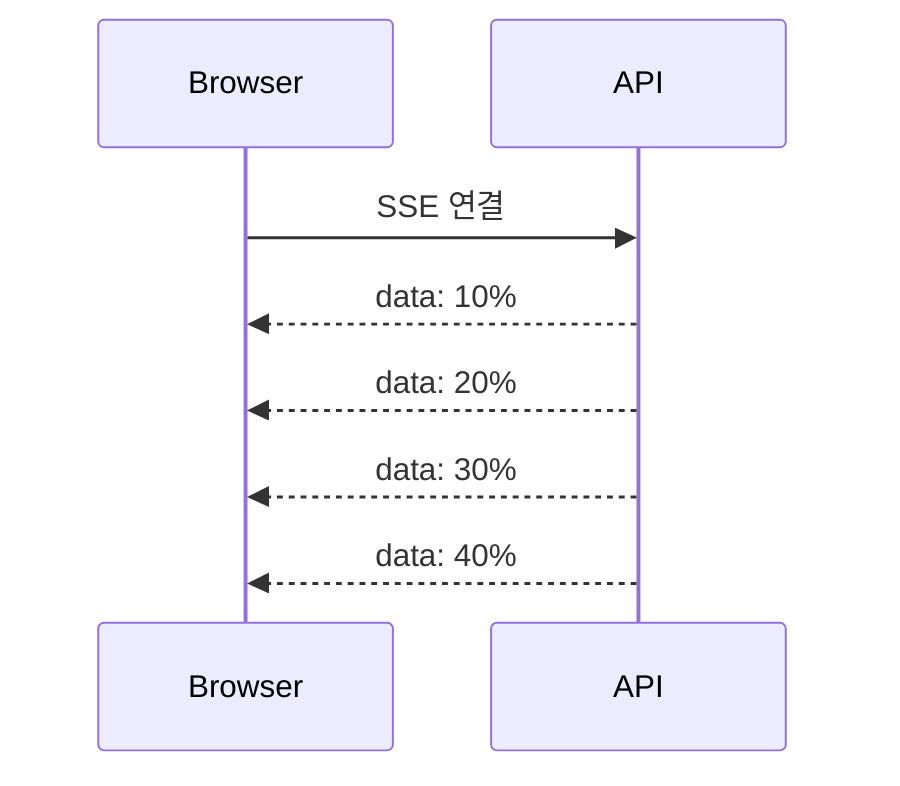

사용 예:

```text
알림
뉴스 업데이트
주식 시세
서버 작업 진행상황
AI 이벤트 알림
로그 스트리밍
```

## Backend

```python
import asyncio

from fastapi.responses import StreamingResponse


async def event_generator():

    for i in range(1, 6):

        yield f"data: 진행률 {i * 20}%\n\n"

        await asyncio.sleep(1)


@app.get("/events")
async def events():

    return StreamingResponse(
        event_generator(),
        media_type="text/event-stream"
    )
```

## Frontend

```javascript
const eventSource =
    new EventSource(
        "http://127.0.0.1:8000/events"
    );


eventSource.onmessage =
    function(event) {

        console.log(
            event.data
        );
    };
```

### SSE 핵심

```text
브라우저
   │
   │ 한 번 연결
   ▼
FastAPI
   │
   ├── data 1
   ├── data 2
   ├── data 3
   ├── data 4
   └── data 5
```

Polling처럼 매번 요청할 필요가 없다.

---

<a id="19"></a>

# 19. 방법 16 - WebSocket

WebSocket은 브라우저와 서버가 연결을 유지하면서 **양방향으로 데이터를 전송**할 수 있다.

```text
Browser ←────────────→ FastAPI
```

대표 사용 분야:

```text
채팅
온라인 게임
실시간 협업
실시간 관제
주식 거래 화면
IoT
실시간 대시보드
```

## 통신 구조

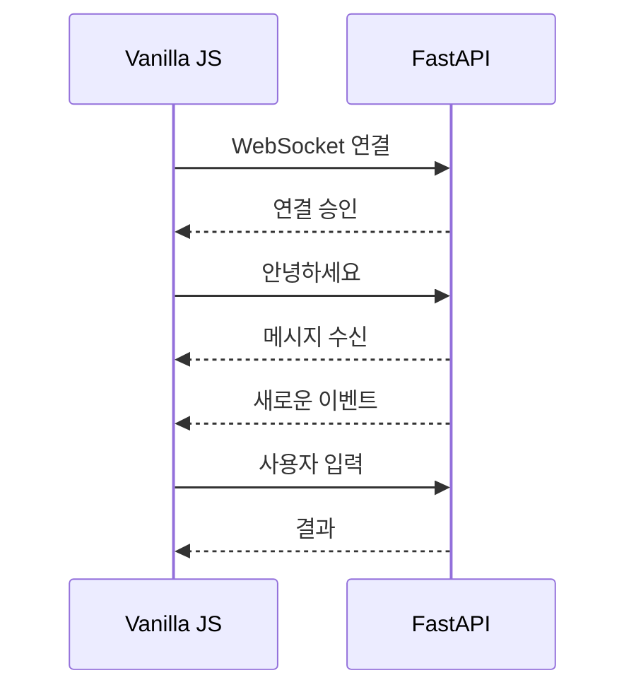

## Backend

```python
from fastapi import WebSocket


@app.websocket("/ws")
async def websocket_endpoint(
    websocket: WebSocket
):

    await websocket.accept()

    while True:

        message =
            await websocket.receive_text()

        await websocket.send_text(
            f"서버 수신: {message}"
        )
```

## Frontend

```html
<input id="message">

<button onclick="sendMessage()">
    전송
</button>

<ul id="messages"></ul>

<script>

const socket =
    new WebSocket(
        "ws://127.0.0.1:8000/ws"
    );


socket.onopen = () => {

    console.log(
        "WebSocket 연결 성공"
    );
};


socket.onmessage = event => {

    const li =
        document.createElement("li");

    li.textContent =
        event.data;

    document
        .querySelector("#messages")
        .appendChild(li);
};


function sendMessage() {

    const input =
        document.querySelector("#message");

    socket.send(
        input.value
    );

    input.value = "";
}

</script>
```

### Fetch와 WebSocket 비교

Fetch:

```text
Client ─────→ Server
Client ←───── Server

연결 종료
```

WebSocket:

```text
Client ═════════ Server

   → message
   ← message
   → message
   ← message

연결 유지
```

---

<a id="20"></a>

# 20. 방법 17 - Streaming Response

최근 AI 서비스에서 매우 중요해진 통신 방식이다.

예를 들어 LLM 응답이 다음 문장이라고 하자.

```text
안녕하세요. 무엇을 도와드릴까요?
```

일반 HTTP 응답은 모든 처리가 끝난 다음 전달할 수 있다.

```text
[처리 중........]

안녕하세요. 무엇을 도와드릴까요?
```

Streaming은 데이터를 준비되는 대로 보낸다.

```text
안
안녕
안녕하세요
안녕하세요.
안녕하세요. 무엇을
안녕하세요. 무엇을 도와드릴까요?
```

## Backend

```python
import asyncio

from fastapi.responses import StreamingResponse


async def stream_text():

    words = [
        "안녕하세요. ",
        "FastAPI와 ",
        "JavaScript의 ",
        "스트리밍 ",
        "예제입니다."
    ]

    for word in words:

        yield word

        await asyncio.sleep(0.5)


@app.get("/stream")
async def stream():

    return StreamingResponse(
        stream_text(),
        media_type="text/plain"
    )
```

## Frontend

```javascript
async function startStream() {

    const response =
        await fetch(
            "http://127.0.0.1:8000/stream"
        );


    const reader =
        response.body.getReader();


    const decoder =
        new TextDecoder();


    while (true) {

        const {
            value,
            done
        } =
        await reader.read();


        if (done)
            break;


        const text =
            decoder.decode(
                value
            );


        document
            .querySelector("#result")
            .textContent += text;
    }
}
```

### 구조

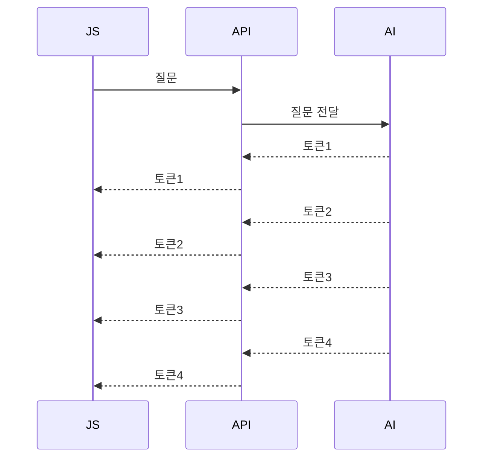

ChatGPT와 비슷한 응답 UI를 만들 때 이해해야 할 중요한 개념이다.

---

<a id="21"></a>

# 21. 과거 기술 JSONP와 iframe

역사적으로 알아둘 만하지만 새 프로젝트에서 일반적인 API 통신 방식으로 선택할 기술은 아니다.

## iframe

JavaScript AJAX가 일반적이지 않던 시절에는 숨겨진 iframe을 사용해 페이지를 다시 로드하지 않고 서버에 데이터를 보내는 기법이 사용되기도 했다.

```html
<iframe
    name="hiddenFrame"
    style="display:none">
</iframe>

<form
    action="/upload"
    method="post"
    target="hiddenFrame">

    <input name="name">

    <button>
        전송
    </button>
</form>
```

현재는 대부분 다음 기술로 대체한다.

```text
iframe trick
      ↓
XMLHttpRequest
      ↓
Fetch / FormData
```

## JSONP

과거 브라우저의 Cross-Origin 제한을 우회하기 위해 사용되었다.

개념:

```html
<script
 src="https://server.com/data?callback=result">
</script>
```

서버가 다음 형태의 JavaScript를 반환한다.

```javascript
result({
    name: "홍길동"
});
```

현재 일반적인 API에서는 CORS를 사용하므로 JSONP를 사용할 이유가 거의 없다.

---

<a id="22"></a>

# 22. 통신 방식 비교

| 방법 | 방향 | 연결 | 주요 용도 | 현재 중요도 |
|---|---|---|---|---|
| HTML Form | Client → Server | 일회성 | 전통적 Form | ★★ |
| XMLHttpRequest | 양방향 요청/응답 | 일회성 | 기존 AJAX | ★★ |
| Fetch | 요청/응답 | 일회성 | 일반 API | ★★★★★ |
| REST + JSON | 요청/응답 | 일회성 | CRUD | ★★★★★ |
| FormData | 요청/응답 | 일회성 | Form·파일 | ★★★★ |
| Header | 요청/응답 | 일회성 | 인증·메타정보 | ★★★★★ |
| Cookie | 요청마다 전달 | 지속 상태 | 로그인 상태 | ★★★★ |
| Polling | 반복 요청 | 반복 | 간단 상태 확인 | ★★★ |
| Long Polling | 반복 장기 요청 | 반지속 | 과거 실시간 | ★★ |
| SSE | Server → Client | 지속 | 알림·진행상황 | ★★★★ |
| WebSocket | 양방향 | 지속 | 채팅·실시간 | ★★★★★ |
| Streaming | Server → Client | 요청 동안 지속 | AI·대용량 응답 | ★★★★★ |

---

<a id="23"></a>

# 23. 어떤 방식을 선택해야 하는가

다음 기준으로 판단하면 된다.

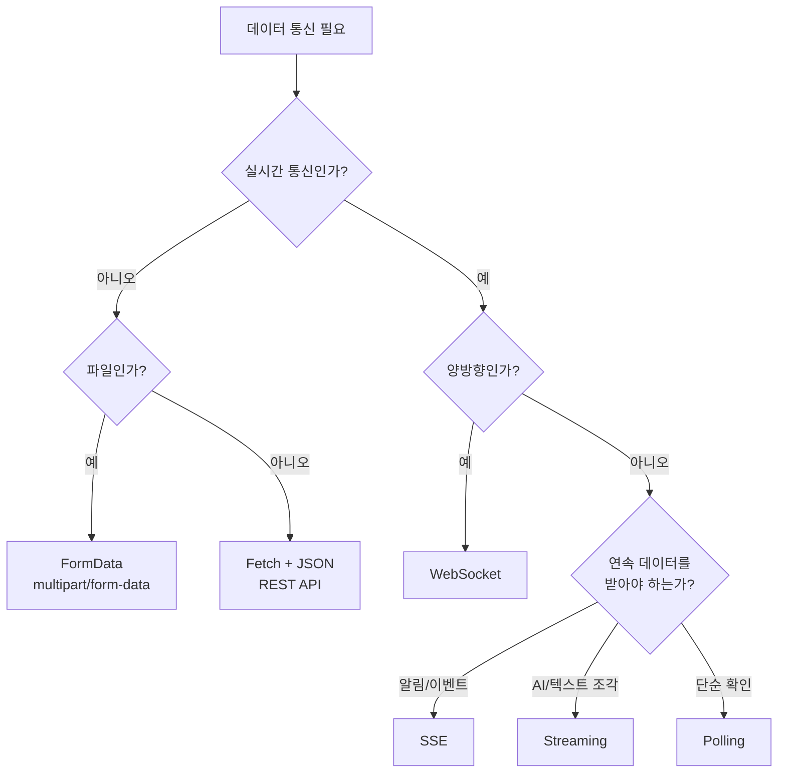

실무적으로는 우선 다음 네 가지를 구분할 수 있으면 된다.

### 일반 데이터

```text
Fetch + JSON
```

예:

```text
회원 관리
상품 관리
주문 관리
성적 관리
게시판
```

### 파일

```text
Fetch + FormData
```

예:

```text
프로필 사진
PDF
Excel
이미지
첨부파일
```

### 서버의 지속적인 단방향 이벤트

```text
SSE
```

예:

```text
작업 진행률
알림
로그
상태 업데이트
```

### 실시간 양방향

```text
WebSocket
```

예:

```text
채팅
게임
공동 편집
실시간 제어
```

---

<a id="24"></a>

# 24. 전체 기술 발전 과정

웹 데이터 통신 기술의 발전을 한 번에 정리하면 다음과 같다.

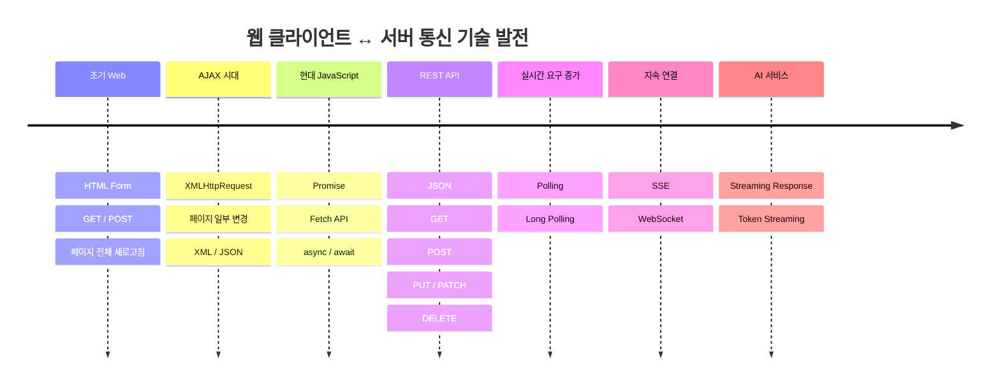

조금 더 단순하게 표현하면 다음과 같다.

```text
HTML Form
   │
   ▼
XMLHttpRequest
   │
   ▼
AJAX
   │
   ▼
Fetch
   │
   ▼
REST API + JSON
   │
   ├───────────────┐
   │               │
   ▼               ▼
Polling          Streaming
   │               │
   ▼               ▼
Long Polling     AI 서비스
   │
   ├───────────────┐
   ▼               ▼
SSE            WebSocket
단방향           양방향
```

---

<a id="25"></a>

# 25. 학습 순서

처음부터 WebSocket을 학습하기보다 다음 순서로 진행하는 것이 전체 구조를 이해하기 좋다.

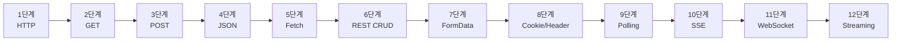

## 1단계

먼저 URL과 HTTP를 이해한다.

```text
Path Parameter
Query Parameter
GET
POST
```

---

## 2단계

JavaScript에서 Fetch API를 이해한다.

```javascript
const response =
    await fetch(url);

const data =
    await response.json();
```

이 두 줄이 프론트엔드와 FastAPI 통신의 핵심이다.

---

## 3단계

JSON POST를 학습한다.

```javascript
fetch(url, {

    method: "POST",

    headers: {
        "Content-Type":
            "application/json"
    },

    body:
        JSON.stringify(data)
});
```

---

## 4단계

FastAPI Pydantic 모델과 연결한다.

```python
class Student(BaseModel):
    name: str
    score: int
```

```text
JavaScript Object
       ↓
JSON.stringify()
       ↓
HTTP
       ↓
FastAPI
       ↓
Pydantic
       ↓
Python Object
```

이 흐름을 이해하는 것이 매우 중요하다.

---

# 26. 최종 핵심 구조

FastAPI와 Vanilla JavaScript의 관계를 가장 단순하게 정리하면 다음과 같다.

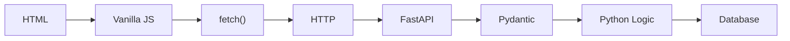

응답은 반대 방향이다.

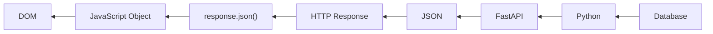

결국 핵심은 다음 변환 과정이다.

```text
Frontend

HTML
 ↓
JavaScript Object
 ↓
JSON.stringify()
 ↓
HTTP Request


      ↓


Backend

FastAPI
 ↓
Pydantic
 ↓
Python
 ↓
Database


      ↓


Frontend

JSON Response
 ↓
response.json()
 ↓
JavaScript Object
 ↓
DOM 변경
```

# 27. 가장 중요한 네 가지 패턴

전체 내용을 학습한 뒤에는 다음 네 가지 코드를 바로 구별할 수 있어야 한다.

## ① 일반 조회

```javascript
const response =
    await fetch("/students");

const data =
    await response.json();
```

```python
@app.get("/students")
def students():
    return data
```

---

## ② JSON 등록

```javascript
await fetch("/students", {

    method: "POST",

    headers: {
        "Content-Type":
            "application/json"
    },

    body:
        JSON.stringify(student)
});
```

```python
@app.post("/students")
def add(student: Student):

    return student
```

---

## ③ 파일 업로드

```javascript
const formData =
    new FormData();

formData.append(
    "file",
    file
);

await fetch(
    "/upload",
    {
        method: "POST",
        body: formData
    }
);
```

```python
@app.post("/upload")
async def upload(
    file: UploadFile
):
    ...
```

---

## ④ 실시간 통신

단방향:

```text
SSE
Server → Client
```

양방향:

```text
WebSocket
Server ↔ Client
```

AI Streaming:

```text
FastAPI
 ↓ token
 ↓ token
 ↓ token
Browser
```

이 네 가지 구조를 기준으로 보면 대부분의 FastAPI ↔ JavaScript 통신 문제를 분류할 수 있다.
