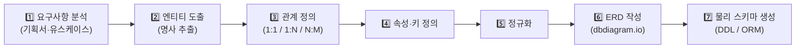
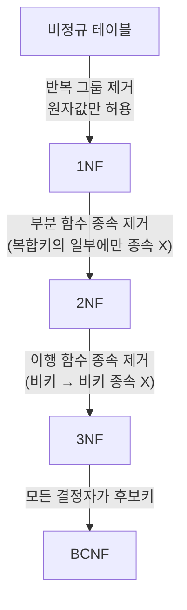
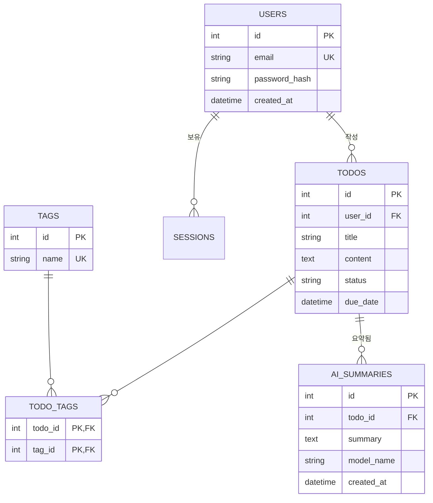
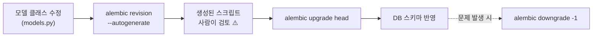
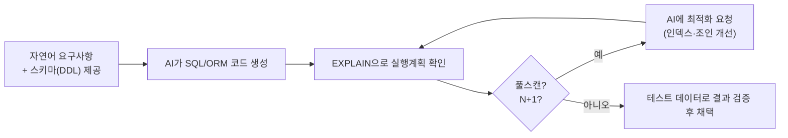
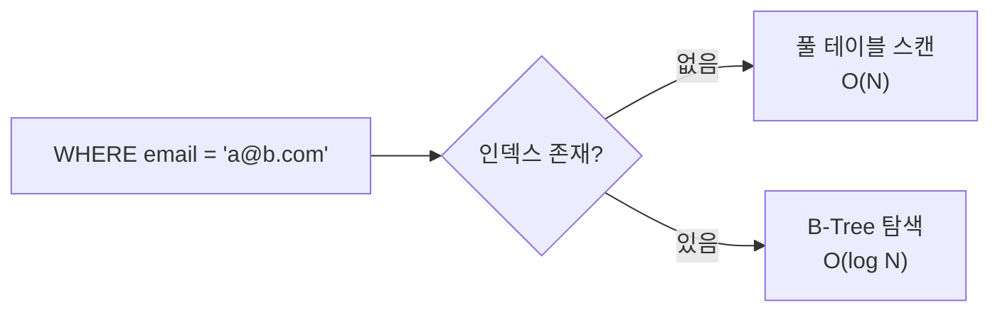

# 3. 서비스 도메인 모델링 & 데이터 아키텍처 (40h · 5일)

> **교과목 목표**: 서비스 도메인을 분석하여 RDB 스키마를 설계하고 ORM 활용 및 쿼리 최적화를 적용할 수 있다.

**핵심 개념**: RDB 정규화·설계 원칙 / ERD 작성(dbdiagram.io) / SQLAlchemy ORM·Alembic / AI 활용 쿼리 작성 / 인덱스·성능 최적화

---

## 1. 도메인 모델링 프로세스

---

## 2. RDB 정규화

### 2.1 정규화 단계

### 2.2 정규화 vs 비정규화

| 구분 | 정규화 | 비정규화 |
|---|---|---|
| 장점 | 중복 제거, 갱신 이상 방지, 무결성 보장 | 조인 감소 → 읽기 성능 향상 |
| 단점 | 조인 증가 → 조회 복잡·느려질 수 있음 | 중복 데이터 → 갱신 비용·불일치 위험 |
| 적합 상황 | 쓰기 잦은 OLTP, 무결성 중요 | 읽기 위주 조회, 집계·리포트, 캐시 테이블 |

> 원칙: **3NF까지 정규화한 뒤, 성능 문제가 "측정"되면 선택적으로 비정규화**한다.

---

## 3. ERD 작성 (예시: Todo + AI 서비스)

- **N:M 관계는 반드시 교차 테이블(TODO_TAGS)로 분해**
- dbdiagram.io의 DBML 문법으로 동일 ERD를 작성하고 SQL 내보내기 실습

---

## 4. SQLAlchemy ORM & Alembic

### 4.1 ORM vs Raw SQL

| 구분 | ORM (SQLAlchemy) | Raw SQL |
|---|---|---|
| 장점 | 파이썬 객체로 조작, DB 교체 용이, SQL 인젝션 기본 방어, 관계 탐색 편리 | 세밀한 튜닝, 복잡한 분석 쿼리에 유리 |
| 단점 | 추상화 뒤 비효율 쿼리(N+1), 학습 곡선 | 문자열 관리 부담, DB 종속, 보안 실수 위험 |
| 권장 | 일반 CRUD·비즈니스 로직 | 복잡 집계·성능 크리티컬 구간 (text() 병행) |

### 4.2 마이그레이션 워크플로우 (Alembic)

> ⚠️ autogenerate는 컬럼 이름 변경을 "삭제+추가"로 감지하는 등 한계가 있으므로 **스크립트 검토는 필수**.

### 4.3 세션·트랜잭션 핵심

| 개념 | 설명 |
|---|---|
| Session | 작업 단위(Unit of Work). 요청당 1개, DI로 주입 |
| commit / rollback | 성공 시 확정, 예외 시 원복 — try/except/finally 패턴 |
| lazy vs eager loading | 관계 접근 시점 로딩 vs 조인 선로딩(`selectinload`) — N+1 해결 열쇠 |

---

## 5. AI 활용 쿼리 작성

**AI 쿼리 생성 시 주의**: 스키마를 주지 않으면 존재하지 않는 컬럼을 지어냄 / 반드시 실행계획과 실제 결과로 검증.

---

## 6. 인덱스 & 성능 최적화

### 6.1 인덱스 동작 개념

### 6.2 인덱스 장단점

| 구분 | 내용 |
|---|---|
| 장점 | 조회·정렬·조인 가속, UNIQUE 무결성 보장 |
| 단점 | 쓰기(INSERT/UPDATE/DELETE)마다 갱신 비용, 저장 공간 증가 |
| 걸어야 할 곳 | WHERE·JOIN·ORDER BY에 자주 쓰이는 컬럼, FK |
| 피해야 할 곳 | 카디널리티 낮은 컬럼(성별 등), 자주 갱신되는 컬럼 남발 |

### 6.3 성능 문제 진단 순서

1. 느린 쿼리 로그 확인 → 2. `EXPLAIN (ANALYZE)` 실행계획 → 3. N+1 여부(ORM 로그) → 4. 인덱스/조인 개선 → 5. 그래도 느리면 비정규화·캐시 검토

---

## 📅 일차별 강의 계획 (5일 × 8h)

| 일차 | 이론 (4h) | 실습 (3.5h) | 회고 (0.5h) |
|:---:|---|---|---|
| 1 | 도메인 모델링, 엔티티·관계 도출 | 기획서에서 엔티티 도출 & 관계 정의 | 리뷰 |
| 2 | 정규화(1NF~BCNF), 설계 원칙 | 비정규 데이터 → 3NF 분해, dbdiagram.io ERD 작성 | ERD 크리틱 |
| 3 | SQLAlchemy 모델·세션·관계 | ORM 모델 구현 + CRUD 리포지토리 작성 | 리뷰 |
| 4 | Alembic 마이그레이션, 트랜잭션 | 마이그레이션 3회 반복(추가·변경·롤백) 실습 | 리뷰 |
| 5 | 인덱스·실행계획, AI 쿼리 활용 | **10만 건 더미 데이터로 EXPLAIN·인덱스 튜닝**, AI 쿼리 생성·검증 | 과제 안내 |

---

## 📝 과목 과제 & 미니 프로젝트

### 과제 (개인)
1. 자기 서비스 도메인의 **ERD(dbdiagram.io) + 정규화 근거 문서**
2. N+1 문제를 재현하고 `selectinload`로 해결한 **전/후 쿼리 로그 비교 보고서**

### 미니 프로젝트 (개인) — "도메인 데이터 계층 구축"
- **요구사항**: 엔티티 5개 이상(1:N, N:M 각 1개 이상 포함) ERD → SQLAlchemy 모델 → Alembic 마이그레이션 이력 3개 이상 → 더미 데이터 1만 건 시딩 → 인덱스 적용 전/후 성능 측정 리포트
- **평가 기준**: 모델링 타당성(30) / 정규화 수준(20) / 마이그레이션 관리(20) / 성능 분석(30)
