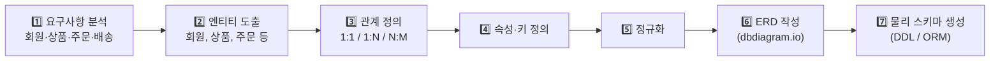
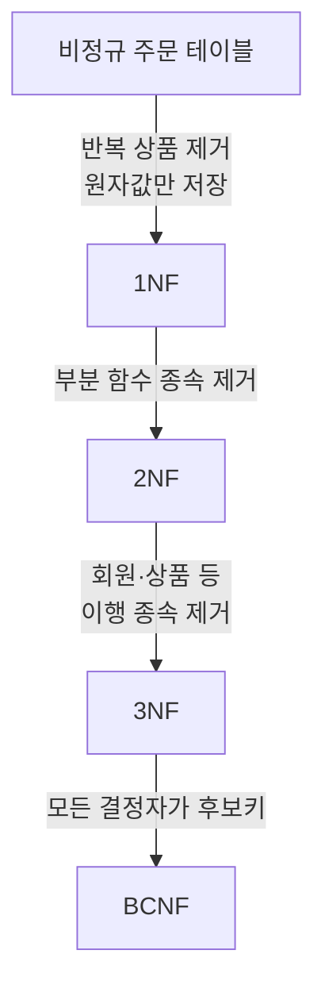
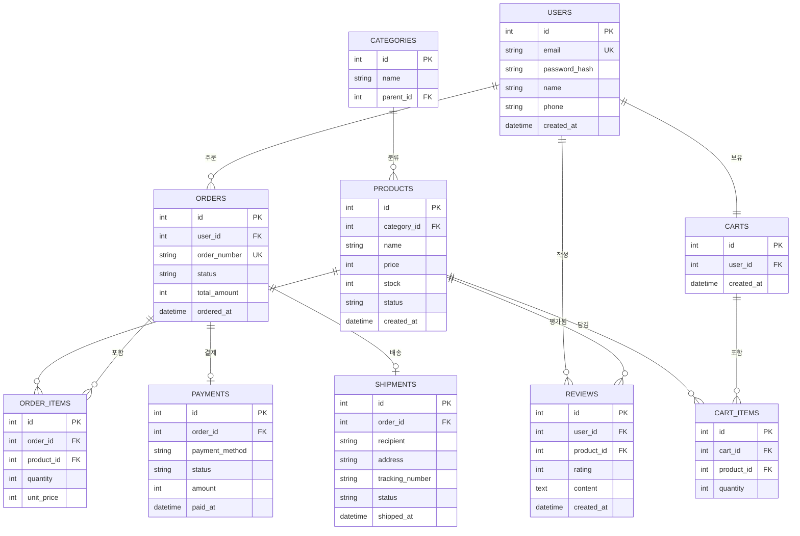
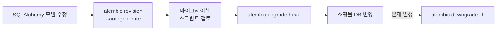
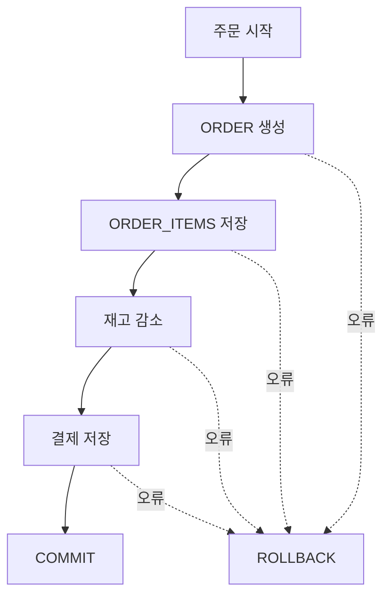
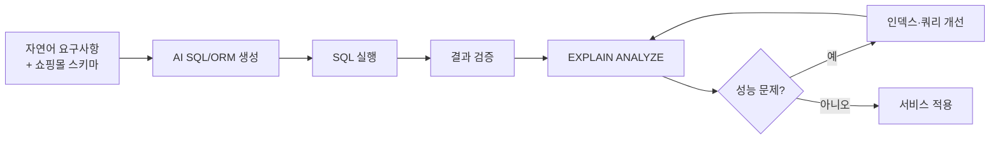
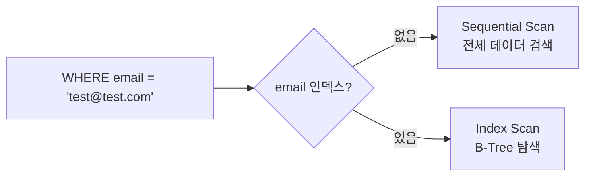
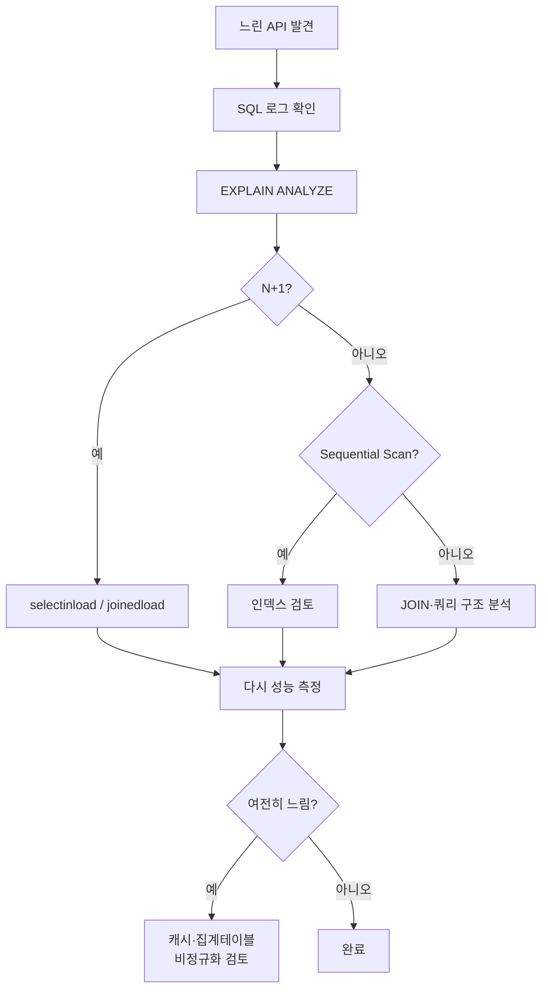
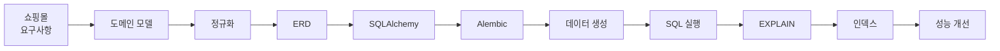

# 쇼핑몰 도메인 모델링
> **회원–상품–장바구니–주문–결제–배송** 흐름이 자연스럽게 연결되므로, RDB 관계와 ORM을 학습하기에 더 적합합니다.   
> 아래처럼 기존 형식과 구조를 유지하면서 쇼핑몰 중심으로 재구성할 수 있습니다.

## 3. 서비스 도메인 모델링 & 데이터 아키텍처 (40h · 5일)

> **교과목 목표**: 쇼핑몰 서비스의 업무 흐름과 데이터 관계를 분석하여 RDB 스키마를 설계하고, SQLAlchemy ORM과 Alembic을 활용해 데이터 계층을 구현하며, 인덱스와 실행계획을 이용해 쿼리 성능을 개선할 수 있다.

**핵심 개념**: 쇼핑몰 도메인 분석 / RDB 정규화·설계 원칙 / ERD 작성(dbdiagram.io) / SQLAlchemy ORM·Alembic / AI 활용 SQL·ORM 작성 / 인덱스·성능 최적화

---

## 1. 쇼핑몰 도메인 모델링 프로세스

쇼핑몰에서는 먼저 사용자의 행동과 업무 흐름을 분석한 후 데이터로 관리해야 할 객체를 도출한다.



### 1.1 쇼핑몰 주요 업무 흐름


### 1.2 주요 엔티티 도출

| 업무    | 주요 엔티티              |
| ----- | ------------------- |
| 회원 관리 | USERS               |
| 상품 관리 | PRODUCTS            |
| 상품 분류 | CATEGORIES          |
| 장바구니  | CARTS, CART_ITEMS   |
| 주문 관리 | ORDERS, ORDER_ITEMS |
| 결제 관리 | PAYMENTS            |
| 배송 관리 | SHIPMENTS           |
| 리뷰 관리 | REVIEWS             |

> 도메인 모델링에서는 화면에 보이는 메뉴를 그대로 테이블로 만드는 것이 아니라 **실제로 관리해야 할 데이터와 데이터 간 관계**를 중심으로 엔티티를 도출한다.

---

## 2. RDB 정규화

쇼핑몰 데이터는 회원, 상품, 주문 정보가 서로 복잡하게 연결된다. 하나의 테이블에 모든 데이터를 저장하면 중복과 수정 오류가 발생하기 때문에 정규화가 필요하다.

### 2.1 비정규화된 주문 데이터 예

| 주문번호 | 회원명 | 이메일                                     | 상품1 |   상품1가격 | 상품2 | 상품2가격 | 배송지 |
| ---- | --- | --------------------------------------- | --- | ------: | --- | ----: | --- |
| 1001 | 김철수 | [kim@test.com](mailto:kim@test.com)     | 노트북 | 1200000 | 마우스 | 30000 | 서울  |
| 1002 | 김영희 | [young@test.com](mailto:young@test.com) | 키보드 |   80000 | -   |     - | 대전  |

위 구조는 다음과 같은 문제가 발생한다.

* 상품 개수가 증가하면 컬럼이 계속 추가됨
* 회원 이메일이 주문마다 중복 저장됨
* 상품 가격 변경 시 여러 주문 데이터를 수정할 위험이 있음
* 하나의 주문에 여러 상품을 안정적으로 관리하기 어려움

### 2.2 정규화 단계



### 2.3 정규화 결과 예

비정규 주문 데이터는 다음과 같이 분리할 수 있다.

```text
USERS
 └─ 회원 정보

PRODUCTS
 └─ 상품 정보

ORDERS
 └─ 주문 기본 정보

ORDER_ITEMS
 └─ 주문에 포함된 상품 정보
```

관계는 다음과 같다.

```text
USERS 1 ───── N ORDERS

ORDERS 1 ──── N ORDER_ITEMS

PRODUCTS 1 ── N ORDER_ITEMS
```

즉, `ORDER_ITEMS`가 주문과 상품 사이의 N:M 관계를 해결하는 교차 엔티티 역할을 한다.

### 2.4 정규화 vs 비정규화

| 구분     | 정규화                         | 비정규화               |
| ------ | --------------------------- | ------------------ |
| 장점     | 데이터 중복 감소, 갱신 이상 방지, 무결성 향상 | JOIN 감소, 조회 성능 향상  |
| 단점     | JOIN 증가, 조회 쿼리 복잡           | 데이터 중복, 데이터 불일치 위험 |
| 쇼핑몰 적용 | 회원·상품·주문·결제                 | 통계·추천·매출 집계 테이블    |

> 원칙: **3NF 수준까지 먼저 정규화하고 실제 성능 문제가 측정되는 경우에만 선택적으로 비정규화한다.**

예를 들어 상품별 일일 매출 통계는 매번 `ORDERS + ORDER_ITEMS + PRODUCTS`를 조회하기보다 별도의 집계 테이블로 관리할 수 있다.

---

## 3. ERD 작성 — 쇼핑몰

### 3.1 기본 쇼핑몰 ERD



### 3.2 주요 관계 해석

| 관계                     | 관계 유형  | 설명                    |
| ---------------------- | ------ | --------------------- |
| USERS → ORDERS         | 1:N    | 한 회원은 여러 번 주문할 수 있음   |
| ORDERS → ORDER_ITEMS   | 1:N    | 한 주문에 여러 상품 포함        |
| PRODUCTS → ORDER_ITEMS | 1:N    | 한 상품이 여러 주문에 포함       |
| CARTS → CART_ITEMS     | 1:N    | 장바구니에 여러 상품 포함        |
| CATEGORIES → PRODUCTS  | 1:N    | 한 카테고리에 여러 상품         |
| USERS → REVIEWS        | 1:N    | 한 회원이 여러 리뷰 작성        |
| PRODUCTS → REVIEWS     | 1:N    | 한 상품에 여러 리뷰 존재        |
| ORDERS → PAYMENTS      | 1:0..1 | 주문 후 결제가 없거나 하나 존재    |
| ORDERS → SHIPMENTS     | 1:0..1 | 결제 전에는 배송 정보가 없을 수 있음 |

### 3.3 N:M 관계

주문과 상품은 논리적으로 N:M 관계다.

```text
주문 1개 → 여러 상품

상품 1개 → 여러 주문
```

직접 N:M으로 연결하지 않고 `ORDER_ITEMS` 테이블을 사용한다.

```text
ORDERS

     1
     │
     N

ORDER_ITEMS

     N
     │
     1

PRODUCTS
```

`ORDER_ITEMS`에는 단순 FK뿐 아니라 다음 정보도 저장할 수 있다.

```text
quantity
unit_price
discount_amount
```

특히 `unit_price`를 저장하는 이유가 중요하다.

예를 들어 현재 상품 가격이

```text
노트북 → 1,500,000원
```

이어도 고객이 주문했을 당시 가격이

```text
1,300,000원
```

이었다면 주문 내역에는 **주문 당시 가격을 보존해야 한다.**

따라서 `PRODUCTS.price`와 별도로 `ORDER_ITEMS.unit_price`가 필요하다.

---

## 4. SQLAlchemy ORM & Alembic

### 4.1 ORM vs Raw SQL

| 구분     | ORM(SQLAlchemy)                 | Raw SQL               |
| ------ | ------------------------------- | --------------------- |
| 장점     | 파이썬 객체 중심 개발, 관계 표현 편리, 유지보수 용이 | 복잡한 SQL 작성과 세밀한 튜닝 가능 |
| 단점     | N+1 등 비효율 SQL 발생 가능             | SQL 문자열 관리, DB 종속성 증가 |
| 쇼핑몰 활용 | 회원·상품·주문 CRUD                   | 매출 통계, 인기상품 분석        |

일반적인 쇼핑몰 CRUD는 ORM을 사용한다.

```text
회원 등록
상품 등록
장바구니 추가
주문 생성
배송 상태 변경
리뷰 작성
```

반면 다음과 같은 분석성 쿼리는 Raw SQL이 편리할 수 있다.

```text
카테고리별 월 매출

고객별 누적 구매금액

월간 판매량 TOP 10

재구매율 분석
```

---

### 4.2 SQLAlchemy 모델 예

```python
class User(Base):
    __tablename__ = "users"

    id = Column(Integer, primary_key=True)
    email = Column(String, unique=True, nullable=False)
    name = Column(String, nullable=False)

    orders = relationship("Order", back_populates="user")


class Order(Base):
    __tablename__ = "orders"

    id = Column(Integer, primary_key=True)

    user_id = Column(
        Integer,
        ForeignKey("users.id"),
        nullable=False
    )

    status = Column(String)
    total_amount = Column(Integer)

    user = relationship("User", back_populates="orders")
    items = relationship("OrderItem", back_populates="order")
```

---

### 4.3 주문 상품 모델

```python
class OrderItem(Base):
    __tablename__ = "order_items"

    id = Column(Integer, primary_key=True)

    order_id = Column(
        Integer,
        ForeignKey("orders.id")
    )

    product_id = Column(
        Integer,
        ForeignKey("products.id")
    )

    quantity = Column(Integer)
    unit_price = Column(Integer)

    order = relationship(
        "Order",
        back_populates="items"
    )
```

---

### 4.4 Alembic 마이그레이션 워크플로우

쇼핑몰 개발 중에는 테이블 구조가 계속 변경된다.

예를 들어

```text
1차

PRODUCTS
name
price

↓

2차

stock 추가

↓

3차

status 추가

↓

4차

discount_price 추가
```

이러한 변경 이력을 Alembic으로 관리한다.



예:

```bash
alembic revision --autogenerate -m "add stock to products"
```

```bash
alembic upgrade head
```

```bash
alembic downgrade -1
```

> ⚠️ `autogenerate` 결과를 그대로 적용하지 말고 반드시 생성된 마이그레이션 코드를 확인한다.

특히

```text
컬럼명 변경
테이블명 변경
데이터 타입 변경
```

등은 의도하지 않은 데이터 삭제가 발생할 수 있다.

---

## 5. 세션·트랜잭션

쇼핑몰에서는 트랜잭션 처리가 특히 중요하다.

예를 들어 상품 주문 과정은 다음 작업이 함께 이루어진다.

```text
① 주문 생성

② 주문 상품 저장

③ 상품 재고 감소

④ 결제 정보 저장
```

중간에 하나라도 실패하면 전체 작업을 취소해야 한다.



### 5.1 세션·트랜잭션 핵심

| 개념            | 설명                         |
| ------------- | -------------------------- |
| Session       | DB 작업 단위(Unit of Work)     |
| commit        | 모든 작업을 DB에 확정              |
| rollback      | 작업 중 오류 발생 시 원상 복구         |
| transaction   | 여러 DB 작업을 하나의 논리적 작업으로 처리  |
| lazy loading  | 관계 객체를 실제 접근할 때 조회         |
| eager loading | 관계 데이터를 미리 조회              |
| selectinload  | 여러 관계 데이터를 IN 쿼리로 효율적으로 로딩 |

---

## 6. N+1 문제

쇼핑몰 ORM에서 자주 발생하는 대표적인 성능 문제가 N+1이다.

예를 들어 주문 100건을 조회한 후 각각 주문자의 정보를 조회한다고 가정한다.

```python
orders = session.query(Order).all()

for order in orders:
    print(order.user.name)
```

실제로는 다음과 같이 SQL이 실행될 수 있다.

```text
1번

SELECT * FROM orders;


100번

SELECT * FROM users WHERE id = ?;
```

결과적으로

```text
1 + 100 = 101번
```

의 SQL이 실행된다.

이를 N+1 문제라고 한다.

### 해결

```python
from sqlalchemy.orm import selectinload

orders = (
    session.query(Order)
    .options(selectinload(Order.user))
    .all()
)
```

실행 SQL은 대략 다음처럼 감소한다.

```text
SELECT * FROM orders;

SELECT *
FROM users
WHERE id IN (...);
```

즉,

```text
101번 쿼리

↓

2번 쿼리
```

로 줄일 수 있다.

---

## 7. AI 활용 쇼핑몰 쿼리 작성

생성형 AI를 이용하면 복잡한 SQL이나 SQLAlchemy 쿼리를 빠르게 작성할 수 있다.

예를 들어 AI에게 다음과 같이 요청할 수 있다.

```text
다음 쇼핑몰 스키마가 있다.

USERS
ORDERS
ORDER_ITEMS
PRODUCTS

최근 30일간 판매량이 많은 상품 TOP 10을
조회하는 PostgreSQL SQL을 작성해줘.
```

AI가 생성한 SQL을 바로 사용하는 것이 아니라 다음 절차를 거친다.



### AI에게 줄 정보

좋은 질문:

```text
PostgreSQL을 사용한다.

orders
- id
- user_id
- ordered_at

order_items
- id
- order_id
- product_id
- quantity
- unit_price

products
- id
- name

최근 30일 동안 매출액이 높은 상품 TOP 10을 조회하는
SQL을 작성해줘.
```

좋지 않은 질문:

```text
우리 쇼핑몰에서 잘 팔리는 상품 찾아줘.
```

> AI에게 **실제 스키마와 데이터 관계를 제공해야 존재하지 않는 컬럼이나 테이블을 생성하는 오류를 줄일 수 있다.**

---

## 8. 인덱스 & 성능 최적화

### 8.1 쇼핑몰 검색 예

고객 이메일로 회원 정보를 검색한다고 가정한다.

```sql
SELECT *
FROM users
WHERE email = 'test@test.com';
```



---

## 8.2 쇼핑몰에서 자주 사용하는 인덱스

```sql
CREATE INDEX idx_orders_user_id
ON orders(user_id);
```

```sql
CREATE INDEX idx_orders_ordered_at
ON orders(ordered_at);
```

```sql
CREATE INDEX idx_products_category_id
ON products(category_id);
```

```sql
CREATE INDEX idx_order_items_product_id
ON order_items(product_id);
```

---

## 8.3 복합 인덱스

쇼핑몰에서는 다음과 같은 검색이 자주 발생할 수 있다.

```sql
SELECT *
FROM orders
WHERE user_id = 100
ORDER BY ordered_at DESC;
```

이 경우 복합 인덱스를 고려할 수 있다.

```sql
CREATE INDEX idx_orders_user_date
ON orders(user_id, ordered_at DESC);
```

---

## 8.4 인덱스 장단점

| 구분       | 내용                               |
| -------- | -------------------------------- |
| 장점       | 상품 검색, 주문 조회, JOIN, 정렬 속도 향상     |
| 단점       | INSERT·UPDATE·DELETE 시 인덱스 갱신 비용 |
| 걸어야 할 곳  | PK, FK, WHERE, JOIN, ORDER BY    |
| 신중해야 할 곳 | 상태값처럼 카디널리티가 매우 낮은 컬럼            |
| 남발 문제    | 저장 공간 증가, INSERT·UPDATE 속도 저하    |

예를 들어 다음 컬럼은 인덱스 효과를 검토해야 한다.

```text
products.status

판매중
품절
판매중지
```

값 종류가 매우 적기 때문에 단독 인덱스의 효과가 제한적일 수 있다.

---

## 9. EXPLAIN을 이용한 쿼리 분석

상품 가격 검색:

```sql
SELECT *
FROM products
WHERE price BETWEEN 10000 AND 50000;
```

실행계획 확인:

```sql
EXPLAIN
SELECT *
FROM products
WHERE price BETWEEN 10000 AND 50000;
```

실제 실행시간 확인:

```sql
EXPLAIN ANALYZE
SELECT *
FROM products
WHERE price BETWEEN 10000 AND 50000;
```

확인 항목:

```text
Seq Scan

Index Scan

Rows

Cost

Actual Time

Loops
```

---

## 10. 쇼핑몰 성능 문제 진단 순서



성능 개선은 반드시 다음 순서로 진행한다.

1. 느린 API 또는 쿼리 확인
2. SQL 로그 확인
3. `EXPLAIN ANALYZE`
4. N+1 여부 확인
5. 인덱스 검토
6. JOIN 및 쿼리 개선
7. 다시 성능 측정
8. 필요한 경우 캐시·비정규화 검토

> 중요한 원칙은 **먼저 인덱스를 만드는 것이 아니라 먼저 측정하는 것**이다.

---

# 📅 일차별 강의 계획 (5일 × 8h)

|  일차 | 이론 (4h)                            | 실습 (3.5h)                                       | 회고 (0.5h) |
| :-: | ---------------------------------- | ----------------------------------------------- | --------- |
| 1일차 | 쇼핑몰 업무 흐름, 도메인 모델링, 엔티티·관계         | 회원·상품·장바구니·주문·배송 요구사항에서 엔티티 도출                  | 모델 리뷰     |
| 2일차 | 1NF~3NF·BCNF, PK·FK·관계 설계          | 비정규 주문 데이터 → 정규화 → dbdiagram.io ERD 작성          | ERD 크리틱   |
| 3일차 | SQLAlchemy 모델·Session·Relationship | USERS·PRODUCTS·ORDERS·ORDER_ITEMS ORM 구현 + CRUD | 코드 리뷰     |
| 4일차 | Alembic·트랜잭션·N+1                   | 상품 컬럼 변경 마이그레이션 3회 + 주문 트랜잭션 + N+1 해결           | 리뷰        |
| 5일차 | 인덱스·EXPLAIN·AI SQL                 | 10만 건 쇼핑몰 데이터 생성 → 주문·상품 조회 튜닝 → AI SQL 작성 및 검증 | 과제 안내     |

---

# 📝 과목 과제 & 미니 프로젝트

## 과제 1 — 쇼핑몰 ERD 설계

다음 기능을 지원하는 쇼핑몰 데이터베이스를 설계한다.

```text
회원 관리

상품 관리

카테고리 관리

장바구니

주문

결제

배송

리뷰
```

### 제출물

1. dbdiagram.io ERD
2. PK/FK 정의
3. 관계 설명
4. 정규화 과정
5. 주요 제약조건 설명

### 필수 관계

```text
1:N 관계 3개 이상

N:M 관계 1개 이상
```

---

## 과제 2 — ORM N+1 문제 분석

다음 기능을 구현한다.

```text
회원별 주문 조회

주문별 주문상품 조회

상품별 리뷰 조회
```

그중 하나에서 N+1 문제를 의도적으로 발생시킨다.

### 비교

```text
Lazy Loading

vs

selectinload
```

### 제출 결과

```text
① 실행 SQL 로그

② SQL 실행 횟수

③ 개선 전 실행시간

④ 개선 후 실행시간

⑤ 개선 결과 분석
```

---

# 🛒 미니 프로젝트 — "쇼핑몰 데이터 계층 구축"

## 프로젝트 목표

쇼핑몰 서비스에 필요한 데이터 계층을 직접 설계하고 구현한다.

---

## 요구사항

### 1. 엔티티

최소 **7개 이상의 엔티티**를 구현한다.

권장:

```text
USERS

CATEGORIES

PRODUCTS

CARTS

CART_ITEMS

ORDERS

ORDER_ITEMS

PAYMENTS

SHIPMENTS

REVIEWS
```

---

### 2. 관계

반드시 다음 관계를 포함한다.

```text
1:N 관계

N:M 관계
```

예:

```text
USERS 1:N ORDERS

ORDERS N:M PRODUCTS

ORDERS
   │
ORDER_ITEMS
   │
PRODUCTS
```

---

### 3. SQLAlchemy ORM

다음 기능을 구현한다.

```text
회원 등록

상품 등록

장바구니 상품 추가

주문 생성

주문 상품 등록

결제 등록

배송 정보 등록
```

---

### 4. Alembic

최소 **3개 이상의 마이그레이션 이력**을 작성한다.

예:

```text
V1

기본 쇼핑몰 테이블 생성

↓

V2

PRODUCTS.stock 추가

↓

V3

PRODUCTS.status 추가

↓

V4

ORDERS.delivery_request 추가
```

---

### 5. 더미 데이터

최소 **10,000건 이상** 데이터를 생성한다.

권장:

```text
회원        1,000명

상품        2,000개

주문       10,000건

주문상품   30,000건 이상

리뷰        5,000건
```

---

### 6. 성능 측정

다음 중 2개 이상을 선택한다.

```text
회원별 주문 조회

기간별 주문 조회

카테고리별 상품 조회

상품별 판매량 조회

상품별 리뷰 조회

매출 TOP 10 상품 조회
```

각 쿼리에 대해

```text
인덱스 적용 전

↓

EXPLAIN ANALYZE

↓

인덱스 적용

↓

EXPLAIN ANALYZE

↓

성능 비교
```

를 수행한다.

---

## 최종 결과물

```text
01_ERD

02_SQLAlchemy 모델

03_Alembic 마이그레이션

04_더미데이터 생성 프로그램

05_성능 분석 보고서
```

---

## 평가 기준

| 평가 항목   |      배점 | 평가 내용                   |
| ------- | ------: | ----------------------- |
| 도메인 모델링 |      25 | 회원·상품·주문·배송 관계의 타당성     |
| 정규화·ERD |      20 | PK·FK 및 1:N·N:M 설계      |
| ORM 구현  |      20 | SQLAlchemy 관계 및 CRUD 구현 |
| 마이그레이션  |      15 | Alembic 이력 관리           |
| 성능 분석   |      20 | EXPLAIN·인덱스·N+1 분석      |
| **합계**  | **100** |                         |

---

# 핵심 학습 흐름



이 과목에서 학생들이 최종적으로 이해해야 할 핵심은 단순히 SQL을 작성하는 것이 아니라,

**`쇼핑몰 업무 이해 → 데이터 구조 설계 → ORM 구현 → 스키마 변경 관리 → 데이터 증가 → 성능 문제 발견 → 측정 → 개선`**

이라는 실제 서비스 데이터 개발의 전체 흐름이다.

특히 비전공자 과정이라면 **회원 → 상품 → 장바구니 → 주문 → 주문상품 → 결제 → 배송** 순서로 하나의 주문이 생성되는 과정을 계속 연결해서 설명하면, PK·FK·1:N·N:M·트랜잭션·정규화를 별개의 이론이 아니라 하나의 쇼핑몰 흐름으로 이해시키기 좋습니다.
