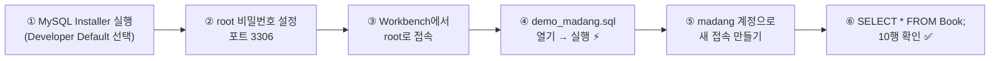
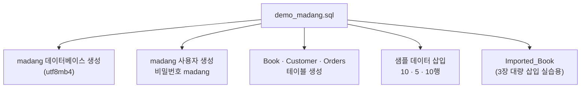

[🏠 목차](README.md) · 다음 ▶ [1장 데이터베이스 시스템](01장_데이터베이스_시스템.md)

# 00. 실습 환경 준비 — MySQL 8.0 + 마당서점 DB

> 교안은 Oracle 18c XE 기준이지만, 이 강의노트의 모든 SQL은 **MySQL 8.0** 기준으로 작성했습니다.
> 오라클과 문법이 다른 부분은 각 장에서 `🔁 Oracle 비교` 박스로 따로 표시합니다.

---

## 1. 설치할 프로그램

| 프로그램 | 용도 | 사용 장 | 다운로드 |
|---|---|---|---|
| **MySQL Community Server 8.0** | DBMS 서버 | 전체 | https://dev.mysql.com/downloads/mysql/ |
| **MySQL Workbench 8.0** | SQL 편집·실행, ER 모델링 | 전체, 6장 | https://dev.mysql.com/downloads/workbench/ |
| JDK 17 이상 | 자바 프로그램 실행 | 5장 | https://adoptium.net |
| MySQL Connector/J | 자바 ↔ MySQL 연결(JDBC 드라이버) | 5장 | https://dev.mysql.com/downloads/connector/j/ |

> 💡 Windows에서는 **MySQL Installer**(https://dev.mysql.com/downloads/installer/) 하나로 Server + Workbench + Connector/J를 한 번에 설치할 수 있습니다.



---

## 2. 설치 시 체크 포인트

| 단계 | 설정 값 | 비고 |
|---|---|---|
| Setup Type | Developer Default | Server, Workbench, Connector/J 포함 |
| Port | 3306 | 기본값 유지 |
| Authentication | Strong Password Encryption (권장) | caching_sha2_password |
| root 비밀번호 | 직접 정함 (잊지 않도록 기록) | |
| Windows Service | 자동 시작 체크 | 서비스 이름 MySQL80 |

> ⚠️ **자주 생기는 문제**
> - 한글이 깨짐 → DB를 `utf8mb4`로 생성(스크립트에 포함됨), Workbench 폰트를 한글 지원 폰트로 변경
> - `Error Code: 1175 (safe update mode)` → Workbench의 [Edit]→[Preferences]→[SQL Editor]에서 *Safe Updates* 체크 해제 후 재접속 (3장 UPDATE/DELETE 실습 시)
> - 포트 충돌 → 다른 MySQL/MariaDB가 3306을 쓰고 있는지 확인

---

## 3. 마당서점 데이터베이스 설치

1. Workbench에서 **root** 접속을 엽니다.
2. [File] → [Open SQL Script] → [sql/demo_madang.sql](sql/demo_madang.sql) 선택
3. ⚡(Execute) 버튼으로 전체 실행

스크립트가 하는 일:



4. Workbench 홈에서 ➕ 를 눌러 새 접속을 만듭니다.
   - Connection Name: `madang` / Username: `madang` / Default Schema: `madang`
5. madang 접속으로 들어가 확인합니다.

```sql
USE madang;
SELECT * FROM Book;       -- 10행
SELECT * FROM Customer;   -- 5행
SELECT * FROM Orders;     -- 10행
```

---

## 4. Oracle ↔ MySQL 주요 차이 한눈에 보기

강의 교안(Oracle)과 이 노트(MySQL)를 함께 볼 때 참고하세요.

| 항목 | Oracle (교안) | MySQL (이 노트) |
|---|---|---|
| 정수/실수 | `NUMBER`, `NUMBER(8,2)` | `INT`, `DECIMAL(8,2)` |
| 가변 문자열 | `VARCHAR2(40)` | `VARCHAR(40)` |
| 날짜 리터럴 | `TO_DATE('2020-07-01','yyyy-mm-dd')` | `'2020-07-01'` 또는 `STR_TO_DATE(...)` |
| 현재 날짜/시간 | `SYSDATE`, `SYSTIMESTAMP` | `SYSDATE()`, `NOW()`, `CURDATE()` |
| 날짜 → 문자 | `TO_CHAR(d, 'yyyy-mm-dd')` | `DATE_FORMAT(d, '%Y-%m-%d')` |
| NULL 대체 | `NVL(a, b)` | `IFNULL(a, b)` / `COALESCE(a, b)` |
| 문자열 일부 | `SUBSTR(s, 1, 2)` | `SUBSTR(s, 1, 2)` (동일) |
| 문자 수 / 바이트 수 | `LENGTH` / `LENGTHB` | `CHAR_LENGTH` / `LENGTH` |
| 상위 N행 | `WHERE ROWNUM <= 2` | `LIMIT 2` |
| 차집합 | `MINUS` | `EXCEPT` (8.0.31+) 또는 `NOT IN` / `NOT EXISTS` |
| 더미 테이블 | `SELECT ... FROM DUAL` | `FROM DUAL` 생략 가능 |
| 저장 프로그램 | PL/SQL (`DECLARE ... BEGIN ... END;` `/`) | `DELIMITER //` + `BEGIN ... END //` |
| 트랜잭션 시작 | 자동(첫 DML) | `START TRANSACTION;` (기본 autocommit=1) |
| 기본 고립 수준 | READ COMMITTED | **REPEATABLE READ** |
| 사용자 | `CREATE USER c##mdguest IDENTIFIED BY ...` | `CREATE USER 'mdguest'@'localhost' IDENTIFIED BY ...` |
| 백업 도구 | `expdp` / `impdp` | `mysqldump` / `mysql` |

---

> ➡️ 준비가 끝났으면 [1장 데이터베이스 시스템](01장_데이터베이스_시스템.md)부터 시작하세요.

[🏠 목차](README.md) · 다음 ▶ [1장 데이터베이스 시스템](01장_데이터베이스_시스템.md)
