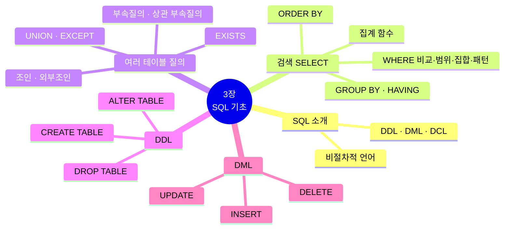
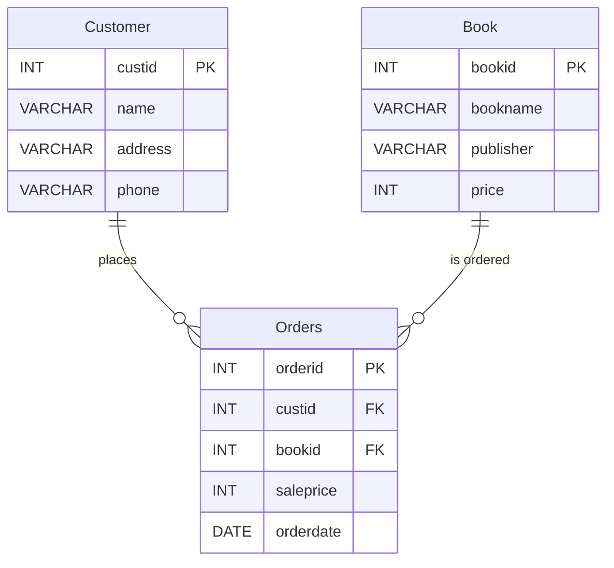
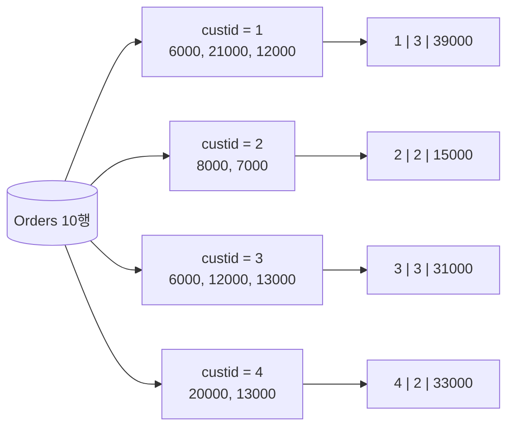
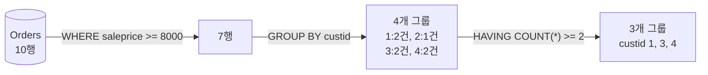
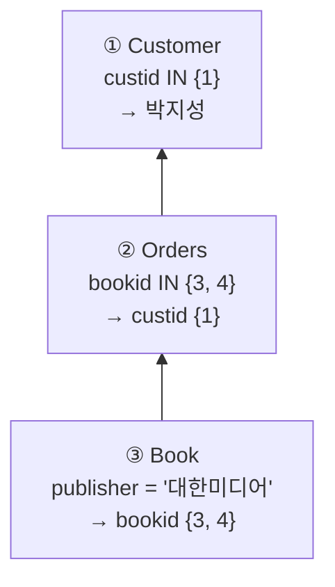
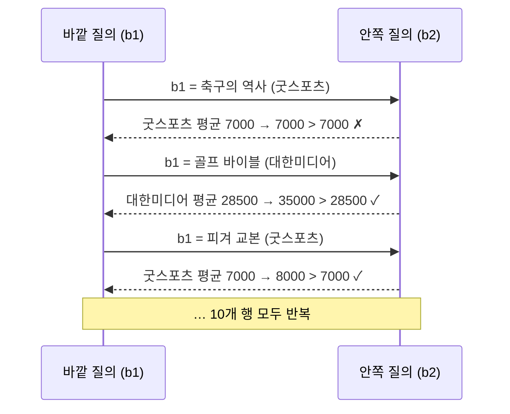
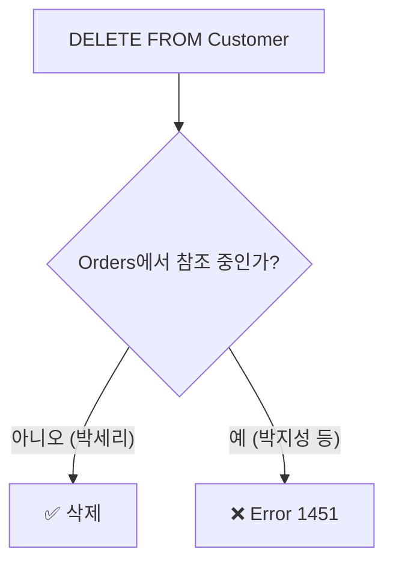

[🏠 목차](README.md) · ◀ 이전 [2장 관계 데이터 모델](02장_관계_데이터_모델.md) · 다음 ▶ [4장 SQL 고급](04장_SQL_고급.md)

# Chapter 03. SQL 기초

> **이 장의 위치**: 마당서점 DB에서 **원하는 정보를 꺼내는 법(SELECT)**, **테이블을 만드는 법(DDL)**, **데이터를 넣고 고치고 지우는 법(DML)** 을 배웁니다. 이 강의 SQL 실습의 중심이 되는 장입니다.
> 모든 SQL은 **MySQL 8.0**, `madang` 데이터베이스 기준입니다. 실습 전에 [실습 환경 준비](00장_실습환경_MySQL.md)를 마쳐 주세요.

---

## 📌 학습 목표

- [ ] SQL의 개념과 DDL·DML·DCL의 차이를 설명할 수 있다.
- [ ] `SELECT`의 `WHERE`, `ORDER BY`, 집계 함수, `GROUP BY`, `HAVING`을 사용할 수 있다.
- [ ] 조인, 부속질의, 집합 연산, `EXISTS`로 두 개 이상의 테이블을 질의할 수 있다.
- [ ] `CREATE`·`ALTER`·`DROP`으로 테이블 구조를 정의·변경할 수 있다.
- [ ] `INSERT`·`UPDATE`·`DELETE`로 데이터를 삽입·수정·삭제할 수 있다.



---

## 1. SQL 학습에 사용할 마당서점

### 1.1 마당서점 데이터 (다시 보기)



<details>
<summary><b>📋 세 테이블 데이터 펼치기</b></summary>

**Book**

| bookid | bookname | publisher | price |
|---:|---|---|---:|
| 1 | 축구의 역사 | 굿스포츠 | 7000 |
| 2 | 축구 아는 여자 | 나무수 | 13000 |
| 3 | 축구의 이해 | 대한미디어 | 22000 |
| 4 | 골프 바이블 | 대한미디어 | 35000 |
| 5 | 피겨 교본 | 굿스포츠 | 8000 |
| 6 | 역도 단계별기술 | 굿스포츠 | 6000 |
| 7 | 야구의 추억 | 이상미디어 | 20000 |
| 8 | 야구를 부탁해 | 이상미디어 | 13000 |
| 9 | 올림픽 이야기 | 삼성당 | 7500 |
| 10 | Olympic Champions | Pearson | 13000 |

**Customer**

| custid | name | address | phone |
|---:|---|---|---|
| 1 | 박지성 | 영국 맨체스터 | 000-5000-0001 |
| 2 | 김연아 | 대한민국 서울 | 000-6000-0001 |
| 3 | 장미란 | 대한민국 강원도 | 000-7000-0001 |
| 4 | 추신수 | 미국 클리블랜드 | 000-8000-0001 |
| 5 | 박세리 | 대한민국 대전 | NULL |

**Orders**

| orderid | custid | bookid | saleprice | orderdate |
|---:|---:|---:|---:|---|
| 1 | 1 | 1 | 6000 | 2020-07-01 |
| 2 | 1 | 3 | 21000 | 2020-07-03 |
| 3 | 2 | 5 | 8000 | 2020-07-03 |
| 4 | 3 | 6 | 6000 | 2020-07-04 |
| 5 | 4 | 7 | 20000 | 2020-07-05 |
| 6 | 1 | 2 | 12000 | 2020-07-07 |
| 7 | 4 | 8 | 13000 | 2020-07-07 |
| 8 | 3 | 10 | 12000 | 2020-07-08 |
| 9 | 2 | 10 | 7000 | 2020-07-09 |
| 10 | 3 | 8 | 13000 | 2020-07-10 |

</details>

### 1.2 누가 어떤 정보를 원하는가?

| 사용자 | 원하는 정보 (예) | 사용할 SQL |
|---|---|---|
| 🛒 고객 | 도서 검색, 내 구매 내역 | `SELECT ... WHERE` |
| 🧑‍💼 운영자 | 고객 목록, 기간별 주문, 재고 | `SELECT`, `INSERT`, `UPDATE`, `DELETE` |
| 📈 경영자 | 총매출, 고객별 매출, 인기 도서 | 집계 함수, `GROUP BY`, 조인 |

---

## 2. SQL 소개

> **SQL(Structured Query Language)**: 관계 데이터베이스에서 데이터를 정의·조작·제어하는 **표준 언어**. 원하는 결과(*what*)만 기술하는 **비절차적 언어**입니다.

| 분류 | 명령어 | 역할 |
|---|---|---|
| **DDL** 데이터 정의어 | `CREATE` `ALTER` `DROP` | 테이블·관계의 **구조** 생성·변경·삭제 |
| **DML** 데이터 조작어 | `SELECT` `INSERT` `UPDATE` `DELETE` | 데이터 검색·삽입·수정·삭제 (`SELECT`는 특별히 **질의어**) |
| **DCL** 데이터 제어어 | `GRANT` `REVOKE` | 데이터 사용 **권한** 관리 (→ 9장) |

**SQL vs 관계대수** — "김연아 고객의 전화번호를 찾으시오"

| 관계대수 | SQL |
|---|---|
| π<sub>phone</sub>(σ<sub>name='김연아'</sub>(Customer)) | `SELECT phone FROM Customer WHERE name = '김연아';` |

> 💡 SQL 키워드는 대소문자를 구분하지 않습니다. 이 노트에서는 키워드를 대문자로 씁니다. 단, MySQL은 운영체제에 따라 **테이블 이름**의 대소문자를 구분할 수 있으므로(리눅스) 테이블 이름은 만든 그대로(`Book`) 쓰는 습관을 들이세요.

---

## 3. 데이터 조작어 — 검색 (SELECT)

### 3.1 SELECT 문의 구성

```sql
SELECT   [ALL | DISTINCT] 속성이름(들)      -- ⑤ 어떤 열을 보여줄까
FROM     테이블이름(들)                     -- ① 어디서
[WHERE   검색조건(들)]                      -- ② 어떤 행을
[GROUP BY 속성이름]                         -- ③ 무엇으로 묶어서
[HAVING  검색조건(들)]                      -- ④ 묶은 그룹 중 어떤 것을
[ORDER BY 속성이름 [ASC | DESC]]            -- ⑥ 어떤 순서로
[LIMIT   n];                                -- ⑦ 몇 개만 (MySQL)
```


> 💡 **작성 순서**(SELECT → FROM → …)와 **실행 순서**(FROM → WHERE → …)가 다릅니다. 그래서 `SELECT`에서 만든 별칭은 `WHERE`에서 쓸 수 없지만 `ORDER BY`에서는 쓸 수 있습니다.

### 3.2 기본 검색

> **질의 3-1** 모든 도서의 이름과 가격을 검색하시오.

```sql
SELECT bookname, price
FROM   Book;
```

> **질의 3-2** 모든 도서의 도서번호, 도서이름, 출판사, 가격을 검색하시오.

```sql
SELECT bookid, bookname, publisher, price FROM Book;
SELECT * FROM Book;          -- *  = 모든 열
```

> **질의 3-3** 도서 테이블에 있는 모든 출판사를 검색하시오.

```sql
SELECT publisher FROM Book;            -- 10행 (중복 포함, ALL이 기본)
SELECT DISTINCT publisher FROM Book;   -- 6행 (중복 제거)
```

| publisher (DISTINCT) |
|---|
| 굿스포츠 |
| 나무수 |
| 대한미디어 |
| 이상미디어 |
| 삼성당 |
| Pearson |

### 3.3 조건 검색 — WHERE

| 술어 | 연산자 | 예 |
|---|---|---|
| 비교 | `=` `<>` `<` `<=` `>` `>=` | `price < 20000` |
| 범위 | `BETWEEN a AND b` | `price BETWEEN 10000 AND 20000` |
| 집합 | `IN`, `NOT IN` | `publisher IN ('굿스포츠', '대한미디어')` |
| 패턴 | `LIKE` (`%` 여러 문자, `_` 한 문자) | `bookname LIKE '축구%'` |
| NULL | `IS NULL`, `IS NOT NULL` | `phone IS NULL` |
| 복합 | `AND`, `OR`, `NOT` | `price >= 20000 AND bookname LIKE '%축구%'` |

#### 비교 · 범위

> **질의 3-4** 가격이 20,000원 미만인 도서를 검색하시오.

```sql
SELECT * FROM Book WHERE price < 20000;
```

→ 1, 2, 5, 6, 8, 9, 10번 도서 (7행)

> **질의 3-5** 가격이 10,000원 이상 20,000원 이하인 도서를 검색하시오.

```sql
SELECT * FROM Book WHERE price BETWEEN 10000 AND 20000;
SELECT * FROM Book WHERE price >= 10000 AND price <= 20000;   -- 같은 의미
```

| bookid | bookname | publisher | price |
|---:|---|---|---:|
| 2 | 축구 아는 여자 | 나무수 | 13000 |
| 7 | 야구의 추억 | 이상미디어 | 20000 |
| 8 | 야구를 부탁해 | 이상미디어 | 13000 |
| 10 | Olympic Champions | Pearson | 13000 |

#### 집합

> **질의 3-6** 출판사가 '굿스포츠' 혹은 '대한미디어'인 도서를 검색하시오.

```sql
SELECT * FROM Book WHERE publisher IN ('굿스포츠', '대한미디어');      -- 1, 3, 4, 5, 6번
SELECT * FROM Book WHERE publisher NOT IN ('굿스포츠', '대한미디어');  -- 2, 7, 8, 9, 10번
```

#### 패턴 — LIKE

| 패턴 | 의미 | 예 |
|---|---|---|
| `'축구%'` | '축구'로 시작 | 축구의 역사, 축구 아는 여자, 축구의 이해 |
| `'%축구%'` | '축구'를 포함 | 위와 같음 |
| `'_구%'` | 두 번째 글자가 '구' | 축구…, 야구… |
| `'%의%'` | '의'를 포함 | 축구의 역사, 축구의 이해, 야구의 추억 |

> **질의 3-7** '축구의 역사'를 출간한 출판사를 검색하시오.

```sql
SELECT bookname, publisher FROM Book WHERE bookname LIKE '축구의 역사';   -- = '축구의 역사' 와 같음
```

> **질의 3-8** 도서이름에 '축구'가 포함된 출판사를 검색하시오.

```sql
SELECT bookname, publisher FROM Book WHERE bookname LIKE '%축구%';
```

| bookname | publisher |
|---|---|
| 축구의 역사 | 굿스포츠 |
| 축구 아는 여자 | 나무수 |
| 축구의 이해 | 대한미디어 |

> **질의 3-9** 도서이름의 왼쪽 두 번째 위치에 '구'라는 문자열을 갖는 도서를 검색하시오.

```sql
SELECT * FROM Book WHERE bookname LIKE '_구%';
```

→ 축구의 역사, 축구 아는 여자, 축구의 이해, 야구의 추억, 야구를 부탁해 (5행)

> 💡 MySQL(utf8mb4)에서 `_`는 **한 글자**를 뜻하므로 한글도 한 글자로 처리됩니다.

#### 복합 조건

> **질의 3-10** 축구에 관한 도서 중 가격이 20,000원 이상인 도서를 검색하시오.

```sql
SELECT * FROM Book WHERE bookname LIKE '%축구%' AND price >= 20000;   -- 3 축구의 이해 22000
```

> **질의 3-11** 출판사가 '굿스포츠' 혹은 '대한미디어'인 도서를 검색하시오.

```sql
SELECT * FROM Book WHERE publisher = '굿스포츠' OR publisher = '대한미디어';   -- 질의 3-6과 같음
```

### 3.4 정렬 — ORDER BY

> **질의 3-12** 도서를 이름순으로 검색하시오.

```sql
SELECT * FROM Book ORDER BY bookname;          -- 기본은 ASC(오름차순)
```

> **질의 3-13** 도서를 가격순으로 검색하고, 가격이 같으면 이름순으로 검색하시오.

```sql
SELECT * FROM Book ORDER BY price, bookname;
```

| bookid | bookname | price |
|---:|---|---:|
| 6 | 역도 단계별기술 | 6000 |
| 1 | 축구의 역사 | 7000 |
| 9 | 올림픽 이야기 | 7500 |
| 5 | 피겨 교본 | 8000 |
| 10 | Olympic Champions | 13000 |
| 8 | 야구를 부탁해 | 13000 |
| 2 | 축구 아는 여자 | 13000 |
| 7 | 야구의 추억 | 20000 |
| 3 | 축구의 이해 | 22000 |
| 4 | 골프 바이블 | 35000 |

> **질의 3-14** 도서를 가격의 내림차순으로 검색하시오. 가격이 같다면 출판사의 오름차순으로 검색하시오.

```sql
SELECT * FROM Book ORDER BY price DESC, publisher ASC;
```


### 3.5 집계 함수

| 함수 | 의미 | NULL 처리 |
|---|---|---|
| `SUM(열)` | 합계 | NULL 제외 |
| `AVG(열)` | 평균 | NULL 제외 |
| `COUNT(열)` / `COUNT(*)` | 개수 / 행 수 | `COUNT(열)`은 NULL 제외, `COUNT(*)`는 모든 행 |
| `MAX(열)` / `MIN(열)` | 최댓값 / 최솟값 | NULL 제외 |

> **질의 3-15** 고객이 주문한 도서의 총판매액을 구하시오.

```sql
SELECT SUM(saleprice) AS 총매출
FROM   Orders;
```

| 총매출 |
|---:|
| 118000 |

> 💡 `AS 별칭`으로 결과 열 이름을 붙입니다. 공백이 있으면 `AS "총 매출"` 또는 `` AS `총 매출` `` 처럼 따옴표로 감쌉니다.

> **질의 3-16** 2번 김연아 고객이 주문한 도서의 총판매액을 구하시오.

```sql
SELECT SUM(saleprice) AS 총매출 FROM Orders WHERE custid = 2;   -- 15000
```

> **질의 3-17** 고객이 주문한 도서의 총판매액, 평균값, 최저가, 최고가를 구하시오.

```sql
SELECT SUM(saleprice) AS Total,
       AVG(saleprice) AS Average,
       MIN(saleprice) AS Minimum,
       MAX(saleprice) AS Maximum
FROM   Orders;
```

| Total | Average | Minimum | Maximum |
|---:|---:|---:|---:|
| 118000 | 11800.0000 | 6000 | 21000 |

> **질의 3-18** 마당서점의 도서 판매 건수를 구하시오.

```sql
SELECT COUNT(*) FROM Orders;          -- 10
```

```sql
-- COUNT(*) 와 COUNT(열)의 차이 (phone이 NULL인 박세리)
SELECT COUNT(*), COUNT(phone) FROM Customer;      -- 5, 4
SELECT COUNT(DISTINCT publisher) FROM Book;       -- 6
```

### 3.6 GROUP BY와 HAVING

> **질의 3-19** 고객별로 주문한 도서의 총수량과 총판매액을 구하시오.

```sql
SELECT custid, COUNT(*) AS 도서수량, SUM(saleprice) AS 총액
FROM   Orders
GROUP  BY custid;
```



| custid | 도서수량 | 총액 |
|---:|---:|---:|
| 1 | 3 | 39000 |
| 2 | 2 | 15000 |
| 3 | 3 | 31000 |
| 4 | 2 | 33000 |

> **질의 3-20** 가격이 8,000원 이상인 도서를 구매한 고객에 대하여 고객별 주문 도서의 총수량을 구하시오. 단, 두 권 이상 구매한 고객만 구한다.

```sql
SELECT   custid, COUNT(*) AS 도서수량
FROM     Orders
WHERE    saleprice >= 8000          -- 행 조건 (그룹 전)
GROUP BY custid
HAVING   COUNT(*) >= 2;             -- 그룹 조건 (그룹 후)
```

| custid | 도서수량 |
|---:|---:|
| 1 | 2 |
| 3 | 2 |
| 4 | 2 |



**GROUP BY / HAVING 주의사항**

| 규칙 | 설명 |
|---|---|
| `SELECT`에는 **GROUP BY 속성**과 **집계 함수**만 | `SELECT custid, bookid ... GROUP BY custid` ❌ |
| `WHERE` vs `HAVING` | WHERE는 **행**, HAVING은 **그룹**에 조건. HAVING에는 집계 함수 사용 가능 |
| `HAVING`은 `GROUP BY`와 함께 | 단독 사용은 피함 |

> 🔁 **MySQL 주의**: MySQL 8.0은 기본으로 `ONLY_FULL_GROUP_BY` 모드라 표준과 같이 동작합니다. 이 모드를 끄면 GROUP BY에 없는 열도 SELECT할 수 있지만 **어느 행의 값인지 보장되지 않으므로** 끄지 마세요.

#### 🧪 연습 1 — 단일 테이블 질의

<details>
<summary>(1) 도서번호가 1인 도서의 이름</summary>

```sql
SELECT bookname FROM Book WHERE bookid = 1;     -- 축구의 역사
```
</details>

<details>
<summary>(2) 가격이 20,000원 이상인 도서의 이름</summary>

```sql
SELECT bookname FROM Book WHERE price >= 20000; -- 축구의 이해, 골프 바이블, 야구의 추억
```
</details>

<details>
<summary>(3) 박지성의 총 구매액 (박지성의 고객번호는 1)</summary>

```sql
SELECT SUM(saleprice) FROM Orders WHERE custid = 1;   -- 39000
```
</details>

<details>
<summary>(4) 박지성이 구매한 도서의 수</summary>

```sql
SELECT COUNT(*) FROM Orders WHERE custid = 1;         -- 3
```
</details>

<details>
<summary>(5) 마당서점 도서의 총 개수 / 출판사의 총 개수</summary>

```sql
SELECT COUNT(*) FROM Book;                   -- 10
SELECT COUNT(DISTINCT publisher) FROM Book;  -- 6
```
</details>

<details>
<summary>(6) 2020년 7월 4일 ~ 7월 7일 사이에 주문받은 도서의 주문번호 / 그 외의 주문번호</summary>

```sql
SELECT orderid FROM Orders WHERE orderdate BETWEEN '2020-07-04' AND '2020-07-07';      -- 4, 5, 6, 7
SELECT orderid FROM Orders WHERE orderdate NOT BETWEEN '2020-07-04' AND '2020-07-07';  -- 1, 2, 3, 8, 9, 10
```
</details>

<details>
<summary>(7) 성이 '김'씨인 고객 / 성이 '김'씨이고 이름이 '아'로 끝나는 고객의 이름과 주소</summary>

```sql
SELECT name, address FROM Customer WHERE name LIKE '김%';    -- 김연아
SELECT name, address FROM Customer WHERE name LIKE '김%아';  -- 김연아
```
</details>

---

## 4. 두 개 이상 테이블에서 SQL 질의

### 4.1 조인

조건 없이 두 테이블을 FROM에 쓰면 **카티전 프로덕트**(5 × 10 = 50행)가 됩니다.

```sql
SELECT COUNT(*) FROM Customer, Orders;    -- 50
```

조인 조건을 주면 **의미 있는 행만** 남습니다.


> **질의 3-21** 고객과 고객의 주문에 관한 데이터를 모두 보이시오.

```sql
-- 방법 1: WHERE 절 조인 (교재 방식)
SELECT *
FROM   Customer, Orders
WHERE  Customer.custid = Orders.custid;

-- 방법 2: ANSI 표준 JOIN ... ON (권장)
SELECT *
FROM   Customer
JOIN   Orders ON Customer.custid = Orders.custid;
```

> **질의 3-22** 고객과 고객의 주문에 관한 데이터를 고객번호 순으로 정렬하여 보이시오.

```sql
SELECT *
FROM   Customer c JOIN Orders o ON c.custid = o.custid
ORDER  BY c.custid;
```

> 💡 `Customer c`처럼 테이블에 **별칭**(투플 변수)을 붙이면 SQL이 짧아집니다.

> **질의 3-23** 고객의 이름과 고객이 주문한 도서의 판매가격을 검색하시오.

```sql
SELECT c.name, o.saleprice
FROM   Customer c JOIN Orders o ON c.custid = o.custid;
```

> **질의 3-24** 고객별로 주문한 모든 도서의 총판매액을 구하고, 고객별로 정렬하시오.

```sql
SELECT   c.name, SUM(o.saleprice) AS 총판매액
FROM     Customer c JOIN Orders o ON c.custid = o.custid
GROUP BY c.name
ORDER BY c.name;
```

| name | 총판매액 |
|---|---:|
| 김연아 | 15000 |
| 박지성 | 39000 |
| 장미란 | 31000 |
| 추신수 | 33000 |

#### 세 개 테이블 조인

"고객의 이름과 고객이 주문한 도서의 이름"은 **Customer – Orders – Book** 세 테이블이 필요합니다.


> **질의 3-25** 고객의 이름과 고객이 주문한 도서의 이름을 구하시오.

```sql
SELECT c.name, b.bookname
FROM   Customer c
JOIN   Orders   o ON c.custid = o.custid
JOIN   Book     b ON o.bookid = b.bookid;
```

| name | bookname |
|---|---|
| 박지성 | 축구의 역사 |
| 박지성 | 축구의 이해 |
| 김연아 | 피겨 교본 |
| 장미란 | 역도 단계별기술 |
| 추신수 | 야구의 추억 |
| 박지성 | 축구 아는 여자 |
| 추신수 | 야구를 부탁해 |
| 장미란 | Olympic Champions |
| 김연아 | Olympic Champions |
| 장미란 | 야구를 부탁해 |

> **질의 3-26** 가격이 20,000원인 도서를 주문한 고객의 이름과 도서의 이름을 구하시오.

```sql
SELECT c.name, b.bookname
FROM   Customer c
JOIN   Orders   o ON c.custid = o.custid
JOIN   Book     b ON o.bookid = b.bookid
WHERE  b.price = 20000;            -- 추신수, 야구의 추억
```

#### 외부조인

> **질의 3-27** 도서를 구매하지 않은 고객을 포함하여 고객의 이름과 고객이 주문한 도서의 판매가격을 구하시오.

```sql
SELECT c.name, o.saleprice
FROM   Customer c
LEFT OUTER JOIN Orders o ON c.custid = o.custid;
```

→ 10건 + **박세리 | NULL** (총 11행)

| 조인 종류 | 문법 | 결과 |
|---|---|---|
| 내부 조인 | `A JOIN B ON …` (= `INNER JOIN`) | 양쪽 모두 짝이 있는 행만 |
| 왼쪽 외부조인 | `A LEFT [OUTER] JOIN B ON …` | A의 모든 행 + B 없으면 NULL |
| 오른쪽 외부조인 | `A RIGHT [OUTER] JOIN B ON …` | B의 모든 행 + A 없으면 NULL |
| 완전 외부조인 | MySQL 미지원 | LEFT ∪ RIGHT 로 대체 |

> 🔁 **Oracle 비교**: 교안의 오라클 전용 외부조인 표기 `WHERE c.custid = o.custid(+)` 는 MySQL에서 쓸 수 없습니다. 표준 `LEFT OUTER JOIN`을 사용하세요.

### 4.2 부속질의 (subquery)

> **부속질의**: SQL 문 안에 들어 있는 또 다른 `SELECT` 문. 괄호 `( )` 로 감싸며 **안쪽이 먼저** 실행됩니다(비상관 부속질의).

> **질의 3-28** 가장 비싼 도서의 이름을 보이시오.

```sql
SELECT bookname
FROM   Book
WHERE  price = (SELECT MAX(price) FROM Book);    -- 골프 바이블
```


> **질의 3-29** 도서를 구매한 적이 있는 고객의 이름을 검색하시오.

```sql
SELECT name
FROM   Customer
WHERE  custid IN (SELECT custid FROM Orders);     -- 박지성, 김연아, 장미란, 추신수
```

> **질의 3-30** 대한미디어에서 출판한 도서를 구매한 고객의 이름을 보이시오.

```sql
SELECT name
FROM   Customer
WHERE  custid IN (SELECT custid
                  FROM   Orders
                  WHERE  bookid IN (SELECT bookid
                                    FROM   Book
                                    WHERE  publisher = '대한미디어'));
```



#### 상관 부속질의 (correlated subquery)

바깥 질의의 **각 행마다** 안쪽 질의가 그 행의 값을 사용해 다시 계산됩니다.

> **질의 3-31** 출판사별로 출판사의 평균 도서 가격보다 비싼 도서를 구하시오.

```sql
SELECT b1.bookname
FROM   Book b1
WHERE  b1.price > (SELECT AVG(b2.price)
                   FROM   Book b2
                   WHERE  b2.publisher = b1.publisher);
```

| 출판사 | 평균 가격 | 평균보다 비싼 도서 |
|---|---:|---|
| 굿스포츠 | 7,000 | 피겨 교본 (8,000) |
| 대한미디어 | 28,500 | 골프 바이블 (35,000) |
| 이상미디어 | 16,500 | 야구의 추억 (20,000) |
| 나무수 · 삼성당 · Pearson | (각 1권) | 없음 |



### 4.3 집합 연산

| 연산 | MySQL | 비고 |
|---|---|---|
| 합집합 | `UNION` / `UNION ALL` | `UNION`은 중복 제거, `UNION ALL`은 유지 |
| 차집합 | `EXCEPT` | MySQL **8.0.31+** (Oracle은 `MINUS`) |
| 교집합 | `INTERSECT` | MySQL **8.0.31+** |

> **질의 3-32** 도서를 주문하지 않은 고객의 이름을 보이시오.

```sql
-- 방법 1: EXCEPT (MySQL 8.0.31 이상)
SELECT name FROM Customer
EXCEPT
SELECT name FROM Customer WHERE custid IN (SELECT custid FROM Orders);

-- 방법 2: NOT IN (모든 버전)
SELECT name FROM Customer
WHERE  custid NOT IN (SELECT custid FROM Orders);
```

→ 박세리

> 🔁 **Oracle 비교**: 교안의 `MINUS` 는 MySQL에서 오류가 납니다. `EXCEPT` 또는 `NOT IN` / `NOT EXISTS` 를 사용하세요.

### 4.4 EXISTS

> `EXISTS (부속질의)` : 부속질의 결과가 **한 행이라도 있으면 참**. `NOT EXISTS`는 하나도 없을 때 참.

> **질의 3-33** 주문이 있는 고객의 이름과 주소를 보이시오.

```sql
SELECT name, address
FROM   Customer c
WHERE  EXISTS (SELECT *
               FROM   Orders o
               WHERE  o.custid = c.custid);
```

| name | address |
|---|---|
| 박지성 | 영국 맨체스터 |
| 김연아 | 대한민국 서울 |
| 장미란 | 대한민국 강원도 |
| 추신수 | 미국 클리블랜드 |

> 💡 `IN`은 부속질의 **값 목록**과 비교하고, `EXISTS`는 **존재 여부**만 봅니다. `NOT IN`은 부속질의 결과에 NULL이 섞이면 결과가 비어 버리는 함정이 있어, 실무에서는 `NOT EXISTS`가 더 안전합니다.

#### 🧪 연습 2 — 여러 테이블 질의

<details>
<summary>(1) 박지성이 구매한 도서의 출판사 수</summary>

```sql
SELECT COUNT(DISTINCT b.publisher)
FROM   Customer c JOIN Orders o ON c.custid = o.custid
                  JOIN Book   b ON o.bookid = b.bookid
WHERE  c.name = '박지성';                          -- 3
```
</details>

<details>
<summary>(2) 박지성이 구매한 도서의 이름, 가격, 정가와 판매가격의 차이</summary>

```sql
SELECT b.bookname, b.price, b.price - o.saleprice AS 차이
FROM   Customer c JOIN Orders o ON c.custid = o.custid
                  JOIN Book   b ON o.bookid = b.bookid
WHERE  c.name = '박지성';
```

| bookname | price | 차이 |
|---|---:|---:|
| 축구의 역사 | 7000 | 1000 |
| 축구의 이해 | 22000 | 1000 |
| 축구 아는 여자 | 13000 | 1000 |
</details>

<details>
<summary>(3) 박지성이 구매하지 않은 도서의 이름</summary>

```sql
SELECT bookname
FROM   Book
WHERE  bookid NOT IN (SELECT o.bookid
                      FROM   Orders o JOIN Customer c ON o.custid = c.custid
                      WHERE  c.name = '박지성');
```
→ 골프 바이블, 피겨 교본, 역도 단계별기술, 야구의 추억, 야구를 부탁해, 올림픽 이야기, Olympic Champions
</details>

<details>
<summary>(4) 주문하지 않은 고객의 이름 (부속질의 사용)</summary>

```sql
SELECT name FROM Customer WHERE custid NOT IN (SELECT custid FROM Orders);   -- 박세리
```
</details>

<details>
<summary>(5) 주문 금액의 총액과 주문의 평균 금액</summary>

```sql
SELECT SUM(saleprice), AVG(saleprice) FROM Orders;    -- 118000, 11800.0000
```
</details>

<details>
<summary>(6) 고객의 이름과 고객별 구매액</summary>

```sql
SELECT c.name, SUM(o.saleprice)
FROM   Customer c JOIN Orders o ON c.custid = o.custid
GROUP  BY c.name;
```
</details>

<details>
<summary>(7) 도서의 가격(Book)과 판매가격(Orders)의 차이가 가장 많은 주문</summary>

```sql
SELECT o.orderid, b.price - o.saleprice AS 차이
FROM   Orders o JOIN Book b ON o.bookid = b.bookid
WHERE  b.price - o.saleprice = (SELECT MAX(b2.price - o2.saleprice)
                                FROM   Orders o2 JOIN Book b2 ON o2.bookid = b2.bookid);
```
→ 주문번호 9 (Olympic Champions 13000원을 7000원에 판매, 차이 6000)
</details>

<details>
<summary>(8) 도서의 판매액 평균보다 자신의 구매액 평균이 더 높은 고객의 이름</summary>

```sql
SELECT   c.name, AVG(o.saleprice) AS 평균구매액
FROM     Customer c JOIN Orders o ON c.custid = o.custid
GROUP BY c.name
HAVING   AVG(o.saleprice) > (SELECT AVG(saleprice) FROM Orders);
```
→ 박지성(13000), 추신수(16500) — 전체 평균 11800
</details>

<details>
<summary>(심화 1) 박지성이 구매한 도서의 출판사와 같은 출판사에서 도서를 구매한 고객의 이름</summary>

```sql
SELECT DISTINCT c.name
FROM   Customer c JOIN Orders o ON c.custid = o.custid
                  JOIN Book   b ON o.bookid = b.bookid
WHERE  c.name <> '박지성'
AND    b.publisher IN (SELECT b2.publisher
                       FROM   Customer c2 JOIN Orders o2 ON c2.custid = o2.custid
                                          JOIN Book   b2 ON o2.bookid = b2.bookid
                       WHERE  c2.name = '박지성');
```
→ 김연아, 장미란 (굿스포츠 도서 구매)
</details>

<details>
<summary>(심화 2) 두 개 이상의 서로 다른 출판사에서 도서를 구매한 고객의 이름</summary>

```sql
SELECT   c.name
FROM     Customer c JOIN Orders o ON c.custid = o.custid
                    JOIN Book   b ON o.bookid = b.bookid
GROUP BY c.name
HAVING   COUNT(DISTINCT b.publisher) >= 2;
```
→ 김연아, 박지성, 장미란
</details>

<details>
<summary>(심화 3) 전체 고객의 30% 이상이 구매한 도서</summary>

```sql
SELECT   b.bookname
FROM     Book b JOIN Orders o ON b.bookid = o.bookid
GROUP BY b.bookid, b.bookname
HAVING   COUNT(DISTINCT o.custid) >= 0.3 * (SELECT COUNT(*) FROM Customer);
```
→ 야구를 부탁해, Olympic Champions (각 2명 ≥ 1.5명)
</details>

---

## 5. 데이터 정의어 (DDL)

### 5.1 CREATE TABLE

```sql
CREATE TABLE 테이블이름
( 속성이름 데이터타입 [NOT NULL] [UNIQUE] [DEFAULT 기본값] [CHECK 체크조건],
  ...
  [PRIMARY KEY (속성이름(들))],
  [FOREIGN KEY (속성이름) REFERENCES 테이블이름(속성이름)
        [ON DELETE {CASCADE | SET NULL | RESTRICT | NO ACTION}]
        [ON UPDATE {CASCADE | SET NULL | RESTRICT | NO ACTION}]]
);
```

**MySQL 주요 데이터 타입**

| 분류 | 타입 | 설명 | Oracle 대응 |
|---|---|---|---|
| 정수 | `INT`, `BIGINT`, `SMALLINT` | 4 / 8 / 2바이트 정수 | `NUMBER` |
| 고정 소수 | `DECIMAL(p, s)` | 금액 등 정확한 값 | `NUMBER(p, s)` |
| 문자 | `CHAR(n)`, `VARCHAR(n)` | 고정 / 가변 길이(n은 **글자 수**) | `CHAR`, `VARCHAR2` |
| 긴 문자 | `TEXT` | 긴 문자열 | `CLOB` |
| 날짜 | `DATE`, `DATETIME`, `TIMESTAMP` | 날짜 / 날짜+시간 | `DATE`, `TIMESTAMP` |

> **질의 3-34** 다음 속성을 가진 NewBook 테이블을 생성하시오. 정수형은 `INT`, 문자형은 `VARCHAR`를 사용한다.
> bookid(INT), bookname(VARCHAR(20)), publisher(VARCHAR(20)), price(INT)

```sql
CREATE TABLE NewBook (
    bookid    INT,
    bookname  VARCHAR(20),
    publisher VARCHAR(20),
    price     INT
);

-- 기본키 지정 방법 1 (열 옆에)
--   bookid INT PRIMARY KEY,
-- 기본키 지정 방법 2 (맨 끝에)
--   PRIMARY KEY (bookid)
-- 복합키 (bookid 없이 bookname + publisher 가 키라면)
--   PRIMARY KEY (bookname, publisher)
```

**제약조건을 더 추가한 NewBook**

```sql
DROP TABLE IF EXISTS NewBook;
CREATE TABLE NewBook (
    bookname  VARCHAR(20) NOT NULL,
    publisher VARCHAR(20) UNIQUE,
    price     INT DEFAULT 10000 CHECK (price > 1000),
    PRIMARY KEY (bookname, publisher)
);
```

> **질의 3-35** NewCustomer 테이블을 생성하시오. custid(INT, 기본키), name(VARCHAR(40)), address(VARCHAR(40)), phone(VARCHAR(30))

```sql
CREATE TABLE NewCustomer (
    custid  INT PRIMARY KEY,
    name    VARCHAR(40),
    address VARCHAR(40),
    phone   VARCHAR(30)
);
```

> **질의 3-36** NewOrders 테이블을 생성하시오. orderid(INT, 기본키), custid(INT, NOT NULL, 외래키 NewCustomer.custid, 연쇄삭제), bookid(INT, NOT NULL), saleprice(INT), orderdate(DATE)

```sql
CREATE TABLE NewOrders (
    orderid   INT,
    custid    INT NOT NULL,
    bookid    INT NOT NULL,
    saleprice INT,
    orderdate DATE,
    PRIMARY KEY (orderid),
    FOREIGN KEY (custid) REFERENCES NewCustomer(custid) ON DELETE CASCADE
);
```

> ⚠️ 외래키를 만들려면 **참조되는 테이블(부모)이 먼저 존재**하고, 참조되는 열이 그 테이블의 **기본키(또는 UNIQUE)** 여야 합니다.

### 5.2 ALTER TABLE

```sql
ALTER TABLE 테이블이름
    [ADD 속성이름 데이터타입]
    [DROP COLUMN 속성이름]
    [MODIFY 속성이름 데이터타입 [제약]]       -- MySQL / Oracle
    [ADD 제약조건]
    [DROP PRIMARY KEY | DROP FOREIGN KEY 제약이름];
```

실습을 위해 NewBook을 질의 3-34 형태로 다시 만듭니다.

```sql
DROP TABLE IF EXISTS NewBook;
CREATE TABLE NewBook (bookid INT, bookname VARCHAR(20), publisher VARCHAR(20), price INT);
```

| 질의 | 요구 | MySQL |
|---|---|---|
| 3-37 | isbn 속성(VARCHAR(13)) 추가 | `ALTER TABLE NewBook ADD isbn VARCHAR(13);` |
| 3-38 | isbn 데이터 타입을 INT로 변경 | `ALTER TABLE NewBook MODIFY isbn INT;` |
| 3-39 | isbn 속성 삭제 | `ALTER TABLE NewBook DROP COLUMN isbn;` |
| 3-40 | bookid에 NOT NULL 적용 | `ALTER TABLE NewBook MODIFY bookid INT NOT NULL;` |
| 3-41 | bookid를 기본키로 변경 | `ALTER TABLE NewBook ADD PRIMARY KEY (bookid);` |

```sql
DESC NewBook;    -- 변경 결과 확인
```

> 💡 MySQL의 `MODIFY`는 열 정의를 **통째로 다시** 씁니다. `MODIFY bookid INT NOT NULL`처럼 타입까지 함께 적어야 합니다. 열 이름을 바꿀 때는 `RENAME COLUMN 옛이름 TO 새이름` 을 씁니다.

### 5.3 DROP TABLE

> `DROP TABLE`은 **구조와 데이터를 모두** 삭제합니다. (데이터만 지우려면 `DELETE` 또는 `TRUNCATE`)

> **질의 3-42** NewBook 테이블을 삭제하시오.

```sql
DROP TABLE NewBook;
```

> **질의 3-43** NewCustomer 테이블을 삭제하시오. 삭제가 거절되면 원인을 파악하고 관련 테이블을 같이 삭제하시오.

```sql
DROP TABLE NewCustomer;
-- Error 3730: Cannot drop table 'NewCustomer' referenced by a foreign key constraint 'NewOrders_ibfk_1' on table 'NewOrders'.

DROP TABLE NewOrders;     -- ① 자식(참조하는 쪽) 먼저
DROP TABLE NewCustomer;   -- ② 부모 삭제
```


| 명령 | 삭제 대상 | 되돌리기(ROLLBACK) |
|---|---|---|
| `DELETE FROM t` | 데이터(행) — WHERE로 일부 가능 | 가능 (DML) |
| `TRUNCATE TABLE t` | 데이터 전체 (구조는 남음) | 불가 (DDL) |
| `DROP TABLE t` | 구조 + 데이터 | 불가 (DDL) |

---

## 6. 데이터 조작어 — 삽입, 수정, 삭제

> ⚠️ **Workbench Safe Update 모드**: 기본키가 아닌 열로 `UPDATE`/`DELETE`하면 `Error 1175`가 날 수 있습니다. 실습 전에 아래를 실행하거나 [Preferences]에서 해제하세요.
> ```sql
> SET SQL_SAFE_UPDATES = 0;
> ```

### 6.1 INSERT

```sql
INSERT INTO 테이블이름 [(속성리스트)] VALUES (값리스트);
INSERT INTO 테이블이름 [(속성리스트)] SELECT ...;        -- 대량 삽입
```

> **질의 3-44** Book 테이블에 새로운 도서 '스포츠 의학'을 삽입하시오. 한솔의학서적에서 출간했으며 가격은 90,000원이다.

```sql
INSERT INTO Book (bookid, bookname, publisher, price)
VALUES (11, '스포츠 의학', '한솔의학서적', 90000);

-- 또는 (모든 속성을 순서대로 넣으면 속성 리스트 생략 가능 — 위와 둘 중 하나만 실행)
-- INSERT INTO Book VALUES (11, '스포츠 의학', '한솔의학서적', 90000);
```

> **질의 3-45** '스포츠 의학'을 삽입하시오. 가격은 미정이다.

```sql
INSERT INTO Book (bookid, bookname, publisher)
VALUES (14, '스포츠 의학', '한솔의학서적');        -- price는 NULL
```

> **질의 3-46** 수입도서 목록(Imported_Book)을 Book 테이블에 모두 삽입하시오. (대량 삽입, bulk insert)

```sql
INSERT INTO Book (bookid, bookname, price, publisher)
SELECT bookid, bookname, price, publisher
FROM   Imported_Book;                              -- 21, 22번 도서 2행 삽입
```

```sql
-- MySQL은 VALUES 뒤에 여러 행을 한 번에 넣을 수도 있다
INSERT INTO Book VALUES (31, '테니스 입문', '굿스포츠', 9000),
                        (32, '수영 교본',   '굿스포츠', 9500);
```

### 6.2 UPDATE

```sql
UPDATE 테이블이름
SET    속성이름1 = 값1 [, 속성이름2 = 값2, ...]
[WHERE 검색조건];
```

> **질의 3-47** 고객번호가 5인 고객의 주소를 '대한민국 부산'으로 변경하시오.

```sql
UPDATE Customer
SET    address = '대한민국 부산'
WHERE  custid = 5;
```

> **질의 3-48** 박세리 고객의 주소를 김연아 고객의 주소로 변경하시오.

```sql
-- 교재(Oracle) 방식 — MySQL에서는 Error 1093 발생!
UPDATE Customer
SET    address = (SELECT address FROM Customer WHERE name = '김연아')
WHERE  name = '박세리';
-- Error 1093: You can't specify target table 'Customer' for update in FROM clause

-- MySQL 방식 ① 파생 테이블로 한 번 감싸기
UPDATE Customer
SET    address = (SELECT address
                  FROM   (SELECT address FROM Customer WHERE name = '김연아') AS t)
WHERE  name = '박세리';

-- MySQL 방식 ② 자기 조인 UPDATE
UPDATE Customer c1
JOIN   Customer c2 ON c2.name = '김연아'
SET    c1.address = c2.address
WHERE  c1.name = '박세리';
```

> 🔁 **MySQL 주의**: MySQL은 `UPDATE`/`DELETE` 대상 테이블을 같은 문장의 부속질의에서 직접 읽을 수 없습니다(Error 1093). 파생 테이블로 감싸거나 조인을 사용하세요.

> ⚠️ `WHERE`를 빼먹으면 **모든 행**이 바뀝니다. UPDATE/DELETE 전에 같은 WHERE로 `SELECT`를 먼저 실행해 대상 행을 확인하는 습관을 들이세요.

### 6.3 DELETE

```sql
DELETE FROM 테이블이름 [WHERE 검색조건];
```

> **질의 3-49** 고객번호가 5인 고객을 삭제하시오.

```sql
DELETE FROM Customer WHERE custid = 5;    -- 박세리는 주문이 없으므로 삭제 성공
```

> **질의 3-50** 모든 고객을 삭제하시오.

```sql
DELETE FROM Customer;
-- Error 1451: Cannot delete or update a parent row: a foreign key constraint fails
-- → Orders가 Customer를 참조하고 있어 삭제 불가 (참조 무결성)
```



> 💡 실습으로 데이터가 바뀌었다면 [sql/demo_madang.sql](sql/demo_madang.sql)을 다시 실행해 처음 상태로 되돌리세요.

#### 🧪 연습 3 — DML

<details>
<summary>(1) 새로운 도서('스포츠 세계', '대한미디어', 10000원)가 입고되었다. 삽입이 안 될 경우 필요한 데이터가 더 있는지 찾아보자.</summary>

```sql
INSERT INTO Book (bookname, publisher, price) VALUES ('스포츠 세계', '대한미디어', 10000);
-- Error 1364: Field 'bookid' doesn't have a default value  → 기본키 bookid가 필요

INSERT INTO Book VALUES (12, '스포츠 세계', '대한미디어', 10000);
```
> 💡 bookid를 `INT AUTO_INCREMENT PRIMARY KEY`로 만들었다면 생략해도 자동으로 번호가 매겨집니다.
</details>

<details>
<summary>(2) '삼성당'에서 출판한 도서를 삭제하시오.</summary>

```sql
DELETE FROM Book WHERE publisher = '삼성당';   -- 9번 '올림픽 이야기' (주문 없음) → 삭제 성공
```
</details>

<details>
<summary>(3) '이상미디어'에서 출판한 도서를 삭제하시오. 삭제가 안 되면 원인을 생각해 보자.</summary>

```sql
DELETE FROM Book WHERE publisher = '이상미디어';
-- Error 1451 → 7, 8번 도서를 Orders(주문 5, 7, 10)가 참조하고 있음 (참조 무결성)
```
</details>

<details>
<summary>(4) 출판사 '대한미디어'가 '대한출판사'로 이름을 바꾸었다.</summary>

```sql
UPDATE Book SET publisher = '대한출판사' WHERE publisher = '대한미디어';   -- 2행 변경
```
</details>

---

## 📝 핵심 요약

| # | 키워드 | 한 줄 정리 |
|:---:|---|---|
| 1 | SQL | DDL(CREATE·ALTER·DROP) · DML(SELECT·INSERT·UPDATE·DELETE) · DCL(GRANT·REVOKE) |
| 2 | 실행 순서 | FROM → WHERE → GROUP BY → HAVING → SELECT → ORDER BY → LIMIT |
| 3 | WHERE | 비교, BETWEEN, IN, LIKE(% _), IS NULL, AND/OR/NOT |
| 4 | 집계 함수 | SUM·AVG·COUNT·MAX·MIN — NULL은 제외(COUNT(*) 예외) |
| 5 | GROUP BY / HAVING | 그룹별 집계 / 그룹에 대한 조건 |
| 6 | 조인 | `JOIN ... ON` 으로 의미 있는 행만, 외부조인은 짝 없는 행도 NULL로 |
| 7 | 부속질의 | 안쪽 먼저(비상관) / 바깥 행마다 반복(상관) |
| 8 | 집합 연산 | UNION, EXCEPT·INTERSECT(8.0.31+), Oracle MINUS → MySQL EXCEPT |
| 9 | EXISTS | 존재 여부로 판단, NOT EXISTS가 NOT IN보다 NULL에 안전 |
| 10 | DDL | CREATE(제약조건 포함) · ALTER(ADD/MODIFY/DROP) · DROP(자식 먼저) |
| 11 | DML | INSERT(대량 삽입) · UPDATE(Error 1093 주의) · DELETE(참조 무결성) |

---

## ✅ 확인 문제

<details>
<summary>1. WHERE 절과 HAVING 절의 차이를 설명하시오.</summary>

WHERE는 그룹을 만들기 **전 개별 행**에 대한 조건, HAVING은 GROUP BY로 만든 **그룹**에 대한 조건입니다. HAVING에는 집계 함수를 쓸 수 있습니다.
</details>

<details>
<summary>2. 다음 SQL의 오류를 찾으시오. <code>SELECT custid, bookid, SUM(saleprice) FROM Orders GROUP BY custid;</code></summary>

`bookid`는 GROUP BY에 없고 집계 함수도 아니므로 SELECT에 올 수 없습니다(Error 1055, ONLY_FULL_GROUP_BY).
</details>

<details>
<summary>3. [SQL] 출판사별 도서 수와 평균 가격을 구하되, 도서가 2권 이상인 출판사만 평균 가격 내림차순으로 보이시오.</summary>

```sql
SELECT   publisher, COUNT(*) AS 도서수, AVG(price) AS 평균가격
FROM     Book
GROUP BY publisher
HAVING   COUNT(*) >= 2
ORDER BY 평균가격 DESC;
```
→ 대한미디어(2, 28500), 이상미디어(2, 16500), 굿스포츠(3, 7000)
</details>

<details>
<summary>4. [SQL] 2020년 7월 7일 이후 주문한 고객의 이름과 도서이름을 주문일 순으로 보이시오.</summary>

```sql
SELECT o.orderdate, c.name, b.bookname
FROM   Orders o JOIN Customer c ON o.custid = c.custid
                JOIN Book     b ON o.bookid = b.bookid
WHERE  o.orderdate >= '2020-07-07'
ORDER  BY o.orderdate;
```
→ 주문 6~10 (5행)
</details>

<details>
<summary>5. MySQL에서 <code>UPDATE Customer SET address = (SELECT address FROM Customer WHERE custid = 2) WHERE custid = 5;</code>를 실행하면 어떻게 되는가?</summary>

Error 1093 — 수정 대상 테이블을 같은 문장의 부속질의에서 읽을 수 없습니다. `(SELECT address FROM (SELECT ...) AS t)` 처럼 파생 테이블로 감싸거나 자기 조인 UPDATE를 사용합니다.
</details>

---

> 📚 출처: 한빛아카데미 「데이터베이스 개론과 실습」 3장 강의교안을 참고하여 요약·재구성. 모든 그림은 Mermaid로 새로 작성, SQL은 MySQL 8.0 기준.

[🏠 목차](README.md) · ◀ 이전 [2장 관계 데이터 모델](02장_관계_데이터_모델.md) · 다음 ▶ [4장 SQL 고급](04장_SQL_고급.md)
