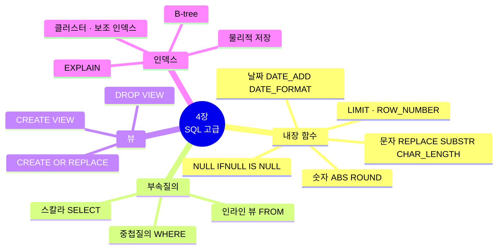
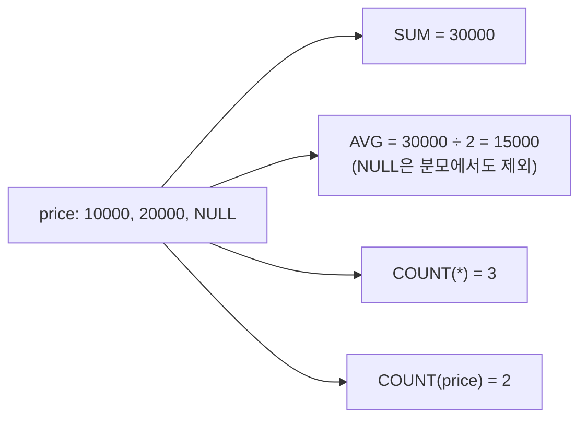
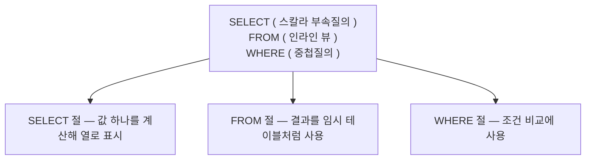
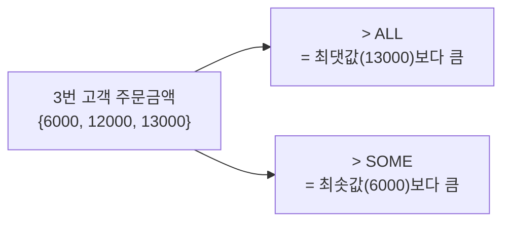
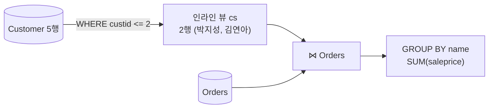
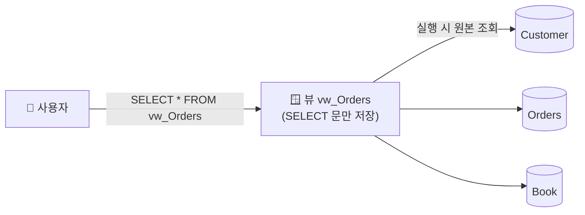
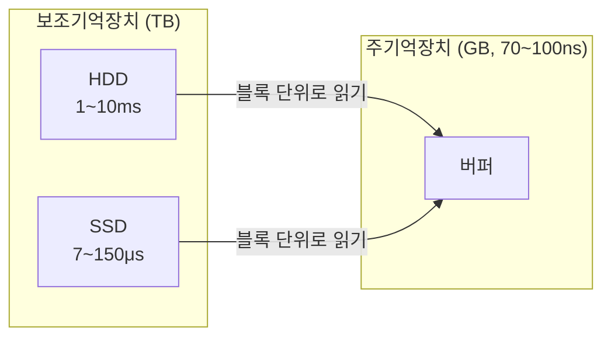
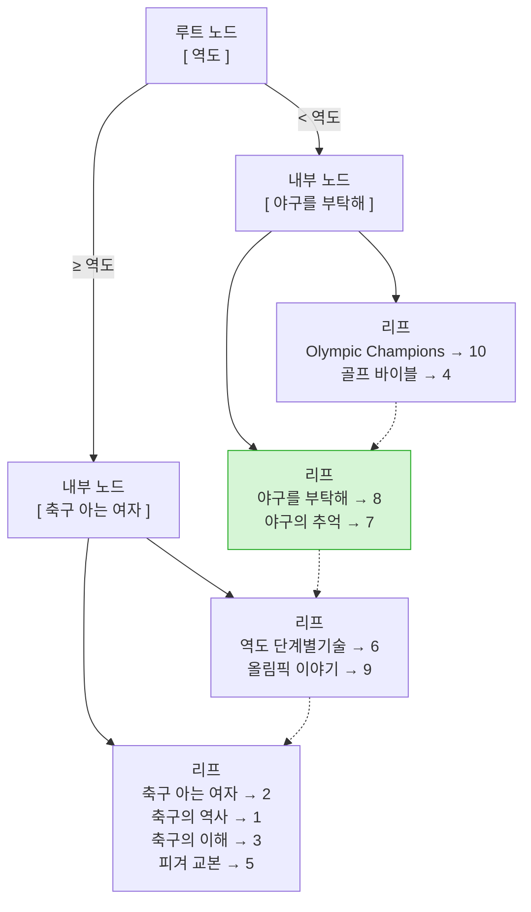

[🏠 목차](README.md) · ◀ 이전 [3장 SQL 기초](03장_SQL_기초.md) · 다음 ▶ [5장 데이터베이스 프로그래밍](05장_데이터베이스_프로그래밍.md)

# Chapter 04. SQL 고급

> **이 장의 위치**: 3장에서 배운 SELECT를 더 강력하게 만드는 도구들 — **내장 함수**, **부속질의의 세 가지 형태**, 자주 쓰는 질의를 저장해 두는 **뷰**, 검색을 빠르게 하는 **인덱스**를 마당서점 DB로 실습합니다. (MySQL 8.0 기준)

---

## 📌 학습 목표

- [ ] 숫자·문자·날짜 내장 함수와 NULL 처리 함수를 사용할 수 있다.
- [ ] 중첩질의(WHERE), 스칼라 부속질의(SELECT), 인라인 뷰(FROM)를 구분해 작성할 수 있다.
- [ ] 뷰를 생성·수정·삭제하고 장단점을 설명할 수 있다.
- [ ] 인덱스와 B-tree의 원리를 이해하고 인덱스를 생성·삭제하며 실행 계획을 확인할 수 있다.



---

## 1. 내장 함수

### 1.1 SQL 내장 함수란?


| 구분 | 설명 | 예 |
|---|---|---|
| **내장 함수** (built-in) | DBMS가 제공 | `ABS`, `ROUND`, `SUBSTR`, `NOW` |
| **사용자 정의 함수** (user-defined) | 사용자가 직접 작성 | → [5장](05장_데이터베이스_프로그래밍.md) `fnc_Interest` |

> 💡 MySQL에서는 테이블 없이 `SELECT ABS(-78);` 처럼 바로 함수를 실행할 수 있습니다. (오라클은 `FROM DUAL` 필요, MySQL은 생략 가능)

### 1.2 숫자 함수

| 함수 | 의미 | 예 | 결과 |
|---|---|---|---|
| `ABS(x)` | 절댓값 | `ABS(-78)` | 78 |
| `CEIL(x)` | 올림(x 이상 최소 정수) | `CEIL(4.1)` | 5 |
| `FLOOR(x)` | 내림(x 이하 최대 정수) | `FLOOR(4.9)` | 4 |
| `ROUND(x, n)` | n자리로 반올림 (n<0이면 정수부) | `ROUND(4.875, 1)` | 4.9 |
| `TRUNCATE(x, n)` | n자리에서 버림 | `TRUNCATE(4.875, 1)` | 4.8 |
| `MOD(m, n)` | 나머지 | `MOD(11, 4)` | 3 |
| `POWER(x, y)` | x의 y제곱 | `POWER(3, 2)` | 9 |
| `SQRT(x)` | 제곱근 | `SQRT(9)` | 3 |
| `SIGN(x)` | 부호(-1, 0, 1) | `SIGN(-15)` | -1 |

> **질의 4-1** -78과 +78의 절댓값을 구하시오.

```sql
SELECT ABS(-78), ABS(+78);        -- 78, 78
```

> **질의 4-2** 4.875를 소수 첫째 자리까지 반올림한 값을 구하시오.

```sql
SELECT ROUND(4.875, 1);           -- 4.9
```

> **질의 4-3** 고객별 평균 주문 금액을 백 원 단위로 반올림한 값을 구하시오.

```sql
SELECT   custid AS 고객번호, ROUND(AVG(saleprice), -2) AS 평균금액
FROM     Orders
GROUP BY custid;
```

| 고객번호 | 평균금액 | (실제 평균) |
|---:|---:|---:|
| 1 | 13000 | 13000 |
| 2 | 7500 | 7500 |
| 3 | 10300 | 10333.33 |
| 4 | 16500 | 16500 |

### 1.3 문자 함수

| 함수 | 의미 | 예 | 결과 |
|---|---|---|---|
| `CONCAT(s1, s2, …)` | 문자열 연결 | `CONCAT('마당', '서점')` | 마당서점 |
| `LOWER(s)` / `UPPER(s)` | 소문자 / 대문자 | `UPPER('madang')` | MADANG |
| `LPAD(s, n, c)` / `RPAD` | 왼쪽/오른쪽을 c로 채워 길이 n | `LPAD('7', 3, '0')` | 007 |
| `REPLACE(s, a, b)` | a를 b로 치환 | `REPLACE('JACK', 'J', 'BL')` | BLACK |
| `SUBSTR(s, m, n)` | m번째부터 n글자 | `SUBSTR('ABCDEFG', 3, 4)` | CDEF |
| `TRIM(s)` | 앞뒤 공백 제거 | `TRIM('  A  ')` | A |
| `INSTR(s, sub)` | sub의 위치 | `INSTR('MADANG', 'DA')` | 3 |
| `CHAR_LENGTH(s)` | **글자 수** | `CHAR_LENGTH('마당')` | 2 |
| `LENGTH(s)` | **바이트 수** | `LENGTH('마당')` | 6 (utf8mb4 한글 3바이트) |

> **질의 4-4** 도서제목에 '야구'가 포함된 도서를 '농구'로 변경한 후 도서 목록을 보이시오.

```sql
SELECT bookid, REPLACE(bookname, '야구', '농구') AS bookname, publisher, price
FROM   Book;
```

→ 7번 *농구의 추억*, 8번 *농구를 부탁해* 로 **보여지기만** 하고, 실제 데이터는 바뀌지 않습니다.

> **질의 4-5** 굿스포츠에서 출판한 도서의 제목과 제목의 글자 수, 바이트 수를 확인하시오.

```sql
SELECT bookname AS 제목,
       CHAR_LENGTH(bookname) AS 문자수,
       LENGTH(bookname)      AS 바이트수
FROM   Book
WHERE  publisher = '굿스포츠';
```

| 제목 | 문자수 | 바이트수 |
|---|---:|---:|
| 축구의 역사 | 6 | 16 |
| 피겨 교본 | 5 | 13 |
| 역도 단계별기술 | 8 | 22 |

> 🔁 **Oracle 비교**: 오라클의 `LENGTH`는 **글자 수**, `LENGTHB`가 바이트 수입니다. MySQL은 `CHAR_LENGTH`가 글자 수, `LENGTH`가 **바이트 수**이니 헷갈리지 마세요.

> **질의 4-6** 마당서점의 고객 중에서 같은 성(姓)을 가진 사람이 몇 명이나 되는지 성별 인원수를 구하시오.

```sql
SELECT   SUBSTR(name, 1, 1) AS 성, COUNT(*) AS 인원
FROM     Customer
GROUP BY SUBSTR(name, 1, 1);
```

| 성 | 인원 |
|---|---:|
| 박 | 2 |
| 김 | 1 |
| 장 | 1 |
| 추 | 1 |

### 1.4 날짜·시간 함수

| 함수 | 의미 | 예 | 결과 |
|---|---|---|---|
| `NOW()` / `SYSDATE()` | 현재 날짜와 시간 | `NOW()` | 2026-10-03 14:20:05 |
| `CURDATE()` | 현재 날짜 | `CURDATE()` | 2026-10-03 |
| `DATE_ADD(d, INTERVAL n unit)` | 날짜 더하기 | `DATE_ADD('2020-07-01', INTERVAL 10 DAY)` | 2020-07-11 |
| `DATE_SUB(d, INTERVAL n unit)` | 날짜 빼기 | `DATE_SUB('2020-07-01', INTERVAL 1 MONTH)` | 2020-06-01 |
| `DATEDIFF(d1, d2)` | 두 날짜 사이 일수 | `DATEDIFF('2020-07-10', '2020-07-01')` | 9 |
| `LAST_DAY(d)` | 그 달의 마지막 날 | `LAST_DAY('2020-07-07')` | 2020-07-31 |
| `DATE_FORMAT(d, fmt)` | 날짜 → 문자 | `DATE_FORMAT(d, '%Y-%m-%d')` | 2020-07-01 |
| `STR_TO_DATE(s, fmt)` | 문자 → 날짜 | `STR_TO_DATE('01/07/2020', '%d/%m/%Y')` | 2020-07-01 |

| 포맷 | 의미 | 포맷 | 의미 |
|---|---|---|---|
| `%Y` | 연도 4자리 | `%H` / `%i` / `%s` | 시(24) / 분 / 초 |
| `%m` | 월 2자리 | `%W` | 요일 이름 (Tuesday) |
| `%d` | 일 2자리 | `%a` | 요일 약어 (Tue) |

> **질의 4-7** 마당서점은 주문일로부터 10일 후 매출을 확정한다. 각 주문의 확정일자를 구하시오.

```sql
SELECT orderid AS 주문번호, orderdate AS 주문일,
       DATE_ADD(orderdate, INTERVAL 10 DAY) AS 확정일
FROM   Orders;
```

| 주문번호 | 주문일 | 확정일 |
|---:|---|---|
| 1 | 2020-07-01 | 2020-07-11 |
| 2 | 2020-07-03 | 2020-07-13 |
| … | … | … |
| 10 | 2020-07-10 | 2020-07-20 |

> **질의 4-8** 2020년 7월 7일에 주문받은 도서의 주문번호, 주문일, 고객번호, 도서번호를 모두 보이시오. 단, 주문일은 'yyyy-mm-dd 요일' 형태로 표시한다.

```sql
SET lc_time_names = 'ko_KR';        -- 요일을 한글로 (세션 설정)

SELECT orderid AS 주문번호,
       DATE_FORMAT(orderdate, '%Y-%m-%d %W') AS 주문일,
       custid AS 고객번호, bookid AS 도서번호
FROM   Orders
WHERE  orderdate = STR_TO_DATE('20200707', '%Y%m%d');
```

| 주문번호 | 주문일 | 고객번호 | 도서번호 |
|---:|---|---:|---:|
| 6 | 2020-07-07 화요일 | 1 | 2 |
| 7 | 2020-07-07 화요일 | 4 | 8 |

> **질의 4-9** DBMS 서버에 설정된 현재 날짜와 시간을 확인하시오.

```sql
SELECT SYSDATE(), NOW(), CURDATE(), CURRENT_TIMESTAMP(6),
       DATE_FORMAT(NOW(), '%Y/%m/%d %a %H:%i');
```

> 🔁 **Oracle ↔ MySQL 날짜 함수**
>
> | Oracle | MySQL |
> |---|---|
> | `orderdate + 10` | `DATE_ADD(orderdate, INTERVAL 10 DAY)` |
> | `TO_DATE('20200707', 'yyyymmdd')` | `STR_TO_DATE('20200707', '%Y%m%d')` |
> | `TO_CHAR(orderdate, 'yyyy-mm-dd dy')` | `DATE_FORMAT(orderdate, '%Y-%m-%d %a')` |
> | `ADD_MONTHS(d, 1)` | `DATE_ADD(d, INTERVAL 1 MONTH)` |
> | `SYSDATE`, `SYSTIMESTAMP` | `SYSDATE()`, `NOW(6)` |

### 1.5 NULL 값 처리

> **NULL** = 아직 지정되지 않은 값. `0`, `''`(빈 문자), `' '`(공백)과 **다른** 특별한 값입니다.

| 규칙 | 예 |
|---|---|
| NULL은 비교 연산자(`=`, `<>`)로 비교할 수 없다 | `phone = NULL` → 항상 결과 없음 |
| NULL과의 연산 결과는 NULL | `NULL + 100` → NULL |
| 집계 함수는 NULL을 **제외**하고 계산 | `AVG`는 NULL 행을 분모에서도 뺌 |
| 해당 행이 하나도 없으면 `SUM`·`AVG`는 NULL, `COUNT`는 0 | |

```sql
-- 실습용 Mybook 테이블
CREATE TABLE Mybook (bookid INT PRIMARY KEY, price INT);
INSERT INTO Mybook VALUES (1, 10000), (2, 20000), (3, NULL);

SELECT price + 100 FROM Mybook WHERE bookid = 3;           -- NULL
SELECT SUM(price), AVG(price), COUNT(*), COUNT(price)
FROM   Mybook;                                             -- 30000, 15000.0000, 3, 2
SELECT SUM(price), AVG(price), COUNT(*)
FROM   Mybook WHERE bookid >= 4;                           -- NULL, NULL, 0
```



**NULL 확인 — `IS NULL`, `IS NOT NULL`**

```sql
SELECT * FROM Customer WHERE phone = NULL;     -- ❌ 결과 없음
SELECT * FROM Customer WHERE phone IS NULL;    -- ✅ 박세리
```

**NULL 대체 — `IFNULL`, `COALESCE`**

> **질의 4-10** 이름, 전화번호가 포함된 고객 목록을 보이시오. 단, 전화번호가 없는 고객은 '연락처없음'으로 표시한다.

```sql
SELECT name AS 이름, IFNULL(phone, '연락처없음') AS 전화번호
FROM   Customer;
-- COALESCE(phone, '연락처없음') 도 같은 결과 (표준 SQL, 여러 인자 가능)
```

| 이름 | 전화번호 |
|---|---|
| 박지성 | 000-5000-0001 |
| 김연아 | 000-6000-0001 |
| 장미란 | 000-7000-0001 |
| 추신수 | 000-8000-0001 |
| 박세리 | 연락처없음 |

> 🔁 **Oracle 비교**: 오라클의 `NVL(phone, '연락처없음')` → MySQL `IFNULL` 또는 `COALESCE`

### 1.6 행 번호와 상위 N개 — LIMIT, ROW_NUMBER()

오라클의 `ROWNUM`은 MySQL에 없습니다. 대신 `LIMIT`과 윈도 함수 `ROW_NUMBER()`를 씁니다.

> **질의 4-11** 고객 목록에서 고객번호, 이름, 전화번호를 앞의 두 명만 보이시오.

```sql
SELECT custid, name, phone
FROM   Customer
LIMIT  2;                          -- 박지성, 김연아

-- 순번을 함께 표시
SELECT ROW_NUMBER() OVER (ORDER BY custid) AS 순번, custid, name, phone
FROM   Customer
LIMIT  2;
```

| 문법 | 의미 |
|---|---|
| `LIMIT n` | 앞에서 n행 |
| `LIMIT m, n` / `LIMIT n OFFSET m` | m행 건너뛰고 n행 (페이지 처리) |
| `ROW_NUMBER() OVER (ORDER BY …)` | 정렬 기준대로 1, 2, 3 … 번호 부여 |

```sql
-- 가장 비싼 도서 3권
SELECT bookname, price FROM Book ORDER BY price DESC LIMIT 3;
-- 골프 바이블 35000, 축구의 이해 22000, 야구의 추억 20000
```

> 🔁 **Oracle 함정 비교**: 오라클 `ROWNUM`은 **ORDER BY 전에** 번호가 붙어서 `WHERE ROWNUM <= 3 ORDER BY price DESC`가 "비싼 3권"이 아닙니다. MySQL `LIMIT`은 **ORDER BY 후에** 적용되므로 의도대로 동작합니다.

#### 🧪 연습 1 — 함수 결과 맞히기

<details>
<summary>다음 MySQL 함수의 결과를 적으시오.</summary>

| 식 | 결과 |
|---|---|
| `ABS(-15)` | 15 |
| `CEIL(15.7)` | 16 |
| `FLOOR(15.7)` | 15 |
| `LOG(10, 100)` | 2 |
| `MOD(11, 4)` | 3 |
| `POWER(3, 2)` | 9 |
| `ROUND(15.7)` | 16 |
| `SIGN(-15)` | -1 |
| `TRUNCATE(15.7, 0)` | 15 |
| `CHAR(67 USING utf8mb4)` | C |
| `CONCAT('HAPPY ', 'Birthday')` | HAPPY Birthday |
| `LOWER('Birthday')` | birthday |
| `LPAD('Page 1', 15, '*.')` | \*.\*.\*.\*.\*Page 1 |
| `RPAD('Page 1', 15, '*.')` | Page 1\*.\*.\*.\*.\* |
| `REPLACE('JACK', 'J', 'BL')` | BLACK |
| `SUBSTR('ABCDEFG', 3, 4)` | CDEF |
| `TRIM(LEADING '0' FROM '00AA00')` | AA00 |
| `UPPER('Birthday')` | BIRTHDAY |
| `ASCII('A')` | 65 |
| `LOCATE('OR', 'CORPORATE FLOOR', 3)` | 5 |
| `CHAR_LENGTH('Birthday')` | 8 |
| `DATE_ADD('2014-05-21', INTERVAL 1 MONTH)` | 2014-06-21 |
| `NULLIF(123, 345)` | 123 |
| `IFNULL(NULL, 123)` | 123 |
| `CAST('12.3' AS DECIMAL(4,1))` | 12.3 |
| `IF(1 = 1, 'aa', 'bb')` | aa |
</details>

---

## 2. 부속질의

> **부속질의(subquery)**: SQL 문 안에 중첩된 SQL 문. **주질의(외부질의)** 와 **부속질의(내부질의)** 로 구성됩니다.
> 데이터가 많을 때, 모두 합쳐 연산하는 조인보다 **필요한 데이터만 찾아 주는** 부속질의가 유리한 경우가 있습니다.

| 종류 | 위치 | 반환 | 다른 이름 |
|---|---|---|---|
| **중첩질의** | `WHERE` | 단일 값 또는 여러 행 | 술어 부속질의 (predicate subquery) |
| **스칼라 부속질의** | `SELECT` | **단일 행·단일 열** 값 하나 | scalar subquery |
| **인라인 뷰** | `FROM` | 여러 행·여러 열 (가상 테이블) | inline view, 파생 테이블 |



| 구분 | 상관 부속질의 | 비상관 부속질의 |
|---|---|---|
| 의미 | 바깥 질의의 열을 참조 | 독립적으로 실행 가능 |
| 실행 | 바깥 행마다 반복 실행 | 한 번 실행 후 결과 사용 |

### 2.1 중첩질의 — WHERE 부속질의

| 연산자 | 부속질의 결과 | 의미 |
|---|---|---|
| 비교 `=` `>` `<` … | **단일 행, 단일 열** | 값 하나와 비교 |
| `IN` / `NOT IN` | 여러 행 | 결과 집합에 있는지 |
| `> ALL` / `> SOME(ANY)` | 여러 행 | 모두보다 / 하나라도보다 |
| `EXISTS` / `NOT EXISTS` | 행의 존재 여부 | 결과가 있으면 참 |

#### 비교 연산자

> **질의 4-12** 평균 주문금액 이하의 주문에 대해서 주문번호와 금액을 보이시오.

```sql
SELECT orderid, saleprice
FROM   Orders
WHERE  saleprice <= (SELECT AVG(saleprice) FROM Orders);    -- 평균 11800
```

| orderid | saleprice |
|---:|---:|
| 1 | 6000 |
| 3 | 8000 |
| 4 | 6000 |
| 9 | 7000 |

> **질의 4-13** 각 고객의 평균 주문금액보다 큰 금액의 주문 내역에 대해서 주문번호, 고객번호, 금액을 보이시오. (상관 부속질의)

```sql
SELECT orderid, custid, saleprice
FROM   Orders md
WHERE  saleprice > (SELECT AVG(saleprice)
                    FROM   Orders so
                    WHERE  md.custid = so.custid);
```

| orderid | custid | saleprice | (그 고객의 평균) |
|---:|---:|---:|---:|
| 2 | 1 | 21000 | 13000 |
| 3 | 2 | 8000 | 7500 |
| 5 | 4 | 20000 | 16500 |
| 8 | 3 | 12000 | 10333 |
| 10 | 3 | 13000 | 10333 |

#### IN, NOT IN

> **질의 4-14** 대한민국에 거주하는 고객에게 판매한 도서의 총판매액을 구하시오.

```sql
SELECT SUM(saleprice) AS total
FROM   Orders
WHERE  custid IN (SELECT custid FROM Customer WHERE address LIKE '%대한민국%');   -- 46000
```

#### ALL, SOME(ANY)

```text
scalar_expression { = | <> | > | >= | < | <= } { ALL | SOME | ANY } (부속질의)
```

> **질의 4-15** 3번 고객이 주문한 도서의 최고 금액보다 더 비싼 도서를 구입한 주문의 주문번호와 금액을 보이시오.

```sql
SELECT orderid, saleprice
FROM   Orders
WHERE  saleprice > ALL (SELECT saleprice FROM Orders WHERE custid = 3);
-- 3번 고객 주문: 6000, 12000, 13000 → 13000보다 큰 주문
```

| orderid | saleprice |
|---:|---:|
| 2 | 21000 |
| 5 | 20000 |



#### EXISTS, NOT EXISTS

> **질의 4-16** EXISTS 연산자로 대한민국에 거주하는 고객에게 판매한 도서의 총판매액을 구하시오.

```sql
SELECT SUM(saleprice) AS total
FROM   Orders od
WHERE  EXISTS (SELECT *
               FROM   Customer cs
               WHERE  cs.address LIKE '%대한민국%'
               AND    cs.custid = od.custid);            -- 46000
```

### 2.2 스칼라 부속질의 — SELECT 부속질의

`SELECT` 절에서 **값 하나**를 돌려주는 부속질의입니다. 결과가 2행 이상이면 오류(`Error 1242: Subquery returns more than 1 row`)가 납니다.

> **질의 4-17** 마당서점의 고객별 판매액을 보이시오. (결과는 고객이름과 고객별 판매액 출력)

```sql
SELECT   (SELECT name FROM Customer cs WHERE cs.custid = od.custid) AS name,
         SUM(saleprice) AS total
FROM     Orders od
GROUP BY od.custid;
```

| name | total |
|---|---:|
| 박지성 | 39000 |
| 김연아 | 15000 |
| 장미란 | 31000 |
| 추신수 | 33000 |

스칼라 부속질의는 `UPDATE ... SET` 절에도 쓸 수 있습니다.

> **질의 4-18** Orders 테이블에 각 주문에 맞는 도서이름을 입력하시오.

```sql
ALTER TABLE Orders ADD bname VARCHAR(40);

SET SQL_SAFE_UPDATES = 0;          -- Workbench에서 WHERE 없는 UPDATE 허용

UPDATE Orders
SET    bname = (SELECT bookname FROM Book WHERE Book.bookid = Orders.bookid);

SELECT orderid, bookid, bname FROM Orders;

-- 실습 후 원래대로
ALTER TABLE Orders DROP COLUMN bname;
```

### 2.3 인라인 뷰 — FROM 부속질의

`FROM` 절의 부속질의 결과를 **가상의 테이블**처럼 씁니다. MySQL에서는 반드시 **별칭**이 필요합니다(`Error 1248: Every derived table must have its own alias`).

> **질의 4-19** 고객번호가 2 이하인 고객의 판매액을 보이시오. (고객이름과 고객별 판매액 출력)

```sql
SELECT   cs.name, SUM(od.saleprice) AS total
FROM     (SELECT custid, name
          FROM   Customer
          WHERE  custid <= 2) cs,          -- ← 인라인 뷰 (별칭 cs 필수)
         Orders od
WHERE    cs.custid = od.custid
GROUP BY cs.name;
```

| name | total |
|---|---:|
| 박지성 | 39000 |
| 김연아 | 15000 |



> 💡 MySQL 8.0은 `WITH` 절(**CTE**, 공통 테이블 식)도 지원합니다. 인라인 뷰를 이름 붙여 먼저 정의하는 방식이라 읽기 쉽습니다.
> ```sql
> WITH cs AS (SELECT custid, name FROM Customer WHERE custid <= 2)
> SELECT cs.name, SUM(od.saleprice) AS total
> FROM   cs JOIN Orders od ON cs.custid = od.custid
> GROUP  BY cs.name;
> ```

#### 🧪 연습 2 — 부속질의

<details>
<summary>(1) 다음 SQL은 어떤 질의에 대한 답인가?<br/><code>SELECT custid, (SELECT address FROM Customer cs WHERE cs.custid = od.custid) "address", SUM(saleprice) "total" FROM Orders od GROUP BY od.custid;</code></summary>

**고객별 주소와 총 판매액**을 구하는 질의 (스칼라 부속질의로 주소를 가져옴)
</details>

<details>
<summary>(2) 다음 SQL은 어떤 질의에 대한 답인가?<br/><code>SELECT cs.name, s FROM (SELECT custid, AVG(saleprice) s FROM Orders GROUP BY custid) od, Customer cs WHERE cs.custid = od.custid;</code></summary>

**고객별 평균 구매 금액**과 고객 이름 (인라인 뷰로 평균을 먼저 계산)
</details>

<details>
<summary>(3) 다음 SQL은 어떤 질의에 대한 답인가?<br/><code>SELECT SUM(saleprice) "total" FROM Orders od WHERE EXISTS (SELECT * FROM Customer cs WHERE custid <= 3 AND cs.custid = od.custid);</code></summary>

**고객번호가 3 이하인 고객의 총 판매액** → 85000
</details>

---

## 3. 뷰 (View)

> **뷰**: 하나 이상의 테이블을 합하여 만든 **가상의 테이블**. 데이터를 따로 저장하지 않고 **SELECT 문(정의)만 저장**합니다.



| 장점 | 설명 |
|---|---|
| **편리성·재사용성** | 복잡한 질의를 뷰로 정의해 두고 테이블처럼 간단히 사용 |
| **보안성** | 사용자별로 필요한 열·행만 보여줌 (예: 주민번호·급여 제외) |
| **논리적 데이터 독립성** | 원본 테이블 구조가 바뀌어도 뷰 정의만 고치면 응용은 그대로 (→ [1장](01장_데이터베이스_시스템.md) 3단계 구조의 **외부 스키마**) |

| 특징(제약) | 설명 |
|---|---|
| 원본 데이터에 따라 같이 변함 | 원본이 바뀌면 뷰 조회 결과도 바뀜 |
| 독립적인 인덱스 생성이 어려움 | 인덱스는 원본 테이블에 |
| 삽입·삭제·갱신에 제약 | 집계·DISTINCT·GROUP BY·조인 뷰 등은 변경 불가 또는 제한 |

### 3.1 뷰의 생성

```sql
CREATE VIEW 뷰이름 [(열이름 [, …])]
AS SELECT 문
[WITH CHECK OPTION];
```

```sql
-- Book 테이블에서 '축구'가 포함된 도서만 보여 주는 뷰
CREATE VIEW vw_Book
AS SELECT *
   FROM   Book
   WHERE  bookname LIKE '%축구%';

SELECT * FROM vw_Book;      -- 1, 2, 3번 (3행)
```

> **질의 4-20** 주소에 '대한민국'을 포함하는 고객들로 구성된 뷰를 만들고 조회하시오. 뷰의 이름은 vw_Customer로 설정하시오.

```sql
CREATE VIEW vw_Customer
AS SELECT *
   FROM   Customer
   WHERE  address LIKE '%대한민국%';

SELECT * FROM vw_Customer;
```

| custid | name | address | phone |
|---:|---|---|---|
| 2 | 김연아 | 대한민국 서울 | 000-6000-0001 |
| 3 | 장미란 | 대한민국 강원도 | 000-7000-0001 |
| 5 | 박세리 | 대한민국 대전 | NULL |

> **질의 4-21** Orders 테이블에 고객이름과 도서이름을 바로 확인할 수 있는 뷰를 생성한 후, '김연아' 고객이 구입한 도서의 주문번호, 도서이름, 주문액을 보이시오.

```sql
CREATE VIEW vw_Orders (orderid, custid, name, bookid, bookname, saleprice, orderdate)
AS SELECT od.orderid, od.custid, cs.name,
          od.bookid, bk.bookname, od.saleprice, od.orderdate
   FROM   Orders od, Customer cs, Book bk
   WHERE  od.custid = cs.custid AND od.bookid = bk.bookid;

SELECT orderid, bookname, saleprice
FROM   vw_Orders
WHERE  name = '김연아';
```

| orderid | bookname | saleprice |
|---:|---|---:|
| 3 | 피겨 교본 | 8000 |
| 9 | Olympic Champions | 7000 |

> 💡 3장에서는 이 질의에 **세 테이블 조인**이 필요했지만, 뷰를 만들어 두면 `WHERE name = '김연아'` 한 줄로 끝납니다.

### 3.2 뷰의 수정

```sql
CREATE OR REPLACE VIEW 뷰이름 [(열이름 [, …])]
AS SELECT 문;
-- 또는 ALTER VIEW 뷰이름 AS SELECT 문;
```

> **질의 4-22** vw_Customer를 영국을 주소로 가진 고객으로 변경하시오. phone 속성은 포함시키지 마시오.

```sql
CREATE OR REPLACE VIEW vw_Customer (custid, name, address)
AS SELECT custid, name, address
   FROM   Customer
   WHERE  address LIKE '%영국%';

SELECT * FROM vw_Customer;     -- 1 박지성 영국 맨체스터
```

### 3.3 뷰의 삭제

> **질의 4-23** 앞서 생성한 뷰 vw_Customer를 삭제하시오.

```sql
DROP VIEW vw_Customer;

SELECT * FROM vw_Customer;
-- Error 1146: Table 'madang.vw_Customer' doesn't exist
```

### 3.4 뷰를 통한 데이터 변경과 WITH CHECK OPTION

단순한 단일 테이블 뷰는 뷰를 통해 `INSERT`/`UPDATE`/`DELETE`가 가능합니다. `WITH CHECK OPTION`을 붙이면 **뷰의 조건(WHERE)을 벗어나는 변경을 막습니다.**

```sql
CREATE OR REPLACE VIEW vw_Korea
AS SELECT custid, name, address FROM Customer
   WHERE  address LIKE '%대한민국%'
WITH CHECK OPTION;

UPDATE vw_Korea SET address = '일본 도쿄' WHERE custid = 2;
-- Error 1369: CHECK OPTION failed 'madang.vw_Korea'  → 뷰 밖으로 나가는 변경 차단

DROP VIEW vw_Korea;
```

#### 🧪 연습 3 — 뷰

<details>
<summary>(1) 판매가격이 20,000원 이상인 도서의 도서번호, 도서이름, 고객이름, 출판사, 판매가격을 보여주는 highorders 뷰를 생성하시오.</summary>

```sql
CREATE VIEW highorders (bookid, bookname, name, publisher, saleprice)
AS SELECT b.bookid, b.bookname, c.name, b.publisher, o.saleprice
   FROM   Orders o JOIN Book b ON o.bookid = b.bookid
                   JOIN Customer c ON o.custid = c.custid
   WHERE  o.saleprice >= 20000;
```
</details>

<details>
<summary>(2) 생성한 뷰를 이용하여 판매된 도서의 이름과 고객의 이름을 출력하시오.</summary>

```sql
SELECT bookname, name FROM highorders;
```

| bookname | name |
|---|---|
| 축구의 이해 | 박지성 |
| 야구의 추억 | 추신수 |
</details>

<details>
<summary>(3) highorders 뷰에서 판매가격 속성을 삭제한 뒤 (2)번 SQL을 다시 수행하시오.</summary>

```sql
CREATE OR REPLACE VIEW highorders (bookid, bookname, name, publisher)
AS SELECT b.bookid, b.bookname, c.name, b.publisher
   FROM   Orders o JOIN Book b ON o.bookid = b.bookid
                   JOIN Customer c ON o.custid = c.custid
   WHERE  o.saleprice >= 20000;

SELECT bookname, name FROM highorders;   -- 결과 동일 (saleprice를 쓰지 않았으므로)

DROP VIEW highorders;
```
→ 뷰의 정의가 바뀌어도 그 열을 쓰지 않는 질의는 영향이 없습니다 = **논리적 데이터 독립성**
</details>

---

## 4. 인덱스 (Index)

### 4.1 데이터베이스의 물리적 저장

실제 데이터는 **보조기억장치**(HDD, SSD)에 저장되고, 처리할 때 **주기억장치**로 읽어 옵니다.



**HDD 액세스 시간**

```text
액세스 시간 = 탐색 시간(seek)        : 헤드를 트랙으로 이동
            + 회전 지연 시간(latency) : 섹터가 헤드 아래로 오기까지
            + 데이터 전송 시간(transfer): 주기억장치로 읽어 오기
```

> 💡 디스크는 메모리보다 **수만 배 느립니다**. 그래서 질의 성능의 핵심은 **디스크 블록(페이지)을 읽는 횟수를 줄이는 것**이고, 그 도구가 **인덱스**입니다.

### 4.2 인덱스와 B-tree

> **인덱스(index, 색인)**: 책의 색인처럼 데이터를 **쉽고 빠르게 찾도록** 만든 별도의 데이터 구조

| 특징 |
|---|
| 테이블의 한 개 이상의 속성으로 생성한다 |
| 빠른 검색과 효율적인 레코드 접근이 가능하다 |
| **정렬된 키 값 + 데이터 위치**만 저장하므로 테이블보다 작다 |
| 일반적으로 **B-tree**(균형 트리) 구조를 가진다 |
| 데이터가 삽입·수정·삭제되면 인덱스도 **재구성**되어야 한다 (변경 비용 증가) |

**B-tree로 bookname = '야구의 추억' 찾기 (개념도)**



> 루트 → 내부 노드 → 리프 순으로 **3번의 블록 읽기**로 찾을 수 있습니다. 인덱스가 없으면 10행을 **처음부터 끝까지**(Full Table Scan) 읽어야 합니다. 리프 노드끼리는 연결되어 있어 **범위 검색**(BETWEEN, `>`)에도 유리합니다.

### 4.3 MySQL(InnoDB)의 인덱스

| 종류 | 설명 | 생성 |
|---|---|---|
| **클러스터 인덱스** | **기본키 순서대로 데이터 자체가 정렬·저장**된 B-tree. 테이블당 1개 | `PRIMARY KEY` 지정 시 자동 |
| **보조 인덱스** (secondary) | 키 값 + **기본키 값**을 저장. 찾은 기본키로 클러스터 인덱스를 다시 찾아감 | `CREATE INDEX` |
| 유니크 인덱스 | 중복 불가 보조 인덱스 | `UNIQUE`, `CREATE UNIQUE INDEX` |
| 복합 인덱스 | 여러 열로 구성 (왼쪽 열부터 사용) | `CREATE INDEX ... (a, b)` |


> 🔁 **Oracle 비교**: 오라클 테이블은 기본적으로 힙(heap) 구조이고 인덱스가 `ROWID`(행 주소)를 가리킵니다. MySQL InnoDB는 테이블 자체가 **PK 기준 클러스터 인덱스**라서, 보조 인덱스는 ROWID 대신 **PK 값**을 가리킵니다.

### 4.4 인덱스의 생성

**인덱스 생성 시 고려사항**

- `WHERE` 절에 자주 사용되는 속성
- **조인**에 자주 사용되는 속성 (외래키 — MySQL은 FK에 인덱스를 자동 생성)
- 단일 테이블에 인덱스가 너무 많으면 **INSERT/UPDATE/DELETE가 느려짐** (테이블당 4~5개 권장)
- 속성이 **가공**되면 인덱스를 쓰지 못함 (예: `WHERE SUBSTR(name,1,1) = '박'`)
- 값의 종류가 많을수록(**선택도가 낮을수록**, 예: 고객번호) 유리. 성별처럼 값이 두세 개뿐인 열은 효과가 적음

```sql
CREATE [UNIQUE] INDEX 인덱스이름
ON 테이블이름 (컬럼 [ASC | DESC] [, …]);
```

> **질의 4-24** Book 테이블의 bookname 열을 대상으로 인덱스 ix_Book을 생성하시오.

```sql
CREATE INDEX ix_Book ON Book (bookname);
```

> **질의 4-25** Book 테이블의 publisher, price 열을 대상으로 인덱스 ix_Book2를 생성하시오.

```sql
CREATE INDEX ix_Book2 ON Book (publisher, price);

SHOW INDEX FROM Book;       -- 인덱스 목록 확인
```

**실행 계획 확인 — EXPLAIN**

```sql
EXPLAIN SELECT * FROM Book WHERE publisher = '대한미디어' AND price >= 30000;
```

| 확인할 열 | 의미 | 인덱스 사용 시 |
|---|---|---|
| `type` | 접근 방식 | `ALL`(전체 스캔) → `ref` / `range` |
| `key` | 실제 사용한 인덱스 | `ix_Book2` |
| `rows` | 읽을 것으로 예상한 행 수 | 줄어듦 |

> 💡 Workbench에서는 SQL 입력 후 **[Query] → [Explain Current Statement]** 로 실행 계획을 그림으로 볼 수 있습니다. 데이터가 10행뿐이면 옵티마이저가 인덱스 대신 전체 스캔을 고를 수도 있습니다.

### 4.5 인덱스의 재구성과 삭제

> **질의 4-26** 인덱스 ix_Book을 재구성하시오.

```sql
ANALYZE TABLE Book;        -- 인덱스 통계 갱신 (옵티마이저용)
OPTIMIZE TABLE Book;       -- InnoDB: 테이블과 인덱스를 재구성(recreate + analyze)
```

> 🔁 **Oracle 비교**: 오라클의 `ALTER INDEX ix_Book REBUILD;` 는 MySQL에 없습니다. MySQL은 `OPTIMIZE TABLE`(또는 `ALTER TABLE Book ENGINE=InnoDB`)로 테이블 단위 재구성을 합니다.

> **질의 4-27** 인덱스 ix_Book을 삭제하시오.

```sql
DROP INDEX ix_Book ON Book;                 -- MySQL은 ON 테이블이름 필수
ALTER TABLE Book DROP INDEX ix_Book2;       -- 같은 기능의 다른 문법
```

#### 🧪 연습 4 — 인덱스와 실행 계획

<details>
<summary>Customer 테이블에서 이름으로 검색할 때 인덱스 유무에 따라 실행 계획이 어떻게 달라지는지 확인하시오.</summary>

```sql
-- (1) 인덱스 없이 실행 계획 확인
EXPLAIN SELECT name FROM Customer WHERE name LIKE '박세리';
-- type: ALL, key: NULL  → 전체 테이블 스캔

-- (2) 인덱스 생성 후 다시 확인
CREATE INDEX ix_Customer_name ON Customer (name);
EXPLAIN SELECT name FROM Customer WHERE name LIKE '박세리';
-- type: range, key: ix_Customer_name, Extra: Using where; Using index

-- (3) 앞에 % 가 오면 B-tree의 정렬 순서를 이용할 수 없음
--     → type: index (인덱스 전체를 처음부터 끝까지 훑음), rows: 5
EXPLAIN SELECT name FROM Customer WHERE name LIKE '%세리';

-- (4) 정리
DROP INDEX ix_Customer_name ON Customer;
```
</details>

---

## 📝 핵심 요약

| # | 키워드 | 한 줄 정리 |
|:---:|---|---|
| 1 | 숫자 함수 | ABS, ROUND(x, -2), CEIL, FLOOR, TRUNCATE, MOD |
| 2 | 문자 함수 | REPLACE, SUBSTR, CONCAT, CHAR_LENGTH(글자) vs LENGTH(바이트) |
| 3 | 날짜 함수 | DATE_ADD(INTERVAL), DATE_FORMAT(%Y-%m-%d), STR_TO_DATE, NOW |
| 4 | NULL | 비교 불가 → IS NULL, 연산 결과 NULL, 집계에서 제외, IFNULL/COALESCE |
| 5 | 상위 N | Oracle ROWNUM → MySQL LIMIT, ROW_NUMBER() OVER |
| 6 | 중첩질의 | WHERE 절: 비교, IN, ALL/SOME, EXISTS |
| 7 | 스칼라 부속질의 | SELECT 절, 단일 값만 반환, UPDATE SET에도 사용 |
| 8 | 인라인 뷰 | FROM 절의 가상 테이블, 별칭 필수, CTE(WITH)로 대체 가능 |
| 9 | 뷰 | 가상 테이블: 편리성·보안성·논리적 독립성 / 변경 제약, WITH CHECK OPTION |
| 10 | 인덱스 | B-tree, 디스크 읽기 횟수 감소, 변경 시 비용 증가 |
| 11 | InnoDB | PK = 클러스터 인덱스, 보조 인덱스는 PK 값을 가리킴, EXPLAIN으로 확인 |

---

## ✅ 확인 문제

<details>
<summary>1. 테이블 Mybook(price: 10000, 20000, NULL)에서 AVG(price)의 결과는? 그 이유는?</summary>

**15000** — 집계 함수는 NULL을 제외하므로 (10000 + 20000) ÷ **2** 로 계산됩니다.
</details>

<details>
<summary>2. 부속질의 세 종류를 사용 위치와 함께 쓰시오.</summary>

중첩질의(WHERE), 스칼라 부속질의(SELECT), 인라인 뷰(FROM)
</details>

<details>
<summary>3. [SQL] 도서 가격이 출판사 평균 가격보다 비싼 도서의 이름, 가격, 출판사 평균을 인라인 뷰로 구하시오.</summary>

```sql
SELECT b.bookname, b.price, p.avg_price
FROM   Book b
JOIN   (SELECT publisher, AVG(price) AS avg_price
        FROM   Book GROUP BY publisher) p
       ON b.publisher = p.publisher
WHERE  b.price > p.avg_price;
```
→ 골프 바이블, 피겨 교본, 야구의 추억
</details>

<details>
<summary>4. 뷰의 장점 세 가지를 쓰시오.</summary>

편리성(재사용성), 보안성, 논리적 데이터 독립성
</details>

<details>
<summary>5. 인덱스를 무조건 많이 만들면 안 되는 이유는?</summary>

데이터가 삽입·수정·삭제될 때마다 모든 인덱스도 함께 재구성되어야 하므로 **변경 작업이 느려지고** 저장 공간도 늘어납니다.
</details>

<details>
<summary>6. [SQL] 주문일이 가장 최근인 주문 3건의 주문번호, 고객이름, 주문일을 구하시오.</summary>

```sql
SELECT o.orderid, c.name, o.orderdate
FROM   Orders o JOIN Customer c ON o.custid = c.custid
ORDER  BY o.orderdate DESC
LIMIT  3;
```
→ 10 장미란 07-10, 9 김연아 07-09, 8 장미란 07-08
</details>

---

> 📚 출처: 한빛아카데미 「데이터베이스 개론과 실습」 4장 강의교안을 참고하여 요약·재구성. 모든 그림은 Mermaid로 새로 작성, SQL은 MySQL 8.0 기준.

[🏠 목차](README.md) · ◀ 이전 [3장 SQL 기초](03장_SQL_기초.md) · 다음 ▶ [5장 데이터베이스 프로그래밍](05장_데이터베이스_프로그래밍.md)
