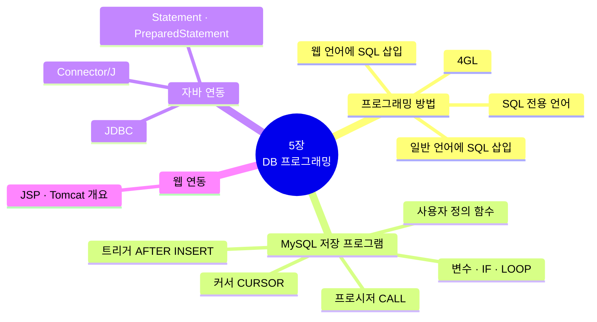
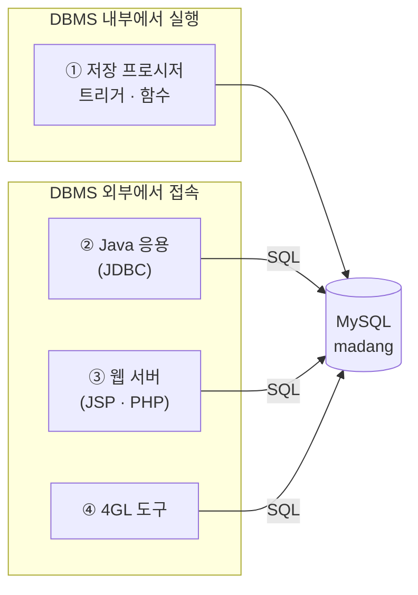
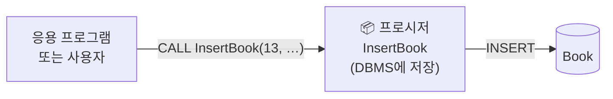
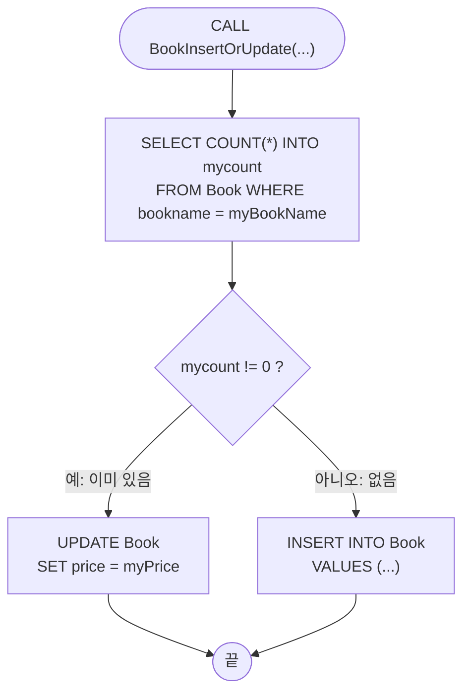
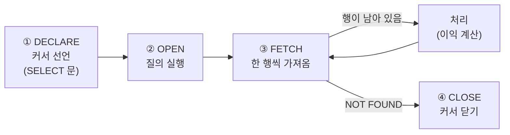
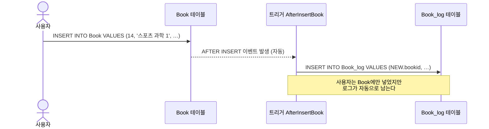
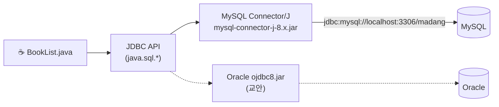
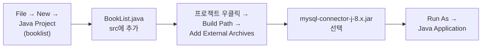
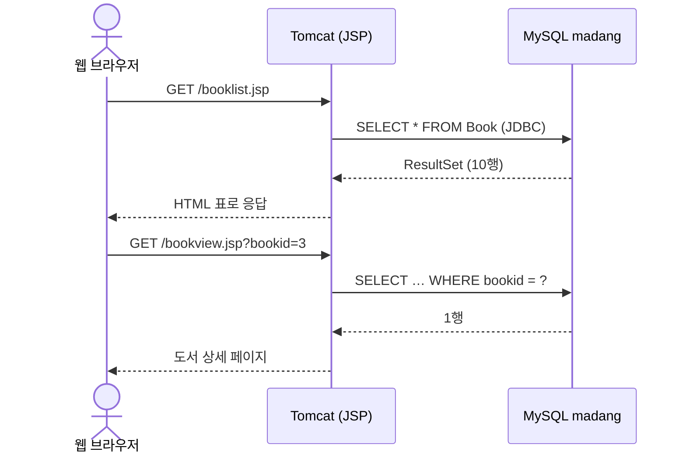

[🏠 목차](README.md) · ◀ 이전 [4장 SQL 고급](04장_SQL_고급.md) · 다음 ▶ [6장 데이터 모델링](06장_데이터_모델링.md)

# Chapter 05. 데이터베이스 프로그래밍

> **이 장의 위치**: SQL 한 문장으로 끝나지 않는 작업 — 조건에 따라 삽입/수정을 나누거나, 행을 하나씩 돌며 계산하거나, 데이터가 바뀔 때 자동으로 기록을 남기는 일 — 을 **저장 프로그램**(프로시저·트리거·함수)으로 만들고, **자바 프로그램에서 마당서점 DB에 접속**하는 방법을 배웁니다.
> 교안의 오라클 PL/SQL을 **MySQL 저장 프로그램** 문법으로 바꾸어 실습합니다.

---

## 📌 학습 목표

- [ ] 데이터베이스 프로그래밍의 네 가지 방법을 구분할 수 있다.
- [ ] MySQL 저장 프로시저를 작성하고 `CALL`로 실행할 수 있다(변수·제어문·커서 포함).
- [ ] 트리거와 사용자 정의 함수를 작성할 수 있다.
- [ ] JDBC(MySQL Connector/J)로 자바 프로그램과 MySQL을 연동할 수 있다.



---

## 1. 데이터베이스 프로그래밍의 개념

> **데이터베이스 프로그래밍**: DBMS에 데이터를 정의하고, 저장된 데이터를 읽어 와 변경하는 프로그램을 작성하는 과정. 일반 프로그래밍과 달리 **SQL을 포함**한다는 점이 다릅니다.

| 방법 | 설명 | 예 |
|---|---|---|
| ① **SQL 전용 언어** | SQL에 변수·제어·입출력 기능을 추가한 언어 | MySQL 저장 프로그램, Oracle **PL/SQL**, SQL Server **T-SQL** |
| ② **일반 프로그래밍 언어 + SQL** | 자바·C 등 호스트 언어 안에 SQL을 삽입 | Java **JDBC**, Python DB-API |
| ③ **웹 프로그래밍 언어 + SQL** | 웹 스크립트 언어에 SQL 삽입 | JSP, PHP, ASP |
| ④ **4GL** | DB 관리·GUI 개발 기능을 갖춘 개발 도구 | Delphi, PowerBuilder, Visual Basic |



---

## 2. MySQL 저장 프로그램

### 2.0 작성 전에 꼭 알아둘 것 — DELIMITER

저장 프로그램 안에는 `;`가 여러 번 나옵니다. 그래서 **문장의 끝을 표시하는 구분자를 잠시 `//`로 바꾸고**, 다 쓴 뒤 다시 `;`로 돌려놓습니다.

```sql
DELIMITER //                 -- 구분자를 // 로 변경
CREATE PROCEDURE 이름(...)
BEGIN
    문장1;                    -- 이 ; 들은 프로시저 내부 문장
    문장2;
END //                       -- 여기서 프로시저 정의가 끝남
DELIMITER ;                  -- 구분자를 ; 로 복구
```

> 🔁 **Oracle 비교**: PL/SQL은 `CREATE OR REPLACE PROCEDURE ... IS ... BEGIN ... END;` 뒤에 `/` 로 실행합니다. MySQL은 `CREATE OR REPLACE PROCEDURE`가 없으므로 **`DROP PROCEDURE IF EXISTS` 후 `CREATE`** 합니다.

| 구성 | Oracle PL/SQL | MySQL |
|---|---|---|
| 정의 | `CREATE OR REPLACE PROCEDURE p(a IN NUMBER) AS` | `CREATE PROCEDURE p(IN a INT)` |
| 변수 선언 | 선언부 `v NUMBER;` | `BEGIN` 안에서 `DECLARE v INT;` |
| 대입 | `v := 10;` | `SET v = 10;` |
| 조회 후 대입 | `SELECT AVG(price) INTO v FROM Book;` | 동일 |
| 출력 | `DBMS_OUTPUT.PUT_LINE(v);` | `SELECT v;` |
| 실행 | `EXEC p(1);` | `CALL p(1);` |

### 2.1 프로시저 (Stored Procedure)

> **저장 프로시저**: 자주 쓰는 SQL 작업을 **이름을 붙여 DBMS에 저장**해 두고, 필요할 때 `CALL`로 호출하는 프로그램



**매개변수 모드**

| 모드 | 방향 | 용도 |
|---|---|---|
| `IN` | 호출자 → 프로시저 | 입력 값 (기본) |
| `OUT` | 프로시저 → 호출자 | 결과 반환 |
| `INOUT` | 양방향 | 입력 받고 바꿔서 반환 |

#### 예제 5-1 · 삽입 작업을 하는 프로시저 (InsertBook)

```sql
DROP PROCEDURE IF EXISTS InsertBook;

DELIMITER //
CREATE PROCEDURE InsertBook(
    IN myBookID    INT,
    IN myBookName  VARCHAR(40),
    IN myPublisher VARCHAR(40),
    IN myPrice     INT)
BEGIN
    INSERT INTO Book (bookid, bookname, publisher, price)
    VALUES (myBookID, myBookName, myPublisher, myPrice);
END //
DELIMITER ;

-- 실행
CALL InsertBook(13, '스포츠과학', '마당과학서적', 25000);
SELECT * FROM Book WHERE bookid = 13;
```

| bookid | bookname | publisher | price |
|---:|---|---|---:|
| 13 | 스포츠과학 | 마당과학서적 | 25000 |

> 💡 프로시저를 쓰면 복잡한 삽입 로직을 **인자 값만 바꾸어** 반복 실행할 수 있고, 응용 프로그램은 SQL을 몰라도 `CALL`만 하면 됩니다.

#### 예제 5-2 · 제어문을 사용하는 프로시저 (BookInsertOrUpdate)

> 같은 이름의 도서가 있으면 **가격만 수정**하고, 없으면 **새로 삽입**한다.



```sql
DROP PROCEDURE IF EXISTS BookInsertOrUpdate;

DELIMITER //
CREATE PROCEDURE BookInsertOrUpdate(
    IN myBookID    INT,
    IN myBookName  VARCHAR(40),
    IN myPublisher VARCHAR(40),
    IN myPrice     INT)
BEGIN
    DECLARE mycount INT;

    SELECT COUNT(*) INTO mycount
    FROM   Book
    WHERE  bookname LIKE myBookName;

    IF mycount != 0 THEN
        UPDATE Book SET price = myPrice
        WHERE  bookname LIKE myBookName;
    ELSE
        INSERT INTO Book (bookid, bookname, publisher, price)
        VALUES (myBookID, myBookName, myPublisher, myPrice);
    END IF;
END //
DELIMITER ;

-- 실행 1: 없는 도서 → 삽입
CALL BookInsertOrUpdate(15, '스포츠 즐거움', '마당과학서적', 25000);
-- 실행 2: 같은 이름 → 가격만 20000으로 수정
CALL BookInsertOrUpdate(15, '스포츠 즐거움', '마당과학서적', 20000);

SELECT * FROM Book WHERE bookname = '스포츠 즐거움';    -- 15 | 스포츠 즐거움 | 마당과학서적 | 20000
```

**MySQL 제어문 정리**

| 구문 | 형식 |
|---|---|
| IF | `IF 조건 THEN … ELSEIF 조건 THEN … ELSE … END IF;` |
| CASE | `CASE WHEN 조건 THEN … ELSE … END CASE;` |
| WHILE | `WHILE 조건 DO … END WHILE;` |
| LOOP | `레이블: LOOP … IF 조건 THEN LEAVE 레이블; END IF; … END LOOP;` |
| REPEAT | `REPEAT … UNTIL 조건 END REPEAT;` |

#### 예제 5-3 · 결과를 반환하는 프로시저 (AveragePrice)

> Book 테이블에 저장된 도서의 평균 가격을 반환한다.

```sql
DROP PROCEDURE IF EXISTS AveragePrice;

DELIMITER //
CREATE PROCEDURE AveragePrice(OUT AverageVal INT)
BEGIN
    SELECT AVG(price) INTO AverageVal
    FROM   Book
    WHERE  price IS NOT NULL;
END //
DELIMITER ;

-- 실행: OUT 매개변수는 사용자 변수(@)로 받는다
CALL AveragePrice(@myValue);
SELECT @myValue;      -- 처음 10권 기준 14450 (예제 5-1, 5-2로 도서 2권을 추가한 뒤라면 15792)
```

> 💡 `@myValue`처럼 `@`로 시작하는 변수는 **세션 변수**(사용자 정의 변수)로, 선언 없이 접속이 끝날 때까지 쓸 수 있습니다. 프로시저 안의 `DECLARE` 변수는 `BEGIN…END` 안에서만 유효한 **지역 변수**입니다.

#### 예제 5-4 · 커서를 사용하는 프로시저 (Interest)

> **커서(cursor)**: 질의 결과(여러 행)를 **한 번에 한 행씩** 가리키며 처리하기 위한 포인터



> Orders 테이블의 판매 도서에 대한 이익을 계산한다. 판매가격이 30,000원 이상이면 10%, 미만이면 5%를 이익으로 본다.

```sql
DROP PROCEDURE IF EXISTS Interest;

DELIMITER //
CREATE PROCEDURE Interest()
BEGIN
    DECLARE myInterest DECIMAL(10,2) DEFAULT 0.0;
    DECLARE Price      INT;
    DECLARE endOfRow   BOOLEAN DEFAULT FALSE;

    DECLARE InterestCursor CURSOR FOR
        SELECT saleprice FROM Orders;                         -- ① 커서 선언
    DECLARE CONTINUE HANDLER FOR NOT FOUND SET endOfRow = TRUE; -- 더 이상 행이 없을 때

    OPEN InterestCursor;                                      -- ② 열기
    cursor_loop: LOOP
        FETCH InterestCursor INTO Price;                      -- ③ 한 행 가져오기
        IF endOfRow THEN LEAVE cursor_loop; END IF;
        IF Price >= 30000 THEN
            SET myInterest = myInterest + Price * 0.1;
        ELSE
            SET myInterest = myInterest + Price * 0.05;
        END IF;
    END LOOP cursor_loop;
    CLOSE InterestCursor;                                     -- ④ 닫기

    SELECT CONCAT('전체 이익 금액 = ', myInterest) AS 결과;
END //
DELIMITER ;

CALL Interest();
```

| 결과 |
|---|
| 전체 이익 금액 = 5900.00 |

> 💡 마당서점의 주문은 모두 30,000원 미만이므로 118,000 × 5% = **5,900원**입니다. MySQL에서는 `DECLARE` 순서가 **변수 → 커서 → 핸들러** 여야 합니다.

### 2.2 트리거 (Trigger)

> **트리거**: 데이터의 변경(`INSERT`, `UPDATE`, `DELETE`)이 일어날 때 **자동으로 실행**되는 프로시저. 직접 `CALL`하지 않습니다.



| 요소 | 선택지 | 설명 |
|---|---|---|
| 시점 | `BEFORE` / `AFTER` | 변경 전 / 후에 실행 |
| 이벤트 | `INSERT` / `UPDATE` / `DELETE` | 어떤 변경에 반응할지 |
| 행 값 | `NEW.열` / `OLD.열` | 새 값(INSERT·UPDATE) / 이전 값(UPDATE·DELETE) |

#### 예제 5-5 · 새로운 도서를 삽입한 후 Book_log 테이블에 기록하는 트리거

```sql
-- 로그 테이블 준비
CREATE TABLE Book_log (
    bookid_l    INT,
    bookname_l  VARCHAR(40),
    publisher_l VARCHAR(40),
    price_l     INT
);

DROP TRIGGER IF EXISTS AfterInsertBook;

DELIMITER //
CREATE TRIGGER AfterInsertBook
AFTER INSERT ON Book
FOR EACH ROW
BEGIN
    INSERT INTO Book_log
    VALUES (NEW.bookid, NEW.bookname, NEW.publisher, NEW.price);
END //
DELIMITER ;

-- 확인
INSERT INTO Book VALUES (14, '스포츠 과학 1', '이상미디어', 25000);
SELECT * FROM Book     WHERE bookid   = 14;
SELECT * FROM Book_log WHERE bookid_l = 14;      -- 자동으로 1행 기록됨
```

| bookid_l | bookname_l | publisher_l | price_l |
|---:|---|---|---:|
| 14 | 스포츠 과학 1 | 이상미디어 | 25000 |

> 🔁 **Oracle 비교**: 오라클은 `:new.bookid` 처럼 콜론을 붙이지만, MySQL은 `NEW.bookid` 로 씁니다.

> 💡 트리거 활용 예: 변경 이력(감사 로그) 남기기, 재고 자동 차감, 파생 값 자동 계산, 업무 규칙 검사(`BEFORE` 트리거에서 `SIGNAL SQLSTATE '45000'`으로 오류 발생)

### 2.3 사용자 정의 함수 (Stored Function)

> **사용자 정의 함수**: 수학의 함수처럼 입력 값을 가공하여 **결과 값 하나를 RETURN**. SQL 문 안에서 내장 함수처럼 호출합니다.

#### 예제 5-6 · 판매된 도서에 대한 이익을 계산하는 함수 (fnc_Interest)

```sql
DROP FUNCTION IF EXISTS fnc_Interest;

DELIMITER //
CREATE FUNCTION fnc_Interest(Price INT)
RETURNS INT
DETERMINISTIC                      -- 같은 입력이면 항상 같은 결과
BEGIN
    DECLARE myInterest INT;
    -- 가격이 30,000원 이상이면 10%, 미만이면 5%
    IF Price >= 30000 THEN
        SET myInterest = Price * 0.1;
    ELSE
        SET myInterest = Price * 0.05;
    END IF;
    RETURN myInterest;
END //
DELIMITER ;

SELECT custid, orderid, saleprice, fnc_Interest(saleprice) AS interest
FROM   Orders;
```

| custid | orderid | saleprice | interest |
|---:|---:|---:|---:|
| 1 | 1 | 6000 | 300 |
| 1 | 2 | 21000 | 1050 |
| 2 | 3 | 8000 | 400 |
| 3 | 4 | 6000 | 300 |
| 4 | 5 | 20000 | 1000 |
| … | … | … | … |

> ⚠️ MySQL 8.0은 바이너리 로그가 기본으로 켜져 있어, 함수에 `DETERMINISTIC`, `NO SQL`, `READS SQL DATA` 중 하나를 쓰지 않으면 `Error 1418`이 납니다.

### 2.4 프로시저 · 트리거 · 함수 비교

| 구분 | 프로시저 | 트리거 | 함수 |
|---|---|---|---|
| 정의 | `CREATE PROCEDURE` | `CREATE TRIGGER` | `CREATE FUNCTION` |
| 실행 | `CALL 이름()` | 데이터 변경 시 **자동** | SQL 문 안에서 호출 |
| 반환 | `OUT` 매개변수 / 결과 집합 | 없음 | `RETURN` 값 **1개** |
| 주 용도 | 업무 로직 묶음 | 자동 처리, 감사 로그 | 계산 값 |

```sql
-- 저장 프로그램 확인과 삭제
SHOW PROCEDURE STATUS WHERE Db = 'madang';
SHOW FUNCTION  STATUS WHERE Db = 'madang';
SHOW TRIGGERS;
SHOW CREATE PROCEDURE InsertBook;

DROP PROCEDURE IF EXISTS InsertBook;
DROP TRIGGER   IF EXISTS AfterInsertBook;
DROP FUNCTION  IF EXISTS fnc_Interest;
```

#### 🧪 연습 1 — 저장 프로그램

<details>
<summary>(1) InsertBook() 프로시저를 수정하여 고객을 새로 등록하는 InsertCustomer() 프로시저를 작성하시오.</summary>

```sql
DELIMITER //
CREATE PROCEDURE InsertCustomer(
    IN myCustId INT, IN myName VARCHAR(40),
    IN myAddress VARCHAR(50), IN myPhone VARCHAR(20))
BEGIN
    INSERT INTO Customer (custid, name, address, phone)
    VALUES (myCustId, myName, myAddress, myPhone);
END //
DELIMITER ;

CALL InsertCustomer(6, '손흥민', '영국 런던', '000-9000-0001');
```
</details>

<details>
<summary>(2) 출판사가 같은 도서가 있으면 그 출판사 도서의 평균 가격으로 삽입하고, 없으면 입력 가격 그대로 삽입하는 BookInsertAvg() 프로시저를 작성하시오.</summary>

```sql
DELIMITER //
CREATE PROCEDURE BookInsertAvg(
    IN myBookID INT, IN myBookName VARCHAR(40),
    IN myPublisher VARCHAR(40), IN myPrice INT)
BEGIN
    DECLARE avgPrice INT;
    SELECT AVG(price) INTO avgPrice FROM Book WHERE publisher = myPublisher;
    IF avgPrice IS NULL THEN
        SET avgPrice = myPrice;
    END IF;
    INSERT INTO Book VALUES (myBookID, myBookName, myPublisher, avgPrice);
END //
DELIMITER ;

CALL BookInsertAvg(16, '피겨 심화', '굿스포츠', 99000);   -- 굿스포츠 평균 7000으로 삽입
```
</details>

<details>
<summary>(3) 고객번호를 입력받아 그 고객의 총 구매액을 반환하는 함수 fnc_CustTotal()을 작성하시오.</summary>

```sql
DELIMITER //
CREATE FUNCTION fnc_CustTotal(myCustId INT)
RETURNS INT
READS SQL DATA
BEGIN
    DECLARE total INT;
    SELECT IFNULL(SUM(saleprice), 0) INTO total FROM Orders WHERE custid = myCustId;
    RETURN total;
END //
DELIMITER ;

SELECT name, fnc_CustTotal(custid) AS 총구매액 FROM Customer;
-- 박지성 39000, 김연아 15000, 장미란 31000, 추신수 33000, 박세리 0
```
</details>

<details>
<summary>(4) Orders에서 주문이 삭제되면 삭제된 주문을 Orders_log에 기록하는 트리거를 작성하시오.</summary>

```sql
CREATE TABLE Orders_log LIKE Orders;      -- 같은 구조의 빈 테이블

DELIMITER //
CREATE TRIGGER AfterDeleteOrders
AFTER DELETE ON Orders
FOR EACH ROW
BEGIN
    INSERT INTO Orders_log
    VALUES (OLD.orderid, OLD.custid, OLD.bookid, OLD.saleprice, OLD.orderdate);
END //
DELIMITER ;
```
> `CREATE TABLE … LIKE`는 구조만 복사하므로, 로그 테이블에는 외래키가 복사되지 않습니다.
</details>

> 💡 실습 후 [sql/demo_madang.sql](sql/demo_madang.sql)을 다시 실행하면 데이터가 처음 상태로 돌아갑니다(트리거·프로시저는 DB와 함께 삭제됨).

---

## 3. 데이터베이스 연동 자바 프로그래밍 (JDBC)

### 3.1 JDBC 개요

> **JDBC(Java Database Connectivity)**: 자바에서 DBMS 종류에 상관없이 **일관된 방법**으로 SQL을 실행하도록 해 주는 자바 API. DBMS별 **드라이버**만 바꾸면 됩니다.



| 단계 | 코드 | 설명 |
|---|---|---|
| ① 드라이버 로드 | `Class.forName("com.mysql.cj.jdbc.Driver")` | JDBC 4.0 이상은 생략 가능 |
| ② 연결 | `DriverManager.getConnection(url, user, pw)` | `Connection` 객체 |
| ③ 문장 준비 | `con.createStatement()` / `con.prepareStatement(sql)` | `Statement` / `PreparedStatement` |
| ④ 실행 | `executeQuery()` (SELECT) / `executeUpdate()` (DML) | `ResultSet` / 변경 행 수 |
| ⑤ 결과 처리 | `while (rs.next()) { rs.getInt(1) … }` | 커서처럼 한 행씩 |
| ⑥ 종료 | `rs.close(); stmt.close(); con.close();` | try-with-resources 권장 |

### 3.2 실습 단계

| 단계 | 세부 내용 | 참고 |
|---|---|---|
| 1단계 DBMS 준비 | MySQL 8.0 설치, madang 계정 | [실습 환경](00장_실습환경_MySQL.md) |
| 2단계 DB 준비 | `demo_madang.sql` 실행 | [sql/demo_madang.sql](sql/demo_madang.sql) |
| 3단계(A) 명령 프롬프트 | JDK 설치 → Connector/J jar 준비 → 컴파일·실행 | 아래 3.3 |
| 3단계(B) 이클립스 | 프로젝트 생성 → Build Path에 jar 추가 → Run As Java Application | 아래 3.4 |

### 3.3 BookList.java

```java
import java.sql.*;

public class BookList {
    // MySQL 접속 정보
    static final String URL  = "jdbc:mysql://localhost:3306/madang?serverTimezone=Asia/Seoul";
    static final String USER = "madang";
    static final String PASS = "madang";

    public static void main(String[] args) {
        String sql = "SELECT bookid, bookname, publisher, price FROM Book";

        // try-with-resources: 블록이 끝나면 자동으로 close()
        try (Connection con = DriverManager.getConnection(URL, USER, PASS);
             Statement stmt = con.createStatement();
             ResultSet rs   = stmt.executeQuery(sql)) {

            System.out.println("BOOK NO \tBOOK NAME \t\tPUBLISHER \tPRICE");
            while (rs.next()) {                       // 커서처럼 한 행씩 이동
                System.out.print(rs.getInt(1) + "\t");
                System.out.print(rs.getString(2) + "\t\t");
                System.out.print(rs.getString(3) + "\t");
                System.out.println(rs.getInt(4));
            }
        } catch (SQLException e) {
            System.out.println("DB 오류: " + e.getMessage());
        }
    }
}
```

**명령 프롬프트에서 컴파일·실행** (Connector/J jar 파일을 같은 폴더에 둔 경우)

```bash
javac BookList.java
```

```bash
java -cp ".;mysql-connector-j-8.4.0.jar" BookList
```

> 💡 macOS/Linux에서는 클래스패스 구분자가 `;` 대신 `:` 입니다. jar 파일 이름은 내려받은 버전에 맞게 바꾸세요.

**실행 결과**

```text
BOOK NO 	BOOK NAME 		PUBLISHER 	PRICE
1	축구의 역사		굿스포츠	7000
2	축구 아는 여자		나무수	13000
3	축구의 이해		대한미디어	22000
...
10	Olympic Champions		Pearson	13000
```

### 3.4 이클립스에서 실행



> 💡 Maven 프로젝트라면 jar 대신 의존성을 추가합니다.
> ```xml
> <dependency>
>   <groupId>com.mysql</groupId>
>   <artifactId>mysql-connector-j</artifactId>
>   <version>8.4.0</version>
> </dependency>
> ```

### 3.5 PreparedStatement와 프로시저 호출

사용자 입력을 SQL에 **문자열로 이어 붙이면 SQL 인젝션** 위험이 있습니다. `?` 자리표시자를 쓰는 `PreparedStatement`를 사용하세요.

```java
// 출판사로 도서 검색 — 입력값은 ? 에 바인딩
String sql = "SELECT bookname, price FROM Book WHERE publisher = ?";
try (Connection con = DriverManager.getConnection(URL, USER, PASS);
     PreparedStatement ps = con.prepareStatement(sql)) {
    ps.setString(1, "굿스포츠");
    try (ResultSet rs = ps.executeQuery()) {
        while (rs.next()) {
            System.out.println(rs.getString("bookname") + " : " + rs.getInt("price"));
        }
    }
}

// 저장 프로시저 호출 — CallableStatement
try (Connection con = DriverManager.getConnection(URL, USER, PASS);
     CallableStatement cs = con.prepareCall("{CALL AveragePrice(?)}")) {
    cs.registerOutParameter(1, Types.INTEGER);
    cs.execute();
    System.out.println("평균 가격: " + cs.getInt(1));
}
```

| 객체 | 용도 |
|---|---|
| `Statement` | 고정된 SQL 실행 |
| `PreparedStatement` | `?` 매개변수가 있는 SQL (인젝션 방지, 반복 실행에 빠름) |
| `CallableStatement` | 저장 프로시저 호출 `{CALL 이름(?, ?)}` |

> 💡 JDBC는 기본이 **자동 커밋**입니다. 여러 SQL을 하나의 작업으로 묶으려면 `con.setAutoCommit(false)` 후 `con.commit()` / `con.rollback()` 을 호출합니다 → [8장 트랜잭션](08장_트랜잭션_동시성제어_회복.md)

---

## 4. 데이터베이스 연동 웹 프로그래밍 (개요)

웹 브라우저의 요청을 웹 서버(WAS)가 받아 **JDBC로 DB를 조회한 뒤 HTML로 응답**합니다.



| 구성 | 역할 |
|---|---|
| JSP | HTML 안에 `<% … %>` 자바 코드를 넣어 동적 페이지 생성 |
| Tomcat | JSP/서블릿 컨테이너 (요청을 받아 JSP를 실행) |
| JDBC 드라이버 | `mysql-connector-j-8.x.jar` 를 Tomcat의 `lib` 또는 `WEB-INF/lib` 에 복사 |

```jsp
<%@ page contentType="text/html; charset=UTF-8" import="java.sql.*" %>
<table border="1">
<%
  String url = "jdbc:mysql://localhost:3306/madang?serverTimezone=Asia/Seoul";
  try (Connection con = DriverManager.getConnection(url, "madang", "madang");
       Statement st = con.createStatement();
       ResultSet rs = st.executeQuery("SELECT bookid, bookname FROM Book")) {
    while (rs.next()) {
%>
  <tr><td><%= rs.getInt(1) %></td>
      <td><a href="bookview.jsp?bookid=<%= rs.getInt(1) %>"><%= rs.getString(2) %></a></td></tr>
<%  }
  }
%>
</table>
```

> 🔁 **교안(Oracle) 대비 변경점**: 드라이버 `ojdbc8.jar` → `mysql-connector-j`, URL `jdbc:oracle:thin:@localhost:1521:xe` → `jdbc:mysql://localhost:3306/madang`. 오라클 XMLDB와 Tomcat의 8080 포트 충돌 문제는 MySQL에서는 생기지 않습니다.

---

## 📝 핵심 요약

| # | 키워드 | 한 줄 정리 |
|:---:|---|---|
| 1 | DB 프로그래밍 | SQL 전용 언어 / 일반 언어 + SQL / 웹 언어 + SQL / 4GL |
| 2 | DELIMITER | 저장 프로그램 작성 시 문장 구분자를 `//`로 바꿨다가 복구 |
| 3 | 프로시저 | `CREATE PROCEDURE` → `CALL`, 매개변수 IN·OUT·INOUT |
| 4 | 변수·제어문 | `DECLARE`, `SET`, `SELECT … INTO`, `IF`, `LOOP`·`LEAVE`, `WHILE` |
| 5 | 커서 | DECLARE → OPEN → FETCH(반복) → CLOSE, NOT FOUND 핸들러 |
| 6 | 트리거 | 데이터 변경 시 자동 실행, BEFORE/AFTER, `NEW`/`OLD` |
| 7 | 함수 | `RETURNS` + `RETURN` 값 1개, SQL 안에서 호출, DETERMINISTIC |
| 8 | JDBC | Connection → Statement → ResultSet, MySQL Connector/J |
| 9 | PreparedStatement | `?` 바인딩으로 SQL 인젝션 방지 |
| 10 | 웹 연동 | 브라우저 → Tomcat(JSP) → JDBC → MySQL → HTML 응답 |

---

## ✅ 확인 문제

<details>
<summary>1. MySQL에서 저장 프로시저를 만들 때 DELIMITER를 바꾸는 이유는?</summary>

프로시저 본문에 `;`가 여러 번 들어가므로, 클라이언트가 본문 중간의 `;`에서 문장이 끝났다고 판단하지 않도록 구분자를 `//` 등으로 잠시 바꾸기 위해서입니다.
</details>

<details>
<summary>2. 프로시저, 트리거, 함수의 실행 방법 차이를 쓰시오.</summary>

프로시저는 `CALL`로 직접 호출, 트리거는 INSERT/UPDATE/DELETE 발생 시 **자동** 실행, 함수는 `SELECT fnc(…)` 처럼 **SQL 문 안에서** 호출합니다.
</details>

<details>
<summary>3. 커서 처리의 4단계를 순서대로 쓰시오.</summary>

DECLARE(선언) → OPEN → FETCH(반복) → CLOSE
</details>

<details>
<summary>4. 트리거에서 UPDATE 이전 값과 이후 값을 참조하는 키워드는?</summary>

이전 값 `OLD.열이름`, 이후 값 `NEW.열이름`
</details>

<details>
<summary>5. [SQL] 도서번호를 입력받아 그 도서가 팔린 횟수를 반환하는 함수 fnc_SaleCount를 작성하고, 모든 도서의 이름과 판매 횟수를 출력하시오.</summary>

```sql
DELIMITER //
CREATE FUNCTION fnc_SaleCount(myBookId INT)
RETURNS INT
READS SQL DATA
BEGIN
    DECLARE cnt INT;
    SELECT COUNT(*) INTO cnt FROM Orders WHERE bookid = myBookId;
    RETURN cnt;
END //
DELIMITER ;

SELECT bookname, fnc_SaleCount(bookid) AS 판매횟수 FROM Book;
-- 야구를 부탁해 2, Olympic Champions 2, 골프 바이블 0 …
```
</details>

<details>
<summary>6. JDBC에서 Statement 대신 PreparedStatement를 써야 하는 이유는?</summary>

`?` 매개변수에 값을 **바인딩**하므로 사용자 입력이 SQL 문법으로 해석되지 않아 **SQL 인젝션을 방지**하고, 같은 SQL을 반복 실행할 때 효율적입니다.
</details>

---

> 📚 출처: 한빛아카데미 「데이터베이스 개론과 실습」 5장 강의교안을 참고하여 요약·재구성. 모든 그림은 Mermaid로 새로 작성, SQL·자바 코드는 MySQL 8.0 / Connector/J 기준.

[🏠 목차](README.md) · ◀ 이전 [4장 SQL 고급](04장_SQL_고급.md) · 다음 ▶ [6장 데이터 모델링](06장_데이터_모델링.md)
