[🏠 목차](README.md) · ◀ 이전 [5장 데이터베이스 프로그래밍](05장_데이터베이스_프로그래밍.md) · 다음 ▶ [7장 정규화](07장_정규화.md)

# Chapter 06. 데이터 모델링

> **이 장의 위치**: 지금까지는 이미 만들어진 마당서점 DB를 *사용*했습니다. 이 장에서는 거꾸로, **요구사항에서 출발해 ER 다이어그램을 그리고 테이블로 바꾸는 설계 과정**을 배웁니다. 모델링 도구는 교안의 ERwin 대신 **MySQL Workbench**를 사용합니다.

---

## 📌 학습 목표

- [ ] 데이터베이스 생명주기와 데이터 모델링 과정(개념적·논리적·물리적)을 설명할 수 있다.
- [ ] ER 모델의 개체·속성·관계와 그 유형을 이해하고 ER 다이어그램을 그릴 수 있다.
- [ ] ER 모델을 관계 데이터 모델(테이블)로 사상(mapping)할 수 있다.
- [ ] MySQL Workbench로 ER 다이어그램을 작성하고 테이블을 생성(Forward Engineer)할 수 있다.

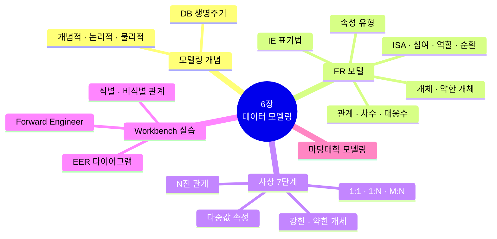

---

## 1. 데이터 모델링의 개념

### 1.1 데이터 모델링의 중요성

건물을 지을 때 설계도가 필요하듯, 데이터베이스도 **설계가 잘못되면** 필요한 정보를 제공하기는커녕 혼란만 줍니다.

| 관점 | 건축 설계 | 데이터베이스 설계 |
|---|---|---|
| 효율성 | 공간 활용 | **질의 속도**, 저장 공간 |
| 관계 | 방과 방의 동선(의사소통) | **테이블 간의 관계** |
| 보안 | 사생활 보호 | 접근 권한 |

**예) 마당서점 주문 정보를 어떻게 저장할까?**

| 설계안 1 — 한 테이블에 모두 | 설계안 2 — 나누어 저장 |
|---|---|
| `주문(주문번호, 고객이름, 주소, 전화, 도서이름, 출판사, 정가, 판매가, 주문일)` | `Customer`, `Book`, `Orders` 세 테이블 |
| 박지성의 주소가 주문마다 반복 저장 → 주소가 바뀌면 여러 곳 수정 | 고객 정보는 한 곳에만 → 수정 한 번 |

> 설계안 1에서 생기는 문제(이상현상)와 해결(정규화)은 [7장](07장_정규화.md)에서 자세히 다룹니다.

### 1.2 데이터베이스 생명주기

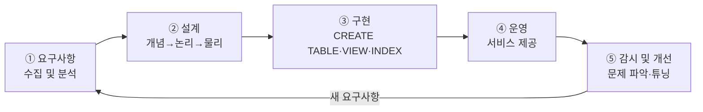

| 단계 | 하는 일 |
|---|---|
| ① 요구사항 수집 및 분석 | 사용자 요구사항을 듣고 분석해 구축 **범위**를 정함 |
| ② 설계 | 핵심 개념 식별(개념적) → DBMS에 맞게 변환(논리적) → 스키마 도출(물리적) |
| ③ 구현 | 스키마를 DBMS에 적용해 테이블·뷰·인덱스 생성 |
| ④ 운영 | DB를 기반으로 소프트웨어를 구축해 서비스 |
| ⑤ 감시 및 개선 | 운영 중 문제를 관찰하고 개선 |

### 1.3 데이터 모델링 과정

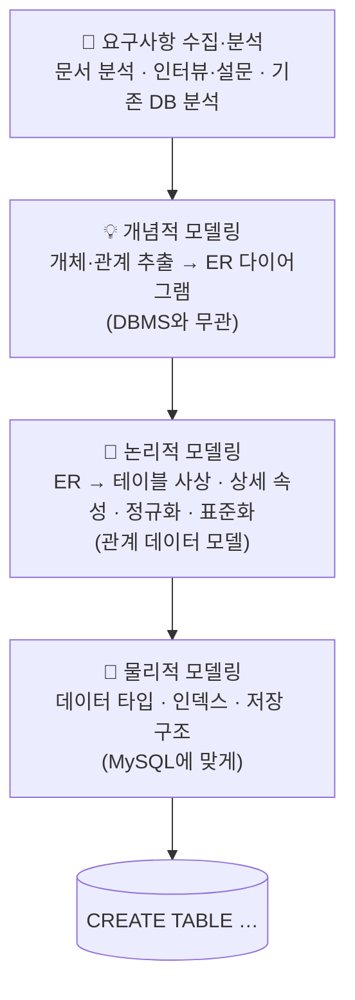

| 단계 | 결과물 | 마당서점 예 |
|---|---|---|
| 개념적 모델링 | ER 다이어그램 | 고객 —(주문)— 도서 |
| 논리적 모델링 | 릴레이션 스키마 | `Customer(custid, name, address, phone)` … |
| 물리적 모델링 | DDL, 인덱스 설계 | `custid INT PRIMARY KEY`, `INDEX(bookname)` |

**물리적 모델링 시 고려사항**: ① 응답 시간 최소화 ② 동시에 발생할 트랜잭션 수 검토 ③ 저장 공간의 효율적 배치

---

## 2. ER 모델

> **ER(Entity-Relationship) 모델**: 세상의 사물을 **개체(entity)** 와 개체 간의 **관계(relationship)** 로 표현하는 개념적 모델 (P. Chen, 1976)

### 2.1 ER 다이어그램 기호 (Chen 표기법)

| 기호 | 의미 |
|---|---|
| ▭ 직사각형 | 개체 타입 |
| ▭▭ 이중 직사각형 | 약한 개체 타입 |
| ◇ 마름모 | 관계 타입 |
| ◇◇ 이중 마름모 | 식별 관계 타입 (약한 개체와의 관계) |
| ⬭ 타원 | 속성 (키 속성은 **밑줄**) |
| ⬭⬭ 이중 타원 | 다중값 속성 |
| ⬭ 점선 타원 | 유도 속성 |

**마당서점의 ER 다이어그램**

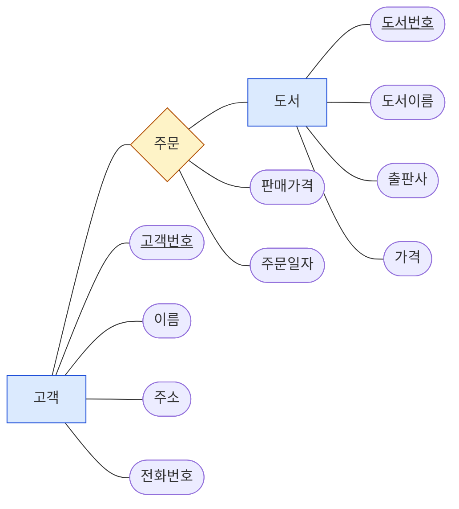

> 고객 한 명은 여러 도서를, 도서 한 권은 여러 고객에게 팔리므로 **고객 : 도서 = M : N** 관계이고, 판매가격·주문일자는 **관계의 속성**입니다.

### 2.2 개체와 개체 타입

| 용어 | 의미 | 예 |
|---|---|---|
| **개체(entity)** | 독립적으로 존재하는 유무형의 실체(사람·사물·장소·개념·사건) | 박지성, '축구의 역사' |
| **개체 타입(entity type)** | 같은 속성을 가진 개체들의 틀 | 고객, 도서 |
| **개체 집합(entity set)** | 한 개체 타입에 속한 개체들의 모임 | 고객 5명 전체 |

| 유형 | 의미 | 예 |
|---|---|---|
| **강한 개체** (strong) | 다른 개체 없이 독자적으로 존재 | 고객, 도서 |
| **약한 개체** (weak) | 상위 개체가 있어야만 존재 | 고객의 **부양가족**, 주문의 **주문상세** |

### 2.3 속성

| 유형 | 의미 | 기호 | 예 |
|---|---|---|---|
| **단순 속성** | 더 나눌 수 없음 | 타원 | 이름 |
| **복합 속성** | 여러 속성으로 나뉨 | 타원에 하위 타원 | 주소 → (시, 구, 상세주소) |
| **단일값 속성** | 값이 하나 | 타원 | 생년월일 |
| **다중값 속성** | 값이 여러 개 | 이중 타원 | 전화번호들, 취미들 |
| **유도 속성** | 다른 속성에서 계산 | 점선 타원 | 나이(← 생년월일) |
| **NULL 속성** | 값이 없을 수 있음 | — | 박세리의 phone |
| **키 속성** | 개체를 유일하게 식별 | 밑줄 | 고객번호 |

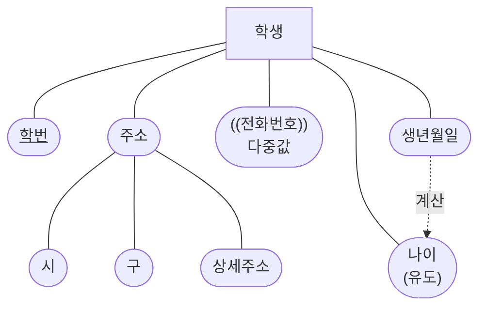

### 2.4 관계와 관계 타입

> **관계(relationship)**: 개체 사이의 연관성. **관계 타입**은 개체 타입 간의 연결 가능한 관계를 정의한 것.

#### 차수(degree)에 따른 유형 — 참여하는 개체 타입의 수

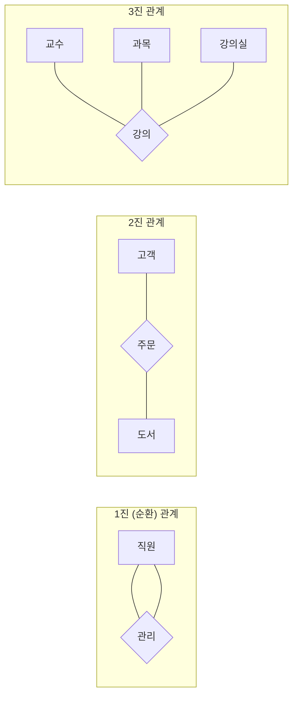

#### 관계 대응수(cardinality) — 실제로 참여하는 개체의 수

| 대응수 | 의미 | 예 |
|---|---|---|
| **1 : 1** | 한 개체가 상대 한 개체와만 | 학과 — 학과장(교수) |
| **1 : N** | 한쪽의 한 개체가 다른 쪽 여러 개체와 (가장 흔함) | 고객 — 주문, 학과 — 학생 |
| **M : N** | 서로 여러 개체와 | 고객 — 도서, 학생 — 강좌 |

**(최솟값, 최댓값) 표기** — 대응수만으로는 "반드시 참여해야 하는지"를 알 수 없으므로 범위를 함께 씁니다.


> 고객은 주문을 0번 이상(박세리는 0번), 도서도 0번 이상(골프 바이블은 0번) 주문에 참여합니다.

#### 그 밖의 관계 개념

| 개념 | 의미 | 예 |
|---|---|---|
| **ISA 관계** | 상위 개체 타입의 특성에 따라 하위 개체 타입이 결정 (is-a, 일반화/특수화) | 학생 ⊃ 학부생, 대학원생 |
| **참여 제약조건** | **전체 참여**(모든 개체가 참여, 최솟값 ≥ 1, 이중선) / **부분 참여**(일부만, 최솟값 0) | 모든 주문은 반드시 고객이 있음(전체) / 고객은 주문이 없을 수도(부분) |
| **역할(role)** | 관계에서 각 개체가 맡는 역할 이름 | 직원 —(관리)— 직원 : *관리자* / *부하* |
| **순환적 관계** | 한 개체 타입이 자기 자신과 관계 | 선임 대학원생이 후배를 조언 |

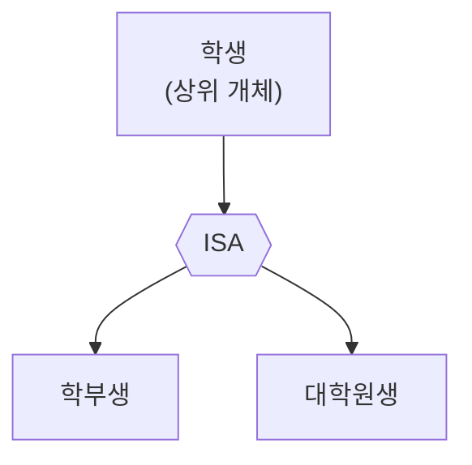

### 2.5 약한 개체 타입과 식별자

> **약한 개체**: 상위 개체 타입이 결정되어야만 개별 개체를 식별할 수 있는 종속 개체. 상위 개체의 키와 결합해 자신을 식별하는 속성을 **식별자(discriminator)** 또는 **부분키(partial key)** 라고 합니다.

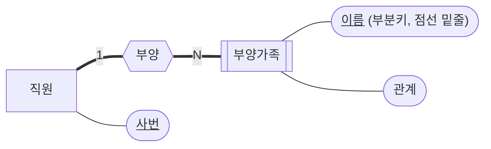

> 부양가족은 **(사번, 이름)** 으로 식별됩니다. 직원이 퇴사하면 부양가족 정보도 의미가 없어집니다.

### 2.6 IE 표기법 (Information Engineering, 까마귀발)

ER 다이어그램을 **간략하게** 표현하는 방법으로, ERwin·**MySQL Workbench** 등 대부분의 모델링 도구가 사용합니다. 개체와 속성을 하나의 직사각형에 넣고, 관계는 선 끝의 기호로 나타냅니다.

| 선 끝 기호 | 의미 | Mermaid 표기 |
|---|---|---|
| `\|\|` | 정확히 1 (필수 1) | `\|\|` |
| `o\|` | 0 또는 1 (선택 1) | `o\|` |
| `\|<` (까마귀발 + 막대) | 1 이상 (필수 다수) | `}\|` |
| `o<` (까마귀발 + 원) | 0 이상 (선택 다수) | `}o` |

| 관계 선 | 의미 | Workbench |
|---|---|---|
| **실선** | **식별 관계** — 부모의 기본키가 자식 **기본키의 일부**가 됨 (약한 개체) | Identifying Relationship |
| **점선** | **비식별 관계** — 부모의 기본키가 자식의 **일반 속성(외래키)** 이 됨 | Non-Identifying Relationship |

**마당서점 — IE 표기법**

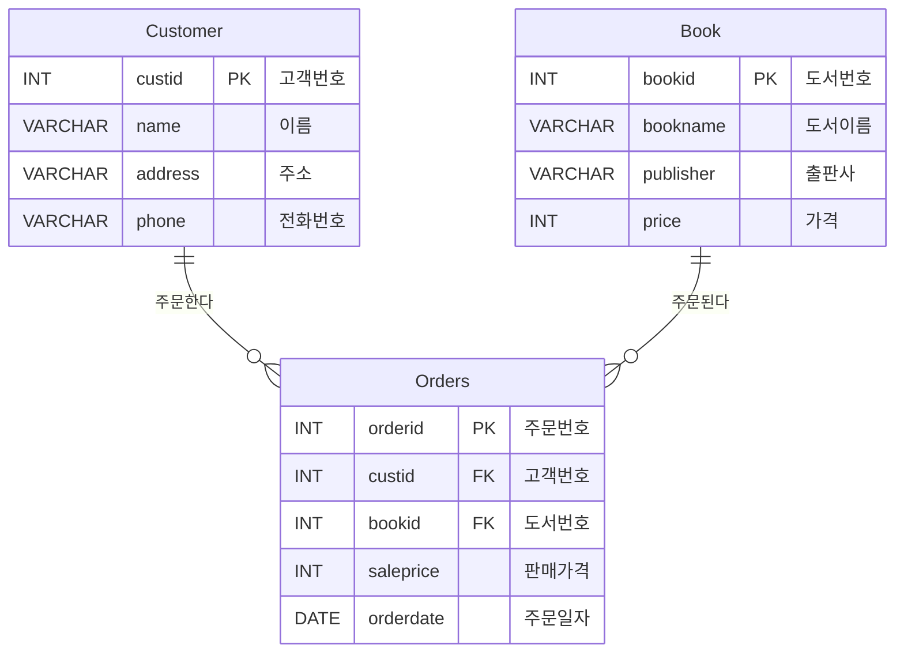

> Mermaid는 실선(`--`)과 점선(`..`)으로 식별/비식별 관계를 구분합니다. 위 그림은 Orders가 자신의 기본키(orderid)를 따로 가지므로 **비식별 관계**지만, Mermaid erDiagram의 기본 실선으로 표시했습니다. 비식별 관계를 점선으로 그리려면 `Customer ||..o{ Orders : …` 처럼 씁니다.

---

## 3. ER 모델을 관계 데이터 모델로 사상

ER 다이어그램을 실제 테이블로 만들기 위해 **논리적 모델링 단계에서 사상(mapping)** 합니다.

### 3.1 관계를 표현하는 네 가지 방법

개체 E1(KA1, A2)과 E2(KA2, A4) 사이에 관계 R이 있을 때:

| 방법 | 결과 릴레이션 | 의미 |
|---|---|---|
| **방법 1** | E1(<u>KA1</u>, A2), E2(<u>KA2</u>, A4, **KA1**) | E2 쪽에 외래키 |
| **방법 2** | E1(<u>KA1</u>, A2, **KA2**), E2(<u>KA2</u>, A4) | E1 쪽에 외래키 |
| **방법 3** | ER(<u>KA1</u>, A2, KA2, A4) | 하나의 릴레이션으로 통합 |
| **방법 4** | E1(<u>KA1</u>, A2), **R(<u>KA1, KA2</u>)**, E2(<u>KA2</u>, A4) | 관계를 독립 릴레이션으로 |

### 3.2 사상 7단계

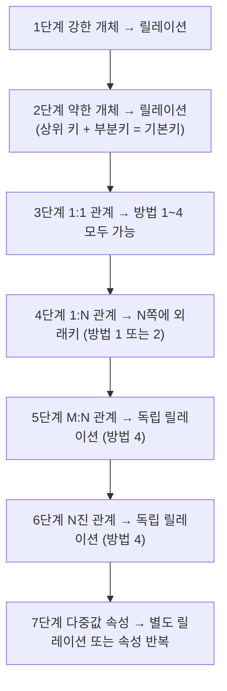

| 단계 | 대상 | 사상 규칙 | 예 |
|---|---|---|---|
| 1 | **강한 개체** | 개체 하나 → 릴레이션 하나 (키 → 기본키) | 고객 → `Customer(custid, …)` |
| 2 | **약한 개체** | 자신의 부분키 + **상위 개체 키(외래키)** 로 기본키 구성 | 부양가족(<u>사번, 이름</u>, 관계) |
| 3 | **1:1 관계** | 방법 1~4 모두 가능. 보통 **전체 참여하는 쪽**에 외래키 | 학과(…, 학과장사번) |
| 4 | **1:N 관계** | **N쪽 릴레이션에 1쪽 키를 외래키**로 | 학생(…, 학과번호) |
| 5 | **M:N 관계** | 관계를 **독립 릴레이션**으로, 양쪽 키를 합쳐 기본키 | 고객–도서 → `Orders(custid, bookid, …)` |
| 6 | **N진 관계** | 참여하는 모든 개체의 키를 포함한 독립 릴레이션 | 강의(교수번호, 과목번호, 강의실번호) |
| 7 | **다중값 속성** | 개수를 모르면 **별도 릴레이션**(방법 1), 개수가 정해지면 속성을 반복(방법 2) | 고객전화(<u>custid, phone</u>) / (phone1, phone2) |

**마당서점에 적용 — M:N 관계 해소**

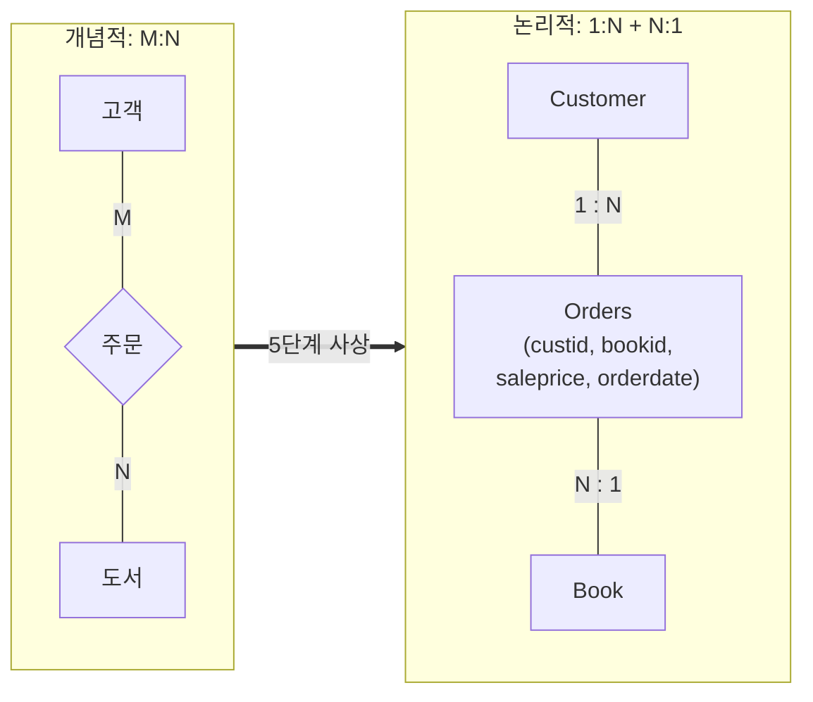

> 이론상 Orders의 기본키는 (custid, bookid)지만, 같은 고객이 같은 책을 여러 번 살 수 있으므로 **대리키 orderid**를 기본키로 둡니다. 이렇게 하면 관계가 **비식별 관계**가 됩니다.

**다중값 속성 사상 예**

```sql
-- 방법 1: 개수를 모를 때 → 별도 테이블
CREATE TABLE CustomerPhone (
    custid INT,
    phone  VARCHAR(20),
    PRIMARY KEY (custid, phone),
    FOREIGN KEY (custid) REFERENCES Customer(custid)
);

-- 방법 2: 개수가 정해져 있을 때 → 속성 반복
-- Customer(custid, name, address, phone_home, phone_mobile)
```

---

## 4. MySQL Workbench 실습 — 마당서점 설계

> 💡 교안은 ERwin Data Modeler를 사용하지만, ERwin은 라이선스 신청이 필요합니다. **MySQL Workbench**는 무료이고 MySQL과 바로 연결되며 IE 표기법을 사용합니다.

### 4.1 Workbench 모델링 화면

| 도구 | 아이콘 위치 (EER Diagram 왼쪽 도구 모음) | 용도 |
|---|---|---|
| Place a New Table | 표 아이콘 (단축키 `T`) | 개체(테이블) 생성 |
| 1:1 Non-Identifying | 점선 1:1 | 비식별 1:1 관계 |
| 1:n Non-Identifying | 점선 1:n | 비식별 1:N 관계 |
| 1:1 Identifying | 실선 1:1 | 식별 1:1 관계 |
| 1:n Identifying | 실선 1:n | 식별 1:N 관계 |
| n:m Identifying | 실선 n:m | M:N 관계 (연결 테이블 **자동 생성**) |
| Place a Relationship Using Existing Columns | | 이미 있는 열로 FK 연결 |

### 4.2 마당서점 모델링 순서

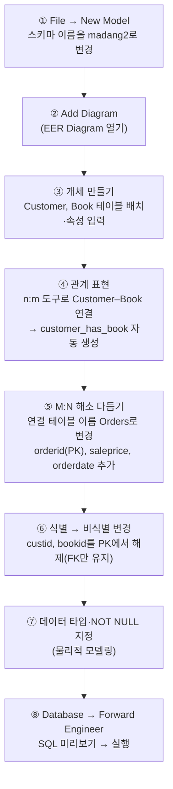

**③ 테이블과 속성 입력** — 테이블을 더블클릭하면 아래쪽에 편집 탭이 열립니다.

| 열 | 의미 | 설정 |
|---|---|---|
| Column Name | 속성 이름 | custid, name … |
| Datatype | 데이터 타입 | INT, VARCHAR(40) … |
| PK | 기본키 | custid ✅ |
| NN | NOT NULL | 기본키는 자동 체크 |
| UQ | UNIQUE | |
| AI | AUTO_INCREMENT | 대리키에 사용 |
| Default | 기본값 | |

**⑥ 식별 관계 vs 비식별 관계 비교**

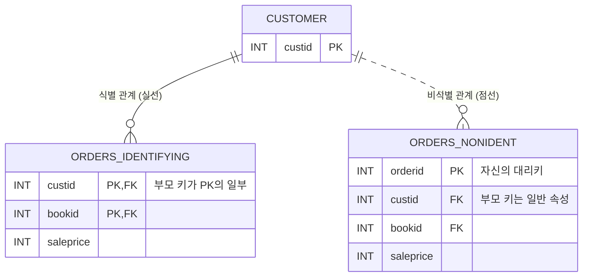

### 4.3 Forward Engineer — 다이어그램에서 테이블 생성

[Database] → [Forward Engineer] → 접속(madang 또는 root) 선택 → 옵션 확인 → **Review SQL Script**에서 생성될 DDL 확인 → [Next] → 실행

Workbench가 만들어 주는 DDL (요약):

```sql
CREATE SCHEMA IF NOT EXISTS `madang2` DEFAULT CHARACTER SET utf8mb4;
USE `madang2`;

CREATE TABLE IF NOT EXISTS `Customer` (
  `custid`  INT NOT NULL,
  `name`    VARCHAR(40) NULL,
  `address` VARCHAR(50) NULL,
  `phone`   VARCHAR(20) NULL,
  PRIMARY KEY (`custid`)
) ENGINE = InnoDB;

CREATE TABLE IF NOT EXISTS `Book` (
  `bookid`    INT NOT NULL,
  `bookname`  VARCHAR(40) NULL,
  `publisher` VARCHAR(40) NULL,
  `price`     INT NULL,
  PRIMARY KEY (`bookid`)
) ENGINE = InnoDB;

CREATE TABLE IF NOT EXISTS `Orders` (
  `orderid`   INT NOT NULL,
  `custid`    INT NOT NULL,
  `bookid`    INT NOT NULL,
  `saleprice` INT NULL,
  `orderdate` DATE NULL,
  PRIMARY KEY (`orderid`),
  INDEX `fk_Orders_Customer_idx` (`custid` ASC) VISIBLE,
  INDEX `fk_Orders_Book_idx` (`bookid` ASC) VISIBLE,
  CONSTRAINT `fk_Orders_Customer`
    FOREIGN KEY (`custid`) REFERENCES `Customer` (`custid`)
    ON DELETE NO ACTION ON UPDATE NO ACTION,
  CONSTRAINT `fk_Orders_Book`
    FOREIGN KEY (`bookid`) REFERENCES `Book` (`bookid`)
    ON DELETE NO ACTION ON UPDATE NO ACTION
) ENGINE = InnoDB;
```

> 💡 반대로 **[Database] → [Reverse Engineer]** 를 쓰면 이미 있는 `madang` DB에서 ER 다이어그램을 자동으로 그려 줍니다. 3장에서 쓰던 DB가 어떤 구조인지 한눈에 확인해 보세요.

| ERwin (교안) | MySQL Workbench |
|---|---|
| Logical / Physical 모델 전환 | 하나의 EER 모델(물리 수준) |
| Actions → Forward Engineer → Schema | Database → Forward Engineer |
| 도메인 정의 | User Defined Types (Model → User Defined Types) |
| Reverse Engineer | Database → Reverse Engineer |

---

## 5. 마당대학 데이터베이스 모델링 연습

### 5.1 요구사항

| # | 요구사항 | 분석 |
|:---:|---|---|
| ① | 교수(Professor)는 아이디(ssn), 이름(name), 나이(age), 직위(rank), 연구 분야(speciality)를 가진다. | 개체 |
| ② | 학과(Department)에는 학과번호(dno), 학과이름(dname), 학과사무실(office)이 있다. | 개체 |
| ③ | 대학원생(Graduate)은 아이디(ssn), 이름(name), 나이(age), 학위과정(deg_prog: 석사/박사)을 가진다. | 개체 |
| ④ | 과제(Project)는 과제번호(pid), 지원기관(sponsor), 개시일(start_date), 종료일(end_date), 예산액(budget)이 있다. | 개체 |
| ⑤ | 학과마다 그 학과를 운영(run)하는 교수(학과장)가 한 명씩 있다. | 교수–학과 **1:1** |
| ⑥ | 한 교수가 여러 학과에서 근무(work-dept)할 수 있고, 학과별 참여백분율(pct_time)이 기록된다. | 교수–학과 **M:N** + 관계 속성 |
| ⑦ | 대학원생에게는 전공학과(major)가 하나씩 있다. | 학과–대학원생 **1:N** |
| ⑧ | 대학원생에게는 조언해주는 선임 대학원생(advisor)이 있다. | 대학원생 **순환 1:N** |
| ⑨ | 과제는 한 교수(연구책임자)에 의해 관리(manage)된다. | 교수–과제 **1:N** |
| ⑩ | 과제는 한 명 이상의 교수(공동연구책임자)에 의해 수행(work-in)된다. | 교수–과제 **M:N** |
| ⑪ | 과제는 한 명 이상의 대학원생(연구조교)에 의해 수행(work-prog)된다. | 대학원생–과제 **M:N** |

### 5.2 ER 다이어그램 (개념적 모델)

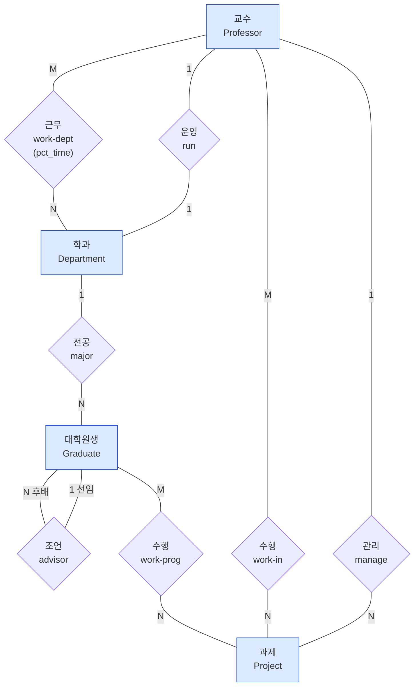

### 5.3 관계 데이터 모델로 사상

| 요구 | 관계 | 사상 단계 | 결과 |
|---|---|---|---|
| ①~④ | 강한 개체 | 1단계 | Professor, Department, Graduate, Project |
| ⑤ run | 1:1 | 3단계 | Department에 `runprof`(학과장) 외래키 |
| ⑥ work-dept | M:N | 5단계 | **Work_dept**(ssn, dno, pct_time) |
| ⑦ major | 1:N | 4단계 | Graduate에 `major` 외래키 |
| ⑧ advisor | 순환 1:N | 4단계 | Graduate에 `advisor` 외래키(자기 참조) |
| ⑨ manage | 1:N | 4단계 | Project에 `manager` 외래키 |
| ⑩ work-in | M:N | 5단계 | **Work_in**(ssn, pid) |
| ⑪ work-prog | M:N | 5단계 | **Work_prog**(ssn, pid) |

```text
Professor  (ssn, name, age, rank, speciality)
Department (dno, dname, office, runprof → Professor.ssn)
Graduate   (ssn, name, age, deg_prog, major → Department.dno, advisor → Graduate.ssn)
Project    (pid, sponsor, start_date, end_date, budget, manager → Professor.ssn)
Work_dept  (ssn → Professor, dno → Department, pct_time)
Work_in    (ssn → Professor, pid → Project)
Work_prog  (ssn → Graduate,  pid → Project)
```

### 5.4 IE 표기법 다이어그램 (Workbench에서 그릴 모습)

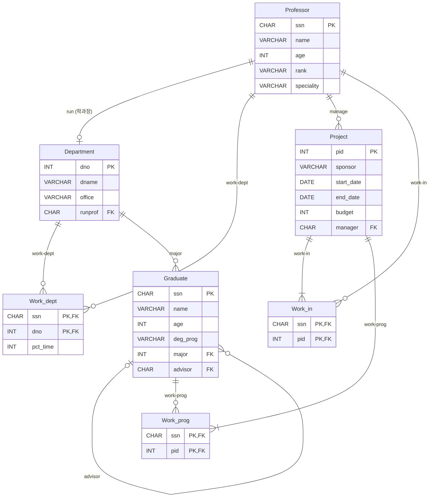

> `Project ||--|{ Work_in` 의 `|{` 는 **"한 명 이상"** 이라는 요구사항 ⑩, ⑪의 전체 참여를 나타냅니다.

### 5.5 물리적 모델 — MySQL DDL

<details>
<summary><b>💾 마당대학 CREATE TABLE 스크립트 펼치기</b></summary>

```sql
CREATE DATABASE IF NOT EXISTS madang_univ DEFAULT CHARACTER SET utf8mb4;
USE madang_univ;

CREATE TABLE Professor (
    ssn        CHAR(10) PRIMARY KEY,
    name       VARCHAR(20) NOT NULL,
    age        INT,
    `rank`     VARCHAR(10),          -- rank는 MySQL 8.0 예약어이므로 백틱
    speciality VARCHAR(40)
);

CREATE TABLE Department (
    dno     INT PRIMARY KEY,
    dname   VARCHAR(40) NOT NULL,
    office  VARCHAR(40),
    runprof CHAR(10) UNIQUE,         -- 1:1 → UNIQUE
    FOREIGN KEY (runprof) REFERENCES Professor(ssn)
);

CREATE TABLE Graduate (
    ssn      CHAR(10) PRIMARY KEY,
    name     VARCHAR(20) NOT NULL,
    age      INT,
    deg_prog VARCHAR(10) CHECK (deg_prog IN ('석사', '박사')),
    major    INT NOT NULL,
    advisor  CHAR(10),
    FOREIGN KEY (major)   REFERENCES Department(dno),
    FOREIGN KEY (advisor) REFERENCES Graduate(ssn)       -- 순환 관계
);

CREATE TABLE Project (
    pid        INT PRIMARY KEY,
    sponsor    VARCHAR(40),
    start_date DATE,
    end_date   DATE,
    budget     INT,
    manager    CHAR(10) NOT NULL,
    FOREIGN KEY (manager) REFERENCES Professor(ssn)
);

CREATE TABLE Work_dept (
    ssn      CHAR(10),
    dno      INT,
    pct_time INT,
    PRIMARY KEY (ssn, dno),
    FOREIGN KEY (ssn) REFERENCES Professor(ssn),
    FOREIGN KEY (dno) REFERENCES Department(dno)
);

CREATE TABLE Work_in (
    ssn CHAR(10),
    pid INT,
    PRIMARY KEY (ssn, pid),
    FOREIGN KEY (ssn) REFERENCES Professor(ssn),
    FOREIGN KEY (pid) REFERENCES Project(pid)
);

CREATE TABLE Work_prog (
    ssn CHAR(10),
    pid INT,
    PRIMARY KEY (ssn, pid),
    FOREIGN KEY (ssn) REFERENCES Graduate(ssn),
    FOREIGN KEY (pid) REFERENCES Project(pid)
);
```
</details>

> 💡 이 스크립트를 실행한 뒤 Workbench의 **Reverse Engineer**로 `madang_univ`를 불러오면 5.4의 다이어그램과 같은 모습을 확인할 수 있습니다.

---

## 📝 핵심 요약

| # | 키워드 | 한 줄 정리 |
|:---:|---|---|
| 1 | DB 생명주기 | 요구사항 분석 → 설계 → 구현 → 운영 → 감시·개선 |
| 2 | 모델링 과정 | 개념적(ERD) → 논리적(릴레이션·정규화) → 물리적(타입·인덱스) |
| 3 | ER 모델 | 개체(직사각형) · 속성(타원) · 관계(마름모) |
| 4 | 개체 | 강한 개체 / 약한 개체(부분키, 식별 관계) |
| 5 | 속성 | 단순·복합, 단일값·다중값, 유도, 키 |
| 6 | 관계 | 차수(1진·2진·3진), 대응수(1:1, 1:N, M:N), (min, max) |
| 7 | 기타 | ISA, 전체/부분 참여, 역할, 순환 관계 |
| 8 | IE 표기법 | 까마귀발, 식별(실선)·비식별(점선) |
| 9 | 사상 | 1:N → N쪽 FK / M:N → 독립 릴레이션 / 다중값 → 별도 릴레이션 |
| 10 | Workbench | EER Diagram → Forward Engineer / Reverse Engineer |

---

## ✅ 확인 문제

<details>
<summary>1. 데이터 모델링 과정 중 ER 다이어그램을 만드는 단계와, 정규화를 수행하는 단계는?</summary>

ER 다이어그램: **개념적 모델링** / 정규화: **논리적 모델링**
</details>

<details>
<summary>2. 다음 속성의 유형을 쓰시오: (1) 나이(생년월일로 계산) (2) 취미들 (3) 주소(시·구·상세주소)</summary>

(1) 유도 속성 (2) 다중값 속성 (3) 복합 속성
</details>

<details>
<summary>3. 학생과 강좌의 수강 관계(M:N)를 릴레이션으로 사상하시오. 수강에는 성적 속성이 있다.</summary>

```text
학생(학번, 이름, …)
강좌(강좌번호, 강좌이름, …)
수강(학번 → 학생, 강좌번호 → 강좌, 성적)   ← 기본키 (학번, 강좌번호)
```
</details>

<details>
<summary>4. 식별 관계와 비식별 관계의 차이는?</summary>

식별 관계는 부모의 기본키가 자식 **기본키의 일부**가 되고(실선), 비식별 관계는 부모의 기본키가 자식의 **일반 속성(외래키)** 으로만 들어갑니다(점선).
</details>

<details>
<summary>5. 마당서점에 "도서는 한 명 이상의 저자가 쓰고, 저자는 여러 도서를 쓸 수 있다"는 요구사항이 추가되었다. 테이블을 설계하시오.</summary>

```sql
CREATE TABLE Author (
    authorid INT PRIMARY KEY,
    name     VARCHAR(40) NOT NULL
);
CREATE TABLE BookAuthor (                -- M:N → 독립 릴레이션
    bookid   INT,
    authorid INT,
    PRIMARY KEY (bookid, authorid),
    FOREIGN KEY (bookid)   REFERENCES Book(bookid),
    FOREIGN KEY (authorid) REFERENCES Author(authorid)
);
```
</details>

---

> 📚 출처: 한빛아카데미 「데이터베이스 개론과 실습」 6장 강의교안을 참고하여 요약·재구성. 모든 그림은 Mermaid로 새로 작성, 모델링 도구는 MySQL Workbench 기준.

[🏠 목차](README.md) · ◀ 이전 [5장 데이터베이스 프로그래밍](05장_데이터베이스_프로그래밍.md) · 다음 ▶ [7장 정규화](07장_정규화.md)
