[🏠 목차](README.md) · ◀ 이전 [6장 데이터 모델링](06장_데이터_모델링.md) · 다음 ▶ [8장 트랜잭션, 동시성 제어, 회복](08장_트랜잭션_동시성제어_회복.md)

# Chapter 07. 정규화

> **이 장의 위치**: 6장에서 "한 테이블에 모두 넣으면 문제가 생긴다"고 했습니다. 이 장에서는 그 문제(**이상현상**)가 왜 생기는지를 **함수 종속성**으로 설명하고, 테이블을 올바르게 나누는 방법(**정규화**)을 배웁니다. 이상현상은 MySQL에서 직접 재현해 봅니다.

---

## 📌 학습 목표

- [ ] 삭제·삽입·수정 이상현상을 설명하고 SQL로 재현할 수 있다.
- [ ] 함수 종속성의 개념과 규칙을 이해하고, 릴레이션에서 함수 종속성을 찾을 수 있다.
- [ ] 제1·2·3정규형과 BCNF를 판별하고 릴레이션을 분해할 수 있다.
- [ ] 무손실 분해 조건을 확인할 수 있다.

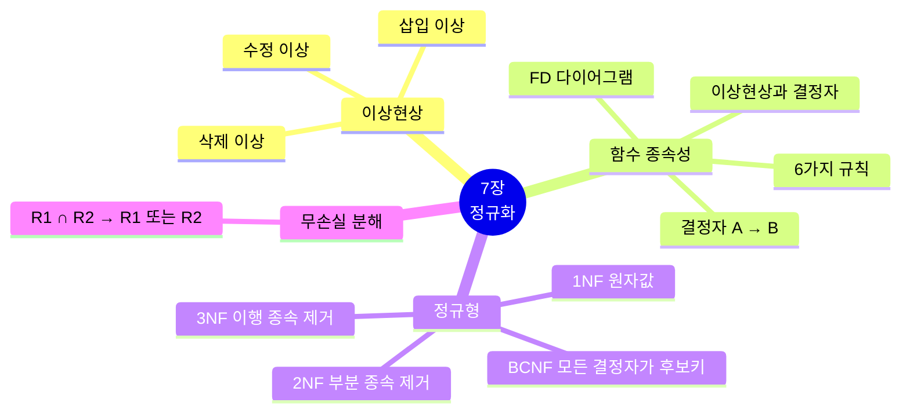

---

## 1. 이상현상 (anomaly)

### 1.1 이상현상의 개념

> 잘못 설계된 테이블에서 데이터를 삭제·삽입·수정할 때 생기는 **예상하지 못한 문제**

| 이상현상 | 발생 상황 | 결과 |
|---|---|---|
| **삭제 이상** (deletion anomaly) | 투플을 삭제할 때 **함께 저장된 다른 정보까지** 삭제 | 연쇄 삭제(triggered deletion) |
| **삽입 이상** (insertion anomaly) | 투플을 삽입할 때 **값이 없는 속성에 NULL**을 넣어야 함 | NULL 값 문제 |
| **수정 이상** (update anomaly) | 중복된 데이터 중 **일부만 수정**되어 불일치 | 불일치(inconsistency) |

**마당서점으로 미리 보기** — 주문 정보를 한 테이블에 모두 넣었다면?

```sql
-- 조인 결과를 그대로 테이블로 저장한 "잘못된 설계"
CREATE TABLE OrderAll AS
SELECT o.orderid, c.custid, c.name, c.address, b.bookname, b.publisher, o.saleprice
FROM   Orders o JOIN Customer c ON o.custid = c.custid
                JOIN Book     b ON o.bookid = b.bookid;

SELECT orderid, name, address FROM OrderAll WHERE name = '박지성';
```

| orderid | name | address |
|---:|---|---|
| 1 | 박지성 | 영국 맨체스터 |
| 2 | 박지성 | 영국 맨체스터 |
| 6 | 박지성 | 영국 맨체스터 |

> 박지성의 주소가 **3번 중복** 저장됩니다. 주소가 바뀌면 3행을 모두 고쳐야 하고(수정 이상), 박지성의 주문을 모두 지우면 박지성이라는 고객 정보도 사라지며(삭제 이상), 주문이 없는 신규 고객은 넣을 수 없습니다(삽입 이상). 정규화된 `Customer`·`Book`·`Orders` 구조에서는 이런 일이 없습니다.

### 1.2 잘못 설계된 계절학기 수강 테이블 실습

`Summer(sid, class, price)` — 학생번호, 강좌이름, 수강료를 한 테이블에 저장

```sql
DROP TABLE IF EXISTS Summer;
CREATE TABLE Summer (
    sid   INT,
    class VARCHAR(20),
    price INT
);
INSERT INTO Summer VALUES (100, 'FORTRAN', 20000);
INSERT INTO Summer VALUES (150, 'PASCAL',  15000);
INSERT INTO Summer VALUES (200, 'C',       10000);
INSERT INTO Summer VALUES (250, 'FORTRAN', 20000);

SELECT * FROM Summer;
```

| sid | class | price |
|---:|---|---:|
| 100 | FORTRAN | 20000 |
| 150 | PASCAL | 15000 |
| 200 | C | 10000 |
| 250 | FORTRAN | 20000 |

```sql
-- 이 테이블로 할 수 있는 질의
SELECT sid, class FROM Summer;                         -- 계절학기 듣는 학생과 강좌
SELECT price FROM Summer WHERE class = 'C';            -- C 강좌의 수강료 → 10000
SELECT DISTINCT class FROM Summer WHERE price = (SELECT MAX(price) FROM Summer);  -- 가장 비싼 강좌 → FORTRAN
SELECT COUNT(*) FROM Summer;                           -- 수강 학생 수 → 4
```

#### 삭제 이상

> **질의 7-1** 200번 학생의 계절학기 수강신청을 취소하시오.

```sql
SELECT price FROM Summer WHERE class = 'C';     -- 삭제 전: 10000
DELETE FROM Summer WHERE sid = 200;
SELECT price FROM Summer WHERE class = 'C';     -- 삭제 후: 결과 없음 ❗
```

> C 강좌 수강료(10000원)라는 **다른 정보까지 함께 사라졌습니다.**

```sql
INSERT INTO Summer VALUES (200, 'C', 10000);    -- 다음 실습을 위해 복구
```

#### 삽입 이상

> **질의 7-2** 계절학기에 새로운 자바 강좌를 개설하시오. (수강료 25000원, 아직 신청 학생 없음)

```sql
INSERT INTO Summer VALUES (NULL, 'JAVA', 25000);   -- 학생이 없으므로 sid에 NULL ❗

SELECT COUNT(*)   FROM Summer;     -- 5  (JAVA 행까지 학생으로 셈)
SELECT COUNT(sid) FROM Summer;     -- 4
SELECT *          FROM Summer;
```

> 강좌만 개설하려 해도 **학생번호에 NULL**을 넣어야 하고, 학생 수를 세는 질의의 결과가 달라집니다.

```sql
DELETE FROM Summer WHERE class = 'JAVA';           -- 다음 실습을 위해 복구
```

#### 수정 이상

> **질의 7-3** FORTRAN 강좌의 수강료를 20,000원에서 15,000원으로 수정하시오.

```sql
UPDATE Summer SET price = 15000 WHERE class = 'FORTRAN' AND sid = 100;   -- 한 행만 수정 ❗

SELECT * FROM Summer;
SELECT DISTINCT price FROM Summer WHERE class = 'FORTRAN';   -- 15000, 20000 → 불일치
```

| sid | class | price |
|---:|---|---:|
| 100 | FORTRAN | **15000** |
| 150 | PASCAL | 15000 |
| 250 | FORTRAN | **20000** |
| 200 | C | 10000 |

> 같은 FORTRAN 강좌의 수강료가 두 가지가 되었습니다. (`WHERE class = 'FORTRAN'`으로 모두 고치면 되지만, 중복이 있는 한 **실수할 여지**가 항상 남습니다.)

```sql
UPDATE Summer SET price = 20000 WHERE class = 'FORTRAN';     -- 복구
```

### 1.3 수정된 계절학기 수강 테이블

테이블을 **두 개로 분해**하면 이상현상이 사라집니다.

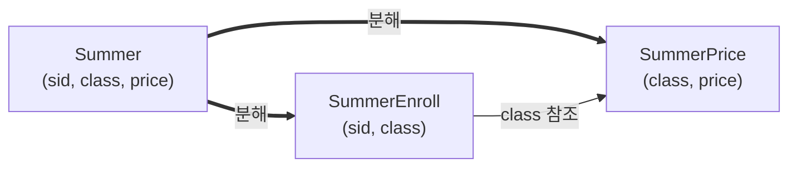

```sql
DROP TABLE IF EXISTS SummerEnroll, SummerPrice;

CREATE TABLE SummerPrice (
    class VARCHAR(20) PRIMARY KEY,
    price INT
);
CREATE TABLE SummerEnroll (
    sid   INT PRIMARY KEY,
    class VARCHAR(20),
    FOREIGN KEY (class) REFERENCES SummerPrice(class)
);

INSERT INTO SummerPrice VALUES ('FORTRAN', 20000), ('PASCAL', 15000), ('C', 10000);
INSERT INTO SummerEnroll VALUES (100, 'FORTRAN'), (150, 'PASCAL'), (200, 'C'), (250, 'FORTRAN');
```

| 질의 | 분해 후 SQL | 결과 |
|---|---|---|
| **7-4** 200번 학생 수강 취소 (삭제 이상 없음) | `DELETE FROM SummerEnroll WHERE sid = 200;` | `SELECT price FROM SummerPrice WHERE class = 'C';` → **10000 유지** |
| **7-5** 자바 강좌 개설 (삽입 이상 없음) | `INSERT INTO SummerPrice VALUES ('JAVA', 25000);` | 학생번호 NULL 불필요, `COUNT(*) FROM SummerEnroll` = 학생 수 |
| **7-6** FORTRAN 수강료 수정 (수정 이상 없음) | `UPDATE SummerPrice SET price = 15000 WHERE class = 'FORTRAN';` | **한 행만** 바꾸면 끝 |

```sql
DELETE FROM SummerEnroll WHERE sid = 200;
SELECT price FROM SummerPrice WHERE class = 'C';                  -- 10000

INSERT INTO SummerPrice VALUES ('JAVA', 25000);
SELECT * FROM SummerPrice;                                        -- 4개 강좌

UPDATE SummerPrice SET price = 15000 WHERE class = 'FORTRAN';
SELECT e.sid, e.class, p.price
FROM   SummerEnroll e JOIN SummerPrice p ON e.class = p.class;    -- FORTRAN 학생 모두 15000
```

---

## 2. 함수 종속성

### 2.1 함수 종속성의 개념

> 속성 A의 값을 알면 속성 B의 값이 **유일하게** 정해질 때, **"B는 A에 함수 종속한다"** 또는 **"A가 B를 결정한다"** 라고 하고 **A → B** 로 씁니다. 이때 A를 **결정자**(determinant)라고 합니다.

설명을 위해 아래 **학생수강성적** 릴레이션을 사용합니다.

| 학생번호 | 학생이름 | 주소 | 학과 | 학과사무실 | 강좌이름 | 강의실 | 성적 |
|---:|---|---|---|---|---|---|---:|
| 501 | 박지성 | 영국 맨체스터 | 컴퓨터과 | 공학관 101 | 데이터베이스 | 공학관 110 | 3.5 |
| 401 | 김연아 | 대한민국 서울 | 체육학과 | 체육관 101 | 데이터베이스 | 공학관 110 | 4.0 |
| 402 | 장미란 | 대한민국 강원도 | 체육학과 | 체육관 101 | 스포츠경영학 | 체육관 103 | 3.5 |
| 502 | 추신수 | 미국 클리블랜드 | 컴퓨터과 | 공학관 101 | 자료구조 | 공학관 111 | 4.0 |
| 501 | 박지성 | 영국 맨체스터 | 컴퓨터과 | 공학관 101 | 자료구조 | 공학관 111 | 3.5 |

| 종속하는 예 ✅ | 종속하지 않는 예 ❌ |
|---|---|
| 학생번호 → 학생이름 | 학생이름 → 강좌이름 (박지성은 두 강좌) |
| 학생번호 → 주소 | 학과 → 학생번호 (컴퓨터과에 여러 학생) |
| 강좌이름 → 강의실 | |
| 학과 → 학과사무실 | |
| (학생번호, 강좌이름) → 성적 | |

> ⚠️ **"학생이름 → 학과"는 지금 데이터에서는 성립하는 것처럼 보이지만**, 동명이인이 입학하면 깨집니다. 함수 종속성은 *현재 데이터*가 아니라 *업무 규칙(의미)* 으로 판단합니다.

### 2.2 함수 종속성 다이어그램

속성은 직사각형, 종속성은 화살표, 복합 속성은 직사각형으로 묶어 표시합니다.

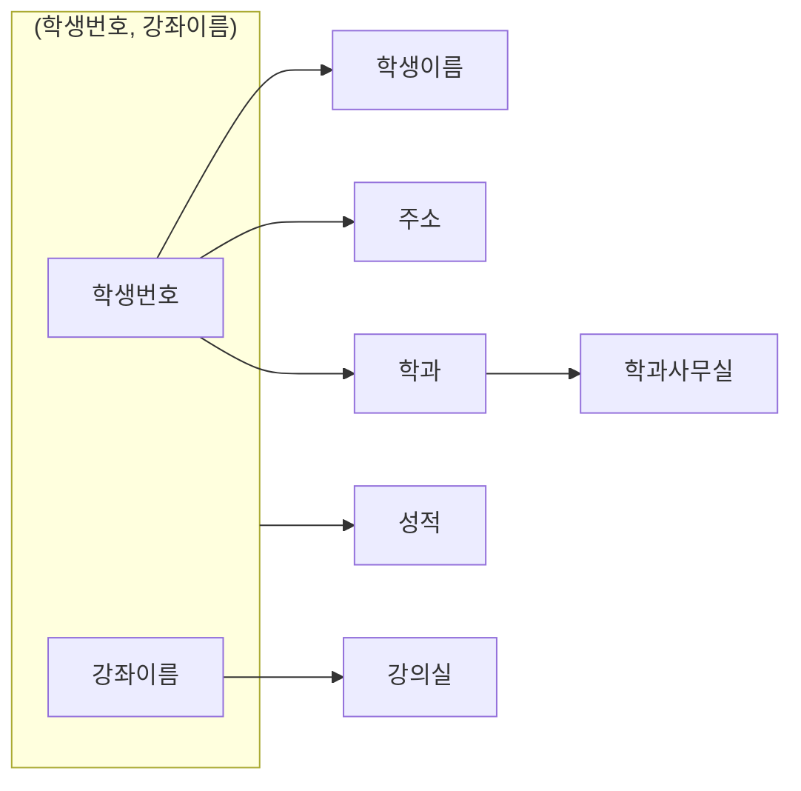

### 2.3 함수 종속성 규칙 (암스트롱 공리 포함)

| 규칙 | 형식 | 학생수강성적 예 |
|---|---|---|
| **부분집합 규칙** (반사) | Y ⊆ X 이면 X → Y | (학과, 주소) → 학과 |
| **증가 규칙** | X → Y 이면 XZ → YZ | 학생번호 → 학생이름 이므로 (학생번호, 강좌이름) → (학생이름, 강좌이름) |
| **이행 규칙** | X → Y, Y → Z 이면 X → Z | 학생번호 → 학과, 학과 → 학과사무실 이므로 학생번호 → 학과사무실 |
| **결합 규칙** | X → Y, X → Z 이면 X → YZ | 학생번호 → (학생이름, 주소) |
| **분해 규칙** | X → YZ 이면 X → Y, X → Z | 학생번호 → 학생이름, 학생번호 → 주소 |
| **유사이행 규칙** | X → Y, WY → Z 이면 WX → Z | 학생이름 → 학생번호(동명이인 없다고 가정), (강좌이름, 학생번호) → 성적 이므로 (강좌이름, 학생이름) → 성적 |

### 2.4 함수 종속성과 기본키

- 릴레이션의 함수 종속성을 파악하려면 **먼저 기본키를 찾습니다.**
- 기본키는 릴레이션의 **모든 속성을 결정**합니다. (학생수강성적의 기본키 = (학생번호, 강좌이름))
- **이상현상은 "기본키가 아니면서 결정자인 속성"이 있을 때 생깁니다.**

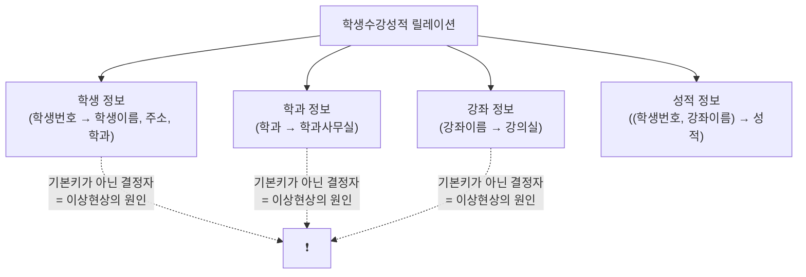

### 2.5 이상현상과 결정자 — 릴레이션 분해

> 분해할 때 **부분 릴레이션의 결정자는 원래 릴레이션에 남겨 두어야** 분해된 릴레이션끼리 다시 관계를 맺을 수 있습니다.

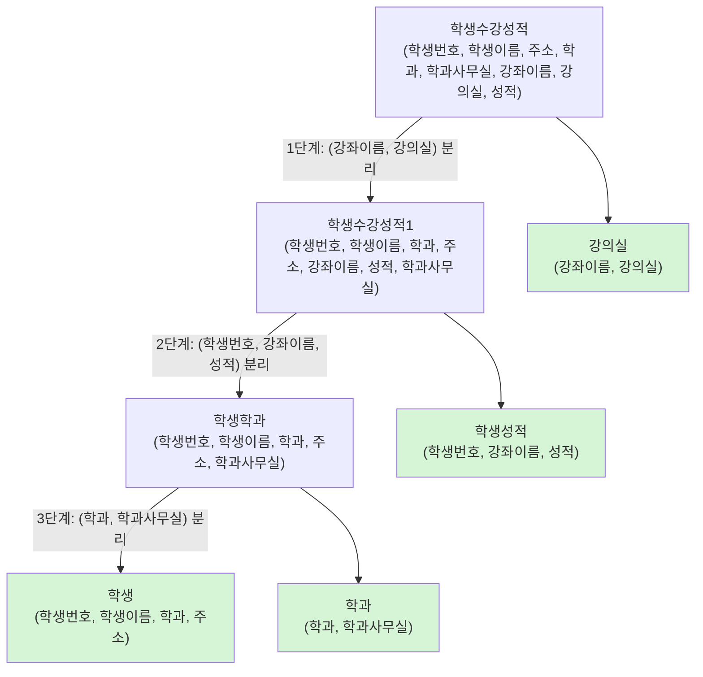

**최종 결과**: 학생(<u>학생번호</u>, 학생이름, 학과, 주소) · 학과(<u>학과</u>, 학과사무실) · 학생성적(<u>학생번호, 강좌이름</u>, 성적) · 강의실(<u>강좌이름</u>, 강의실)

### 2.6 함수 종속성 예제

> **예제 7-1** 다음 릴레이션 R에서 주어진 함수 종속성이 성립하는지 살펴보시오.

| A | B | C |
|---|---|---|
| e | i | f |
| e | b | h |
| g | i | f |
| k | b | h |

| 함수 종속성 | 성립? | 이유 |
|---|:---:|---|
| ① A → B | ❌ | A의 e에 대해 B가 i와 b 두 개 |
| ② B → C | ✅ | B의 각 값(i→f, b→h)에 C가 하나씩 |
| ③ (B, C) → A | ❌ | (i, f)에 대해 A가 e와 g |
| ④ (A, B) → C | ✅ | 모든 (A, B) 값이 서로 다름 |

```sql
-- SQL로 함수 종속성 X → Y 검사: X 값마다 Y 값이 1개인지 확인 (결과가 0행이면 성립)
CREATE TABLE R (A CHAR(1), B CHAR(1), C CHAR(1));
INSERT INTO R VALUES ('e','i','f'), ('e','b','h'), ('g','i','f'), ('k','b','h');

SELECT A FROM R GROUP BY A HAVING COUNT(DISTINCT B) > 1;        -- A → B : e 가 나옴 → 불성립
SELECT B FROM R GROUP BY B HAVING COUNT(DISTINCT C) > 1;        -- B → C : 0행 → 성립
SELECT B, C FROM R GROUP BY B, C HAVING COUNT(DISTINCT A) > 1;  -- (B,C) → A : (b,h), (i,f) 가 나옴 → 불성립
SELECT A, B FROM R GROUP BY A, B HAVING COUNT(DISTINCT C) > 1;  -- (A,B) → C : 0행 → 성립

DROP TABLE R;
```

> **예제 7-2** 다음 릴레이션 R에서 성립하는 함수 종속성을 모두 찾고, 후보키를 구하시오.

| A | B | C | D |
|---|---|---|---|
| a1 | b1 | c1 | d1 |
| a1 | b2 | c2 | d2 |
| a2 | b1 | c1 | d3 |
| a2 | b2 | c2 | d4 |

| 결정자 수 | 성립하는 함수 종속성 (당연히 성립하는 것 제외) |
|---|---|
| 1개 | B → C, C → B, D → A, D → B, D → C |
| 2개 | (A, B) → D, (A, C) → D |

→ **후보키**: D, (A, B), (A, C) — 이 중 하나를 기본키로 선택

---

## 3. 정규화 (normalization)

### 3.1 정규화의 개념과 정규형

> **정규화**: 이상현상이 있는 릴레이션을 **분해**하여 이상현상을 없애는 과정. 정규형(normal form)이 높을수록 이상현상은 줄어듭니다.

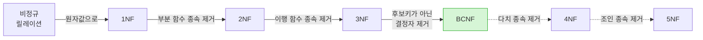

| 정규형 | 조건 | 제거하는 것 |
|---|---|---|
| **1NF** | 모든 속성 값이 **원자값** | 반복 그룹, 다중값 |
| **2NF** | 1NF + 기본키가 아닌 속성이 기본키에 **완전 함수 종속** | 부분 함수 종속 |
| **3NF** | 2NF + 기본키가 아닌 속성이 기본키에 **비이행적으로 종속**(직접 종속) | 이행 함수 종속 |
| **BCNF** | **모든 결정자가 후보키** | 후보키가 아닌 결정자 |

### 3.2 제1정규형 (1NF)

> 릴레이션 R의 **모든 속성 값이 원자값**을 가지면 제1정규형


```sql
-- 1NF: 한 칸에 하나의 값만
CREATE TABLE CustomerHobby (
    name  VARCHAR(40),
    hobby VARCHAR(20),
    PRIMARY KEY (name, hobby)
);
```

> 💡 `'인터넷, 영화'`처럼 쉼표로 이어 저장하면 "영화를 좋아하는 고객"을 찾을 때 `LIKE '%영화%'`를 써야 하고 인덱스도 쓸 수 없습니다.

### 3.3 제2정규형 (2NF)

> 1NF이고, 기본키가 아닌 속성이 **기본키에 완전 함수 종속**하면 제2정규형

- **완전 함수 종속**: B가 A **전체**에 종속하고, A의 **부분집합에는 종속하지 않음**

**수강강좌** 릴레이션 — 기본키 (학생번호, 강좌이름)

| 학생번호 | 강좌이름 | 강의실 | 성적 |
|---:|---|---|---:|
| 501 | 데이터베이스 | 공학관 110 | 3.5 |
| 401 | 데이터베이스 | 공학관 110 | 4.0 |
| 402 | 스포츠경영학 | 체육관 103 | 3.5 |
| 502 | 자료구조 | 공학관 111 | 4.0 |
| 501 | 자료구조 | 공학관 111 | 3.5 |

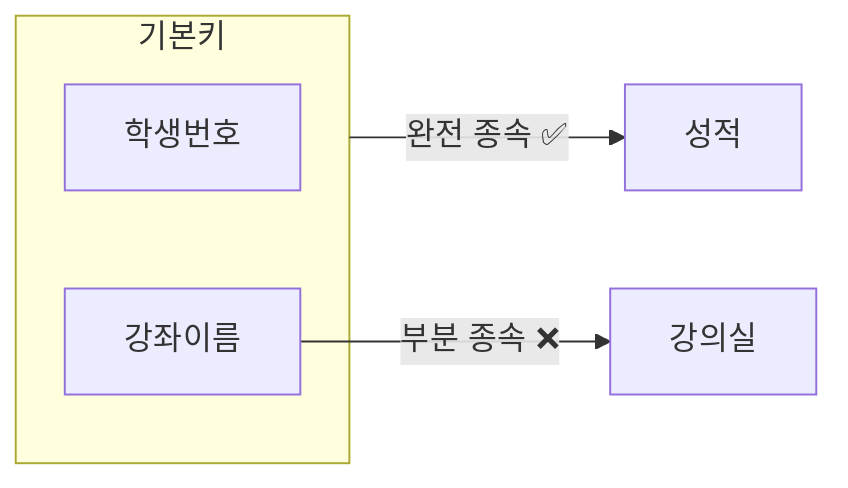

> 강의실은 기본키의 **일부(강좌이름)** 에만 종속 → **2NF 위반**. 데이터베이스 강의실이 바뀌면 여러 행을 고쳐야 합니다.

**2NF로 분해**: 수강(<u>학생번호, 강좌이름</u>, 성적) + 강의실(<u>강좌이름</u>, 강의실)

> 💡 **일반적 정의**: 후보키가 여러 개라면 "모든 **비주요 속성**(어떤 후보키에도 속하지 않는 속성)이 **각 후보키**에 완전 함수 종속"해야 2NF입니다.

### 3.4 제3정규형 (3NF)

> 2NF이고, 기본키가 아닌 속성이 기본키에 **비이행적**(직접)으로 종속하면 제3정규형

- **이행적 종속**: A → B, B → C 가 성립해서 A → C 가 되는 것

**계절학기** 릴레이션 — 학생은 한 강좌만 신청할 수 있다고 가정, 기본키 학생번호

| 학생번호 | 강좌이름 | 수강료 |
|---:|---|---:|
| 501 | 데이터베이스 | 20000 |
| 401 | 데이터베이스 | 20000 |
| 402 | 스포츠경영학 | 15000 |
| 502 | 자료구조 | 25000 |

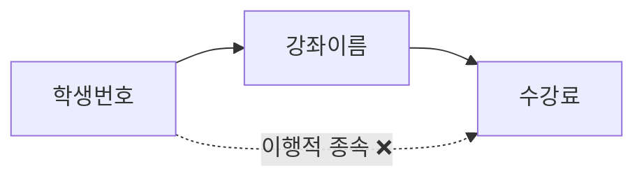

> 앞에서 본 `Summer` 테이블이 바로 이 경우입니다. **3NF로 분해**: 계절수강(<u>학생번호</u>, 강좌이름) + 수강료(<u>강좌이름</u>, 수강료) → `SummerEnroll` + `SummerPrice`

### 3.5 BCNF (Boyce-Codd 정규형)

> 릴레이션 R에서 함수 종속성 X → Y가 성립할 때 **모든 결정자 X가 후보키**이면 BCNF

**특강수강** 릴레이션 — 업무 규칙: ① 교수는 1개의 특강만 담당한다. ② 학생은 같은 이름의 특강을 1개만 신청할 수 있다.

| 학생번호 | 특강이름 | 교수 |
|---:|---|---|
| 501 | 소셜네트워크 | 김교수 |
| 401 | 소셜네트워크 | 김교수 |
| 402 | 인간과 동물 | 승교수 |
| 502 | 창업전략 | 박교수 |
| 501 | 창업전략 | 홍교수 |

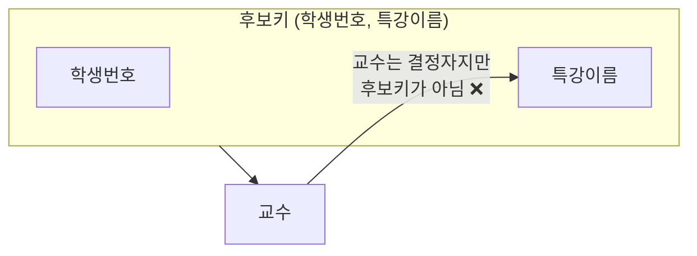

| 질문 | 답 |
|---|---|
| 후보키는? | (학생번호, 특강이름), (학생번호, 교수) |
| 몇 정규형? | **3NF** (모든 속성이 어떤 후보키에 속하는 주요 속성이므로 2NF·3NF 조건 위반 없음) |
| 이상현상은? | 있음 — 새 특강을 맡을 교수를 학생 없이 넣을 수 없음, 김교수의 특강명 변경 시 여러 행 수정 |

**BCNF로 분해**: 특강신청(<u>학생번호, 교수</u>) + 특강교수(<u>교수</u>, 특강이름)

> ⚠️ **BCNF 분해의 대가 — 함수 종속성 유지 문제**: 분해 후에는 (학생번호, 특강이름) → 교수 종속성을 한 테이블에서 검사할 수 없습니다. 예를 들어 특강신청에 (501, 박교수)와 (501, 홍교수)를 둘 다 넣으면, 조인했을 때 501번 학생이 창업전략을 두 번 신청한 것이 되어 규칙 ②를 어기게 됩니다. 이런 경우 실무에서는 3NF에 머무르거나 트리거·애플리케이션으로 규칙을 검사합니다.

### 3.6 무손실 분해 (lossless-join decomposition)

> 릴레이션 R을 R1, R2로 분해한 뒤 **다시 자연조인했을 때 원래 R이 되면** 무손실 분해
>
> 조건: **R1 ∩ R2 → R1** 또는 **R1 ∩ R2 → R2** (공통 속성이 어느 한쪽의 키)

```sql
-- Summer(sid, class, price)를 두 가지 방법으로 분해해 보자
-- [분해 1] R1(sid, class), R2(class, price)  : 공통 속성 class → price 이므로 무손실
-- [분해 2] R3(sid, price), R4(class, price)  : 공통 속성 price 는 어느 쪽의 키도 아님 → 손실

CREATE TABLE R3 AS SELECT DISTINCT sid, price  FROM Summer;
CREATE TABLE R4 AS SELECT DISTINCT class, price FROM Summer;

SELECT r3.sid, r4.class, r3.price
FROM   R3 r3 JOIN R4 r4 ON r3.price = r4.price
ORDER  BY sid;
```

| sid | class | price | |
|---:|---|---:|---|
| 100 | FORTRAN | 20000 | |
| 150 | PASCAL | 15000 | |
| 200 | C | 10000 | |
| 250 | FORTRAN | 20000 | |

> 현재 데이터에서는 강좌마다 수강료가 달라서 원래대로 돌아오지만, **수강료가 같은 강좌**가 생기면(예: PASCAL과 C가 모두 15000원) 조인 결과에 **원래 없던 투플**(의미 없는 투플)이 생깁니다.

```sql
UPDATE R4 SET price = 15000 WHERE class = 'C';
UPDATE R3 SET price = 15000 WHERE sid = 200;

SELECT r3.sid, r4.class, r3.price
FROM   R3 r3 JOIN R4 r4 ON r3.price = r4.price
ORDER  BY sid;
-- 150 | PASCAL, 150 | C ❗, 200 | PASCAL ❗, 200 | C  → 손실(lossy) 분해

DROP TABLE R3, R4;
```

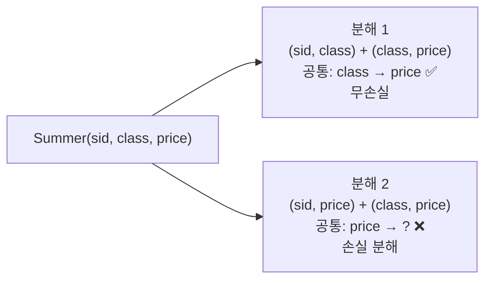

### 3.7 정규화 정리

| 정규형 | 위반 원인 | 해결 |
|---|---|---|
| 1NF | 다중값·반복 그룹 | 원자값으로 분리 |
| 2NF | **부분** 함수 종속 (키의 일부 → 속성) | 부분 키와 종속 속성을 분리 |
| 3NF | **이행** 함수 종속 (키 → A → B) | A와 B를 분리 |
| BCNF | 후보키가 아닌 **결정자** | 결정자와 종속 속성을 분리 |

> 대부분의 릴레이션은 **BCNF까지** 정규화하면 실제적인 이상현상이 없어지므로, 보통 BCNF(또는 3NF)까지 진행합니다. 반대로 조회 성능을 위해 일부러 정규형을 낮추는 것을 **반정규화**(denormalization)라고 합니다.

### 3.8 정규화 예제

> **예제 7-3** R(A, B, C, D), 함수 종속성: A → B, B → C, C → D

| 질문 | 답 |
|---|---|
| ① 후보키 | **A** (A → B → C → D) |
| ② 몇 정규형? | **2NF** — 키가 단일 속성이라 부분 종속은 없지만, A → B → C 같은 **이행 종속**이 있어 3NF 위반 |
| ③ R1(A, B, C), R2(C, D)는 무손실 분해? | **예** — R1 ∩ R2 = C, C → D 이므로 C → R2 |

> **예제 7-4** R(A, B, C), 함수 종속성: (A, B) → C, C → A

| 질문 | 답 |
|---|---|
| ① 후보키 | **(A, B)**, **(B, C)** — C → A 이므로 (B, C) → A, C |
| ② 몇 정규형? | **3NF** — 모든 속성이 주요 속성. 결정자 C가 후보키가 아니므로 BCNF는 아님 |
| ③ R1(B, C), R2(A, C)는 무손실 분해? | **예** — R1 ∩ R2 = C, C → A 이므로 C → R2 (단, (A, B) → C 종속성은 유지되지 않음) |

> **예제 7-5** R(A, B, C, D), 함수 종속성: (A, B) → C, C → A, C → D

| 질문 | 답 |
|---|---|
| ① 후보키 | **(A, B)**, **(B, C)** |
| ② 몇 정규형? | **1NF** — 비주요 속성 D가 후보키 (B, C)의 **일부인 C에 종속**(부분 종속) → 2NF 위반 |
| ③ R1(A, B, C), R2(C, D)는 무손실 분해? | **예** — R1 ∩ R2 = C, C → D 이므로 C → R2 |

---

## 4. 정규화 연습 — 부동산 데이터베이스

`부동산(필지번호, 주소, 공시지가, 소유자이름, 주민등록번호, 전화번호)`

| 업무 규칙 | 함수 종속성 |
|---|---|
| 필지번호로 땅이 정해진다 | 필지번호 → 주소, 공시지가 |
| 주민등록번호로 사람이 정해진다 | 주민등록번호 → 소유자이름, 전화번호 |

### [사례 1] 공동 소유 — 한 필지를 여러 사람이 소유

기본키는 (필지번호, 주민등록번호). 주소·공시지가는 필지번호에만, 소유자 정보는 주민등록번호에만 종속(**부분 종속**) → 2NF 위반

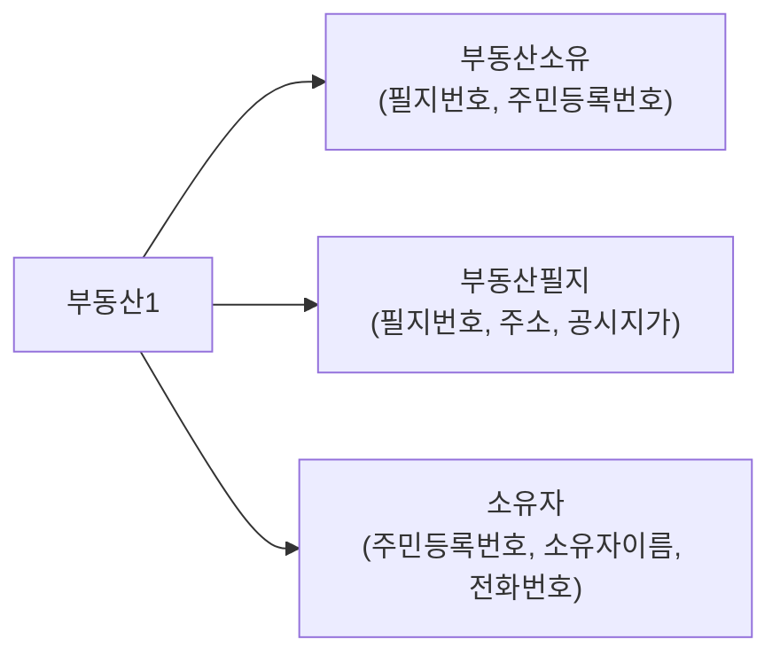

### [사례 2] 단독 소유 — 한 필지를 한 사람만 소유

기본키는 필지번호. 필지번호 → 주민등록번호 → 소유자이름 (**이행 종속**) → 3NF 위반

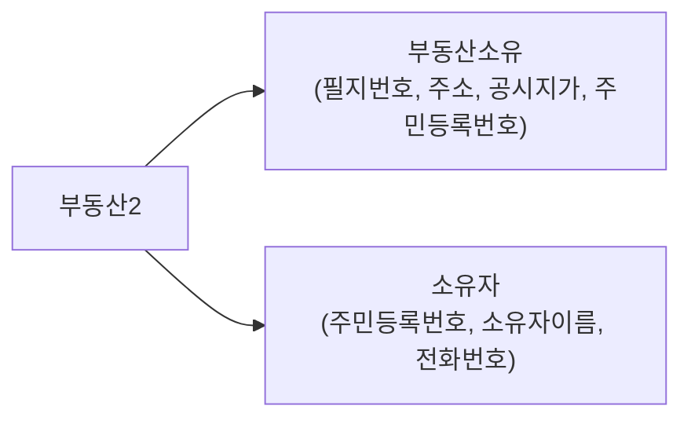

<details>
<summary><b>💾 사례 1 MySQL DDL</b></summary>

```sql
CREATE TABLE Owner (
    rrn   CHAR(14) PRIMARY KEY,       -- 주민등록번호
    oname VARCHAR(20) NOT NULL,
    phone VARCHAR(20)
);
CREATE TABLE Parcel (
    pno        INT PRIMARY KEY,       -- 필지번호
    address    VARCHAR(100),
    land_price INT                    -- 공시지가
);
CREATE TABLE Ownership (
    pno INT,
    rrn CHAR(14),
    PRIMARY KEY (pno, rrn),
    FOREIGN KEY (pno) REFERENCES Parcel(pno),
    FOREIGN KEY (rrn) REFERENCES Owner(rrn)
);
```
</details>

---

## 📝 핵심 요약

| # | 키워드 | 한 줄 정리 |
|:---:|---|---|
| 1 | 이상현상 | 삭제(연쇄 삭제) · 삽입(NULL) · 수정(불일치) |
| 2 | 함수 종속성 | A → B : A 값이 B 값을 유일하게 결정, A는 결정자 |
| 3 | FD 규칙 | 부분집합 · 증가 · 이행 · 결합 · 분해 · 유사이행 |
| 4 | 이상현상 원인 | **기본키가 아니면서 결정자**인 속성 |
| 5 | 1NF | 모든 속성이 원자값 |
| 6 | 2NF | 부분 함수 종속 제거 (완전 함수 종속) |
| 7 | 3NF | 이행 함수 종속 제거 |
| 8 | BCNF | 모든 결정자가 후보키 (종속성 유지가 안 될 수 있음) |
| 9 | 무손실 분해 | R1 ∩ R2 → R1 또는 R1 ∩ R2 → R2 |
| 10 | 실무 | 보통 BCNF(3NF)까지, 성능을 위해 반정규화도 고려 |

---

## ✅ 확인 문제

<details>
<summary>1. 정규화의 필요성으로 거리가 먼 것은? ① 데이터 구조의 안정성 최대화 ② 중복 데이터의 활성화 ③ 수정·삭제 시 이상현상 최소화 ④ 테이블 불일치 위험 최소화</summary>

**②** — 정규화는 중복을 **줄이는** 과정입니다.
</details>

<details>
<summary>2. 정규화에 대한 설명으로 옳지 않은 것은? ① 정규화를 안 하면 이상현상이 발생할 수 있다 ② 정규화의 목적은 분산된 종속성을 하나의 릴레이션에 통합하는 것이다 ③ 이상현상은 함수 종속성이 원인이다 ④ 잘못된 정규화는 불필요한 중복을 야기한다</summary>

**②** — 정규화는 여러 종속성이 섞인 릴레이션을 **분해**하는 것입니다.
</details>

<details>
<summary>3. 이상현상에 관한 설명으로 옳지 않은 것은? ① 여러 종속관계가 하나의 릴레이션에 있을 때 발생 ② 여러 릴레이션을 하나로 결합해서 해결 ③ 삭제·삽입·수정 이상이 있다 ④ 중복성과 종속성을 배제하여 제거</summary>

**②** — 결합이 아니라 **분해**해서 해결합니다.
</details>

<details>
<summary>4. [SQL] 마당서점의 OrderAll(orderid, custid, name, address, bookname, publisher, saleprice) 테이블에서 성립하는 함수 종속성과 이상현상을 설명하고, 어떻게 분해해야 하는지 쓰시오.</summary>

- orderid → 모든 속성 (기본키)
- custid → name, address (기본키가 아닌 결정자 → 이행 종속, 3NF 위반)
- bookname → publisher (이행 종속)

분해: Orders(orderid, custid, bookid, saleprice) + Customer(custid, name, address) + Book(bookid, bookname, publisher) → 원래 마당서점 구조
</details>

<details>
<summary>5. R(A, B, C)에서 A → B, B → C가 성립한다. R1(A, B), R2(A, C)로 분해하면 무손실 분해인가?</summary>

**예** — R1 ∩ R2 = A, A는 R1의 키(A → B)이므로 무손실입니다. 다만 B → C 종속성은 어느 릴레이션에서도 검사할 수 없으므로 **종속성 보존**은 되지 않습니다. 더 좋은 분해는 R1(A, B), R2(B, C) 입니다.
</details>

---

> 📚 출처: 한빛아카데미 「데이터베이스 개론과 실습」 7장 강의교안을 참고하여 요약·재구성. 모든 그림은 Mermaid로 새로 작성, 예제 데이터 일부는 설명을 위해 새로 구성, SQL은 MySQL 8.0 기준.

[🏠 목차](README.md) · ◀ 이전 [6장 데이터 모델링](06장_데이터_모델링.md) · 다음 ▶ [8장 트랜잭션, 동시성 제어, 회복](08장_트랜잭션_동시성제어_회복.md)
