[🏠 목차](README.md) · ◀ 이전 [7장 정규화](07장_정규화.md) · 다음 ▶ [9장 데이터베이스 보안과 관리](09장_데이터베이스_보안과_관리.md)

# Chapter 08. 트랜잭션, 동시성 제어, 회복

> **이 장의 위치**: SQL 실습의 **최고급 단계**입니다. 여러 SQL을 하나의 작업 단위로 묶는 **트랜잭션**, 여러 사용자가 동시에 같은 데이터를 다룰 때의 **동시성 제어(락·고립 수준)**, 장애가 났을 때 데이터를 되살리는 **회복**을 배웁니다.
> 모든 실습은 **MySQL 8.0(InnoDB)** 에서 **두 개의 세션**을 열어 직접 재현하며, 이 노트의 결과는 실제 실행 결과입니다.

---

## 📌 학습 목표

- [ ] 트랜잭션의 개념과 ACID 성질을 설명하고 `START TRANSACTION`·`COMMIT`·`ROLLBACK`·`SAVEPOINT`를 사용할 수 있다.
- [ ] 갱신손실 문제와 락(공유락·배타락), 2단계 락킹, 데드락을 이해하고 MySQL에서 재현할 수 있다.
- [ ] 오손 읽기·반복불가능 읽기·유령데이터 읽기와 네 가지 트랜잭션 고립 수준의 관계를 설명할 수 있다.
- [ ] 로그 파일과 체크포인트를 이용한 회복(REDO·UNDO) 방법을 설명할 수 있다.

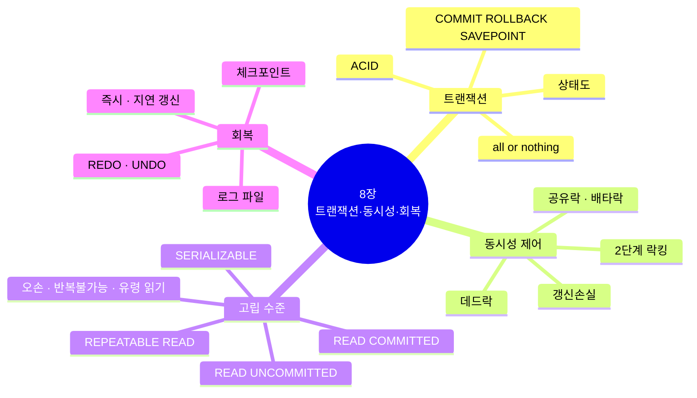

---

## 0. 실습 준비 — 두 개의 세션 열기

트랜잭션 동시 실행 실습은 **서로 다른 두 접속(세션)** 이 필요합니다.

| 방법 | 설명 |
|---|---|
| **MySQL Workbench** | 홈 화면에서 같은 접속(madang)을 **두 번 클릭**해 연결 탭을 2개 엽니다. (한 연결 안의 쿼리 탭은 같은 세션입니다) |
| **명령 프롬프트** | 창 두 개에서 각각 `mysql -u madang -p madang` 실행 |

```sql
-- 각 창에서 실행해 세션 번호가 서로 다른지 확인
SELECT CONNECTION_ID();
```

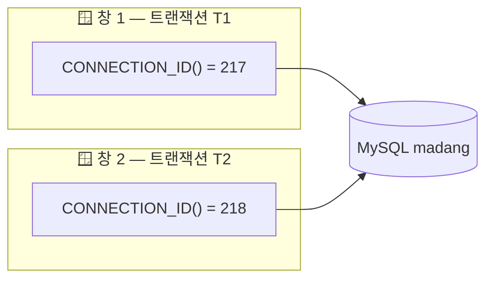

**실습용 계좌 테이블**

```sql
USE madang;
DROP TABLE IF EXISTS Account;
CREATE TABLE Account (
    accno   INT PRIMARY KEY,
    owner   VARCHAR(20),
    balance INT CHECK (balance >= 0)          -- 잔액은 음수가 될 수 없다
);
INSERT INTO Account VALUES (1, '박지성', 50000), (2, '김연아', 30000);
```

> ⚠️ MySQL은 기본이 **autocommit = 1**(문장마다 자동 커밋)입니다. 트랜잭션 실습에서는 반드시 `START TRANSACTION;`(또는 `BEGIN;`)으로 시작하세요. Workbench에서는 상단의 *자동 커밋 토글* 아이콘을 꺼도 됩니다.

---

## 1. 트랜잭션

### 1.1 트랜잭션의 개념

> **트랜잭션(transaction)**: DBMS에서 데이터를 다루는 **논리적인 작업의 단위**. 전체가 수행되거나 전혀 수행되지 않아야 합니다(**all or nothing**).

**트랜잭션을 정의하는 이유**

1. 장애가 일어났을 때 데이터를 **복구하는 작업의 단위**가 된다.
2. 여러 작업이 동시에 같은 데이터를 다룰 때 작업을 **서로 분리하는 단위**가 된다.

**예: 박지성 계좌에서 김연아 계좌로 10,000원 이체**

```sql
START TRANSACTION;
UPDATE Account SET balance = balance - 10000 WHERE accno = 1;   -- 박지성 출금
UPDATE Account SET balance = balance + 10000 WHERE accno = 2;   -- 김연아 입금
COMMIT;
```

> 출금만 되고 입금 전에 장애가 나면 10,000원이 **사라집니다.** 두 UPDATE는 반드시 **함께 성공하거나 함께 취소**되어야 합니다.

**트랜잭션 수행 과정 (버퍼와 디스크)**

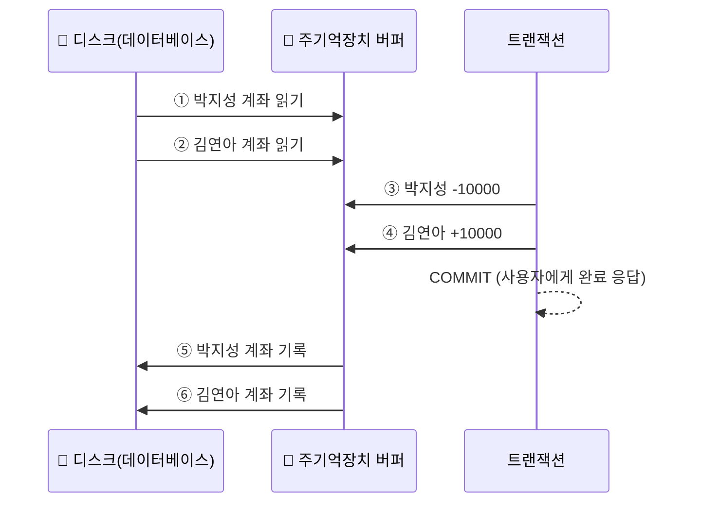

| 방법 | 순서 | 특징 |
|---|---|---|
| 방법 1 | ①-②-③-④-**COMMIT**-⑤-⑥ | 빠른 응답 → **DBMS가 선택** (디스크 기록은 나중에, 로그로 보장) |
| 방법 2 | ①-②-③-④-⑤-⑥-**COMMIT** | 디스크 기록까지 기다려야 하므로 느림 |

### 1.2 트랜잭션의 성질 — ACID

| 성질 | 의미 | DBMS의 담당 기능 |
|---|---|---|
| **A**tomicity 원자성 | 전부 수행되거나 전혀 수행되지 않음 (all or nothing) | **회복 관리자** (ROLLBACK, UNDO) |
| **C**onsistency 일관성 | 수행 전후에 데이터베이스가 일관된 상태 유지 | **무결성 제약조건** (PK, FK, CHECK) |
| **I**solation 고립성 | 수행 중인 트랜잭션에 다른 트랜잭션이 끼어들지 못함 | **동시성 제어** (락, 고립 수준) |
| **D**urability 지속성 | 완료된 트랜잭션의 결과는 영구히 저장 | **회복 관리자** (로그, REDO) |

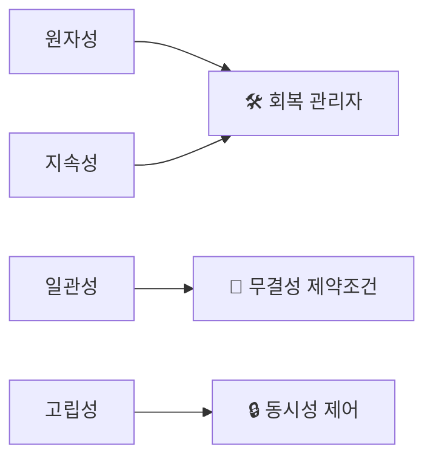

**일관성 예**: 이체 전후 두 계좌의 합(80,000원)은 같아야 합니다. `CHECK (balance >= 0)` 제약조건이 잔액보다 많은 출금을 막습니다.

### 1.3 트랜잭션 제어 명령 (TCL)

| 명령 | 의미 |
|---|---|
| `START TRANSACTION` / `BEGIN` | 트랜잭션 시작 (autocommit 일시 중지) |
| `COMMIT` | 변경 내용을 **영구 반영**하고 종료 |
| `ROLLBACK` | 변경 내용을 **모두 취소**하고 종료 |
| `SAVEPOINT 이름` | 트랜잭션 중간에 저장점 지정 |
| `ROLLBACK TO SAVEPOINT 이름` | 저장점 이후의 변경만 취소 |
| `SET autocommit = 0 / 1` | 자동 커밋 끄기 / 켜기 |

```sql
-- SAVEPOINT 실습
START TRANSACTION;
UPDATE Account SET balance = balance + 1    WHERE accno = 1;
SAVEPOINT sp1;
UPDATE Account SET balance = balance + 1000 WHERE accno = 2;
ROLLBACK TO SAVEPOINT sp1;          -- 김연아 +1000만 취소
COMMIT;                             -- 박지성 +1은 반영
```

> ⚠️ **DDL은 암묵적으로 커밋됩니다.** 트랜잭션 도중 `CREATE`, `ALTER`, `DROP`, `TRUNCATE`를 실행하면 그 전까지의 변경이 자동으로 COMMIT되어 ROLLBACK할 수 없습니다.

#### 🧪 실습 — 실패하면 자동 ROLLBACK 하는 이체 프로시저

```sql
-- 계좌를 처음 상태로
UPDATE Account SET balance = 50000 WHERE accno = 1;
UPDATE Account SET balance = 30000 WHERE accno = 2;

DROP PROCEDURE IF EXISTS Transfer;
DELIMITER //
CREATE PROCEDURE Transfer(IN fromAcc INT, IN toAcc INT, IN amount INT)
BEGIN
    DECLARE EXIT HANDLER FOR SQLEXCEPTION      -- 오류가 나면
    BEGIN
        ROLLBACK;                              -- 모두 취소
        SELECT '이체 실패 - ROLLBACK' AS 결과;
    END;

    START TRANSACTION;
    UPDATE Account SET balance = balance - amount WHERE accno = fromAcc;
    UPDATE Account SET balance = balance + amount WHERE accno = toAcc;
    COMMIT;
    SELECT '이체 성공 - COMMIT' AS 결과;
END //
DELIMITER ;

CALL Transfer(1, 2, 10000);      -- 이체 성공 - COMMIT
SELECT * FROM Account;           -- 박지성 40000, 김연아 40000

CALL Transfer(1, 2, 999999);     -- 잔액 부족 → CHECK 위반 → 이체 실패 - ROLLBACK
SELECT * FROM Account;           -- 박지성 40000, 김연아 40000 (변화 없음 = 원자성)
```

### 1.4 트랜잭션의 상태

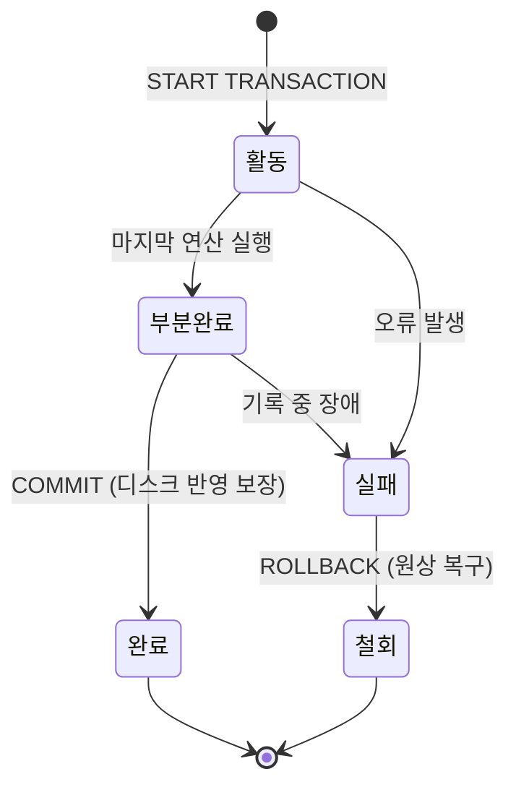

| 상태 | 의미 |
|---|---|
| 활동(active) | 트랜잭션이 실행 중 |
| 부분완료(partially committed) | 마지막 연산까지 실행했지만 아직 최종 반영 전 |
| 완료(committed) | 성공적으로 끝나 COMMIT 됨 |
| 실패(failed) | 오류로 더 이상 진행할 수 없음 |
| 철회(aborted) | ROLLBACK 되어 시작 전 상태로 복구 |

---

## 2. 동시성 제어

> **동시성 제어(concurrency control)**: 트랜잭션이 동시에 수행될 때 **일관성을 해치지 않도록** 트랜잭션의 데이터 접근을 제어하는 DBMS의 기능

### 2.1 갱신손실 문제 (lost update)

> 두 트랜잭션이 **한 개의 데이터를 동시에 갱신**할 때, 한쪽의 갱신이 다른 쪽에 의해 **덮어써져 사라지는** 문제. 데이터베이스에서 **절대 발생하면 안 되는** 현상입니다.

**시나리오**: 박지성 잔액 50,000원. T1은 10,000원 출금, T2는 10,000원 입금 → 올바른 결과는 **50,000원**

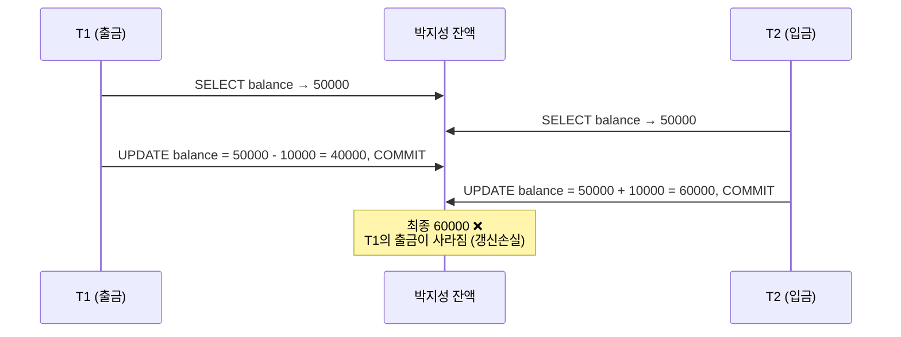

```sql
-- [창 1: T1]                                        -- [창 2: T2]
START TRANSACTION;
SELECT balance FROM Account WHERE accno = 1;  -- 50000
                                                     START TRANSACTION;
                                                     SELECT balance FROM Account WHERE accno = 1;  -- 50000
UPDATE Account SET balance = 40000 WHERE accno = 1;  -- 읽은 값 - 10000
COMMIT;
                                                     UPDATE Account SET balance = 60000 WHERE accno = 1;  -- 읽은 값 + 10000
                                                     COMMIT;
SELECT balance FROM Account WHERE accno = 1;  -- 60000 ❌ (갱신손실)
```

> 💡 응용 프로그램이 값을 **읽어서 계산한 뒤** 그 결과를 쓰는 방식이라 DBMS는 이 문제를 알 수 없습니다. 해결책은 아래의 **락**입니다.

### 2.2 락 (Lock)

> **락**: 데이터를 사용 중이라는 사실을 알리는 **잠금장치**. 락이 걸린 데이터는 다른 트랜잭션이 락을 얻을 때까지 **대기**해야 합니다.

**갱신손실 해결 — `SELECT … FOR UPDATE`로 배타락 걸기**

```sql
UPDATE Account SET balance = 50000 WHERE accno = 1;      -- 처음 상태로

-- [창 1: T1]                                        -- [창 2: T2]
START TRANSACTION;
SELECT balance FROM Account
WHERE accno = 1 FOR UPDATE;          -- 50000, 배타락 획득
                                                     START TRANSACTION;
                                                     SELECT balance FROM Account
                                                     WHERE accno = 1 FOR UPDATE;  -- ⏳ 대기...
UPDATE Account SET balance = 40000 WHERE accno = 1;
COMMIT;                              -- 락 해제
                                                     -- ▶ 대기 풀림: 40000 을 읽음
                                                     UPDATE Account SET balance = 50000 WHERE accno = 1;  -- 40000 + 10000
                                                     COMMIT;
SELECT balance FROM Account WHERE accno = 1;   -- 50000 ✅
```

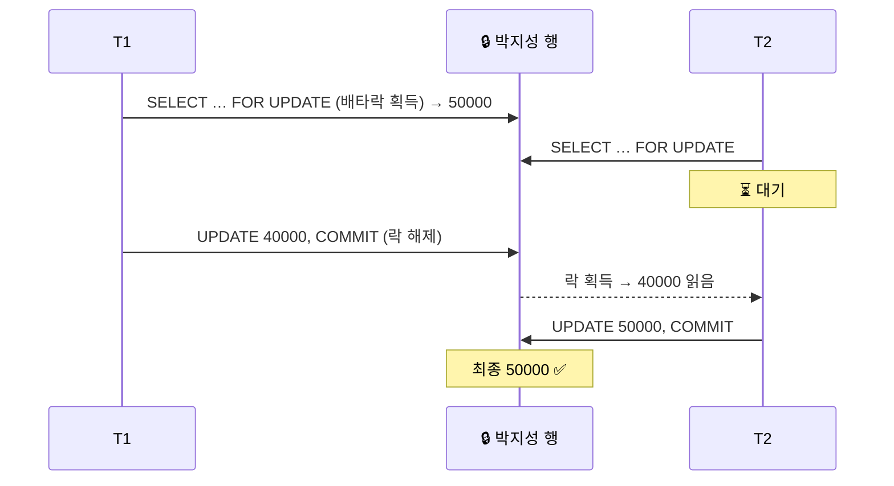

> 💡 `UPDATE Account SET balance = balance - 10000 …` 처럼 **SQL 안에서 계산**하면 UPDATE 자체가 배타락을 걸기 때문에 갱신손실이 생기지 않습니다. 문제는 *읽고 → 응용에서 계산하고 → 쓰는* 경우입니다.

**UPDATE끼리의 락 대기 확인 (마당서점 Book 테이블)**

```sql
-- [창 1: T1]                                        -- [창 2: T2]
START TRANSACTION;
UPDATE Book SET price = 7100 WHERE bookid = 1;
                                                     START TRANSACTION;
                                                     SELECT * FROM Book WHERE bookid = 1;   -- 7000 (읽기는 대기 없음*)
                                                     UPDATE Book SET price = price + 100
                                                     WHERE bookid = 1;                      -- ⏳ 대기...
COMMIT;
                                                     -- ▶ 대기 풀림
                                                     SELECT * FROM Book WHERE bookid = 1;   -- 7200
                                                     COMMIT;
```

\* InnoDB의 일반 `SELECT`는 락을 걸지 않고 **스냅샷(MVCC)** 을 읽으므로, 다른 트랜잭션이 수정 중이어도 대기하지 않고 **커밋된 이전 값(7000)** 을 봅니다.

> ⏱ 락을 너무 오래 기다리면 `ERROR 1205 (HY000): Lock wait timeout exceeded` 가 납니다. (기본 `innodb_lock_wait_timeout` = 50초)

#### 락의 유형 — 공유락과 배타락

| 락 | 기호 | 용도 | MySQL에서 거는 방법 |
|---|---|---|---|
| **공유락** (shared lock) | LS | **읽기**만 할 때 | `SELECT … FOR SHARE` (구 `LOCK IN SHARE MODE`) |
| **배타락** (exclusive lock) | LX | **읽고 쓰기**를 할 때 | `UPDATE`, `DELETE`, `INSERT`, `SELECT … FOR UPDATE` |

**락 호환성 규칙**

| 이미 걸린 락 → / 요청하는 락 ↓ | 없음 | 공유락(LS) | 배타락(LX) |
|---|:---:|:---:|:---:|
| **공유락(LS)** 요청 | ✅ 허용 | ✅ 허용 | ❌ 대기 |
| **배타락(LX)** 요청 | ✅ 허용 | ❌ 대기 | ❌ 대기 |

> 읽기끼리는 함께할 수 있지만(LS–LS), **쓰기가 끼면** 누군가는 기다려야 합니다.

### 2.3 2단계 락킹 (2PL, two-phase locking)

락을 걸고 해제하는 시점에 제한이 없으면, 락을 써도 일관성이 깨질 수 있습니다.

**예**: A = B = 1,000. T1은 A에서 100을 빼 B에 더하고(이체), T2는 A와 B에 각각 10%를 곱합니다(이자).

| 실행 방식 | 결과 (A, B) | 일관성 |
|---|---|:---:|
| 직렬 T1 → T2 | (990, 1210) | ✅ |
| 직렬 T2 → T1 | (1000, 1200) | ✅ |
| 병행 — 락은 썼지만 **2PL 아님** (T1이 A 락을 풀자마자 T2가 A, B를 모두 처리) | (990, 1200) | ❌ 어떤 직렬 결과와도 다름 |
| 병행 — **2PL 사용** | (990, 1210) 또는 (1000, 1200) | ✅ |

> **2단계 락킹 규칙**: 트랜잭션은 락을 **얻기만 하는 단계**와 **풀기만 하는 단계**로 나뉜다.
> - **확장 단계**(growing phase): 필요한 락을 획득만 하고, 해제하지 않는다.
> - **수축 단계**(shrinking phase): 락을 해제만 하고, 새로운 락을 획득하지 않는다.

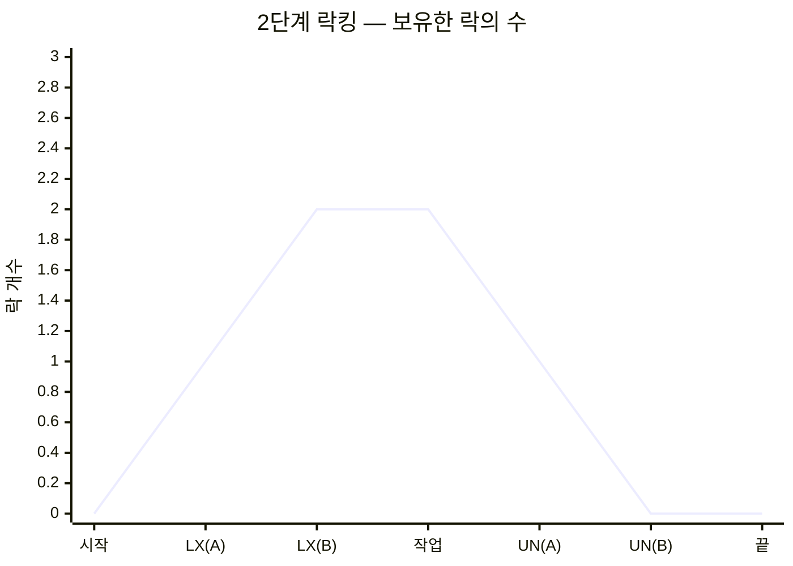

> InnoDB는 **엄격한 2단계 락킹**(strict 2PL)처럼 동작합니다. 트랜잭션이 얻은 행 락을 **COMMIT/ROLLBACK 할 때 한꺼번에 해제**하므로 수축 단계가 트랜잭션의 끝에 몰려 있습니다.

### 2.4 데드락 (deadlock, 교착상태)

> 두 개 이상의 트랜잭션이 각각 자신의 데이터에 락을 걸고, **상대방이 가진 데이터의 락을 요청**하면서 무한히 기다리는 상태

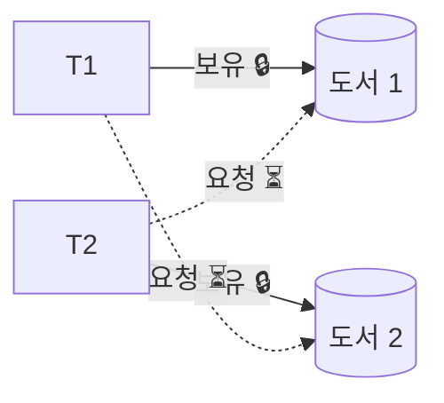

```sql
-- [창 1: T1]                                        -- [창 2: T2]
START TRANSACTION;
UPDATE Book SET price = price + 100
WHERE bookid = 1;                    -- 도서 1 락
                                                     START TRANSACTION;
                                                     UPDATE Book SET price = price * 1.1
                                                     WHERE bookid = 2;          -- 도서 2 락
UPDATE Book SET price = price + 100
WHERE bookid = 2;                    -- ⏳ 대기 (T2가 보유)
                                                     UPDATE Book SET price = price * 1.1
                                                     WHERE bookid = 1;          -- 데드락!
                                                     -- ERROR 1213 (40001): Deadlock found when
                                                     -- trying to get lock; try restarting transaction
-- ▶ T2가 희생되어 T1의 대기가 풀림
COMMIT;                              -- 도서1 +100, 도서2 +100 반영
                                                     ROLLBACK;                  -- (이미 롤백됨)
```

**데드락 해결**: DBMS가 데드락을 **감지**하면 둘 중 한 트랜잭션(InnoDB는 변경량이 적은 쪽)을 **강제로 중지(ROLLBACK)** 시키고, 나머지 트랜잭션은 정상적으로 진행합니다. 중지된 쪽의 변경 내용은 원래대로 되돌려집니다.

```sql
SHOW ENGINE INNODB STATUS;    -- LATEST DETECTED DEADLOCK 항목에서 마지막 데드락 정보 확인
```

> 💡 데드락 예방 팁: 여러 행을 수정할 때는 **항상 같은 순서**(예: bookid 오름차순)로 접근하고, 트랜잭션은 **짧게** 유지합니다. 응용 프로그램은 1213 오류를 받으면 트랜잭션을 **다시 시도**하도록 작성합니다.

---

## 3. 트랜잭션 고립 수준

락은 확실하지만 대기가 많아져 **동시성이 떨어집니다.** DBMS는 락보다 완화된 방법으로 일관성과 성능의 균형을 맞추는 **고립 수준(isolation level)** 을 제공합니다.

### 3.1 트랜잭션 동시 실행 문제

| 상황 | T1 | T2 | 문제 |
|---|---|---|---|
| 읽기 – 읽기 | 읽기 | 읽기 | 문제 없음 |
| 읽기 – 쓰기 | 읽기 | 쓰기 | **오손 읽기, 반복불가능 읽기, 유령데이터 읽기** |
| 쓰기 – 쓰기 | 쓰기 | 쓰기 | 갱신손실 (락으로 반드시 방지) |

실습용 테이블:

```sql
DROP TABLE IF EXISTS Users;
CREATE TABLE Users (id INT PRIMARY KEY, name VARCHAR(20), age INT);
INSERT INTO Users VALUES (1, '홍길동', 30), (2, '박지성', 22);
```

#### ① 오손 읽기 (dirty read)

> T2가 **커밋하지 않은 중간 데이터**를 T1이 읽었는데, T2가 ROLLBACK하면 T1은 **존재한 적 없는 값**으로 작업한 셈이 되는 문제

```sql
-- [창 1: T1]                                        -- [창 2: T2]
SET SESSION TRANSACTION ISOLATION LEVEL READ UNCOMMITTED;
START TRANSACTION;
SELECT * FROM Users WHERE id = 1;    -- 30
                                                     START TRANSACTION;
                                                     UPDATE Users SET age = 21 WHERE id = 1;
SELECT * FROM Users WHERE id = 1;    -- 21 ❗ (커밋 안 된 값)
                                                     ROLLBACK;
SELECT * FROM Users WHERE id = 1;    -- 30 (21은 존재한 적 없는 값)
COMMIT;
```

> 🔁 **Oracle 비교**: 오라클은 READ UNCOMMITTED를 지원하지 않아 교안에서는 재현할 수 없었지만, **MySQL은 네 가지 수준을 모두 지원**하므로 직접 확인할 수 있습니다.

#### ② 반복불가능 읽기 (non-repeatable read)

> T1이 같은 데이터를 두 번 읽는 사이에 T2가 **수정(UPDATE)하고 커밋**하면, T1의 두 결과가 달라지는 문제

```sql
-- [창 1: T1]                                        -- [창 2: T2]
SET SESSION TRANSACTION ISOLATION LEVEL READ COMMITTED;
START TRANSACTION;
SELECT * FROM Users WHERE id = 1;    -- 30
                                                     START TRANSACTION;
                                                     UPDATE Users SET age = 21 WHERE id = 1;
                                                     COMMIT;
SELECT * FROM Users WHERE id = 1;    -- 21 ❗ (같은 SQL, 다른 결과)
COMMIT;
```

> T2가 커밋했으므로 틀린 데이터는 아니지만, **T1 입장에서는 같은 SQL이 다른 결과**를 냅니다.

#### ③ 유령데이터 읽기 (phantom read)

> T1이 같은 조건으로 두 번 읽는 사이에 T2가 **새 행을 삽입(INSERT)하고 커밋**하면, 이전에 없던 행(유령)이 나타나는 문제

```sql
UPDATE Users SET age = 30 WHERE id = 1;     -- 실습 전 복구

-- [창 1: T1]                                        -- [창 2: T2]
SET SESSION TRANSACTION ISOLATION LEVEL READ COMMITTED;
START TRANSACTION;
SELECT * FROM Users WHERE age BETWEEN 10 AND 30;   -- 2행
                                                     START TRANSACTION;
                                                     INSERT INTO Users VALUES (3, '김연아', 26);
                                                     COMMIT;
SELECT * FROM Users WHERE age BETWEEN 10 AND 30;   -- 3행 ❗ (김연아 등장)
COMMIT;
```

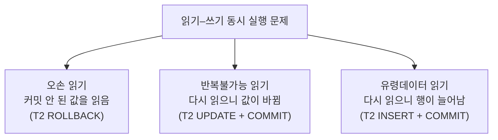

### 3.2 트랜잭션 고립 수준 명령어

```sql
SET [SESSION | GLOBAL] TRANSACTION ISOLATION LEVEL
    { READ UNCOMMITTED | READ COMMITTED | REPEATABLE READ | SERIALIZABLE };

SELECT @@transaction_isolation;      -- 현재 수준 확인 (MySQL 기본: REPEATABLE-READ)
```

| 고립 수준 | 오손 읽기 | 반복불가능 읽기 | 유령데이터 읽기 | 동시성 |
|---|:---:|:---:|:---:|:---:|
| **READ UNCOMMITTED** (Level 0) | 발생 | 발생 | 발생 | 가장 높음 |
| **READ COMMITTED** (Level 1) | 방지 | 발생 | 발생 | ↑ |
| **REPEATABLE READ** (Level 2) | 방지 | 방지 | 발생* | ↓ |
| **SERIALIZABLE** (Level 3) | 방지 | 방지 | 방지 | 가장 낮음 |

\* SQL 표준 기준. **MySQL InnoDB의 REPEATABLE READ는 일반 SELECT에서 유령데이터 읽기도 막습니다**(아래 3.4).

| 수준 | 동작 방식 (교안 설명 + MySQL InnoDB) |
|---|---|
| READ UNCOMMITTED | 읽을 때 락을 걸지 않고, 다른 트랜잭션이 커밋하지 않은 데이터도 읽음 (오손 페이지 읽기) |
| READ COMMITTED | **커밋된 데이터만** 읽음. InnoDB는 SELECT할 때마다 **새 스냅샷**을 만듦 (Oracle의 기본값) |
| REPEATABLE READ | 트랜잭션이 끝날 때까지 같은 데이터는 같은 값. InnoDB는 **첫 SELECT 시점의 스냅샷**을 계속 사용 (**MySQL의 기본값**) |
| SERIALIZABLE | 가장 엄격. InnoDB는 일반 SELECT도 **공유락**(`FOR SHARE`)으로 실행 → 다른 트랜잭션의 변경을 막음 |

### 3.3 고립 수준 실습 ① — 반복불가능 읽기 방지 (REPEATABLE READ)

```sql
UPDATE Users SET age = 30 WHERE id = 1;  DELETE FROM Users WHERE id = 3;   -- 복구

-- [창 1: T1]                                        -- [창 2: T2]
SET SESSION TRANSACTION ISOLATION LEVEL REPEATABLE READ;
START TRANSACTION;
SELECT * FROM Users WHERE id = 1;    -- 30
                                                     START TRANSACTION;
                                                     UPDATE Users SET age = 21 WHERE id = 1;
                                                     COMMIT;          -- 대기 없이 커밋됨
SELECT * FROM Users WHERE id = 1;    -- 30 ✅ (처음 읽은 스냅샷 유지)
COMMIT;
SELECT * FROM Users WHERE id = 1;    -- 21 (트랜잭션이 끝나면 최신 값)
```

> 🔁 **교안(Oracle/락 기반) 설명과의 차이**: 교안은 REPEATABLE READ가 공유락을 유지해 T2의 UPDATE를 **대기**시킨다고 설명합니다. MySQL InnoDB는 **MVCC(다중 버전 동시성 제어)** 로 T2를 기다리게 하지 않고, T1에게 **이전 버전(스냅샷)** 을 보여 줘서 같은 효과를 냅니다. 결과적으로 "반복불가능 읽기 방지"는 동일합니다.

### 3.4 고립 수준 실습 ② — 유령데이터 읽기 방지

**REPEATABLE READ (MySQL)** — 일반 SELECT는 스냅샷이라 유령이 보이지 않지만, **락을 거는 읽기**는 최신 데이터를 봅니다.

```sql
UPDATE Users SET age = 30 WHERE id = 1;   -- 복구

-- [창 1: T1]                                        -- [창 2: T2]
SET SESSION TRANSACTION ISOLATION LEVEL REPEATABLE READ;
START TRANSACTION;
SELECT * FROM Users WHERE age BETWEEN 10 AND 30;           -- 2행
                                                     START TRANSACTION;
                                                     INSERT INTO Users VALUES (3, '김연아', 26);
                                                     COMMIT;
SELECT * FROM Users WHERE age BETWEEN 10 AND 30;           -- 2행 ✅ (스냅샷)
SELECT * FROM Users WHERE age BETWEEN 10 AND 30 FOR SHARE; -- 3행 ❗ (락 읽기 = 최신 데이터)
COMMIT;
```

**SERIALIZABLE** — 범위에 락을 걸어 **삽입 자체를 막습니다.**

```sql
DELETE FROM Users WHERE id = 3;   -- 복구

-- [창 1: T1]                                        -- [창 2: T2]
SET SESSION TRANSACTION ISOLATION LEVEL SERIALIZABLE;
START TRANSACTION;
SELECT * FROM Users WHERE age BETWEEN 10 AND 30;   -- 2행 (범위에 공유락)
                                                     START TRANSACTION;
                                                     INSERT INTO Users VALUES (3, '김연아', 26);
                                                     -- ⏳ 대기... (T1의 범위 락)
SELECT * FROM Users WHERE age BETWEEN 10 AND 30;   -- 2행 ✅
COMMIT;
                                                     -- ▶ 대기 풀림, INSERT 완료
                                                     COMMIT;
```

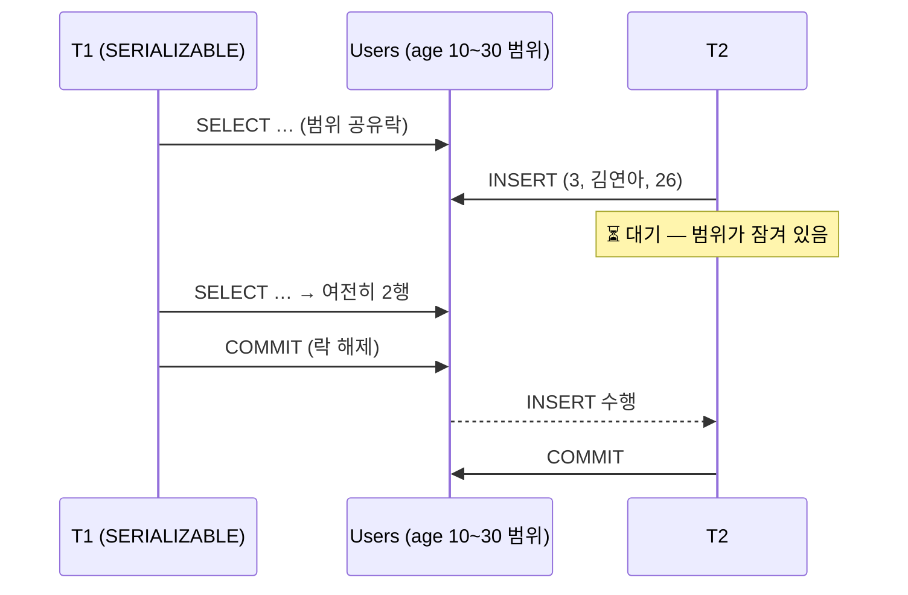

> 💡 **어떤 수준을 써야 할까?** 대부분의 서비스는 기본값(MySQL은 REPEATABLE READ, Oracle·PostgreSQL은 READ COMMITTED)을 쓰고, 재고 차감·좌석 예약처럼 **정확성이 중요한 부분만** `SELECT … FOR UPDATE`로 락을 겁니다. SERIALIZABLE은 동시성이 크게 떨어지므로 특별한 경우에만 사용합니다.

```sql
-- 실습 후 기본값으로
SET SESSION TRANSACTION ISOLATION LEVEL REPEATABLE READ;
```

---

## 4. 회복 (Recovery)

### 4.1 회복의 개념

> **회복**: 데이터베이스에 장애가 발생했을 때 데이터베이스를 **일관성 있는 상태로 되돌리는** DBMS의 기능

| 장애 유형 | 내용 |
|---|---|
| 시스템 충돌 | 하드웨어·소프트웨어 오류로 **주기억장치 내용 손실** |
| 미디어 장애 | 디스크 헤드 충돌 등으로 **보조기억장치 데이터 손실** |
| 응용 소프트웨어 오류 | 논리적 오류로 트랜잭션 수행 실패 |
| 자연재해 | 화재, 홍수, 지진, 정전 |
| 부주의 · 태업 | 운영자 실수, 의도적 손상 |

### 4.2 로그 파일

> **로그 파일(log file)**: 트랜잭션이 반영한 **모든 데이터 변경 사항을 데이터베이스에 기록하기 전에 미리 기록**해 두는 별도의 파일. 안전한 디스크에 저장되어 전원이 꺼져도 남습니다.

```text
로그 레코드 구조:  <트랜잭션번호, 로그타입, 데이터항목이름, 수정 전 값, 수정 후 값>
로그 타입      :  START, INSERT, UPDATE, DELETE, ABORT, COMMIT
```

| 값 | 회복에서의 쓰임 |
|---|---|
| **수정 전 값** (before image) | **UNDO** — 되돌릴 때 사용 |
| **수정 후 값** (after image) | **REDO** — 다시 실행할 때 사용 |

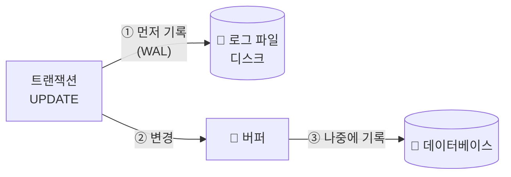

> 💡 **WAL(Write-Ahead Logging) 원칙**: 데이터를 디스크에 쓰기 **전에** 로그를 먼저 디스크에 씁니다. 그래서 COMMIT을 빨리 응답하고(1.1의 방법 1) 데이터 기록은 나중에 해도 안전합니다.

### 4.3 로그 파일을 이용한 회복 — REDO와 UNDO

| 로그 상태 | 의미 | 회복 작업 |
|---|---|---|
| [START] 있고 **[COMMIT] 있음** | 완료된 트랜잭션, 단 버퍼 내용이 디스크에 아직 안 써졌을 수 있음 | **REDO** (수정 후 값으로 다시 기록) |
| [START]만 있고 **[COMMIT] 없음** | 완료되지 못한 트랜잭션, 일부가 디스크에 써졌을 수 있음 | **UNDO** (수정 전 값으로 되돌림) |

**예제** — 데이터 (A, B, C, D) 초기값 (100, 200, 300, 400), T1 → T2 순서로 실행

| 트랜잭션 T1 | 트랜잭션 T2 |
|---|---|
| read(A); A = A + 10 | read(A); A = A + 10; write(A) |
| read(B); B = B + 10; write(B) | read(D); D = D + 10 |
| read(C); C = C + 10; write(C) | read(B); B = B + 10; write(B) |
| write(A) | write(D) |

**생성되는 로그**

| 번호 | 로그 레코드 |
|:---:|---|
| 1 | [T1, START] |
| 2 | [T1, UPDATE, B, 200, 210] |
| 3 | [T1, UPDATE, C, 300, 310] |
| 4 | [T1, UPDATE, A, 100, 110] |
| 5 | [T1, COMMIT] |
| 6 | [T2, START] |
| 7 | [T2, UPDATE, A, 110, 120] |
| 8 | [T2, UPDATE, B, 210, 220] |
| 9 | [T2, UPDATE, D, 400, 410] |
| 10 | [T2, COMMIT] |

**로그 i번까지 기록된 뒤 장애가 났다면?**

| 장애 시점 (로그 번호 i) | 즉시 갱신 방법 | 지연 갱신 방법 | 결과 |
|---|---|---|---|
| i = 0 | 작업 없음 | 작업 없음 | T1, T2 모두 시작 전 |
| 1 ≤ i ≤ 4 | **UNDO(T1)** | 작업 없음 | T1을 수행하지 않은 것과 같음 |
| 5 ≤ i ≤ 9 | **REDO(T1)**, **UNDO(T2)** | **REDO(T1)** | T1 완료, T2는 수행하지 않은 것과 같음 |
| i = 10 | **REDO(T1)**, **REDO(T2)** | **REDO(T1)**, **REDO(T2)** | T1, T2 모두 완료 |

**즉시 갱신 vs 지연 갱신**

| 방법 | 버퍼 → 데이터베이스 기록 시점 | COMMIT 없는 트랜잭션 회복 |
|---|---|---|
| **즉시 갱신** (immediate update) | 부분완료 **전에도** 기록될 수 있음 | **UNDO 필요** |
| **지연 갱신** (deferred update) | 부분완료(COMMIT) **후에** 기록 | 할 일 없음 (DB에 반영된 게 없음) |

### 4.4 체크포인트를 이용한 회복

로그만으로 회복하면 **어디까지 되돌아가야 할지** 알 수 없고, 로그 전체를 검사해야 합니다. 그래서 몇십 분마다 **데이터베이스와 로그를 동기화한 시점**을 로그에 기록하는데, 이것이 **체크포인트(checkpoint, 검사점)** 입니다.

**체크포인트 시점에 하는 일**

1. 주기억장치의 로그 레코드를 모두 디스크의 로그 파일에 저장
2. 버퍼의 변경된 내용을 디스크의 데이터베이스에 저장
3. 로그 파일에 [CHECKPOINT] 표시

**회복 규칙**

| 상황 | 회복 작업 |
|---|---|
| 체크포인트 **이전에 [COMMIT]** | 작업 없음 (이미 DB에 기록됨) |
| 체크포인트 **이후에 [COMMIT]** | **REDO** |
| 체크포인트 이후 **[COMMIT] 없음** | 즉시 갱신: **UNDO** / 지연 갱신: 작업 없음 |

```mermaid
gantt
    title 체크포인트와 장애 시점에 따른 트랜잭션 회복
    dateFormat  HH:mm
    axisFormat  %H:%M
    section 체크포인트 전 완료
    T2 (작업 없음)        :done, t2, 09:00, 09:20
    T3 (작업 없음)        :done, t3, 09:10, 09:35
    section 체크포인트 후 완료
    T4 (REDO)             :active, t4, 09:30, 10:05
    T5 (REDO)             :active, t5, 09:50, 10:10
    section 미완료 (장애 시 진행 중)
    T1 (즉시 갱신이면 UNDO) :crit, t1, 09:05, 10:20
    T6 (즉시 갱신이면 UNDO) :crit, t6, 10:00, 10:20
    section 시점
    체크포인트            :milestone, cp, 09:40, 0m
    시스템 장애           :milestone, fail, 10:20, 0m
```

| 트랜잭션 | 즉시 갱신 | 지연 갱신 |
|---|---|---|
| T2, T3 (체크포인트 전 COMMIT) | 작업 없음 | 작업 없음 |
| T4, T5 (체크포인트 후 COMMIT) | REDO | REDO |
| T1, T6 (COMMIT 없음) | **UNDO** | 작업 없음 |

**예제 — 체크포인트가 포함된 로그**

| 번호 | 로그 레코드 |
|:---:|---|
| 1 | [T1, START] |
| 2 | [T1, UPDATE, B, 200, 120] |
| 3 | [T1, UPDATE, C, 300, 310] |
| 4 | [T2, START] |
| 5 | [T2, UPDATE, A, 110, 120] |
| 6 | [T1, UPDATE, A, 120, 110] |
| 7 | [T1, COMMIT] |
| 8 | [T2, UPDATE, B, 120, 220] |
| 9 | **[CHECKPOINT]** |
| 10 | [T3, START] |
| 11 | [T3, UPDATE, A, 110, 120] |
| 12 | [T2, UPDATE, D, 400, 410] |
| 13 | [T2, COMMIT] |
| 14 | [T3, UPDATE, B, 220, 230] |
| 15 | ~~ 시스템 장애 ~~ |

→ 즉시 갱신 기법이라면: **T1은 작업 없음**(체크포인트 전 COMMIT), **REDO(T2)**(체크포인트 후 COMMIT), **UNDO(T3)**(COMMIT 없음)

### 4.5 MySQL(InnoDB)의 회복 구조

| 구성 | 역할 | 이론과의 대응 |
|---|---|---|
| **Redo Log** (`#innodb_redo`) | 변경 내용(수정 후 값)을 먼저 기록 | 로그 파일의 REDO 정보, WAL |
| **Undo Log** | 변경 전 값을 보관 | UNDO 정보 + MVCC 스냅샷 제공 |
| **Checkpoint** | 버퍼 풀의 변경 페이지를 디스크에 점진적으로 기록 (fuzzy checkpoint) | 체크포인트 |
| **Crash Recovery** | 재시작 시 Redo Log로 REDO 후, 미완료 트랜잭션을 Undo Log로 ROLLBACK | 로그를 이용한 회복 |
| **Binary Log** | 복제·시점 복구용 변경 기록 | 백업·복원 (→ 9장) |

```sql
SHOW VARIABLES LIKE 'innodb_flush_log_at_trx_commit';   -- 1: COMMIT마다 로그를 디스크에 기록 (지속성 보장)
SHOW VARIABLES LIKE 'innodb_redo_log_capacity';
```

---

## 📝 핵심 요약

| # | 키워드 | 한 줄 정리 |
|:---:|---|---|
| 1 | 트랜잭션 | 논리적 작업 단위, all or nothing, START TRANSACTION → COMMIT/ROLLBACK |
| 2 | ACID | 원자성·지속성(회복), 일관성(무결성 제약), 고립성(동시성 제어) |
| 3 | 상태 | 활동 → 부분완료 → 완료 / 실패 → 철회 |
| 4 | 갱신손실 | 읽고-계산-쓰기 사이에 덮어쓰기 → `SELECT … FOR UPDATE`로 방지 |
| 5 | 락 | 공유락(읽기, FOR SHARE) · 배타락(쓰기, FOR UPDATE), LS–LS만 호환 |
| 6 | 2PL | 확장 단계(획득만) → 수축 단계(해제만), InnoDB는 COMMIT 시 해제 |
| 7 | 데드락 | 서로의 락을 기다림 → DBMS가 한쪽 ROLLBACK (MySQL ERROR 1213) |
| 8 | 동시 실행 문제 | 오손 읽기(ROLLBACK된 값) · 반복불가능 읽기(UPDATE) · 유령 읽기(INSERT) |
| 9 | 고립 수준 | RU < RC < RR(MySQL 기본) < SERIALIZABLE, 높을수록 안전·느림 |
| 10 | MVCC | InnoDB는 스냅샷으로 읽기와 쓰기가 서로 기다리지 않게 함 |
| 11 | 회복 | 로그(WAL), COMMIT 있으면 REDO / 없으면 UNDO(즉시 갱신) |
| 12 | 체크포인트 | 회복 범위 축소: 체크포인트 이후 COMMIT만 REDO |

---

## ✅ 확인 문제

<details>
<summary>1. ACID 중 "트랜잭션 수행 전후에 데이터베이스가 무결성 제약조건을 만족해야 한다"는 성질은? DBMS의 어떤 기능이 담당하는가?</summary>

**일관성(Consistency)** — 무결성 제약조건(PK, FK, CHECK 등)이 담당합니다.
</details>

<details>
<summary>2. MySQL에서 autocommit이 켜진 상태로 <code>UPDATE …; ROLLBACK;</code>을 실행하면 어떻게 되는가?</summary>

UPDATE가 실행되는 즉시 자동 커밋되므로 ROLLBACK해도 **되돌아가지 않습니다.** 트랜잭션으로 묶으려면 `START TRANSACTION`으로 시작해야 합니다.
</details>

<details>
<summary>3. T1이 데이터 X에 공유락을 걸고 있을 때, T2의 공유락 요청과 배타락 요청은 각각 어떻게 처리되는가?</summary>

공유락 요청은 **허용**, 배타락 요청은 **대기**합니다.
</details>

<details>
<summary>4. 다음 현상의 이름은? "T1이 같은 SELECT를 두 번 실행했는데, 그 사이 T2가 INSERT 후 COMMIT하여 두 번째 결과에 새로운 행이 나타났다."</summary>

**유령데이터 읽기(phantom read)**
</details>

<details>
<summary>5. MySQL의 기본 고립 수준은? 이 수준에서 일반 SELECT로 반복불가능 읽기가 발생하는가?</summary>

**REPEATABLE READ**. InnoDB는 트랜잭션의 첫 SELECT 시점 스냅샷을 계속 읽으므로 반복불가능 읽기가 **발생하지 않습니다.**
</details>

<details>
<summary>6. [SQL] 재고(stock) 열이 있는 도서 테이블에서 "재고를 확인하고 1 이상이면 1 감소"를 동시 주문에도 안전하게 처리하는 트랜잭션을 작성하시오.</summary>

```sql
START TRANSACTION;
SELECT stock FROM BookStock WHERE bookid = 1 FOR UPDATE;   -- 배타락으로 다른 주문 대기
-- 응용에서 stock >= 1 확인 후
UPDATE BookStock SET stock = stock - 1 WHERE bookid = 1;
COMMIT;
```
또는 한 문장으로: `UPDATE BookStock SET stock = stock - 1 WHERE bookid = 1 AND stock >= 1;` (영향받은 행 수가 0이면 재고 없음)
</details>

<details>
<summary>7. 체크포인트가 포함된 로그(4.4 예제)에서 지연 갱신 방법을 사용했다면 각 트랜잭션의 회복 작업은?</summary>

T1: 작업 없음, T2: **REDO**, T3: 작업 없음 (지연 갱신은 COMMIT 전에는 DB에 반영하지 않으므로 UNDO가 필요 없음)
</details>

---

> 📚 출처: 한빛아카데미 「데이터베이스 개론과 실습」 8장 강의교안을 참고하여 요약·재구성. 모든 그림은 Mermaid로 새로 작성, 실습은 MySQL 8.0.46(InnoDB) 두 세션으로 직접 실행한 결과.

[🏠 목차](README.md) · ◀ 이전 [7장 정규화](07장_정규화.md) · 다음 ▶ [9장 데이터베이스 보안과 관리](09장_데이터베이스_보안과_관리.md)
