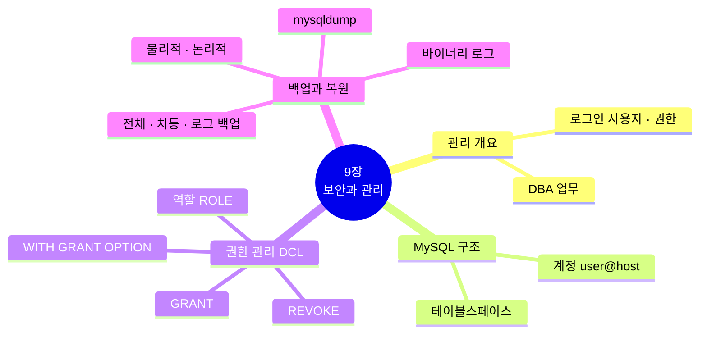
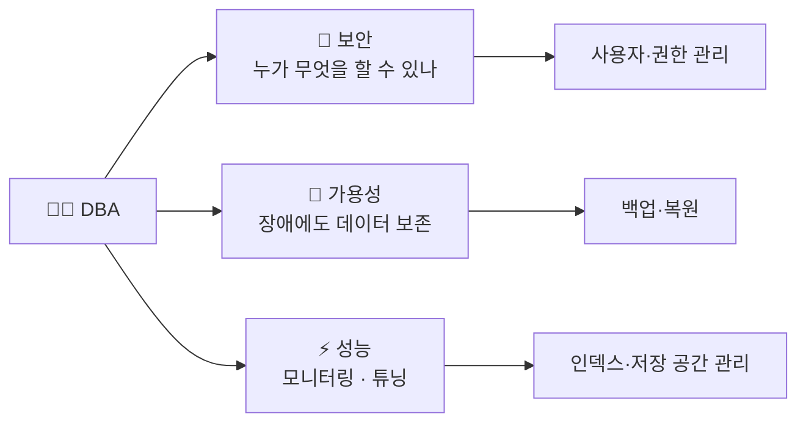
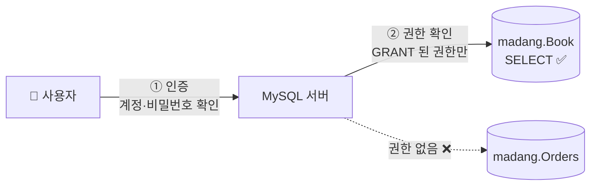
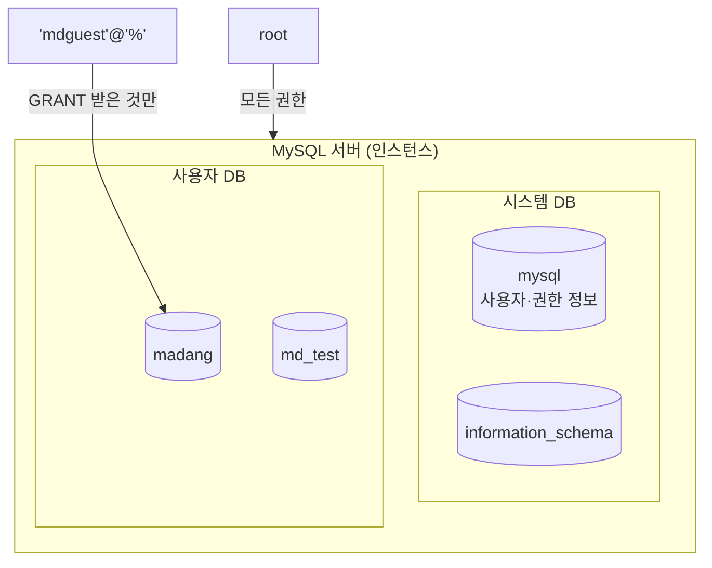
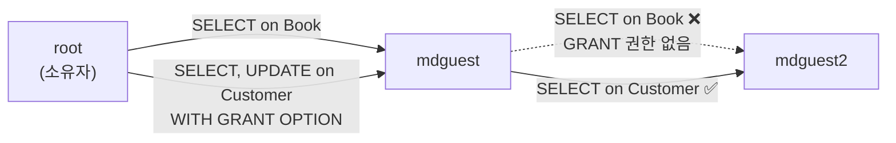
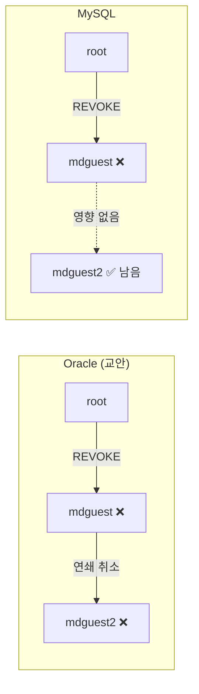
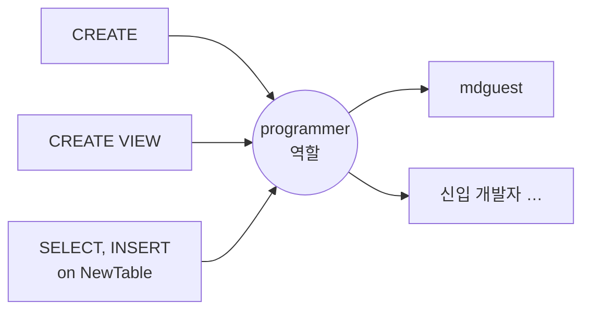
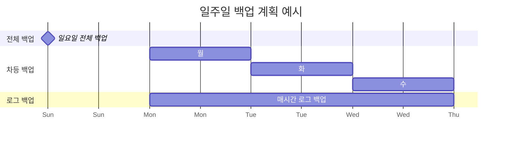
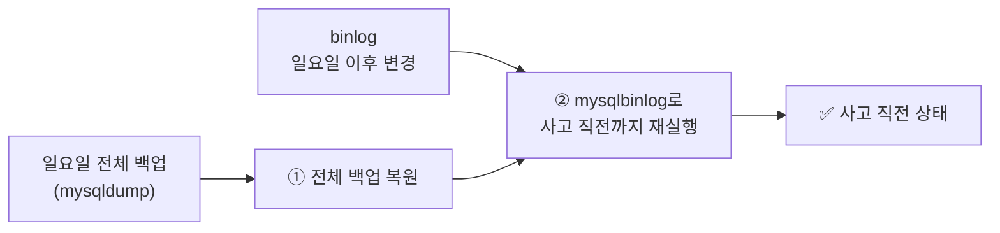

[🏠 목차](README.md) · ◀ 이전 [8장 트랜잭션, 동시성 제어, 회복](08장_트랜잭션_동시성제어_회복.md)

# Chapter 09. 데이터베이스 보안과 관리

> **이 장의 위치**: 마지막 장입니다. 마당서점 DB를 안전하게 운영하기 위해 **DBA**가 하는 일 — 사용자를 만들고 **권한**을 주고 거두는 일(`GRANT`/`REVOKE`, 역할), 장애에 대비한 **백업과 복원** — 을 MySQL로 실습합니다.

---

## 📌 학습 목표

- [ ] 데이터베이스 관리의 중요성과 DBA의 관리 업무를 설명할 수 있다.
- [ ] MySQL에서 사용자 계정을 생성·변경·삭제할 수 있다.
- [ ] `GRANT`, `REVOKE`, `WITH GRANT OPTION`, 역할(ROLE)로 권한을 관리할 수 있다.
- [ ] 백업의 종류를 구분하고 `mysqldump`로 백업·복원할 수 있다.



---

## 1. 데이터베이스 관리의 개요

### 1.1 데이터베이스 관리의 중요성

데이터베이스는 조직의 핵심 자산입니다. 잘못된 사용자가 데이터를 보거나 바꾸면 **정보 유출·위변조**가 일어나고, 장애로 데이터가 사라지면 **업무가 멈춥니다.** 그래서 **DBA(데이터베이스 관리자)** 가 보안과 가용성을 책임집니다.



### 1.2 데이터베이스 관리 업무

| 업무 | 내용 | 관련 장 |
|---|---|---|
| 서비스 관리 | DBMS 서버 시작·중지, 설정 | |
| 점검 및 모니터링 | 성능, 접속, 오류 로그 확인 | |
| 장애 대처 | 장애 원인 분석과 복구 | 8장 회복 |
| **백업과 복원** | 정기 백업, 장애 시 복원 | **9장** |
| **사용자 관리 및 권한 관리** | 로그인 계정, 객체 접근 권한 | **9장** |
| 시스템 데이터베이스 관리 | `mysql`, `information_schema`, `performance_schema`, `sys` | |
| 사용자 데이터베이스 관리 | `madang` 등 업무 DB 생성·변경 | 3장 |
| 저장 공간 관리 | 데이터 파일·테이블스페이스 관리 | 9장 |
| 인덱스 관리 | 인덱스 생성·재구성 | 4장 |

**권한의 두 단계** — "들어올 수 있는가?"와 "무엇을 할 수 있는가?"



---

## 2. 보안과 권한

### 2.1 MySQL의 구조와 접근 권한

| 개념 | Oracle (교안) | MySQL |
|---|---|---|
| 데이터베이스 단위 | 멀티테넌트: CDB 안의 PDB, 스키마 = 사용자 | 서버 안의 **데이터베이스(= 스키마)** 여러 개 |
| 사용자 | `c##madang` (공통 사용자) | **`'madang'@'localhost'`** — 이름 + 접속 호스트 |
| 사용자와 스키마 | 사용자가 곧 스키마 | 사용자와 DB가 **별개**, GRANT로 연결 |
| 관리자 | `system`, `sys` | `root` |



> 💡 MySQL 계정은 **`'이름'@'호스트'`** 쌍입니다. `'mdguest'@'localhost'`는 서버 컴퓨터에서만, `'mdguest'@'%'`는 어디서든, `'mdguest'@'192.168.0.%'`는 해당 네트워크에서만 접속할 수 있습니다.

### 2.2 테이블스페이스와 로그인 사용자 관리

#### 테이블스페이스

> **테이블스페이스**: 테이블·인덱스가 실제로 저장되는 **논리적 저장 공간**. 하나 이상의 데이터 파일로 구성됩니다.

MySQL InnoDB는 기본적으로 **테이블마다 `.ibd` 파일**(file-per-table)을 만들기 때문에 테이블스페이스를 직접 다룰 일이 적지만, 여러 테이블을 묶어 두는 **일반 테이블스페이스**도 만들 수 있습니다.

> **질의 9-1** (root) 테이블스페이스 md_tbs, md_test를 생성하시오. 데이터 파일 이름은 각각 md_tbs.ibd, md_test.ibd로 한다.

```sql
CREATE TABLESPACE md_tbs  ADD DATAFILE 'md_tbs.ibd'  ENGINE = InnoDB;
CREATE TABLESPACE md_test ADD DATAFILE 'md_test.ibd' ENGINE = InnoDB;

SELECT TABLESPACE_NAME, FILE_NAME
FROM   information_schema.FILES
WHERE  TABLESPACE_NAME LIKE 'md%';
```

| TABLESPACE_NAME | FILE_NAME |
|---|---|
| md_tbs | ./md_tbs.ibd |
| md_test | ./md_test.ibd |

```sql
-- 특정 테이블스페이스에 테이블 만들기
CREATE TABLE madang.Memo (id INT PRIMARY KEY, txt VARCHAR(100)) TABLESPACE md_tbs;
```

> **질의 9-2** (root) md_test 테이블스페이스를 삭제하시오.

```sql
DROP TABLESPACE md_test;      -- 안에 테이블이 없어야 삭제 가능, 데이터 파일도 함께 삭제
```

> 🔁 **Oracle 비교**: 오라클은 `CREATE TABLESPACE … DATAFILE 'C:\…\x.dbf' SIZE 10M` 처럼 크기를 지정하고, 사용자에게 `DEFAULT TABLESPACE`를 지정합니다. MySQL은 파일이 **자동으로 커지며**, 사용자별 기본 테이블스페이스 개념이 없습니다.

#### 사용자 계정 생성·변경·삭제

```sql
CREATE USER '사용자'@'호스트' IDENTIFIED BY '비밀번호';     -- 생성
ALTER  USER '사용자'@'호스트' IDENTIFIED BY '새비밀번호';   -- 비밀번호 변경
ALTER  USER '사용자'@'호스트' ACCOUNT LOCK;                -- 잠금 (UNLOCK 으로 해제)
RENAME USER '사용자'@'호스트' TO '새이름'@'호스트';          -- 이름 변경
DROP   USER '사용자'@'호스트';                              -- 삭제
```

> **질의 9-3, 9-4** (root) 새로운 사용자 mdguest(비밀번호 mdguest), mdguest2(비밀번호 mdguest2)를 생성하시오.

```sql
CREATE USER 'mdguest'@'%'  IDENTIFIED BY 'mdguest';
CREATE USER 'mdguest2'@'%' IDENTIFIED BY 'mdguest2';

SELECT user, host FROM mysql.user WHERE user LIKE 'md%';
```

| user | host |
|---|---|
| mdguest | % |
| mdguest2 | % |

> ⚠️ 실습용으로 비밀번호를 아이디와 같게 했지만, 실제 운영에서는 **강한 비밀번호**를 쓰고 `'%'`보다 **접속 호스트를 제한**해야 합니다.

### 2.3 권한 관리 — DCL

> **DCL(Data Control Language)**: 객체에 대한 사용 권한을 관리하는 명령. 권한 허가 **GRANT**, 권한 취소 **REVOKE**

| 권한 수준 | 형식 | 예 |
|---|---|---|
| 전역 | `ON *.*` | 서버의 모든 DB |
| 데이터베이스 | `ON madang.*` | madang의 모든 테이블 |
| 테이블 | `ON madang.Book` | Book 테이블만 |
| 열 | `SELECT (name, address) ON madang.Customer` | 특정 열만 |

| 주요 권한 | 의미 |
|---|---|
| `SELECT`, `INSERT`, `UPDATE`, `DELETE` | 데이터 조작 |
| `CREATE`, `ALTER`, `DROP`, `INDEX` | 구조 정의 |
| `CREATE VIEW`, `CREATE ROUTINE`, `EXECUTE` | 뷰·프로시저 |
| `ALL PRIVILEGES` | 모든 권한 |
| `GRANT OPTION` | 받은 권한을 남에게 줄 수 있는 권한 |

> **질의 9-5** (root) mdguest, mdguest2가 madang DB에 접속해 테이블을 만들 수 있게 하시오. (교안: CONNECT, RESOURCE 권한)

```sql
-- MySQL은 CREATE USER만으로 접속(USAGE) 가능
-- 테이블 생성 권한이 필요한 DB에만 부여
GRANT CREATE, INSERT, SELECT ON md_test.* TO 'mdguest2'@'%';
```

> 🔁 **Oracle 비교**: 오라클의 `CONNECT`, `RESOURCE` 같은 미리 정의된 역할이나 `UNLIMITED TABLESPACE` 권한은 MySQL에 없습니다. MySQL은 **필요한 권한을 DB·테이블 단위로 직접** 부여합니다.

#### 권한 허가 — GRANT

```sql
GRANT 권한 [(열)] [, …] ON 대상 TO '사용자'@'호스트' [WITH GRANT OPTION];
```

> **질의 9-6** (root) mdguest에게 Book 테이블의 SELECT 권한을 부여하시오.

```sql
GRANT SELECT ON madang.Book TO 'mdguest'@'%';
```

> **질의 9-7** (root) mdguest에게 Customer 테이블의 SELECT, UPDATE 권한을 WITH GRANT OPTION과 함께 부여하시오.

```sql
GRANT SELECT, UPDATE ON madang.Customer TO 'mdguest'@'%' WITH GRANT OPTION;

SHOW GRANTS FOR 'mdguest'@'%';
```

| Grants for mdguest@% |
|---|
| GRANT USAGE ON \*.\* TO \`mdguest\`@\`%\` |
| GRANT SELECT ON \`madang\`.\`Book\` TO \`mdguest\`@\`%\` |
| GRANT SELECT, UPDATE ON \`madang\`.\`Customer\` TO \`mdguest\`@\`%\` WITH GRANT OPTION |

**mdguest로 접속해 확인**

```sql
-- (mdguest 계정)
SELECT * FROM madang.Book;      -- ✅ 조회 가능
SELECT * FROM madang.Orders;
-- ERROR 1142 (42000): SELECT command denied to user 'mdguest'@'localhost' for table 'Orders'
```

> **질의 9-8** (mdguest 계정) madang.Book 테이블과 madang.Customer 테이블의 SELECT 권한을 mdguest2에게 부여하시오.

```sql
-- (mdguest 계정)
GRANT SELECT ON madang.Book TO 'mdguest2'@'%';
-- ERROR 1142 (42000): GRANT command denied to user 'mdguest'@'localhost' for table 'Book'
--   → Book은 WITH GRANT OPTION 없이 받았으므로 다시 줄 수 없음

GRANT SELECT ON madang.Customer TO 'mdguest2'@'%';   -- ✅ WITH GRANT OPTION으로 받았으므로 가능
```



> **질의 9-9** Orders 테이블을 모든 사용자가 SELECT할 수 있도록 권한을 부여하시오.

```sql
-- MySQL에는 Oracle의 PUBLIC(모든 사용자)이 없다 → 역할을 만들어 모든 사용자에게 부여
CREATE ROLE orders_reader;
GRANT SELECT ON madang.Orders TO orders_reader;
GRANT orders_reader TO 'mdguest'@'%', 'mdguest2'@'%';
SET DEFAULT ROLE orders_reader TO 'mdguest'@'%', 'mdguest2'@'%';
-- (새로 만드는 모든 사용자에게 자동 적용하려면 서버 변수 mandatory_roles 사용)
```

#### 권한 취소 — REVOKE

```sql
REVOKE 권한 [, …] ON 대상 FROM '사용자'@'호스트';
REVOKE GRANT OPTION ON 대상 FROM '사용자'@'호스트';    -- 재부여 권한만 회수
```

> **질의 9-10** (root) mdguest에게 부여된 Book 테이블의 SELECT 권한을 취소하시오.

```sql
REVOKE SELECT ON madang.Book FROM 'mdguest'@'%';
```

> **질의 9-11** (root) mdguest에게 부여된 Customer 테이블의 SELECT 권한을 취소하시오.

```sql
REVOKE SELECT ON madang.Customer FROM 'mdguest'@'%';

SHOW GRANTS FOR 'mdguest'@'%';      -- Customer는 UPDATE … WITH GRANT OPTION 만 남음
SHOW GRANTS FOR 'mdguest2'@'%';     -- ❗ mdguest가 준 SELECT ON Customer 는 그대로 남아 있음
```

| Grants for mdguest2@% |
|---|
| GRANT USAGE ON \*.\* TO \`mdguest2\`@\`%\` |
| GRANT SELECT ON \`madang\`.\`Customer\` TO \`mdguest2\`@\`%\` |

> 🔁 **중요한 차이 — 연쇄 취소(CASCADE)**: 교안(Oracle 객체 권한)에서는 mdguest의 권한을 취소하면 mdguest가 **다른 사용자에게 준 권한도 연쇄적으로 취소**됩니다. **MySQL의 REVOKE는 연쇄 취소를 하지 않습니다.** 위처럼 mdguest2의 권한이 남으므로, DBA가 `REVOKE SELECT ON madang.Customer FROM 'mdguest2'@'%';` 를 **직접** 실행해야 합니다.



### 2.4 역할 (ROLE)

> **역할(롤)**: 여러 권한을 **묶어 이름을 붙인 집합**. 사용자마다 권한을 하나하나 주는 대신 역할 하나를 주면 됩니다. (MySQL 8.0부터 지원)



**역할 생성부터 사용자 추가까지**

| 단계 | 명령 |
|---|---|
| ① 역할 생성 | `CREATE ROLE 역할이름;` |
| ② 역할에 권한 부여 | `GRANT 권한 ON 대상 TO 역할이름;` |
| ③ 사용자에게 역할 부여 | `GRANT 역할이름 TO '사용자'@'호스트';` |
| ④ 역할 활성화 (MySQL) | `SET DEFAULT ROLE 역할이름 TO '사용자'@'호스트';` 또는 접속 후 `SET ROLE 역할이름;` |
| 역할 제거 | `DROP ROLE 역할이름;` (사용자에게 준 권한도 함께 사라짐) |

> **질의 9-12** (root) 'programmer'라는 역할을 생성하시오.

```sql
CREATE DATABASE IF NOT EXISTS md_test;
CREATE ROLE programmer;
```

> **질의 9-13** (root) programmer 역할에 테이블과 뷰를 만들 수 있는 권한을 부여하시오.

```sql
GRANT CREATE, CREATE VIEW ON md_test.* TO programmer;
```

> **질의 9-14** (root) mdguest에 programmer 역할을 부여하시오.

```sql
GRANT programmer TO 'mdguest'@'%';
SET DEFAULT ROLE programmer TO 'mdguest'@'%';         -- 접속할 때 자동 활성화

SHOW GRANTS FOR 'mdguest'@'%' USING programmer;       -- 역할로 받은 권한까지 표시
```

> ⚠️ **MySQL 주의**: 역할을 부여해도 **활성화되지 않으면 권한이 적용되지 않습니다.** `SET DEFAULT ROLE`을 설정하거나, 사용자가 접속 후 `SET ROLE programmer;`를 실행해야 합니다. 확인은 `SELECT CURRENT_ROLE();`

> **질의 9-15** (mdguest2 계정) md_test DB에 다음 테이블을 생성하고 데이터를 삽입하시오.

```sql
-- (mdguest2 계정)
CREATE TABLE md_test.NewTable (a INT);
INSERT INTO md_test.NewTable VALUES (1);
```

> **질의 9-16** (root) programmer 역할에 md_test.NewTable 테이블에 대한 SELECT와 INSERT 권한을 부여하시오. 그리고 (mdguest 계정) INSERT 후 조회하시오.

```sql
-- (root)
GRANT SELECT, INSERT ON md_test.NewTable TO programmer;

-- (mdguest 계정)
SELECT CURRENT_ROLE();                    -- `programmer`@`%`
INSERT INTO md_test.NewTable VALUES (2);
SELECT * FROM md_test.NewTable;           -- 1, 2
```

> **질의 9-17** (root) programmer 역할에서 md_test.NewTable의 SELECT 권한을 회수하시오. 그리고 (mdguest 계정) 조회해 보시오.

```sql
-- (root)
REVOKE SELECT ON md_test.NewTable FROM programmer;

-- (mdguest 계정)
SELECT * FROM md_test.NewTable;
-- ERROR 1142 (42000): SELECT command denied to user 'mdguest'@'localhost' for table 'NewTable'
INSERT INTO md_test.NewTable VALUES (3);  -- ✅ INSERT 권한은 남아 있음
```

> **질의 9-18** (root) programmer 역할을 제거하시오. md_test.NewTable도 제거하시오.

```sql
DROP ROLE programmer;
DROP TABLE md_test.NewTable;

-- 실습 정리
DROP ROLE IF EXISTS orders_reader;
DROP USER IF EXISTS 'mdguest'@'%', 'mdguest2'@'%';
DROP DATABASE IF EXISTS md_test;
DROP TABLE IF EXISTS madang.Memo;   -- 테이블스페이스를 쓰는 테이블을 먼저 삭제
DROP TABLESPACE md_tbs;
```

#### 🧪 연습 — 마당서점 권한 설계

<details>
<summary>마당서점에 다음 세 역할을 만들고 권한을 설계하시오. ① 매장직원: 도서·고객 조회, 주문 입력 ② 회계담당: 주문 조회만 ③ 관리자: madang의 모든 권한</summary>

```sql
CREATE ROLE clerk, accountant, manager;

GRANT SELECT ON madang.Book TO clerk;
GRANT SELECT ON madang.Customer TO clerk;
GRANT SELECT, INSERT ON madang.Orders TO clerk;

GRANT SELECT ON madang.Orders TO accountant;

GRANT ALL PRIVILEGES ON madang.* TO manager;

-- 직원 계정에 역할 부여
CREATE USER 'kim'@'%' IDENTIFIED BY 'Str0ng!Pass';
GRANT clerk TO 'kim'@'%';
SET DEFAULT ROLE clerk TO 'kim'@'%';
```

> 💡 개인정보 보호를 위해 매장직원에게는 전화번호를 숨기려면 열 단위 권한을 씁니다.
> `GRANT SELECT (custid, name, address) ON madang.Customer TO clerk;` — 또는 4장의 **뷰**로 필요한 열만 보여 줍니다.
</details>

---

## 3. 백업과 복원

### 3.1 백업의 개념

| 용어 | 의미 |
|---|---|
| **백업** (backup) | 예상하지 못한 장애에 대비하여 데이터베이스를 **복제하여 보관**하는 작업 |
| **복원** (restore/recovery) | 장애로 데이터가 손상되었을 때 백업 파일로 **원래대로 되돌리는** 작업 |

| 백업이 필요한 장애 | 예 |
|---|---|
| 미디어 오류 | 디스크 고장 |
| 사용자 오류 | 실수로 `DROP TABLE`, `WHERE` 없는 `DELETE` |
| 하드웨어 장애 | 서버 고장, 화재 |

### 3.2 백업의 종류

| 종류 | 내용 | 장점 | 단점 |
|---|---|---|---|
| **전체 백업** (full) | 데이터베이스 **전체**를 백업 | 복원이 단순 | 시간·공간이 많이 듦 |
| **차등 백업** (differential) | **마지막 전체 백업 이후** 변경된 부분만 | 전체보다 빠름 | 시간이 지날수록 커짐 |
| **트랜잭션 로그 백업** | 마지막 로그 백업 이후의 **로그** | 가장 작고 빠름, **특정 시점 복원** 가능 | 복원 시 순서대로 모두 적용 |



> **복원 순서 예**: 수요일 15시 장애 → ① 일요일 **전체 백업** 복원 → ② 화요일 **차등 백업** 복원 → ③ 수요일 0시~15시 **로그 백업** 적용

### 3.3 MySQL의 백업 방법

| 구분 | 방법 | 도구 | 특징 |
|---|---|---|---|
| **물리적 백업** | 데이터 파일을 그대로 복사 | 콜드: 서버 중지 후 데이터 폴더 복사 / 핫: MySQL Enterprise Backup, Percona XtraBackup | 크기가 커도 빠름, 같은 버전에만 복원 |
| **논리적 백업** | 데이터를 **SQL 문(CREATE, INSERT)** 으로 추출 | **`mysqldump`**, `mysqlpump`, Workbench *Data Export* | 사람이 읽을 수 있음, 버전·플랫폼 독립, 대용량은 느림 |
| **로그 백업** | 변경 기록 보관 | **바이너리 로그**(`binlog`) + `mysqlbinlog` | 특정 시점 복원(PITR) |

| 교안(Oracle) | MySQL |
|---|---|
| 콜드 백업 (shutdown 후 파일 복사) | 서버 중지 후 `datadir` 복사 |
| 핫 백업 (운영 중 복사) | MySQL Enterprise Backup / XtraBackup |
| `expdp` (논리적 백업 Export) | **`mysqldump`** |
| `impdp` (논리적 복원 Import) | **`mysql < 백업.sql`** |

### 3.4 MySQL 백업 및 복원 실습


**① 준비** — 명령 프롬프트(cmd)에서 백업 폴더를 만듭니다. (MySQL `bin` 폴더가 PATH에 없으면 `C:\Program Files\MySQL\MySQL Server 8.0\bin` 에서 실행)

```bash
mkdir C:\madang\mdbackup
```

**② 백업 (Export)**

```bash
mysqldump -u root -p --single-transaction --routines --triggers madang > C:\madang\mdbackup\madang_full.sql
```

```bash
mysqldump -u root -p madang Orders > C:\madang\mdbackup\madang_orders.sql
```

| 옵션 | 의미 |
|---|---|
| `--single-transaction` | InnoDB를 **락 없이 일관된 스냅샷**으로 백업 (8장 REPEATABLE READ 활용) |
| `--routines` `--triggers` | 5장의 프로시저·함수·트리거도 포함 |
| `--databases db1 db2` / `--all-databases` | 여러 DB / 전체 서버 |
| `madang Orders` | 특정 테이블만 |

> 💡 만들어진 `.sql` 파일을 메모장으로 열어 보면 `DROP TABLE IF EXISTS`, `CREATE TABLE`, `INSERT INTO` 문이 들어 있습니다. 이것이 **논리적 백업**입니다.

**③ 사고 발생 — Orders 테이블 삭제**

```sql
-- (madang 접속)
DROP TABLE Orders;
SELECT * FROM Orders;
-- ERROR 1146 (42S02): Table 'madang.Orders' doesn't exist
```

**④ 복원 (Import) — Orders 테이블만**

```bash
mysql -u root -p madang < C:\madang\mdbackup\madang_orders.sql
```

**⑤ 복원 확인**

```sql
SELECT COUNT(*) FROM madang.Orders;     -- 10 ✅
```

> 💡 **Workbench로 하기**: [Server] → [Data Export]에서 madang 선택 → *Export to Self-Contained File* → [Start Export]. 복원은 [Server] → [Data Import]. 명령어를 몰라도 같은 작업을 할 수 있습니다.

### 3.5 바이너리 로그와 특정 시점 복원 (PITR)

전체 백업 이후의 변경은 **바이너리 로그**에 남아 있으므로, 백업 + 로그로 **장애 직전 시점**까지 복원할 수 있습니다.

```sql
SHOW VARIABLES LIKE 'log_bin';     -- ON (MySQL 8.0 기본)
SHOW BINARY LOGS;                  -- binlog.000001, binlog.000002 …
```



```bash
mysqlbinlog --stop-datetime="2026-10-07 14:59:59" binlog.000002 | mysql -u root -p
```

> 💡 이 원리는 [8장](08장_트랜잭션_동시성제어_회복.md)의 **로그를 이용한 REDO**와 같습니다. 백업(체크포인트 역할) 이후의 로그만 다시 실행하면 됩니다.

---

## 📝 핵심 요약

| # | 키워드 | 한 줄 정리 |
|:---:|---|---|
| 1 | DBA | 보안(사용자·권한), 가용성(백업·복원), 성능을 총괄 |
| 2 | MySQL 계정 | `'이름'@'호스트'`, CREATE / ALTER / RENAME / DROP USER |
| 3 | 테이블스페이스 | 데이터 파일의 논리적 묶음, InnoDB는 기본 file-per-table |
| 4 | DCL | GRANT(허가), REVOKE(취소) — 전역·DB·테이블·열 단위 |
| 5 | WITH GRANT OPTION | 받은 권한을 다른 사용자에게 재부여 가능 |
| 6 | REVOKE | Oracle은 연쇄 취소, **MySQL은 연쇄 취소 없음** |
| 7 | 역할 | 권한 묶음: CREATE ROLE → GRANT 권한 TO 역할 → GRANT 역할 TO 사용자 → **SET DEFAULT ROLE** |
| 8 | 백업 종류 | 전체 · 차등 · 트랜잭션 로그 백업 |
| 9 | 백업 방법 | 물리적(파일 복사) · 논리적(mysqldump) |
| 10 | 복원 | `mysql < 백업.sql`, 바이너리 로그로 특정 시점 복원 |

---

## ✅ 확인 문제

<details>
<summary>1. 사용자 A가 B에게 <code>GRANT SELECT ON madang.Book TO B</code>로 권한을 주었다. B가 이 권한을 C에게 줄 수 있는가?</summary>

**없습니다.** `WITH GRANT OPTION`을 함께 받아야 재부여할 수 있습니다. (ERROR 1142: GRANT command denied)
</details>

<details>
<summary>2. MySQL에서 역할을 부여했는데도 사용자가 권한 오류를 받는 이유와 해결 방법은?</summary>

역할이 **활성화되지 않았기** 때문입니다. `SET DEFAULT ROLE 역할 TO 사용자;`로 기본 역할을 지정하거나, 접속 후 `SET ROLE 역할;`을 실행합니다.
</details>

<details>
<summary>3. 전체 백업, 차등 백업, 로그 백업 중 복원 시 "특정 시점"까지 되돌릴 수 있게 해 주는 것은?</summary>

**트랜잭션 로그 백업** (MySQL에서는 바이너리 로그)
</details>

<details>
<summary>4. [SQL] madang의 Customer 테이블에서 이름과 주소만 볼 수 있는 사용자 'delivery'@'%'를 만드시오.</summary>

```sql
CREATE USER 'delivery'@'%' IDENTIFIED BY 'Deliv3ry!';
GRANT SELECT (name, address) ON madang.Customer TO 'delivery'@'%';
-- (delivery 계정) SELECT name, address FROM madang.Customer;  ✅
--                 SELECT phone FROM madang.Customer;           ❌ ERROR 1143
```
</details>

<details>
<summary>5. mysqldump에서 <code>--single-transaction</code> 옵션은 8장의 어떤 개념을 이용하는가?</summary>

InnoDB의 **REPEATABLE READ 스냅샷(MVCC)** 을 이용해, 테이블에 락을 걸지 않고도 백업 시작 시점의 **일관된 데이터**를 읽습니다.
</details>

---

> 📚 출처: 한빛아카데미 「데이터베이스 개론과 실습」 9장 강의교안을 참고하여 요약·재구성. 모든 그림은 Mermaid로 새로 작성, SQL·명령은 MySQL 8.0 기준(실제 실행으로 확인).

[🏠 목차](README.md) · ◀ 이전 [8장 트랜잭션, 동시성 제어, 회복](08장_트랜잭션_동시성제어_회복.md)
