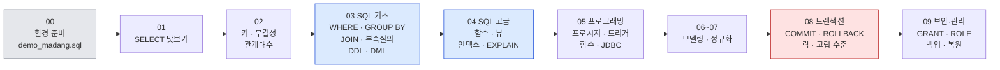
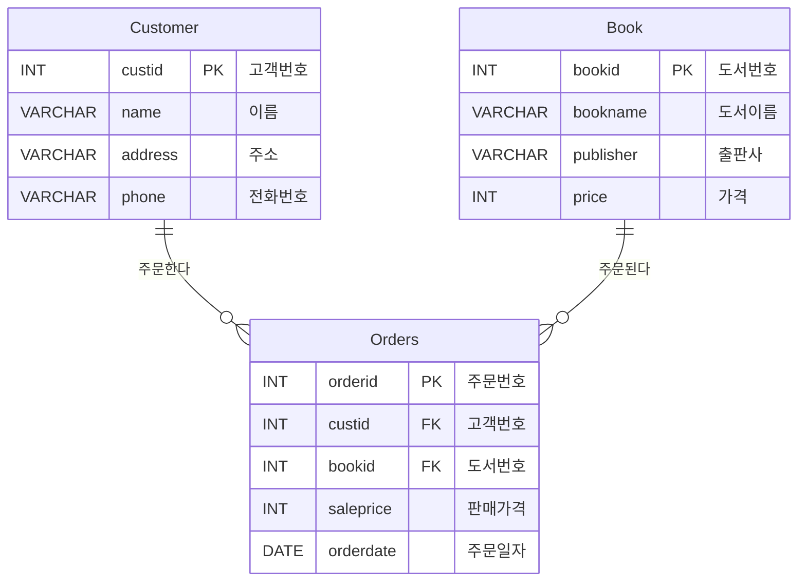

# 📚 데이터베이스 강의노트 — 마당서점으로 배우는 MySQL

> 한빛아카데미 「데이터베이스 개론과 실습」 강의교안(1~9장)을 핵심 위주로 요약·재구성한 강의노트입니다.
> 모든 SQL 실습은 **마당서점 데이터베이스**(고객 `Customer` · 도서 `Book` · 주문 `Orders`)를 사용하며, **MySQL 8.0** 기준으로 작성하고 실제 실행해 결과를 확인했습니다.

---

## 🗂 목차

| 장 | 제목 | 핵심 내용 | 마당서점 SQL 실습 |
|:---:|---|---|---|
| 00 | [실습 환경 준비 (MySQL)](00장_실습환경_MySQL.md) | MySQL 8.0 · Workbench 설치, Oracle ↔ MySQL 차이표 | `demo_madang.sql` 설치 |
| 01 | [데이터베이스 시스템](01장_데이터베이스_시스템.md) | 데이터베이스 개념·특징, 파일 시스템 vs DBMS, 3단계 구조, 데이터 독립성 | SELECT 맛보기 |
| 02 | [관계 데이터 모델](02장_관계_데이터_모델.md) | 릴레이션, 키, 무결성 제약조건, 관계대수 | PK·FK 위반 실험, 관계대수 ↔ SQL |
| 03 | [SQL 기초](03장_SQL_기초.md) | SELECT, 집계·GROUP BY, 조인, 부속질의, 집합 연산, DDL, DML | 질의 3-1 ~ 3-50 + 연습 |
| 04 | [SQL 고급](04장_SQL_고급.md) | 내장 함수, NULL, 부속질의 3종, 뷰, 인덱스(B-tree) | 질의 4-1 ~ 4-27, EXPLAIN |
| 05 | [데이터베이스 프로그래밍](05장_데이터베이스_프로그래밍.md) | 저장 프로시저, 커서, 트리거, 사용자 정의 함수, JDBC | InsertBook, Interest, fnc_Interest, BookList.java |
| 06 | [데이터 모델링](06장_데이터_모델링.md) | 생명주기, ER 모델, IE 표기법, ER → 릴레이션 사상 | Workbench 모델링, 마당대학 DDL |
| 07 | [정규화](07장_정규화.md) | 이상현상, 함수 종속성, 1NF·2NF·3NF·BCNF, 무손실 분해 | 이상현상 재현(Summer 테이블) |
| 08 | [트랜잭션, 동시성 제어, 회복](08장_트랜잭션_동시성제어_회복.md) | ACID, 락, 2PL, 데드락, 고립 수준, 로그·체크포인트 회복 | 두 세션 실습: 갱신손실, 데드락, 고립 수준 |
| 09 | [데이터베이스 보안과 관리](09장_데이터베이스_보안과_관리.md) | 사용자·권한(GRANT/REVOKE), 역할, 백업·복원 | 권한 실습, mysqldump 백업·복원 |

---

## 🧭 SQL 실습 로드맵 — 기초부터 트랜잭션까지



| 단계 | 장 | 할 수 있게 되는 것 |
|---|---|---|
| 🌱 기초 | 1 ~ 3장 | 원하는 데이터를 조회하고(SELECT), 테이블을 만들고(DDL), 데이터를 바꾼다(DML) |
| 🌿 중급 | 4 ~ 5장 | 함수·뷰·인덱스로 질의를 다듬고, 프로시저·트리거로 로직을 DB에 담는다 |
| 🌳 설계 | 6 ~ 7장 | 요구사항에서 ER 다이어그램과 정규화된 테이블을 설계한다 |
| 🏔 고급 | 8 ~ 9장 | 트랜잭션으로 데이터를 안전하게 지키고, 권한과 백업으로 운영한다 |

---

## 🏪 마당서점 데이터베이스



| 테이블 | 행 수 | 설명 |
|---|---:|---|
| `Book` | 10 | 축구의 역사 ~ Olympic Champions |
| `Customer` | 5 | 박지성, 김연아, 장미란, 추신수, 박세리(전화번호 NULL, 주문 없음) |
| `Orders` | 10 | 2020-07-01 ~ 2020-07-10 주문 |

- 💾 설치 스크립트: [sql/demo_madang.sql](sql/demo_madang.sql) — 실습으로 데이터가 바뀌면 다시 실행해 처음 상태로 되돌립니다.
- 데이터 전체 보기: [1장 0.2 샘플 데이터](01장_데이터베이스_시스템.md) · [3장 1.1](03장_SQL_기초.md)

---

## 🔎 주제별 바로 찾기

| 찾는 내용 | 위치 |
|---|---|
| Oracle ↔ MySQL 문법 차이 | [00장 4절](00장_실습환경_MySQL.md) |
| 키(슈퍼키·후보키·기본키·외래키) | [02장 2.1](02장_관계_데이터_모델.md) |
| ON DELETE CASCADE / SET NULL | [02장 2.3](02장_관계_데이터_모델.md) |
| 관계대수 기호(σ π ⋈ ÷)와 SQL 대응 | [02장 3.2](02장_관계_데이터_모델.md) |
| SELECT 실행 순서 | [03장 3.1](03장_SQL_기초.md) |
| 외부조인 (LEFT / RIGHT / FULL 대체) | [03장 4.1](03장_SQL_기초.md) |
| MySQL Error 1093 (UPDATE 부속질의) | [03장 6.2](03장_SQL_기초.md) |
| 날짜 함수 DATE_ADD · DATE_FORMAT | [04장 1.4](04장_SQL_고급.md) |
| LIMIT / ROW_NUMBER (Oracle ROWNUM 대체) | [04장 1.6](04장_SQL_고급.md) |
| 인덱스 · B-tree · EXPLAIN | [04장 4절](04장_SQL_고급.md) |
| DELIMITER와 저장 프로시저 문법 | [05장 2.0](05장_데이터베이스_프로그래밍.md) |
| JDBC (MySQL Connector/J) | [05장 3절](05장_데이터베이스_프로그래밍.md) |
| IE 표기법 · 식별/비식별 관계 | [06장 2.6](06장_데이터_모델링.md) |
| 정규형 판별 요약표 | [07장 3.7](07장_정규화.md) |
| 갱신손실 · SELECT … FOR UPDATE | [08장 2절](08장_트랜잭션_동시성제어_회복.md) |
| 고립 수준별 발생 현상 표 | [08장 3.2](08장_트랜잭션_동시성제어_회복.md) |
| REDO / UNDO · 체크포인트 | [08장 4절](08장_트랜잭션_동시성제어_회복.md) |
| GRANT · REVOKE · ROLE | [09장 2절](09장_데이터베이스_보안과_관리.md) |
| mysqldump 백업·복원 | [09장 3.4](09장_데이터베이스_보안과_관리.md) |

---

## 📖 이 노트를 보는 방법

각 장은 다음 순서로 구성되어 있습니다.


| 표시 | 의미 |
|---|---|
| `> **질의 3-1** …` | 교안의 질의 번호 |
| 🔁 **Oracle 비교** | 교안(Oracle)과 MySQL의 문법·동작 차이 |
| ⚠️ | 자주 하는 실수, 주의사항 |
| 💡 | 보충 설명, 실무 팁 |
| `<details>` ▶ | 클릭하면 정답·풀이가 펼쳐짐 |

**Mermaid 그림이 보이지 않을 때**: 일부 마크다운 뷰어는 Mermaid를 지원하지 않습니다.

- 같은 폴더의 **`.html` 파일**을 더블클릭하면 브라우저에서 그림과 함께 볼 수 있습니다(인터넷 연결 필요). 시작 페이지는 [README.html](README.html)입니다.
- `.md` 파일을 고친 뒤에는 아래 명령으로 HTML을 다시 만듭니다.

```bash
python build_html.py
```

- VS Code는 *Markdown Preview Mermaid Support* 확장을, Typora·Obsidian·GitHub는 별도 설정 없이 그림이 표시됩니다.

---

## 📁 폴더 구성

```text
db_Lecture_Note/
├── README.md / README.html         ← 목차 (지금 이 문서)
├── 00장_실습환경_MySQL.md
├── 01장_데이터베이스_시스템.md
├── 02장_관계_데이터_모델.md
├── 03장_SQL_기초.md
├── 04장_SQL_고급.md
├── 05장_데이터베이스_프로그래밍.md
├── 06장_데이터_모델링.md
├── 07장_정규화.md
├── 08장_트랜잭션_동시성제어_회복.md
├── 09장_데이터베이스_보안과_관리.md
├── *.html                          ← 각 장의 브라우저용 버전
├── sql/demo_madang.sql             ← 마당서점 MySQL 설치 스크립트
└── build_html.py                   ← md → html 변환 스크립트
```

---

> 📚 출처: 한빛아카데미 「데이터베이스 개론과 실습」 강의교안(1~9장)을 참고하여 요약·재구성했습니다. 교안의 그림은 사용하지 않았으며, 모든 그림은 교안 내용을 참고해 Mermaid로 새로 작성했습니다. SQL은 MySQL 8.0.46에서 실행하여 결과를 확인했습니다.
