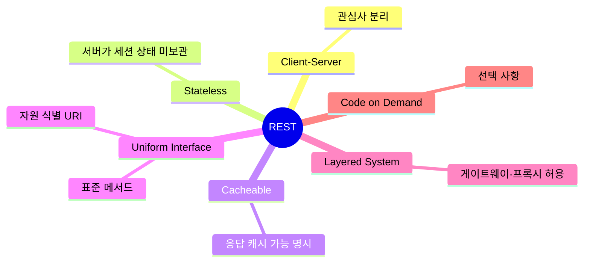
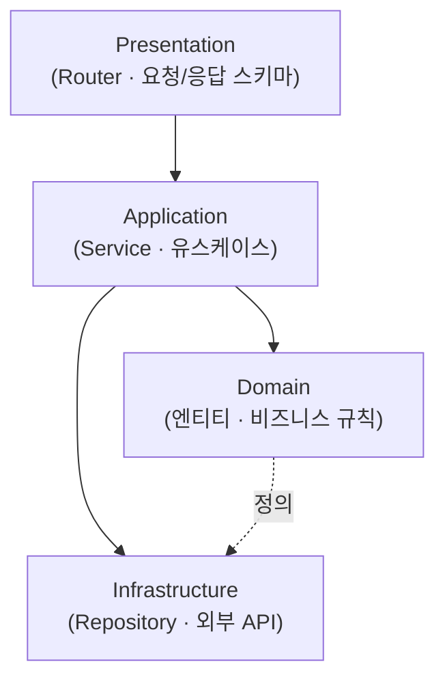
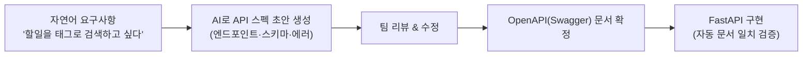
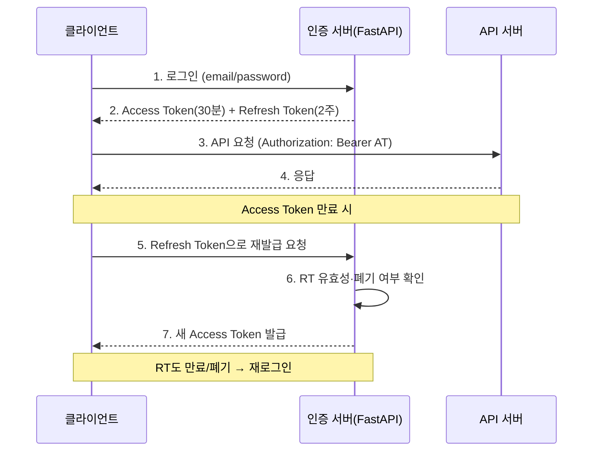
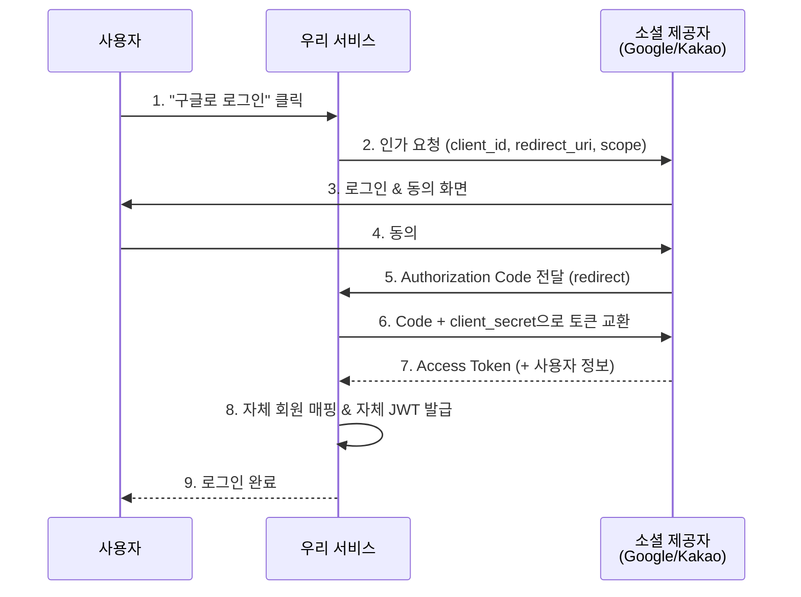
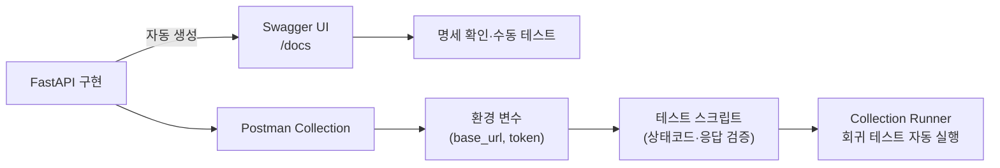

# 4. API 아키텍처 & 인증 보안 설계 (48h · 6일)

> **교과목 목표**: RESTful API 원칙에 따라 API를 설계하고, JWT·OAuth2 인증을 구현하며 Postman으로 검증할 수 있다.

**핵심 개념**: REST 설계 원칙·URI 설계 / 자연어 기반 API 스펙 정의 / JWT 인증·리프레시 토큰 / OAuth2 소셜 로그인 / 계층형 아키텍처·Swagger / Postman 테스트

---

## 1. REST 설계 원칙

### 1.1 REST 6대 제약 조건



### 1.2 URI 설계 규칙

| 규칙 | 좋은 예 | 나쁜 예 |
|---|---|---|
| 자원은 명사·복수형 | `GET /todos` | `GET /getTodoList` |
| 계층 관계 표현 | `GET /users/1/todos` | `GET /todos?owner=1` (관계 은닉) |
| 행위는 HTTP 메서드로 | `DELETE /todos/3` | `POST /todos/delete/3` |
| 필터·정렬은 쿼리스트링 | `/todos?status=done&sort=-due` | URI에 동사 삽입 |
| 소문자·하이픈 | `/ai-summaries` | `/AI_Summaries` |

### 1.3 HTTP 메서드 & 상태 코드

| 메서드 | 의미 | 멱등성 | 성공 코드 |
|---|---|:---:|---|
| GET | 조회 | O | 200 |
| POST | 생성 | X | 201 |
| PUT | 전체 수정 | O | 200 |
| PATCH | 부분 수정 | X | 200 |
| DELETE | 삭제 | O | 204 |

### 1.4 API 스타일 비교

| 스타일 | 장점 | 단점 | 적합 |
|---|---|---|---|
| **REST** | 표준·캐시·범용성, 학습 쉬움 | Over/Under-fetching | 일반 CRUD 서비스 |
| **GraphQL** | 필요한 필드만 요청, 단일 엔드포인트 | 캐시 복잡, 서버 부담 | 복잡한 클라이언트 뷰 |
| **gRPC** | 고성능 바이너리, 스트리밍 | 브라우저 직접 호출 제약 | 마이크로서비스 내부 통신 |

---

## 2. 계층형 아키텍처 & API 스펙

### 2.1 계층형 아키텍처



| 장점 | 단점 |
|---|---|
| 관심사 분리로 테스트·유지보수 용이 | 소규모 프로젝트엔 과설계 가능 |
| 계층별 교체(예: DB 변경) 유연 | 계층 통과 보일러플레이트 증가 |

### 2.2 자연어 기반 API 스펙 정의 (AI 활용)



---

## 3. JWT 인증

### 3.1 JWT 구조

```
헤더(알고리즘).페이로드(클레임: sub, exp...).서명(비밀키로 위변조 검증)
```

### 3.2 액세스 + 리프레시 토큰 흐름



### 3.3 세션 vs JWT

| 구분 | 세션 기반 | JWT 기반 |
|---|---|---|
| 상태 | 서버가 상태 보관 (Stateful) | 서버 무상태 (Stateless) |
| 장점 | 즉시 무효화 가능, 정보 서버 보관 | 수평 확장 용이, 서버 저장소 불필요 |
| 단점 | 서버 확장 시 세션 공유 필요 | 발급 후 즉시 무효화 어려움, 토큰 크기 |
| 보안 포인트 | 세션 하이재킹 | 시크릿 관리, 짧은 만료 + RT 회전 |

**보안 필수 사항**: 비밀번호는 bcrypt 해싱 / HTTPS 필수 / 토큰은 XSS에 안전한 저장 전략 고려 / RT는 DB에 저장해 폐기(revoke) 가능하게.

---

## 4. OAuth2 소셜 로그인

### 4.1 Authorization Code 플로우



### 4.2 OAuth2 Grant 타입 비교

| Grant | 용도 | 장점 | 단점/주의 |
|---|---|---|---|
| Authorization Code (+PKCE) | 웹·모바일 표준 | 가장 안전, 토큰 노출 최소화 | 흐름 복잡 |
| Client Credentials | 서버 간 통신 | 단순 | 사용자 컨텍스트 없음 |
| Password (ROPC) | 레거시 | 단순 | 비권장(자격증명 직접 취급) |
| Implicit | 과거 SPA | - | 폐기 권장 |

---

## 5. Swagger & Postman 검증



| 도구 | 장점 | 단점 |
|---|---|---|
| **Swagger UI** | 코드와 항상 동기화, 무설정 | 시나리오·자동화 테스트 한계 |
| **Postman** | 시나리오 체이닝, 환경 분리, 팀 공유, CLI(newman) 자동화 | 코드와 별도 관리 필요 |

---

## 📅 일차별 강의 계획 (6일 × 8h)

| 일차 | 이론 (4h) | 실습 (3.5h) | 회고 (0.5h) |
|:---:|---|---|---|
| 1 | REST 원칙, URI 설계, 상태 코드 | 기존 API를 REST 원칙으로 리디자인 | 설계 리뷰 |
| 2 | 계층형 아키텍처, 자연어 API 스펙 | AI로 스펙 초안 생성 → 리뷰 → OpenAPI 확정 | 스펙 리뷰 |
| 3 | 해싱, JWT 구조·발급 | 회원가입/로그인 + JWT 발급 구현 | 리뷰 |
| 4 | 리프레시 토큰, 토큰 회전·폐기 | RT 재발급·로그아웃(폐기) 구현 | 리뷰 |
| 5 | OAuth2 개념, Authorization Code | 소셜 로그인(Google 또는 Kakao) 연동 | 리뷰 |
| 6 | Swagger 심화, Postman 자동화 | **Postman Collection + 테스트 스크립트 작성, 전체 시나리오 검증** | 과제 안내 |

---

## 📝 과목 과제 & 미니 프로젝트

### 과제 (개인)
1. 자기 서비스의 **OpenAPI 스펙 문서** (엔드포인트 10개 이상, 에러 응답 포함)
2. JWT vs 세션 선택 근거를 담은 **인증 설계서** (1~2p)

### 미니 프로젝트 (개인) — "인증이 완비된 REST API 서버"
- **요구사항**: JWT 로그인 + 리프레시 토큰 회전 + 로그아웃(폐기) / 소셜 로그인 1종 / 권한별 접근 제어(본인 리소스만 수정) / Postman Collection으로 성공·실패 시나리오 15개 이상 자동 검증
- **평가 기준**: REST 설계 준수(25) / 인증 구현 완성도(30) / 보안 처리(25) / 테스트 커버리지(20)
