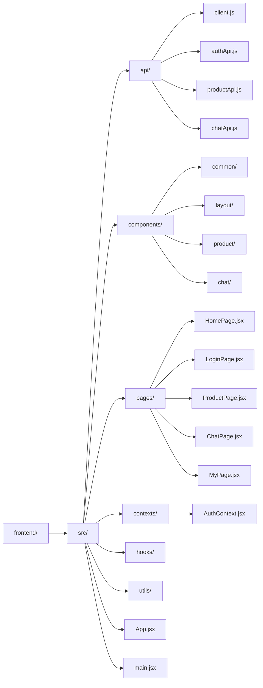

```mermaid
flowchart LR
    F["frontend/"] --> S["src/"]

    S --> A["api/"]
    A --> A1["client.js"]
    A --> A2["authApi.js"]
    A --> A3["productApi.js"]
    A --> A4["chatApi.js"]

    S --> C["components/"]
    C --> C1["common/"]
    C --> C2["layout/"]
    C --> C3["product/"]
    C --> C4["chat/"]

    S --> P["pages/"]
    P --> P1["HomePage.jsx"]
    P --> P2["LoginPage.jsx"]
    P --> P3["ProductPage.jsx"]
    P --> P4["ChatPage.jsx"]
    P --> P5["MyPage.jsx"]

    S --> X["contexts/"]
    X --> X1["AuthContext.jsx"]

    S --> H["hooks/"]
    S --> U["utils/"]
    S --> APP["App.jsx"]
    S --> M["main.jsx"]
```
