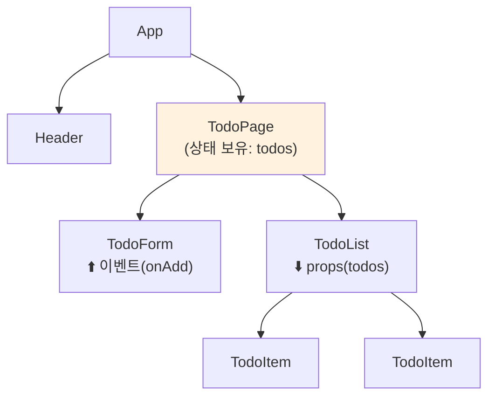
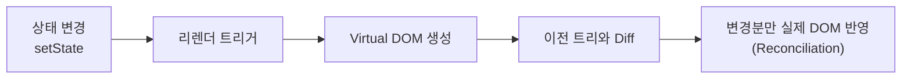
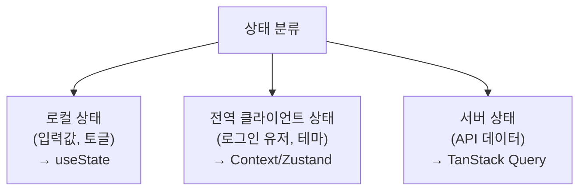
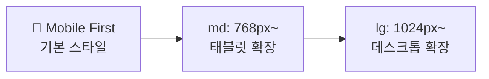
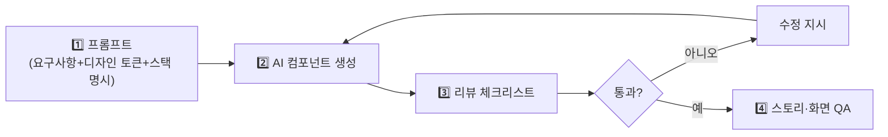
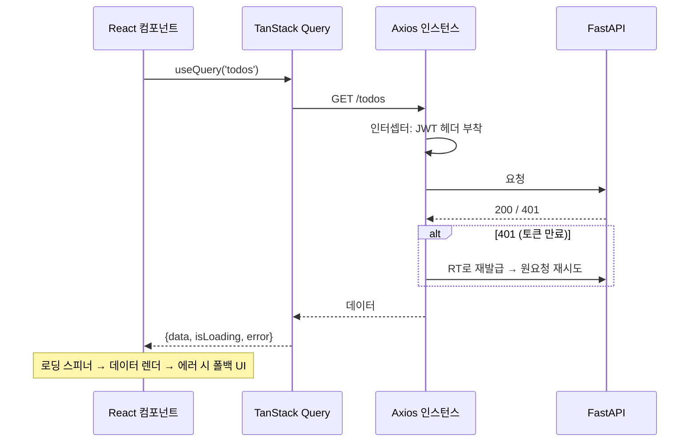

# 5. AX UI 구현 & 프론트엔드 통합 (56h · 7일)

> **교과목 목표**: React 기반 컴포넌트를 AI 도구로 생성·검토하고, CSS 프레임워크로 반응형 UI를 구현하며 API를 연동할 수 있다.

**핵심 개념**: React 컴포넌트 설계 / AI 활용 컴포넌트 생성·검토 / 상태 관리 / CSS 프레임워크 / API 연동 / 반응형 레이아웃·화면 QA

---

## 1. React 핵심 개념

### 1.1 컴포넌트 트리와 단방향 데이터 흐름

- **데이터는 아래로(props), 이벤트는 위로(callback)** — 예측 가능한 흐름
- 상태는 그것을 필요로 하는 컴포넌트들의 **가장 가까운 공통 조상**에 배치 (State Lifting)

### 1.2 렌더링 프로세스

### 1.3 주요 Hook 요약

| Hook | 용도 | 주의점 |
|---|---|---|
| useState | 로컬 상태 | 불변성 유지(스프레드로 새 객체) |
| useEffect | 사이드 이펙트(API 호출 등) | 의존성 배열 누락 → 무한 루프/스테일 값 |
| useMemo / useCallback | 연산·함수 메모이제이션 | 남용하면 오히려 복잡도 증가 |
| useRef | DOM 참조·리렌더 없는 값 | 렌더링에 쓰는 값 저장 금지 |

---

## 2. 상태 관리

### 2.1 상태의 종류와 배치

### 2.2 상태 관리 도구 비교

| 도구 | 장점 | 단점 | 적합 |
|---|---|---|---|
| **useState + props** | 추가 학습 없음, 명시적 | 깊은 트리에서 props drilling | 소규모 |
| **Context API** | 내장, drilling 해소 | 값 변경 시 하위 전체 리렌더 주의 | 테마·인증 등 저빈도 갱신 |
| **Zustand** | 극단적으로 단순, 보일러플레이트 최소 | 대규모 규약은 팀이 정해야 | 중소규모 전역 상태 |
| **Redux Toolkit** | 규약·디버깅 도구 강력, 대규모 검증됨 | 보일러플레이트·학습 곡선 | 대규모·복잡 상태 |
| **TanStack Query** | 캐싱·재요청·로딩/에러 자동 관리 | 클라이언트 상태용 아님 | **서버 데이터 전반** |

---

## 3. CSS 프레임워크 & 반응형

### 3.1 스타일링 방식 비교

| 방식 | 장점 | 단점 |
|---|---|---|
| **Tailwind CSS** | 유틸리티로 빠른 개발, 디자인 일관성, AI 생성 코드와 궁합 좋음 | 클래스 나열로 마크업 장황 |
| **Bootstrap** | 완성 컴포넌트 즉시 사용 | 커스터마이징 시 "부트스트랩 티" |
| **CSS Modules** | 순수 CSS, 스코프 격리 | 유틸리티 없음, 파일 증가 |
| **styled-components** | JS 로직과 스타일 결합, 동적 스타일 | 런타임 비용, 러닝 커브 |

### 3.2 반응형 레이아웃 전략

| 기법 | 용도 |
|---|---|
| Flexbox | 1차원 정렬(내비게이션, 카드 행) |
| Grid | 2차원 배치(대시보드, 갤러리) |
| 미디어쿼리/Tailwind 브레이크포인트 | 화면 크기별 분기 |
| 상대 단위(rem, %, vw) | 유연한 크기 |

---

## 4. AI 활용 컴포넌트 생성·검토

**프론트엔드 AI 코드 리뷰 체크리스트**

| 항목 | 흔한 문제 |
|---|---|
| 접근성 | alt 누락, 버튼 대신 div+onClick, 포커스 불가 |
| 성능 | key 누락/index key, 불필요 리렌더 |
| 상태 설계 | 파생 가능한 값을 상태로 중복 보관 |
| 스타일 일관성 | 프로젝트 토큰 무시하고 임의 색상 하드코딩 |
| 반응형 | 고정 px 폭, 모바일 미고려 |

---

## 5. API 연동

### 5.1 프론트–백엔드 통신 흐름

### 5.2 화면 QA 체크리스트

| 범주 | 점검 항목 |
|---|---|
| 상태 3종 | 로딩 / 에러 / 빈 데이터 화면이 모두 존재하는가 |
| 반응형 | 375px(모바일)·768px·1280px에서 깨짐 없는가 |
| 입력 검증 | 잘못된 입력에 즉각적 피드백을 주는가 |
| 접근성 | 키보드만으로 조작 가능한가, 대비는 충분한가 |
| 크로스브라우저 | Chrome·Safari·Edge 렌더링 확인 |

---

## 📅 일차별 강의 계획 (7일 × 8h)

| 일차 | 이론 (4h) | 실습 (3.5h) | 회고 (0.5h) |
|:---:|---|---|---|
| 1 | React 개념, JSX, 컴포넌트·props | 정적 UI를 컴포넌트로 분해 구현 | 리뷰 |
| 2 | 상태·이벤트, useState, 리스트 렌더링 | Todo CRUD 화면(로컬 상태) | 리뷰 |
| 3 | useEffect, 커스텀 훅 | 외부 API 호출 & 커스텀 훅 추출 | 리뷰 |
| 4 | 상태 관리 전략(Context/Zustand/Query) | 전역 인증 상태 + TanStack Query 도입 | 리뷰 |
| 5 | Tailwind, 반응형 레이아웃 | 반응형 대시보드 레이아웃 구현 | 크리틱 |
| 6 | AI 컴포넌트 생성·검토 방법 | **AI로 컴포넌트 3종 생성 → 체크리스트 리뷰 → 개선** | 리뷰 발표 |
| 7 | API 연동 패턴, 화면 QA | 과목 2·4의 백엔드와 완전 연동 + QA 시트 작성 | 과제 안내 |

---

## 📝 과목 과제 & 미니 프로젝트

### 과제 (개인)
1. AI 생성 컴포넌트 **리뷰 보고서** (접근성·성능 문제 3건 이상 + 수정 diff)
2. 3개 브레이크포인트 스크린샷을 포함한 **반응형 QA 시트**

### 미니 프로젝트 (개인) — "백엔드 연동 SPA"
- **요구사항**: 과목 4에서 만든 인증 API와 연동한 로그인/회원가입, JWT 자동 갱신 인터셉터, CRUD 화면(로딩·에러·빈 상태 포함), 반응형 레이아웃, TanStack Query 캐싱 적용
- **AI 활용 조건**: 컴포넌트 중 최소 2개는 AI 생성 후 리뷰·수정 이력 커밋으로 제출
- **평가 기준**: 컴포넌트 설계(25) / 상태 관리 적절성(25) / API 연동·인증 처리(25) / 반응형·QA(25)
