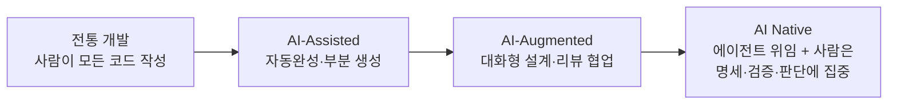
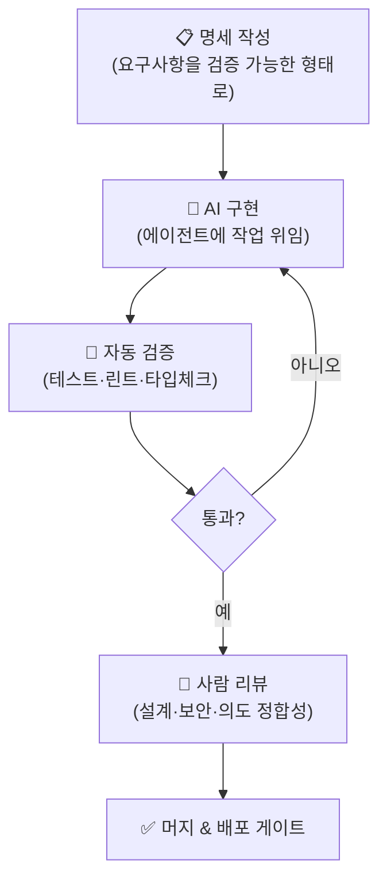
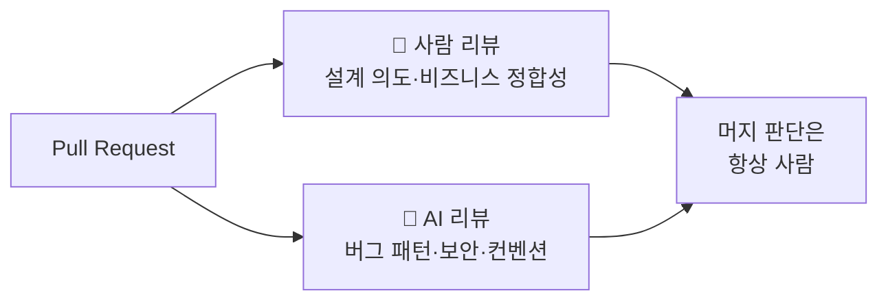
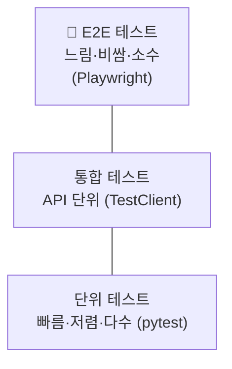
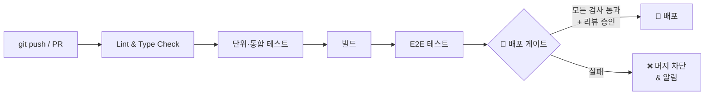

# 6. AI Native 방법론 & 개발 자동화 (48h · 6일)

> **교과목 목표**: 전 과목에서 실습해온 AI 도구 활용을 체계화하고, E2E 테스트 자동화와 배포 게이트를 구축할 수 있다.
> ※ AI 기반 개발 워크플로우는 1일차부터 전 과목에 걸쳐 적용하며, 본 과목에서 심화한다.

**핵심 개념**: AI Native 개발 패러다임 / 생성형 AI 기반 코드 생성·리뷰 심화 / 모델 튜닝 개념 / E2E 테스트 자동화 / GitHub Actions CI / 배포 게이트 설계

---

## 1. AI Native 개발 패러다임

### 1.1 개발 방식의 진화

### 1.2 AI Native 워크플로우

**패러다임 전환의 핵심**: 사람의 역할이 "코드 작성자"에서 **"명세자 + 검증자"**로 이동 → 따라서 **테스트 자동화가 AI Native의 전제 조건**.

### 1.3 AI 활용 수준별 장단점

| 수준 | 장점 | 단점/리스크 |
|---|---|---|
| 자동완성 | 도입 쉬움, 즉각적 생산성 | 미묘한 오류 수용 위험 |
| 대화형 협업 | 설계 논의·학습 효과 | 컨텍스트 전달 비용 |
| 에이전트 위임 | 대규모 작업 자동화 | **검증 체계 없으면 품질 붕괴** |

---

## 2. 생성형 AI 코드 생성·리뷰 심화

### 2.1 효과적인 코드 생성 프롬프트 구조

| 요소 | 내용 | 예 |
|---|---|---|
| 역할·맥락 | 프로젝트 스택·컨벤션 | "FastAPI+SQLAlchemy 계층형 구조" |
| 작업 정의 | 입력·출력·제약 | "태그 검색 API, 페이지네이션 포함" |
| 참조 코드 | 기존 패턴 예시 첨부 | 유사 라우터 코드 |
| 검증 기준 | 통과해야 할 테스트 | "이 pytest가 통과해야 함" |

### 2.2 AI 리뷰어 활용

| 구분 | 사람 리뷰 강점 | AI 리뷰 강점 |
|---|---|---|
| 잘 잡는 것 | 요구사항 오해, 설계 방향, 도메인 규칙 | 오타·널 처리·인젝션 패턴, 컨벤션, 반복 지적 |
| 한계 | 시간·피로, 사소한 것 놓침 | 맥락 밖 판단, 거짓 양성 |

---

## 3. 모델 튜닝 개념 (개요)

### 3.1 모델 커스터마이징 스펙트럼

### 3.2 접근법 비교

| 접근 | 장점 | 단점 | 적합 상황 |
|---|---|---|---|
| **프롬프팅** | 즉시 적용, 무학습 | 컨텍스트 한계, 일관성 | 대부분의 시작점 |
| **RAG** | 최신·사설 지식 반영, 출처 제시 | 검색 품질 의존, 파이프라인 운영 | 지식 기반 QA (→ 과목 7) |
| **파인튜닝** | 스타일·형식 내재화, 짧은 프롬프트 | 데이터·GPU 비용, 지식 갱신 어려움 | 고정된 말투·분류 태스크 |

> 판단 원칙: **"지식이 부족하면 RAG, 행동(스타일)이 부족하면 파인튜닝"**

---

## 4. 테스트 자동화

### 4.1 테스트 피라미드

| 테스트 종류 | 장점 | 단점 | 권장 비중 |
|---|---|---|:---:|
| 단위 | 빠른 피드백, 원인 특정 쉬움 | 통합 결함 못 잡음 | 70% |
| 통합 | 계층 간 결함 검출 | DB 등 환경 필요 | 20% |
| E2E | 실제 사용자 관점 검증 | 느림, 취약(flaky) | 10% |

### 4.2 E2E 자동화 (Playwright) 흐름

---

## 5. GitHub Actions CI & 배포 게이트

### 5.1 CI/CD 파이프라인

### 5.2 배포 게이트 설계

| 게이트 항목 | 기준 예시 | 자동/수동 |
|---|---|---|
| 테스트 통과 | 전체 테스트 green | 자동 |
| 커버리지 | 70% 이상 | 자동 |
| 정적 분석 | 린트 에러 0, 보안 스캔 통과 | 자동 |
| 코드 리뷰 | 승인 1인 이상 (AI 리뷰 참고) | 수동 |
| E2E | 핵심 시나리오 통과 | 자동 |

### 5.3 CI 도구 비교

| 도구 | 장점 | 단점 |
|---|---|---|
| **GitHub Actions** | 저장소 통합, 마켓플레이스 액션 풍부, 무료 티어 | 복잡 파이프라인 시 YAML 비대 |
| Jenkins | 완전한 커스터마이징, 온프레미스 | 서버 직접 운영 부담 |
| GitLab CI | GitLab 일체형 | GitHub 사용 팀엔 부적합 |

---

## 📅 일차별 강의 계획 (6일 × 8h)

| 일차 | 이론 (4h) | 실습 (3.5h) | 회고 (0.5h) |
|:---:|---|---|---|
| 1 | AI Native 패러다임, 워크플로우 재설계 | 그동안의 AI 활용 방식 회고 & 팀 워크플로우 정의 | 공유 |
| 2 | 프롬프트 심화, AI 리뷰 전략 | 에이전트로 기능 1개 완전 위임 → 검증 사이클 | 리뷰 |
| 3 | 모델 튜닝 개념(LoRA/QLoRA), 프롬프팅 vs RAG vs FT | 동일 태스크를 3가지 접근으로 비교 실험 | 결과 토론 |
| 4 | 테스트 피라미드, pytest·TestClient | 기존 프로젝트에 단위+통합 테스트 작성 | 리뷰 |
| 5 | E2E 자동화(Playwright) | 핵심 시나리오 3개 E2E 스크립트 작성 | 리뷰 |
| 6 | GitHub Actions, 배포 게이트 | **CI 파이프라인 구축: 테스트→커버리지→게이트→머지 차단 확인** | 과제 안내 |

---

## 📝 과목 과제 & 미니 프로젝트

### 과제 (개인)
1. 프롬프팅/RAG/파인튜닝 **선택 기준 비교 보고서** (실험 결과 포함, 2p)
2. 자기 프로젝트의 **테스트 전략 문서** (피라미드 비중·커버리지 목표)

### 미니 프로젝트 (팀) — "품질 게이트가 있는 자동화 저장소"
- **요구사항**: 기존 프로젝트(과목 2~5 산출물)에 ① 단위·통합 테스트 커버리지 70%+ ② Playwright E2E 3개+ ③ GitHub Actions CI ④ 브랜치 보호 규칙(게이트 실패 시 머지 차단) ⑤ AI 리뷰 봇 또는 AI 리뷰 절차 문서화
- **평가 기준**: 파이프라인 완성도(30) / 테스트 품질(30) / 게이트 설계 타당성(20) / AI 워크플로우 문서화(20)
