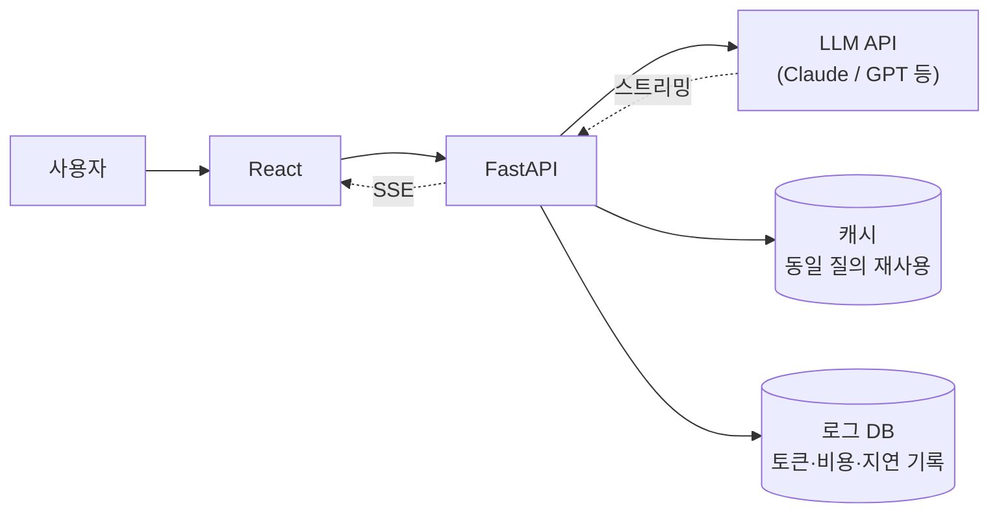
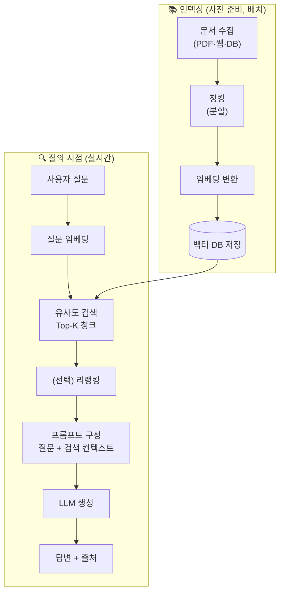
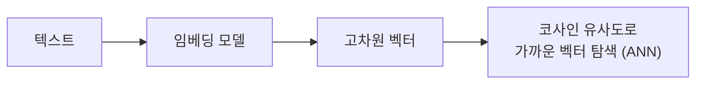
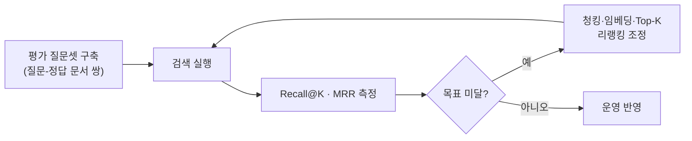
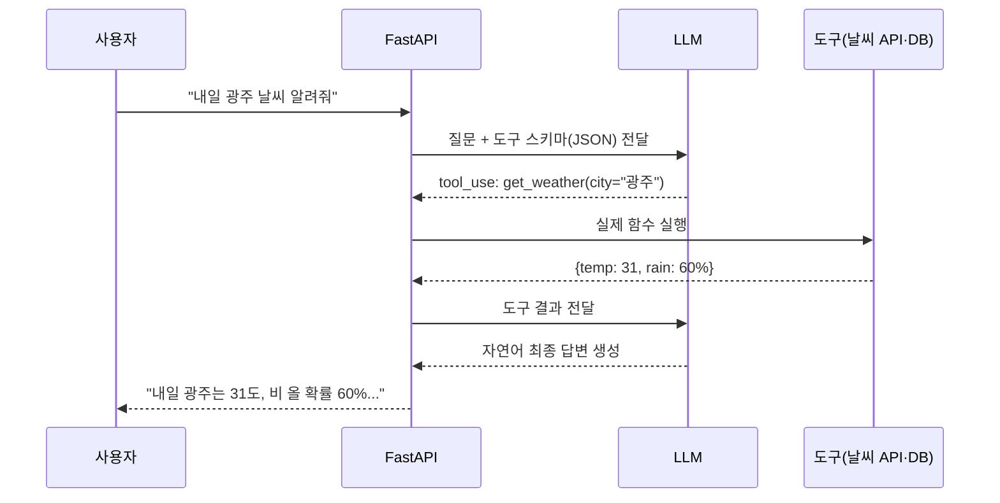
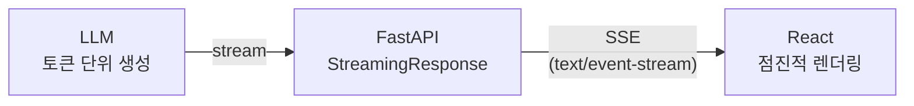

# 7. LLM 서비스 엔지니어링 & RAG 파이프라인 (56h · 7일)

> **교과목 목표**: LLM API를 서비스에 빠르게 통합하고, RAG 시스템을 구축하며 Function Calling으로 AI 기능을 완성할 수 있다.

**핵심 개념**: LLM API 활용·토큰 최적화 / LangChain / RAG 파이프라인 / 벡터 DB / 검색 품질 평가 / Function Calling·Tool Use / LLM 서비스 통합·스트리밍

---

## 1. LLM API 활용 & 토큰 최적화

### 1.1 LLM 서비스 통합 아키텍처

> ⚠️ **API 키는 반드시 백엔드에만** 보관. 프론트에서 직접 LLM 호출 금지.

### 1.2 토큰 최적화 전략

| 전략 | 방법 | 효과 |
|---|---|---|
| 프롬프트 다이어트 | 불필요한 예시·지시 제거 | 입력 토큰 절감 |
| 대화 이력 관리 | 오래된 턴 요약·절삭(sliding window) | 컨텍스트 폭증 방지 |
| 캐싱 | 동일/유사 질의 응답 재사용, 프롬프트 캐싱 | 비용·지연 대폭 절감 |
| 모델 라우팅 | 쉬운 질의→경량 모델, 어려운 질의→상위 모델 | 비용 최적화 |
| max_tokens 제한 | 출력 상한 설정 | 폭주 방지 |

### 1.3 직접 API vs LangChain

| 구분 | 직접 SDK 호출 | LangChain |
|---|---|---|
| 장점 | 단순·투명, 디버깅 쉬움, 의존성 최소 | 체인·RAG·도구 연결 추상화, 컴포넌트 교체 용이 |
| 단점 | RAG 등 조합 로직 직접 구현 | 추상화 계층 두꺼움, 버전 변화 잦음 |
| 권장 | 단순 호출·스트리밍 | RAG 파이프라인, 다단계 워크플로우 |

---

## 2. RAG 파이프라인

### 2.1 전체 구조 (인덱싱 + 검색·생성)

### 2.2 청킹 전략 비교

| 전략 | 장점 | 단점 |
|---|---|---|
| 고정 크기 (+overlap) | 단순·예측 가능 | 문장·의미 단위가 잘림 |
| 문단/구조 기반 | 의미 보존 | 크기 편차 큼 |
| 의미(시맨틱) 기반 | 검색 품질 우수 | 전처리 비용 |
| 계층형(부모-자식) | 정밀 검색 + 넓은 컨텍스트 제공 | 구현 복잡 |

### 2.3 RAG vs 파인튜닝 (복습 심화)

| 구분 | RAG | 파인튜닝 |
|---|---|---|
| 지식 갱신 | 문서 교체만으로 즉시 | 재학습 필요 |
| 출처 제시 | 가능 (환각 억제) | 불가 |
| 초기 비용 | 파이프라인 구축 | 데이터셋 + GPU |
| 잘하는 것 | 사실 기반 QA | 스타일·형식 일관성 |

---

## 3. 벡터 DB

### 3.1 유사도 검색 개념

### 3.2 벡터 DB 비교

| DB | 장점 | 단점 | 적합 |
|---|---|---|---|
| **Chroma** | 설치 즉시 사용, 학습용 최적 | 대규모 운영 기능 제한 | 프로토타입·학습 |
| **FAISS** | 초고속 라이브러리, 무료 | DB 아님(영속성·필터 직접 구현) | 연구·커스텀 |
| **pgvector** | 기존 PostgreSQL에 통합, 메타데이터 조인 | 초대규모에선 전용 DB 대비 성능 | **RDB 병행 서비스** ⭐ |
| **Pinecone** | 완전 관리형, 확장 쉬움 | 유료, 데이터 외부 저장 | 운영 규모 서비스 |

### 3.3 검색 품질 평가

| 지표 | 의미 |
|---|---|
| Hit Rate / Recall@K | 정답 문서가 Top-K에 포함된 비율 |
| MRR | 정답 문서의 순위 역수 평균 (상위 노출 정도) |
| Faithfulness | 답변이 검색 컨텍스트에 충실한가 (환각 측정) |
| Answer Relevancy | 답변이 질문에 부합하는가 |

---

## 4. Function Calling · Tool Use

### 4.1 동작 흐름

**핵심**: LLM은 "어떤 함수를 어떤 인자로 부를지"만 결정하고, **실행은 항상 우리 서버가** 한다 → 검증·권한 제어 지점 확보.

### 4.2 설계 시 주의점

| 항목 | 가이드 |
|---|---|
| 도구 설명 | 함수·파라미터 설명이 곧 프롬프트 — 명확하게 |
| 인자 검증 | LLM이 만든 인자는 신뢰 금지, Pydantic 재검증 |
| 권한 | 파괴적 작업(삭제·결제)은 사용자 확인 단계 삽입 |
| 루프 제한 | 도구 호출 횟수 상한으로 무한 루프 방지 |

---

## 5. 스트리밍 통합

| 방식 | 장점 | 단점 |
|---|---|---|
| 일반 응답 | 구현 단순 | 긴 생성 시 수십 초 공백 → UX 최악 |
| **SSE 스트리밍** | 첫 토큰 즉시 표시, 단방향에 최적 | 재연결 처리 필요 |
| WebSocket | 양방향(중단·후속 입력) | 구현·운영 복잡 |

---

## 📅 일차별 강의 계획 (7일 × 8h)

| 일차 | 이론 (4h) | 실습 (3.5h) | 회고 (0.5h) |
|:---:|---|---|---|
| 1 | LLM API 구조, 프롬프트·파라미터, 비용 | FastAPI에서 LLM 호출 API 구축, 토큰·비용 로깅 | 리뷰 |
| 2 | 토큰 최적화, 대화 이력 관리, 캐싱 | 멀티턴 챗 API + 이력 절삭·캐싱 적용 | 리뷰 |
| 3 | 임베딩·벡터 DB 개념 | 문서 임베딩 & Chroma/pgvector 유사도 검색 | 리뷰 |
| 4 | RAG 파이프라인, 청킹 전략, LangChain | 문서 QA RAG 구축 (출처 표시 포함) | 리뷰 |
| 5 | 검색 품질 평가 지표 | 평가셋 구축 → Recall@K 측정 → 청킹·Top-K 튜닝 | 결과 비교 |
| 6 | Function Calling 설계 | 도구 2종(DB 조회+외부 API) 연동 에이전트 구현 | 리뷰 |
| 7 | 스트리밍(SSE), 서비스 통합 | **React 채팅 UI에 스트리밍 RAG 챗봇 완전 통합** | 과제 안내 |

---

## 📝 과목 과제 & 미니 프로젝트

### 과제 (개인)
1. **검색 품질 평가 보고서**: 평가 질문 10개 이상으로 설정 2가지(청킹/Top-K) 비교
2. Function Calling **도구 스키마 설계서** (검증·권한 정책 포함)

### 미니 프로젝트 (개인) — "도메인 RAG 챗봇 서비스"
- **요구사항**: 자기 도메인 문서 20건 이상 인덱싱 / 출처를 표시하는 RAG 답변 / Function Calling 도구 1개 이상(예: DB 실시간 조회) / SSE 스트리밍 응답 / React 채팅 UI 통합 / 토큰 사용량 대시보드(간단 통계)
- **평가 기준**: RAG 품질·출처 표시(30) / Function Calling 안전 설계(25) / 스트리밍 UX(20) / 비용·토큰 관리(15) / 문서화(10)

> 🎉 본 과목 수료 후 커리큘럼상 **[세미 프로젝트] AI 기반 시장 데이터 분석**으로 이어집니다.
