# AI 프로젝트 일정(10일 기준)

---

# 목 차

1. [전체 개발전략](#1-전체-개발전략)
2. [10일 프로젝트의 3단계 구조](#2-10일-프로젝트의-3단계-구조)
3. [프로젝트 전체 흐름](#3-프로젝트-전체-흐름)
4. [프로젝트 시작 전 기본 원칙](#4-프로젝트-시작-전-기본-원칙)
5. [1일차 — 문제정의와 프로젝트 기획](#5-1일차--문제정의와-프로젝트-기획)
6. [2일차 — 요구사항 분석과 기능 분해](#6-2일차--요구사항-분석과-기능-분해)
7. [3일차 — UI·DB·API 설계](#7-3일차--uidbapi-설계)
8. [4일차 — 프로젝트 골격과 핵심 기능 구현](#8-4일차--프로젝트-골격과-핵심-기능-구현)
9. [5일차 — CRUD와 데이터 처리](#9-5일차--crud와-데이터-처리)
10. [6일차 — Frontend와 Backend 통합](#10-6일차--frontend와-backend-통합)
11. [7일차 — AI Assisted 개발 강화](#11-7일차--ai-assisted-개발-강화)
12. [8일차 — Agentic Development 적용](#12-8일차--agentic-development-적용)
13. [9일차 — 통합 테스트와 품질 개선](#13-9일차--통합-테스트와-품질-개선)
14. [10일차 — 배포·발표·최종 검증](#14-10일차--배포발표최종-검증)
15. [10일간 개발방법론 변화](#15-10일간-개발방법론-변화)
16. [사람과 AI의 역할 변화](#16-사람과-ai의-역할-변화)
17. [프로젝트 문서 체계](#17-프로젝트-문서-체계)
18. [Git 운영전략](#18-git-운영전략)
19. [AI Coding Agent 운영 규칙](#19-ai-coding-agent-운영-규칙)
20. [일일 프로젝트 운영 사이클](#20-일일-프로젝트-운영-사이클)
21. [프로젝트 완료 기준](#21-프로젝트-완료-기준)
22. [10일 프로젝트 최종 요약](#22-10일-프로젝트-최종-요약)

---

# 1. 전체 개발전략

10일 프로젝트에서는 처음부터 AI Agent에게 전체 시스템을 맡기지 않는다.

개발 방식을 단계적으로 발전시키는 것이 좋다.

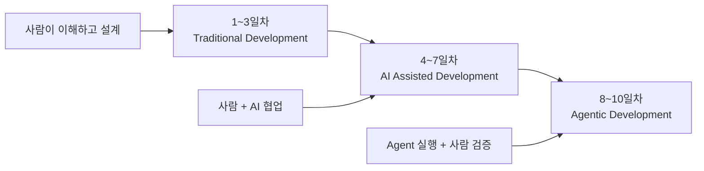

핵심은 다음과 같다.

> **먼저 사람이 프로젝트를 이해하고 설계한 후, AI의 참여 수준을 점진적으로 높인다.**

처음부터

```text
AI야, 이 프로젝트 전체를 만들어줘.
```

라고 요청하는 것은 권장하지 않는다.

권장되는 방식은 다음과 같다.

```text
사람이 이해
   ↓
사람이 설계
   ↓
AI와 함께 구현
   ↓
AI에게 반복 작업 위임
   ↓
Agent에게 작업 단위 위임
   ↓
사람이 최종 검증
```

---

# 2. 10일 프로젝트의 3단계 구조

전체 10일을 크게 세 단계로 나눈다.

| 단계 | 기간 | 개발 방식 | 핵심 목적 |
|---|---:|---|---|
| Phase 1 | 1~3일 | Traditional | 프로젝트 이해·분석·설계 |
| Phase 2 | 4~7일 | AI Assisted | AI와 협업하며 구현 |
| Phase 3 | 8~10일 | Agentic | Agent 활용·테스트·완성 |

전체 구조는 다음과 같다.

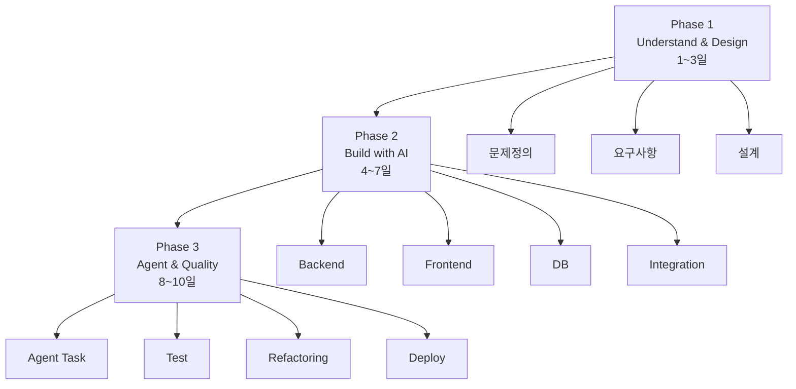

---

# 3. 프로젝트 전체 흐름

10일 프로젝트는 다음 흐름으로 진행한다.

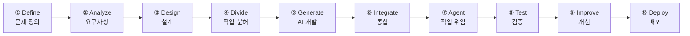

이 흐름을 프로젝트 전체의 기본 개발방법론으로 사용할 수 있다.

---

# 4. 프로젝트 시작 전 기본 원칙

프로젝트 시작 전에 다음 원칙을 팀 전체에 적용한다.

## 원칙 1. AI가 만든 코드도 팀의 코드다

AI가 작성했다고 해서 검토하지 않고 사용하면 안 된다.

```text
AI 생성
   ↓
코드 확인
   ↓
실행
   ↓
테스트
   ↓
팀 승인
   ↓
Commit
```

---

## 원칙 2. 한 번에 작은 작업만 맡긴다

나쁜 예:

```text
쇼핑몰 전체를 만들어줘.
```

좋은 예:

```text
상품 등록 POST API를 구현해줘.

조건:
- FastAPI 사용
- Pydantic 검증
- MariaDB 저장
- 실패 시 HTTPException
```

---

## 원칙 3. Commit은 정상 상태에서 한다

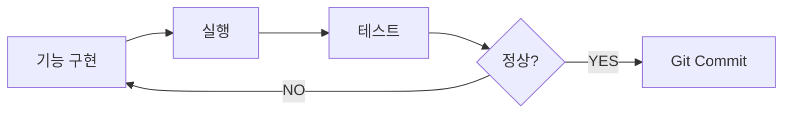

---

## 원칙 4. AI에게 Context를 제공한다

AI가 프로젝트를 잘 이해하려면 다음 정보가 필요하다.

```text
프로젝트 목적
기술 Stack
폴더 구조
DB 구조
API 규칙
Coding Rule
금지사항
현재 개발 상태
테스트 방법
```

---

# 5. 1일차 — 문제정의와 프로젝트 기획

## 개발 방식

**Traditional Development 중심**

AI는 아이디어 정리 도구로 사용한다.

---

## 목표

> 무엇을 왜 만드는지 명확하게 결정한다.

---

## 사람이 할 일

- 프로젝트 주제 결정
- 해결하려는 문제 정의
- 주요 사용자 정의
- 프로젝트 범위 결정
- 핵심 기능 결정
- 팀원 역할 분담

---

## AI가 할 일

- 아이디어 구체화
- 프로젝트 이름 후보 생성
- 문제정의 문장 정리
- 기능 후보 제안
- 유사 기능 분석
- 프로젝트 범위 초안 작성

AI에게 다음처럼 요청할 수 있다.

```text
우리 팀은 시장 데이터 분석 서비스를 개발하려고 한다.

사용자는 투자 데이터를 쉽게 확인하고 싶은 일반 사용자다.

프로젝트의
1. 문제정의
2. 주요 사용자
3. 핵심 기능
4. 프로젝트 범위
를 정리해줘.
```

---

## 작성 문서

```text
docs/
└─ 01_project_overview.md
```

내용:

```text
프로젝트명
프로젝트 배경
해결하려는 문제
목표 사용자
핵심 기능
기대 효과
프로젝트 범위
```

---

## Git 산출물

```text
README.md
docs/01_project_overview.md
```

Commit 예:

```text
docs: 프로젝트 개요 및 목표 정의
```

---

## 검증 기준

다음 질문에 팀원 모두 답할 수 있어야 한다.

- 우리가 무엇을 만드는가?
- 왜 만드는가?
- 누가 사용하는가?
- 핵심 기능은 무엇인가?
- 10일 안에 구현 가능한가?

---

# 6. 2일차 — 요구사항 분석과 기능 분해

## 개발 방식

**Traditional + AI Assisted**

---

## 목표

> 큰 아이디어를 실제 개발 가능한 기능으로 나눈다.

---

## 사람이 할 일

- 기능 요구사항 결정
- 우선순위 결정
- 필수 기능과 선택 기능 구분
- 프로젝트 범위 조정

---

## AI가 할 일

- 요구사항 초안 작성
- 기능 분류
- User Story 생성
- 기능 누락 확인
- 기능 Task 분해

---

## 기능 분해 예

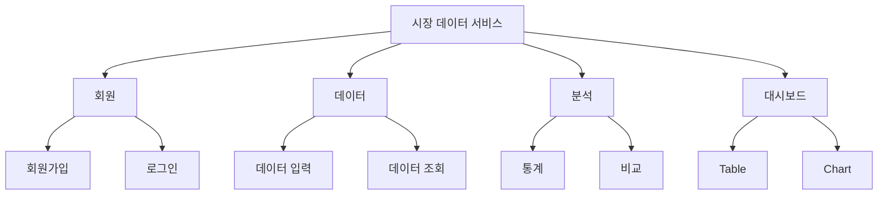

---

## 요구사항 우선순위

MoSCoW 방식도 사용할 수 있다.

```text
Must      반드시 구현
Should    가능하면 구현
Could     시간이 있으면 구현
Won't     이번 프로젝트 제외
```

예:

| 기능 | 우선순위 |
|---|---|
| 데이터 조회 | Must |
| 데이터 등록 | Must |
| 통계 | Must |
| 그래프 | Should |
| 로그인 | Should |
| AI 분석 | Won't |

---

## 작성 문서

```text
docs/
├─ 01_project_overview.md
└─ 02_requirements.md
```

---

## Git 산출물

```text
docs/02_requirements.md
```

Commit:

```text
docs: 기능 요구사항 및 우선순위 정의
```

---

## 검증 기준

모든 기능이 다음 형태로 설명되어야 한다.

```text
사용자는
[기능]을 통해
[목적]을 수행할 수 있다.
```

예:

```text
사용자는 상품 검색 기능을 통해
원하는 상품을 검색할 수 있다.
```

---

# 7. 3일차 — UI·DB·API 설계

## 개발 방식

**Traditional Design + AI Design Assistant**

---

# 목표

> 구현 전에 시스템의 전체 구조를 설계한다.

---

## 사람이 할 일

- 화면 구조 결정
- 데이터 구조 결정
- 테이블 관계 결정
- API 구조 결정
- 기술 Stack 최종 확정

---

## AI가 할 일

- ERD 초안 생성
- REST API 후보 생성
- 화면 구성 추천
- Architecture 검토
- 설계 문제점 발견

---

## 전체 Architecture

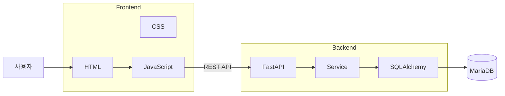

---

## DB 설계

예:

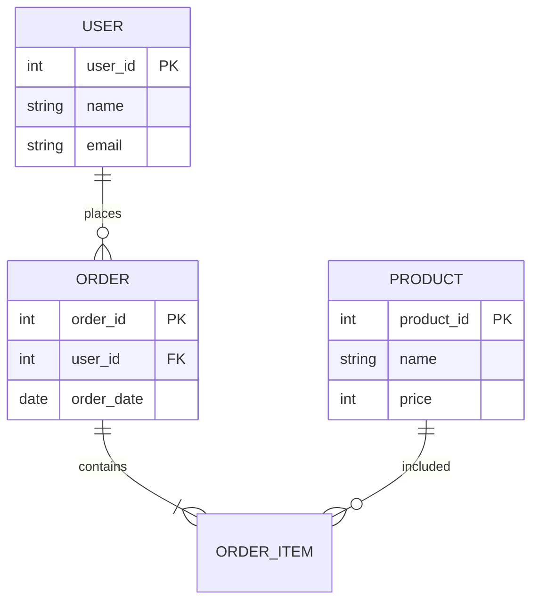

---

## API 설계

예:

| Method | URL | 기능 |
|---|---|---|
| GET | /products | 상품 목록 |
| GET | /products/{id} | 상품 조회 |
| POST | /products | 상품 등록 |
| PUT | /products/{id} | 상품 수정 |
| DELETE | /products/{id} | 상품 삭제 |

---

## 작성 문서

```text
docs/
├─ 03_ui_design.md
├─ 04_database_design.md
├─ 05_api_spec.md
└─ 06_architecture.md
```

---

## Git 산출물

```text
docs/*
```

Commit:

```text
docs: UI DB API architecture 설계 완료
```

---

## 검증 기준

개발을 시작하기 전에 최소한 다음 질문에 답할 수 있어야 한다.

```text
화면은 몇 개인가?
테이블은 몇 개인가?
각 테이블의 PK는 무엇인가?
테이블 관계는 어떻게 되는가?
Frontend는 어떤 API를 호출하는가?
Backend는 어떤 데이터를 반환하는가?
```

---

# 8. 4일차 — 프로젝트 골격과 핵심 기능 구현

## 개발 방식

**AI Assisted Development 시작**

---

## 목표

> 프로젝트가 처음으로 실제 실행되도록 만든다.

---

## 사람이 할 일

- 프로젝트 구조 결정
- AI 생성 코드 검토
- 개발환경 설정
- Git 관리
- 핵심 기능 확인

---

## AI가 할 일

- 디렉터리 생성
- 기본 코드 작성
- FastAPI 기본 설정
- DB 연결 코드
- Pydantic Model
- 기본 CRUD 생성

---

## 프로젝트 구조 예

```text
project/
│
├─ frontend/
│   ├─ index.html
│   ├─ css/
│   └─ js/
│
├─ backend/
│   ├─ main.py
│   ├─ models/
│   ├─ schemas/
│   ├─ routers/
│   └─ services/
│
├─ tests/
│
├─ docs/
│
├─ README.md
└─ CLAUDE.md
```

---

## 개발 흐름

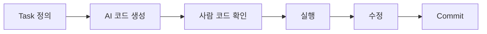

---

## Git 산출물

```text
backend 기본 구조
frontend 기본 구조
DB 연결
main.py
requirements.txt
```

Commit 예:

```text
feat: FastAPI 프로젝트 기본 구조 생성
```

---

## 검증 기준

최소 다음 기능이 실행되어야 한다.

```text
FastAPI 서버 실행
      ↓
Browser 접근
      ↓
GET /
      ↓
JSON 응답
```

---

# 9. 5일차 — CRUD와 데이터 처리

## 개발 방식

**AI Assisted Development**

---

## 목표

> 핵심 비즈니스 기능을 완성한다.

---

## 사람이 할 일

- CRUD 동작 확인
- SQL 결과 확인
- 데이터 검증 규칙 결정
- AI 코드 검토

---

## AI가 할 일

- CRUD 코드 생성
- SQLAlchemy Model 생성
- Pydantic Schema 작성
- 예외처리 생성
- 테스트 데이터 생성

---

## 개발 순서

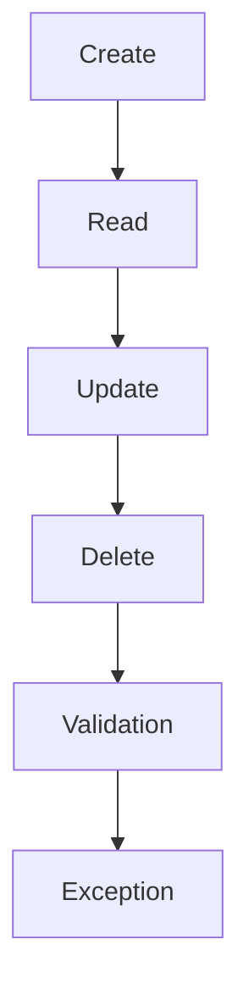

---

## Git 산출물

예:

```text
backend/models/product.py
backend/schemas/product.py
backend/routers/product.py
backend/services/product.py
```

Commit:

```text
feat: 상품 CRUD 기능 구현
```

---

## 검증 기준

각 API를 직접 테스트한다.

```text
POST 성공
GET 성공
PUT 성공
DELETE 성공
잘못된 입력 차단
없는 ID 처리
```

---

# 10. 6일차 — Frontend와 Backend 통합

## 개발 방식

**AI Assisted Full-stack Development**

---

## 목표

> 사용자가 실제 화면에서 Backend 기능을 사용할 수 있도록 한다.

---

## 사람이 할 일

- 화면 흐름 확인
- API 주소 확인
- 사용자 입력 검증
- UI 문제 수정

---

## AI가 할 일

- HTML 생성
- CSS 생성
- JavaScript fetch 코드
- API 연결
- 오류처리 코드 생성

---

## 데이터 흐름

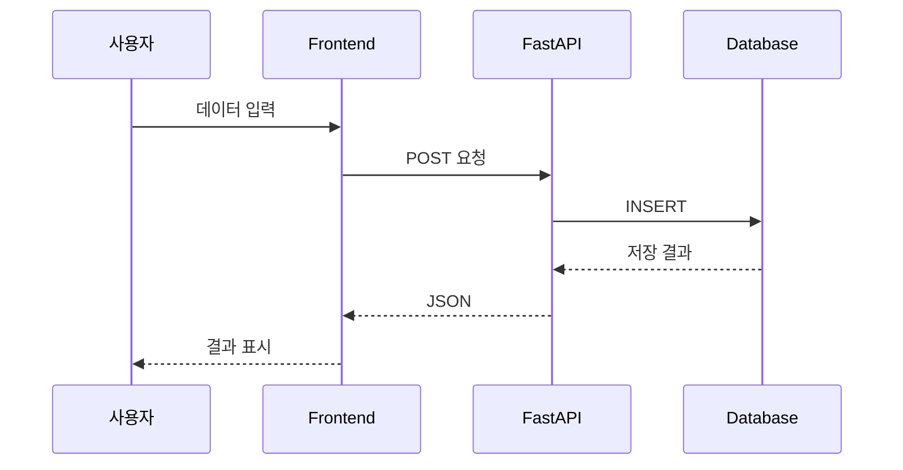

---

## Git 산출물

```text
frontend/index.html
frontend/js/app.js
frontend/css/style.css
```

Commit:

```text
feat: Frontend Backend API 연동
```

---

## 검증 기준

Browser에서 다음 흐름이 정상 동작해야 한다.

```text
입력
 ↓
API
 ↓
DB
 ↓
조회
 ↓
화면 출력
```

---

# 11. 7일차 — AI Assisted 개발 강화

## 개발 방식

**AI Assisted Development 고도화**

이 시점부터 AI는 단순 코드 생성기가 아니라

```text
Code Reviewer
Debugger
Test Generator
Refactoring Assistant
```

역할까지 담당한다.

---

## 사람이 할 일

- AI 작업 지시
- 결과 비교
- 설계 기준 유지
- 코드 승인

---

## AI가 할 일

- 버그 분석
- 코드 리팩토링
- 테스트 코드 생성
- 중복 코드 발견
- 예외처리 강화
- 주석·문서 생성

---

## AI 활용 사이클

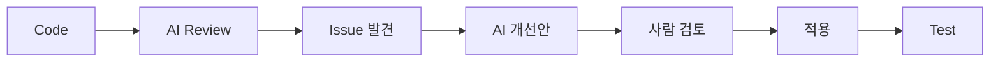

---

## 작성 문서

```text
docs/07_test_plan.md
docs/08_issue_log.md
```

---

## Git 산출물

Commit 예:

```text
refactor: 상품 서비스 로직 구조 개선
```

또는

```text
test: 상품 API 테스트 추가
```

---

## 검증 기준

AI가 변경한 코드에 대해 반드시 다음을 확인한다.

```text
기존 기능이 정상인가?
새로운 오류가 생기지 않았는가?
요구사항을 지키는가?
불필요한 코드가 추가되지 않았는가?
```

---

# 12. 8일차 — Agentic Development 적용

## 개발 방식

**Agentic Development 시작**

이제 단순 질문형 AI가 아니라 Coding Agent에게 실제 Task를 맡긴다.

---

# 핵심 변화

기존 방식:

```text
사람 → 코드 요청 → AI → 코드
```

Agent 방식:

```text
사람
 ↓
Task 정의
 ↓
Agent
 ├─ 분석
 ├─ 파일 탐색
 ├─ 코드 변경
 ├─ 실행
 ├─ 테스트
 └─ 결과 보고
```

---

## 사람이 할 일

- Task 작성
- 완료조건 정의
- 변경 허용 범위 설정
- Agent 결과 Review

---

## Agent가 할 일

예:

```text
상품 등록 API의 입력 검증을 개선한다.

완료조건:
1. 가격은 0보다 커야 한다.
2. 상품명은 필수다.
3. 테스트 코드를 추가한다.
4. 기존 API URL은 변경하지 않는다.
```

Agent는 다음 과정을 수행한다.

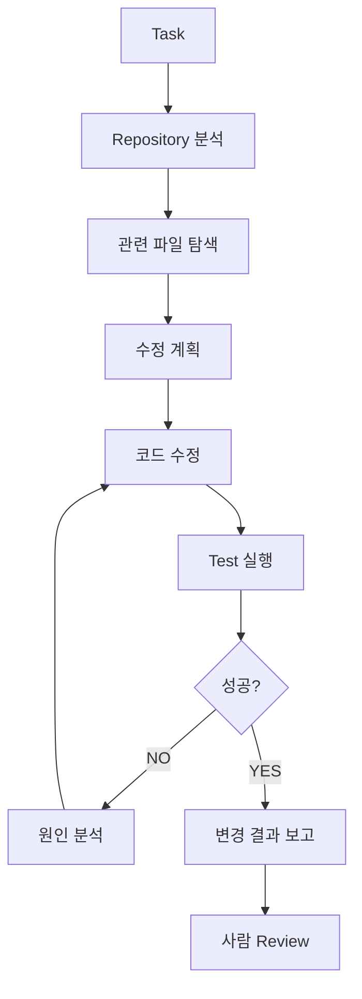

---

## Agent용 프로젝트 규칙

예:

```text
CLAUDE.md
```

```text
# Project Rule

Backend
- FastAPI 사용
- SQLAlchemy 사용
- Pydantic 사용

Frontend
- Vanilla JavaScript 사용
- React 사용 금지

Database
- MariaDB

Rule
- API URL 임의 변경 금지
- DB 구조 임의 변경 금지
- 새로운 라이브러리 설치 전 확인
- 작업 후 테스트 실행
```

---

## Git 산출물

Commit:

```text
feat: AI agent를 이용한 입력 검증 개선
```

---

## 검증 기준

Agent가

```text
어떤 파일을 변경했는가?
왜 변경했는가?
어떤 테스트를 수행했는가?
기존 기능에 영향이 없는가?
```

를 설명할 수 있어야 한다.

---

# 13. 9일차 — 통합 테스트와 품질 개선

## 개발 방식

**Agentic QA + Human Review**

---

## 목표

> 기능 추가를 멈추고 품질을 높인다.

이 시점부터 새로운 기능 추가는 최소화한다.

---

## 사람이 할 일

- 전체 사용 시나리오 테스트
- UI 확인
- 요구사항 체크
- 최종 우선순위 판단

---

## AI / Agent가 할 일

- 테스트 케이스 생성
- API 자동 테스트
- 코드 Review
- 에러 로그 분석
- Dead Code 탐색
- 중복 코드 탐색

---

## 테스트 구조

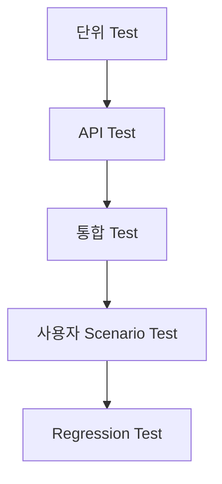

---

## 사용자 Scenario 예

```text
상품 등록
 ↓
상품 조회
 ↓
상품 수정
 ↓
상품 검색
 ↓
상품 삭제
```

---

## 작성 문서

```text
docs/
├─ 07_test_plan.md
├─ 08_issue_log.md
└─ 09_test_result.md
```

---

## Git 산출물

Commit:

```text
fix: 통합 테스트 발견 오류 수정
```

---

## 검증 기준

Must 기능 기준으로

```text
정상 동작률 100%
```

을 목표로 한다.

---

# 14. 10일차 — 배포·발표·최종 검증

## 개발 방식

**Human Controlled Agentic Development**

마지막 결정은 사람이 한다.

---

## 사람이 할 일

- 최종 기능 확인
- 배포 승인
- 발표자료 정리
- 프로젝트 회고
- 결과 평가

---

## AI가 할 일

- README 정리
- API 문서 작성
- 발표자료 초안
- 프로젝트 요약
- 개선점 정리

---

## 배포 흐름

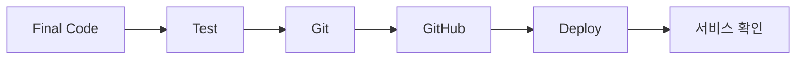

---

## 작성 문서

```text
README.md
docs/10_deployment.md
docs/11_final_report.md
```

---

## Git 산출물

예:

```text
release: v1.0 프로젝트 최종 버전
```

필요하다면 Tag:

```text
v1.0.0
```

---

## 최종 검증 기준

```text
프로그램 실행 가능
핵심 기능 정상
DB 연결 정상
Frontend Backend 연결 정상
오류 처리 가능
README 존재
Git History 존재
발표 Demo 가능
```

---

# 15. 10일간 개발방법론 변화

전체 과정을 다시 보면 다음과 같다.

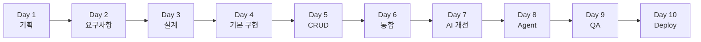

방법론으로 표현하면

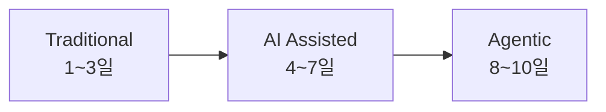

---

# 16. 사람과 AI의 역할 변화

프로젝트가 진행될수록 역할이 바뀐다.

| 단계 | 사람 역할 | AI 역할 |
|---|---|---|
| 1~3일 | 분석·판단·설계 | 아이디어·초안 |
| 4~5일 | 설계·검토 | 코드 생성 |
| 6~7일 | 통합·품질관리 | Debug·Test·Refactor |
| 8~9일 | Task 정의·Review | Agent 실행 |
| 10일 | 최종 승인 | 문서·지원 |

이를 표현하면 다음과 같다.

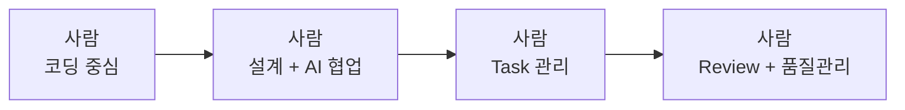

---

# 17. 프로젝트 문서 체계

10일 프로젝트에서는 너무 많은 문서를 작성할 필요는 없다.

다음 정도가 적당하다.

```text
docs/
│
├─ 01_project_overview.md
├─ 02_requirements.md
├─ 03_ui_design.md
├─ 04_database_design.md
├─ 05_api_spec.md
├─ 06_architecture.md
├─ 07_test_plan.md
├─ 08_issue_log.md
├─ 09_test_result.md
├─ 10_deployment.md
└─ 11_final_report.md
```

추가:

```text
README.md
CLAUDE.md
```

---

# 18. Git 운영전략

Git은 단순 백업 도구가 아니라 프로젝트 진행 기록이다.

---

## Branch 구조

짧은 프로젝트에서는 복잡하게 만들 필요가 없다.

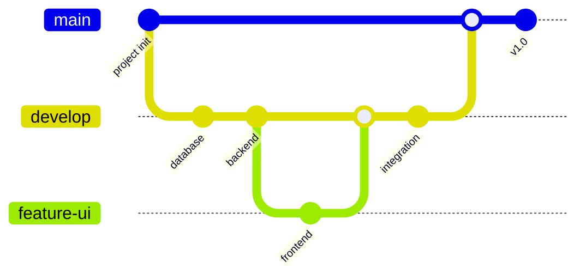

추천:

```text
main
develop
feature/기능명
```

---

## Commit 기본 규칙

```text
feat      기능 추가
fix       오류 수정
docs      문서 수정
test      테스트
refactor  리팩토링
style     UI 및 스타일
```

예:

```text
feat: 회원 등록 API 구현

fix: 존재하지 않는 상품 조회 오류 수정

docs: API 명세서 수정

test: 상품 CRUD 테스트 추가
```

---

# 19. AI Coding Agent 운영 규칙

AI Agent를 사용할 때는 최소한 다음 5가지를 명확하게 전달한다.

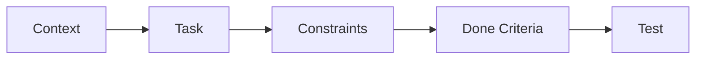

---

## 1. Context

현재 프로젝트 상황

```text
FastAPI + MariaDB 프로젝트
상품 CRUD까지 구현되어 있다.
```

---

## 2. Task

AI가 해야 하는 일

```text
상품 검색 기능 구현
```

---

## 3. Constraints

하지 말아야 할 것

```text
DB 구조 변경 금지
기존 API URL 변경 금지
새 Library 설치 금지
```

---

## 4. Done Criteria

완료조건

```text
GET /products/search?q=노트북

검색 결과 JSON 반환
```

---

## 5. Test

검증방법

```text
검색 결과 존재
빈 결과 정상 처리
잘못된 입력 처리
```

---

# 20. 일일 프로젝트 운영 사이클

매일 같은 개발 리듬을 유지하는 것이 좋다.

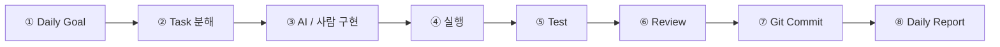

하루 운영 예:

```text
09:00 ~ 09:30
오늘 목표 정의

09:30 ~ 10:00
Task 분해

10:00 ~ 12:00
개발

13:00 ~ 15:00
개발

15:00 ~ 16:00
통합

16:00 ~ 17:00
테스트

17:00 ~ 17:30
Git 정리

17:30 ~ 18:00
일일 회고
```

---

# 21. 프로젝트 완료 기준

프로젝트에서 가장 위험한 표현은

```text
거의 다 됐습니다.
```

이다.

완료 조건을 명확하게 정의해야 한다.

이를 흔히 **Definition of Done**이라고 한다.

---

## Definition of Done 예

기능 하나가 완료되었다고 판단하려면

```text
□ 요구사항 구현
□ 실행 가능
□ 오류 없음
□ 입력 검증
□ API 테스트
□ UI 테스트
□ 코드 Review
□ Git Commit
□ 문서 반영
```

을 만족해야 한다.

---

# 22. 10일 프로젝트 최종 요약

전체 프로젝트 운영방법을 한 장으로 정리하면 다음과 같다.

```mermaid
flowchart TD

    A["DAY 1<br/>문제 정의"]
    --> B["DAY 2<br/>요구사항"]
    --> C["DAY 3<br/>UI·DB·API 설계"]

    C --> D["DAY 4<br/>프로젝트 골격"]
    --> E["DAY 5<br/>CRUD"]
    --> F["DAY 6<br/>Frontend 통합"]
    --> G["DAY 7<br/>AI Debug·Test·Refactor"]

    G --> H["DAY 8<br/>Coding Agent"]
    --> I["DAY 9<br/>통합 테스트"]
    --> J["DAY 10<br/>배포·발표"]

    subgraph T["Traditional"]
        A
        B
        C
    end

    subgraph AI["AI Assisted"]
        D
        E
        F
        G
    end

    subgraph AG["Agentic"]
        H
        I
        J
    end
```

10일간 사람의 역할도 다음처럼 변화한다.

```mermaid
flowchart LR
    A["문제 해결자"]
    --> B["분석가"]
    --> C["설계자"]
    --> D["AI 협업 개발자"]
    --> E["AI Task 관리자"]
    --> F["Code Reviewer"]
    --> G["품질 책임자"]
```

따라서 이 프로젝트에서 배우는 것은 단순한 프로그램 개발이 아니다.

### 1단계

```text
직접 분석하고 설계한다.
```

### 2단계

```text
AI Coding Assistant와 함께 개발한다.
```

### 3단계

```text
AI Coding Agent에게 작업을 위임한다.
```

### 4단계

```text
Agent가 만든 결과를 개발자가 검증한다.
```

결국 AI 시대의 프로젝트 개발 핵심은

> **AI에게 코딩을 맡기는 것이 아니라, 사람이 문제를 정의하고 프로젝트를 설계한 후 AI가 수행할 수 있는 작업 단위로 분해하고, AI가 만든 결과를 실행·테스트·검증하는 능력을 기르는 것**

이다.

10일 프로젝트의 전체 개발 사이클을 가장 간단하게 표현하면 다음과 같다.

```text
DEFINE
문제를 정의한다.
   ↓
DESIGN
구조를 설계한다.
   ↓
DIVIDE
작업을 작은 단위로 나눈다.
   ↓
DELEGATE
사람 또는 AI에게 작업을 맡긴다.
   ↓
DEVELOP
기능을 구현한다.
   ↓
TEST
실제로 실행한다.
   ↓
REVIEW
코드와 결과를 검증한다.
   ↓
COMMIT
정상 상태를 저장한다.
   ↓
DEPLOY
서비스를 배포한다.
```

즉,

# **Define → Design → Divide → Delegate → Develop → Test → Review → Commit → Deploy**

를 **AI Coding 시대의 10일 프로젝트 운영방법론**으로 사용할 수 있다.
