# AI와 함께하는 데이터베이스 설계 및 구축 절차

---

# 목 차

1. [전체 개요](#1-전체-개요)
2. [AI와 DB 설계를 할 때의 기본 원칙](#2-ai와-db-설계를-할-때의-기본-원칙)
3. [전체 수행 절차](#3-전체-수행-절차)
4. [1단계 요구사항에서 데이터 찾기](#4-1단계-요구사항에서-데이터-찾기)
5. [2단계 엔터티 도출](#5-2단계-엔터티-도출)
6. [3단계 속성 정의](#6-3단계-속성-정의)
7. [4단계 PK와 식별자 결정](#7-4단계-pk와-식별자-결정)
8. [5단계 엔터티 관계 설정](#8-5단계-엔터티-관계-설정)
9. [6단계 정규화 검토](#9-6단계-정규화-검토)
10. [7단계 논리 ERD 작성](#10-7단계-논리-erd-작성)
11. [8단계 물리 데이터베이스 설계](#11-8단계-물리-데이터베이스-설계)
12. [9단계 SQL DDL 생성](#12-9단계-sql-ddl-생성)
13. [10단계 샘플 데이터 생성](#13-10단계-샘플-데이터-생성)
14. [11단계 CRUD SQL 작성](#14-11단계-crud-sql-작성)
15. [12단계 집계·통계 SQL 작성](#15-12단계-집계통계-sql-작성)
16. [13단계 AI를 이용한 DB 검증](#16-13단계-ai를-이용한-db-검증)
17. [14단계 백엔드 ORM 연결](#17-14단계-백엔드-orm-연결)
18. [15단계 마이그레이션 적용](#18-15단계-마이그레이션-적용)
19. [사람과 AI의 역할 구분](#19-사람과-ai의-역할-구분)
20. [AI에게 요청하는 좋은 프롬프트](#20-ai에게-요청하는-좋은-프롬프트)
21. [잘못된 DB 설계 요청 방식](#21-잘못된-db-설계-요청-방식)
22. [권장 DB 설계 협업 사이클](#22-권장-db-설계-협업-사이클)
23. [프로젝트 문서와 Git 산출물](#23-프로젝트-문서와-git-산출물)
24. [10일 프로젝트에서의 배치](#24-10일-프로젝트에서의-배치)
25. [최종 정리](#25-최종-정리)

---

# 1. 전체 개요

AI를 이용하면 데이터베이스 설계를 매우 빠르게 수행할 수 있다.

하지만 다음처럼 요청하는 것은 좋지 않다.

```text
쇼핑몰 데이터베이스 전체를 만들어줘.
```

AI는 많은 테이블과 SQL을 한꺼번에 생성할 수 있지만, 사용자가 구조를 이해하지 못하면 이후 문제가 발생했을 때 수정하기 어렵다.

권장 방식은 다음과 같다.


즉 AI는 **DB 설계자 대신 생각해 주는 존재**라기보다

> 설계 초안을 빠르게 만들고, 누락과 문제점을 찾아주는 설계 보조자

로 사용하는 것이 적절하다.

---

# 2. AI와 DB 설계를 할 때의 기본 원칙

## 원칙 1. 요구사항을 먼저 정의한다

DB 설계는 테이블부터 만드는 것이 아니다.

먼저 시스템에서 어떤 정보를 관리해야 하는지 알아야 한다.

```text
요구사항
    ↓
데이터
    ↓
테이블
```

---

## 원칙 2. AI에게 단계별로 요청한다

좋은 흐름:

```text
요구사항 분석
→ 엔터티 추출
→ 속성 정의
→ 관계 설정
→ 정규화
→ ERD
→ SQL
```

---

## 원칙 3. AI 제안은 반드시 검토한다

AI가 다음과 같이 제안했다고 가정한다.

```text
Customer
Order
Product
Payment
Delivery
```

사람은 반드시 확인해야 한다.

```text
Payment가 정말 필요한가?
Delivery를 별도 테이블로 만들 필요가 있는가?
Order와 Product는 N:M 관계인가?
중간 테이블이 필요한가?
```

---

## 원칙 4. 업무 규칙이 DB 구조보다 먼저다

예:

```text
한 고객은 여러 주문을 할 수 있다.
한 주문에는 여러 상품이 포함될 수 있다.
하나의 상품은 여러 주문에 포함될 수 있다.
```

이 규칙으로부터 관계가 결정된다.

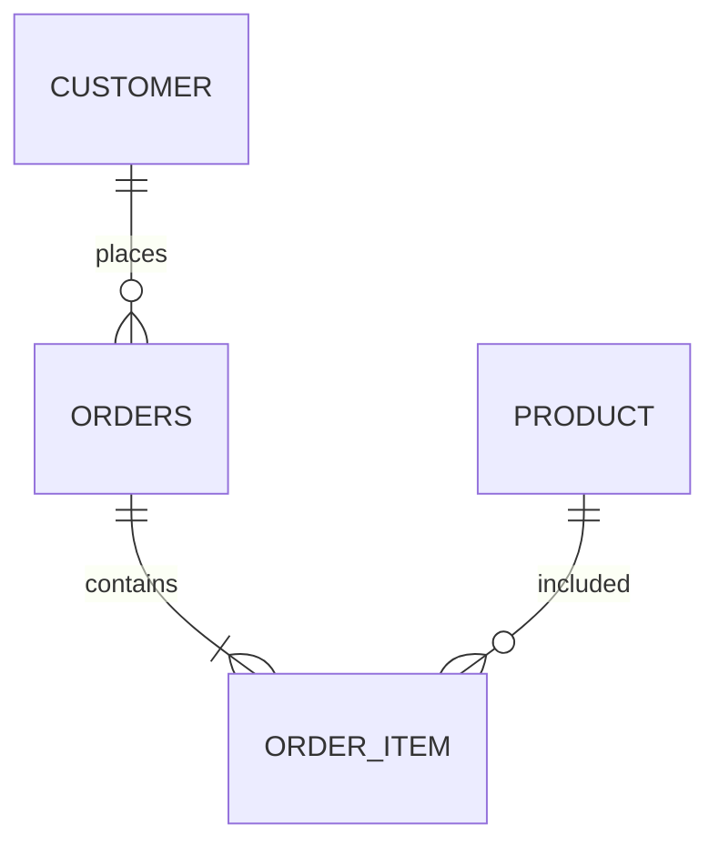

---

# 3. 전체 수행 절차

AI와 데이터베이스를 설계하는 전체 과정은 다음과 같다.

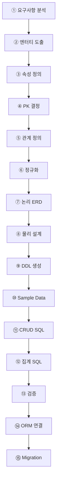

---

# 4. 1단계 요구사항에서 데이터 찾기

예를 들어 다음 요구사항이 있다고 하자.

```text
사용자는 회원가입할 수 있다.

회원은 상품을 조회하고 주문할 수 있다.

한 주문에는 여러 상품이 포함될 수 있다.

주문 후 배송 정보를 관리한다.
```

이 문장에서 데이터 후보를 찾는다.

AI에게 다음과 같이 요청할 수 있다.

```text
다음 요구사항에서 관리해야 할 데이터 후보를 찾아줘.

- 사용자는 회원가입할 수 있다.
- 회원은 상품을 조회하고 주문할 수 있다.
- 한 주문에는 여러 상품이 포함될 수 있다.
- 주문 후 배송 정보를 관리한다.

아직 테이블은 만들지 말고 데이터 후보만 정리해줘.
```

AI 결과 예:

```text
회원
상품
주문
주문상품
배송
```

여기서 중요한 것은

> 아직 테이블을 만들지 않는 것이다.

---

# 5. 2단계 엔터티 도출

데이터 후보를 실제 관리 대상으로 정리한다.

예:

| 데이터 후보 | 엔터티 여부 |
|---|---|
| 회원 | O |
| 상품 | O |
| 주문 | O |
| 주문상품 | O |
| 배송 | O |
| 상품조회 | X |

`상품조회`는 행동이므로 일반적으로 엔터티가 아니다.

---

## 엔터티란?

관리해야 하는 대상을 의미한다.

예:

```text
Customer
Product
Order
Delivery
```

AI에게 다음과 같이 요청한다.

```text
다음 데이터 후보 중 데이터베이스 엔터티로 적절한 것을 선정하고
선정 이유를 설명해줘.

회원
상품
주문
주문상품
배송
상품조회
로그인
```

---

# 6. 3단계 속성 정의

엔터티가 결정되면 각 엔터티가 어떤 정보를 가져야 하는지 정한다.

예:

### Customer

```text
customer_id
name
email
phone
address
created_at
```

### Product

```text
product_id
name
price
stock
created_at
```

AI에게 요청:

```text
Customer 엔터티에 필요한 속성을 제안해줘.

조건:
- 쇼핑몰 회원관리
- 로그인 가능
- 배송 주소 관리
- 최소한의 컬럼만 사용
```

AI의 결과를 그대로 사용하지 말고 불필요한 컬럼은 제거한다.

---

# 7. 4단계 PK와 식별자 결정

각 테이블의 행을 구분하기 위한 Primary Key를 결정한다.

예:

```text
Customer
customer_id

Product
product_id

Orders
order_id
```

대표적으로 다음 방식을 사용할 수 있다.

```text
정수형 ID

customer_id INT
product_id INT
```

또는

```text
UUID
```

교육용 프로젝트에서는 일반적으로 정수형 ID가 이해하기 쉽다.

---

# 8. 5단계 엔터티 관계 설정

이 단계가 DB 설계에서 매우 중요하다.

다음 질문을 사용한다.

```text
한 고객은 주문을 몇 개 할 수 있는가?

한 주문은 고객을 몇 명 가지는가?

한 주문에는 상품이 몇 개 들어갈 수 있는가?

한 상품은 몇 개의 주문에 포함될 수 있는가?
```

---

## Customer : Order

```text
Customer 1 : N Order
```

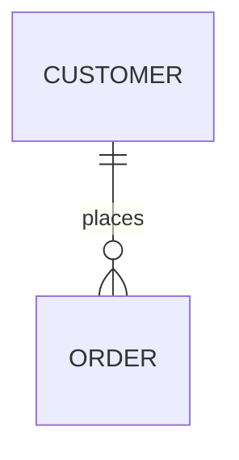

---

## Order : Product

한 주문에는 여러 상품이 포함된다.

하나의 상품도 여러 주문에서 판매될 수 있다.

따라서

```text
Order N : M Product
```

관계이다.

관계형 DB에서는 중간 테이블을 사용한다.

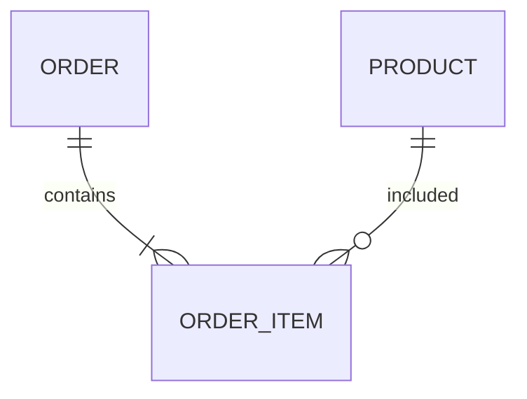

---

# 9. 6단계 정규화 검토

AI는 정규화를 검토하는 데 매우 유용하다.

예를 들어 다음 테이블이 있다고 하자.

```text
Orders

order_id
customer_name
customer_phone
product1
product2
product3
price1
price2
price3
```

문제가 많다.

AI에게 다음처럼 요청할 수 있다.

```text
다음 Orders 테이블을
1NF, 2NF, 3NF 관점에서 분석하고
문제점과 개선 구조를 설명해줘.
```

개선:

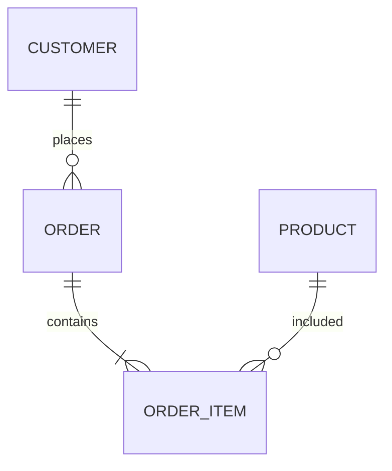

---

## 정규화의 목적

쉽게 말하면

> 같은 데이터를 여러 곳에 반복 저장하지 않도록 구조를 나누는 것

이다.

---

# 10. 7단계 논리 ERD 작성

이제 엔터티와 관계를 ERD로 표현한다.

예:

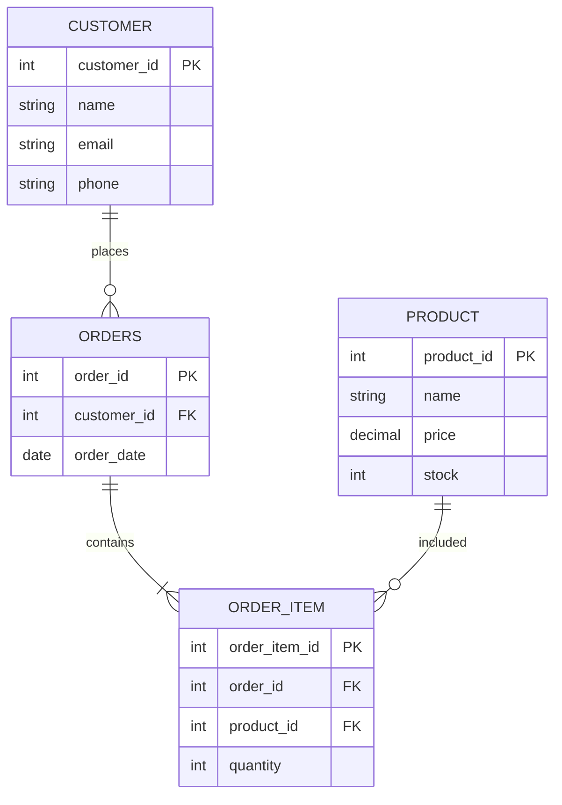

AI에게 다음과 같이 요청하면 좋다.

```text
지금까지 결정한 엔터티와 관계를 기준으로
Mermaid ER Diagram을 만들어줘.

새로운 엔터티를 임의로 추가하지 말고
현재 설계만 표현해줘.
```

---

# 11. 8단계 물리 데이터베이스 설계

논리 설계가 완료되면 실제 DBMS에 맞춰 설계한다.

예:

```text
MariaDB
PostgreSQL
MySQL
```

논리 속성:

```text
상품가격
```

물리 설계:

```sql
price DECIMAL(10,2)
```

논리 속성:

```text
상품명
```

물리 설계:

```sql
name VARCHAR(100)
```

---

## AI에게 요청할 내용

```text
현재 ERD를 MariaDB 기준의 물리 설계로 변환해줘.

각 컬럼에 대해
- 데이터형
- NULL 여부
- PK
- FK
- UNIQUE
- DEFAULT
를 제안해줘.
```

---

# 12. 9단계 SQL DDL 생성

물리 설계가 완료된 후에 SQL을 만든다.

```sql
CREATE TABLE customer (
    customer_id INT AUTO_INCREMENT PRIMARY KEY,
    name VARCHAR(50) NOT NULL,
    email VARCHAR(100) NOT NULL UNIQUE,
    phone VARCHAR(20)
);
```

AI 활용:

```text
현재 확정된 물리 설계를 기준으로
MariaDB CREATE TABLE 문을 생성해줘.

조건:
- 테이블 생성 순서 고려
- PK/FK 포함
- UNIQUE 포함
- 불필요한 컬럼 추가 금지
```

---

## 중요한 원칙

AI에게 곧바로

```text
쇼핑몰 DB SQL 만들어줘.
```

라고 하지 않는다.

반드시

```text
요구사항
→ ERD
→ 물리설계
→ DDL
```

순서로 진행한다.

---

# 13. 10단계 샘플 데이터 생성

테이블을 생성하면 테스트 데이터가 필요하다.

AI는 샘플 데이터 생성에 매우 유용하다.

예:

```sql
INSERT INTO product (name, price, stock)
VALUES
('노트북', 1200000, 10),
('키보드', 50000, 30),
('마우스', 30000, 50);
```

AI 요청:

```text
Product 테이블 테스트용 데이터 20건을 만들어줘.

조건:
- 상품명이 서로 달라야 한다.
- 가격은 현실적인 값으로 한다.
- stock은 0~100
- MariaDB INSERT SQL로 작성한다.
```

---

# 14. 11단계 CRUD SQL 작성

다음으로 기본 SQL을 만든다.

```text
Create
Read
Update
Delete
```

예:

```sql
SELECT *
FROM product;
```

```sql
INSERT INTO product(name, price, stock)
VALUES ('모니터', 300000, 10);
```

```sql
UPDATE product
SET price = 280000
WHERE product_id = 1;
```

```sql
DELETE FROM product
WHERE product_id = 1;
```

AI에게는 코드 생성뿐 아니라 설명도 요청하는 것이 좋다.

```text
각 SQL을 생성하고
초보자가 이해할 수 있도록
각 절의 역할을 설명해줘.
```

---

# 15. 12단계 집계·통계 SQL 작성

프로젝트에서는 단순 CRUD보다 통계 기능이 중요하다.

예:

```sql
SELECT
    category,
    COUNT(*) AS product_count,
    AVG(price) AS avg_price,
    MIN(price) AS min_price,
    MAX(price) AS max_price
FROM product
GROUP BY category;
```

AI는 다음 작업에 유용하다.

```text
GROUP BY
HAVING
JOIN
Subquery
Aggregate Function
```

예:

```text
상품 카테고리별로
상품 수, 평균 가격, 최저 가격, 최고 가격을
조회하는 SQL을 작성해줘.

먼저 SQL을 작성한 후
실행 순서를 설명해줘.
```

---

# 16. 13단계 AI를 이용한 DB 검증

AI를 DB 설계 Reviewer로 사용한다.

AI에게 다음 질문을 한다.

```text
현재 ERD를 검토해줘.

다음 관점에서 문제를 찾아줘.

1. PK 누락
2. FK 누락
3. N:M 관계 처리
4. 중복 데이터
5. 정규화 문제
6. NULL 설계
7. UNIQUE 제약조건
8. 인덱스 후보
```

검토 흐름:

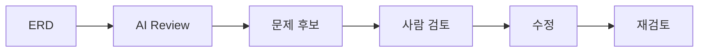

AI가 문제라고 지적했다고 해서 반드시 변경하는 것은 아니다.

최종 판단은 사람이 한다.

---

# 17. 14단계 백엔드 ORM 연결

DB를 구축한 후 FastAPI와 연결한다고 가정한다.

구조:

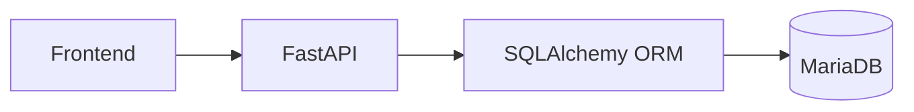

AI에게 다음과 같이 요청할 수 있다.

```text
다음 MariaDB Product 테이블을 기준으로
SQLAlchemy ORM Model을 작성해줘.

DB 테이블 구조를 임의로 변경하지 말아줘.
```

예:

```python
class Product(Base):
    __tablename__ = "product"

    product_id = Column(Integer, primary_key=True)
    name = Column(String(100), nullable=False)
    price = Column(Numeric(10, 2), nullable=False)
    stock = Column(Integer, default=0)
```

---

# 18. 15단계 마이그레이션 적용

프로젝트가 진행되면 DB 구조가 바뀔 수 있다.

예:

```text
Product

기존
name
price

변경
name
price
stock
category_id
```

실제 프로젝트에서는 테이블을 삭제하고 다시 만드는 방식은 좋지 않다.

따라서 Migration을 사용한다.

예:

```text
SQLAlchemy
+
Alembic
```

흐름:

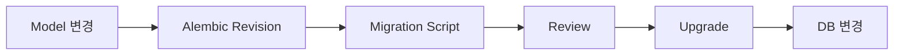

AI에게 다음처럼 요청할 수 있다.

```text
Product에 stock 컬럼을 추가하려고 한다.

SQLAlchemy Model 변경과
Alembic Migration 절차를 정리해줘.

기존 데이터를 삭제하지 않아야 한다.
```

---

# 19. 사람과 AI의 역할 구분

AI와 DB를 설계할 때 가장 중요한 부분이다.

| 작업 | 사람 | AI |
|---|:---:|:---:|
| 업무 이해 | ★★★ | ★ |
| 요구사항 결정 | ★★★ | ★★ |
| 엔터티 후보 | ★★ | ★★★ |
| 속성 후보 | ★★ | ★★★ |
| 관계 초안 | ★★ | ★★★ |
| 정규화 검토 | ★★ | ★★★ |
| ERD 생성 | ★★ | ★★★ |
| SQL 생성 | ★ | ★★★ |
| Sample Data | ★ | ★★★ |
| Test Query | ★★ | ★★★ |
| 최종 구조 결정 | ★★★ | ★ |
| 성능 판단 | ★★★ | ★★ |
| 데이터 안전성 | ★★★ | ★★ |

핵심:

```text
AI
= 설계 후보 생성 + 검토 지원

사람
= 최종 설계 결정
```

---

# 20. AI에게 요청하는 좋은 프롬프트

## 나쁜 요청

```text
DB 만들어줘.
```

---

## 좋은 요청

```text
현재 프로젝트는 쇼핑몰이다.

기능은 다음과 같다.

1. 회원가입
2. 상품등록
3. 주문
4. 주문에는 여러 상품이 포함된다.

현재 단계에서는
테이블을 생성하지 말고
필요한 엔터티 후보만 정리해줘.

각 엔터티가 필요한 이유도 설명해줘.
```

---

## 관계 설계 프롬프트

```text
현재 엔터티는 다음과 같다.

Customer
Product
Order

각 엔터티 사이의 관계를
1:1, 1:N, N:M으로 분석해줘.

N:M 관계라면
왜 중간 테이블이 필요한지도 설명해줘.
```

---

## 정규화 프롬프트

```text
현재 테이블 구조를
1NF, 2NF, 3NF 기준으로 검토해줘.

단순히 수정 결과만 작성하지 말고

1. 현재 문제
2. 문제가 발생하는 이유
3. 개선 방법

순서로 설명해줘.
```

---

# 21. 잘못된 DB 설계 요청 방식

다음 방식은 피하는 것이 좋다.

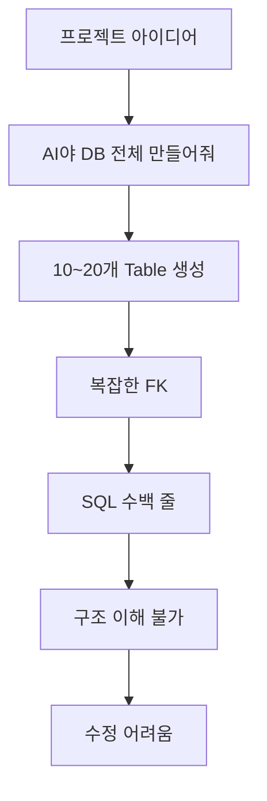

특히 프로젝트 초기부터 AI가

```text
User
Role
Permission
UserRole
Product
Category
ProductCategory
Order
OrderItem
Payment
Delivery
Address
Cart
CartItem
...
```

처럼 많은 테이블을 제안할 수 있다.

10일 프로젝트라면 필요 이상의 구조가 될 수 있다.

---

# 22. 권장 DB 설계 협업 사이클

가장 권장하는 방식이다.

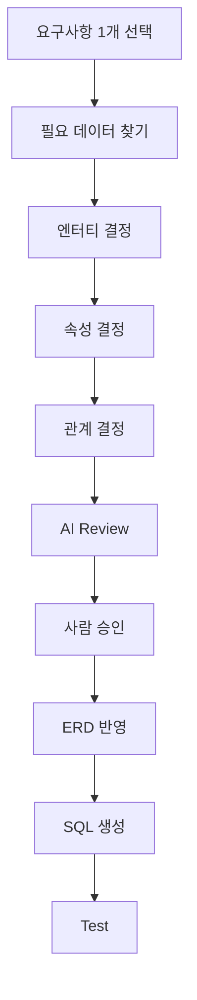

이를 반복한다.

```text
회원 기능
    ↓
DB 설계

상품 기능
    ↓
DB 설계 추가

주문 기능
    ↓
DB 설계 확장
```

이를 **점진적 DB 설계**로 볼 수 있다.

---

# 23. 프로젝트 문서와 Git 산출물

DB 설계와 관련해 다음 문서를 권장한다.

```text
docs/
│
├─ 02_requirements.md
├─ 04_database_design.md
├─ 04-1_erd.md
├─ 04-2_table_spec.md
└─ 04-3_db_test.md
```

SQL 파일:

```text
database/
│
├─ schema.sql
├─ sample_data.sql
├─ queries.sql
└─ migration/
```

---

## Git Commit 예

초기 DB 설계:

```text
docs: 데이터베이스 엔터티 및 관계 정의
```

DDL:

```text
feat: 초기 데이터베이스 스키마 생성
```

샘플 데이터:

```text
test: 데이터베이스 샘플 데이터 추가
```

관계 수정:

```text
refactor: 주문과 상품 관계 구조 개선
```

---

# 24. 10일 프로젝트에서의 배치

앞서 작성한 프로젝트 일정과 연결하면 다음과 같다.

| 일차 | DB 작업 | AI 활용 |
|---:|---|---|
| 1일 | 데이터 요구사항 발견 | 요구사항 분석 지원 |
| 2일 | 엔터티 후보 도출 | 엔터티·속성 후보 |
| 3일 | ERD·정규화·물리설계 | 관계 및 정규화 검토 |
| 4일 | DB 생성 | DDL 생성 |
| 5일 | CRUD·집계 SQL | SQL 생성 및 설명 |
| 6일 | Backend 연결 | ORM 코드 생성 |
| 7일 | DB 오류·쿼리 개선 | AI Review |
| 8일 | Agent DB 작업 | Migration·Test |
| 9일 | 통합 DB Test | 테스트 생성 |
| 10일 | 최종 DB 검증 | 문서 자동 정리 |

전체 흐름:

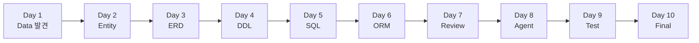

---

# 25. 최종 정리

AI와 함께하는 데이터베이스 개발의 핵심은 다음 순서다.

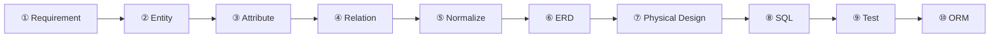

이를 사람과 AI의 역할로 다시 보면 다음과 같다.

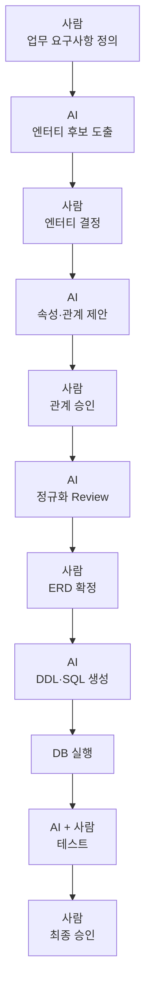

따라서 가장 중요한 원칙은 다음과 같다.

> **AI에게 데이터베이스를 만들어 달라고 하는 것이 아니라, 설계 단계를 작은 의사결정 단위로 나누어 AI에게 후보와 검토 의견을 받고 사람이 하나씩 확정해 나가는 방식이 가장 적절하다.**

프로젝트에서는 이를 다음 **8단계 DB 개발 사이클**로 단순화할 수 있다.

```text
DEFINE
관리해야 할 데이터를 정의한다.
       ↓
IDENTIFY
엔터티와 속성을 찾는다.
       ↓
RELATE
엔터티 관계를 정의한다.
       ↓
NORMALIZE
중복과 구조 문제를 제거한다.
       ↓
DESIGN
ERD와 물리 구조를 확정한다.
       ↓
GENERATE
AI를 이용해 DDL·SQL을 생성한다.
       ↓
TEST
데이터와 쿼리를 검증한다.
       ↓
INTEGRATE
Backend ORM과 연결한다.
```

즉,

# **Define → Identify → Relate → Normalize → Design → Generate → Test → Integrate**

를 **AI와 협업하는 데이터베이스 설계·구축 방법론**으로 사용할 수 있다.

특히 학습 프로젝트에서는 **AI가 처음부터 ERD를 완성해 주는 방식보다, 요구사항 문장에서 엔터티를 찾고 → 관계를 판단하고 → 정규화한 뒤 → 마지막에 AI로 SQL을 생성하도록 하는 방식**이 데이터베이스 개념 학습과 AI 활용 능력을 동시에 높이기에 적합하다.
