아래 문서는 **전통적인 프로젝트 개발방법론 → 애자일/DevOps → AI 코딩 어시스턴트 → AI 코딩 에이전트 중심 개발방법론**으로 발전 과정을 연결해 이해할 수 있도록 구성했습니다. 특히 프로젝트를 처음 수행하는 개발자가 **“무엇을 먼저 하고, AI에게 무엇을 맡기며, 사람은 무엇을 검증해야 하는가”**를 중심으로 정리했습니다.


# 전통적 프로젝트 개발방법론과 AI 코딩 어시스턴트 기반 개발방법론

---

# 전체 목차

1. [프로젝트 개발방법론이란?](#1-프로젝트-개발방법론이란)
2. [소프트웨어 개발방법론의 발전 과정](#2-소프트웨어-개발방법론의-발전-과정)
3. [전통적인 폭포수 Waterfall 방법론](#3-전통적인-폭포수-waterfall-방법론)
4. [프로토타이핑 Prototyping 방법론](#4-프로토타이핑-prototyping-방법론)
5. [반복적·점진적 개발방법론](#5-반복적점진적-개발방법론)
6. [애자일 Agile 개발방법론](#6-애자일-agile-개발방법론)
7. [스크럼 Scrum 개발방법론](#7-스크럼-scrum-개발방법론)
8. [DevOps 개발방법론](#8-devops-개발방법론)
9. [전통적인 프로젝트 개발 프로세스 정리](#9-전통적인-프로젝트-개발-프로세스-정리)
10. [AI 코딩 어시스턴트란?](#10-ai-코딩-어시스턴트란)
11. [AI 코딩 도구의 발전 단계](#11-ai-코딩-도구의-발전-단계)
12. [AI 코딩 어시스턴트 기반 개발방법론](#12-ai-코딩-어시스턴트-기반-개발방법론)
13. [AI 코딩 에이전트 기반 개발방법론](#13-ai-코딩-에이전트-기반-개발방법론)
14. [AI 시대 프로젝트의 전체 개발 절차](#14-ai-시대-프로젝트의-전체-개발-절차)
15. [단계별 AI 활용 방법](#15-단계별-ai-활용-방법)
16. [AI에게 맡길 일과 사람이 해야 할 일](#16-ai에게-맡길-일과-사람이-해야-할-일)
17. [AI 개발에서 문서가 더 중요해지는 이유](#17-ai-개발에서-문서가-더-중요해지는-이유)
18. [AI 코딩 프로젝트의 권장 문서 구조](#18-ai-코딩-프로젝트의-권장-문서-구조)
19. [AI 코딩 프로젝트의 권장 디렉터리 구조](#19-ai-코딩-프로젝트의-권장-디렉터리-구조)
20. [AI 개발의 핵심 반복 사이클](#20-ai-개발의-핵심-반복-사이클)
21. [전통 개발과 AI 개발 비교](#21-전통-개발과-ai-개발-비교)
22. [잘못된 AI 코딩 방식](#22-잘못된-ai-코딩-방식)
23. [권장 AI 코딩 방식](#23-권장-ai-코딩-방식)
24. [프로젝트 적용 예시](#24-프로젝트-적용-예시)
25. [최종 정리](#25-최종-정리)

---

# 1. 프로젝트 개발방법론이란?

소프트웨어 프로젝트를 진행할 때 단순히

> "프로그램부터 만들자."

라고 시작하면 프로젝트가 커질수록 문제가 발생한다.

예를 들어 쇼핑몰을 만든다고 생각해보자.

처음에는 단순히 상품 목록만 구현하려고 했지만 개발하면서 다음과 같은 기능이 계속 추가될 수 있다.

- 회원가입
- 로그인
- 상품관리
- 장바구니
- 주문
- 결제
- 배송
- 관리자 페이지

이러한 기능을 아무런 계획 없이 개발하면 코드가 복잡해지고 수정하기 어려워진다.

따라서 프로젝트를 체계적으로 수행하기 위한 **절차와 규칙**이 필요하다.

이를 **소프트웨어 개발방법론(Software Development Methodology)**이라고 한다.

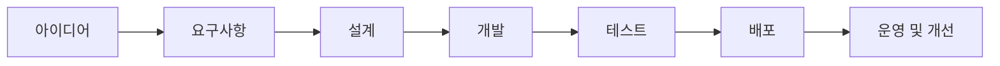

즉 개발방법론은 다음 질문에 대한 답을 제공한다.

- 무엇을 개발할 것인가?
- 어떤 순서로 개발할 것인가?
- 누가 어떤 일을 할 것인가?
- 어떻게 테스트할 것인가?
- 변경사항을 어떻게 관리할 것인가?
- 언제 배포할 것인가?

---

# 2. 소프트웨어 개발방법론의 발전 과정

소프트웨어 개발방법론은 다음과 같이 발전해 왔다.

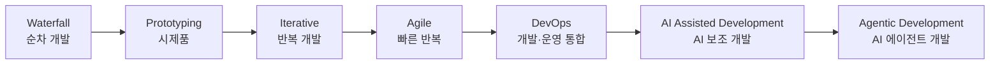

핵심 변화는 다음과 같다.

```text
과거
사람이 모든 것을 직접 분석하고 코딩

        ↓

AI 코딩 어시스턴트
사람이 설계하고 AI가 코드 생성을 지원

        ↓

AI 코딩 에이전트
사람이 목표와 제약조건을 정의하고
AI가 여러 작업을 자율적으로 수행
```

---

# 3. 전통적인 폭포수 Waterfall 방법론

폭포수 방법론은 개발 과정을 위에서 아래로 순차적으로 진행한다.

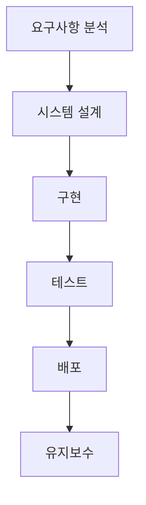

## 3.1 요구사항 분석

어떤 프로그램을 만들 것인지 결정한다.

예:

```text
성적관리 시스템

학생 등록
학생 조회
학생 수정
학생 삭제
총점 계산
평균 계산
학점 계산
```

대표 산출물:

- 요구사항 정의서
- 기능 목록
- 사용자 요구사항

---

## 3.2 시스템 설계

프로그램 구조를 설계한다.

예:

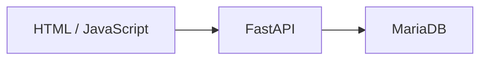

설계 내용:

- 화면 설계
- API 설계
- DB 설계
- 프로그램 구조 설계

---

## 3.3 구현

설계된 내용을 실제 코드로 작성한다.

```text
Frontend
   ↓
HTML
CSS
JavaScript

Backend
   ↓
Python
FastAPI

Database
   ↓
MariaDB
```

---

## 3.4 테스트

프로그램이 정상적으로 작동하는지 확인한다.

예:

```text
학생등록 버튼 클릭
      ↓
POST /students
      ↓
DB 저장
      ↓
저장 결과 확인
```

---

## 3.5 배포

개발된 프로그램을 실제 서버에서 실행한다.

---

## 3.6 유지보수

버그 수정 및 새로운 기능을 추가한다.

---

## 폭포수 방법론의 장단점

| 장점 | 단점 |
|---|---|
| 단계가 명확하다 | 변경 대응이 어렵다 |
| 문서화가 잘 된다 | 결과물을 늦게 확인한다 |
| 관리하기 쉽다 | 개발 후반 문제 발견 위험이 있다 |
| 대규모 프로젝트 관리에 유리하다 | 요구사항이 자주 바뀌는 프로젝트에 불리하다 |

---

# 4. 프로토타이핑 Prototyping 방법론

처음부터 완성된 프로그램을 만드는 것이 아니라 **시제품을 먼저 만든다.**

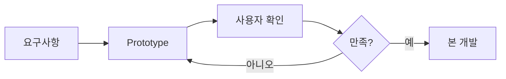

예를 들어 쇼핑몰을 개발한다면 먼저 다음 화면만 만들어 볼 수 있다.

```text
로그인
상품 목록
상품 상세
장바구니
주문
```

실제 기능은 없더라도 화면을 먼저 확인할 수 있다.

오늘날의 **Figma UI 설계**도 프로토타이핑 과정과 밀접하게 관련된다.

---

# 5. 반복적·점진적 개발방법론

전체 시스템을 한 번에 완성하지 않고 조금씩 완성한다.

예:

```text
1차
회원관리

2차
상품관리

3차
주문관리

4차
결제

5차
배송관리
```

이를 시각화하면 다음과 같다.

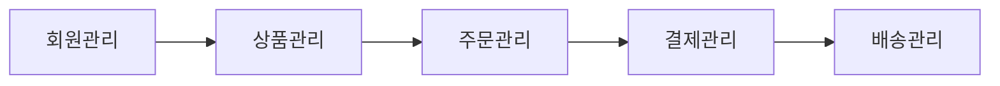

각 단계마다

```text
분석 → 설계 → 개발 → 테스트
```

가 반복된다.

---

# 6. 애자일 Agile 개발방법론

Agile은 완벽한 계획을 처음부터 세우기보다 **작은 기능을 빠르게 개발하고 계속 개선**하는 방식이다.

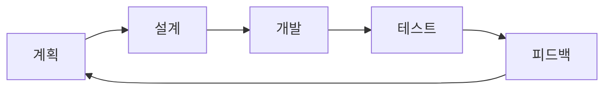

핵심 개념은 다음과 같다.

```text
작게 만든다.
    ↓
빠르게 실행한다.
    ↓
사용해 본다.
    ↓
문제를 발견한다.
    ↓
수정한다.
```

---

# 7. 스크럼 Scrum 개발방법론

Scrum은 Agile을 실제 프로젝트에 적용하기 위한 대표적인 방법이다.

보통 **Sprint**라는 짧은 개발 기간을 사용한다.

예:

```text
Sprint 1 : 로그인
Sprint 2 : 상품
Sprint 3 : 장바구니
Sprint 4 : 주문
```

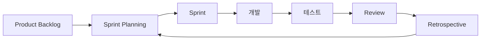

---

# 8. DevOps 개발방법론

DevOps는

> Development + Operations

즉 **개발과 운영을 연결하는 방법**이다.

과거에는 다음과 같았다.

```text
개발자
   ↓
개발 완료
   ↓
운영팀
   ↓
서버 배포
```

DevOps에서는 자동화를 적극 활용한다.

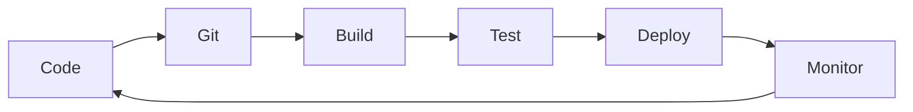

대표 기술:

- Git
- GitHub
- Docker
- GitHub Actions
- CI/CD
- Cloud
- Monitoring

---

# 9. 전통적인 프로젝트 개발 프로세스 정리

지금까지의 방법론을 종합하면 일반적인 프로젝트는 다음과 같은 구조를 가진다.

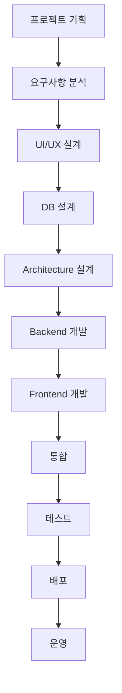

이 구조는 AI 시대에도 사라지지 않는다.

중요한 것은 **각 단계에서 AI가 개발자를 도와주기 시작했다는 것**이다.

---

# 10. AI 코딩 어시스턴트란?

AI Coding Assistant는 개발 과정에서 개발자를 도와주는 AI이다.

예를 들면 다음과 같은 일을 할 수 있다.

```text
코드 작성
코드 설명
오류 분석
코드 수정
리팩토링
테스트 코드 생성
SQL 생성
API 문서 생성
주석 생성
프로젝트 구조 분석
```

개발 방식은 다음처럼 변화한다.

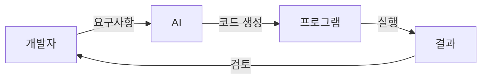

따라서 개발자의 역할도

```text
코드 작성자
```

에서

```text
문제 정의자
+ 설계자
+ AI 지시자
+ 코드 검토자
+ 품질 책임자
```

로 확대된다.

---

# 11. AI 코딩 도구의 발전 단계

AI 코딩 기술은 크게 다음 단계로 구분할 수 있다.

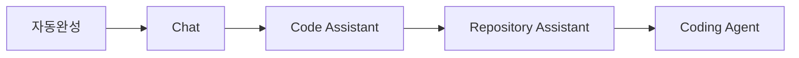

## 11.1 자동완성

```python
def add(a, b):
```

까지 작성하면 AI가

```python
    return a + b
```

를 추천한다.

---

## 11.2 Chat 기반 개발

개발자가 질문한다.

```text
FastAPI로 학생 등록 API를 만들어줘.
```

AI가 코드를 생성한다.

---

## 11.3 프로젝트 Context 기반 개발

AI가 여러 파일을 분석한다.

```text
frontend/
backend/
database/
README.md
```

그리고 프로젝트 전체 구조를 이해하면서 코드를 수정한다.

---

## 11.4 AI Coding Agent

AI가 목표를 전달받고 여러 작업을 스스로 수행한다.

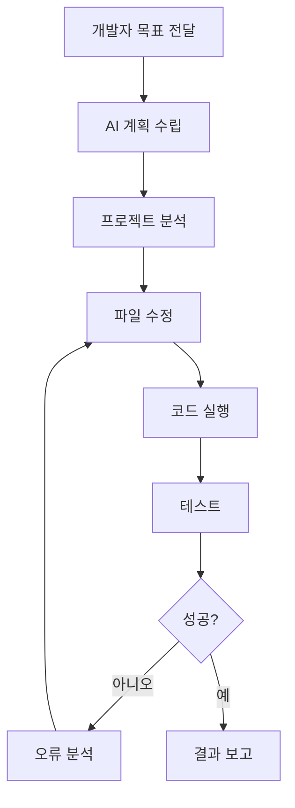

---

# 12. AI 코딩 어시스턴트 기반 개발방법론

AI를 이용한다고 기존 개발방법론이 없어지는 것은 아니다.

권장 구조는 다음과 같다.

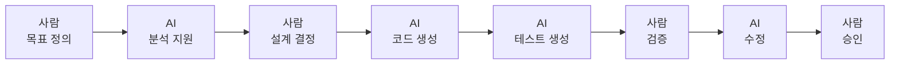

핵심 원칙은 다음이다.

> **AI가 개발을 도와주지만 최종 의사결정과 품질 책임은 사람이 가진다.**

---

# 13. AI 코딩 에이전트 기반 개발방법론

Coding Agent를 사용하면 개발 방식이 한 단계 더 발전한다.

기존 방식:

```text
사람
 ↓
파일 생성
 ↓
코딩
 ↓
실행
 ↓
오류 수정
```

Agent 방식:

```text
사람
 ↓
목표 정의
 ↓
Agent
 ├─ 프로젝트 분석
 ├─ 계획 수립
 ├─ 코드 작성
 ├─ 파일 수정
 ├─ 테스트
 ├─ 오류 분석
 └─ 결과 보고
```

이를 구조적으로 표현하면 다음과 같다.

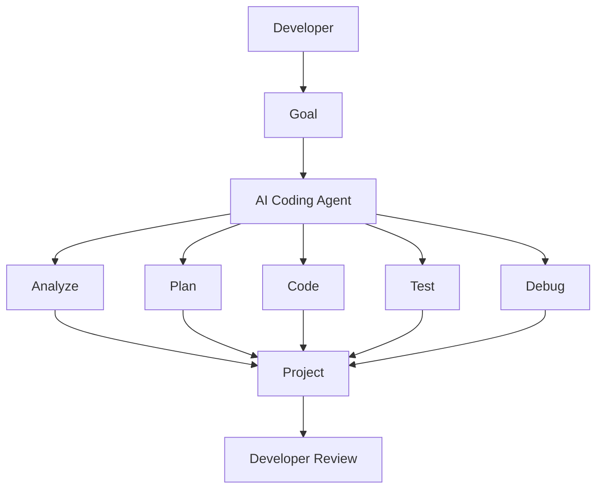

---

# 14. AI 시대 프로젝트의 전체 개발 절차

AI를 이용한 프로젝트에서 다음과 같은 절차를 권장할 수 있다.

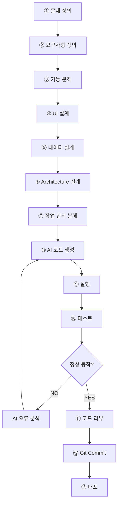

여기서 가장 중요한 것은

> **AI에게 처음부터 전체 프로젝트를 한 번에 만들어 달라고 하지 않는 것**

이다.

---

# 15. 단계별 AI 활용 방법

## 15.1 프로젝트 기획

사람이 정의:

```text
어떤 문제를 해결할 것인가?
누가 사용할 것인가?
핵심 기능은 무엇인가?
```

AI 활용:

```text
아이디어 정리
유사 서비스 분석
기능 목록 작성
요구사항 초안 작성
```

---

## 15.2 요구사항 분석

예:

```text
학생 성적관리 시스템

학생 등록
학생 조회
학생 수정
학생 삭제

국어
영어
수학

총점
평균
학점
```

AI에게 다음과 같이 요청한다.

```text
위 기능을 기준으로
기능 요구사항과 비기능 요구사항을 구분해줘.
```

---

## 15.3 기능 분해

큰 기능을 작은 기능으로 나눈다.

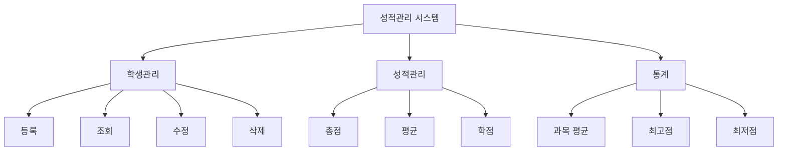

---

# 16. AI에게 맡길 일과 사람이 해야 할 일

AI Coding에서 가장 중요한 구분이다.

| 업무 | 사람 | AI |
|---|:---:|:---:|
| 문제 정의 | ★★★ | ★ |
| 요구사항 정리 | ★★★ | ★★ |
| Architecture 결정 | ★★★ | ★★ |
| DB 초안 | ★★ | ★★★ |
| 반복 코드 작성 | ★ | ★★★ |
| API 코드 | ★★ | ★★★ |
| 테스트 생성 | ★★ | ★★★ |
| 오류 분석 | ★★ | ★★★ |
| 보안 검토 | ★★★ | ★★ |
| 최종 검증 | ★★★ | ★ |
| 비즈니스 판단 | ★★★ | ★ |

AI 시대의 핵심은

```text
사람이 덜 생각하는 것
```

이 아니라

```text
사람은 중요한 판단에 집중하고
반복적인 작업을 AI에게 맡기는 것
```

이다.

---

# 17. AI 개발에서 문서가 더 중요해지는 이유

전통 개발에서는 문서를 주로 **사람끼리 의사소통하기 위해** 사용했다.

AI Coding에서는 문서가 하나의 역할을 더 가진다.

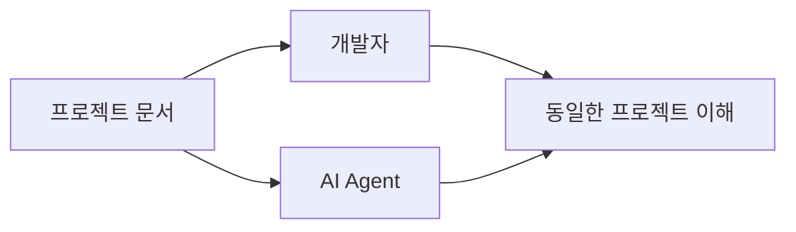

즉 문서는

> **사람과 AI가 공유하는 프로젝트 Context**

가 된다.

잘 정리된 문서가 있으면 AI도 훨씬 정확하게 작업할 수 있다.

---

# 18. AI 코딩 프로젝트의 권장 문서 구조

다음과 같은 문서를 준비하면 좋다.

```text
docs/

01_project_overview.md
02_requirements.md
03_features.md
04_ui_design.md
05_database_design.md
06_api_spec.md
07_architecture.md
08_coding_rules.md
09_test_plan.md
10_deployment.md
```

각 문서의 역할은 다음과 같다.

| 문서 | 내용 |
|---|---|
| project_overview | 프로젝트 목적 |
| requirements | 요구사항 |
| features | 기능 목록 |
| ui_design | 화면 구조 |
| database_design | DB 구조 |
| api_spec | API 정의 |
| architecture | 시스템 구조 |
| coding_rules | 코딩 규칙 |
| test_plan | 테스트 기준 |
| deployment | 배포 방법 |

그리고 AI Coding Agent를 사용하는 경우 다음과 같은 파일도 활용할 수 있다.

```text
CLAUDE.md
AGENTS.md
README.md
```

이러한 파일에는 보통

```text
프로젝트 목적
기술 Stack
디렉터리 구조
Coding Rule
금지사항
테스트 방법
작업 순서
```

등을 기록한다.

---

# 19. AI 코딩 프로젝트의 권장 디렉터리 구조

예를 들어 FastAPI + JavaScript 프로젝트라면 다음과 같이 구성할 수 있다.

```text
project
│
├─ docs
│   ├─ requirements.md
│   ├─ database.md
│   └─ api.md
│
├─ frontend
│   ├─ index.html
│   ├─ css
│   └─ js
│
├─ backend
│   ├─ main.py
│   ├─ routers
│   ├─ models
│   ├─ schemas
│   └─ services
│
├─ tests
│
├─ README.md
│
└─ CLAUDE.md
```

시스템 구조:

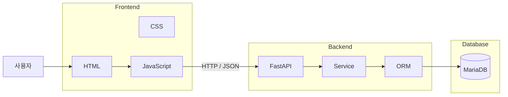

---

# 20. AI 개발의 핵심 반복 사이클

AI Coding에서 가장 중요한 개발 패턴은 다음이다.

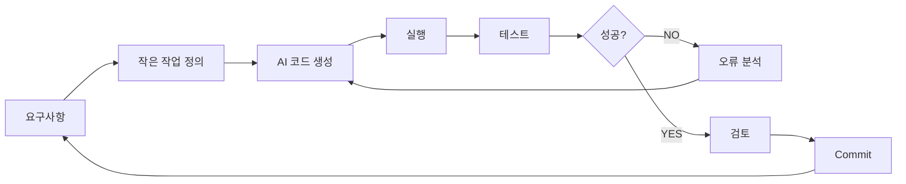

이를 간단히 표현하면

> **Plan → Generate → Run → Test → Review → Commit**

이다.

이 과정이 AI 시대 개발의 기본 단위가 된다.

---

# 21. 전통 개발과 AI 개발 비교

| 구분 | 전통 개발 | AI 코딩 개발 |
|---|---|---|
| 요구사항 | 사람이 작성 | 사람 + AI |
| 설계 | 사람이 설계 | 사람 중심 + AI 지원 |
| 코딩 | 사람이 직접 작성 | AI 생성 + 사람 검토 |
| 검색 | 문서·검색엔진 | AI에게 질문 |
| 오류 해결 | 사람이 분석 | AI 분석 + 사람 검증 |
| 테스트 | 사람이 작성 | AI가 상당 부분 생성 |
| 문서화 | 별도 작성 | AI 자동 생성 가능 |
| 리팩토링 | 개발자가 수행 | AI 적극 활용 |
| 핵심 역량 | 코딩 능력 | 설계 + 검증 + AI 활용 |
| 개발 속도 | 상대적으로 느림 | 빠른 반복 가능 |

그러나 다음 항목은 여전히 중요하다.

```text
자료구조
알고리즘
데이터베이스
네트워크
운영체제
HTTP
보안
Software Architecture
```

왜냐하면 AI가 생성한 코드가 적절한지 **판단하려면 기본 지식이 필요하기 때문**이다.

---

# 22. 잘못된 AI 코딩 방식

가장 문제가 되는 방식은 다음과 같다.

```mermaid
flowchart TD
    A[아이디어] --> B[AI에게 전체 시스템 만들어줘]
    B --> C[수천 줄 코드 생성]
    C --> D[실행]
    D --> E[오류]
    E --> F[AI에게 다시 수정 요청]
    F --> G[다른 오류]
    G --> H[코드 구조 이해 불가]
```

이러한 개발 방식은 흔히 다음과 같은 문제를 만든다.

```text
AI가 만든 코드를 이해하지 못함
       ↓
오류 발생
       ↓
다시 AI에게 수정 요청
       ↓
다른 코드가 변경됨
       ↓
새로운 오류 발생
       ↓
프로젝트 구조가 복잡해짐
```

이를 피해야 한다.

---

# 23. 권장 AI 코딩 방식

좋은 방식은 **작은 단위로 개발하는 것**이다.

```mermaid
flowchart TD
    A[프로젝트 목표]

    A --> B[기능 1]
    A --> C[기능 2]
    A --> D[기능 3]

    B --> B1[작업 1]
    B --> B2[작업 2]
    B --> B3[작업 3]

    B1 --> E[AI 구현]
    E --> F[실행]
    F --> G[테스트]
    G --> H[Commit]
```

예:

```text
❌ 잘못된 요청

FastAPI와 MariaDB를 이용해서
완전한 쇼핑몰을 만들어줘.


⭕ 좋은 요청

1단계
회원 테이블을 설계해줘.

2단계
회원등록 API를 구현해줘.

3단계
회원등록 API 테스트 코드를 작성해줘.

4단계
프론트엔드 회원가입 화면을 구현해줘.

5단계
Frontend와 Backend를 연결해줘.
```

---

# 24. 프로젝트 적용 예시

예를 들어 다음 프로젝트를 만든다고 하자.

## 프로젝트

**시장 데이터 분석 대시보드**

전체 기능을 다음과 같이 나눈다.

```mermaid
flowchart TD
    A[시장 데이터 분석 대시보드]

    A --> B[데이터 수집]
    A --> C[데이터 저장]
    A --> D[데이터 분석]
    A --> E[대시보드]

    B --> B1[CSV]
    B --> B2[API]

    C --> C1[Database]

    D --> D1[통계]
    D --> D2[지표 계산]

    E --> E1[표]
    E --> E2[차트]
```

AI를 이용한 개발 흐름은 다음과 같다.

```mermaid
flowchart TD
    A[① 프로젝트 정의]
    A --> B[② 기능 목록 작성]
    B --> C[③ DB 설계]
    C --> D[④ API 설계]
    D --> E[⑤ UI 설계]

    E --> F[⑥ Task 분해]

    F --> G[데이터 수집 구현]
    G --> H[테스트]

    H --> I[DB 저장 구현]
    I --> J[테스트]

    J --> K[API 구현]
    K --> L[테스트]

    L --> M[Frontend 구현]
    M --> N[통합 테스트]

    N --> O[배포]
```

AI Coding Agent에게 처음부터

```text
시장 데이터 분석 대시보드를 만들어줘.
```

라고 요청하는 것보다

```text
Task 01
프로젝트 디렉터리를 구성한다.

Task 02
시장 데이터 저장용 DB를 설계한다.

Task 03
데이터 입력 API를 구현한다.

Task 04
데이터 조회 API를 구현한다.

Task 05
대시보드 Frontend를 구현한다.

Task 06
Frontend와 API를 연결한다.

Task 07
테스트를 수행한다.
```

와 같이 작업을 나누는 것이 훨씬 안정적이다.

---

# 25. 최종 정리

소프트웨어 개발방법론의 발전을 한 장으로 정리하면 다음과 같다.

```mermaid
flowchart TD
    A[Waterfall]

    A --> B[Iterative Development]
    B --> C[Agile]
    C --> D[DevOps]
    D --> E[AI Assisted Development]
    E --> F[Agentic Development]

    A1[단계 중심] --> A
    B1[반복 중심] --> B
    C1[빠른 피드백] --> C
    D1[자동화] --> D
    E1[AI 협업] --> E
    F1[AI 자율 작업] --> F
```

그러나 AI 시대에도 프로젝트의 본질은 변하지 않는다.

```mermaid
flowchart LR
    A[문제 정의] --> B[분석]
    B --> C[설계]
    C --> D[구현]
    D --> E[테스트]
    E --> F[배포]
```

변한 것은 **구현 방법**이다.

### 전통적인 개발

```text
문제
 ↓
개발자 분석
 ↓
개발자 설계
 ↓
개발자 코딩
 ↓
개발자 테스트
```

### AI 코딩 어시스턴트 개발

```text
문제
 ↓
개발자 분석
 ↓
개발자 + AI 설계
 ↓
AI 코드 생성
 ↓
개발자 검증
 ↓
AI 수정
 ↓
개발자 승인
```

### AI Coding Agent 개발

```text
개발자
 │
 │ 목표 / 요구사항 / 규칙
 ▼
AI Coding Agent
 │
 ├─ 분석
 ├─ 계획
 ├─ 코드 생성
 ├─ 실행
 ├─ 테스트
 └─ 오류 수정
 │
 ▼
개발자 Review
 │
 ▼
Git Commit
 │
 ▼
배포
```

따라서 AI 시대 개발자의 가장 중요한 역량은 단순히 **코드를 빠르게 작성하는 능력**에서 다음 능력으로 이동하고 있다.

```mermaid
flowchart LR
    A[코딩 중심 개발자] --> B[문제 정의]
    B --> C[요구사항 분석]
    C --> D[Architecture 설계]
    D --> E[AI 작업 지시]
    E --> F[코드 검증]
    F --> G[테스트]
    G --> H[품질 관리]
```

핵심을 한 문장으로 정리하면 다음과 같다.

> **AI 시대의 개발방법론은 기존의 분석·설계·개발·테스트 절차를 버리는 것이 아니라, 프로젝트를 작은 작업 단위로 분해하고 AI에게 구현과 반복 작업을 맡긴 뒤 사람이 설계·검증·품질을 책임지는 방식으로 발전하는 것이다.**

그리고 실무적인 AI 코딩 프로세스는 다음 **7단계**로 기억하면 이해하기 쉽다.

```text
① Define   : 무엇을 만들 것인가?
      ↓
② Design   : 어떻게 만들 것인가?
      ↓
③ Divide   : 작업을 어떻게 나눌 것인가?
      ↓
④ Generate : AI에게 무엇을 만들게 할 것인가?
      ↓
⑤ Run      : 실제로 실행되는가?
      ↓
⑥ Test     : 요구사항대로 동작하는가?
      ↓
⑦ Review   : 이 코드를 프로젝트에 반영해도 되는가?
```

즉,

> **Define → Design → Divide → Generate → Run → Test → Review**

를 AI 코딩 시대의 기본 개발 사이클로 사용할 수 있다.


이 문서를 AX 과정의 프로젝트 교육에 적용한다면, 다음 단계에서는 **`전통적 개발 → AI Assisted → Agentic Development`를 10일 프로젝트 일정에 배치하고, 각 일차별로 「사람이 할 일 / AI가 할 일 / 작성 문서 / Git 산출물 / 검증 기준」까지 연결**하면 실제 프로젝트 운영용 개발방법론으로 사용할 수 있습니다.
