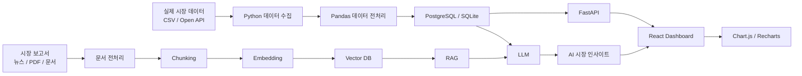

# AI 기반 시장 데이터 분석 대시보드 

> 이미지의 교과목 흐름을 보면 이 세미 프로젝트는 앞에서 학습한 **서비스 기획 → FastAPI → DB → API → React → AI Native → LLM/RAG**를 하나의 서비스로 통합하는 **종합 프로젝트**로 보는 것이 적절합니다.  
> 비전공자 기준에서는 프로젝트를 처음부터 “AI 시장분석 플랫폼”처럼 크게 잡기보다, **작은 데이터 분석 웹서비스를 먼저 완성하고 마지막에 RAG/LLM을 붙이는 방식**이 가장 안정적입니다.  

---

# 1. 프로젝트의 핵심 목표

**[세미 프로젝트] AI 기반 시장 데이터 분석 대시보드**

학생이 최종적으로 경험해야 하는 흐름은 다음과 같습니다.

```text
실제 데이터 수집
      ↓
데이터 정제
      ↓
DB 저장
      ↓
데이터 분석
      ↓
FastAPI API 제공
      ↓
React 대시보드 시각화
      ↓
시장 관련 문서 RAG 구축
      ↓
LLM 자동 분석
      ↓
AI 시장 분석 대시보드 완성
```

즉, 핵심은 단순히 **LLM을 호출하는 프로젝트**가 아닙니다.

> 데이터를 확보하고 → 데이터가 흐르는 시스템을 만들고 → 그 위에 AI를 연결하는 경험

을 하는 것이 프로젝트의 본질입니다.

---

# 2. 비전공자에게 가장 먼저 시켜야 할 것: 프로젝트 범위 줄이기

처음부터 아래처럼 잡으면 실패하기 쉽습니다.

> “부동산 시장 전체를 AI가 분석하는 서비스”

범위가 너무 큽니다.

대신 다음 정도로 제한하는 것이 좋습니다.

### 예시 ① 부동산

> 서울 특정 지역의 아파트 실거래 데이터를 분석하여
> 가격 변화와 거래량을 시각화하고
> AI가 시장 동향을 설명하는 서비스

### 예시 ② 금융

> 삼성전자·SK하이닉스 등 관심 종목의 주가 데이터를 분석하여
> 주가·거래량·수익률을 시각화하고
> AI가 관련 뉴스/보고서를 기반으로 시장 상황을 설명하는 서비스

### 예시 ③ 커머스

> 상품 판매 데이터를 분석하여
> 카테고리별 매출·인기상품·기간별 추이를 보여주고
> AI가 판매 데이터를 설명하는 서비스

비전공자에게는 **“도메인 하나 + 핵심 질문 3개”**를 먼저 정하게 하는 것이 좋습니다.

예를 들어 부동산이라면:

```text
질문 1
최근 1년 아파트 가격은 어떻게 변화했는가?

질문 2
어떤 지역의 거래량이 증가하고 있는가?

질문 3
최근 시장 관련 보고서에서는 이 현상을 어떻게 설명하고 있는가?
```

이 세 질문에 답하는 서비스만 만들어도 충분히 좋은 프로젝트가 됩니다.

---

# 3. 가장 권장하는 프로젝트 구조

비전공자 교육용이라면 다음 구조를 추천합니다.



이 구조 하나만 이해해도 앞에서 배운 여러 교과목이 왜 필요한지 연결됩니다.

---

# 4. 학생들에게 먼저 전체 구조를 이렇게 설명하면 좋습니다

비전공자에게는 다음 네 개의 시스템으로 나누어 이해시키는 것이 좋습니다.

| 영역        | 역할                    |
| --------- | --------------------- |
| 데이터 시스템   | 시장 데이터를 수집·정리         |
| 백엔드 시스템   | 데이터를 API로 제공          |
| 프론트엔드 시스템 | 데이터를 차트로 시각화          |
| AI 시스템    | 데이터를 해석하여 자연어 인사이트 생성 |

학생 입장에서는 결국 다음 네 가지 질문만 이해하면 됩니다.

```text
① 데이터는 어디서 오는가?
② 데이터는 어디에 저장되는가?
③ 화면은 데이터를 어떻게 가져오는가?
④ AI는 어떤 데이터를 보고 답변하는가?
```

---

# 5. 1단계: 도메인 선택

프로젝트 시작 단계에서 팀별로 하나의 시장을 선택합니다.

## 추천 주제

| 난이도 | 도메인  | 예시         |
| --- | ---- | ---------- |
| ★★  | 금융   | 주식 가격 분석   |
| ★★  | 커머스  | 상품 판매 데이터  |
| ★★★ | 부동산  | 아파트 실거래 분석 |
| ★★★ | 지역경제 | 상권 매출 분석   |
| ★★★ | 취업시장 | 채용공고 분석    |
| ★★★ | 자동차  | 중고차 가격 분석  |

비전공자에게는 **금융 / 부동산 / 커머스** 정도가 가장 이해하기 쉽습니다.

---

# 6. 데이터 확보 전략이 매우 중요하다

실제 프로젝트에서 학생들이 가장 많이 막히는 부분이 AI가 아니라 **데이터 수집**입니다.

따라서 프로젝트 초반에는 데이터 확보를 확실히 해야 합니다.

추천 순서는 다음과 같습니다.

```text
1순위
CSV 다운로드

↓ 안정화 후

2순위
Open API

↓ 선택

3순위
웹 크롤링
```

처음부터 크롤링을 시키는 것은 권장하지 않습니다.

웹사이트 구조 변경, 차단, JavaScript 렌더링 등의 문제 때문에 프로젝트의 본질과 무관한 디버깅 시간이 지나치게 늘어날 수 있습니다.

---

# 7. 데이터는 두 종류로 구분하면 이해하기 쉽다

이 프로젝트에서 중요한 포인트입니다.

## ① 정형 데이터

숫자 중심 데이터입니다.

예:

```text
날짜
지역
아파트명
거래가격
면적
거래량
```

이 데이터는 다음에 사용합니다.

```text
RDB
↓
SQL
↓
FastAPI
↓
Chart
```

---

## ② 비정형 데이터

문장 중심 데이터입니다.

예:

```text
시장 보고서
정부 정책자료
증권사 리포트
산업 보고서
뉴스
PDF
```

이 데이터는 다음에 사용합니다.

```text
문서
↓
Chunk
↓
Embedding
↓
Vector DB
↓
RAG
↓
LLM
```

이 차이를 학생들이 확실하게 이해해야 합니다.

---

# 8. 중요한 개념: RAG가 모든 데이터를 분석하는 것은 아니다

학생들이 흔히 오해하는 부분입니다.

예를 들어 다음 질문입니다.

> 서울 강남구 아파트 평균 가격은 얼마인가?

이런 질문은 RAG보다 **SQL**이 적합합니다.

```sql
SELECT AVG(price)
FROM apartment_transaction
WHERE district = '강남구';
```

반면,

> 최근 보고서에서는 강남 아파트 가격 상승 원인을 어떻게 설명하고 있는가?

이런 질문은 RAG가 적합합니다.

따라서 실제 프로젝트에서는 다음과 같은 구조가 좋습니다.

```text
숫자 계산
→ SQL / Pandas

문서 검색
→ RAG

설명 및 요약
→ LLM
```

이 구조를 이해하는 것이 이번 프로젝트에서 상당히 중요합니다.

---

# 9. 데이터베이스는 복잡하게 만들 필요가 없다

예를 들어 부동산 프로젝트라면 다음 정도면 충분합니다.

### transactions

```text
id
date
region
apartment_name
price
area
floor
transaction_type
```

### market_documents

```text
id
title
source
published_date
content
```

### ai_insights

```text
id
created_at
period
region
question
insight
```

초기 프로젝트에서는 테이블을 **3~5개 이하**로 제한하는 것이 좋습니다.

---

# 10. 데이터 전처리

학생들은 Pandas를 이용하여 다음 정도를 수행하게 합니다.

```python
import pandas as pd

df = pd.read_csv("market_data.csv")

df.info()

df = df.dropna()

df["date"] = pd.to_datetime(df["date"])

df["price"] = pd.to_numeric(df["price"])

print(df.head())
```

여기에서 중요한 것은 Pandas 문법 자체보다 다음 개념입니다.

```text
Raw Data
   ↓
Cleaning
   ↓
Transformation
   ↓
Analysis Data
```

---

# 11. 최소한 수행해야 하는 데이터 분석

복잡한 머신러닝까지 넣을 필요는 없습니다.

다음 정도면 충분합니다.

### 기본 통계

```text
평균
최댓값
최솟값
중앙값
거래량
```

### 집계

```text
지역별 평균 가격

월별 거래량

기간별 가격 변화

상품별 매출

종목별 수익률
```

### 변화율

예를 들어:

```text
전월 대비 가격 상승률
전년 대비 거래량 증가율
```

이 정도만 있어도 대시보드의 핵심 데이터를 충분히 만들 수 있습니다.

---

# 12. FastAPI는 단순하게 구성한다

추천 API는 5~8개 정도입니다.

```text
GET /api/markets/summary

GET /api/markets/trend

GET /api/markets/regions

GET /api/markets/transactions

GET /api/markets/top

POST /api/ai/insight

POST /api/ai/question
```

예:

```python
@app.get("/api/markets/summary")
def get_summary():

    return {
        "average_price": 125000,
        "transaction_count": 1380,
        "change_rate": 4.2
    }
```

비전공자 단계에서는 API를 지나치게 RESTful하게 설계하는 것보다

> React가 필요한 데이터를 FastAPI가 전달할 수 있는가?

가 더 중요합니다.

---

# 13. React 대시보드는 화면 1개부터 시작

학생들이 React 화면을 많이 만들려고 하는 경우가 많습니다.

그러나 프로젝트의 목적은 웹사이트 디자인이 아니라 **데이터-AI 통합**입니다.

추천 화면은 하나입니다.

```text
------------------------------------------------

        AI Market Intelligence Dashboard

------------------------------------------------

[ 평균가격 ] [ 거래량 ] [ 상승률 ] [ 관심지역 ]

------------------------------------------------

           월별 가격 변화

              📈 Chart

------------------------------------------------

 거래량 변화                 지역별 가격

 📊 Chart                    📊 Chart

------------------------------------------------

       🤖 AI 시장 분석

"최근 거래량은 증가하고 있으나..."

------------------------------------------------

질문

[ 최근 가격 상승 원인은 무엇인가? ]

                 [ AI에게 질문 ]

------------------------------------------------
```

---

# 14. 대시보드에서 최소 4개의 시각화를 구현

예를 들어:

### KPI Card

```text
평균가격
12.5억원

전월 대비
+3.2%
```

### Line Chart

```text
월별 가격 변화
```

### Bar Chart

```text
지역별 평균가격
```

### Bar/Area Chart

```text
월별 거래량
```

기술은 다음 정도면 충분합니다.

```text
React
+
Recharts

또는

React
+
Chart.js
```

---

# 15. 그 다음 RAG를 추가한다

여기서부터 AI 프로젝트다운 기능이 들어갑니다.

예를 들어 다음 자료를 넣습니다.

```text
부동산 정책 PDF
국토 관련 시장 보고서
산업 동향 보고서
증권사 리포트
회사 IR 자료
```

RAG 과정은 다음과 같습니다.

```text
PDF

↓

텍스트 추출

↓

Chunk

↓

Embedding

↓

Vector DB

↓

사용자 질문

↓

유사 문서 검색

↓

LLM Prompt

↓

답변
```

---

# 16. RAG 역시 최소 기능으로 시작한다

학생들에게 처음부터

```text
Hybrid Search
Reranker
Query Transformation
Agentic RAG
Graph RAG
```

까지 요구할 필요는 없습니다.

1차 프로젝트에서는 다음이면 충분합니다.

```text
Document Loader

↓

RecursiveCharacterTextSplitter

↓

Embedding

↓

Chroma 또는 FAISS

↓

Retriever

↓

LLM
```

---

# 17. AI 기능은 두 종류로 구현하면 좋다

## 기능 ① 자동 시장 분석

버튼:

> AI 시장 분석 생성

FastAPI가 데이터를 집계합니다.

예:

```json
{
  "average_price": 12.4,
  "previous_month": 11.9,
  "change_rate": 4.2,
  "transaction_count": 1830
}
```

그리고 LLM에게 전달합니다.

```text
다음 시장 데이터를 분석하시오.

평균가격: 12.4억원
전월 평균가격: 11.9억원
가격변화율: +4.2%
거래량: 1,830건

데이터에 근거하여 시장 상황을
3개의 핵심 포인트로 설명하시오.
```

결과:

```text
① 평균 거래가격이 전월 대비 4.2% 상승했습니다.

② 거래량도 함께 증가해 단순한 일시적 가격 변동보다는
시장 수요 증가 가능성이 나타납니다.

③ 다만 최근 정책 변화와 금리 상황을 추가로 확인할
필요가 있습니다.
```

---

# 18. 기능 ② RAG 시장 질문

사용자가 다음과 같이 질문합니다.

```text
최근 가격 상승의 원인은 무엇인가요?
```

RAG가 관련 보고서를 검색합니다.

```text
질문
↓
Embedding
↓
Vector DB 검색
↓
관련 문서 3~5개
↓
LLM
↓
답변
```

화면에는 다음처럼 표시하면 좋습니다.

```text
AI 답변

최근 가격 상승은 공급 부족,
금리 변화 기대 및 특정 지역으로의
수요 집중 등이 영향을 미친 것으로 분석됩니다.

근거 문서

① 2026년 주택시장 보고서
② OO연구원 부동산 전망
③ 정부 주택시장 동향
```

---

# 19. 프로젝트에서 AI에게 직접 계산시키지 않는 것이 중요하다

예를 들어:

> 평균 거래가격을 계산해줘.

100만 건 데이터를 LLM에게 보내는 방식은 좋지 않습니다.

권장 구조는 다음입니다.

```text
SQL / Pandas
    ↓
계산 결과
    ↓
LLM
    ↓
설명
```

즉,

> **컴퓨터가 계산하고 AI가 설명한다.**

라는 원칙을 프로젝트 전체에 적용하면 좋습니다.

---

# 20. 최종적으로 권장하는 기술 스택

비전공자라면 기술을 과도하게 늘리지 않는 것이 중요합니다.

| 영역              | 추천                  |
| --------------- | ------------------- |
| Language        | Python / JavaScript |
| 데이터 처리          | Pandas              |
| DB              | SQLite → PostgreSQL |
| ORM             | SQLAlchemy          |
| Backend         | FastAPI             |
| Frontend        | React               |
| Chart           | Recharts            |
| API Test        | Postman             |
| LLM             | OpenAI / Gemini 등   |
| RAG             | LangChain           |
| Vector DB       | Chroma / FAISS      |
| Version Control | GitHub              |
| 배포              | 선택 사항               |

MVP에서는 Docker, Kubernetes, Redis, Kafka 같은 기술은 굳이 추가하지 않는 편이 좋습니다.

---

# 21. 프로젝트 폴더 구조도 미리 제시하는 것이 좋다

```text
market-ai-dashboard/

├── backend/
│   ├── main.py
│   │
│   ├── api/
│   │   ├── market.py
│   │   └── ai.py
│   │
│   ├── models/
│   │   └── market.py
│   │
│   ├── services/
│   │   ├── market_service.py
│   │   └── rag_service.py
│   │
│   └── database/
│       └── database.py
│
├── frontend/
│   └── src/
│       ├── components/
│       ├── pages/
│       └── services/
│
├── data/
│   ├── raw/
│   ├── processed/
│   └── documents/
│
├── notebooks/
│   └── data_analysis.ipynb
│
├── rag/
│   └── vectorstore/
│
├── docs/
│   ├── requirements.md
│   ├── architecture.md
│   └── api.md
│
└── README.md
```

이 구조를 처음부터 제공하면 프로젝트 파일 관리에서 오는 혼란을 크게 줄일 수 있습니다.

---

# 22. 92시간 프로젝트라면 이렇게 배분하는 것을 추천

이미지에 프로젝트 시간이 **92시간**으로 되어 있으므로, 8시간 교육일 기준으로 약 **11.5일**입니다.

비전공자 기준으로는 다음 비율이 적당합니다.

> **이론 20시간 + 프로젝트 실습 72시간**

| 일차     | 주요 내용             |        이론 |      실습 |
| ------ | ----------------- | --------: | ------: |
| 1일차    | 프로젝트 이해·도메인 선정·기획 |        3h |      5h |
| 2일차    | 데이터 수집            |        2h |      6h |
| 3일차    | Pandas 전처리·EDA    |        2h |      6h |
| 4일차    | DB 모델링·SQL        |        2h |      6h |
| 5일차    | FastAPI REST API  |        2h |      6h |
| 6일차    | React 대시보드        |        1h |      7h |
| 7일차    | LLM·Embedding·RAG |        3h |      5h |
| 8일차    | RAG 구현            |        2h |      6h |
| 9일차    | AI Insight 구현     |        1h |      7h |
| 10일차   | Full Stack 통합     |        1h |      7h |
| 11일차   | 테스트·오류 수정·품질개선    |        1h |      7h |
| 12일차   | 발표·시연             |        0h |      4h |
| **합계** |                   |   **20h** | **72h** |
|        |                   | **총 92h** |         |

---

# 23. 1일차 — 프로젝트 기획

첫날에는 코딩보다 다음을 결정하는 것이 중요합니다.

### 산출물

```text
01_project_proposal.md

02_user_scenario.md

03_requirements.md

04_architecture.md

05_data_definition.md
```

### 반드시 결정해야 할 것

```text
도메인

사용자

사용자가 궁금해하는 문제

사용할 데이터

핵심 KPI

필요한 차트

AI 기능

RAG 문서
```

---

# 24. 비전공자에게 요구할 기능은 Must / Should / Could로 구분

## Must — 반드시 구현

```text
데이터 수집

데이터 전처리

DB 저장

FastAPI

React

차트 3개 이상

LLM 분석

RAG 질문

GitHub
```

## Should — 가능하면 구현

```text
기간 필터

지역 필터

검색

AI 분석 저장

출처 표시
```

## Could — 여유가 있을 때

```text
로그인

JWT

Agent

Function Calling

Docker

실시간 데이터

배포
```

이렇게 해야 학생들이 기능 욕심 때문에 프로젝트를 완성하지 못하는 문제를 줄일 수 있습니다.

---

# 25. 팀 프로젝트라면 4명이 가장 적당하다

예를 들어:

### A — 데이터 담당

```text
데이터 수집
Pandas
데이터 정제
DB 적재
```

### B — Backend

```text
FastAPI
SQLAlchemy
REST API
```

### C — Frontend

```text
React
Dashboard
Chart
```

### D — AI

```text
Embedding
Vector DB
RAG
LLM
```

하지만 중요한 점이 있습니다.

**역할을 완전히 분리하면 안 됩니다.**

최종적으로 모든 학생이 다음 흐름을 설명할 수 있어야 합니다.

```text
React
 ↓
FastAPI
 ↓
Database

React
 ↓
FastAPI
 ↓
RAG
 ↓
LLM
```

---

# 26. GitHub 작업 방식도 프로젝트 초반에 고정

추천 구조는 다음입니다.

```text
main
│
├── develop
│
├── feature/data
├── feature/backend
├── feature/frontend
└── feature/rag
```

학생은 다음 흐름 정도만 경험해도 충분합니다.

```text
Issue 생성

↓

Branch 생성

↓

개발

↓

Commit

↓

Push

↓

Pull Request

↓

Merge
```

이 과정이 교과목의 **AI Native 방법론 및 품질 자동화**와도 연결됩니다.

---

# 27. 중간 점검 시점을 명확히 두는 것이 좋다

### 1차 체크포인트

3일차 종료

```text
실제 데이터 확보 완료
데이터 정제 완료
기본 분석 완료
```

### 2차 체크포인트

6일차 종료

```text
DB 구축
FastAPI 동작
React Chart 표시
```

이 단계에서 이미 일반적인 데이터 대시보드가 동작해야 합니다.

### 3차 체크포인트

9일차 종료

```text
RAG 동작
LLM 분석 동작
```

### 최종 체크포인트

11일차

```text
전체 서비스 통합
테스트
README
발표 준비
```

---

# 28. 가장 중요한 프로젝트 성공 조건

특히 비전공자 프로젝트에서 다음 순서가 중요합니다.

```text
데이터 확보
    ↓
데이터 분석
    ↓
DB
    ↓
API
    ↓
Dashboard
    ↓
LLM
    ↓
RAG
```

다음처럼 진행하면 위험합니다.

```text
첫날

LangChain
Agent
RAG
Function Calling
LLM

부터 시작
```

AI부터 개발하면 데이터와 서비스 구조가 잡히지 않은 상태에서 디버깅이 복잡해집니다.

---

# 29. AI 코드 생성 도구는 적극적으로 사용하도록 하는 것이 좋다

이 과정 자체가 **AX 서비스 풀스택 빌더 과정**이므로 AI를 코딩 보조자로 사용하는 경험도 프로젝트 목표에 포함시키는 것이 적절합니다.

학생이 AI에게 요청할 수 있는 작업:

```text
SQL 생성

Pandas 코드 생성

FastAPI Endpoint 생성

React Component 생성

Chart 코드 생성

API 연결 코드 생성

테스트 코드 생성

오류 분석

코드 리뷰
```

하지만 학생은 생성된 코드를 최소한 다음 관점으로 검증해야 합니다.

```text
이 코드는 어디에서 입력을 받는가?

어떤 데이터를 처리하는가?

어떤 결과를 반환하는가?

DB는 어디에서 연결되는가?

API URL은 무엇인가?

React는 어디서 API를 호출하는가?

예외가 발생하면 어떻게 되는가?
```

이 능력이 이 프로젝트에서 중요한 **AI-Augmented 개발 능력**입니다.

---

# 30. 최종 발표에서는 코드보다 데이터 흐름 설명을 중요하게 평가

학생이 최소한 다음 그림을 설명할 수 있어야 합니다.

```text
Public Data
    │
    ▼
Pandas
    │
    ▼
PostgreSQL
    │
    ▼
FastAPI
    │
    ├─────────────┐
    ▼             ▼
 React          LLM
    │             ▲
    │             │
    │            RAG
    │             ▲
    │             │
    └──── Dashboard
```

그리고 다음 질문에 답할 수 있어야 합니다.

> 데이터는 어디에서 가져왔는가?

> 어떤 전처리를 했는가?

> DB는 왜 필요한가?

> FastAPI는 어떤 역할인가?

> React는 어떤 API를 호출하는가?

> RAG는 어떤 문서를 검색하는가?

> SQL 분석과 RAG 분석은 무엇이 다른가?

> LLM이 잘못된 답을 하면 어떻게 검증할 것인가?

이것을 설명할 수 있다면 프로젝트를 제대로 이해한 것입니다.

---

# 31. 평가 기준도 프로젝트 시작 전에 공개하는 것이 좋다

100점 기준 예시입니다.

| 평가영역            |      배점 |
| --------------- | ------: |
| 서비스 기획          |      10 |
| 데이터 수집          |      10 |
| 데이터 전처리         |      10 |
| DB 설계           |      10 |
| FastAPI         |      10 |
| React Dashboard |      15 |
| LLM 기능          |      10 |
| RAG             |      15 |
| Git/GitHub 협업   |       5 |
| 발표·문서           |       5 |
| **합계**          | **100** |

여기서 AI의 비중을 지나치게 높이지 않는 것이 좋습니다.

왜냐하면 이 프로젝트는 **RAG 프로젝트가 아니라 AI가 포함된 풀스택 프로젝트**이기 때문입니다.

---

# 32. 최종 산출물

팀마다 다음 정도를 제출하도록 하면 체계적입니다.

```text
01. 프로젝트 기획서

02. 요구사항 정의서

03. 시스템 아키텍처

04. 데이터 정의서

05. ERD

06. API 명세

07. GitHub Repository

08. 실행 가능한 서비스

09. README.md

10. 테스트 결과

11. 발표자료

12. 프로젝트 결과보고서
```

---

# 33. 최종 서비스의 이상적인 모습

예를 들어 **AI 부동산 시장 분석 대시보드**라면 다음 정도면 충분히 성공적인 프로젝트입니다.

```text
┌──────────────────────────────────────┐
│      AI 부동산 시장 분석 Dashboard     │
├──────────────────────────────────────┤
│ 지역 [서울 ▼]   기간 [최근 1년 ▼]       │
├──────────────────────────────────────┤
│ 평균가격 │ 거래량 │ 가격변화 │ 최고지역 │
├──────────────────────────────────────┤
│                                      │
│            가격 변화 📈               │
│                                      │
├──────────────────┬───────────────────┤
│ 지역별 가격 📊    │ 거래량 변화 📊      │
├──────────────────┴───────────────────┤
│ 🤖 AI 시장 분석                       │
│                                      │
│ 최근 서울 아파트 시장은 ...            │
│                                      │
├──────────────────────────────────────┤
│ AI에게 질문                           │
│                                      │
│ 최근 가격 상승 원인은?                 │
│                              [질문]  │
├──────────────────────────────────────┤
│ 근거자료                              │
│ 국토부 주택시장 동향                   │
│ OO경제연구원 보고서                    │
└──────────────────────────────────────┘
```

---

# 34. 이 프로젝트를 통해 앞의 교과목이 하나로 연결된다

이미지의 전체 교육과정과 프로젝트를 연결하면 교육적으로 상당히 자연스럽습니다.

| 선수 교과목           | 프로젝트 적용          |
| ---------------- | ---------------- |
| AX 프로덕트 기획       | 서비스 아이디어·와이어프레임  |
| AI-Augmented 백엔드 | FastAPI          |
| 도메인 모델링·데이터 아키텍처 | RDB·SQLAlchemy   |
| API 아키텍처         | REST API         |
| AX UI·프론트엔드      | React Dashboard  |
| AI Native 방법론    | AI 코딩·테스트        |
| LLM·RAG          | AI Insight·문서 질의 |
| 세미 프로젝트          | 전체 기술 통합         |

따라서 이 세미 프로젝트의 교육적 목표를 한 문장으로 정의하면 다음과 같습니다.

> **“AI에게 코드를 생성시키는 경험”이 아니라, 실제 데이터를 중심으로 데이터 → DB → API → UI → LLM/RAG가 연결되는 하나의 AI 서비스를 직접 설계하고 완성하는 경험**

으로 잡는 것이 가장 적절합니다.

특히 비전공자 과정이라면 **92시간 중 초반 48시간에는 AI보다 데이터·DB·API·Dashboard 완성을 우선하고, 후반에 LLM/RAG를 통합하는 방식**을 권합니다. 이 순서라야 앞서 학습한 전체 교과목이 실제 서비스 안에서 왜 필요한지 자연스럽게 연결됩니다.
