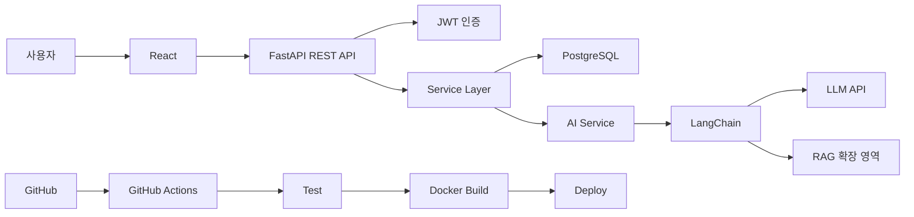

이번 **2차 프로젝트 「AX 풀스택 AI 서비스 스타터킷 구축」 92시간**은 1차 프로젝트와 성격을 분명히 다르게 가져가는 것이 좋습니다.

1차 프로젝트가 **“특정 문제를 해결하는 AI 서비스를 직접 완성하는 경험”**이었다면, 2차 프로젝트는 **“앞으로 어떤 AI 서비스를 만들더라도 재사용할 수 있는 개발 기반을 만드는 경험”**입니다. 그리고 이후 184시간 최종 프로젝트에서는 이 스타터킷을 실제로 Fork하여 기업 요구사항에 맞는 서비스를 개발하는 흐름으로 연결하면 전체 과정이 매우 자연스러워집니다.

---

# 1. 2차 프로젝트의 핵심 목표

프로젝트 목표를 한 문장으로 정의하면 다음과 같습니다.

> **FastAPI·React·PostgreSQL·LangChain·Docker·GitHub Actions가 미리 연결되어 있어, 저장소를 Fork한 뒤 환경설정만 하면 새로운 AI 서비스를 즉시 개발할 수 있는 재사용 가능한 Full Stack AI Starter Kit을 완성한다.**

따라서 이번 프로젝트의 최종 결과물은 단순한 웹 애플리케이션 하나가 아닙니다.

```text
AX Full Stack AI Starter Kit
        │
        ├─ Frontend
        │    React
        │
        ├─ Backend
        │    FastAPI
        │
        ├─ Database
        │    PostgreSQL
        │
        ├─ AI
        │    LangChain
        │    LLM
        │    RAG 확장 구조
        │
        ├─ Authentication
        │
        ├─ Test
        │
        ├─ Docker
        │
        ├─ CI/CD
        │
        └─ Documentation
```

그리고 최종적으로 다음 경험이 가능해야 합니다.

```text
GitHub Starter Kit
       ↓
Fork
       ↓
Clone
       ↓
.env 설정
       ↓
Docker Compose 실행
       ↓
Frontend + Backend + DB 실행
       ↓
LLM API Key 등록
       ↓
새로운 AI 서비스 개발 시작
```

---

# 2. 1차 → 2차 → 최종 프로젝트의 역할을 구분하면 좋다

| 프로젝트        | 핵심 질문                           | 주요 학습                         |
| ----------- | ------------------------------- | ----------------------------- |
| 1차 프로젝트     | AI 서비스를 어떻게 만드는가?               | 데이터→DB→API→React→LLM/RAG      |
| **2차 프로젝트** | AI 서비스를 어떻게 잘 만들 수 있는 기반을 만드는가? | **Architecture·표준화·자동화·재사용성** |
| 최종 프로젝트     | 기업 문제를 어떻게 실제 서비스로 해결하는가?       | 기업 요구사항·보안·운영·배포              |

따라서 2차 프로젝트에서는 새로운 AI 기술을 많이 넣는 것보다 **소프트웨어 엔지니어링 품질**이 중요합니다.

---

# 3. 이번 프로젝트에서 가장 중요한 개념: Boilerplate와 Starter Kit

비전공자가 먼저 이해해야 할 부분입니다.

매번 AI 서비스를 만들 때 다음 작업을 반복한다고 가정합니다.

```text
React 설치
FastAPI 설치
DB 연결
CORS 설정
API 구조 생성
LLM 연결
환경변수 설정
Dockerfile 작성
테스트 환경 구성
GitHub Actions 작성
README 작성
```

이 작업을 프로젝트마다 반복하는 것은 비효율적입니다.

따라서 공통 부분을 미리 만들어 둡니다.

```text
           AX Starter Kit

 React ─────────────────┐
 FastAPI ────────────────┤
 PostgreSQL ─────────────┤
 LangChain ──────────────┤
 Authentication ─────────┤
 Docker ─────────────────┤
 CI/CD ──────────────────┤
 Test ───────────────────┤
                         ↓
                 새로운 AI 서비스
```

즉,

> **반복적으로 필요한 개발환경과 공통 코드를 하나의 재사용 가능한 제품으로 만드는 것**

이 프로젝트의 본질입니다.

---

# 4. 최종 Starter Kit이 제공해야 할 기능

92시간 프로젝트라면 최소 다음 수준을 목표로 하는 것이 적당합니다.

| 영역         | 기본 제공 기능                     |
| ---------- | ---------------------------- |
| React      | 기본 Layout·Routing·API 연동     |
| FastAPI    | Router·Service·Repository 구조 |
| PostgreSQL | DB 연결·Migration              |
| ORM        | SQLAlchemy                   |
| API        | REST API 기본 구조               |
| 인증         | JWT 기반 Login                 |
| AI         | LangChain LLM 호출             |
| RAG        | 확장 가능한 기본 구조                 |
| 환경설정       | `.env`                       |
| 테스트        | Backend/API 기본 Test          |
| Container  | Docker / Docker Compose      |
| CI         | 자동 테스트                       |
| CD         | 자동 Build·배포                  |
| 문서         | README·API·Architecture·사용법  |

---

# 5. 전체 시스템 구조



비전공자 입장에서는 다음 다섯 질문을 중심으로 구조를 이해하면 충분합니다.

```text
① React는 어디로 요청하는가?

② FastAPI는 요청을 어떻게 처리하는가?

③ PostgreSQL에는 무엇을 저장하는가?

④ LangChain은 어디에서 사용되는가?

⑤ GitHub에 Push하면 왜 자동으로 테스트·배포되는가?
```

---

# 6. 프로젝트 성공 조건을 먼저 명확하게 정의

이번 프로젝트는 화면이 화려하다고 성공한 것이 아닙니다.

다음 시나리오가 성공해야 합니다.

```text
새로운 개발자
      ↓
GitHub Repository 방문
      ↓
Fork
      ↓
README 확인
      ↓
Clone
      ↓
.env 작성
      ↓
docker compose up
      ↓
서비스 실행
```

그리고 다음 주소가 정상적으로 동작해야 합니다.

```text
Frontend
http://localhost:5173

Backend
http://localhost:8000

Swagger
http://localhost:8000/docs

PostgreSQL
localhost:5432
```

LLM API Key만 설정하면 AI 기능까지 동작해야 합니다.

이것이 가장 중요한 **Acceptance Test**입니다.

---

# 7. Starter Kit의 기본 화면은 단순하게 구성

이번 프로젝트에서는 디자인 프로젝트가 아니므로 화면을 지나치게 많이 만들 필요가 없습니다.

추천 화면:

```text
┌───────────────────────────────────────┐
│          AX AI Starter Kit            │
├───────────┬───────────────────────────┤
│ Dashboard │                           │
│ AI Chat   │      Dashboard            │
│ Profile   │                           │
│ Settings  │ Backend : Healthy         │
│           │ Database : Connected      │
│           │ AI : Ready                │
│           │                           │
└───────────┴───────────────────────────┘
```

최소 페이지는 다음 정도면 충분합니다.

```text
/
Dashboard

/login
Login

/chat
AI Chat

/profile
사용자 정보

/settings
환경정보
```

---

# 8. Backend Architecture를 제대로 경험하는 것이 중요하다

1차 프로젝트보다 Backend 구조를 한 단계 발전시킵니다.

```text
Request
   ↓
Router
   ↓
Service
   ↓
Repository
   ↓
Database
```

AI 요청은 다음과 같이 분리합니다.

```text
Request
   ↓
AI Router
   ↓
AI Service
   ↓
LangChain
   ↓
LLM
```

---

# 9. 권장 FastAPI 구조

```text
backend/

├── app/
│   ├── main.py
│   │
│   ├── api/
│   │   ├── auth.py
│   │   ├── users.py
│   │   ├── chat.py
│   │   └── health.py
│   │
│   ├── core/
│   │   ├── config.py
│   │   └── security.py
│   │
│   ├── models/
│   │
│   ├── schemas/
│   │
│   ├── services/
│   │   ├── user_service.py
│   │   └── ai_service.py
│   │
│   ├── repositories/
│   │
│   ├── db/
│   │   └── database.py
│   │
│   └── ai/
│       ├── llm.py
│       ├── prompt.py
│       └── rag.py
│
├── tests/
│
├── requirements.txt
└── Dockerfile
```

비전공자라면 처음부터 모든 패턴을 완벽하게 구현하기보다 **Router / Service / DB / AI의 역할을 분리하는 수준**이면 충분합니다.

---

# 10. React도 재사용 가능한 구조로 만든다

```text
frontend/

├── src/
│
│   ├── components/
│   │   ├── Header.jsx
│   │   ├── Sidebar.jsx
│   │   └── Loading.jsx
│   │
│   ├── pages/
│   │   ├── Dashboard.jsx
│   │   ├── Login.jsx
│   │   └── Chat.jsx
│   │
│   ├── services/
│   │   ├── api.js
│   │   └── auth.js
│   │
│   ├── hooks/
│   │
│   ├── utils/
│   │
│   ├── App.jsx
│   └── main.jsx
│
├── package.json
└── Dockerfile
```

핵심은 페이지마다 직접 `fetch()`를 작성하지 않고 API 처리를 분리하는 것입니다.

```text
React Component

      ↓

API Service

      ↓

FastAPI
```

---

# 11. PostgreSQL은 공통 서비스 데이터 저장소 역할

최소한 다음 정도의 테이블을 구현합니다.

### users

```text
id
email
password_hash
name
role
created_at
```

### chat_sessions

```text
id
user_id
title
created_at
```

### chat_messages

```text
id
session_id
role
content
created_at
```

복잡한 비즈니스 테이블은 만들 필요가 없습니다.

Starter Kit 사용자가 자신의 서비스를 만들면서 추가하도록 설계합니다.

---

# 12. Database Migration을 포함시키는 것이 좋다

Starter Kit에는 DB 테이블을 직접 만들어 놓기보다 Migration 구조를 제공하는 것이 좋습니다.

예:

```text
SQLAlchemy
     +
Alembic
```

실행:

```bash
alembic upgrade head
```

그러면 새로운 사용자가 DB를 처음 생성할 때 자동으로 필요한 테이블을 만들 수 있습니다.

이것이 재사용 가능한 프로젝트에서는 매우 중요합니다.

---

# 13. 최소 API도 표준화한다

추천 API:

```text
GET  /api/health

POST /api/auth/register
POST /api/auth/login

GET  /api/users/me

POST /api/chat

GET  /api/chat/sessions
GET  /api/chat/{session_id}
```

Swagger에서 모든 API를 테스트할 수 있도록 합니다.

```text
FastAPI

↓

/docs

↓

Swagger UI
```

---

# 14. AI 영역은 지나치게 복잡하게 만들지 않는다

이번 프로젝트는 RAG 고급 프로젝트가 아닙니다.

AI 계층을 다음처럼 분리해 두는 정도가 좋습니다.

```text
AI Service

├── LLM
├── Prompt
├── Retriever
├── RAG
└── Output Parser
```

기본 상태에서는:

```text
사용자 질문
     ↓
Prompt
     ↓
LangChain
     ↓
LLM
     ↓
답변
```

이 동작하면 됩니다.

---

# 15. RAG는 "확장 가능한 형태"로 넣는 것이 핵심

Starter Kit 자체에 대규모 기업 문서를 넣을 필요는 없습니다.

Sample 문서 몇 개만 이용합니다.

```text
sample_docs/

├── company.md
├── faq.md
└── product.md
```

구조:

```text
Document

↓

Text Splitter

↓

Embedding

↓

Vector Store

↓

Retriever

↓

LLM
```

중요한 것은 데이터 자체보다

> **이 폴더에 문서를 추가하면 자신의 RAG 서비스로 확장할 수 있다**

는 구조를 만드는 것입니다.

---

# 16. LLM Provider도 교체 가능하도록 만드는 것이 좋다

코드 곳곳에서 직접 모델을 생성하지 않습니다.

예를 들어:

```text
AI Service
       ↓
LLM Provider
       │
       ├─ OpenAI
       ├─ Gemini
       └─ 기타 모델
```

환경변수:

```text
LLM_PROVIDER=openai

OPENAI_API_KEY=...
```

이 구조를 통해 특정 LLM에 지나치게 종속되지 않는 Starter Kit을 만들 수 있습니다.

---

# 17. `.env` 기반 환경설정은 필수

예:

```text
DATABASE_URL=postgresql://...

JWT_SECRET=...

LLM_PROVIDER=openai

OPENAI_API_KEY=...

FRONTEND_URL=http://localhost:5173
```

Repository에는 실제 `.env`를 올리지 않습니다.

대신:

```text
.env.example
```

을 제공합니다.

예:

```text
DATABASE_URL=

JWT_SECRET=

OPENAI_API_KEY=
```

새로운 사용자는

```bash
cp .env.example .env
```

후 값만 채우도록 구성합니다.

---

# 18. Starter Kit에서는 보안 기본값도 중요하다

최소 다음 내용은 포함하는 것이 좋습니다.

| 항목             | 적용                    |
| -------------- | --------------------- |
| Password       | Hash 저장               |
| Authentication | JWT                   |
| API Key        | `.env`                |
| CORS           | 허용 Origin 관리          |
| Input          | Pydantic Validation   |
| Error          | Stack Trace 사용자 노출 방지 |
| Secret         | GitHub에 Commit 금지     |

비전공자 프로젝트이므로 고급 보안까지 구현할 필요는 없지만,

> **처음부터 위험한 코드를 만들어 놓지 않는 것**

이 Starter Kit에서는 중요합니다.

---

# 19. Health Check API를 반드시 만든다

매우 단순하지만 실제 운영에서는 중요합니다.

```text
GET /api/health
```

예:

```json
{
  "status": "ok",
  "database": "connected",
  "ai": "ready"
}
```

Frontend에서도 이를 이용하여 상태를 표시할 수 있습니다.

```text
Backend     ● Running
Database    ● Connected
AI          ● Ready
```

Starter Kit 데모 기능으로도 매우 좋습니다.

---

# 20. Docker가 중요한 이유

새로운 사용자가 다음 과정을 직접 수행해야 한다면 사용하기 어렵습니다.

```text
Node 설치

Python 설치

PostgreSQL 설치

DB 생성

환경설정

React 실행

FastAPI 실행
```

Starter Kit에서는 가능하면 다음 명령으로 통일합니다.

```bash
docker compose up
```

그리고:

```text
Docker Compose

├── frontend
├── backend
└── postgres
```

형태로 실행되도록 합니다.

---

# 21. 권장 Docker Compose 구조

```text
docker-compose.yml

services

├── frontend
│
├── backend
│
└── db
```

실행 흐름:

```text
docker compose up
       ↓
PostgreSQL
       ↓
FastAPI
       ↓
React
```

이 경험을 통해 Container의 의미도 자연스럽게 이해할 수 있습니다.

---

# 22. 이번 프로젝트의 핵심 중 하나가 CI/CD

프로젝트 요구사항에 **CI/CD 자동 배포**가 명시되어 있으므로 반드시 포함해야 합니다.

개발자가 다음을 수행하면:

```text
git push
```

자동으로:

```text
GitHub

 ↓

GitHub Actions

 ↓

Lint

 ↓

Test

 ↓

Build

 ↓

Docker Image

 ↓

Deploy
```

가 이루어지는 구조입니다.

---

# 23. 처음부터 완전한 CI/CD를 만들지 않는다

비전공자에게는 세 단계로 발전시키는 것이 좋습니다.

### CI 1단계

```text
Push
 ↓
Backend Test
```

### CI 2단계

```text
Push
 ↓
Backend Test
 ↓
Frontend Build Test
```

### CI 3단계

```text
Push main
 ↓
Test
 ↓
Docker Build
 ↓
Deploy
```

이렇게 단계적으로 구성하면 CI/CD의 원리를 이해하기 쉽습니다.

---

# 24. GitHub Actions의 최소 Workflow

구조만 이해하면 충분합니다.

```text
.github/

└── workflows/
    ├── backend-ci.yml
    ├── frontend-ci.yml
    └── deploy.yml
```

이때 학생이 이해해야 할 핵심은 YAML 문법보다 다음입니다.

```text
Trigger
 ↓
Job
 ↓
Step
 ↓
Command
```

---

# 25. Git 전략도 Starter Kit에 포함

복잡한 Git Flow까지 사용할 필요는 없습니다.

추천:

```text
main
 │
 └── develop
       │
       ├── feature/backend
       ├── feature/frontend
       ├── feature/ai
       └── feature/cicd
```

작업 방식:

```text
Issue

↓

Branch

↓

Development

↓

Commit

↓

Push

↓

Pull Request

↓

Code Review

↓

Merge
```

이 자체가 Starter Kit 프로젝트에서 중요한 학습 경험입니다.

---

# 26. 코드 품질 기준을 정한다

이번 프로젝트에서는 "동작한다"만으로 완료하지 않는 것이 중요합니다.

최소 품질 기준:

```text
중복 코드 최소화

환경변수 분리

폴더 구조 일관성

함수 역할 명확화

API Response 일관성

Exception 처리

Logging

Type Hint

README

Test
```

AI가 생성한 코드 역시 이 기준을 통과한 후 사용하도록 합니다.

---

# 27. AI-Augmented 개발 방식과도 매우 잘 연결된다

이번 프로젝트는 AI 코딩 도구를 적극적으로 활용하기 적합합니다.

예를 들어 AI를 통해:

```text
FastAPI Router 초안 생성

Pydantic Schema 생성

SQLAlchemy Model 생성

React Component 생성

Dockerfile 생성

GitHub Actions 생성

Pytest 생성

README 초안 생성

코드 리뷰

오류 분석
```

을 수행할 수 있습니다.

하지만 전체 흐름은:

```text
Requirement

↓

AI Code Generation

↓

Developer Review

↓

Execution

↓

Test

↓

Refactoring

↓

Commit
```

이어야 합니다.

---

# 28. 테스트는 Starter Kit의 필수 기능

비전공자라도 최소한 다음 3종류는 경험하는 것이 좋습니다.

### Unit Test

```text
함수가 제대로 동작하는가?
```

### API Test

```text
/api/health가 200을 반환하는가?

Login 성공/실패가 정상인가?
```

### Integration Test

```text
FastAPI → PostgreSQL 연결이 되는가?

FastAPI → LangChain → LLM이 연결되는가?
```

최종적으로 CI에서 Test를 자동 실행합니다.

---

# 29. 특히 중요한 테스트: 새로운 사람이 사용할 수 있는가?

Starter Kit에서 가장 중요한 테스트 중 하나입니다.

프로젝트를 만든 팀원이 아닌 다른 학생이 Repository를 받아 실행해봅니다.

조건:

```text
① README만 읽는다.

② 개발자에게 질문하지 않는다.

③ Fork 한다.

④ Clone 한다.

⑤ .env를 작성한다.

⑥ 실행한다.

⑦ AI Chat을 테스트한다.
```

성공하면 좋은 Starter Kit입니다.

이 테스트를 **Fork Test 또는 Onboarding Test**로 운영하면 매우 유용합니다.

---

# 30. README는 소스코드만큼 중요하다

Starter Kit에서는 특히 그렇습니다.

README를 열었을 때 다음 순서로 보이게 하는 것이 좋습니다.

```text
AX AI Starter Kit

프로젝트 소개

Features

Architecture

Tech Stack

Quick Start

Environment Variables

Docker 실행

Local 실행

API 사용법

AI 설정

RAG 확장 방법

Test 실행

Deployment

Folder Structure

Troubleshooting

License
```

---

# 31. "5분 Quick Start"를 목표로 한다

좋은 Starter Kit이라면 README 앞부분에 다음 정도의 사용 방법이 있어야 합니다.

```bash
git clone ...

cd ax-ai-starter-kit

cp .env.example .env

docker compose up
```

그리고:

```text
http://localhost:5173
```

에 접속하면 기본 서비스가 나타나는 것을 목표로 합니다.

즉,

> **Fork → 설정 → 실행까지 5~10분**

정도를 품질 목표로 잡는 것이 좋습니다.

---

# 32. 프로젝트 전체 Repository 권장 구조

```text
ax-fullstack-ai-starter/

├── frontend/
│   ├── src/
│   ├── tests/
│   ├── Dockerfile
│   └── package.json
│
├── backend/
│   ├── app/
│   │   ├── api/
│   │   ├── core/
│   │   ├── models/
│   │   ├── schemas/
│   │   ├── services/
│   │   ├── repositories/
│   │   ├── db/
│   │   └── ai/
│   │
│   ├── tests/
│   ├── Dockerfile
│   └── requirements.txt
│
├── sample_docs/
│
├── migrations/
│
├── docs/
│   ├── architecture.md
│   ├── api.md
│   ├── deployment.md
│   └── customization.md
│
├── .github/
│   ├── ISSUE_TEMPLATE/
│   ├── PULL_REQUEST_TEMPLATE.md
│   └── workflows/
│
├── docker-compose.yml
│
├── .env.example
│
├── .gitignore
│
├── README.md
│
└── LICENSE
```

---

# 33. 92시간을 어떻게 배분할 것인가

92시간은 하루 8시간 기준:

> **11일 + 마지막 4시간**

입니다.

이번 프로젝트에서는 이론을 별도 강의처럼 많이 넣기보다 필요한 개념을 바로 구현과 연결하는 편이 좋습니다.

추천 배분입니다.

| 일차     | 핵심 내용                            |      시간 |
| ------ | -------------------------------- | ------: |
| 1일     | Starter Kit 이해·요구사항·Architecture |      8h |
| 2일     | Repository·FastAPI 기본 구조         |      8h |
| 3일     | PostgreSQL·SQLAlchemy·Migration  |      8h |
| 4일     | React 구조·FastAPI 연동              |      8h |
| 5일     | 인증·JWT·공통 API                    |      8h |
| 6일     | LangChain·LLM 기본 모듈              |      8h |
| 7일     | RAG 확장 구조·Sample 기능              |      8h |
| 8일     | Docker·Docker Compose            |      8h |
| 9일     | Test·Logging·Exception·품질        |      8h |
| 10일    | GitHub Actions CI/CD             |      8h |
| 11일    | Fork Test·문서화·안정화                |      8h |
| 12일    | Demo·평가·회고                       |      4h |
| **합계** |                                  | **92h** |

이 일정 구성이 이번 프로젝트에는 상당히 적합합니다.

---

# 34. 1일차 — 무엇을 만드는 프로젝트인지 정확하게 이해

첫날에 코드부터 작성하지 않습니다.

다음 내용을 먼저 정의합니다.

```text
Starter Kit 목표

Target Developer

Supported Stack

Included Features

Excluded Features

Architecture

Definition of Done
```

예를 들어 Target Developer를 다음처럼 설정합니다.

> React와 Python 기초를 알고 있으며, LLM API를 이용한 새로운 AI 서비스를 빠르게 시작하고 싶은 개발자.

---

# 35. 1일차 산출물

```text
01_project_goal.md

02_requirements.md

03_architecture.md

04_folder_structure.md

05_definition_of_done.md
```

Definition of Done 예:

```text
Fork 가능

Docker 실행 가능

DB 자동 연결

Frontend 실행

Backend 실행

Swagger 실행

Login 가능

AI Chat 가능

CI 성공

자동 배포

README만으로 실행 가능
```

---

# 36. 2~5일차 — AI보다 Full Stack 골격을 먼저 완성

이 순서가 매우 중요합니다.

```text
FastAPI
   ↓
PostgreSQL
   ↓
REST API
   ↓
React
   ↓
Authentication
```

5일차 종료 시 AI가 없어도 다음 상태가 되어야 합니다.

```text
React

   ↓

FastAPI

   ↓

PostgreSQL
```

그리고 Login, API, DB 저장 등이 정상 동작해야 합니다.

---

# 37. 6~7일차 — AI Layer 추가

그 다음에 AI 기능을 추가합니다.

```text
React AI Chat

       ↓

FastAPI

       ↓

AI Service

       ↓

LangChain

       ↓

LLM
```

이후 Sample RAG를 추가합니다.

```text
sample_docs

↓

Retriever

↓

LangChain

↓

LLM
```

여기서 AI 기능은 Starter Kit의 **예제 구현(reference implementation)** 역할을 합니다.

---

# 38. 8일차 — Docker로 전체 실행 환경 통합

목표:

```bash
docker compose up
```

하나로:

```text
React       Running

FastAPI     Running

PostgreSQL  Running
```

상태가 되는 것입니다.

이 단계부터 다른 PC에서도 실행 테스트를 시작합니다.

---

# 39. 9일차 — 품질 개선

새로운 기능 추가보다 다음을 집중적으로 확인합니다.

```text
Exception Handler

Logging

Validation

Test

Code duplication

Environment Variable

Naming

Folder structure

API Response

Security 기본설정
```

즉, **코드를 만드는 단계에서 코드를 제품으로 다듬는 단계**로 넘어갑니다.

---

# 40. 10일차 — CI/CD 완성

최종 목표:

```text
Developer

   ↓ push

GitHub

   ↓

GitHub Actions

   ├─ Backend Test
   ├─ Frontend Build
   ├─ Docker Build
   └─ Deploy
```

main Branch에 Merge되면 자동으로 배포되는 수준을 목표로 합니다.

---

# 41. 11일차 — Fork Test가 핵심

팀끼리 Starter Kit을 교환하는 방식이 좋습니다.

예를 들어:

```text
Team A Starter Kit → Team B

Team B Starter Kit → Team C

Team C Starter Kit → Team A
```

상대 팀은 문서만 보고 실행합니다.

평가:

| 항목           | 확인  |
| ------------ | --- |
| Clone 가능     | O/X |
| 환경설정 이해 가능   | O/X |
| Docker 실행    | O/X |
| Frontend 실행  | O/X |
| Backend 실행   | O/X |
| DB 연결        | O/X |
| AI 실행        | O/X |
| 새로운 기능 추가 가능 | O/X |

여기서 나온 문제를 마지막으로 수정합니다.

---

# 42. Stage Gate를 명확하게 두는 것이 좋다

### Gate 1 — 1일차

```text
Architecture 확정
기술 Stack 확정
Folder Structure 확정
```

### Gate 2 — 5일차

```text
React
FastAPI
PostgreSQL
Authentication
```

### Gate 3 — 7일차

```text
LangChain
LLM
Sample RAG
```

### Gate 4 — 8일차

```text
Docker Compose
```

### Gate 5 — 10일차

```text
Test
CI/CD
Deploy
```

### Gate 6 — 11일차

```text
Fork Test
Documentation
```

---

# 43. Must / Should / Could 구분

## Must

```text
React

FastAPI

PostgreSQL

SQLAlchemy

REST API

JWT

LangChain

LLM

.env

Docker

Docker Compose

Test

GitHub Actions

CI/CD

README

API 문서
```

## Should

```text
Alembic

RAG Example

Logging

Global Exception Handler

Role 기반 권한

Issue Template

PR Template

Health Check

Sample Data
```

## Could

```text
Redis

Celery

WebSocket

Agent

Hybrid Search

Reranker

Monitoring

Kubernetes
```

92시간 프로젝트에서는 Could 영역을 욕심내지 않는 것이 중요합니다.

---

# 44. 팀 구성은 4명 정도가 적당하다

| 역할        | 주요 영역                |
| --------- | -------------------- |
| Frontend  | React·UI             |
| Backend   | FastAPI·API          |
| Data/AI   | PostgreSQL·LangChain |
| DevOps/QA | Docker·CI/CD·Test    |

하지만 역할은 담당 영역일 뿐입니다.

모든 구성원이 최소한 다음 전체 흐름을 이해할 필요가 있습니다.

```text
React

 ↓ HTTP

FastAPI

 ↓

PostgreSQL

 ↓

LangChain / LLM

 ↓

Response
```

그리고:

```text
Git Push

↓

GitHub Actions

↓

Test

↓

Build

↓

Deploy
```

도 설명할 수 있어야 합니다.

---

# 45. GitHub 자체를 최종 제품의 일부로 생각하는 것이 중요하다

이번 프로젝트의 실제 결과물은 웹 화면만이 아닙니다.

GitHub Repository 자체가 **하나의 개발 제품**입니다.

따라서 다음을 포함하면 좋습니다.

```text
README

LICENSE

.gitignore

.env.example

Issue Template

Pull Request Template

Actions

Releases

Tags
```

가능하다면:

```text
v1.0.0
```

Release까지 만들어 보는 것도 좋은 경험입니다.

---

# 46. 최종 결과물의 이상적인 사용 방식

프로젝트 종료 후 다른 학생이 새로운 프로젝트를 시작한다고 가정합니다.

예를 들어:

> AI 취업 상담 서비스 개발

Starter Kit을 Fork합니다.

```text
AX Starter Kit

       ↓ Fork

Job AI Service

       ↓

기본 React 유지

       ↓

FastAPI 기능 추가

       ↓

Job Database 추가

       ↓

채용공고 RAG 추가

       ↓

취업상담 AI 완성
```

다른 학생은:

> 사내 문서 AI Assistant

를 개발할 수도 있습니다.

```text
AX Starter Kit

       ↓

Enterprise AI Assistant
```

즉 하나의 Starter Kit으로 여러 프로젝트가 파생될 수 있어야 합니다.

---

# 47. 최종 평가기준

이번 프로젝트는 기능의 화려함보다 **재사용성과 개발 품질**에 높은 점수를 주는 것이 좋습니다.

| 평가 영역              |      배점 |
| ------------------ | ------: |
| Architecture·구조 설계 |      15 |
| FastAPI Backend    |      10 |
| React Frontend     |      10 |
| PostgreSQL·Data 구조 |      10 |
| LangChain·AI 확장 구조 |      10 |
| Docker 환경          |      10 |
| Test·코드 품질         |      10 |
| CI/CD              |      10 |
| Documentation      |      10 |
| Fork·재사용성          |       5 |
| **합계**             | **100** |

특히 **문서화 + CI/CD + Docker + 재사용성**의 비중을 높게 잡는 것이 프로젝트 목적과 잘 맞습니다.

---

# 48. 최종 발표에서 확인해야 할 핵심 질문

학생이 다음 질문에 자신의 코드로 답할 수 있어야 합니다.

> 왜 Starter Kit이 필요한가?

> 기존 프로젝트를 복사하는 것과 Starter Kit의 차이는 무엇인가?

> React와 FastAPI는 어떻게 연결되어 있는가?

> FastAPI와 PostgreSQL은 어떻게 연결되어 있는가?

> Router와 Service를 왜 분리했는가?

> `.env`가 필요한 이유는 무엇인가?

> LangChain 코드를 별도의 AI Layer로 분리한 이유는 무엇인가?

> Docker를 사용하면 무엇이 달라지는가?

> `docker compose up`을 하면 어떤 Container가 실행되는가?

> GitHub에 Push한 후 어떤 작업이 자동으로 수행되는가?

> CI와 CD는 무엇이 다른가?

> Test가 실패하면 배포는 어떻게 되는가?

> 다른 개발자가 이 프로젝트를 어떻게 사용하면 되는가?

마지막 질문이 특히 중요합니다.

---

# 49. 프로젝트 종료 시 필수 산출물

```text
01. GitHub Starter Kit Repository

02. Architecture 문서

03. 요구사항 정의서

04. Source Code

05. Database ERD

06. API Document

07. Docker 환경

08. CI/CD Workflow

09. Test Code / Test Result

10. .env.example

11. Quick Start Guide

12. Customization Guide

13. README.md

14. 발표자료

15. 프로젝트 결과보고서
```

---

# 50. 세 프로젝트를 연결하면 교육과정의 흐름이 명확해진다

전체 과정을 다음과 같이 설계하면 의미가 상당히 분명해집니다.

```text
[교과 학습]

기획
FastAPI
DB
API
React
AI Native
LLM / RAG

          ↓

[1차 세미 프로젝트]

AI 기반 시장 데이터 분석 대시보드
92시간

실제 Data
 ↓
Pandas
 ↓
DB
 ↓
FastAPI
 ↓
React
 ↓
LLM / RAG

"AI 서비스를 직접 만들어 본다"

          ↓

[2차 기본 프로젝트]

AX Full Stack AI Starter Kit
92시간

Architecture
 ↓
React + FastAPI
 ↓
PostgreSQL
 ↓
LangChain
 ↓
Test
 ↓
Docker
 ↓
CI/CD
 ↓
Documentation

"AI 서비스를 잘 만들 수 있는
재사용 가능한 개발 기반을 만든다"

          ↓

[최종 프로젝트]

기업 요구사항 기반 AI 서비스
184시간

기업 Problem
 ↓
Starter Kit Fork
 ↓
기업 Business Logic
 ↓
Knowledge Base
 ↓
LLM / RAG
 ↓
Security
 ↓
Test
 ↓
Deploy
 ↓
Operation

"기업 수준의 실제 AI 서비스를 만든다"
```

이렇게 구성하면 **2차 프로젝트가 최종 프로젝트를 위한 기술적 교량 역할**을 하게 됩니다.

특히 중요한 것은 2차 프로젝트에서 완성된 결과물을 그냥 평가하고 끝내지 않고, **184시간 최종 프로젝트 시작 시 실제로 이 Starter Kit을 Fork해서 사용하도록 만드는 것**입니다. 그렇게 해야 학생 입장에서 `재사용 가능한 코드`, `보일러플레이트`, `CI/CD`, `문서화`, `소프트웨어 품질`이 단순한 이론이 아니라 **“다음 프로젝트의 개발 시간을 실제로 줄여주는 기술”**이라는 것을 직접 경험할 수 있습니다.
