# TCP와 UDP 기초
> 풀스택 웹 개발에서는 TCP와 UDP를 단순히 **“TCP는 느리고 안전, UDP는 빠르고 불안정”**으로 구분하기보다,
> **웹 서비스의 어떤 통신에서 사용되는지**를 함께 이해하는 것이 중요.

## 1. TCP와 UDP의 위치
> 웹 애플리케이션의 데이터는 애플리케이션 계층에서 만들어지고, TCP 또는 UDP를 통해 전달된다.

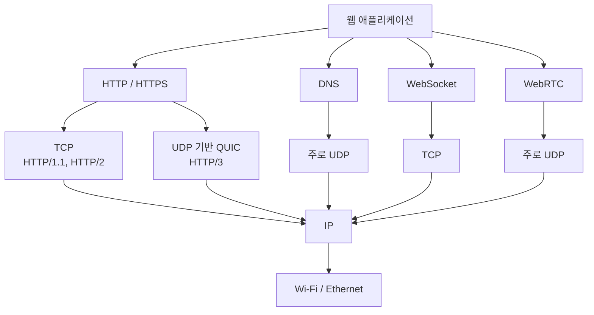

웹 개발자가 직접 TCP나 UDP 코드를 작성하는 경우는 많지 않다.
대부분 **HTTP, WebSocket, WebRTC 등의 상위 프로토콜이 내부적으로 TCP 또는 UDP를 사용**한다.

---

# 2. TCP
> **TCP(Transmission Control Protocol)**는 두 컴퓨터가 연결을 설정한 후 데이터를 안정적으로 주고받는 프로토콜이다.

### 주요 특징

* 연결 지향
* 데이터 전달 여부 확인
* 전송 순서 보장
* 손실된 데이터 재전송
* 중복 데이터 처리
* 흐름 제어
* 혼잡 제어

웹 페이지, 로그인 정보, 주문 정보처럼 **데이터가 정확하게 전달되어야 하는 통신**에 적합하다.

---

## 3. TCP 연결 과정
> TCP는 데이터를 보내기 전에 통신할 상대와 연결을 설정한다.

대표적인 연결 과정이 **3-Way Handshake**이다.

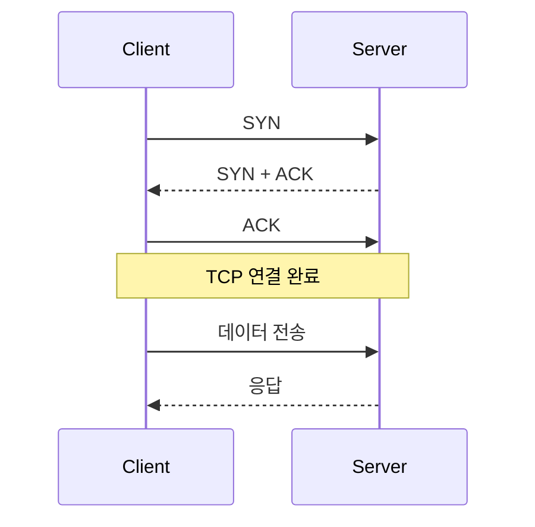

개념적으로 다음과 같다.

```text
Client                     Server
   │                          │
   │ ───── 연결 요청 ───────▶ │
   │                          │
   │ ◀──── 연결 승인 ──────── │
   │                          │
   │ ───── 확인 ────────────▶ │
   │                          │
   │       연결 완료           │
```

이후 데이터를 전송한다.

---

# 4. TCP가 데이터를 안전하게 전달하는 방법
> 예를 들어 다음 데이터가 있다고 가정한다.

```text
Hello Web Server
```

네트워크에서는 여러 조각으로 전송될 수 있다.

```text
1번 → Hello
2번 → Web
3번 → Server
```

전송 중 2번 데이터가 손실되면 TCP가 이를 확인하고 다시 전송한다.

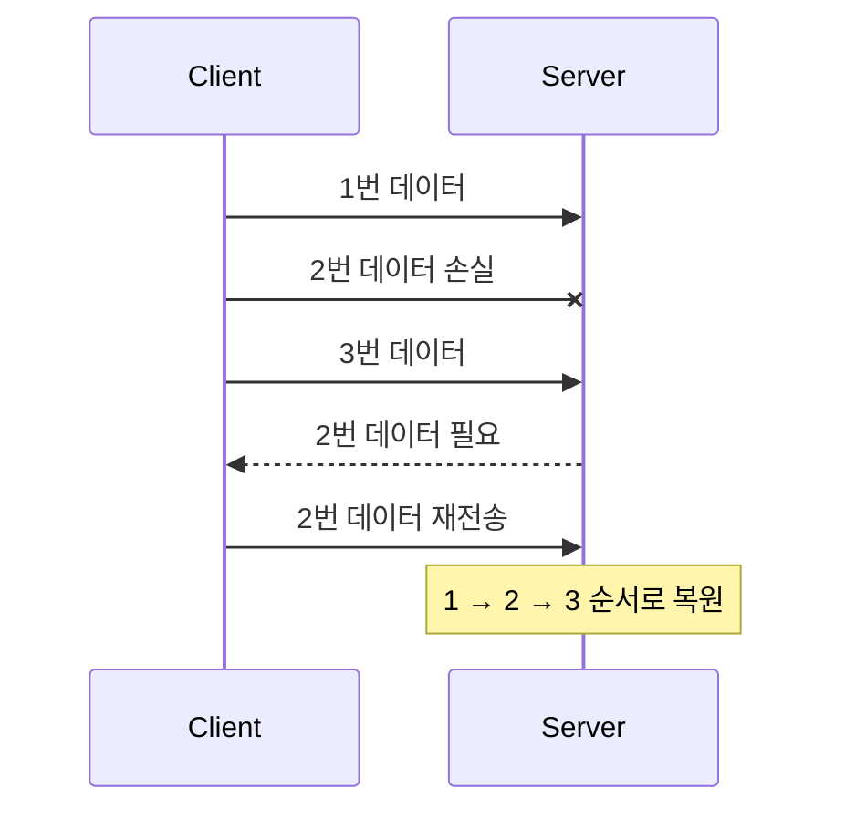

따라서 애플리케이션에서는 최종적으로 올바른 데이터를 받을 수 있다.

---

# 5. 웹 개발에서 TCP가 사용되는 위치
> 일반적인 풀스택 애플리케이션은 다음과 같은 구조를 가진다.

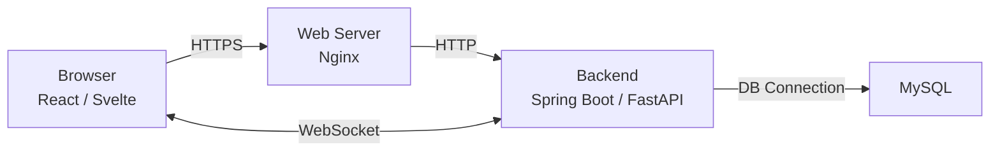

여기에서 전통적으로 대부분 TCP가 사용된다.

| 통신            | 일반적인 전송 방식   |
| ------------- | ------------ |
| HTTP/1.1      | TCP          |
| HTTP/2        | TCP          |
| HTTPS         | TCP + TLS    |
| WebSocket     | TCP          |
| MySQL 연결      | TCP          |
| PostgreSQL 연결 | TCP          |
| SSH           | TCP          |
| HTTP/3        | **QUIC/UDP** |

---

# 6. 웹사이트 요청과 TCP
> 브라우저에서 다음 주소를 요청한다고 가정한다.

```text
https://example.com/api/users
```

HTTP/1.1 또는 HTTP/2 환경에서는 개념적으로 다음 과정을 거친다.

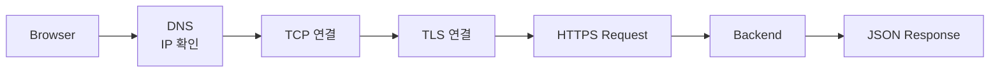

예:

```http
GET /api/users HTTP/1.1
Host: example.com
```

서버:

```json
[
  {
    "id": 1,
    "name": "Kim"
  }
]
```

회원 정보가 중간에서 손실되거나 순서가 바뀌면 안 되므로 안정적인 전송이 중요하다.

---

# 7. UDP
> **UDP(User Datagram Protocol)**는 TCP처럼 연결을 먼저 설정하지 않고 데이터를 바로 전송하는 방식이다.

### 주요 특징

* 비연결형
* 연결 설정 과정이 단순함
* 전송 속도와 지연시간에 유리
* 데이터 도착을 보장하지 않음
* 순서를 보장하지 않음
* 기본적으로 재전송하지 않음

따라서 **일부 데이터가 손실되더라도 빠른 전달이 더 중요한 서비스**에 적합하다.

---

# 8. UDP 통신 방식
> UDP는 TCP의 3-Way Handshake 같은 연결 설정이 없다.

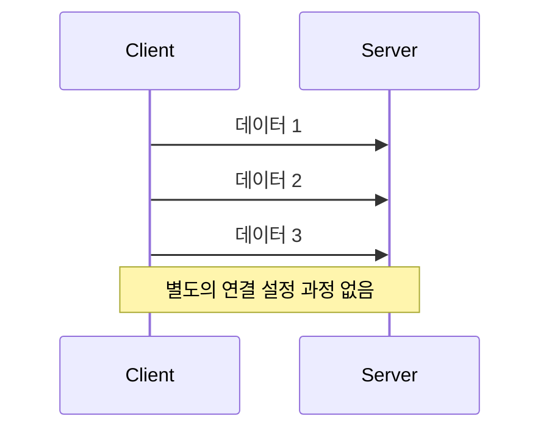

개념적으로 다음과 같다.

```text
TCP

연결
 ↓
확인
 ↓
데이터
 ↓
재전송
 ↓
응답
```

UDP는 더 단순하다.

```text
UDP

데이터
 ↓
전송
```

---

# 9. UDP에서 데이터가 손실되면
> 다음 세 데이터를 전송한다고 가정한다.

```text
1번 → 영상 Frame
2번 → 영상 Frame
3번 → 영상 Frame
```

2번 데이터가 손실될 수 있다.

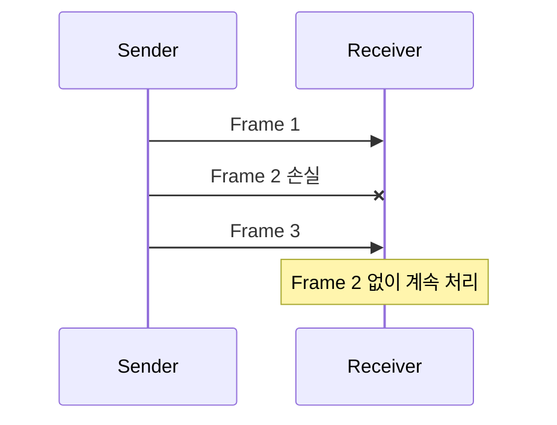

실시간 영상 통화에서는 오래된 Frame 2를 다시 받아 기다리는 것보다 **Frame 3을 즉시 보여주는 것이 더 유리할 수 있다.**

---

# 10. 웹 개발에서 UDP가 중요한 대표 사례

## DNS

브라우저에서

```text
www.example.com
```

을 입력하면 먼저 서버의 IP 주소를 확인해야 한다.

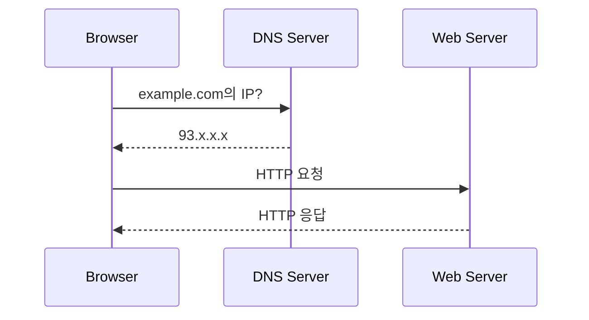

전통적인 DNS 질의는 **주로 UDP 53번 포트**를 사용한다.

단, DNS가 항상 UDP만 사용하는 것은 아니다. 상황에 따라 TCP도 사용하며 DNS over HTTPS 같은 방식도 존재한다.

---

# 11. WebRTC

웹에서 UDP를 이해할 때 가장 중요한 사례 중 하나가 **WebRTC**이다.

WebRTC는 브라우저에서 실시간 음성·영상 통신을 구현할 때 사용한다.

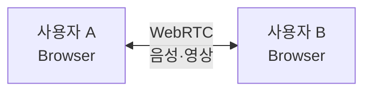

대표적인 사용 사례:

* 화상회의
* 음성통화
* 실시간 스트리밍
* AI 음성 비서
* 실시간 Avatar
* P2P 데이터 전송

미디어 전송은 낮은 지연시간이 중요하므로 일반적으로 UDP를 우선 활용한다.

---

# 12. 실시간 음성 서비스에서 UDP가 중요한 이유

예를 들어 AI 음성 비서가 있다고 가정한다.

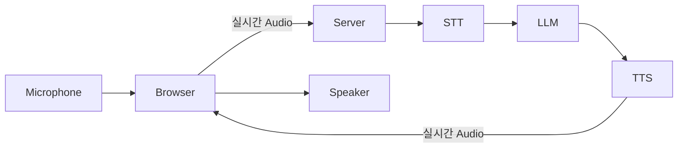

음성 데이터에서 중요한 것은 **낮은 지연시간**이다.

사용자가

> "오늘 날씨 알려줘."

라고 말했는데 네트워크 재전송 때문에 몇 초씩 기다린다면 자연스러운 대화가 어려워진다.

따라서 실시간 미디어에서는 정확성뿐 아니라 **Latency(지연시간)**가 매우 중요하다.

---

# 13. HTTP/3와 UDP

과거에는 웹 통신을 다음과 같이 이해해도 충분했다.

```text
HTTP
 ↓
TCP
 ↓
IP
```

현재는 HTTP/3도 사용된다.

```text
HTTP/3
 ↓
QUIC
 ↓
UDP
 ↓
IP
```

구조를 비교하면 다음과 같다.

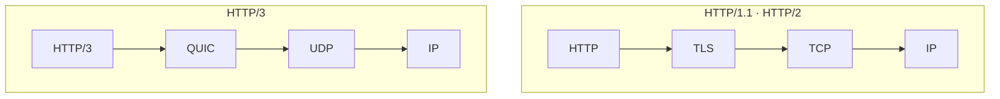

따라서

> "웹사이트는 무조건 TCP를 사용한다."

라고 이해하면 정확하지 않다.

더 정확한 표현은 다음과 같다.

> **HTTP/1.1과 HTTP/2는 TCP를 사용하고, HTTP/3는 QUIC을 통해 UDP를 사용한다.**

---

# 14. TCP와 UDP 비교

| 구분        | TCP                             | UDP               |
| --------- | ------------------------------- | ----------------- |
| 연결 방식     | 연결 지향                           | 비연결               |
| 연결 설정     | 필요                              | 불필요               |
| 데이터 전달 보장 | O                               | X                 |
| 순서 보장     | O                               | X                 |
| 재전송       | O                               | 기본적으로 X           |
| 오버헤드      | 상대적으로 큼                         | 작음                |
| 지연시간      | 상대적으로 증가 가능                     | 낮게 구성 가능          |
| 대표 용도     | HTTP/1.1, HTTP/2, WebSocket, DB | DNS, WebRTC, QUIC |
| 중요한 목표    | 정확성·신뢰성                         | 실시간성·낮은 지연        |

---

# 15. 웹 개발 관점에서의 선택

TCP와 UDP 중 개발자가 직접 하나를 선택하는 경우는 많지 않다.

대부분 **사용하는 기술에 따라 결정된다.**

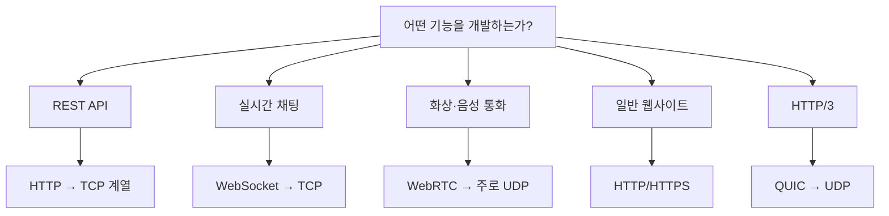

### REST API

```javascript
fetch("/api/users")
```

개발자는 TCP를 직접 다루지 않는다.

```text
fetch()
   ↓
HTTP
   ↓
TCP 또는 QUIC
   ↓
IP
```

브라우저와 운영체제가 하위 네트워크 통신을 처리한다.

---

# 16. 기능별 연결

### 일반 웹 페이지

```text
Browser
 ↓
HTTPS
 ↓
TCP 또는 QUIC
 ↓
Web Server
```

### REST API

```text
React
 ↓
fetch()
 ↓
HTTP
 ↓
Backend API
```

### 실시간 채팅

```text
Browser
 ↕
WebSocket
 ↕
TCP
 ↕
Server
```

메시지가 정확한 순서로 도착하는 것이 중요하다.

### 화상회의

```text
Camera / Microphone
        ↓
      WebRTC
        ↓
   주로 UDP 기반
        ↓
상대방 Browser
```

낮은 지연시간이 중요하다.

---

# 17. 웹 개발자가 기억할 핵심

```text
TCP
 ├─ 연결을 설정
 ├─ 전달 확인
 ├─ 순서 보장
 ├─ 재전송
 └─ 정확성이 중요한 통신

UDP
 ├─ 연결 설정이 단순
 ├─ 전달 보장 없음
 ├─ 순서 보장 없음
 ├─ 낮은 지연시간에 유리
 └─ 실시간성이 중요한 통신
```

이를 웹 기술에 연결하면 다음과 같다.

```text
REST API
HTTP/1.1 · HTTP/2
WebSocket
Database
        ↓
       TCP


DNS
WebRTC
HTTP/3의 QUIC
        ↓
       UDP
```

### 가장 중요한 기준

**TCP = 정확하게 전달하는 것이 중요**

**UDP = 빠르게 전달하는 것이 중요**

다만 실제 웹 개발에서는 TCP/UDP를 직접 선택하기보다 **HTTP, WebSocket, WebRTC, HTTP/3 같은 상위 프로토콜을 선택하고, 해당 프로토콜이 적절한 전송 방식을 사용한다.**
