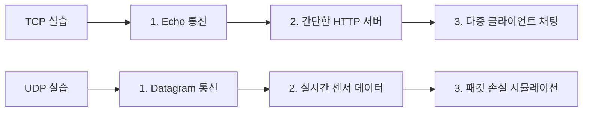
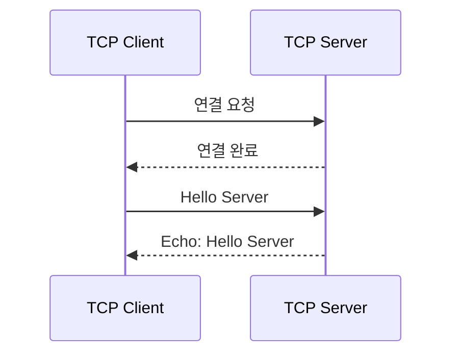
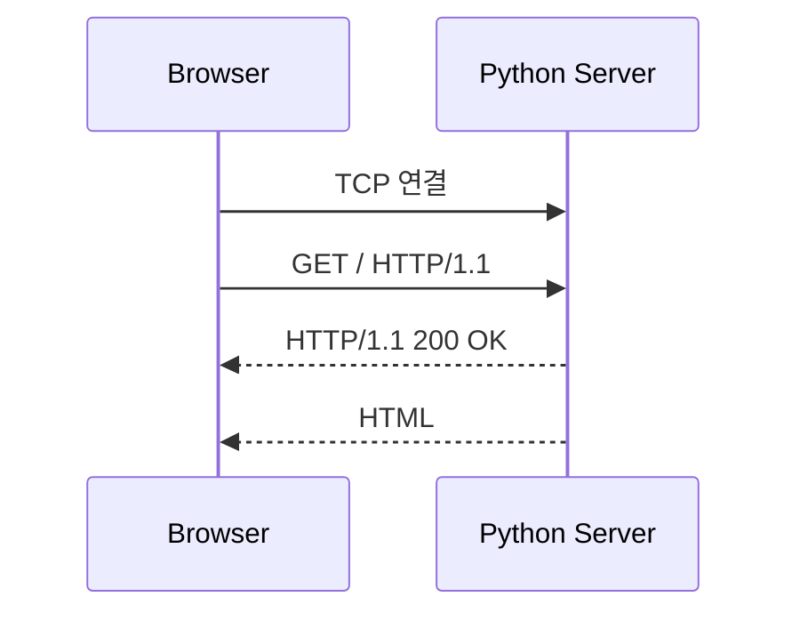
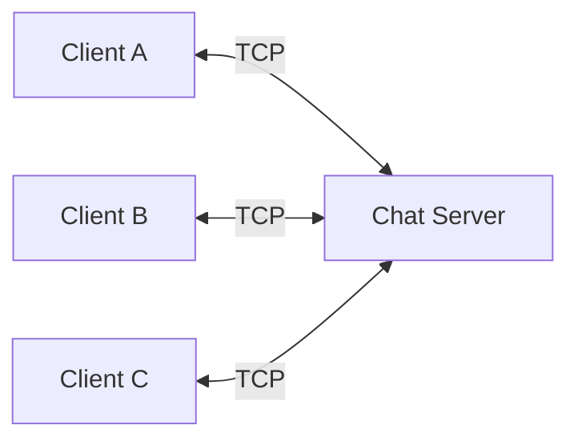
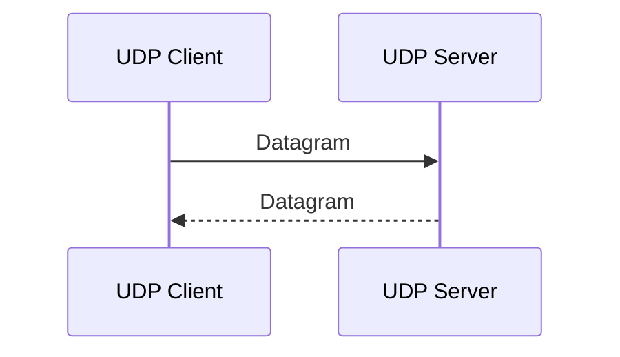
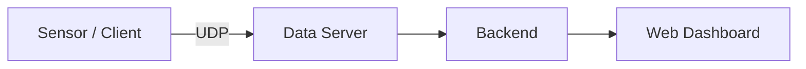
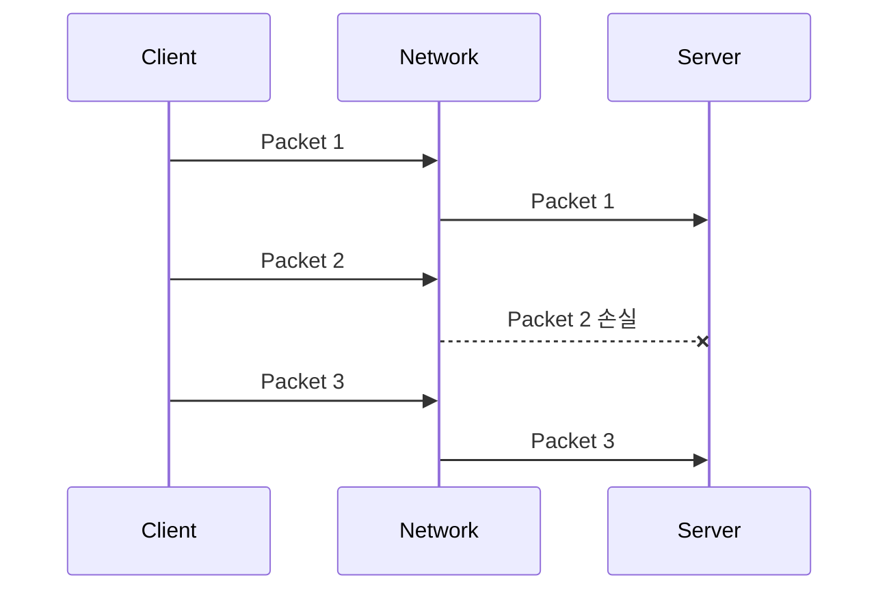
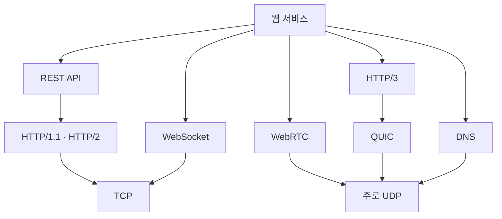

# TCP/UDP 실습 코드

아래 실습은 앞에서 학습한 **TCP/UDP의 차이를 코드로 직접 확인**하는 것을 목표로 한다. 모두 **Python 표준 라이브러리만 사용**하므로 별도 설치가 필요 없다.

전체 흐름은 다음과 같다.



---

# 1. TCP 실습 1 — Echo Client / Server

## 목적

TCP의 기본 구조를 확인한다.

* 서버가 먼저 실행
* 클라이언트가 서버에 연결
* 연결 후 데이터 송수신
* 응답 데이터 확인

구조:



## TCP 서버

`tcp_server.py`

```python
import socket

HOST = "127.0.0.1"
PORT = 5000

server_socket = socket.socket(
    socket.AF_INET,
    socket.SOCK_STREAM
)

server_socket.bind((HOST, PORT))
server_socket.listen()

print(f"TCP Server 실행: {HOST}:{PORT}")

conn, addr = server_socket.accept()

print("Client 연결:", addr)

data = conn.recv(1024)

message = data.decode()
print("받은 데이터:", message)

response = f"Echo: {message}"

conn.sendall(response.encode())

conn.close()
server_socket.close()
```

## TCP 클라이언트

`tcp_client.py`

```python
import socket

HOST = "127.0.0.1"
PORT = 5000

client_socket = socket.socket(
    socket.AF_INET,
    socket.SOCK_STREAM
)

client_socket.connect((HOST, PORT))

message = "Hello TCP Server"

client_socket.sendall(message.encode())

data = client_socket.recv(1024)

print("Server 응답:", data.decode())

client_socket.close()
```

## 실행

터미널 1:

```bash
python tcp_server.py
```

터미널 2:

```bash
python tcp_client.py
```

결과:

```text
Server 응답: Echo: Hello TCP Server
```

### 확인

TCP에서는 먼저 다음 과정이 필요하다.

```text
Server listen
      ↓
Client connect
      ↓
Connection
      ↓
Data 전송
```

---

# 2. TCP 실습 2 — 간단한 HTTP 서버

웹 개발과 가장 직접적으로 연결되는 실습이다.

## 목적

다음 관계를 확인한다.

```text
Browser
   ↓
TCP
   ↓
HTTP Request
   ↓
Python Server
   ↓
HTTP Response
```



## 서버 코드

`simple_http_server.py`

```python
import socket

HOST = "127.0.0.1"
PORT = 8080

server = socket.socket(
    socket.AF_INET,
    socket.SOCK_STREAM
)

server.bind((HOST, PORT))
server.listen()

print(f"HTTP Server 실행")
print(f"http://{HOST}:{PORT}")

while True:

    conn, addr = server.accept()

    request = conn.recv(4096).decode()

    print("\n===== HTTP Request =====")
    print(request)

    body = """
    <html>
        <head>
            <meta charset="UTF-8">
        </head>
        <body>
            <h1>Hello TCP</h1>
            <p>Python TCP Socket Web Server</p>
        </body>
    </html>
    """

    response = (
        "HTTP/1.1 200 OK\r\n"
        "Content-Type: text/html; charset=utf-8\r\n"
        f"Content-Length: {len(body.encode())}\r\n"
        "\r\n"
        + body
    )

    conn.sendall(response.encode())

    conn.close()
```

## 실행

```bash
python simple_http_server.py
```

Chrome에서 접속:

```text
http://127.0.0.1:8080
```

터미널에는 브라우저가 보낸 HTTP 요청이 출력된다.

예:

```http
GET / HTTP/1.1
Host: 127.0.0.1:8080
User-Agent: Mozilla/5.0
Accept: text/html
```

### 핵심

일반적인 HTTP/1.1 웹 통신은 구조적으로 다음과 연결된다.

```text
HTML / JSON
    ↓
HTTP
    ↓
TCP
    ↓
IP
```

따라서 웹 개발에서 사용하는

```javascript
fetch("/api/users")
```

도 TCP/QUIC 등의 하위 네트워크 통신 위에서 동작한다.

---

# 3. TCP 실습 3 — 다중 클라이언트 채팅

## 목적

TCP 연결이 **클라이언트별로 유지**되는 것을 확인한다.

웹 개발에서는 다음 기술과 연결된다.

```text
TCP
 ↓
WebSocket
 ↓
실시간 채팅
```

구조:



## 서버

`tcp_chat_server.py`

```python
import socket
import threading

HOST = "127.0.0.1"
PORT = 5001

clients = []


def handle_client(conn, addr):

    print("접속:", addr)

    while True:
        try:
            data = conn.recv(1024)

            if not data:
                break

            message = data.decode()

            print(addr, message)

            for client in clients:
                if client != conn:
                    client.sendall(
                        f"{addr}: {message}".encode()
                    )

        except:
            break

    clients.remove(conn)

    conn.close()

    print("종료:", addr)


server = socket.socket(
    socket.AF_INET,
    socket.SOCK_STREAM
)

server.bind((HOST, PORT))
server.listen()

print(f"Chat Server: {HOST}:{PORT}")

while True:

    conn, addr = server.accept()

    clients.append(conn)

    thread = threading.Thread(
        target=handle_client,
        args=(conn, addr),
        daemon=True
    )

    thread.start()
```

## 클라이언트

`tcp_chat_client.py`

```python
import socket
import threading

HOST = "127.0.0.1"
PORT = 5001

client = socket.socket(
    socket.AF_INET,
    socket.SOCK_STREAM
)

client.connect((HOST, PORT))


def receive_message():

    while True:
        try:
            message = client.recv(1024).decode()

            print("\n", message)

        except:
            break


thread = threading.Thread(
    target=receive_message,
    daemon=True
)

thread.start()

print("채팅 시작")

while True:

    message = input("> ")

    if message == "exit":
        break

    client.sendall(message.encode())

client.close()
```

## 실행

서버:

```bash
python tcp_chat_server.py
```

클라이언트 터미널을 2~3개 실행:

```bash
python tcp_chat_client.py
```

메시지를 입력하면 다른 클라이언트에 전달된다.

### 웹 개발 연결

실제 웹 채팅에서는 직접 Socket을 작성하기보다 보통:

```text
Browser
   ↓
WebSocket
   ↓
TCP
   ↓
Server
```

구조를 사용한다.

---

# 4. UDP 실습 1 — Echo Client / Server

TCP 실습 1과 비교하면 차이가 명확하다.

## 목적

UDP에는 다음 과정이 없음을 확인한다.

```text
listen()
accept()
connect()
```

기본적인 UDP 구조:



## UDP 서버

`udp_server.py`

```python
import socket

HOST = "127.0.0.1"
PORT = 6000

server = socket.socket(
    socket.AF_INET,
    socket.SOCK_DGRAM
)

server.bind((HOST, PORT))

print(f"UDP Server: {HOST}:{PORT}")

while True:

    data, addr = server.recvfrom(1024)

    message = data.decode()

    print(
        f"{addr} → {message}"
    )

    response = f"Echo: {message}"

    server.sendto(
        response.encode(),
        addr
    )
```

## UDP 클라이언트

`udp_client.py`

```python
import socket

HOST = "127.0.0.1"
PORT = 6000

client = socket.socket(
    socket.AF_INET,
    socket.SOCK_DGRAM
)

message = "Hello UDP"

client.sendto(
    message.encode(),
    (HOST, PORT)
)

data, addr = client.recvfrom(1024)

print("Server 응답:", data.decode())

client.close()
```

## TCP와 비교

TCP:

```python
socket.SOCK_STREAM
```

UDP:

```python
socket.SOCK_DGRAM
```

TCP:

```text
connect
 ↓
send
 ↓
receive
```

UDP:

```text
sendto
 ↓
recvfrom
```

---

# 5. UDP 실습 2 — 실시간 센서 데이터 전송

실시간 서비스의 특징을 이해하기 좋은 실습이다.

웹/IoT 서비스에서는 다음 구조로 연결될 수 있다.



## 서버

`udp_sensor_server.py`

```python
import socket

HOST = "127.0.0.1"
PORT = 6001

server = socket.socket(
    socket.AF_INET,
    socket.SOCK_DGRAM
)

server.bind((HOST, PORT))

print("Sensor Server 실행")

while True:

    data, addr = server.recvfrom(1024)

    print(
        "센서 데이터:",
        data.decode()
    )
```

## 클라이언트

`udp_sensor_client.py`

```python
import socket
import random
import time
import json

HOST = "127.0.0.1"
PORT = 6001

client = socket.socket(
    socket.AF_INET,
    socket.SOCK_DGRAM
)

while True:

    data = {
        "temperature": round(
            random.uniform(20, 30),
            2
        ),
        "humidity": round(
            random.uniform(40, 70),
            2
        )
    }

    message = json.dumps(data)

    client.sendto(
        message.encode(),
        (HOST, PORT)
    )

    print("전송:", message)

    time.sleep(1)
```

출력:

```text
전송: {"temperature": 25.21, "humidity": 55.32}

전송: {"temperature": 27.14, "humidity": 60.18}
```

### 특징

매초 새로운 데이터가 전달된다.

```text
25.2°C
 ↓
25.5°C
 ↓
25.7°C
 ↓
26.1°C
```

중간의 한 데이터가 사라져도 최신 데이터가 계속 들어오는 서비스라면 UDP가 적합할 수 있다.

---

# 6. UDP 실습 3 — 패킷 손실 시뮬레이션

TCP와 UDP의 차이를 가장 명확하게 확인할 수 있는 실습이다.

## 목적

UDP에서는 패킷이 손실되어도 자동 재전송되지 않는 모습을 확인한다.



실제 localhost에서는 패킷 손실이 거의 발생하지 않으므로 서버 코드에서 의도적으로 일부 패킷을 버린다.

## 서버

`udp_loss_server.py`

```python
import socket
import random

HOST = "127.0.0.1"
PORT = 6002

server = socket.socket(
    socket.AF_INET,
    socket.SOCK_DGRAM
)

server.bind((HOST, PORT))

print("UDP Loss Test Server")

while True:

    data, addr = server.recvfrom(1024)

    message = data.decode()

    # 30% 확률로 패킷 손실 시뮬레이션
    if random.random() < 0.3:

        print(
            "DROP:",
            message
        )

        continue

    print(
        "RECEIVE:",
        message
    )

    server.sendto(
        f"ACK {message}".encode(),
        addr
    )
```

## 클라이언트

`udp_loss_client.py`

```python
import socket
import time

HOST = "127.0.0.1"
PORT = 6002

client = socket.socket(
    socket.AF_INET,
    socket.SOCK_DGRAM
)

client.settimeout(1)

for i in range(1, 11):

    message = f"Packet-{i}"

    client.sendto(
        message.encode(),
        (HOST, PORT)
    )

    try:

        data, addr = client.recvfrom(1024)

        print(
            message,
            "→",
            data.decode()
        )

    except socket.timeout:

        print(
            message,
            "→ 응답 없음"
        )

    time.sleep(0.5)

client.close()
```

실행 결과 예:

```text
Packet-1 → ACK Packet-1
Packet-2 → ACK Packet-2
Packet-3 → 응답 없음
Packet-4 → ACK Packet-4
Packet-5 → 응답 없음
Packet-6 → ACK Packet-6
```

서버:

```text
RECEIVE: Packet-1
RECEIVE: Packet-2
DROP: Packet-3
RECEIVE: Packet-4
DROP: Packet-5
```

핵심은 다음이다.

```text
UDP

Packet 1 ─────────▶ 성공
Packet 2 ─────────▶ 성공
Packet 3 ─── X      손실
Packet 4 ─────────▶ 성공

Packet 3 자동 재전송 X
```

---

# 7. TCP와 UDP 코드 비교

이번 6개 실습에서 가장 중요한 차이는 Socket API에서도 확인할 수 있다.

| 구분                 | TCP                    | UDP             |
| ------------------ | ---------------------- | --------------- |
| Socket Type        | `SOCK_STREAM`          | `SOCK_DGRAM`    |
| Server `listen()`  | O                      | X               |
| Server `accept()`  | O                      | X               |
| Client `connect()` | 일반적으로 O                | 필수 아님           |
| 데이터 전송             | `send()` / `sendall()` | `sendto()`      |
| 데이터 수신             | `recv()`               | `recvfrom()`    |
| 연결 유지              | O                      | X               |
| 패킷 손실 처리           | TCP가 처리                | 애플리케이션이 필요 시 처리 |

코드 구조도 다르다.

### TCP

```python
server.listen()

conn, addr = server.accept()

data = conn.recv(1024)

conn.sendall(data)
```

### UDP

```python
data, addr = server.recvfrom(1024)

server.sendto(data, addr)
```

---

# 8. 웹 개발 기술과 연결

6개 실습을 실제 웹 기술에 연결하면 다음과 같다.



### 일반 웹 API

```javascript
fetch("/api/users")
```

구조:

```text
React / Svelte
      ↓
HTTP
      ↓
TCP 또는 QUIC
      ↓
Backend
```

### 채팅 서비스

```text
Browser
   ↕
WebSocket
   ↕
TCP
   ↕
Backend
```

### 음성·영상 서비스

```text
Browser
   ↕
WebRTC
   ↕
주로 UDP
   ↕
상대방 / Server
```

---

# 9. 추천 실습 순서

비전공자라면 다음 순서가 가장 이해하기 쉽다.

```text
① TCP Echo
       ↓
Client / Server와 Connection 이해

② UDP Echo
       ↓
TCP와 UDP 코드 차이 비교

③ HTTP TCP Server
       ↓
웹사이트와 TCP 연결

④ UDP Sensor
       ↓
실시간 데이터 이해

⑤ TCP Chat
       ↓
연결 유지 이해

⑥ UDP Packet Loss
       ↓
신뢰성 차이 확인
```

특히 **TCP 실습 2의 HTTP 서버**는 풀스택 학습과 직접 연결되는 핵심 실습이다. `socket → TCP → HTTP → Browser`의 관계를 이해하면 이후 **FastAPI, Spring Boot, Node.js의 웹 서버가 내부적으로 어떤 네트워크 구조 위에서 동작하는지** 이해하기 쉬워진다.
