# Web 기초
> 웹의 역사를 개발자 관점에서 보면 단순히 “웹사이트가 어떻게 발전했는가”보다 **브라우저와 서버가 어떻게 통신하게 되었고, 정적 문서에서 동적 애플리케이션·클라우드 서비스로 어떻게 발전했는가**를 중심으로 이해하는 것이 중요합니다.  
> 특히 **HTTP/1.0 → HTTP/1.1 → HTTP/2 → HTTP/3**의 변화는 현대 웹 개발 구조를 이해하는 핵심입니다.

---

# 1. 웹의 전체 발전 흐름

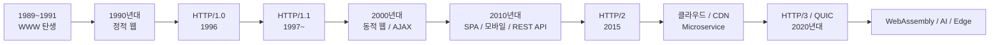

개발 관점에서 보면 크게 다음 방향으로 발전했습니다.

> **문서 공유 → 동적 웹 → 웹 애플리케이션 → API 중심 → 분산·클라우드 웹**

---

# 2. WWW가 등장하기 이전

초기의 인터넷에는 이미 다음 기술들이 있었습니다.

```text
Internet
 ├─ E-mail
 ├─ FTP
 ├─ Telnet
 └─ Usenet
```

하지만 정보를 보려면 각각 다른 프로그램과 명령어를 사용해야 했습니다.

예를 들어 FTP에서는 다음과 같이 파일을 직접 가져와야 했습니다.

```bash
ftp server.example.com
get document.txt
```

문제는 **문서와 문서를 쉽게 연결할 방법이 부족했다는 것**입니다.

WWW는 이를 다음 세 가지 핵심 기술로 해결했습니다.

```text
HTML
HTTP
URL
```

---

# 3. 1989~1991: WWW의 탄생

Tim Berners-Lee가 CERN에서 WWW를 제안했습니다.

웹의 기본 구조는 지금도 크게 변하지 않았습니다.

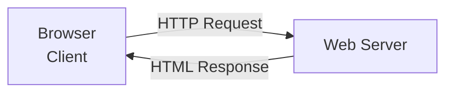

핵심 기술은 세 가지입니다.

| 기술         | 역할               |
| ---------- | ---------------- |
| HTML       | 웹 문서 표현          |
| URL        | 인터넷 자원의 위치 표현    |
| HTTP       | 브라우저와 서버의 통신     |
| Browser    | HTML을 해석하여 화면 표시 |
| Web Server | HTTP 요청 처리       |

예를 들어:

```text
http://example.com/index.html
```

의 의미는

```text
http
 ↓
통신 방법

example.com
 ↓
서버

/index.html
 ↓
요청할 Resource
```

입니다.

---

# 4. 최초 HTTP: HTTP/0.9

초기 HTTP는 매우 단순했습니다.

브라우저가 다음과 같이 요청합니다.

```http
GET /index.html
```

서버는 HTML만 돌려줍니다.

```html
<html>
    <h1>Hello Web</h1>
</html>
```

HTTP Header도 거의 없었습니다.

구조적으로 보면:

```text
Client
   │
   │ GET /index.html
   ▼
Server
   │
   │ HTML
   ▼
Client
```

### HTTP/0.9의 한계

이미지, CSS, 다양한 파일 형식과 상태 코드를 체계적으로 처리하기 어려웠습니다.

그래서 HTTP 자체가 더 발전해야 했습니다.

---

# 5. 1990년대 초: 정적 웹의 시대

초기의 웹 서버에는 미리 만들어진 HTML 파일이 존재했습니다.

```text
Web Server

/index.html
/about.html
/company.html
/product.html
```

사용자가

```text
GET /product.html
```

을 요청하면 서버가 파일을 그대로 반환했습니다.

이를 **Static Web**이라고 합니다.

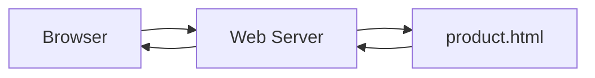

이 시기의 웹 개발자는 주로

```text
HTML
+
Web Server
```

를 다뤘습니다.

---

# 6. 1993~1995: 웹 브라우저의 대중화

Mosaic, Netscape 같은 그래픽 브라우저가 등장하면서 웹이 빠르게 확산했습니다.

텍스트 중심이던 웹에

* 이미지
* 링크
* 테이블
* 폼
* 스타일
* 스크립트

등이 추가되기 시작합니다.

특히 이후 등장한 기술들이 현대 프론트엔드의 기반이 됩니다.

```text
HTML
CSS
JavaScript
```

이를 흔히 웹의 3대 기본 기술이라고 합니다.

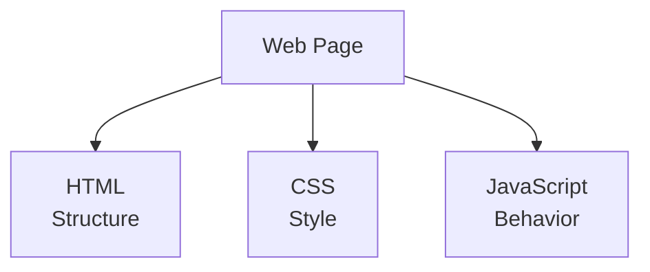

---

# 7. 1996: HTTP/1.0

개발자가 웹 역사를 공부할 때 **HTTP/1.0은 반드시 이해해야 하는 전환점**입니다.

HTTP/1.0은 초기 HTTP보다 훨씬 체계적인 통신 규칙을 제공합니다.

대표적인 요청:

```http
GET /index.html HTTP/1.0
Host: www.example.com
User-Agent: Mozilla/5.0
```

응답:

```http
HTTP/1.0 200 OK
Content-Type: text/html
Content-Length: 1024

<html>
...
</html>
```

여기서 중요한 개념들이 등장합니다.

```text
Request Header
Response Header
Status Code
Content-Type
Content-Length
```

---

# 8. HTTP Status Code

HTTP/1.0 시대부터 현대 웹 개발까지 매우 중요한 개념입니다.

대표적으로:

```text
200 OK
301 Moved Permanently
302 Found
400 Bad Request
401 Unauthorized
403 Forbidden
404 Not Found
500 Internal Server Error
```

전체 구조는 다음과 같습니다.

| 범위  | 의미        |
| --- | --------- |
| 1xx | 정보        |
| 2xx | 성공        |
| 3xx | Redirect  |
| 4xx | Client 오류 |
| 5xx | Server 오류 |

REST API를 개발할 때도 그대로 사용됩니다.

---

# 9. HTTP/1.0의 가장 큰 문제

HTTP/1.0의 대표적인 문제는 **기본적으로 요청마다 TCP 연결을 새로 만들어야 했다는 점**입니다.

웹페이지 하나에 다음 파일이 있다고 가정합니다.

```text
index.html
style.css
app.js
logo.png
photo.jpg
```

HTTP/1.0 방식에서는 개념적으로:

```text
TCP 연결 → index.html → 종료

TCP 연결 → style.css → 종료

TCP 연결 → app.js → 종료

TCP 연결 → logo.png → 종료

TCP 연결 → photo.jpg → 종료
```

가 반복됩니다.

이를 그림으로 보면:

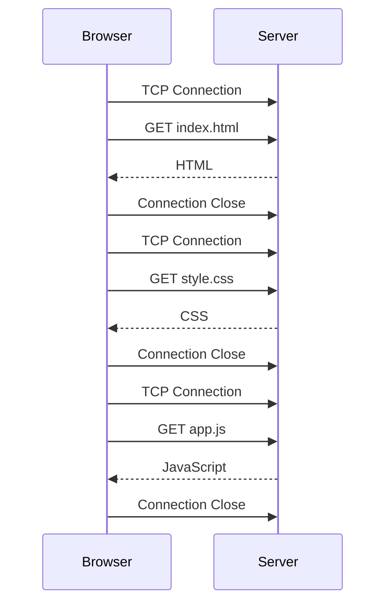

웹페이지가 복잡해질수록 비효율이 커졌습니다.

---

# 10. HTTP/1.1의 등장

이 문제를 크게 개선한 것이 **HTTP/1.1**입니다.

HTTP/1.1의 대표적인 변화:

```text
Persistent Connection
Host Header
Chunked Transfer Encoding
Caching 개선
Range Request
Pipelining
```

그중 가장 중요한 것은 **Persistent Connection**, 즉 Keep-Alive입니다.

---

# 11. HTTP/1.0과 HTTP/1.1 차이

HTTP/1.0:

```text
Connection
   ↓
Request
   ↓
Response
   ↓
Close
```

HTTP/1.1:

```text
Connection
   ↓
Request → Response
   ↓
Request → Response
   ↓
Request → Response
   ↓
...
```

한 번 만들어진 TCP 연결을 재사용할 수 있습니다.

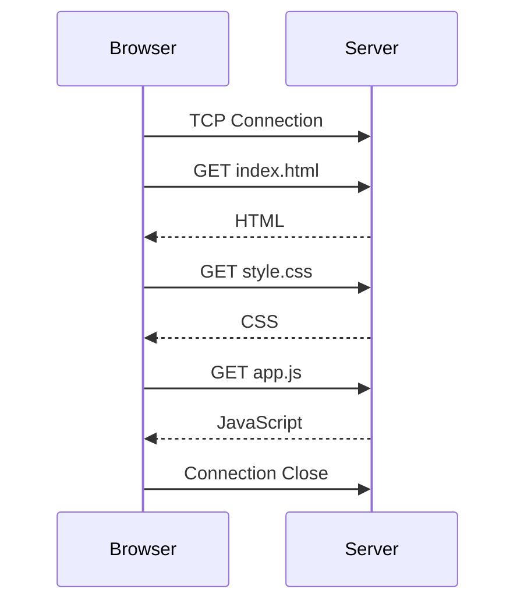

이것만으로도 웹 성능이 크게 개선됩니다.

---

# 12. Host Header의 중요성

HTTP/1.1에서 중요한 특징 중 하나가 `Host`입니다.

```http
GET / HTTP/1.1
Host: www.example.com
```

왜 중요할까요?

하나의 서버 IP에 여러 웹사이트를 운영할 수 있기 때문입니다.

```text
          203.0.113.10
                │
        ┌───────┼─────────┐
        │       │         │
        ▼       ▼         ▼
     a.com    b.com     c.com
```

이를 **Virtual Hosting**이라고 합니다.

클라우드와 웹 호스팅에서 매우 중요한 개념입니다.

---

# 13. 1990년대 후반: 동적 웹

웹사이트가 단순 문서에서 서비스로 발전하기 시작합니다.

예:

```text
회원가입
로그인
게시판
쇼핑몰
검색
예약
```

이런 기능은 HTML 파일만으로 만들 수 없습니다.

그래서 서버에서 프로그램을 실행합니다.

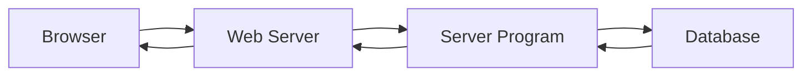

이 시기에 사용된 대표 기술은

```text
CGI
PHP
ASP
JSP
Servlet
```

등입니다.

---

# 14. 웹 + 데이터베이스 구조

웹 개발의 기본 구조가 만들어집니다.

```text
Browser
   ↓
Web Server
   ↓
Application
   ↓
Database
```

현대적으로 표현하면:

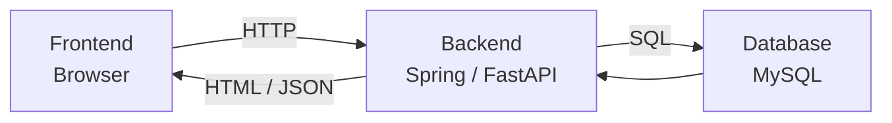

현재의 웹 백엔드 개발도 기본 원리는 같습니다.

---

# 15. JavaScript 등장

초기 JavaScript는 단순했습니다.

예:

```javascript
alert("Hello");
```

하지만 점차 브라우저에서

```text
이벤트 처리
DOM 변경
폼 검증
서버 통신
화면 동적 변경
```

등을 담당하게 됩니다.

이것이 현대 **Frontend Development**의 출발점입니다.

---

# 16. 2000년대: AJAX

웹 역사에서 매우 중요한 변화입니다.

기존 웹:

```text
사용자 클릭
   ↓
서버 요청
   ↓
전체 HTML 반환
   ↓
페이지 전체 새로고침
```

AJAX:

```text
사용자 클릭
   ↓
JavaScript
   ↓
HTTP Request
   ↓
일부 데이터
   ↓
화면 일부만 변경
```

구조:

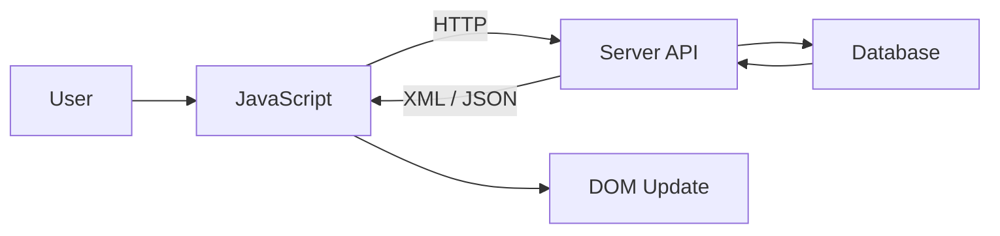

Gmail, Google Maps 같은 서비스가 AJAX의 가능성을 크게 보여주었습니다.

---

# 17. XML에서 JSON으로

초기 AJAX에서는 XML이 많이 사용되었습니다.

```xml
<user>
    <name>Simple</name>
    <age>30</age>
</user>
```

점차 JSON이 널리 사용됩니다.

```json
{
  "name": "Simple",
  "age": 30
}
```

JavaScript에서 다루기 쉽기 때문입니다.

이 변화는 **REST API 기반 웹 개발**로 연결됩니다.

---

# 18. REST API 시대

예전:

```text
Server
   ↓
HTML 생성
   ↓
Browser
```

REST/API 중심:

```text
Server
   ↓
JSON
   ↓
Frontend
```

예:

```http
GET /api/users/100
```

응답:

```json
{
  "id": 100,
  "name": "Kim"
}
```

서버는 이제 화면보다 **데이터를 제공하는 역할**을 많이 담당합니다.

---

# 19. Frontend와 Backend의 분리

현대 웹 개발에서 매우 중요한 변화입니다.

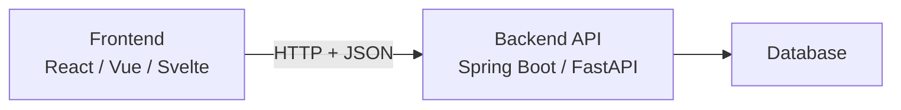

예전에는 JSP처럼 서버가 HTML까지 만드는 경우가 많았습니다.

```text
Spring
 ↓
JSP
 ↓
HTML
```

현재는

```text
React / Vue / Svelte
       ↓
REST API
       ↓
Spring Boot / FastAPI
```

처럼 분리된 구조가 매우 일반적입니다.

---

# 20. SPA의 등장

SPA는 **Single Page Application**입니다.

전통적인 웹:

```text
/page1 → HTML
/page2 → HTML
/page3 → HTML
```

SPA:

```text
index.html
    │
    ├─ JavaScript
    ├─ Router
    └─ API
```

페이지 전체를 다시 내려받기보다 JavaScript가 화면을 변경합니다.

대표적인 기술:

```text
Angular
React
Vue
Svelte
```

---

# 21. HTTP/1.1이 다시 한계에 도달

현대 웹페이지에는 수십~수백 개의 Resource가 존재합니다.

```text
HTML
CSS × 10
JavaScript × 30
Image × 50
Font × 5
API × 20
```

HTTP/1.1에서는 여러 TCP 연결을 만들어 병렬 처리하는 방식이 사용되었습니다.

```text
TCP Connection 1
TCP Connection 2
TCP Connection 3
TCP Connection 4
TCP Connection 5
TCP Connection 6
```

하지만 연결 관리 비용과 요청 순서 대기 문제가 존재했습니다.

이를 개선하기 위해 HTTP/2가 등장합니다.

---

# 22. 2015: HTTP/2

**HTTP/2는 현대 웹 성능을 이해하기 위해 반드시 알아야 할 기술입니다.**

HTTP/1.x는 기본적으로 텍스트 기반 프로토콜입니다.

```http
GET /index.html HTTP/1.1
Host: example.com
```

HTTP/2는 내부 통신을 **Binary Frame**으로 변경합니다.

```text
HTTP Message

        ↓

Binary Frames

┌──────────┐
│ HEADERS  │
├──────────┤
│ DATA     │
├──────────┤
│ DATA     │
└──────────┘
```

---

# 23. HTTP/2의 가장 중요한 특징: Multiplexing

HTTP/1.1:

```text
Connection

Request A → Response A
Request B → Response B
Request C → Response C
```

HTTP/2:

```text
               TCP Connection
                     │
        ┌────────────┼────────────┐
        │            │            │
      Stream 1    Stream 3     Stream 5
        │            │            │
      HTML          CSS           JS
```

하나의 TCP 연결 안에서 여러 요청과 응답을 동시에 처리합니다.

이를 **Multiplexing**이라고 합니다.

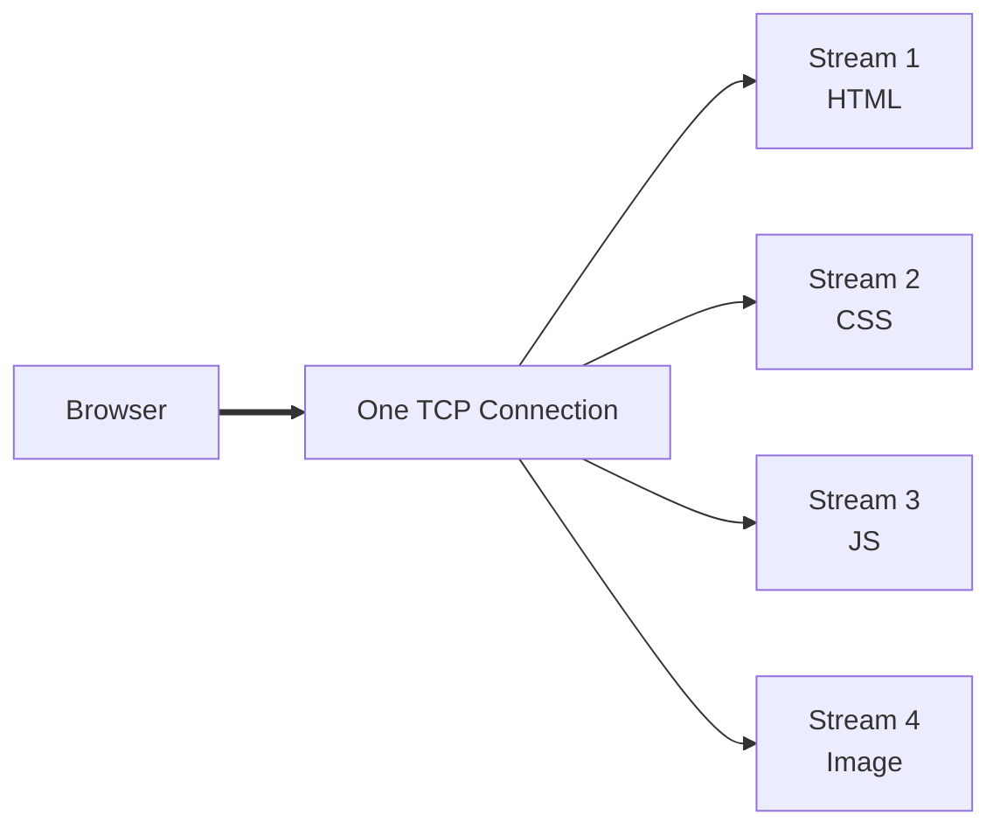

HTTP/2에서 가장 중요한 개념입니다.

---

# 24. HTTP/2의 주요 개선점

HTTP/2는 HTTP의 의미 자체를 바꾼 것이 아닙니다.

여전히 개발자는:

```http
GET
POST
PUT
DELETE
```

를 사용합니다.

그리고:

```text
Header
Status Code
URL
Cookie
Content-Type
```

도 그대로 사용합니다.

**전송 방식을 개선한 것**입니다.

주요 특징은 다음과 같습니다.

| 기능             | 의미                         |
| -------------- | -------------------------- |
| Binary Framing | 데이터를 Binary Frame으로 전달     |
| Multiplexing   | 하나의 연결에서 여러 요청 동시 처리       |
| HPACK          | HTTP Header 압축             |
| Stream         | 요청을 독립적인 Stream으로 관리       |
| Server Push    | 서버가 자원을 선제적으로 전송할 수 있도록 설계 |

Server Push는 이후 실제 웹 생태계에서는 효용이 제한적이어서 현재 브라우저에서는 사실상 사용되지 않는 방향으로 발전했습니다.

---

# 25. HTTP/1.0 → HTTP/1.1 → HTTP/2 비교

| 특징           | HTTP/1.0         | HTTP/1.1      | HTTP/2       |
| ------------ | ---------------- | ------------- | ------------ |
| 등장           | 1996             | 1997~         | 2015         |
| 형식           | Text             | Text          | Binary Frame |
| TCP 연결       | 요청별 연결이 일반적      | 연결 재사용        | 하나의 연결 적극 활용 |
| Keep-Alive   | 기본 아님            | 기본 Persistent | 사용           |
| Multiplexing | X                | 실질적으로 X       | O            |
| Header 압축    | X                | X             | HPACK        |
| Host         | 초기 표준의 핵심 요구는 아님 | 필수            | 지원           |
| Stream       | X                | X             | O            |
| 웹 성능         | 낮음               | 개선            | 크게 개선        |

성능 발전의 핵심만 표현하면:

```text
HTTP/1.0

요청 → TCP 연결
요청 → TCP 연결
요청 → TCP 연결
```

↓

```text
HTTP/1.1

TCP 연결
 ├─ 요청
 ├─ 요청
 └─ 요청
```

↓

```text
HTTP/2

TCP 연결
 ├─ Stream 1
 ├─ Stream 2
 ├─ Stream 3
 └─ Stream 4
    동시에 처리
```

---

# 26. HTTP/2에도 문제가 있다

HTTP/2는 하나의 TCP 연결에서 여러 Stream을 처리합니다.

하지만 TCP 자체는 패킷 순서를 보장합니다.

예:

```text
Packet 1
Packet 2
Packet 3 ← 손실
Packet 4
Packet 5
```

3번 패킷이 사라지면 TCP는 재전송을 기다려야 합니다.

```text
Stream A ──┐
Stream B ──┼─ TCP ── Packet Loss
Stream C ──┘
```

이러한 TCP 계층의 **Head-of-Line Blocking** 문제를 근본적으로 개선하려는 방향이 HTTP/3입니다.

---

# 27. HTTP/3와 QUIC

HTTP/3에서는 TCP 대신 **QUIC**을 사용합니다.

QUIC는 UDP 위에서 동작합니다.

```text
HTTP/1.1
HTTP/2
   ↓
TCP
   ↓
IP
```

HTTP/3:

```text
HTTP/3
   ↓
QUIC
   ↓
UDP
   ↓
IP
```

---

# 28. HTTP/2와 HTTP/3 차이

```text
HTTP/2

Stream A ┐
Stream B ├→ TCP
Stream C ┘
```

HTTP/3:

```text
Stream A ─┐
Stream B ─┼→ QUIC
Stream C ─┘
```

QUIC에서는 각 Stream의 손실 영향을 더 독립적으로 처리할 수 있습니다.

또한 연결 설정과 TLS 통합도 효율화되었습니다.

---

# 29. HTTP 버전 발전의 핵심

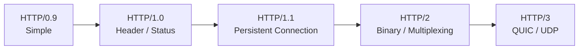

개발자는 다음 한 줄로 기억해도 좋습니다.

> **HTTP의 역사는 요청의 의미를 크게 바꾸기보다, 인터넷에서 HTTP 데이터를 더 빠르고 효율적으로 전달하도록 발전해 온 역사이다.**

---

# 30. HTTPS의 확산

웹이 쇼핑, 금융, 로그인 서비스를 처리하면서 보안이 중요해졌습니다.

HTTP:

```text
Browser
   ↓
Plain HTTP
   ↓
Server
```

HTTPS:

```text
Browser
   ↓
TLS Encryption
   ↓
Server
```

기술 계층으로 보면:

```text
HTTP
 ↓
TLS
 ↓
TCP
 ↓
IP
```

HTTP/3에서는:

```text
HTTP/3
 ↓
QUIC + TLS
 ↓
UDP
 ↓
IP
```

구조입니다.

---

# 31. 웹의 발전과 서버 구조 변화

초기:

```text
Browser
   ↓
Web Server
```

동적 웹:

```text
Browser
   ↓
Web Server
   ↓
Application
   ↓
Database
```

현대:

```text
Browser
   ↓
CDN
   ↓
Load Balancer
   ↓
API Gateway
   ↓
Microservices
   ↓
Cache / Database / Message Queue
```

이를 시각화하면:

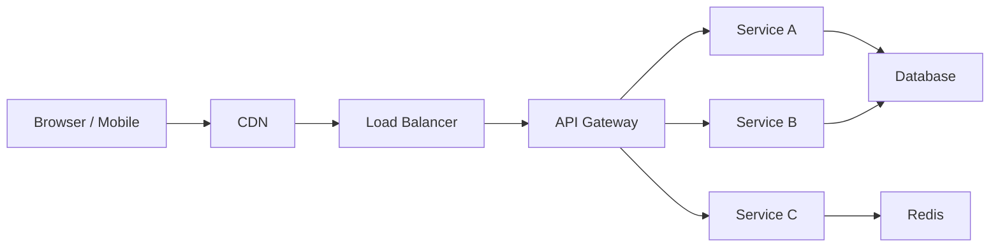

HTTP의 성능 개선이 중요한 이유도 현대 웹의 요청 수가 과거와 비교할 수 없을 정도로 증가했기 때문입니다.

---

# 32. WebSocket의 등장

HTTP는 기본적으로:

```text
Client → Request
Server → Response
```

구조입니다.

하지만 채팅이나 게임은 서버가 실시간으로 데이터를 보내야 합니다.

그래서 WebSocket이 사용됩니다.

```text
Client ↔ Server
Client ↔ Server
Client ↔ Server
```

대표적인 사용 분야:

```text
채팅
주식 시세
게임
실시간 알림
협업 도구
AI Streaming
```

현재 AI 서비스를 개발할 때도 중요한 기술입니다.

---

# 33. 모바일과 웹 API

스마트폰이 등장하면서 서버의 역할도 변화합니다.

과거:

```text
Browser
   ↓
Server
   ↓
HTML
```

현재:

```text
             Backend API
                  │
        ┌─────────┼─────────┐
        │         │         │
       Web       iOS      Android
```

하나의 Backend API를 여러 Client가 사용합니다.

그래서 개발자에게 **API 설계**가 매우 중요해졌습니다.

---

# 34. Cloud 시대

서버 역시 변화했습니다.

과거:

```text
회사 서버실
   ↓
Web Server
```

현재:

```text
AWS
Azure
GCP
```

웹 애플리케이션도:

```text
VM
Container
Docker
Kubernetes
Serverless
```

등에서 실행됩니다.

---

# 35. CDN의 중요성

사용자가 한국에 있고 서버가 미국에 있다면 지연 시간이 커집니다.

CDN은 사용자 가까이에 데이터를 복사해 둡니다.

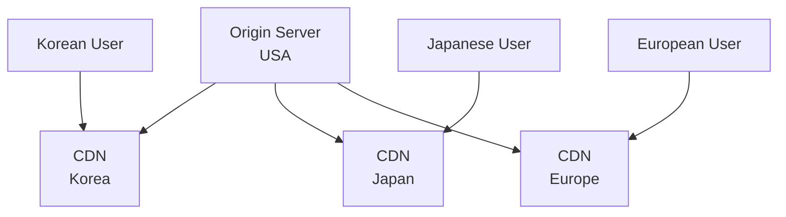

Cloudflare, Akamai, AWS CloudFront 등이 이런 역할을 합니다.

---

# 36. WebAssembly

JavaScript 이외의 언어로 작성된 프로그램을 웹에서 높은 성능으로 실행하기 위해 WebAssembly가 등장했습니다.

```text
C
C++
Rust

 ↓ Compile

WebAssembly

 ↓

Browser
```

사용 분야:

```text
게임
영상 처리
CAD
AI
과학 계산
고성능 웹 프로그램
```

웹이 단순한 문서 플랫폼에서 **범용 애플리케이션 실행 플랫폼**으로 확장되었음을 보여주는 기술입니다.

---

# 37. 현재 웹 개발 구조

현대적인 웹 서비스를 단순화하면 다음과 같습니다.

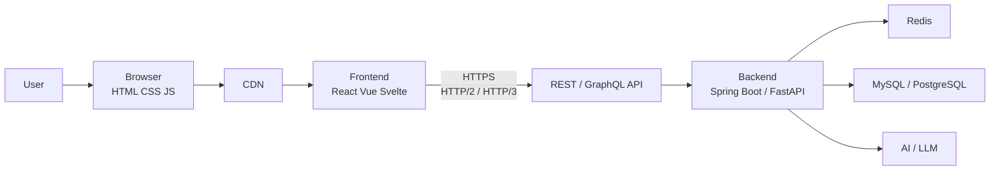

과거 WWW의 기본 구조는 여전히 안쪽에 남아 있습니다.

```text
Client
   ↓
HTTP
   ↓
Server
```

단지 주변 기술이 매우 복잡해진 것입니다.

---

# 38. 개발자가 웹 역사에서 반드시 알아야 할 핵심 기술

웹 개발자라면 역사를 연도별로 암기하기보다는 다음 기술들이 **왜 등장했는지** 이해하는 것이 중요합니다.

| 기술          | 등장 이유                  |
| ----------- | ---------------------- |
| HTML        | 문서 구조 표현               |
| URL         | Resource 위치 표현         |
| HTTP        | Client-Server 통신       |
| HTTP/1.0    | HTTP 통신 표준화            |
| HTTP/1.1    | 연결 재사용과 효율 개선          |
| JavaScript  | Browser 동적 처리          |
| CSS         | 표현과 구조 분리              |
| CGI/PHP/JSP | 동적 웹 생성                |
| AJAX        | 페이지 새로고침 없이 서버 통신      |
| JSON        | 가벼운 데이터 교환             |
| REST API    | Client와 Server 분리      |
| SPA         | 애플리케이션 수준의 Frontend    |
| HTTP/2      | Multiplexing과 전송 효율 개선 |
| WebSocket   | 실시간 양방향 통신             |
| HTTPS/TLS   | 보안 통신                  |
| CDN         | 거리·트래픽 문제 개선           |
| HTTP/3      | QUIC 기반 네트워크 성능 개선     |
| WebAssembly | 브라우저의 고성능 실행           |

---

# 39. Web 1.0 / Web 2.0과 HTTP/1.0 / HTTP/2를 혼동하면 안 된다

이 부분은 학생들이 특히 많이 혼동합니다.

**Web 1.0과 HTTP/1.0은 전혀 다른 개념입니다.**

### Web 1.0

웹 서비스의 사용 형태를 설명하는 표현입니다.

```text
Server
  ↓
정보 제공
  ↓
User
```

사용자는 주로 정보를 읽습니다.

### Web 2.0

사용자가 직접 콘텐츠를 생산하고 상호작용합니다.

```text
User
 ↕
Web Service
 ↕
Other Users
```

예:

```text
YouTube
Facebook
Blog
Wikipedia
SNS
```

반면:

### HTTP/1.0 / HTTP/2

**네트워크 통신 프로토콜의 버전**입니다.

따라서:

```text
Web 2.0
≠
HTTP/2
```

입니다.

---

# 40. 웹의 역사를 개발자 관점에서 압축하면

```text
① 문서를 공유하고 싶다.
        ↓
HTML + URL + HTTP

② 이미지와 다양한 데이터를 전달하고 싶다.
        ↓
HTTP/1.0

③ 매번 연결하는 것이 비효율적이다.
        ↓
HTTP/1.1

④ 사용자가 입력하고 데이터를 저장하고 싶다.
        ↓
CGI / PHP / JSP / DB

⑤ 페이지를 새로고침하지 않고 통신하고 싶다.
        ↓
AJAX

⑥ Frontend와 Backend를 분리하고 싶다.
        ↓
JSON + REST API

⑦ Browser를 Application처럼 만들고 싶다.
        ↓
SPA / React / Vue / Svelte

⑧ 수많은 Resource를 더 빠르게 전달하고 싶다.
        ↓
HTTP/2 + Multiplexing

⑨ 실시간 양방향 통신이 필요하다.
        ↓
WebSocket

⑩ TCP의 한계까지 개선하고 싶다.
        ↓
HTTP/3 + QUIC

⑪ 전 세계에 빠르게 서비스를 제공하고 싶다.
        ↓
Cloud + CDN + Edge
```

---

# 41. 개발자가 기억해야 할 HTTP 발전 한 장 요약

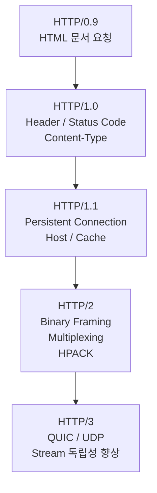

가장 핵심적인 차이를 한 줄씩 기억하면 됩니다.

> **HTTP/1.0:** HTTP가 본격적인 웹 프로토콜로 체계화됨
> **HTTP/1.1:** TCP 연결을 재사용하여 비효율을 개선
> **HTTP/2:** 하나의 연결에서 여러 Stream을 동시에 처리
> **HTTP/3:** TCP 대신 QUIC을 사용하여 전송 계층의 지연 문제까지 개선

그리고 웹의 전체 역사를 개발자의 관점에서 보면 결국 **`HTML 문서 전달 → 동적 서버 → API → SPA → 실시간 통신 → 클라우드·분산 시스템`으로 발전한 과정**이라고 이해하는 것이 가장 좋습니다.
