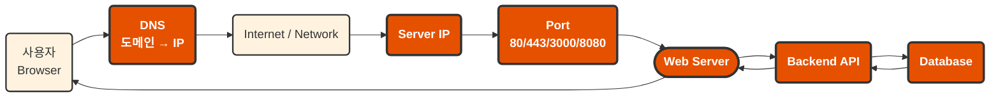
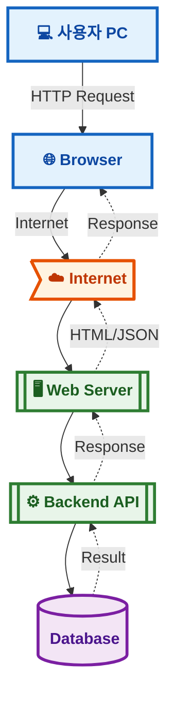
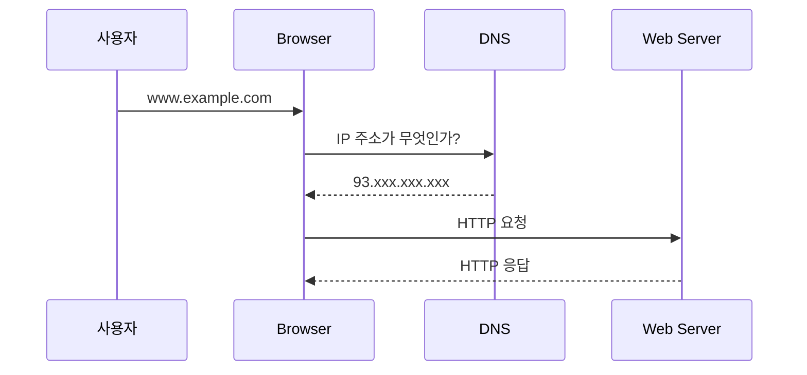
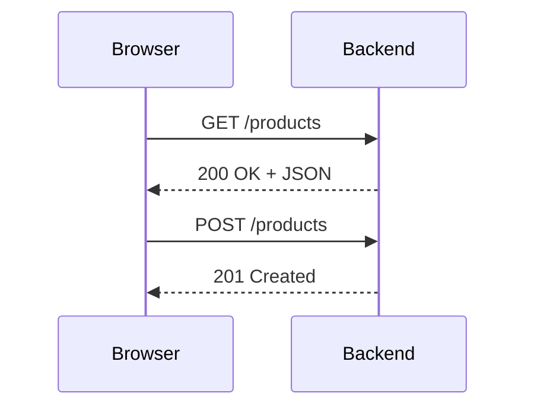
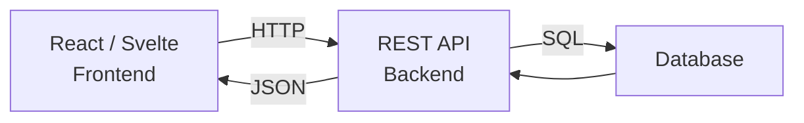
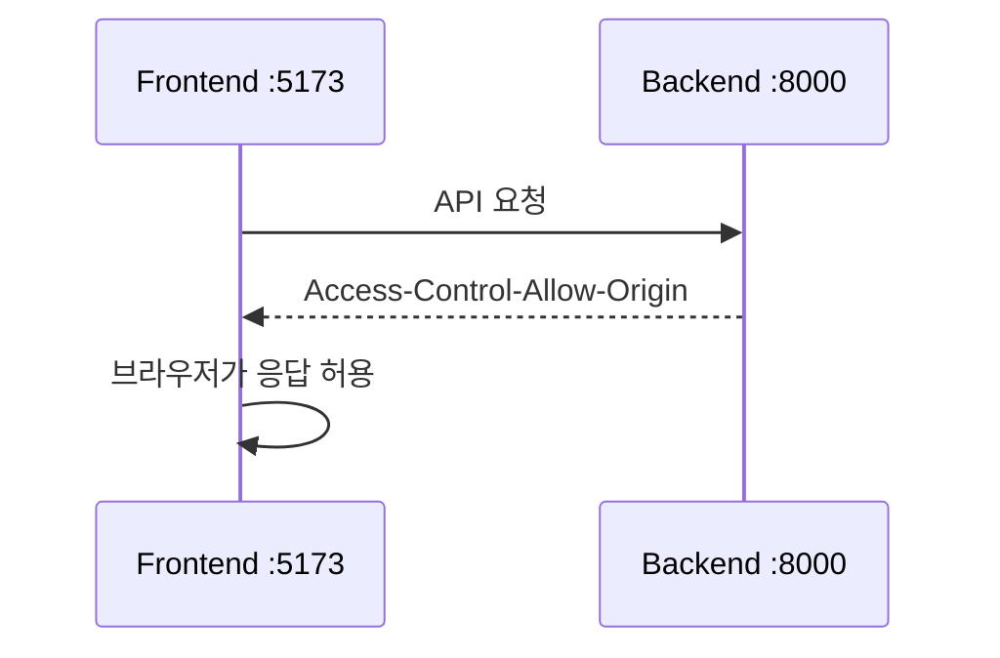
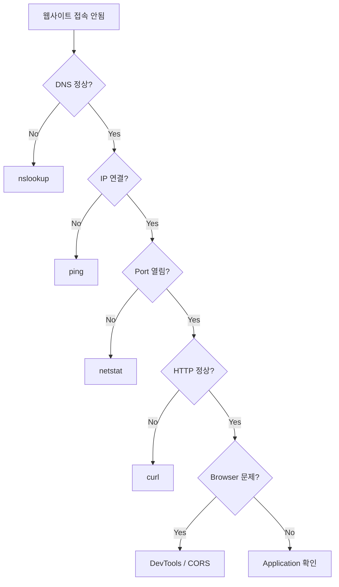
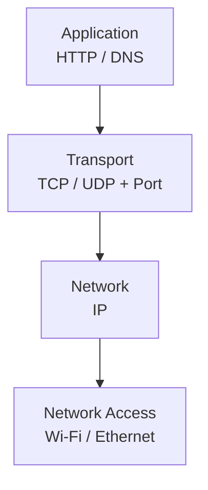
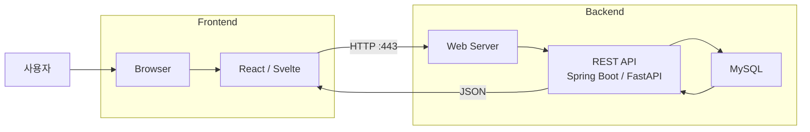

# 네트워크 기초

## 1. 전체 교육 목표

* IP, Port, DNS, TCP, HTTP/HTTPS의 역할을 설명한다.
* `localhost`, `127.0.0.1`, 사설 IP의 차이를 이해한다.
* 프론트엔드와 백엔드가 네트워크를 통해 통신하는 원리를 이해한다.
* Browser DevTools에서 HTTP 요청/응답을 분석한다.
* `ping`, `ipconfig`, `nslookup`, `netstat`, `curl`을 이용해 문제를 진단한다.
* REST API의 요청과 응답을 직접 확인한다.
* CORS 오류가 발생하는 이유를 이해하고 해결한다.
* 개발 서버를 같은 네트워크의 다른 PC에서 접속할 수 있게 설정한다.
* 웹 개발 중 발생하는 네트워크 문제를 **DNS → IP → Port → Server → HTTP → CORS** 순서로 점검한다.

---

# 2. 웹 풀스택 관점의 네트워크 전체 구조




핵심 질문은?

> `https://myshop.com/products`를 브라우저에 입력하면 무슨 일이 발생하는가?

이 질문에 답하기 위해 필요한 개념 학습

---

# 3. 8시간 교육 구성

| 교시     | 주제               |       이론 |       실습 | 핵심 내용                  |
| ------ | ---------------- | -------: | -------: | ---------------------- |
| 1      | 네트워크와 웹의 구조      |      18분 |      42분 | Client, Server, IP     |
| 2      | IP 주소와 localhost |      18분 |      42분 | IPv4, 사설IP, Gateway    |
| 3      | Port와 TCP/UDP    |      18분 |      42분 | Port, Socket, Process  |
| 4      | DNS와 도메인         |      18분 |      42분 | Domain → IP            |
| 5      | HTTP 요청/응답       |      18분 |      42분 | Method, Status, Header |
| 6      | REST API 통신      |      18분 |      42분 | JSON, curl, fetch      |
| 7      | CORS와 HTTPS      |      18분 |      42분 | Origin, CORS, TLS      |
| 8      | 네트워크 장애 분석 프로젝트  |      18분 |      42분 | DevTools, ping, curl   |
| **합계** |                  | **144분** | **336분** | **30 : 70**            |

---

# 4. 1교시 — 웹 개발자가 알아야 할 네트워크

### 이론 18분

> 네트워크를 다음 구조로 시작



> **웹 개발에서 가장 중요한 두 역할**


### 핵심 용어

* Network
* Client
* Server
* Request
* Response
* Protocol
* IP
* Port

### 실습 42분

Windows에서 자신의 네트워크를 확인합니다.

```cmd
ipconfig
```

학생들이 직접 찾아보게 합니다.

```text
IPv4 Address
Subnet Mask
Default Gateway
DNS Server
```

이어서:

```cmd
ping google.com
```

```cmd
ping 8.8.8.8
```

두 명령의 차이를 질문합니다.

---

# 5. 2교시 — IP 주소와 localhost

### 이론 18분

> IP 주소는 **“컴퓨터의 네트워크 주소”**

예:

```text
192.168.0.10
192.168.0.20
192.168.0.30
```

웹 개발자가 우선 구분해야 할 것은 세 가지입니다.

| 종류         | 예            | 의미            |
| ---------- | ------------ | ------------- |
| localhost  | localhost    | 자기 컴퓨터        |
| Loopback   | 127.0.0.1    | 자기 컴퓨터        |
| Private IP | 192.168.x.x  | 내부 네트워크       |
| Public IP  | 예: 203.x.x.x | 인터넷에서 사용하는 IP |

### 특히 중요

```text
localhost:3000
localhost:5173
localhost:8000
localhost:8080
```

> 모두 같은 컴퓨터지만 **서로 다른 프로그램**일 수 있음

---

## 실습 42분

> Python이 설치되어 있다면 별도 프로그램 없이 웹 서버를 실행할 수 있음

```cmd
mkdir network-lab
cd network-lab
```

`index.html`

```html
<!DOCTYPE html>
<html lang="ko">
<head>
    <meta charset="UTF-8">
    <title>Network Lab</title>
</head>
<body>
    <h1>Hello Network</h1>
    <p>My First Web Server</p>
</body>
</html>
```

서버 실행:

```cmd
python -m http.server 8000
```

브라우저:

```text
http://localhost:8000
```

다음 주소도 접속합니다.

```text
http://127.0.0.1:8000
```

그리고:

```cmd
ipconfig
```

자신의 IP가 `192.168.0.25`라면:

```text
http://192.168.0.25:8000
```

같은 Wi-Fi에 있는 다른 학생 PC 또는 스마트폰에서 접속해 봅니다.

이 한 번의 실습으로 학생들이

> 서버는 반드시 인터넷 어딘가에 있는 특별한 컴퓨터가 아니다.

라는 개념을 이해하게 됩니다.

---

# 6. 3교시 — Port와 TCP/UDP

### 이론 18분

IP가 **건물 주소**라면 Port는 **방 번호**로 비유할 수 있음

```text
192.168.0.10
      │
      ├── :3000   React
      ├── :5173   Vite
      ├── :8000   FastAPI
      ├── :8080   Spring Boot
      └── :3306   MySQL
```

대표적인 포트:

| Port | 용도          |
| ---: | ----------- |
|   22 | SSH         |
|   53 | DNS         |
|   80 | HTTP        |
|  443 | HTTPS       |
| 3000 | 개발 서버       |
| 3306 | MySQL       |
| 5173 | Vite        |
| 8000 | FastAPI     |
| 8080 | Spring Boot |

### TCP와 UDP

웹 개발 입문에서는 깊은 패킷 구조까지 들어가지 않음

```text
TCP
- 연결 지향
- 데이터 전달 신뢰성
- HTTP/HTTPS에서 주로 사용

UDP
- 빠름
- 연결 과정 단순
- DNS, 스트리밍, 실시간 통신 등에 사용
```

[TCP/IP 기초](./1_1_TCP_UDP.md)

※ 현대 HTTP/3에서는 QUIC/UDP가 사용됨.
[QUIC/UDP](https://judo0179.tistory.com/entry/QUIC-Quick-UDP-Internet-Connection-%EA%B0%9C%EB%85%90)

---

## 실습 42분

서버 실행:

```cmd
python -m http.server 8000
```

다른 터미널:

```cmd
netstat -ano
```

특정 포트:

```cmd
netstat -ano | findstr :8000
```

학생들에게 확인시킵니다.

```text
IP
PORT
PID
LISTENING
```

다른 포트로 서버도 실행합니다.

```cmd
python -m http.server 9000
```

그리고 각각 접속:

```text
localhost:8000
localhost:9000
```

---

# 7. 4교시 — DNS와 Domain

### 이론 18분

DNS는 개발자에게 **인터넷 전화번호부**라고 설명하면 좋음



즉:

```text
google.com
     ↓ DNS
IP Address
     ↓
Server
```

---

## 실습 42분

```cmd
nslookup google.com
```

또는:

```cmd
nslookup github.com
```

DNS 서버도 확인합니다.

```cmd
ipconfig /all
```

그리고:

```cmd
ping github.com
```

비교:

```text
Domain Name
      ↓
DNS
      ↓
IP
```

여기서 학생들에게 질문합니다.

> 인터넷은 실제로 `google.com`이라는 이름으로 서버를 찾는 것일까?

정답은 결국 IP 주소를 이용한다는 것입니다.

---

# 8. 5교시 — HTTP 요청과 응답

이 부분이 **풀스택 개발에서 가장 중요합니다.**

### 이론 18분

HTTP를 다음 한 문장으로 설명합니다.

> 브라우저와 서버가 데이터를 주고받기 위한 규칙.



HTTP Request:

```text
GET /users HTTP/1.1
Host: example.com
Accept: application/json
Authorization: Bearer ...
```

HTTP Response:

```text
HTTP/1.1 200 OK
Content-Type: application/json

{
    "name": "Kim",
    "age": 25
}
```

### 반드시 알아야 하는 Method

```text
GET       조회
POST      생성
PUT       전체 수정
PATCH     일부 수정
DELETE    삭제
```

### 반드시 알아야 하는 Status Code

```text
200 OK
201 Created

400 Bad Request
401 Unauthorized
403 Forbidden
404 Not Found

500 Internal Server Error
```

---

# 9. HTTP 실습 — Chrome DevTools

### 실습 42분

Chrome에서:

```text
F12
→ Network
```

아무 웹사이트를 접속합니다.

학생들이 직접 확인합니다.

```text
Name
Method
Status
Type
Size
Time
```

특정 요청을 선택하여:

```text
Headers
Payload
Preview
Response
Timing
```

를 확인합니다.

특히 다음 관계를 강조합니다.

```text
Frontend
    │
    │ HTTP Request
    ▼
Backend
    │
    │ JSON
    ▼
Frontend
```

---

# 10. 6교시 — REST API 네트워크 통신

### 이론 18분

풀스택의 핵심 구조입니다.



예:

```text
GET /api/users
GET /api/users/10

POST /api/users

DELETE /api/users/10
```

---

## 실습 42분 — curl

브라우저 없이 서버에 HTTP 요청을 보냅니다.

```cmd
curl https://jsonplaceholder.typicode.com/users
```

특정 사용자:

```cmd
curl https://jsonplaceholder.typicode.com/users/1
```

헤더까지 확인:

```cmd
curl -i https://jsonplaceholder.typicode.com/users/1
```

상세 통신:

```cmd
curl -v https://jsonplaceholder.typicode.com/users/1
```

---

## JavaScript에서 요청

```javascript
fetch("https://jsonplaceholder.typicode.com/users/1")
    .then(response => response.json())
    .then(data => {
        console.log(data);
    });
```

학생들에게 연결 관계를 설명합니다.

```text
JavaScript fetch()
       ↓
HTTP
       ↓
REST API
       ↓
JSON
       ↓
JavaScript Object
```

---

# 11. 7교시 — CORS와 HTTPS

### 이론 18분

풀스택 초보자가 자주 만나는 오류가 다음입니다.

```text
Access to fetch ... has been blocked by CORS policy
```

예를 들어:

```text
Frontend
http://localhost:5173

Backend
http://localhost:8000
```

Port가 다르기 때문에 **Origin이 다릅니다.**

Origin은 기본적으로:

```text
Protocol + Host + Port
```

입니다.

따라서:

```text
http://localhost:5173
http://localhost:8000
```

은 서로 다른 Origin입니다.

---

## CORS 구조



CORS는 **서버 통신 자체보다 브라우저의 보안 정책**이라는 점을 강조해야 합니다.

---

## HTTP와 HTTPS

```text
HTTP
Browser ─────── Server

HTTPS
Browser ═TLS═══ Server
```

HTTPS의 목적:

* 암호화
* 데이터 무결성
* 서버 인증

TLS 인증서의 상세 수학까지는 다루지 않아도 됩니다.

---

# 12. 8교시 — 네트워크 장애 분석 종합 실습

마지막 교시는 **네트워크 문제 해결 게임** 형태로 진행하는 것을 추천합니다.

### 이론 18분

학생들에게 다음 순서를 암기시키는 것보다 **문제 해결 순서**를 익히게 합니다.



---

# 13. 종합 실습 시나리오

학생들에게 다음 상황을 하나씩 제공합니다.

### 문제 1

```text
localhost:8000에 접속되지 않는다.
```

조사:

```cmd
netstat -ano | findstr :8000
```

원인:

```text
서버 미실행
```

---

### 문제 2

```text
localhost:9000으로 실행했는데
localhost:8000으로 접속하였다.
```

원인:

```text
Port 오류
```

---

### 문제 3

```text
도메인으로 접속되지 않는다.
```

확인:

```cmd
nslookup domain.com
```

---

### 문제 4

Frontend:

```text
localhost:5173
```

Backend:

```text
localhost:8000
```

에러:

```text
CORS policy
```

학생에게 질문합니다.

> 네트워크가 끊어진 것일까?

정답:

```text
X
브라우저의 Origin 보안 정책 문제
```

---

### 문제 5

API가:

```text
404 Not Found
```

학생이 점검해야 할 것:

```text
IP?
Port?
Server?
URL?
HTTP Method?
API Path?
```

예:

```text
GET /api/user
```

인데 실제 서버는:

```text
GET /api/users
```

---

# 14. 반드시 가르칠 내용 / 과감히 줄여도 되는 내용

8시간 과정이라면 범위를 제한하는 것이 중요합니다.

### 반드시 교육

* Client / Server
* IP
* localhost
* 사설 IP
* Port
* TCP 개념
* DNS
* Domain
* HTTP / HTTPS
* Request / Response
* HTTP Method
* HTTP Status Code
* Header
* JSON
* REST API
* CORS
* Browser DevTools
* ping
* ipconfig
* nslookup
* netstat
* curl

### 개념만 소개

* Router
* Gateway
* NAT
* Firewall
* TCP 3-Way Handshake
* TLS
* Proxy / Reverse Proxy

### 8시간에서는 생략해도 되는 내용

* OSI 7 Layer 암기
* IPv4 Subnet 계산
* CIDR 계산 문제
* 라우팅 프로토콜
* RIP
* OSPF
* BGP
* VLAN
* STP
* 스위치 구성
* Cisco CLI

네트워크 엔지니어 교육에는 필요하지만 **풀스택 개발자 입문 과정에서는 투자 시간 대비 효과가 낮음**

---

# 15. 개발자에게 특히 중요한 OSI 설명 방법

OSI 7계층 전체를 암기하게 하기보다 웹 개발 관점에서 4단계 정도로 단순화하는 것이 좋음



> 다음만 이해하면 충분

```text
HTTP
 ↓
TCP + Port
 ↓
IP
 ↓
Wi-Fi / Ethernet
```

예를 들어:

```text
https://example.com:443/users
```

를 분해하면:

```text
https        → Protocol
example.com  → Domain
443          → Port
/users       → Resource Path
```

DNS가 처리된 이후에는:

```text
example.com
      ↓
93.xxx.xxx.xxx
```

가 됩니다.

---

# 16. 풀스택 개발과 연결해서 설명할 핵심

> **React/Svelte + Spring Boot/FastAPI** 등을 배울 때 다음 구조가 머릿속에 그려져야 함



예를 들어 학생들이 다음 코드를 볼 때:

```javascript
fetch("http://localhost:8000/api/users")
```

단순한 JavaScript 문법으로 보지 말고:

```text
http
 │
 ├── Protocol

localhost
 │
 ├── Host

8000
 │
 ├── Port

/api/users
 │
 └── Resource
```

로 해석할 수 있어야 합니다.

이 능력이 이후 **프론트엔드·백엔드 통합 과정에서 매우 중요합니다.**

---

# 17. 마지막 평가 실습

학생들에게 다음 상황을 제시합니다.

> React 프론트엔드는 `localhost:5173`, FastAPI 백엔드는 `localhost:8000`에서 실행 중이다. React에서 `/api/users`를 호출했는데 데이터를 가져오지 못한다. 원인을 조사하시오.

학생들이 다음 순서로 조사하도록 합니다.

```text
① Backend 서버 실행 여부
        ↓
② IP 확인
        ↓
③ Port 확인
        ↓
④ curl로 API 직접 호출
        ↓
⑤ HTTP Status 확인
        ↓
⑥ Chrome Network 확인
        ↓
⑦ Response 확인
        ↓
⑧ CORS 확인
```

사용 명령:

```cmd
ipconfig
```

```cmd
netstat -ano | findstr :8000
```

```cmd
curl http://localhost:8000/api/users
```

브라우저:

```text
F12
→ Network
→ Fetch/XHR
→ Request
→ Response
```

> 이 평가를 통과하면 단순히 네트워크 용어를 외운 것이 아니라 **실제 풀스택 개발에서 네트워크를 사용할 수 있는 수준**이라고 볼 수 있음

---

## 18. 네트워크에서 가장 중요한 내용

> 개발자라면 아래 같은 비중으로 학습


특히 **HTTP + REST API + Chrome DevTools** 에 전체 시간의 약 50%를 학습할 것을 권함

풀스택 개발자에게 네트워크 지식의 핵심은 **“패킷 구조를 암기하는 것”이 아니라 `브라우저 → 프론트엔드 → HTTP → 백엔드 → DB`의 흐름을 이해하고, 어디에서 문제가 생겼는지를 스스로 추적하는 능력**이기 때문입니다.

이 과정을 끝낸 다음에는 자연스럽게 **React/Svelte → REST API → Spring Boot/FastAPI → MySQL → Docker → Nginx → Cloud 배포** 과정으로 연결하기 좋음
