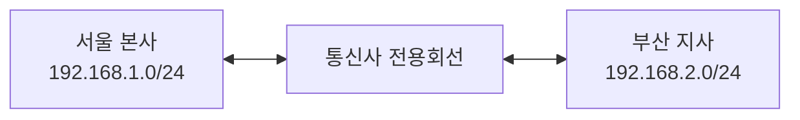
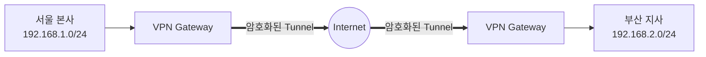
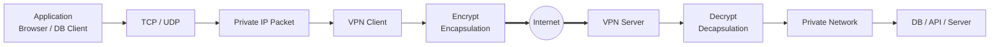
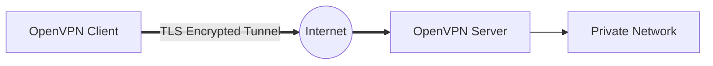
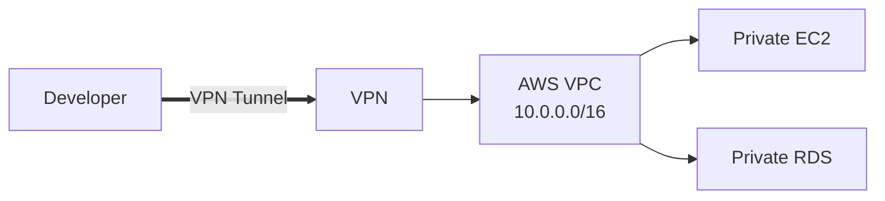
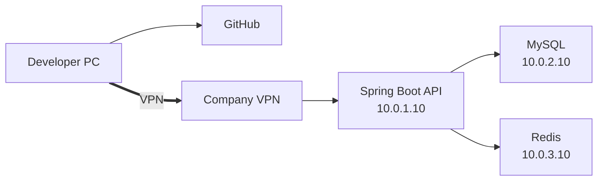
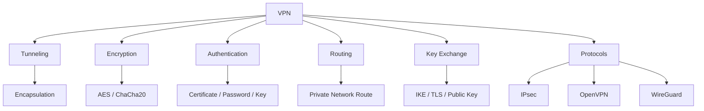
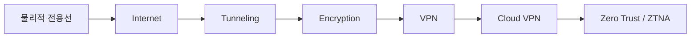

# VPN(Virtual Private Network)

> 개발자 관점에서 VPN을 이해할 때는 단순히 **“IP를 숨기는 기술”**로 접근하기보다, **“공용 네트워크인 인터넷 위에 논리적으로 사설망을 만드는 기술”**로 이해하는 것이 정확합니다.
> 웹 개발자나 클라우드 개발자가 VPN을 알아야 하는 핵심 이유는 **사설 IP, 라우팅, 터널링, 암호화, 인증, 방화벽**이 실제 서비스 인프라와 직접 연결되기 때문입니다.

# 1. VPN은 왜 등장했는가?

VPN이 필요해진 가장 큰 이유는 다음 요구 때문입니다.

> **멀리 떨어진 컴퓨터와 네트워크를 안전하게 하나의 사설 네트워크처럼 연결하고 싶다.**

인터넷이 널리 보급되기 전에는 기업 본사와 지사를 연결하기 위해 전용선을 사용했습니다.

```text
서울 본사 ================= 부산 지사
          전용회선
```

전용선은 안정적이고 외부에서 접근하기 어렵지만 큰 문제가 있었습니다.

* 설치 비용이 높음
* 지역이 늘어날수록 비용 증가
* 직원 개인 PC의 원격 접속이 어려움
* 해외 지사 연결 비용이 매우 높음
* 네트워크 구성을 빠르게 확장하기 어려움

인터넷이 보급되면서 다음과 같은 생각이 등장합니다.

```text
비싼 전용선을 직접 설치하지 말고

기존 인터넷망을 사용하면서

마치 전용선처럼 안전하게 연결할 수 없을까?
```

여기에서 나온 기술이 **VPN(Virtual Private Network)** 입니다.

---

# 2. VPN 이전 방식과 VPN의 차이

기존 전용선 구조는 다음과 같습니다.



기업 입장에서는 전용회선을 직접 임대해야 했습니다.

VPN을 사용하면 인터넷 자체를 전달망으로 사용할 수 있습니다.



핵심적인 변화는 다음과 같습니다.

| 기존       | VPN            |
| -------- | -------------- |
| 물리적인 전용망 | 가상의 전용망        |
| 전용회선 필요  | 인터넷 사용         |
| 구축 비용 높음 | 상대적으로 저렴       |
| 확장 어려움   | 비교적 쉽게 확장      |
| 지점 중심    | 지점 + 개인 사용자    |
| 통신사 의존   | 소프트웨어 기반 구성 가능 |

즉,

> **VPN은 물리적인 Private Network를 논리적인 Virtual Private Network로 바꾼 기술이다.**

---

# 3. VPN을 이해하기 위한 가장 중요한 개념: 터널링

VPN의 핵심 기술 중 하나가 **Tunneling**입니다.

원래 전달하려는 IP 패킷이 있다고 가정합니다.

```text
Original Packet

┌───────────────────────────────┐
│ Source      192.168.1.10      │
│ Destination 192.168.2.20      │
│ Data        Hello             │
└───────────────────────────────┘
```

하지만 인터넷은 일반적으로 `192.168.x.x` 같은 사설 IP를 직접 전달하지 않습니다.

VPN은 이 패킷을 다른 패킷 안에 넣습니다.

```text
VPN Packet

┌────────────────────────────────────┐
│ Public IP Header                   │
│                                    │
│   ┌────────────────────────────┐   │
│   │ Private IP Packet          │   │
│   │                            │   │
│   │ 192.168.1.10               │   │
│   │       ↓                    │   │
│   │ 192.168.2.20               │   │
│   └────────────────────────────┘   │
└────────────────────────────────────┘
```

이 과정을 **Encapsulation(캡슐화)**이라고 합니다.

개발자에게 익숙한 방식으로 비유하면 다음과 비슷합니다.

```text
HTTP Body 안에 JSON을 넣는 것

JSON
↓
HTTP
↓
TCP
↓
IP
```

VPN에서도 비슷하게

```text
Private IP Packet
        ↓
VPN Encryption
        ↓
VPN Header
        ↓
Public IP Packet
```

형태로 패킷을 감쌉니다.

---

# 4. VPN의 전체 동작 구조

VPN은 보통 다음 과정을 거칩니다.



예를 들어 개발자의 노트북이 회사 DB에 접근한다고 가정합니다.

회사 내부 DB:

```text
10.0.1.20:3306
```

이 주소는 인터넷에서는 접근할 수 없습니다.

그런데 VPN을 연결하면 개발자 PC가 논리적으로 회사 네트워크에 들어갑니다.

```text
Developer PC
192.168.0.10

       ↓ VPN

VPN Network
10.0.100.15

       ↓

Company Network

10.0.1.20
MySQL
```

그래서 개발자는

```bash
mysql -h 10.0.1.20 -u developer -p
```

처럼 내부 서버에 접근할 수 있습니다.

---

# 5. VPN은 무엇을 개선했는가?

VPN이 개선한 것은 단순히 **보안** 하나가 아닙니다.

### ① 전용선 비용

기존:

```text
서울 ================= 부산
       전용회선
```

VPN:

```text
서울 ----\
          Internet
부산 ----/
```

기존 인터넷 인프라를 활용합니다.

---

### ② 원격 근무

과거에는 내부 서버는 사무실에서만 사용할 수 있었습니다.

```text
회사 PC
   ↓
사내 네트워크
   ↓
Git / DB / File Server
```

VPN 이후:

```text
집
Developer Laptop
      │
      │ VPN
      ▼
Internet
      │
      ▼
Company VPN Gateway
      │
      ▼
Git / DB / API / Server
```

재택근무와 원격 개발 환경이 가능해졌습니다.

---

### ③ 지점 간 네트워크

VPN은 기업 지점 전체를 연결할 수도 있습니다.

이를 **Site-to-Site VPN**이라고 합니다.


사용자는 VPN이 있다는 사실을 몰라도 됩니다.

---

# 6. 개발자가 반드시 구분해야 하는 VPN 두 종류

## Remote Access VPN

개별 사용자가 회사 네트워크에 접속합니다.

```text
Developer Laptop
       │
       │ VPN
       ▼
Company Network
```

예:

* 재택 개발자
* 외부 출장
* 운영 서버 관리
* 내부 Git 서버 접근
* 내부 DB 접근

---

## Site-to-Site VPN

네트워크와 네트워크를 연결합니다.

```text
AWS VPC
   │
   VPN
   │
회사 IDC
```

또는

```text
AWS
 │
VPN
 │
GCP
```

클라우드 환경에서 매우 중요합니다.

---

# 7. VPN에서 암호화가 필요한 이유

단순 터널링만 하면 중간에서 패킷을 볼 수 있습니다.

```text
Developer
   ↓

Internet

   ↓

Company
```

인터넷 중간에는 여러 네트워크 장비가 존재합니다.

VPN은 패킷을 암호화합니다.

```text
Original

ID=simple
Password=1234
```

↓

```text
Encrypted

8a71f923bd78ad....
```

그래서 VPN은 일반적으로 다음 기능을 제공합니다.

```text
Encryption
Authentication
Integrity
Tunneling
```

한국어로 보면

```text
암호화
인증
무결성 검증
터널링
```

입니다.

---

# 8. 개발자가 알아야 할 대표 VPN 기술

VPN 자체는 하나의 프로토콜이 아닙니다.

여러 VPN 기술이 존재합니다.

| 기술          | 특징              |
| ----------- | --------------- |
| PPTP        | 오래된 기술, 보안 취약   |
| L2TP        | Layer 2 터널      |
| IPsec       | 네트워크 계층 VPN     |
| OpenVPN     | TLS 기반 오픈소스 VPN |
| WireGuard   | 현대적이고 단순한 VPN   |
| SSL/TLS VPN | HTTPS 계열 기술 활용  |

현재 개발자가 특히 알아둘 것은 크게 세 가지입니다.

```text
IPsec
OpenVPN
WireGuard
```

---

# 9. IPsec

IPsec은 이름 그대로

> **IP Security**

입니다.

IP 계층에서 패킷을 보호합니다.

```text
Application
────────────────
HTTP
────────────────
TCP
────────────────
IP     ← IPsec
────────────────
Ethernet
```

그래서 특정 애플리케이션이 아니라 네트워크 트래픽 전체를 보호할 수 있습니다.

주로

```text
기업 ↔ 기업
IDC ↔ Cloud
AWS ↔ 회사
Cloud ↔ Cloud
```

같은 **Site-to-Site VPN**에서 많이 사용됩니다.

---

# 10. IPsec의 Tunnel Mode

일반 패킷:

```text
┌───────────┬──────────┐
│ IP Header │ Data     │
└───────────┴──────────┘
```

IPsec Tunnel Mode:

```text
┌────────────┬─────────────────────────┐
│ New IP     │ Encrypted Original IP   │
│ Header     │ Packet                   │
└────────────┴─────────────────────────┘
```

즉,

```text
Original IP Packet

        ↓

Encryption

        ↓

New IP Packet

        ↓

Internet
```

이 됩니다.

---

# 11. OpenVPN

OpenVPN은 오픈소스 VPN 소프트웨어입니다.

일반적인 구조는 다음과 같습니다.



특징:

* TLS 사용
* 인증서 기반 인증 가능
* TCP / UDP 지원
* Windows / Linux / macOS 지원
* 비교적 설정 자유도가 높음

---

# 12. WireGuard

WireGuard는 비교적 현대적인 VPN 기술입니다.

목표가 상당히 명확합니다.

> **VPN을 더 단순하고 빠르게 만들자.**

기존 VPN은 설정이 상당히 복잡할 수 있습니다.

WireGuard는 Public Key 기반 구성이 매우 단순합니다.

예:

```ini
[Interface]
PrivateKey = CLIENT_PRIVATE_KEY
Address = 10.0.0.2/24

[Peer]
PublicKey = SERVER_PUBLIC_KEY
Endpoint = vpn.example.com:51820
AllowedIPs = 10.0.0.0/24
```

개발자가 보면 SSH와 비슷한 느낌을 받을 수 있습니다.

```text
Private Key
Public Key
Peer
```

구조입니다.

---

# 13. VPN과 SSH Tunnel의 차이

개발자가 많이 혼동하는 부분입니다.

SSH 터널:

```bash
ssh -L 3306:10.0.1.20:3306 user@server
```

구조:

```text
localhost:3306

     ↓

SSH Tunnel

     ↓

10.0.1.20:3306
```

보통 특정 포트나 서비스에 사용합니다.

반면 VPN은

```text
10.0.0.0/16
172.16.0.0/16
192.168.0.0/16
```

같은 **네트워크 자체에 접근할 수 있도록 라우팅**할 수 있습니다.

즉,

```text
SSH Tunnel
= 특정 연결을 터널링

VPN
= 네트워크 전체를 터널링
```

으로 이해하면 쉽습니다.

---

# 14. VPN에서 개발자가 가장 중요하게 알아야 하는 Routing

실제로 개발자가 VPN 문제를 만났을 때 암호화 알고리즘보다 훨씬 자주 보는 것이 **라우팅 문제**입니다.

VPN 연결 전:

```bash
route print
```

또는 Linux:

```bash
ip route
```

예:

```text
default via 192.168.0.1

192.168.0.0/24
```

VPN 연결 후:

```text
10.0.0.0/8
        ↓
tun0
```

같은 라우팅이 추가될 수 있습니다.

즉,

```text
10.x.x.x 주소는 VPN으로 보내라
```

라는 규칙이 만들어지는 것입니다.

---

# 15. Split Tunnel

개발자가 알아둘 가치가 높은 개념입니다.

VPN을 연결했을 때 모든 인터넷 트래픽을 VPN으로 보낼 수도 있습니다.

### Full Tunnel

```text
Developer
    │
    ▼
   VPN
    │
    ▼
Company
    │
    ▼
Internet
```

Google, YouTube, GitHub도 모두 회사 VPN을 거칩니다.

반대로 특정 네트워크만 VPN으로 보낼 수도 있습니다.

### Split Tunnel

```text
                 → GitHub
                /
Developer ─────┤
                \
                 → VPN → Company DB
```

예:

```text
10.0.0.0/8
→ VPN

나머지
→ 일반 Internet
```

이를 **Split Tunneling**이라고 합니다.

---

# 16. 개발 중 VPN 때문에 자주 발생하는 문제

VPN을 사용하면 다음 문제가 자주 발생합니다.

### 문제 1. API가 갑자기 접근되지 않음

예:

```text
http://10.10.1.15:8080
```

원인:

```text
VPN routing 문제
```

확인:

```bash
ping 10.10.1.15
```

```bash
traceroute 10.10.1.15
```

Windows:

```powershell
tracert 10.10.1.15
```

---

### 문제 2. DNS 문제

VPN 연결 후 회사 내부 DNS를 사용하게 될 수 있습니다.

예:

```text
db.company.local
```

VPN 연결 전:

```text
DNS 조회 실패
```

VPN 연결 후:

```text
db.company.local
→ 10.10.2.15
```

따라서 VPN 문제를 디버깅할 때 다음도 중요합니다.

```bash
nslookup db.company.local
```

---

# 17. MTU 문제

조금 더 개발자/네트워크 엔지니어 수준으로 올라가면 **MTU**도 중요합니다.

VPN은 기존 패킷에 헤더를 추가합니다.

예를 들어 원래 Ethernet MTU가

```text
1500 bytes
```

인데 VPN 헤더가 추가되면

```text
1500
+ VPN Header
```

가 되어 패킷이 너무 커질 수 있습니다.

그래서 VPN 인터페이스에서는

```text
MTU 1420
MTU 1400
```

등으로 설정하기도 합니다.

이 문제가 발생하면 특이하게도

```text
ping은 됨
로그인도 됨
그런데 큰 HTTP 요청이 실패함
```

같은 현상이 나타날 수 있습니다.

개발자가 VPN 환경의 이상한 네트워크 문제를 만났을 때 알아둘 가치가 있습니다.

---

# 18. NAT와 VPN

VPN은 NAT와도 깊게 연관됩니다.

가정 공유기:

```text
192.168.0.10

       ↓ NAT

203.x.x.x
```

VPN은 NAT 환경에서도 통신해야 합니다.

특히 IPsec에서는 이를 위해

**NAT Traversal, NAT-T**

같은 기술을 사용합니다.

보통 UDP 4500 등을 이용합니다.

따라서 방화벽에서

```text
UDP 500
UDP 4500
```

과 같은 포트가 등장하면 IPsec VPN일 가능성이 있습니다.

---

# 19. VPN과 Cloud

현재 개발자가 VPN을 공부해야 하는 가장 현실적인 이유입니다.

AWS 환경을 예로 들면 다음과 같습니다.



보안을 위해 DB를 인터넷에 공개하지 않습니다.

잘못된 구조:

```text
Internet
   ↓
RDS
Public IP
```

권장되는 구조 중 하나:

```text
Developer
   ↓
VPN
   ↓
Private Network
   ↓
RDS
```

DB는

```text
10.0.10.20
```

같은 Private IP만 가지고 있어도 됩니다.

---

# 20. 웹 개발자의 실제 VPN 사용 사례

예를 들어 다음 서비스를 개발한다고 가정합니다.



개발자는 GitHub는 인터넷으로 접근하면서

```text
github.com
```

운영 DB는 VPN을 통해 접근합니다.

```text
10.0.2.10:3306
```

이 구조가 실제 기업 개발 환경과 상당히 가깝습니다.

---

# 21. VPN과 방화벽의 관계

VPN에 연결했다고 모든 서버에 접근할 수 있는 것은 아닙니다.

예:

```text
Developer
     ↓
VPN
     ↓
Firewall
     ↓
DB
```

방화벽에서

```text
Source
10.10.100.0/24

Destination
10.10.10.20

Port
3306
```

만 허용할 수 있습니다.

즉,

```text
VPN
≠ 모든 접근 허용
```

입니다.

VPN은 **네트워크 연결 통로**이고,

접근 정책은 별도로

```text
Firewall
Security Group
ACL
IAM
Zero Trust Policy
```

등에서 관리합니다.

---

# 22. VPN과 HTTPS 차이

비전공자가 특히 혼동하기 쉬운 부분입니다.

HTTPS:

```text
Browser
     │
     │ TLS
     ▼
Web Server
```

특정 애플리케이션 통신을 암호화합니다.

VPN:

```text
Application
HTTP
SSH
MySQL
Redis
...
     │
     ▼
VPN Tunnel
```

여러 네트워크 트래픽을 보호할 수 있습니다.

정리하면

```text
HTTPS
Application-level protection

VPN
Network-level secure connection
```

정도로 이해할 수 있습니다.

---

# 23. VPN이 익명성을 보장하는 기술은 아니다

이 부분도 중요합니다.

흔히

```text
VPN = IP 숨기기
```

라고 생각하지만 본질은 아닙니다.

VPN의 본질은

> **Public Network 위에서 Private Network 연결을 제공하는 것**

입니다.

VPN 사업자를 이용하면 외부 웹사이트에서는

```text
사용자 IP
↓
VPN Server IP
```

로 보일 수 있지만 이것은 VPN 구조에서 발생하는 하나의 결과입니다.

---

# 24. VPN 기술의 핵심 구조

개발자 수준에서 다음 구조까지 이해하면 충분히 유용합니다.



---

# 25. 개발자가 VPN에서 반드시 알아야 할 내용

VPN을 직접 구현하는 개발자가 아니라 일반적인 **웹·백엔드·클라우드 개발자**라면 다음 정도를 우선적으로 이해하는 것이 좋습니다.

### 필수

```text
① Public IP / Private IP
② NAT
③ Routing
④ Tunnel
⑤ Encryption
⑥ VPN Gateway
⑦ Remote Access VPN
⑧ Site-to-Site VPN
⑨ Full Tunnel / Split Tunnel
⑩ Firewall / Port
```

### 한 단계 높은 수준

```text
IPsec
OpenVPN
WireGuard

IKE
TLS
Public Key

NAT-T
MTU
MSS
DNS Routing
```

### 클라우드 개발자

```text
VPC
Subnet
Routing Table
Security Group
Private Endpoint
VPN Gateway
Site-to-Site VPN
Bastion Host
Zero Trust
```

까지 연결해서 이해하는 것이 좋습니다.

---

# 26. 기술 발전 흐름으로 이해하기

VPN은 독립적으로 갑자기 등장한 기술이라기보다 다음과 같은 네트워크 기술 발전 흐름에서 이해하면 훨씬 쉽습니다.



전체적인 변화는

```text
물리적으로 분리된 네트워크

        ↓

공용 인터넷 활용

        ↓

터널링

        ↓

암호화 + 인증

        ↓

VPN

        ↓

Cloud VPN

        ↓

Zero Trust / ZTNA
```

방향으로 발전했다고 볼 수 있습니다.

VPN 이후에는 다시

> **“회사 네트워크에 들어왔다는 이유만으로 모든 것을 신뢰해도 되는가?”**

라는 문제가 제기되면서 Zero Trust, ZTNA 같은 접근 방식이 중요해지고 있습니다.

---

# 27. 개발자 관점에서 가장 중요한 한 장 요약

```text
                 ┌───────────────────┐
                 │     Internet      │
                 │   Public Network  │
                 └────────┬──────────┘
                          │
                 Encrypted Tunnel
                          │
        ┌─────────────────┴─────────────────┐

 Developer                                  Company

192.168.0.10                         10.0.0.0/16
      │                                     │
      │                                     │
VPN Client                            VPN Gateway
      │                                     │
      └──────── Encrypted Tunnel ───────────┘
                                            │
                         ┌──────────────────┼──────────────┐
                         │                  │              │
                        API                 DB            Redis
                    10.0.1.10          10.0.2.10     10.0.3.10
```

결국 개발자가 VPN을 이해할 때 가장 중요한 문장은 이것입니다.

> **VPN은 인터넷이라는 공용 네트워크 위에 암호화된 터널을 만들고, 라우팅을 이용하여 원격 사용자나 네트워크를 하나의 사설 네트워크처럼 연결하는 기술이다.**

특히 개발 실무에서는 **암호화 알고리즘 자체보다 `Private IP → VPN Tunnel → Routing → Firewall → Server`의 흐름을 이해하는 것이 훨씬 중요합니다.** 이 구조를 이해하면 AWS VPC, 사내 DB 접근, Private API, 원격 개발 환경, Site-to-Site VPN 같은 클라우드 네트워크 개념도 자연스럽게 연결됩니다.
